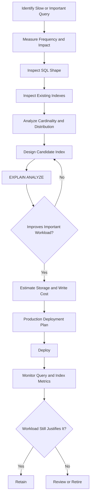

# 27- Scenario Based Indexing

## Overview

Scenario-based indexing is the practice of selecting indexes by starting with a concrete production workload and determining the access path that best serves it.

Instead of asking:

> "Which columns should have indexes?"

ask:

> "Given this query, data distribution, traffic pattern, and latency requirement, what access path should the database use?"

A production index decision usually combines:

```text
Query shape
    +
Data distribution
    +
Cardinality / selectivity
    +
Ordering requirements
    +
Result size
    +
Read/write ratio
    +
Existing indexes
    +
Operational constraints
    ↓
Candidate index
    ↓
EXPLAIN ANALYZE
    ↓
Production measurement
```

This approach is particularly important for large backend systems where an index can improve request latency while simultaneously increasing write amplification, storage consumption, memory pressure, and replication traffic.

## Scenario Analysis Framework

For each indexing scenario, evaluate:

| Dimension | Question |
|---|---|
| Query shape | What does `WHERE`, `JOIN`, `ORDER BY`, and `GROUP BY` look like? |
| Frequency | How often does the query execute? |
| Criticality | Is it on a customer-facing or transactional path? |
| Selectivity | How many rows does the predicate eliminate? |
| Cardinality | How many distinct values exist? |
| Ordering | Can an index provide the requested order? |
| Result size | Does the query return 10 rows or 10 million? |
| Data distribution | Are values uniformly distributed or skewed? |
| Write rate | How expensive will maintaining the index be? |
| Existing indexes | Can an existing index already support the query? |
| Lifecycle | How will the index be deployed, monitored, and retired? |

The strongest index designs solve a specific workload rather than following generic rules.

## Scenario: Primary-Key Lookup

Query:

```sql
SELECT id, email, created_at
FROM users
WHERE id = $1;
```

The primary key already provides the required lookup structure:

```sql
CREATE TABLE users (
    id BIGINT PRIMARY KEY,
    email TEXT NOT NULL,
    created_at TIMESTAMPTZ NOT NULL
);
```

### Why This Works

The database can navigate directly through the primary-key index rather than scanning the table.

### Production Guidance

Do not create another index on the primary key:

```sql
CREATE INDEX idx_users_id ON users (id);
```

This is normally redundant.

The primary key already creates the required unique index in PostgreSQL.

## Scenario: Unique Business Identifier

Suppose an API frequently retrieves users by email:

```sql
SELECT id, email
FROM users
WHERE email = $1;
```

and email must be unique.

Use:

```sql
CREATE UNIQUE INDEX idx_users_email
ON users (email);
```

A unique index provides both:

- Efficient lookup.
- Uniqueness enforcement.

If application semantics require case-insensitive email uniqueness, the indexing strategy may need to reflect the normalized representation rather than the raw column.

For PostgreSQL:

```sql
CREATE UNIQUE INDEX idx_users_lower_email
ON users (lower(email));
```

The query should use the same expression:

```sql
SELECT id
FROM users
WHERE lower(email) = lower($1);
```

## Scenario: Filtering by One Column

Query:

```sql
SELECT id, total, created_at
FROM orders
WHERE customer_id = $1;
```

Candidate:

```sql
CREATE INDEX idx_orders_customer
ON orders (customer_id);
```

This is appropriate when:

- The table is sufficiently large.
- The query is frequent.
- `customer_id` meaningfully reduces the search space.
- No existing composite index already provides the required access path.

A small table may still be scanned sequentially because the cost of using an index can exceed the cost of scanning the table.

## Scenario: Equality + Equality

Query:

```sql
SELECT id, total
FROM orders
WHERE tenant_id = $1
  AND customer_id = $2;
```

Candidate:

```sql
CREATE INDEX idx_orders_tenant_customer
ON orders (tenant_id, customer_id);
```

This represents a recurring access pattern:

```text
tenant boundary
      ↓
customer within tenant
      ↓
matching orders
```

This is often more useful than treating the two predicates as unrelated indexing problems.

## Scenario: Equality + Range

Query:

```sql
SELECT id, total, created_at
FROM orders
WHERE tenant_id = $1
  AND created_at >= $2
  AND created_at < $3;
```

Candidate:

```sql
CREATE INDEX idx_orders_tenant_created
ON orders (tenant_id, created_at);
```

The index can first locate the relevant tenant and then traverse the timestamp range.

This pattern is common in:

- Audit logs.
- Financial transactions.
- Orders.
- Events.
- Metrics.
- Notifications.
- Time-series-like application tables.

## Scenario: Filtering + ORDER BY

Query:

```sql
SELECT id, created_at, total
FROM orders
WHERE tenant_id = $1
  AND status = $2
ORDER BY created_at DESC
LIMIT 50;
```

Candidate:

```sql
CREATE INDEX idx_orders_tenant_status_created
ON orders (
    tenant_id,
    status,
    created_at DESC
);
```

The index matches the workload:

```text
tenant_id
    ↓
status
    ↓
created_at DESC
    ↓
first 50 rows
```

This can avoid an expensive sort and allow the database to stop early because of the `LIMIT`.

Validate the actual plan:

```sql
EXPLAIN (ANALYZE, BUFFERS)
SELECT id, created_at, total
FROM orders
WHERE tenant_id = 42
  AND status = 'pending'
ORDER BY created_at DESC
LIMIT 50;
```

## Scenario: Recent Records

A common backend endpoint is:

```text
GET /api/orders/recent
```

Query:

```sql
SELECT id, created_at, total
FROM orders
WHERE tenant_id = $1
ORDER BY created_at DESC
LIMIT 100;
```

Candidate:

```sql
CREATE INDEX idx_orders_tenant_created
ON orders (tenant_id, created_at DESC);
```

This is usually preferable to separately indexing:

```text
tenant_id
created_at
```

when this combined access pattern dominates the workload.

The index directly represents the API's data-access requirement.

## Scenario: Keyset Pagination

Suppose an endpoint currently uses:

```sql
SELECT id, created_at, total
FROM orders
WHERE tenant_id = $1
ORDER BY created_at DESC, id DESC
LIMIT 50 OFFSET 100000;
```

Large offsets can require the database to process and discard many earlier rows.

A keyset design uses the last row from the previous page:

```sql
SELECT id, created_at, total
FROM orders
WHERE tenant_id = $1
  AND (created_at, id) < ($2, $3)
ORDER BY created_at DESC, id DESC
LIMIT 50;
```

Candidate:

```sql
CREATE INDEX idx_orders_tenant_created_id
ON orders (
    tenant_id,
    created_at DESC,
    id DESC
);
```

The `id` tie-breaker provides deterministic ordering when timestamps are identical.

This is a strong pattern for:

- REST APIs.
- gRPC services.
- Activity feeds.
- Message lists.
- Large administrative interfaces.

## Scenario: Foreign-Key JOIN

Consider:

```sql
SELECT
    o.id,
    o.total,
    c.email
FROM customers c
JOIN orders o
    ON o.customer_id = c.id
WHERE c.id = $1;
```

An index on the child-side foreign key can make repeated lookups efficient:

```sql
CREATE INDEX idx_orders_customer
ON orders (customer_id);
```

The access pattern is:

```text
Customer ID known
      ↓
Find matching orders
      ↓
Return order rows
```

For large child tables, this can be substantially more important than indexing the parent primary key, which is normally already indexed.

### Important Distinction

A foreign-key column does not automatically need an index in every database or workload.

Index it when the workload benefits from efficient:

- Joins.
- Parent deletion/update checks.
- Child lookups.
- Relationship traversal.

## Scenario: Multi-Tenant SaaS

Suppose most API queries are tenant-scoped:

```sql
SELECT id, name, created_at
FROM projects
WHERE tenant_id = $1
ORDER BY created_at DESC
LIMIT 50;
```

Candidate:

```sql
CREATE INDEX idx_projects_tenant_created
ON projects (tenant_id, created_at DESC);
```

This aligns the index with the application's dominant access boundary.

However, do not mechanically put `tenant_id` first on every index.

If a query genuinely operates globally:

```sql
SELECT id
FROM projects
WHERE external_id = $1;
```

then:

```sql
CREATE INDEX idx_projects_external_id
ON projects (external_id);
```

may be more appropriate.

Index design should follow the query's access pattern, not a blanket multi-tenancy rule.

## Scenario: Low-Cardinality Status

Suppose:

```sql
SELECT id
FROM jobs
WHERE status = 'completed';
```

The table contains:

```text
status = completed: 90%
status = pending:    5%
status = failed:     5%
```

A standalone index on `status` may not be very useful for the `completed` query because most rows qualify.

The planner may prefer a sequential scan.

Instead, the application may have a more selective operational query:

```sql
SELECT id, created_at
FROM jobs
WHERE tenant_id = $1
  AND status = 'pending'
ORDER BY created_at
LIMIT 100;
```

Candidate:

```sql
CREATE INDEX idx_jobs_tenant_status_created
ON jobs (tenant_id, status, created_at);
```

The important lesson is:

> Low cardinality does not automatically make an index useless; usefulness depends on the complete predicate and workload.

## Scenario: Small Active Subset

Suppose only pending jobs need frequent access:

```sql
SELECT id, created_at
FROM jobs
WHERE tenant_id = $1
  AND status = 'pending'
ORDER BY created_at
LIMIT 100;
```

If pending jobs represent a small portion of the table, a partial index can be appropriate:

```sql
CREATE INDEX idx_jobs_pending
ON jobs (tenant_id, created_at)
WHERE status = 'pending';
```

This can reduce:

- Index size.
- Maintenance work for irrelevant rows.
- Cache footprint.

The query predicate must be compatible with the index predicate for the optimizer to use the partial index.

## Scenario: Soft Deletes

Suppose the application almost always queries active users:

```sql
SELECT id, email
FROM users
WHERE deleted_at IS NULL
  AND email = $1;
```

A partial index can represent that workload:

```sql
CREATE INDEX idx_users_active_email
ON users (email)
WHERE deleted_at IS NULL;
```

This is particularly useful when deleted records significantly outnumber active records.

For example:

```text
Active: 20 million
Deleted: 180 million
```

Indexing only active rows may be substantially cheaper than indexing all rows.

## Scenario: Case-Insensitive Search

Application code may perform:

```sql
SELECT id
FROM users
WHERE lower(email) = lower($1);
```

A regular index:

```sql
CREATE INDEX idx_users_email
ON users (email);
```

does not necessarily provide the required access path because the query applies an expression to the column.

Use:

```sql
CREATE INDEX idx_users_lower_email
ON users (lower(email));
```

This is an expression-index scenario.

The important rule is:

> Index the value the query actually searches, not merely the underlying stored column.

## Scenario: Prefix Search

Consider:

```sql
SELECT id, name
FROM products
WHERE name LIKE 'iphone%';
```

Whether a normal B-tree index is useful depends on database, collation, operator class, and query form.

In PostgreSQL, for certain collations, a pattern-appropriate operator class may be required:

```sql
CREATE INDEX idx_products_name_pattern
ON products (name text_pattern_ops);
```

Do not assume every `LIKE` predicate automatically uses a standard B-tree index.

For arbitrary substring search:

```sql
WHERE name LIKE '%phone%'
```

a normal B-tree generally cannot efficiently navigate directly to the matching rows.

The appropriate solution may instead involve full-text or specialized search technology.

## Scenario: Date Range Queries

Query:

```sql
SELECT id, amount
FROM transactions
WHERE created_at >= $1
  AND created_at < $2;
```

Candidate:

```sql
CREATE INDEX idx_transactions_created
ON transactions (created_at);
```

This works well when the range is sufficiently selective and the table is large.

Use half-open intervals:

```sql
created_at >= start
AND created_at < end
```

rather than constructing an inclusive end-of-day timestamp. This avoids precision and timestamp-boundary problems.

For a multi-tenant query:

```sql
WHERE tenant_id = $1
  AND created_at >= $2
  AND created_at < $3
```

a composite index may be more appropriate:

```sql
CREATE INDEX idx_transactions_tenant_created
ON transactions (tenant_id, created_at);
```

## Scenario: GROUP BY

Consider:

```sql
SELECT customer_id, COUNT(*)
FROM orders
WHERE tenant_id = $1
GROUP BY customer_id;
```

A possible index is:

```sql
CREATE INDEX idx_orders_tenant_customer
ON orders (tenant_id, customer_id);
```

This can reduce the cost of locating the relevant tenant rows and may provide useful ordering to the aggregation strategy.

However, an index does **not** guarantee that `GROUP BY` becomes cheap.

The database may still need to process a large number of qualifying rows.

For aggregation-heavy workloads, evaluate:

- Number of qualifying rows.
- Aggregation strategy.
- Hash vs sort aggregation.
- Memory availability.
- Parallel execution.
- Whether pre-aggregation or materialized views are more appropriate.

## Scenario: Covering an API Projection

Suppose an endpoint repeatedly executes:

```sql
SELECT id, created_at, total, currency
FROM orders
WHERE tenant_id = $1
ORDER BY created_at DESC
LIMIT 50;
```

PostgreSQL can use included columns:

```sql
CREATE INDEX idx_orders_tenant_created_covering
ON orders (tenant_id, created_at DESC)
INCLUDE (total, currency);
```

The key columns support:

```text
filter + ordering
```

while included columns provide payload values.

This can enable index-only scans when visibility-map conditions and other requirements allow it.

Do not automatically include every selected column. Large covering indexes increase storage and write costs.

## Scenario: High-Write Event Table

Suppose:

```text
100,000 INSERTs/sec
5,000 reads/sec
```

on an event table.

Adding many indexes may make writes significantly more expensive.

Every inserted row can require updates to each relevant index.

A write-heavy design should therefore ask:

```text
Does this query justify the additional write cost?
```

rather than:

```text
Can this query be made faster with another index?
```

For high-ingestion systems, consider:

- Minimal indexes.
- Retention policies.
- Partitioning where appropriate.
- Batch ingestion.
- Specialized storage for analytics.
- Asynchronous processing.
- Query-specific replicas.

## Scenario: Read-Heavy Catalog

Suppose:

```text
500,000 reads/sec
5,000 writes/sec
```

for a product catalog.

Additional specialized indexes may be justified because read latency has high business value.

Possible query families:

```sql
WHERE category_id = ?
ORDER BY popularity DESC
LIMIT 50;
```

```sql
WHERE brand_id = ?
ORDER BY created_at DESC
LIMIT 50;
```

```sql
WHERE category_id = ?
  AND price BETWEEN ? AND ?;
```

These may justify separate indexes because they represent fundamentally different access paths.

A read-heavy system generally has more indexing budget than a write-heavy system, but the indexes should still be measured and justified.

## Scenario: Time-Ordered Event Retrieval

Suppose an API retrieves recent events:

```sql
SELECT id, event_type, payload, created_at
FROM events
WHERE aggregate_id = $1
ORDER BY created_at DESC
LIMIT 100;
```

Candidate:

```sql
CREATE INDEX idx_events_aggregate_created
ON events (aggregate_id, created_at DESC);
```

This is common in event-driven backend architectures where services store:

- Domain events.
- Audit events.
- State transitions.
- Webhook history.
- Integration events.

If the payload is large, avoid automatically adding it to a covering index. The index could become much larger than the table's useful access structure.

## Scenario: Queue Worker Polling

Consider a Celery-like worker model backed by PostgreSQL:

```sql
SELECT id
FROM jobs
WHERE status = 'pending'
  AND run_at <= now()
ORDER BY run_at
LIMIT 100;
```

A partial index can align with the active queue:

```sql
CREATE INDEX idx_jobs_pending_run_at
ON jobs (run_at)
WHERE status = 'pending';
```

For high-concurrency workers, indexing alone does not solve job-claiming correctness.

A production implementation may also use transactional row locking:

```sql
SELECT id
FROM jobs
WHERE status = 'pending'
  AND run_at <= now()
ORDER BY run_at
FOR UPDATE SKIP LOCKED
LIMIT 100;
```

The indexing and concurrency strategy must be designed together.

## Scenario: Multiple Competing Query Patterns

Suppose a table has:

```text
Query A:
WHERE tenant_id = ?
ORDER BY created_at DESC
LIMIT 50

Query B:
WHERE tenant_id = ?
  AND status = ?
ORDER BY created_at DESC
LIMIT 50

Query C:
WHERE customer_id = ?
ORDER BY created_at DESC
LIMIT 50
```

Possible indexes:

```sql
CREATE INDEX idx_orders_tenant_created
ON orders (tenant_id, created_at DESC);

CREATE INDEX idx_orders_tenant_status_created
ON orders (tenant_id, status, created_at DESC);

CREATE INDEX idx_orders_customer_created
ON orders (customer_id, created_at DESC);
```

This may look like index duplication, but the indexes represent three different access paths.

Before keeping all three, measure:

- Query frequency.
- Latency.
- Index size.
- Write rate.
- Query-plan improvement.
- Whether one index adequately serves multiple query families.

## Scenario: Existing Index Can Be Reused

Suppose the table already has:

```sql
CREATE INDEX idx_orders_tenant_status_created
ON orders (tenant_id, status, created_at DESC);
```

A new query is:

```sql
SELECT id
FROM orders
WHERE tenant_id = $1
  AND status = $2;
```

The existing composite index may already support this access pattern.

Creating:

```sql
CREATE INDEX idx_orders_tenant_status
ON orders (tenant_id, status);
```

may add unnecessary storage and write overhead.

Always inspect existing indexes before adding another.

## Scenario: Query Changes After a Feature Release

Suppose an endpoint originally executed:

```sql
WHERE tenant_id = $1
```

and later adds:

```sql
WHERE tenant_id = $1
  AND status = $2
ORDER BY created_at DESC
LIMIT 50;
```

The original index:

```sql
(tenant_id)
```

may no longer be optimal for the new workload.

The correct response is not automatically to add an index.

First:

1. Measure the new query.
2. Inspect the execution plan.
3. Check current index coverage.
4. Determine whether the query is latency-sensitive.
5. Design a candidate index.
6. Validate the candidate.
7. Monitor production behavior.

Indexing should evolve with application behavior.

## Scenario: Data Distribution Is Skewed

Suppose a `tenant_id` column has:

```text
Tenant A: 70% of rows
Tenant B: 10%
Tenant C: 5%
Other tenants: 15%
```

A query for Tenant B may behave very differently from a query for Tenant A.

This matters because the optimizer estimates the cost of candidate plans using statistics.

Production testing should include representative distributions rather than testing only with a small local dataset.

For critical workloads, test:

- Typical tenant.
- Largest tenant.
- Small tenant.
- Worst-case predicate.
- Empty result.
- Highly selective result.
- Large result.

## Scenario: Large Table With Rarely Used Query

Suppose a reporting query runs once per hour:

```sql
SELECT ...
FROM transactions
WHERE customer_id = $1
  AND created_at >= $2
  AND created_at < $3;
```

Adding an index may still be justified if the query otherwise consumes significant CPU and I/O.

The correct evaluation is:

```text
Query frequency
×
Resource consumption
×
Business impact
```

A low-frequency query can deserve an index if its unoptimized execution is sufficiently expensive.

Conversely, a high-frequency query may not justify an index if it already executes cheaply.

## Scenario: Indexes That Compete With Each Other

Multiple indexes can create planner choices.

For example:

```text
(customer_id)
(customer_id, created_at)
(customer_id, status, created_at)
```

may overlap heavily.

The correct design depends on query families.

A useful review table is:

| Index | Query family | Read value | Write cost | Keep? |
|---|---|---:|---:|---|
| `(customer_id)` | Customer lookup | High | Medium | Depends |
| `(customer_id, created_at)` | Customer timeline | High | Medium | Often |
| `(customer_id, status, created_at)` | Filtered timeline | High | High | Workload-dependent |

Do not judge redundancy by prefix overlap alone. Determine whether removing an index would materially degrade an important query.

## Scenario: Production Index Deployment

For a large PostgreSQL table, building an index can consume substantial resources.

A production deployment may use:

```sql
CREATE INDEX CONCURRENTLY idx_orders_tenant_created
ON orders (tenant_id, created_at DESC);
```

The operational plan should consider:

- Table size.
- Disk headroom.
- Build duration.
- CPU and I/O consumption.
- Replica behavior.
- Deployment tooling.
- Failure recovery.
- Migration transaction behavior.

In Django, production migrations should be reviewed carefully when creating large indexes. Depending on the migration and deployment strategy, concurrent index creation may require a non-atomic migration.

## Scenario: Measuring an Index

Use:

```sql
EXPLAIN (ANALYZE, BUFFERS)
SELECT id, created_at, total
FROM orders
WHERE tenant_id = 42
  AND status = 'pending'
ORDER BY created_at DESC
LIMIT 50;
```

Look for evidence such as:

- Reduced execution time.
- Lower buffer reads.
- Fewer rows processed.
- Appropriate index access.
- Avoidance of large sorts.
- Stable performance under representative parameters.

Do not treat the appearance of an `Index Scan` as proof that the index is beneficial.

A sequential scan can be the correct plan when a large percentage of the table is required.

## Scenario: Index Not Used

An index may exist but not be selected because:

- The table is small.
- The predicate is not selective.
- The query returns a large percentage of rows.
- Statistics are inaccurate.
- Another plan is cheaper.
- The expression does not match the indexed expression.
- The query's ordering is incompatible.
- Type conversions prevent the desired access path.
- The index is bloated or otherwise inefficient.
- The workload changed.

The correct response is to investigate the execution plan rather than forcing index usage.

## Scenario: Index Maintenance

Production indexes should be treated as operational assets.

Monitor:

```sql
SELECT
    schemaname,
    relname AS table_name,
    indexrelname AS index_name,
    idx_scan,
    pg_size_pretty(pg_relation_size(indexrelid)) AS index_size
FROM pg_stat_user_indexes
ORDER BY pg_relation_size(indexrelid) DESC;
```

Use this information to identify:

- Large indexes.
- Low-use indexes.
- Potentially redundant indexes.
- Unexpected growth.
- Tables accumulating excessive index overhead.

Statistics are historical and may reset, so index retirement should not be based on a single snapshot.

## Scenario: Index Strategy in Django

Suppose Django executes:

```python
orders = (
    Order.objects
    .filter(
        tenant_id=tenant_id,
        status="pending",
    )
    .order_by("-created_at")[:50]
)
```

The corresponding index might be:

```python
class Order(models.Model):
    tenant_id = models.BigIntegerField()
    status = models.CharField(max_length=32)
    created_at = models.DateTimeField()

    class Meta:
        indexes = [
            models.Index(
                fields=["tenant_id", "status", "-created_at"],
                name="orders_tenant_status_created_idx",
            ),
        ]
```

The important engineering point is that the index is derived from the generated SQL and workload, not from the Python model alone.

Use tools such as Django query logging, database monitoring, and `EXPLAIN` to verify the actual SQL path.

## Scenario: Microservice-Owned Database

In a microservice architecture, each service may own its database schema.

For example:

```text
Order Service
    ↓
orders table
    ↓
Query patterns generated by Order API

Payment Service
    ↓
payments table
    ↓
Query patterns generated by Payment API
```

Each service should optimize indexes around its own workload.

Avoid blindly copying an index strategy between services because:

- Data distributions differ.
- Traffic patterns differ.
- Query families differ.
- Read/write ratios differ.
- Table sizes differ.

Index design is workload-specific.

## Scenario: Read Replicas

A read-heavy service may route read queries to replicas.

However, indexes must generally exist on the replicas as part of the database replication design.

A new index on the primary can also affect:

- Replication traffic.
- Replica replay.
- Replica lag.
- Read availability during maintenance.

Monitor replica health during large index builds.

## Scenario: Indexing vs Caching

Suppose an API repeatedly requests:

```sql
SELECT id, name, price
FROM products
WHERE id = $1;
```

The primary-key index may already make the query extremely fast.

Adding Redis caching may still be useful if:

- The request volume is very high.
- Data changes relatively infrequently.
- Database connection pressure is significant.
- Cache consistency requirements are manageable.

Indexes and caches solve different bottlenecks:

| Technique | Primary purpose |
|---|---|
| Index | Efficient database access |
| Redis cache | Avoid database access |
| Read replica | Scale read capacity |
| Materialized view | Precompute expensive results |
| Partitioning | Manage very large datasets |

Do not use an index as a substitute for architectural capacity planning.

## Common Mistakes

### Indexing Every Filtered Column

Not every `WHERE` column deserves its own index.

Evaluate the query as a complete access pattern.

### Choosing Composite Order Arbitrarily

The order of columns affects which predicates and ordering requirements the index can efficiently support.

Do not choose:

```text
(a, b, c)
```

simply because those columns appear in that order in the SQL statement.

### Ignoring `ORDER BY`

An index may efficiently find rows but still leave the database with a large sort.

### Ignoring `LIMIT`

Top-N queries can often benefit from an index aligned with the requested ordering.

### Indexing Low-Cardinality Columns Alone

A status or boolean column may match too many rows to justify a standalone index.

### Creating Redundant Indexes

Always inspect existing indexes before creating another one.

### Ignoring Write Amplification

Every index increases maintenance work for writes that affect indexed columns.

### Testing Only on Small Local Data

A plan that works on 10,000 rows may be inappropriate for 500 million rows.

### Assuming the ORM Determines Index Strategy

The database optimizer chooses the access path based on actual SQL, statistics, and physical structures.

### Forcing an Index

Forcing or assuming index usage can be worse than allowing the optimizer to choose a sequential scan when appropriate.

## Production Pitfalls

### Indexes Become Stale

Application behavior changes.

A useful index may become redundant after:

- Feature removal.
- Query changes.
- Data retention changes.
- Traffic changes.
- Schema changes.

### Statistics Become Misleading

Poor or stale statistics can cause the optimizer to estimate row counts incorrectly.

Monitor statistics and investigate unexpected plan changes.

### Large Indexes Consume Memory

Frequently accessed indexes compete for buffer/cache space with table data and other indexes.

A large index can therefore have an indirect performance cost.

### Index Builds Affect Infrastructure

Large index creation can consume significant disk, CPU, and I/O capacity.

Treat index creation as a production operation, not merely a schema statement.

### Optimization of the Wrong Workload

A developer may optimize the query that is easiest to reproduce rather than the query that contributes most to production resource consumption.

Start with observed workload data.

## Interview Traps

### "Put the Most Selective Column First"

Not as a universal rule.

Composite index order depends on the actual query patterns and operators.

### "Every Foreign Key Needs an Index"

Not universally.

Foreign-key indexes are often useful, but the decision depends on joins, parent modifications, and workload.

### "Low Cardinality Means No Index"

False.

A low-cardinality column can be valuable inside a composite or partial index.

### "If an Index Exists, the Query Will Use It"

False.

The optimizer chooses the cheapest available plan based on estimates and costs.

### "An Index Always Makes Queries Faster"

False.

Indexes add lookup and maintenance costs and can be slower than sequential scans for large result sets.

### "One Composite Index Can Replace Every Single-Column Index"

False.

A composite index primarily provides strong support through its leading columns and specific ordered access patterns.

## Senior-Level Decision Process

A production index decision should follow a repeatable process:



The key shift from intermediate to senior indexing work is moving from:

```text
"Can I add an index?"
```

to:

```text
"What production workload am I optimizing,
what does it cost,
and how will I know the decision remains correct?"
```

## Practical Scenario Matrix

| Scenario | Typical candidate | Primary concern |
|---|---|---|
| Primary-key lookup | Primary key | Usually already indexed |
| Unique lookup | Unique index | Correct uniqueness semantics |
| Tenant + recent rows | `(tenant_id, created_at DESC)` | Filtering + ordering |
| Tenant + status + recent rows | `(tenant_id, status, created_at DESC)` | Composite access path |
| Time range | `(created_at)` | Range selectivity |
| Parent → child JOIN | `(foreign_key)` | Child-side lookup |
| Active records only | Partial index | Subset size |
| Case-insensitive lookup | Expression index | Expression matching |
| API projection | Covering index | Index size vs table access |
| Keyset pagination | Ordering + tie-breaker | Stable ordering |
| High-write events | Minimal indexes | Write amplification |
| Read-heavy catalog | Multiple targeted indexes | Storage and maintenance |
| Queue polling | Partial + ordered index | Concurrency and freshness |
| Large aggregation | Query-specific index | May still require aggregation work |

## Best Practices

- Start with production query patterns rather than column lists.
- Group similar SQL statements into query families.
- Consider `WHERE`, `JOIN`, `ORDER BY`, `GROUP BY`, and `LIMIT` together.
- Measure frequency and business criticality before optimizing.
- Inspect existing indexes before creating new ones.
- Consider data distribution and cardinality using realistic datasets.
- Use composite indexes for recurring multi-predicate access patterns.
- Use partial indexes when a small subset dominates the workload.
- Use expression indexes when queries search computed values.
- Use covering indexes selectively for proven hot paths.
- Treat write-heavy tables as having a strict index budget.
- Validate candidate indexes with `EXPLAIN (ANALYZE, BUFFERS)`.
- Compare execution time and I/O, not merely the presence of an index scan.
- Deploy large indexes using production-safe migration strategies.
- Monitor index usage, size, query latency, and write performance after deployment.
- Periodically review overlapping, unused, and obsolete indexes.
- Revisit index strategy whenever application behavior or data distribution changes.

## Key Takeaways

- **Scenario-based indexing starts with a real workload and designs the access path around the query's complete behavior.**
- **Composite index design must account for filtering, ordering, ranges, joins, pagination, cardinality, and data distribution together.**
- **The best index is not necessarily the most selective or the most comprehensive; it is the one that provides meaningful workload improvement at an acceptable total cost.**
- **Index decisions must be validated with execution plans and production measurements, then reviewed as application behavior changes.**
- **Senior-level indexing balances query latency against write amplification, storage, memory, replication, deployment, and operational complexity.**