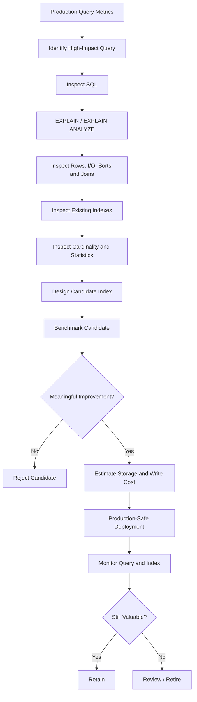

# 28- Identifying Missing Indexes

## Overview

Identifying a missing index is not the same as finding a column that appears in a `WHERE` clause. A missing index is an **observed workload problem** where the database lacks an efficient access path for an important query.

The goal is to connect:

```text
Production workload
      ↓
Slow / expensive query
      ↓
Execution plan
      ↓
Rows + I/O + sorting + joins
      ↓
Existing indexes
      ↓
Candidate index
      ↓
Benchmark
      ↓
Production validation
```

A database optimizer can legitimately choose a sequential scan even when an index exists. Therefore, "the query does not use an index" is not sufficient evidence that an index is missing.

A sound indexing process starts from measured workload data and evaluates the complete query shape:

- `WHERE`
- `JOIN`
- `ORDER BY`
- `GROUP BY`
- `LIMIT`
- Range predicates
- Expressions
- Data distribution
- Result-set size
- Existing indexes

The objective is to improve meaningful workload performance without creating unnecessary write amplification, storage consumption, memory pressure, or operational complexity.

## What a Missing Index Looks Like

A missing index typically appears when a query repeatedly performs expensive work that could be reduced by a more appropriate access path.

For example:

```sql
SELECT id, total, created_at
FROM orders
WHERE tenant_id = 42
  AND status = 'pending'
ORDER BY created_at DESC
LIMIT 50;
```

Suppose the table contains hundreds of millions of rows and currently has only:

```sql
CREATE INDEX idx_orders_tenant
ON orders (tenant_id);
```

The database may efficiently locate the tenant's rows but still need to:

1. Read many matching rows.
2. Filter by `status`.
3. Sort the qualifying rows by `created_at`.
4. Return the first 50.

A candidate index is:

```sql
CREATE INDEX idx_orders_tenant_status_created
ON orders (tenant_id, status, created_at DESC);
```

This index better represents the complete access pattern.

## Why Missing Indexes Matter

A missing index can increase:

- Query latency.
- CPU consumption.
- Disk I/O.
- Database connection occupancy.
- Buffer-cache pressure.
- Replica load.
- API response time.
- Infrastructure cost.

The impact is especially significant when an inefficient query sits on a high-traffic backend path.

For example:

```text
API request
    ↓
Application server
    ↓
Database query
    ↓
Sequential scan: 200M rows
    ↓
Sort/filter
    ↓
Return 50 rows
```

An appropriate index may transform the access pattern into:

```text
API request
    ↓
Application server
    ↓
Database index lookup
    ↓
Small ordered range
    ↓
Return 50 rows
```

The difference is not simply "index vs no index". It is the amount of work required to produce the requested result.

## Sources of Evidence

Missing-index analysis should combine several sources rather than relying on a single signal.

| Evidence | What it tells you |
|---|---|
| Slow query logs | Which queries are actually slow |
| Query latency metrics | User-visible performance impact |
| Query frequency | How often the query consumes resources |
| `EXPLAIN` | Candidate execution strategy |
| `EXPLAIN ANALYZE` | Actual execution behavior |
| Buffer/I/O metrics | Amount of data accessed |
| Existing index metadata | Current access paths |
| Table statistics | Cardinality and distribution |
| Database monitoring | Production workload characteristics |
| Application traces | Which endpoint or service generated the query |

The strongest candidate usually has both:

```text
High workload impact
+
Clear opportunity for a better access path
```

## Start With Slow Queries

For PostgreSQL, slow-query logging and monitoring systems are valuable starting points.

A query such as:

```sql
SELECT id, total
FROM orders
WHERE customer_id = $1
ORDER BY created_at DESC
LIMIT 20;
```

should be analyzed based on actual production behavior.

Important measurements include:

- Mean latency.
- p95 latency.
- p99 latency.
- Calls per second.
- Total execution time.
- Rows returned.
- Rows examined.
- Buffer reads.
- CPU consumption.

A query executed 100 times per second at 20 ms may deserve more attention than a query executed once per hour at 2 seconds.

A useful prioritization model is:

```text
Total impact ≈ query frequency × execution cost × business importance
```

This is not a database formula; it is an engineering prioritization heuristic.

## Inspect the Execution Plan

Start with:

```sql
EXPLAIN
SELECT id, total, created_at
FROM orders
WHERE tenant_id = 42
  AND status = 'pending'
ORDER BY created_at DESC
LIMIT 50;
```

For controlled testing, use:

```sql
EXPLAIN (ANALYZE, BUFFERS)
SELECT id, total, created_at
FROM orders
WHERE tenant_id = 42
  AND status = 'pending'
ORDER BY created_at DESC
LIMIT 50;
```

`EXPLAIN` shows the optimizer's estimated plan.

`EXPLAIN ANALYZE` actually executes the statement and reports observed execution behavior.

For production-sensitive queries, understand the operational implications before running `EXPLAIN ANALYZE` on expensive statements.

## What to Look for in a Plan

Important signals include:

| Plan signal | Potential issue |
|---|---|
| `Seq Scan` | May indicate missing/ineffective index, or may be correct |
| Large `actual rows` | Predicate may be insufficiently selective |
| Large `Rows Removed by Filter` | Access path may retrieve too many rows |
| Expensive `Sort` | Ordering may not be supported efficiently |
| Large `Buffers: shared read` | Significant physical/cache-miss I/O |
| Large estimated vs actual row difference | Statistics may be inaccurate |
| Repeated nested-loop lookups | Join-side indexing may be important |
| High execution time in aggregation | Index may not fully solve the workload |

Never conclude that a `Seq Scan` automatically means "add an index."

## Sequential Scan Does Not Automatically Mean Missing Index

Consider:

```sql
SELECT *
FROM orders
WHERE status = 'completed';
```

If 95% of the table has:

```text
status = 'completed'
```

an index on `status` may not help much.

Reading almost the entire table through an index can involve:

```text
Index lookup
    ↓
Many row references
    ↓
Many heap/table accesses
```

A sequential scan may be cheaper.

The optimizer is making a cost-based decision.

The correct question is:

> "Is there a cheaper access path for the workload?"

not:

> "Why isn't the database using my index?"

## Identify Excessive Rows Removed by Filter

Consider:

```text
Index Scan using idx_orders_tenant
  Index Cond: tenant_id = 42
  Filter: status = 'pending'
  Rows Removed by Filter: 2,500,000
```

This is strong evidence that the current index may be incomplete for this workload.

The index finds the tenant efficiently but retrieves a large candidate set before applying the status filter.

A candidate composite index could be:

```sql
CREATE INDEX idx_orders_tenant_status
ON orders (tenant_id, status);
```

If ordering is also important:

```sql
CREATE INDEX idx_orders_tenant_status_created
ON orders (tenant_id, status, created_at DESC);
```

The additional columns should be justified by actual query patterns.

## Identify Expensive Sorts

Suppose the plan contains:

```text
Sort
  Sort Key: created_at DESC
  Actual Rows: 500000
```

for:

```sql
SELECT id, created_at
FROM orders
WHERE tenant_id = 42
ORDER BY created_at DESC
LIMIT 50;
```

A candidate index is:

```sql
CREATE INDEX idx_orders_tenant_created
ON orders (tenant_id, created_at DESC);
```

The database can potentially traverse the index in the required order and stop after obtaining enough rows.

This is especially valuable for top-N queries:

```text
WHERE
+
ORDER BY
+
LIMIT
```

## Identify Expensive JOINs

Suppose:

```sql
SELECT
    c.id,
    c.email,
    o.id,
    o.total
FROM customers c
JOIN orders o
    ON o.customer_id = c.id
WHERE c.id = $1;
```

If `orders.customer_id` is not indexed, the database may repeatedly scan a large `orders` table to locate matching child rows.

Candidate:

```sql
CREATE INDEX idx_orders_customer
ON orders (customer_id);
```

For large relational tables, inspect both sides of important joins.

Primary keys commonly provide indexes on parent-side identifiers, but child-side foreign keys do not universally imply that the required workload is indexed.

## Identify Missing Composite Indexes

A common mistake is to create separate indexes:

```sql
CREATE INDEX idx_orders_tenant
ON orders (tenant_id);

CREATE INDEX idx_orders_status
ON orders (status);

CREATE INDEX idx_orders_created
ON orders (created_at);
```

for a query such as:

```sql
SELECT id, total
FROM orders
WHERE tenant_id = $1
  AND status = $2
ORDER BY created_at DESC
LIMIT 50;
```

These indexes do not necessarily provide the same access path as:

```sql
CREATE INDEX idx_orders_tenant_status_created
ON orders (tenant_id, status, created_at DESC);
```

The composite index directly represents the query's filtering and ordering pattern.

However, do not create the composite index blindly. First determine whether existing indexes, query frequency, and workload characteristics justify it.

## Identify Missing Range Indexes

Consider:

```sql
SELECT id, amount
FROM transactions
WHERE created_at >= $1
  AND created_at < $2;
```

A candidate:

```sql
CREATE INDEX idx_transactions_created
ON transactions (created_at);
```

For a multi-tenant workload:

```sql
SELECT id, amount
FROM transactions
WHERE tenant_id = $1
  AND created_at >= $2
  AND created_at < $3;
```

a candidate may be:

```sql
CREATE INDEX idx_transactions_tenant_created
ON transactions (tenant_id, created_at);
```

The exact design depends on how the workload is distributed and what other query families exist.

## Identify Missing Partial Indexes

Suppose a jobs table contains:

```text
pending:    2%
running:    1%
completed: 90%
failed:     7%
```

and workers repeatedly execute:

```sql
SELECT id, run_at
FROM jobs
WHERE status = 'pending'
  AND run_at <= now()
ORDER BY run_at
LIMIT 100;
```

A full index may be unnecessarily large:

```sql
CREATE INDEX idx_jobs_status_run_at
ON jobs (status, run_at);
```

A partial index can target the active subset:

```sql
CREATE INDEX idx_jobs_pending_run_at
ON jobs (run_at)
WHERE status = 'pending';
```

This can reduce index size and maintenance cost.

Partial indexes require careful query compatibility. The optimizer must be able to establish that the query's predicate is compatible with the index predicate.

## Identify Missing Expression Indexes

Suppose application code executes:

```sql
SELECT id
FROM users
WHERE lower(email) = lower($1);
```

A regular index:

```sql
CREATE INDEX idx_users_email
ON users (email);
```

does not represent the value being searched.

Candidate:

```sql
CREATE INDEX idx_users_lower_email
ON users (lower(email));
```

The query and index expression must align.

This pattern also applies to other deterministic expressions where supported by the database.

## Identify Missing Indexes for Keyset Pagination

Offset pagination:

```sql
SELECT id, created_at
FROM orders
WHERE tenant_id = $1
ORDER BY created_at DESC, id DESC
LIMIT 50 OFFSET 100000;
```

can become increasingly expensive as the offset grows.

Keyset pagination:

```sql
SELECT id, created_at
FROM orders
WHERE tenant_id = $1
  AND (created_at, id) < ($2, $3)
ORDER BY created_at DESC, id DESC
LIMIT 50;
```

requires an index aligned with the cursor ordering:

```sql
CREATE INDEX idx_orders_tenant_created_id
ON orders (
    tenant_id,
    created_at DESC,
    id DESC
);
```

The unique or tie-breaking column is important for deterministic pagination.

## Identify Missing Covering Indexes

Suppose a hot API query is:

```sql
SELECT id, created_at, total, currency
FROM orders
WHERE tenant_id = $1
ORDER BY created_at DESC
LIMIT 50;
```

Candidate:

```sql
CREATE INDEX idx_orders_tenant_created_covering
ON orders (tenant_id, created_at DESC)
INCLUDE (total, currency);
```

This can sometimes enable an index-only scan and reduce table access.

However, covering indexes should be introduced only when the additional index size and write cost are justified.

Do not treat "index-only" as synonymous with "no I/O". PostgreSQL may still need heap access depending on visibility-map state and other conditions.

## Check Existing Indexes Before Adding One

Always inspect the existing schema.

For PostgreSQL:

```sql
SELECT
    schemaname,
    tablename,
    indexname,
    indexdef
FROM pg_indexes
WHERE schemaname NOT IN ('pg_catalog', 'information_schema')
ORDER BY tablename, indexname;
```

Also inspect index usage:

```sql
SELECT
    schemaname,
    relname AS table_name,
    indexrelname AS index_name,
    idx_scan,
    pg_size_pretty(pg_relation_size(indexrelid)) AS index_size
FROM pg_stat_user_indexes
ORDER BY pg_relation_size(indexrelid) DESC;
```

The goal is to answer:

```text
Does an index already support this query?
        ↓
If not, can an existing composite index be extended or reused?
        ↓
If not, is a new index justified?
```

## Detect Redundant Index Candidates

Suppose the table has:

```text
(tenant_id)
(tenant_id, status)
(tenant_id, status, created_at)
```

and you propose another:

```text
(tenant_id, status, created_at, id)
```

Do not assume the new index is automatically necessary.

Compare:

- Query predicates.
- Ordering.
- Selectivity.
- Pagination.
- Projection.
- Index-only scan requirements.
- Write overhead.
- Storage.
- Existing query plans.

A new index should solve a measurable limitation.

## Compare Estimated and Actual Rows

One of the most important missing-index investigation techniques is comparing estimates with reality.

Example:

```text
Plan:
  estimated rows: 1,000
  actual rows:    5,000,000
```

This does not immediately mean an index is missing.

It may indicate:

- Stale statistics.
- Correlated columns.
- Data skew.
- Insufficient statistics.
- Parameter-sensitive behavior.
- An inaccurate selectivity estimate.

An incorrect estimate can cause the optimizer to choose a poor plan even when the existing indexes are adequate.

Investigate statistics before adding indexes.

## Use Representative Parameters

Consider:

```sql
SELECT *
FROM orders
WHERE tenant_id = $1
  AND status = $2;
```

Different values may produce very different result sizes.

For example:

```text
tenant A → 40% of table
tenant B → 0.01% of table
```

A plan that works well for Tenant B may be inefficient for Tenant A.

Missing-index analysis should therefore test representative values:

| Test case | Purpose |
|---|---|
| Highly selective | Best-case lookup |
| Typical | Normal workload |
| Largest tenant | Worst-case distribution |
| Empty result | No-match behavior |
| Large result | Selectivity boundary |

## Identify Missing Indexes From Application Code

The SQL query should ultimately be traced back to the application workload.

### Django

A queryset such as:

```python
orders = (
    Order.objects
    .filter(
        tenant_id=tenant_id,
        status="pending",
    )
    .order_by("-created_at")[:50]
)
```

may generate a query requiring:

```text
tenant_id
status
created_at DESC
```

A candidate Django model definition:

```python
class Order(models.Model):
    tenant_id = models.BigIntegerField()
    status = models.CharField(max_length=32)
    created_at = models.DateTimeField()

    class Meta:
        indexes = [
            models.Index(
                fields=["tenant_id", "status", "-created_at"],
                name="orders_tenant_status_created_idx",
            ),
        ]
```

But ORM structure alone is not sufficient evidence.

Verify the generated SQL and execution plan against production-like data.

### FastAPI / SQLAlchemy

The same principle applies when queries are generated through SQLAlchemy or another ORM/query builder.

The source of the SQL does not change the database's indexing requirements.

## Missing Indexes in Read-Heavy APIs

Consider:

```text
GET /orders?tenant_id=42&status=pending&limit=50
```

Typical SQL:

```sql
SELECT id, total, created_at
FROM orders
WHERE tenant_id = $1
  AND status = $2
ORDER BY created_at DESC
LIMIT 50;
```

A suitable index can reduce:

```text
Rows examined
+
Sorting
+
Buffer reads
+
Database CPU
```

For high-throughput APIs, even small per-query improvements can produce substantial aggregate savings.

For example:

```text
20,000 requests/sec
×
5 ms saved per query
```

can represent a significant reduction in database work.

The exact impact must be measured rather than assumed.

## Missing Indexes in Background Workers

Celery or other worker systems frequently execute polling queries such as:

```sql
SELECT id
FROM tasks
WHERE status = 'pending'
  AND run_at <= now()
ORDER BY run_at
LIMIT 100;
```

Workers can execute these queries continuously, so a moderately expensive query can become a significant database workload.

A partial index:

```sql
CREATE INDEX idx_tasks_pending_run_at
ON tasks (run_at)
WHERE status = 'pending';
```

may substantially reduce the polling cost.

For concurrent workers, indexing should be considered alongside:

```sql
FOR UPDATE SKIP LOCKED
```

and the transaction/claiming strategy.

## Missing Indexes in Event and Audit Tables

Audit and event tables often have access patterns such as:

```sql
SELECT id, event_type, created_at
FROM audit_events
WHERE entity_id = $1
ORDER BY created_at DESC
LIMIT 100;
```

Candidate:

```sql
CREATE INDEX idx_audit_entity_created
ON audit_events (entity_id, created_at DESC);
```

If the table grows continuously, also investigate:

- Retention.
- Partitioning.
- Archival.
- Index size.
- Write rate.
- Query time range.

An index cannot compensate indefinitely for an unbounded data-retention strategy.

## Missing Indexes in Multi-Tenant Systems

A common access pattern is:

```sql
WHERE tenant_id = $1
  AND ...
```

This often makes `tenant_id` an important leading index column.

For example:

```sql
CREATE INDEX idx_projects_tenant_created
ON projects (tenant_id, created_at DESC);
```

But do not automatically prepend `tenant_id` to every index.

Global administrative queries may have completely different requirements:

```sql
SELECT id
FROM projects
WHERE external_id = $1;
```

Candidate:

```sql
CREATE UNIQUE INDEX idx_projects_external_id
ON projects (external_id);
```

Index design must follow the actual access path.

## Missing Indexes and `ORDER BY`

A common pattern is:

```sql
WHERE tenant_id = $1
ORDER BY created_at DESC
LIMIT 100;
```

A candidate:

```sql
CREATE INDEX idx_orders_tenant_created
ON orders (tenant_id, created_at DESC);
```

The index can potentially provide both:

- Filtering.
- Ordering.

This can be substantially better than:

```text
Find tenant rows
    ↓
Sort all rows
    ↓
Return top 100
```

when the qualifying set is large.

## Missing Indexes and `GROUP BY`

Consider:

```sql
SELECT customer_id, COUNT(*)
FROM orders
WHERE tenant_id = $1
GROUP BY customer_id;
```

A candidate:

```sql
CREATE INDEX idx_orders_tenant_customer
ON orders (tenant_id, customer_id);
```

may improve access to the tenant's rows and provide useful ordering.

However, aggregation may still require substantial CPU or memory.

Do not diagnose an expensive `GROUP BY` as a missing-index problem without inspecting:

- Number of qualifying rows.
- Aggregation strategy.
- Sort/hash costs.
- Memory usage.
- Parallel execution.
- Whether pre-aggregation is more appropriate.

## Missing Indexes and Range Queries

For:

```sql
WHERE created_at >= $1
  AND created_at < $2
```

a B-tree index on `created_at` is often a natural candidate.

But selectivity matters.

A query covering:

```text
5 minutes of data
```

may benefit significantly.

A query covering:

```text
10 years of data
```

may still process most of the table.

The presence of a range predicate alone does not prove that the index will be useful.

## Production Validation

After identifying a candidate index, validate it before treating the problem as solved.

A practical workflow is:

1. Capture the current execution plan.
2. Record latency and resource consumption.
3. Create the candidate index in a controlled environment.
4. Re-run the query against representative data.
5. Compare execution plans.
6. Compare execution time and buffer usage.
7. Estimate index size and write overhead.
8. Deploy safely.
9. Monitor production behavior.
10. Re-evaluate after the workload stabilizes.

Example:

```sql
EXPLAIN (ANALYZE, BUFFERS)
SELECT id, total, created_at
FROM orders
WHERE tenant_id = 42
  AND status = 'pending'
ORDER BY created_at DESC
LIMIT 50;
```

The desired outcome is not merely:

```text
Seq Scan → Index Scan
```

The desired outcome is:

```text
Less total work
+
Lower latency
+
Acceptable write overhead
+
Acceptable storage cost
```

## Production-Safe Index Creation

For large PostgreSQL tables, consider:

```sql
CREATE INDEX CONCURRENTLY idx_orders_tenant_status_created
ON orders (tenant_id, status, created_at DESC);
```

Concurrent creation reduces blocking of normal writes compared with a standard index build, but it still consumes significant resources and has operational characteristics that must be planned for.

Before deployment, assess:

- Available disk space.
- CPU utilization.
- I/O capacity.
- Replication lag.
- Build duration.
- Deployment rollback strategy.
- Migration behavior.

In Django, large index migrations may need a non-atomic migration when using PostgreSQL's concurrent index creation.

## Monitor the New Index

After deployment, monitor both the query and the index.

Useful PostgreSQL information includes:

```sql
SELECT
    schemaname,
    relname AS table_name,
    indexrelname AS index_name,
    idx_scan,
    idx_tup_read,
    idx_tup_fetch,
    pg_size_pretty(pg_relation_size(indexrelid)) AS index_size
FROM pg_stat_user_indexes
WHERE indexrelname = 'idx_orders_tenant_status_created';
```

Look for:

- Index scan frequency.
- Query latency changes.
- Buffer reads.
- CPU changes.
- Index growth.
- Write latency.
- Replica lag.

An index that is never used and consumes significant resources is a candidate for review.

## Production Cost of a Missing Index

The cost of not adding an index can be compared with the cost of adding one.

| Cost | Without index | With index |
|---|---:|---:|
| Query CPU | Potentially high | Often lower |
| Query I/O | Potentially high | Often lower |
| Query latency | Potentially high | Often lower |
| Storage | Lower | Higher |
| Insert/update cost | Lower | Higher |
| Cache footprint | Lower | Higher |
| Replication impact | Lower | Potentially higher |
| Operational complexity | Lower | Higher |

This is why index selection is an optimization trade-off rather than a rule that "more indexes are better."

## Missing Index Detection Workflow



## Common Mistakes

### Treating Every Sequential Scan as a Missing Index

A sequential scan may be the cheapest plan when a query returns a large percentage of the table.

### Indexing Every `WHERE` Column Separately

The query may require a composite access path rather than multiple single-column indexes.

### Ignoring Existing Composite Indexes

A proposed index may duplicate an existing one.

### Ignoring `ORDER BY`

A query can efficiently find rows and still perform an expensive sort.

### Ignoring `LIMIT`

Top-N queries often have strong opportunities for ordering-aware indexes.

### Adding an Index Without Measuring Query Frequency

An index for a rarely executed query may not justify its storage and write cost.

### Testing Only With Development Data

Small tables often produce sequential scans that obscure production behavior.

### Ignoring Data Skew

The same query can behave differently for different tenants or parameter values.

### Assuming Index Usage Means Success

An index scan can still process millions of rows.

Measure total work and latency.

### Forgetting Write Amplification

Every additional index can increase the cost of inserts, deletes, and updates affecting indexed columns.

## Production Pitfalls

### Statistics Mislead the Optimizer

A poor row-count estimate can cause an inappropriate plan even when indexes are present.

### Index Builds Consume Resources

Large index creation can compete with application traffic for CPU, I/O, memory, and disk.

### Workloads Change

An index that was valuable six months ago may become redundant after:

- Query changes.
- Feature removal.
- Data-retention changes.
- Traffic changes.
- Schema changes.

### Indexes Can Become Too Large

Large indexes consume storage and buffer-cache capacity and can increase maintenance costs.

### Query Plans Depend on Data Distribution

Testing with average data is insufficient when production contains highly skewed tenants or partitions.

### Missing Indexes Can Be an Architectural Symptom

If a query repeatedly scans huge datasets despite increasingly complex indexes, the real solution may involve:

- Partitioning.
- Read replicas.
- Materialized views.
- Pre-aggregation.
- Caching.
- Data lifecycle management.
- Dedicated search infrastructure.

Do not force every performance problem into an indexing solution.

## Interview Traps

### "A Sequential Scan Means an Index Is Missing"

False. A sequential scan can be optimal.

### "The Database Can Combine Any Existing Indexes"

Database optimizers can combine indexes in some circumstances, but this is not equivalent to having a purpose-built composite index.

### "Add an Index to Every Foreign Key"

Often useful, but not an unconditional requirement.

### "The Most Selective Column Always Goes First"

Composite index order depends on the complete workload and access pattern.

### "The Index Was Created, So the Problem Is Fixed"

The index must be validated using execution plans and production metrics.

### "Index Recommendations From Tools Are Always Correct"

Automated recommendations are candidates, not decisions. They may not account for:

- Write cost.
- Storage.
- Existing overlapping indexes.
- Future query patterns.
- Data lifecycle.
- Business criticality.

## Senior-Level Index Investigation

A senior engineer should be able to distinguish between:

```text
Missing index
```

and:

```text
Wrong query
Wrong index
Wrong statistics
Wrong data model
Wrong pagination strategy
Wrong retention strategy
Wrong architecture
```

For example:

```text
Query takes 8 seconds
        ↓
EXPLAIN shows Seq Scan
        ↓
Could add index
        ↓
But query returns 40% of table
        ↓
Index would still process millions of rows
        ↓
Investigate:
    - pagination
    - filtering
    - data lifecycle
    - pre-aggregation
    - partitioning
```

The mature optimization decision is based on reducing total system work, not simply increasing the number of indexes.

## Practical Review Checklist

Before creating an index, answer:

- [ ] What production query requires it?
- [ ] How frequently does that query execute?
- [ ] What are its p95/p99 latency characteristics?
- [ ] What does `EXPLAIN` show?
- [ ] What does `EXPLAIN (ANALYZE, BUFFERS)` show in a safe environment?
- [ ] How many rows are estimated and actually processed?
- [ ] Are there large sorts?
- [ ] Are there expensive joins?
- [ ] Are there many rows removed by filters?
- [ ] What indexes already exist?
- [ ] Is a composite index more appropriate?
- [ ] Would a partial or expression index better match the workload?
- [ ] Is the data distribution representative?
- [ ] How much storage will the index consume?
- [ ] What is the expected write overhead?
- [ ] Could the index affect replication or deployment?
- [ ] How will the index be monitored?
- [ ] What evidence will justify keeping or removing it?

## Best Practices

- Start from measured production workload rather than schema inspection alone.
- Prioritize queries by frequency, latency, resource consumption, and business importance.
- Use `EXPLAIN` to understand the optimizer's chosen access path.
- Use `EXPLAIN (ANALYZE, BUFFERS)` for controlled validation.
- Inspect actual rows, estimated rows, filtering, sorting, joins, and I/O.
- Check existing indexes before designing a new one.
- Design indexes around complete query patterns rather than isolated columns.
- Consider composite, partial, expression, and covering indexes where justified.
- Test with realistic table sizes and data distributions.
- Validate different parameter values when data is skewed.
- Treat automated missing-index recommendations as candidates rather than authoritative decisions.
- Measure the total benefit against storage and write-maintenance cost.
- Deploy large indexes using production-safe migration procedures.
- Monitor query latency, database I/O, index usage, storage, and replication after deployment.
- Periodically review indexes because workloads and data distributions evolve.
- If indexing cannot solve the underlying workload problem, consider query redesign or architectural changes.

## Key Takeaways

- **A missing index is an observed workload problem, not simply a column absent from an index.**
- **Use execution plans, production query metrics, existing-index analysis, and realistic data distribution to identify the actual bottleneck.**
- **A good candidate index reduces total database work across filtering, joins, ordering, and result retrieval—not merely the number of sequential scans.**
- **Every new index has storage, write-amplification, memory, replication, and deployment costs that must be evaluated against its benefit.**
- **Senior-level index analysis distinguishes a missing index from problems better solved through query redesign, statistics, partitioning, caching, pre-aggregation, or architecture changes.**