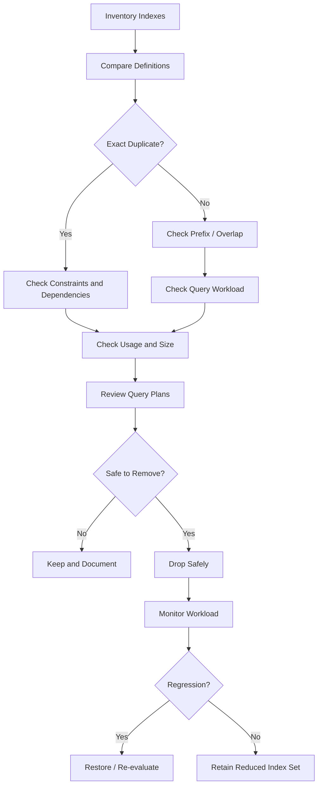

# 29- Identifying Duplicate Indexes

## Overview

Duplicate indexes are indexes that provide the same, or substantially overlapping, access path on the same table. They commonly appear as applications evolve, migrations accumulate, teams add performance fixes independently, or ORM-generated schema changes are introduced without reviewing existing indexes.

Duplicate indexes are more than unnecessary metadata. Each additional index can consume:

- Disk storage.
- Buffer/cache capacity.
- Write I/O.
- CPU during `INSERT`, `UPDATE`, and `DELETE`.
- Replication bandwidth and replay work.
- Index maintenance time.
- Backup and restore time.

The objective is not to minimize the number of indexes at all costs. The objective is to maintain the **smallest set of indexes that efficiently supports the production workload**.

A useful investigation flow is:

```text
Inspect index definitions
        ↓
Normalize key columns + expressions + predicates
        ↓
Find exact duplicates
        ↓
Find prefix / overlapping indexes
        ↓
Check constraints and query workload
        ↓
Measure index usage and size
        ↓
Determine whether removal is safe
        ↓
Drop redundant index
        ↓
Monitor production behavior
```

## What Is a Duplicate Index?

An exact duplicate index has effectively the same definition as another index on the same table.

For example:

```sql
CREATE INDEX idx_orders_customer
ON orders (customer_id);

CREATE INDEX idx_orders_customer_id
ON orders (customer_id);
```

The names differ, but the indexed access path is equivalent.

Keeping both usually provides no additional query-planning capability while doubling the maintenance cost associated with that access path.

However, duplicate analysis must consider more than column names. Relevant differences can include:

- Index column order.
- Sort direction.
- `NULLS FIRST` / `NULLS LAST`.
- Included columns.
- Partial predicates.
- Expressions.
- Operator classes.
- Index method.
- Uniqueness.
- Collation.
- Storage parameters.

Two indexes that look similar in a simplified schema listing may have materially different semantics.

## Why Duplicate Indexes Exist

Duplicate indexes are often created accidentally.

Common causes include:

| Cause | Example |
|---|---|
| Repeated migrations | Multiple migrations create the same index |
| ORM configuration | Model and migration both add an index |
| Renamed indexes | New index added before old one is removed |
| Performance tuning | Engineers add indexes without reviewing existing ones |
| Team ownership | Different teams optimize the same table independently |
| Generated schema | Framework tooling creates overlapping indexes |
| Feature removal | Old query disappears but its index remains |
| Constraint changes | A new constraint creates an index overlapping an existing one |
| Emergency fixes | Temporary indexes become permanent |

The problem is especially common in long-lived systems where database schema history spans years.

## Exact Duplicates vs Overlapping Indexes

Not every redundant index is an exact duplicate.

Consider:

```sql
CREATE INDEX idx_orders_customer
ON orders (customer_id);

CREATE INDEX idx_orders_customer_created
ON orders (customer_id, created_at);
```

These indexes overlap.

The second index can often support queries filtering by `customer_id`, while the first may be redundant for those query patterns.

But this does **not** mean the first index is automatically safe to remove.

The complete workload must be evaluated.

### Categories

| Category | Example | Typical action |
|---|---|---|
| Exact duplicate | `(customer_id)` vs `(customer_id)` | Strong removal candidate |
| Prefix overlap | `(customer_id)` vs `(customer_id, created_at)` | Investigate workload |
| Different ordering | `(customer_id, created_at ASC)` vs `DESC` | Check query requirements |
| Different predicate | Partial vs full index | Usually distinct |
| Different included columns | `INCLUDE (...)` | May enable index-only scans |
| Different expression | `(lower(email))` vs `(email)` | Distinct |
| Different operator class | Specialized search semantics | Distinct |
| Unique vs non-unique | Unique constraint vs ordinary index | Not interchangeable |

## Why Index Column Order Matters

Consider:

```sql
CREATE INDEX idx_orders_customer_created
ON orders (customer_id, created_at);
```

This index is naturally useful for queries such as:

```sql
WHERE customer_id = $1
```

and:

```sql
WHERE customer_id = $1
ORDER BY created_at;
```

But it is not generally equivalent to:

```sql
CREATE INDEX idx_orders_created_customer
ON orders (created_at, customer_id);
```

because the leading index key differs.

Therefore, duplicate detection must compare the **ordered index definition**, not merely the set of columns.

```text
(customer_id, created_at)
```

is not equivalent to:

```text
(created_at, customer_id)
```

## PostgreSQL Index Metadata

For PostgreSQL, `pg_indexes` provides human-readable index definitions.

```sql
SELECT
    schemaname,
    tablename,
    indexname,
    indexdef
FROM pg_indexes
WHERE schemaname NOT IN ('pg_catalog', 'information_schema')
ORDER BY tablename, indexname;
```

Example output:

```text
orders | idx_orders_customer
orders | CREATE INDEX idx_orders_customer ON public.orders USING btree (customer_id)

orders | idx_orders_customer_id
orders | CREATE INDEX idx_orders_customer_id ON public.orders USING btree (customer_id)
```

This is a good first-level inspection.

For deeper analysis, PostgreSQL catalog tables such as `pg_class`, `pg_index`, `pg_attribute`, `pg_constraint`, and `pg_opclass` provide structured metadata.

## Finding Exact Duplicate Indexes

A practical first pass is to compare normalized index definitions.

For PostgreSQL, you can inspect definitions with:

```sql
SELECT
    schemaname,
    tablename,
    indexname,
    indexdef
FROM pg_indexes
WHERE schemaname NOT IN ('pg_catalog', 'information_schema')
ORDER BY tablename, indexdef, indexname;
```

Identical `indexdef` values on the same table are strong candidates for duplicate indexes.

A more useful grouping query is:

```sql
SELECT
    schemaname,
    tablename,
    indexdef,
    COUNT(*) AS duplicate_count,
    STRING_AGG(indexname, ', ' ORDER BY indexname) AS indexes
FROM pg_indexes
WHERE schemaname NOT IN ('pg_catalog', 'information_schema')
GROUP BY
    schemaname,
    tablename,
    indexdef
HAVING COUNT(*) > 1
ORDER BY
    duplicate_count DESC,
    schemaname,
    tablename;
```

This detects exact duplicate definitions represented by the catalog view.

It should be treated as an investigation starting point rather than an automatic deletion script.

## Index Usage Statistics

Before removing an index, inspect how frequently it is used.

PostgreSQL exposes index statistics through `pg_stat_user_indexes`.

```sql
SELECT
    schemaname,
    relname AS table_name,
    indexrelname AS index_name,
    idx_scan,
    idx_tup_read,
    idx_tup_fetch,
    pg_size_pretty(pg_relation_size(indexrelid)) AS index_size
FROM pg_stat_user_indexes
ORDER BY
    pg_relation_size(indexrelid) DESC;
```

Important fields include:

| Field | Meaning |
|---|---|
| `idx_scan` | Number of index scans initiated using the index |
| `idx_tup_read` | Index entries returned by scans |
| `idx_tup_fetch` | Table rows fetched by scans |
| `index_size` | Physical size of the index |

A large index with consistently zero or very low `idx_scan` is worth investigating.

However, low usage does not automatically mean an index is useless.

## Why Zero Index Scans Are Not Enough

Statistics are cumulative over the statistics collection period and can reset.

An index may have:

```text
idx_scan = 0
```

because:

- The database was recently restarted.
- Statistics were reset.
- The workload is seasonal.
- A rarely executed administrative query depends on it.
- A reporting workload has not run recently.
- Failover created a new primary with fresh statistics.
- The application traffic is currently atypical.

Therefore:

```text
unused index
≠
safe to delete
```

Use workload history and business context before removing an index.

## Indexes Supporting Constraints

Some indexes exist because of constraints rather than explicit query optimization.

Examples include unique indexes created to enforce:

```sql
UNIQUE (email)
```

or:

```sql
PRIMARY KEY (id)
```

Before removing an apparently duplicate index, determine whether it is associated with a constraint.

For PostgreSQL:

```sql
SELECT
    conname,
    contype,
    conrelid::regclass AS table_name,
    pg_get_constraintdef(oid) AS constraint_definition
FROM pg_constraint
WHERE conrelid = 'public.users'::regclass;
```

A constraint-backed index should not be treated as an ordinary redundant index.

If a unique constraint is required, preserving uniqueness is part of correctness, not merely performance.

## Prefix-Redundant Indexes

Consider:

```sql
CREATE INDEX idx_orders_customer
ON orders (customer_id);

CREATE INDEX idx_orders_customer_created
ON orders (customer_id, created_at);
```

The second index has the first column as its leading key.

For many workloads, the larger index can serve queries that only filter on `customer_id`.

This makes the single-column index a possible candidate for removal.

But the decision depends on workload and database behavior.

Questions to ask:

- Does the single-column index support an important query better?
- Is the composite index significantly larger?
- Does the single-column index provide better cache locality?
- Is the composite index frequently updated?
- Is the smaller index valuable for high-frequency lookups?
- Are there index-only scan differences?
- Are there partial or expression differences?
- Does the query require different ordering?

Do not remove prefix indexes solely because one definition begins with the same columns.

## When a Smaller Prefix Index Can Still Be Useful

Suppose:

```sql
CREATE INDEX idx_users_tenant
ON users (tenant_id);

CREATE INDEX idx_users_tenant_status_created
ON users (tenant_id, status, created_at DESC);
```

A query:

```sql
SELECT id
FROM users
WHERE tenant_id = $1;
```

could potentially use either index.

The smaller index may be preferable because:

- It occupies less storage.
- More of it may fit in memory.
- It requires less I/O.
- Updates may touch less index data.
- Traversal can involve fewer pages.

Therefore, a larger composite index does not automatically make every prefix index redundant.

## Included Columns Change the Analysis

Consider:

```sql
CREATE INDEX idx_orders_customer
ON orders (customer_id);

CREATE INDEX idx_orders_customer_covering
ON orders (customer_id)
INCLUDE (created_at, total);
```

These indexes have the same search key but different payload.

The covering index may support an index-only scan for queries such as:

```sql
SELECT created_at, total
FROM orders
WHERE customer_id = $1;
```

Removing the first index may still be reasonable, but the decision should consider:

- Index size.
- Query workload.
- Index-only scan behavior.
- Cache efficiency.
- Write cost.

`INCLUDE` columns are not part of the index search ordering, so they must be analyzed separately from key columns.

## Partial Indexes Are Not Duplicates of Full Indexes

Consider:

```sql
CREATE INDEX idx_jobs_run_at
ON jobs (run_at);

CREATE INDEX idx_jobs_pending_run_at
ON jobs (run_at)
WHERE status = 'pending';
```

These indexes overlap but are not equivalent.

The partial index only contains rows satisfying:

```sql
status = 'pending'
```

The full index can support queries involving all rows.

The partial index may be dramatically smaller and more efficient for the targeted workload.

Do not remove one merely because both contain `run_at`.

## Expression Indexes Are Different

These indexes are not duplicates:

```sql
CREATE INDEX idx_users_email
ON users (email);

CREATE INDEX idx_users_lower_email
ON users (lower(email));
```

The second supports expression-based predicates such as:

```sql
WHERE lower(email) = $1
```

The first does not provide the same access path.

Index comparisons must account for expressions rather than only base column names.

## Sort Direction Matters

Consider:

```sql
CREATE INDEX idx_orders_created_asc
ON orders (created_at ASC);

CREATE INDEX idx_orders_created_desc
ON orders (created_at DESC);
```

For a single-column B-tree index, PostgreSQL can scan the index in either direction, so these two definitions may provide equivalent capabilities in many cases.

However, direction becomes more significant with multiple columns.

For example:

```sql
CREATE INDEX idx_orders_tenant_created
ON orders (tenant_id ASC, created_at DESC);
```

is not necessarily equivalent to:

```sql
CREATE INDEX idx_orders_tenant_created_asc
ON orders (tenant_id ASC, created_at ASC);
```

because mixed ordering can matter for satisfying multi-column `ORDER BY` requirements.

## Operator Classes Matter

PostgreSQL indexes can use different operator classes.

For example, specialized search requirements may require an index definition that looks structurally similar but has different operator semantics.

Therefore, duplicate analysis should not rely solely on:

```text
table + column names
```

It should consider:

```text
table
+
index method
+
ordered keys
+
expressions
+
operator classes
+
collation
+
sort direction
+
NULL ordering
+
predicate
+
included columns
+
uniqueness
```

## Indexes Created by Constraints

An index associated with a primary key or unique constraint may look redundant:

```text
users_pkey
users_id_idx
```

If both target `id`, the ordinary index may be redundant.

But:

```text
PRIMARY KEY (id)
```

already provides uniqueness enforcement.

The correct approach is to determine whether the second index has any additional semantic purpose.

Constraint ownership should always be checked before dropping indexes.

## Comparing Index Size

Index size is important when evaluating redundant indexes.

```sql
SELECT
    schemaname,
    relname AS table_name,
    indexrelname AS index_name,
    pg_size_pretty(pg_relation_size(indexrelid)) AS index_size
FROM pg_stat_user_indexes
ORDER BY pg_relation_size(indexrelid) DESC;
```

A duplicate index on a 2 GB table is inconvenient.

A duplicate index on a multi-terabyte production table can have substantial infrastructure and operational consequences.

Storage cost also affects:

- Backups.
- Snapshots.
- Replication.
- Cache utilization.
- Index build duration.
- Restore duration.

## Duplicate Indexes and Write Amplification

Indexes must be maintained when indexed values are affected by writes.

For a table receiving:

```text
50,000 INSERTs/sec
```

every additional index can increase the amount of work required to maintain the table.

The exact overhead depends on:

- Index type.
- Key width.
- Number of indexes.
- Update pattern.
- Page splits.
- Table size.
- Storage subsystem.
- Database configuration.

The important engineering principle is:

> An index that provides no meaningful read benefit still has a write cost.

This is why duplicate indexes should be removed when they are demonstrably unnecessary.

## Duplicate Indexes and Updates

An `UPDATE` does not necessarily modify every index entry.

It depends on whether indexed columns are affected and how the database handles the update internally.

For PostgreSQL, MVCC means updates create new row versions, and index maintenance can be involved even when application-level logic appears to change only one field.

Therefore, redundant indexes can increase write-path overhead even when their indexed columns are not part of the business-level update operation.

## Duplicate Indexes and Cache Pressure

Indexes compete with table pages and other indexes for memory.

Suppose:

```text
Available shared buffers: 16 GB

Useful indexes:           12 GB
Redundant indexes:         6 GB
```

The redundant indexes can displace pages that would otherwise serve useful queries.

This creates an indirect performance cost:

```text
More indexes
    ↓
Larger database working set
    ↓
Lower cache locality
    ↓
More physical reads
    ↓
Higher latency
```

The cost of a redundant index is therefore not limited to its disk footprint.

## Detecting Redundancy Systematically

A production-oriented process is:



## Practical PostgreSQL Investigation

Start with the complete index inventory:

```sql
SELECT
    schemaname,
    tablename,
    indexname,
    indexdef
FROM pg_indexes
WHERE schemaname NOT IN ('pg_catalog', 'information_schema')
ORDER BY tablename, indexname;
```

Then inspect usage and size:

```sql
SELECT
    s.schemaname,
    s.relname AS table_name,
    s.indexrelname AS index_name,
    s.idx_scan,
    pg_size_pretty(pg_relation_size(s.indexrelid)) AS index_size,
    pg_get_indexdef(s.indexrelid) AS index_definition
FROM pg_stat_user_indexes AS s
ORDER BY
    s.relname,
    pg_relation_size(s.indexrelid) DESC;
```

Then inspect constraints:

```sql
SELECT
    conname,
    conrelid::regclass AS table_name,
    contype,
    pg_get_constraintdef(oid) AS definition
FROM pg_constraint
WHERE contype IN ('p', 'u', 'x')
ORDER BY conrelid::regclass::text, conname;
```

These queries provide three complementary views:

```text
Definition
+
Usage
+
Semantic ownership
```

## Using `pg_index` for Deeper Analysis

For more detailed PostgreSQL tooling, inspect `pg_index`.

```sql
SELECT
    i.indexrelid::regclass AS index_name,
    i.indrelid::regclass AS table_name,
    i.indisunique,
    i.indisprimary,
    i.indpred IS NOT NULL AS is_partial,
    i.indexprs IS NOT NULL AS has_expression
FROM pg_index AS i
JOIN pg_class AS c
    ON c.oid = i.indexrelid
WHERE c.relkind = 'i'
ORDER BY i.indrelid::regclass::text;
```

This helps distinguish:

- Primary indexes.
- Unique indexes.
- Partial indexes.
- Expression indexes.

For automated tooling, catalog-level comparison is preferable to parsing display strings alone.

## Duplicate Indexes in Django

Django models can define indexes through:

```python
class Meta:
    indexes = [
        models.Index(
            fields=["customer_id"],
            name="orders_customer_idx",
        ),
    ]
```

A developer might later add:

```python
class Meta:
    indexes = [
        models.Index(
            fields=["customer_id"],
            name="orders_customer_idx_v2",
        ),
    ]
```

without removing the original index.

Another common source is combining:

```python
db_index=True
```

with an explicit `Meta.indexes` entry for the same column.

For example:

```python
class Order(models.Model):
    customer_id = models.BigIntegerField(db_index=True)

    class Meta:
        indexes = [
            models.Index(
                fields=["customer_id"],
                name="orders_customer_idx",
            ),
        ]
```

This can create overlapping or duplicate indexing depending on the migration history and schema state.

Review generated migrations and the actual database schema rather than assuming model declarations accurately describe the current production database.

## Migration History Matters

Suppose migration history contains:

```text
0001_create_orders
0008_add_customer_index
0021_add_customer_index_v2
0047_remove_old_query
```

The schema may still contain both indexes.

Removing a duplicate index should generally be represented as an explicit migration so that:

- New environments remain consistent.
- CI environments reproduce the intended schema.
- Deployments are deterministic.
- Future developers understand why the index was removed.

Do not manually modify production and leave the migration state inconsistent.

## Safely Removing an Index

For PostgreSQL:

```sql
DROP INDEX CONCURRENTLY IF EXISTS idx_orders_customer;
```

`CONCURRENTLY` can reduce blocking of normal table operations compared with a standard index drop.

However, it has migration and transaction restrictions and should be incorporated into the deployment process appropriately.

Before removal:

1. Verify the index is genuinely redundant.
2. Check constraint dependencies.
3. Check workload usage.
4. Review recent and historical statistics.
5. Validate alternative indexes.
6. Confirm rollback strategy.
7. Drop safely.
8. Monitor query plans and latency.

## Staged Removal Strategy

For high-risk production systems, avoid immediately deleting an index based on one observation.

A safer approach is:

```text
Candidate duplicate
      ↓
Collect usage statistics
      ↓
Confirm workload coverage
      ↓
Review plans
      ↓
Optional observation period
      ↓
Drop index
      ↓
Monitor
      ↓
Restore if regression appears
```

For especially critical indexes, deployment should include a rollback procedure that can recreate the index if needed.

## When Not to Remove an Apparently Duplicate Index

Keep an index when it has a meaningful distinction such as:

- Required uniqueness.
- Different partial predicate.
- Different expression.
- Different operator class.
- Required included columns.
- Different ordering behavior.
- Better performance for a high-frequency query.
- Important workload not represented in current monitoring.
- Operational or administrative query dependency.

The burden of proof should be higher for production-critical indexes than for obvious exact duplicates.

## Common Mistakes

### Comparing Only Index Names

Index names have no performance semantics.

These may be duplicates:

```text
idx_customer
customer_lookup
orders_customer_v2
```

Compare definitions, not names.

### Comparing Only Column Sets

These are not necessarily equivalent:

```text
(customer_id, created_at)
(created_at, customer_id)
```

Order matters.

### Dropping Zero-Usage Indexes Immediately

Statistics may be incomplete, reset, or unrepresentative.

### Ignoring Constraints

A unique or primary-key index may enforce correctness.

### Treating Prefix Indexes as Automatically Redundant

A smaller index can sometimes be more efficient than a wider composite index.

### Ignoring Partial Predicates

A partial index and full index can serve different workloads.

### Ignoring Included Columns

A covering index may enable an index-only scan that another index cannot.

### Forgetting Index Build and Drop Costs

Large production indexes require careful operational planning.

### Removing the Index Directly in Production

This can create schema drift if the migration history is not updated.

### Relying on a Single Snapshot of Statistics

Index usage should be evaluated over a meaningful workload period.

## Production Pitfalls

### Statistics Reset During Failover

A new primary can have different statistics history, making recent `idx_scan` values misleading.

### Seasonal Workloads

An index may appear unused during normal traffic but be critical during:

- Monthly billing.
- End-of-day reporting.
- Annual processing.
- Scheduled reconciliation.
- Data exports.

### Read Replicas Have Different Workloads

An index may be heavily used on a reporting replica but rarely used on the primary.

Index analysis should account for workload differences across database roles.

### Query Plans Change After Index Removal

A seemingly redundant index may influence optimizer choices indirectly.

Always monitor plans after removal.

### ORM Migrations Can Reintroduce Indexes

If the database index is removed manually but the application migration still declares it, a later deployment may recreate it.

Schema ownership must remain consistent.

### Long-Lived Index Statistics Can Be Misleading

Usage counters do not necessarily represent lifetime workload accurately.

Record observations over meaningful periods and understand when statistics reset.

## Performance Impact of Removing Duplicate Indexes

A successful cleanup can produce benefits across several dimensions:

| Area | Potential improvement |
|---|---|
| Storage | Less disk consumed |
| Cache | More room for useful pages |
| Writes | Less index maintenance |
| CPU | Less index update work |
| I/O | Fewer pages maintained/read |
| Replication | Less index-related write work |
| Backup | Smaller database footprint |
| Restore | Fewer index pages to rebuild or restore |
| Operations | Simpler schema |

The magnitude depends on table size and workload.

A duplicate index on a small table may have negligible impact. The same redundancy across several multi-billion-row tables can become a major operational concern.

## Index Redundancy Review Checklist

Before removing an index:

- [ ] Is it an exact duplicate or only overlapping?
- [ ] Are the key columns in the same order?
- [ ] Are expressions identical?
- [ ] Are predicates identical?
- [ ] Are included columns identical?
- [ ] Are sort directions relevant?
- [ ] Are collations and operator classes equivalent?
- [ ] Is either index unique?
- [ ] Is either index enforcing a constraint?
- [ ] What is the index size?
- [ ] How often is each index scanned?
- [ ] Are statistics representative?
- [ ] Does a smaller index provide better cache efficiency?
- [ ] Which production queries depend on each index?
- [ ] Have relevant `EXPLAIN` plans been reviewed?
- [ ] Are there seasonal or administrative workloads?
- [ ] Will removing the index affect replicas?
- [ ] Is the change represented in migrations?
- [ ] Is the removal procedure production-safe?
- [ ] Is rollback possible?
- [ ] What metrics will be monitored afterward?

## Best Practices

- Treat index cleanup as workload optimization, not merely schema cleanup.
- Compare complete index definitions rather than index names.
- Distinguish exact duplicates from prefix and semantic overlap.
- Inspect uniqueness, predicates, expressions, ordering, operator classes, and included columns.
- Check constraint ownership before removing indexes.
- Use `pg_stat_user_indexes` to understand real workload usage.
- Consider statistics reset, failover, seasonal traffic, and replica-specific workloads.
- Compare index size with query frequency and business importance.
- Do not assume a wider composite index always makes a smaller prefix index redundant.
- Use execution plans to validate whether overlapping indexes serve materially different queries.
- Remove indexes through version-controlled migrations.
- Use production-safe index operations such as `DROP INDEX CONCURRENTLY` where appropriate in PostgreSQL.
- Monitor query latency, execution plans, I/O, and application error rates after removal.
- Periodically review indexes as application workloads, schemas, and data distributions evolve.

## Key Takeaways

- **Exact duplicate indexes usually provide no additional query capability while increasing storage and write-maintenance cost.**
- **Overlapping indexes require deeper analysis because column order, predicates, expressions, included columns, ordering, and constraints can make apparently similar indexes materially different.**
- **Index usage statistics are evidence, not proof; account for resets, failovers, seasonal workloads, replicas, and rarely executed critical queries.**
- **Removing redundant indexes should be treated as a production schema change with workload validation, version-controlled migrations, safe deployment, and post-removal monitoring.**
- **The goal is not the fewest indexes; it is the smallest index set that efficiently and reliably supports the real production workload.**