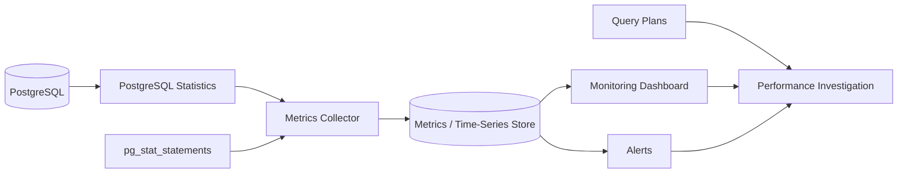
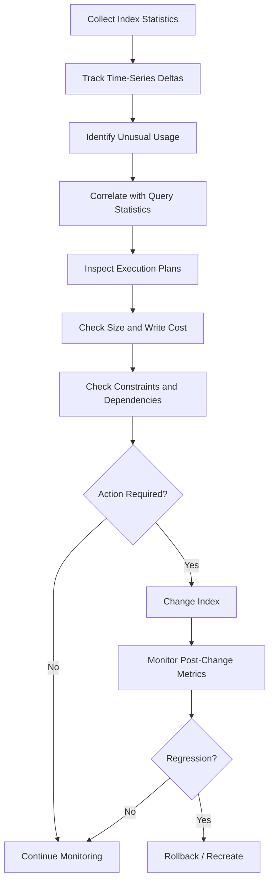

# 30- Index Usage Monitoring

## Overview

Index usage monitoring determines whether database indexes are actually contributing to production workloads and whether their operational cost is justified.

Creating an index is only half of index management. Over time, application behavior changes, data distributions evolve, queries are removed, and new access patterns appear. An index that was valuable six months ago may now be unused, while another index may be critical to a query that runs only a few times per month.

A production index review should therefore answer four questions:

1. **Is the index being used?**
2. **Which workload is using it?**
3. **What does the index cost in storage and write maintenance?**
4. **Would changing or removing it create a performance or correctness regression?**

For PostgreSQL, index monitoring typically combines:

- `pg_stat_user_indexes`
- `pg_stat_all_indexes`
- `pg_stat_database`
- `pg_stat_statements`
- `EXPLAIN (ANALYZE, BUFFERS)`
- Index size information
- Constraint metadata
- Application and infrastructure metrics

Index usage statistics are evidence, not an automatic deletion signal.

## Why Index Usage Monitoring Matters

Indexes improve read performance by providing efficient access paths, but they introduce ongoing costs.

```text
                    Index
                      │
          ┌───────────┴───────────┐
          │                       │
       Read benefit           Maintenance cost
          │                       │
    Faster lookups          INSERT / UPDATE / DELETE
    Better ORDER BY         Storage
    Better JOINs            Cache pressure
    Better GROUP BY         Replication
                            Backup / restore
```

A healthy database balances these costs against the actual workload.

| Concern | Without useful index | With useful index | With unnecessary index |
|---|---|---|---|
| Read latency | Potentially high | Lower | Usually unchanged |
| Write cost | Lower | Higher | Higher |
| Storage | Lower | Higher | Higher |
| Cache pressure | Lower | Higher | Higher |
| Replication work | Lower | Higher | Higher |
| Query flexibility | Lower | Higher | Usually unchanged |
| Operational complexity | Lower | Higher | Higher |

Monitoring prevents index growth from becoming uncontrolled schema complexity.

## What PostgreSQL Tracks

PostgreSQL exposes cumulative statistics about index activity.

The most useful view for user tables is:

```sql
pg_stat_user_indexes
```

It contains information such as:

| Column | Meaning |
|---|---|
| `relname` | Table name |
| `indexrelname` | Index name |
| `idx_scan` | Number of index scans initiated |
| `idx_tup_read` | Index entries returned by scans |
| `idx_tup_fetch` | Table rows fetched by scans |
| `indexrelid` | OID identifying the index |

A basic query:

```sql
SELECT
    schemaname,
    relname AS table_name,
    indexrelname AS index_name,
    idx_scan,
    idx_tup_read,
    idx_tup_fetch
FROM pg_stat_user_indexes
ORDER BY idx_scan DESC;
```

This provides a workload-oriented view of index activity.

## `idx_scan` Is the Primary Signal

`idx_scan` tells you how many index scans have been initiated using an index.

For example:

```text
idx_customer_id      12,400,000
idx_status              850,000
idx_old_feature              0
```

This immediately identifies indexes worth investigating.

However, `idx_scan` does not tell you:

- Whether the query was fast.
- Whether the index was the best available choice.
- Whether the index is required for a rare critical workload.
- Whether statistics were recently reset.
- How expensive each scan was.
- Whether the index was useful on another database replica.

Therefore, use `idx_scan` as a **candidate-generation metric**, not as an automated deletion rule.

## Index Statistics Are Cumulative

PostgreSQL statistics are cumulative for the lifetime of the relevant statistics state.

This means:

```text
idx_scan = 100
```

does not mean:

```text
100 scans per day
```

It means that 100 scans have been observed since the relevant statistics were initialized or reset.

A monitoring system should therefore record snapshots over time.

For example:

```text
Day 1:
idx_scan = 100,000

Day 2:
idx_scan = 125,000

Difference:
25,000 scans
```

The difference provides a much more useful measurement for the interval.

## Monitoring Index Usage Over Time

Store periodic snapshots rather than relying only on the current counter.

A monitoring table might contain:

```sql
CREATE TABLE index_usage_snapshots (
    captured_at timestamptz NOT NULL DEFAULT now(),
    database_name text NOT NULL,
    schema_name text NOT NULL,
    table_name text NOT NULL,
    index_name text NOT NULL,
    idx_scan bigint NOT NULL,
    idx_tup_read bigint NOT NULL,
    idx_tup_fetch bigint NOT NULL,
    index_bytes bigint NOT NULL
);
```

A collection query:

```sql
INSERT INTO index_usage_snapshots (
    database_name,
    schema_name,
    table_name,
    index_name,
    idx_scan,
    idx_tup_read,
    idx_tup_fetch,
    index_bytes
)
SELECT
    current_database(),
    s.schemaname,
    s.relname,
    s.indexrelname,
    s.idx_scan,
    s.idx_tup_read,
    s.idx_tup_fetch,
    pg_relation_size(s.indexrelid)
FROM pg_stat_user_indexes AS s;
```

The monitoring system can then calculate deltas between snapshots.

## Index Usage Rate

A useful operational metric is the number of scans over a time interval.

```text
usage_rate =
    current_idx_scan - previous_idx_scan
```

For example:

```text
Index: idx_orders_customer

Monday:
1,000,000 scans

Tuesday:
1,250,000 scans

Daily usage:
250,000 scans
```

This is more meaningful than simply reporting `1,250,000`.

For monitoring systems, also detect counter resets:

```text
current < previous
```

A decrease can indicate that statistics were reset rather than that index usage became negative.

## Index Size Monitoring

Usage must be evaluated alongside storage cost.

```sql
SELECT
    schemaname,
    relname AS table_name,
    indexrelname AS index_name,
    pg_size_pretty(pg_relation_size(indexrelid)) AS index_size,
    pg_relation_size(indexrelid) AS index_bytes,
    idx_scan
FROM pg_stat_user_indexes
ORDER BY pg_relation_size(indexrelid) DESC;
```

A useful operational view is:

```text
High usage + large size
    → likely important

High usage + small size
    → usually low concern

Low usage + small size
    → investigate

Low usage + huge size
    → high-priority investigation
```

The final category is particularly valuable during index cleanup.

## Finding Large, Low-Usage Indexes

A practical PostgreSQL query:

```sql
SELECT
    s.schemaname,
    s.relname AS table_name,
    s.indexrelname AS index_name,
    s.idx_scan,
    pg_size_pretty(pg_relation_size(s.indexrelid)) AS index_size
FROM pg_stat_user_indexes AS s
WHERE s.idx_scan < 100
ORDER BY pg_relation_size(s.indexrelid) DESC;
```

This is useful for creating an investigation list.

It should **not** be used as:

```sql
DROP every index where idx_scan < 100;
```

The threshold is a screening mechanism, not a correctness rule.

## Finding Completely Unused Indexes

```sql
SELECT
    schemaname,
    relname AS table_name,
    indexrelname AS index_name,
    pg_size_pretty(pg_relation_size(indexrelid)) AS index_size
FROM pg_stat_user_indexes
WHERE idx_scan = 0
ORDER BY pg_relation_size(indexrelid) DESC;
```

These indexes deserve attention, especially when large.

Before considering removal, verify:

- Statistics have covered representative traffic.
- The database has not recently failed over.
- Statistics were not recently reset.
- The index is not constraint-backed.
- Rare workloads do not require it.
- Reporting or administrative workloads are accounted for.
- The index is not used differently on replicas.

## Indexes and Constraint Safety

Some indexes exist to enforce correctness.

Check primary and unique constraints:

```sql
SELECT
    conname,
    conrelid::regclass AS table_name,
    contype,
    pg_get_constraintdef(oid) AS definition
FROM pg_constraint
WHERE contype IN ('p', 'u', 'x')
ORDER BY conrelid::regclass::text, conname;
```

A primary key index may have low `idx_scan` while still being essential because it supports uniqueness enforcement.

Therefore:

```text
idx_scan = 0
```

does not imply:

```text
safe to drop
```

Constraint semantics must be checked separately.

## Monitoring Query-Level Index Usage

Index-level statistics tell you **which index was used**, but not necessarily **which application query caused that usage**.

For query-level analysis, PostgreSQL's `pg_stat_statements` is highly useful when enabled.

Example:

```sql
SELECT
    query,
    calls,
    total_exec_time,
    mean_exec_time,
    rows
FROM pg_stat_statements
ORDER BY total_exec_time DESC
LIMIT 20;
```

This identifies expensive or frequently executed queries.

Then inspect representative queries directly:

```sql
EXPLAIN (ANALYZE, BUFFERS)
SELECT
    id,
    created_at,
    total
FROM orders
WHERE customer_id = 12345
ORDER BY created_at DESC
LIMIT 50;
```

This connects:

```text
Application query
      ↓
Execution plan
      ↓
Index access path
      ↓
Actual I/O and execution time
```

## `EXPLAIN` Is More Important Than Index Counters

An index can have millions of scans and still be associated with poor query performance.

For example:

```text
Index Scan
Rows removed by filter: 9,500,000
Rows returned: 50
```

This may indicate that the index is being used but is poorly aligned with the query predicate.

Conversely, an index may have relatively few scans because the query is extremely efficient and executes only for a small workload.

Index monitoring should therefore combine:

```text
Usage
+
Query latency
+
Rows processed
+
Buffer activity
+
Data distribution
```

## Buffer Analysis

Use:

```sql
EXPLAIN (ANALYZE, BUFFERS)
SELECT *
FROM orders
WHERE customer_id = 12345;
```

The `BUFFERS` output helps determine whether the query is primarily served from:

- Shared buffers.
- Physical reads.
- Local temporary buffers.

A query that uses an index but causes substantial heap I/O may still need optimization.

For example:

```text
Index Scan
  Buffers:
    shared hit: 120
    shared read: 4,800
```

The index is being used, but the overall access path may still be expensive.

## Index Usage Does Not Mean Index Effectiveness

Distinguish these concepts:

| Concept | Question |
|---|---|
| Index usage | Was the index selected? |
| Index effectiveness | Did it substantially reduce work? |
| Query performance | Is the query fast enough? |
| Index value | Is its benefit worth its maintenance cost? |

A senior engineer should optimize for **workload outcomes**, not index utilization percentages.

## Monitoring Indexes by Table

Indexes should be analyzed in table context.

```sql
SELECT
    s.relname AS table_name,
    COUNT(*) AS index_count,
    SUM(pg_relation_size(s.indexrelid)) AS total_index_bytes
FROM pg_stat_user_indexes AS s
GROUP BY s.relname
ORDER BY total_index_bytes DESC;
```

This identifies tables with large index footprints.

For example:

```text
orders
  table:       900 GB
  indexes:     420 GB

events
  table:       2.1 TB
  indexes:     1.4 TB
```

A large index-to-table ratio does not automatically indicate a problem, but it warrants review.

Some workloads legitimately require substantial indexing.

## Index-to-Table Storage Ratio

A useful diagnostic is:

```text
index footprint / table footprint
```

For PostgreSQL:

```sql
SELECT
    i.schemaname,
    i.relname AS table_name,
    pg_size_pretty(pg_relation_size(i.relid)) AS table_size,
    pg_size_pretty(SUM(pg_relation_size(i.indexrelid))) AS indexes_size,
    ROUND(
        SUM(pg_relation_size(i.indexrelid))::numeric
        / NULLIF(pg_relation_size(i.relid), 0),
        2
    ) AS index_to_table_ratio
FROM pg_stat_user_indexes AS i
GROUP BY
    i.schemaname,
    i.relname,
    i.relid
ORDER BY
    SUM(pg_relation_size(i.indexrelid)) DESC;
```

This can reveal tables where indexes consume a substantial portion of storage.

## Monitoring Write Cost

Index usage monitoring should not be read-only focused.

A database may have:

```text
High INSERT/UPDATE/DELETE workload
+
Many large indexes
+
Low index read usage
```

This is a strong signal of potential write amplification.

Monitor alongside:

- Transaction throughput.
- Commit latency.
- WAL generation.
- Checkpoint behavior.
- Disk I/O.
- Replication lag.
- CPU utilization.

PostgreSQL WAL metrics can be inspected through database statistics and system-level monitoring.

The goal is to correlate:

```text
Index footprint
      +
Write workload
      +
WAL / I/O
      +
Query workload
```

rather than evaluating indexes in isolation.

## Index Monitoring Across Primary and Replicas

Indexes can have different value on different database nodes.

For example:

```text
Primary
  └── OLTP workload
       ├── INSERT
       ├── UPDATE
       └── short point lookups

Read Replica
  └── Reporting workload
       ├── large scans
       ├── aggregations
       └── analytical queries
```

An index that appears underused on the primary may be important on a read replica.

Index cleanup must therefore consider the complete database topology.

## Monitoring Architecture

A production monitoring setup can collect PostgreSQL index statistics periodically.



Typical metrics include:

- Index scans per interval.
- Index size.
- Index-to-table size ratio.
- Query latency.
- Buffer hits and reads.
- Database IOPS.
- WAL generation.
- Replication lag.
- Table write rate.
- Number of indexes per table.

## What to Alert On

Do not alert simply because an index has zero scans.

Better alert candidates include:

| Signal | Why it matters |
|---|---|
| Rapid index growth | Storage and maintenance risk |
| Large index with long-term zero usage | Cleanup candidate |
| Increasing query latency | Possible missing or ineffective index |
| Rising buffer reads | Potential cache or access-path issue |
| High write latency | Possible index/write amplification |
| Replication lag | Write amplification or I/O pressure |
| Excessive index footprint | Storage and operational concern |
| Plan regression | Query may have lost an effective access path |

Alerts should identify actionable conditions rather than generate index-related noise.

## Detecting Index Usage Regressions

Suppose an index normally receives:

```text
2,000,000 scans/hour
```

and suddenly drops to:

```text
5,000 scans/hour
```

Possible causes include:

- Application deployment changed queries.
- Query planner changed plans.
- Data distribution changed.
- Index became invalid or unavailable.
- Traffic shifted.
- Statistics changed.
- A feature was disabled.
- A new, better index was introduced.

The correct response is investigation, not immediate index removal.

## Detecting Missing Indexes Through Monitoring

Usage monitoring can also reveal missing indexes.

Suppose query latency increases:

```text
p95 latency:
40 ms → 900 ms
```

and `EXPLAIN` changes from:

```text
Index Scan
```

to:

```text
Seq Scan
```

Possible causes include:

- Missing index.
- Stale statistics.
- Changed data distribution.
- Query predicate changed.
- Index no longer selective.
- Planner cost assumptions changed.

Index monitoring should therefore support both:

```text
Unused-index detection
```

and:

```text
Missing-index investigation
```

## Monitoring Index Selectivity

Index usage alone does not indicate selectivity.

Suppose:

```sql
CREATE INDEX idx_orders_status
ON orders (status);
```

with:

```text
status = 'pending' → 50%
status = 'completed' → 49%
status = 'failed' → 1%
```

An index on `status` may provide limited value for common predicates because many rows share the same value.

A highly used index can still be inefficient if it filters very little data.

Use execution plans and table statistics to determine whether an index meaningfully reduces work.

## Monitoring Composite Indexes

For:

```sql
CREATE INDEX idx_orders_customer_status_created
ON orders (customer_id, status, created_at DESC);
```

monitor the query patterns that depend on the index.

Questions include:

- Are queries filtering on `customer_id`?
- Are they also filtering on `status`?
- Is `created_at` used for ordering or range filtering?
- Is the index much wider than necessary?
- Could a smaller index serve the dominant workload?
- Is a prefix index redundant?
- Is the index providing index-only scans?

Composite indexes should be monitored according to actual query patterns, not merely their existence.

## Monitoring Partial Indexes

Partial indexes require predicate-aware analysis.

```sql
CREATE INDEX idx_jobs_pending_run_at
ON jobs (run_at)
WHERE status = 'pending';
```

A low scan count could be completely normal if the application rarely has pending jobs.

The index should be evaluated against:

```text
matching row population
+
query frequency
+
query latency
+
index size
```

A small partial index can be valuable even with relatively few scans.

## Monitoring Index Bloat

An index can occupy substantial storage because of accumulated dead space and fragmentation.

Index usage statistics do not directly measure bloat.

For PostgreSQL, index bloat investigation may involve:

- `pgstattuple` where appropriate.
- Relation size measurements.
- Autovacuum behavior.
- Table update/delete rates.
- Maintenance history.

For example, after enabling the extension:

```sql
CREATE EXTENSION IF NOT EXISTS pgstattuple;
```

A detailed bloat investigation should be performed carefully because extension availability, permissions, and the cost of inspection vary by environment.

Index bloat is different from index redundancy:

```text
Duplicate index
    → unnecessary second access path

Bloat
    → inefficient physical representation of an otherwise useful index
```

The remediation strategies are therefore different.

## Monitoring Index Builds

Large index creation can create significant operational load.

Track:

- Build duration.
- CPU usage.
- Disk I/O.
- Temporary disk consumption.
- Replication effects.
- Lock behavior.
- Application latency.

For PostgreSQL, `CREATE INDEX CONCURRENTLY` is often preferred for production tables when reducing blocking is important:

```sql
CREATE INDEX CONCURRENTLY idx_orders_customer_created
ON orders (customer_id, created_at DESC);
```

However, concurrent builds can take longer and have additional operational considerations.

Monitoring should include index-build progress where supported.

## Monitoring During Index Removal

Index deletion should also be monitored.

Before:

```text
Query latency: 25 ms
Index scans:    5M/hour
```

After removal:

```text
Query latency: ?
Index scans:    ?
Buffer reads:   ?
CPU:            ?
```

Watch:

- p50/p95/p99 query latency.
- Error rates.
- Database CPU.
- Disk I/O.
- Buffer cache behavior.
- Slow-query volume.
- Replication lag.
- Application throughput.

The objective is to verify that index cleanup improved the system without introducing regressions.

## Production Workflow

A reliable index monitoring workflow is:



This turns index management into an operational feedback loop rather than a one-time optimization exercise.

## Practical PostgreSQL Monitoring Queries

### List Index Usage and Size

```sql
SELECT
    s.schemaname,
    s.relname AS table_name,
    s.indexrelname AS index_name,
    s.idx_scan,
    s.idx_tup_read,
    s.idx_tup_fetch,
    pg_size_pretty(pg_relation_size(s.indexrelid)) AS index_size
FROM pg_stat_user_indexes AS s
ORDER BY pg_relation_size(s.indexrelid) DESC;
```

### Find Zero-Usage Indexes

```sql
SELECT
    s.schemaname,
    s.relname AS table_name,
    s.indexrelname AS index_name,
    pg_size_pretty(pg_relation_size(s.indexrelid)) AS index_size
FROM pg_stat_user_indexes AS s
WHERE s.idx_scan = 0
ORDER BY pg_relation_size(s.indexrelid) DESC;
```

### Find Large Indexes

```sql
SELECT
    s.schemaname,
    s.relname AS table_name,
    s.indexrelname AS index_name,
    pg_size_pretty(pg_relation_size(s.indexrelid)) AS index_size
FROM pg_stat_user_indexes AS s
ORDER BY pg_relation_size(s.indexrelid) DESC
LIMIT 50;
```

### Find Tables with Large Index Footprints

```sql
SELECT
    s.schemaname,
    s.relname AS table_name,
    COUNT(*) AS index_count,
    pg_size_pretty(
        SUM(pg_relation_size(s.indexrelid))
    ) AS total_index_size
FROM pg_stat_user_indexes AS s
GROUP BY s.schemaname, s.relname
ORDER BY SUM(pg_relation_size(s.indexrelid)) DESC;
```

## Application-Level Correlation

Database index monitoring should be correlated with application telemetry.

For a Django or FastAPI service, useful dimensions include:

```text
HTTP endpoint
    ↓
Application query
    ↓
Database execution plan
    ↓
Index usage
    ↓
Database latency
```

For example:

```text
GET /orders/{id}
    → SELECT ... WHERE id = ?
    → users_pkey
    → 2 ms

GET /orders?customer_id=...
    → SELECT ... WHERE customer_id = ?
    → idx_orders_customer
    → 18 ms

GET /orders?status=pending
    → sequential scan
    → 950 ms
```

This correlation is much more actionable than simply reporting:

```text
idx_orders_customer: 3,000,000 scans
```

## Operational Considerations

### Statistics Retention

Do not rely exclusively on the database's current counters for long-term decisions.

Export snapshots into your monitoring system if historical analysis is required.

### Permissions

Monitoring queries may require access to PostgreSQL statistics views or extensions. Grant the minimum required privileges to monitoring users.

### Monitoring Overhead

Frequent metadata collection should be lightweight.

Avoid running expensive catalog or bloat-analysis queries at high frequency against heavily loaded production databases.

### Multi-Database Environments

Track:

```text
cluster
+
database
+
schema
+
table
+
index
```

An index name may be repeated across different databases or schemas.

### Multi-Tenant Systems

In multi-tenant systems, query behavior can differ substantially between tenants.

An index may be highly valuable for a large tenant while appearing underused globally.

### Disaster Recovery

Index definitions must be included in schema management and recovery procedures.

When using managed PostgreSQL services such as Amazon RDS or Aurora, index monitoring should be correlated with the service's storage, CPU, I/O, and replication metrics.

## Common Mistakes

### Treating `idx_scan = 0` as Proof of Redundancy

Statistics may not represent the complete workload.

**Avoid it:** Verify observation period, statistics resets, replicas, scheduled jobs, and constraints.

### Monitoring Only Index Usage

A frequently used index can still support slow queries.

**Avoid it:** Correlate index statistics with `pg_stat_statements` and `EXPLAIN (ANALYZE, BUFFERS)`.

### Ignoring Index Size

Two unused indexes are not equally important if one is 20 MB and another is 500 GB.

**Avoid it:** Always include physical size in cleanup analysis.

### Ignoring Write Workload

An index can have low read usage while imposing significant write maintenance.

**Avoid it:** Correlate index inventory with transaction and WAL metrics.

### Assuming the Primary Represents All Workloads

Read replicas may have substantially different query patterns.

**Avoid it:** Analyze each workload role separately.

### Deleting Indexes Automatically

Automated cleanup based only on thresholds is dangerous.

**Avoid it:** Automate detection and reporting, but require deliberate validation before destructive changes.

### Forgetting Statistics Resets

Counters can reset after operational events.

**Avoid it:** Store historical snapshots and detect counter resets.

### Confusing Bloat with Redundancy

A bloated index may still be essential.

**Avoid it:** Diagnose physical bloat separately from logical redundancy.

## Interview Traps

### "If an Index Has Zero Scans, Should You Drop It?"

Not immediately.

You must establish that:

- Statistics cover representative traffic.
- The index is not constraint-backed.
- Rare workloads are accounted for.
- Replica workloads are considered.
- The index is genuinely redundant or unnecessary.

### "Does Index Usage Mean the Index Is Good?"

No.

An index can be selected while still requiring substantial heap reads or processing many unnecessary rows.

### "What Metric Tells You Whether an Index Is Valuable?"

There is no single metric.

A useful evaluation combines:

```text
Index usage
+
Query latency
+
Rows processed
+
Buffer I/O
+
Index size
+
Write workload
+
Business criticality
```

### "Can You Monitor Indexes Only from the Database?"

You can, but production analysis is stronger when database telemetry is correlated with:

- Application endpoints.
- Query fingerprints.
- Request latency.
- Error rates.
- Infrastructure metrics.
- Replication metrics.

### "Does a Frequently Used Index Need to Be Kept Forever?"

No.

Workloads evolve. A newer composite or partial index may replace an older index, or application behavior may change.

Index monitoring is continuous.

## Best Practices

- Monitor index usage continuously rather than performing occasional manual audits.
- Track index statistics as time-series data instead of relying only on current counters.
- Detect PostgreSQL statistics resets before calculating usage deltas.
- Combine `idx_scan` with index size, query latency, buffer activity, and write workload.
- Use `pg_stat_statements` to connect database activity to actual query patterns.
- Validate important queries with `EXPLAIN (ANALYZE, BUFFERS)`.
- Check primary and unique constraints before considering an index for removal.
- Analyze primary and replica workloads separately when their query patterns differ.
- Treat zero-usage indexes as investigation candidates, not automatic deletion candidates.
- Monitor index growth and index-to-table storage ratios on large tables.
- Distinguish logical redundancy from physical index bloat.
- Monitor index creation and removal operations in production.
- Use version-controlled migrations for schema changes.
- Correlate database index metrics with application and infrastructure telemetry.
- Automate reporting and anomaly detection, but require validation before destructive index changes.
- Re-evaluate index strategy whenever major application features, query patterns, or data distributions change.

## Key Takeaways

- **Index usage monitoring is a workload-analysis process, not simply a count of `idx_scan` values.**
- **Combine usage statistics with query plans, latency, buffer I/O, index size, write workload, and constraint metadata before making index decisions.**
- **Zero or low index scans identify investigation candidates, but statistics resets, rare workloads, replicas, and constraint requirements can make an apparently unused index important.**
- **Historical snapshots are more useful than point-in-time counters because they reveal actual usage trends and detect changes in workload behavior.**
- **Treat index changes as production changes: validate the workload before removal and monitor latency, I/O, throughput, and replication behavior afterward.**