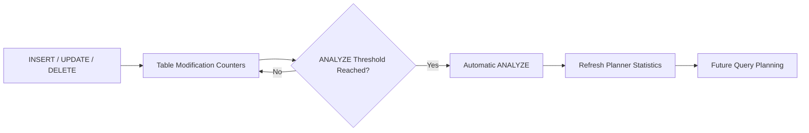
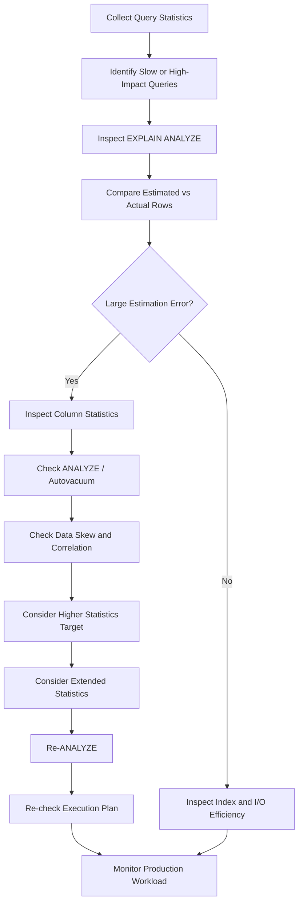

# 31- Index Statistics

## Overview

Index statistics provide the database optimizer and engineers with information about how data is distributed and how indexes are being used. They are essential for making reliable indexing decisions because an index's usefulness depends not only on its definition, but also on query patterns, data distribution, cardinality, and workload changes.

For PostgreSQL, index-related information comes from several sources:

- `pg_stat_user_indexes` and `pg_stat_all_indexes` for index usage.
- `pg_stats` and `pg_statistic` for column distribution statistics.
- `pg_stat_user_tables` for table-level activity.
- `pg_stat_statements` for query workload analysis.
- `EXPLAIN` and `EXPLAIN (ANALYZE, BUFFERS)` for execution-plan validation.
- Catalog tables such as `pg_index` and `pg_constraint` for index metadata and constraints.

A useful mental model is:

```text
Table Data
   │
   ├── Column Statistics
   │       │
   │       └── Query Planner
   │
   ├── Index Statistics
   │       │
   │       └── Query Planner / Operations
   │
   └── Query Workload
           │
           └── Execution Plans
```

Index statistics are estimates and historical measurements, not guarantees. Senior-level index tuning requires validating statistics against actual production behavior.

## Why Index Statistics Matter

A query planner must estimate the cost of different execution strategies before choosing a plan.

For a query such as:

```sql
SELECT id, total
FROM orders
WHERE customer_id = 12345;
```

PostgreSQL may choose between:

```text
Sequential Scan
      │
      └── Inspect many table rows

Index Scan
      │
      ├── Find matching index entries
      └── Fetch matching heap rows
```

The planner's decision depends heavily on its estimates.

If PostgreSQL estimates:

```text
10 matching rows
```

an index scan may be attractive.

If it estimates:

```text
800,000 matching rows
```

a sequential scan may be cheaper.

Poor statistics can therefore produce poor execution plans even when the correct index exists.

## Types of Index-Related Statistics

Index statistics can be divided into several categories.

| Category | Examples | Primary purpose |
|---|---|---|
| Usage statistics | `idx_scan`, `idx_tup_read` | Determine whether indexes are used |
| Column statistics | `n_distinct`, histogram, MCVs | Estimate predicate selectivity |
| Table statistics | `n_live_tup`, modification counters | Understand table state |
| Query statistics | Calls, execution time, rows | Identify workload patterns |
| Physical statistics | Relation size, bloat indicators | Understand storage cost |
| Plan statistics | Estimated vs actual rows | Validate planner estimates |

These categories answer different questions and should not be treated as interchangeable.

## Index Usage Statistics

PostgreSQL exposes index usage through `pg_stat_user_indexes`.

```sql
SELECT
    schemaname,
    relname AS table_name,
    indexrelname AS index_name,
    idx_scan,
    idx_tup_read,
    idx_tup_fetch
FROM pg_stat_user_indexes
ORDER BY idx_scan DESC;
```

Important columns include:

| Column | Meaning |
|---|---|
| `idx_scan` | Number of index scans initiated |
| `idx_tup_read` | Index entries returned by scans |
| `idx_tup_fetch` | Table rows fetched by scans |

For example:

```text
idx_orders_customer
    idx_scan      = 5,000,000
    idx_tup_read  = 25,000,000
    idx_tup_fetch = 24,000,000
```

This tells you the index participates heavily in the workload, but it does not prove that every scan is efficient.

## `idx_scan` vs `idx_tup_read` vs `idx_tup_fetch`

These metrics provide different perspectives.

```text
Index scan
   │
   ├── Index entries examined/returned
   │        └── idx_tup_read
   │
   └── Heap tuples fetched
            └── idx_tup_fetch
```

Consider:

```text
idx_scan      = 100,000
idx_tup_read  = 100,000,000
idx_tup_fetch = 100,000,000
```

The index is heavily used, but each scan may process a large number of entries.

Compare that with:

```text
idx_scan      = 100,000
idx_tup_read  = 200,000
idx_tup_fetch = 200,000
```

The index is filtering much more aggressively.

These values should be interpreted together with the query plan and workload.

## Column Statistics

PostgreSQL stores column-level statistics that help the planner estimate predicate selectivity.

A convenient view is:

```sql
pg_stats
```

For example:

```sql
SELECT
    schemaname,
    tablename,
    attname,
    n_distinct,
    most_common_vals,
    most_common_freqs,
    histogram_bounds,
    correlation
FROM pg_stats
WHERE tablename = 'orders';
```

Important fields include:

| Statistic | Purpose |
|---|---|
| `n_distinct` | Estimated number of distinct values |
| `most_common_vals` | Most frequently occurring values |
| `most_common_freqs` | Frequencies of common values |
| `histogram_bounds` | Distribution boundaries |
| `correlation` | Correlation between physical row order and column values |
| `null_frac` | Estimated fraction of NULL values |

These statistics help PostgreSQL answer questions such as:

```text
How many rows probably match this predicate?
```

## `n_distinct`

`n_distinct` estimates the number of distinct values in a column.

For example:

```text
customer_id:
n_distinct ≈ 5,000,000

status:
n_distinct ≈ 5
```

A high-cardinality column such as `customer_id` may be highly selective for equality predicates.

A low-cardinality column such as `status` may be less selective.

However, cardinality alone does not determine whether an index is useful.

The workload matters:

```sql
WHERE status = 'failed'
```

may be highly selective if only 0.1% of rows are failed, even though the column has only a few distinct values.

## Most Common Values

PostgreSQL records frequently occurring values.

```sql
SELECT
    attname,
    most_common_vals,
    most_common_freqs
FROM pg_stats
WHERE tablename = 'orders'
  AND attname = 'status';
```

Suppose the distribution is:

```text
completed → 95%
pending   → 4%
failed    → 1%
```

The planner can use this information when estimating:

```sql
WHERE status = 'failed'
```

versus:

```sql
WHERE status = 'completed'
```

The same index may therefore have very different usefulness depending on the predicate value.

## Histograms

For columns without a small set of dominant values, PostgreSQL maintains histogram information.

Conceptually:

```text
Value distribution

low                                    high
│                                        │
├────┬────┬────┬────┬────┬────┬────┬────┤
     histogram boundaries
```

This helps estimate range predicates such as:

```sql
WHERE created_at >= '2026-01-01'
  AND created_at < '2026-02-01';
```

Accurate distribution statistics are particularly important for:

- Range queries.
- Date/time columns.
- Numeric values.
- Unevenly distributed data.
- Large tables.

## Correlation

The `correlation` statistic describes how closely the logical ordering of a column corresponds to the physical order of table rows.

Consider a table where rows are physically stored approximately in increasing `created_at` order.

```text
created_at order
1 → 2 → 3 → 4 → 5 → 6 → ...
```

The correlation may be relatively high.

If rows are physically scattered:

```text
1 → 500 → 17 → 900 → 42 → ...
```

correlation may be lower.

This can affect the planner's estimate of the cost of an index scan because fetching many rows from scattered heap pages can require more random I/O.

## Statistics Targets

PostgreSQL does not collect unlimited statistics for every column. The amount of detail is controlled by statistics targets.

Check the current target:

```sql
SELECT
    attname,
    attstattarget
FROM pg_attribute
WHERE attrelid = 'orders'::regclass
  AND attnum > 0
  AND NOT attisdropped;
```

The default target can be adjusted at column level:

```sql
ALTER TABLE orders
ALTER COLUMN status SET STATISTICS 500;
```

Then refresh statistics:

```sql
ANALYZE orders;
```

Higher statistics targets can improve estimates for complex or highly skewed distributions, but they increase statistics collection and planning overhead.

Do not increase statistics targets indiscriminately across every column.

## When to Increase Statistics Targets

Consider increasing the target when:

- A column has highly skewed values.
- Queries frequently filter on that column.
- Estimated row counts are consistently inaccurate.
- The table contains many distinct values.
- Query plans change unexpectedly because of poor estimates.
- A workload depends heavily on predicates involving that column.

Example:

```text
Estimated rows: 100
Actual rows:    2,500,000
```

This large mismatch is a stronger reason to investigate statistics than simply observing that the column has many distinct values.

## Running `ANALYZE`

`ANALYZE` collects statistics used by the optimizer.

For a table:

```sql
ANALYZE orders;
```

For a specific column:

```sql
ANALYZE orders (customer_id);
```

For the whole database:

```sql
ANALYZE;
```

In production, PostgreSQL's autovacuum subsystem normally performs automatic `ANALYZE` based on table activity.

Manual `ANALYZE` is useful after:

- Large data loads.
- Major data distribution changes.
- Bulk deletes.
- Bulk updates.
- Significant migrations.
- Data restoration.
- ETL operations.

## Autovacuum and Statistics

Autovacuum is not only about reclaiming dead tuples.

It also performs automatic `ANALYZE` based on table modification activity.

A simplified lifecycle is:



If statistics are consistently stale on a high-churn table, investigate:

- Autovacuum configuration.
- Table-specific settings.
- Modification rates.
- Analyze thresholds.
- Long-running transactions.
- Operational workload patterns.

## Detecting Stale Statistics

A common symptom is a large difference between estimated and actual rows.

```sql
EXPLAIN (ANALYZE, BUFFERS)
SELECT *
FROM orders
WHERE customer_id = 12345;
```

Suppose the plan reports:

```text
Index Scan
  estimated rows: 10
  actual rows:    250,000
```

That is a significant estimation error.

Possible causes include:

- Stale statistics.
- Highly skewed data.
- Insufficient statistics target.
- Correlated predicates.
- Data distribution changes.
- Planner limitations.

Do not automatically assume that the index is wrong.

## Estimated Rows vs Actual Rows

One of the most important index-related diagnostics is:

```text
Estimated rows
        vs
Actual rows
```

A simplified example:

```text
Index Scan
  Index Cond: customer_id = 12345
  estimated rows: 50
  actual rows:    52
```

This is a healthy estimate.

Compare:

```text
estimated rows: 50
actual rows:    500,000
```

The planner may significantly underestimate the cost of the chosen access path.

That can lead to poor decisions such as:

- Nested loop joins over large datasets.
- Index scans where sequential scans would be cheaper.
- Incorrect join ordering.
- Excessive random I/O.

## Query Statistics with `pg_stat_statements`

Index statistics become much more useful when correlated with query-level statistics.

```sql
SELECT
    queryid,
    calls,
    total_exec_time,
    mean_exec_time,
    rows,
    shared_blks_hit,
    shared_blks_read,
    query
FROM pg_stat_statements
ORDER BY total_exec_time DESC
LIMIT 20;
```

This helps identify:

```text
Expensive query
    ↓
Execution plan
    ↓
Estimated vs actual rows
    ↓
Index access path
    ↓
Statistics quality
```

Index tuning should start from actual workload rather than from index inventory alone.

## Index Statistics vs Table Statistics

These are related but distinct.

| Statistics | Main question |
|---|---|
| Index usage statistics | Is the index being used? |
| Column statistics | How selective is a predicate likely to be? |
| Table statistics | How large/active is the table? |
| Query statistics | Which queries consume resources? |
| Execution plan | What access path was selected? |

For example:

```text
Index usage:
idx_orders_customer → heavily used

Column statistics:
customer_id → highly selective

Query statistics:
GET /orders → high traffic

Execution plan:
Index Scan → efficient

Conclusion:
Index is likely valuable
```

No individual statistic provides that conclusion by itself.

## Statistics and Composite Indexes

Consider:

```sql
CREATE INDEX idx_orders_customer_status_created
ON orders (customer_id, status, created_at DESC);
```

Column statistics exist independently for the individual columns, but multi-column predicates can involve relationships between columns.

For example:

```sql
WHERE customer_id = 12345
  AND status = 'pending'
```

The actual relationship between `customer_id` and `status` may not be accurately represented by multiplying independent selectivity estimates.

PostgreSQL supports extended statistics for cases where column relationships matter.

## Extended Statistics

Create extended statistics:

```sql
CREATE STATISTICS orders_customer_status_stats
    (dependencies, ndistinct, mcv)
ON customer_id, status
FROM orders;
```

Then collect statistics:

```sql
ANALYZE orders;
```

These statistics can help the planner understand relationships between columns.

Useful types include:

| Type | Helps estimate |
|---|---|
| `dependencies` | Functional or near-functional relationships |
| `ndistinct` | Number of distinct combinations |
| `mcv` | Most common combinations |

This is particularly useful for correlated predicates.

## Example: Correlated Columns

Suppose an application has:

```text
country
city
```

and almost every city belongs to exactly one country.

A query:

```sql
WHERE country = 'IN'
  AND city = 'Mumbai'
```

may be difficult to estimate accurately if PostgreSQL assumes the columns are independent.

Extended statistics can provide better information about the relationship.

This can improve plan selection without changing the index itself.

## Statistics and Partial Indexes

Partial indexes depend on predicates.

Example:

```sql
CREATE INDEX idx_jobs_pending_run_at
ON jobs (run_at)
WHERE status = 'pending';
```

The planner must determine whether the query predicate is compatible with the partial-index predicate.

A query such as:

```sql
SELECT id
FROM jobs
WHERE status = 'pending'
  AND run_at <= now()
ORDER BY run_at
LIMIT 100;
```

may benefit significantly.

Statistics about `status` and `run_at` help the planner estimate the matching population.

## Statistics and Range Queries

For:

```sql
SELECT *
FROM events
WHERE created_at >= now() - interval '1 hour';
```

the planner needs an estimate of how many rows fall within the time range.

If the table has rapidly changing data and statistics are stale, the estimate may become inaccurate.

This is especially relevant for:

- Event tables.
- Logs.
- Time-series workloads.
- Audit tables.
- Append-heavy tables.

Frequent `ANALYZE` activity may be necessary for heavily changing datasets.

## Statistics and Data Skew

Uniform-distribution assumptions can be dangerous.

Suppose:

```text
tenant_id = 1       → 60% of rows
tenant_id = 2       → 10%
tenant_id = 3       → 5%
other tenants       → 25%
```

A query for tenant `1` has very different selectivity from a query for tenant `9000`.

The planner's statistics need to represent this skew accurately.

This is one reason most-common-value statistics are important.

## Statistics and Partitioned Tables

Partitioned workloads require additional attention.

For example:

```text
orders
├── orders_2025
├── orders_2026_01
├── orders_2026_02
└── orders_2026_03
```

The planner must reason about:

- Partition pruning.
- Partition-level statistics.
- Data distribution within partitions.
- Indexes on individual partitions.

A query against a recent partition may behave differently from a query spanning many partitions.

Monitor statistics at the appropriate partition and parent-table levels.

## Monitoring Statistics Quality

A practical monitoring system should track:

```text
Query
  │
  ├── Estimated rows
  ├── Actual rows
  ├── Execution time
  ├── Buffer hits
  ├── Buffer reads
  └── Access path
```

Useful derived metrics include:

```text
row_estimation_ratio =
    actual_rows / estimated_rows
```

For example:

```text
estimated = 100
actual    = 10,000

ratio = 100x
```

Large estimation errors are useful investigation signals.

The threshold should be workload-specific rather than universally fixed.

## Production Monitoring Workflow

A practical workflow is:



The important principle is to fix the source of the estimation problem rather than blindly adding indexes.

## Practical Statistics Queries

### Inspect Column Statistics

```sql
SELECT
    schemaname,
    tablename,
    attname,
    null_frac,
    n_distinct,
    most_common_vals,
    most_common_freqs,
    histogram_bounds,
    correlation
FROM pg_stats
WHERE tablename = 'orders';
```

### Inspect Table Modification Activity

```sql
SELECT
    schemaname,
    relname AS table_name,
    n_live_tup,
    n_dead_tup,
    n_tup_ins,
    n_tup_upd,
    n_tup_del,
    last_analyze,
    last_autoanalyze
FROM pg_stat_user_tables
WHERE relname = 'orders';
```

### Inspect Index Usage

```sql
SELECT
    schemaname,
    relname AS table_name,
    indexrelname AS index_name,
    idx_scan,
    idx_tup_read,
    idx_tup_fetch
FROM pg_stat_user_indexes
WHERE relname = 'orders'
ORDER BY idx_scan DESC;
```

### Inspect Index Size

```sql
SELECT
    indexrelname AS index_name,
    pg_size_pretty(pg_relation_size(indexrelid)) AS index_size
FROM pg_stat_user_indexes
WHERE relname = 'orders'
ORDER BY pg_relation_size(indexrelid) DESC;
```

## Statistics Maintenance Strategy

For most production PostgreSQL systems:

```text
Normal workload
    ↓
Autovacuum + autoanalyze
    ↓
Periodic monitoring
    ↓
Investigate estimation anomalies
    ↓
Targeted manual ANALYZE / configuration
```

Avoid turning statistics maintenance into a blanket manual operation.

A better strategy is targeted intervention based on observed workload behavior.

For high-churn tables, consider table-specific autovacuum settings when defaults are not keeping statistics sufficiently current.

Example:

```sql
ALTER TABLE events SET (
    autovacuum_analyze_scale_factor = 0.02,
    autovacuum_analyze_threshold = 1000
);
```

The correct values depend on table size and workload.

A setting that is appropriate for a 10-million-row event table may be wasteful for a small lookup table.

## Index Statistics and Read/Write Trade-offs

Statistics should support broader index decisions.

For an index:

```text
idx_orders_customer_status
```

evaluate:

| Dimension | Question |
|---|---|
| Usage | How often is it scanned? |
| Selectivity | How much does it filter? |
| Latency | Does it improve important queries? |
| Storage | How large is it? |
| Writes | How much maintenance does it add? |
| Distribution | Are values skewed? |
| Stability | Does the workload change frequently? |

This prevents the common mistake of optimizing one dimension while ignoring the rest.

## Production Considerations

### Statistics Are Estimates

`pg_stats` values are sampled estimates rather than exact representations of every row.

Do not treat:

```text
n_distinct = 1,000,000
```

as an exact count unless the underlying statistic semantics specifically guarantee it.

### Statistics Become Stale

Large data changes can invalidate assumptions made by older statistics.

Monitor:

```text
last_analyze
last_autoanalyze
```

alongside table modification rates.

### Statistics Collection Has a Cost

Increasing statistics targets or analyzing very large tables more frequently consumes CPU and I/O.

Tune based on measured query-planning problems.

### Plan Changes Need Validation

After statistics changes, compare:

- Execution plan.
- Estimated rows.
- Actual rows.
- Query latency.
- Buffer reads.
- CPU.
- Application throughput.

A new plan is not automatically a better plan.

### Statistics and Replicas

Read replicas may have different workloads from the primary.

Analyze query behavior for the workload that actually executes on each node.

### Managed PostgreSQL

For Amazon RDS or Aurora PostgreSQL, correlate database statistics with service-level metrics such as:

- CPU utilization.
- Read/write IOPS.
- Storage.
- Database connections.
- Replica lag.
- Latency.

Database statistics explain *why* a workload behaves a certain way; infrastructure metrics show its system-level impact.

## Common Mistakes

### Mistaking Cardinality for Selectivity

A column with many distinct values is often selective, but not every predicate is selective.

**Avoid it:** Evaluate the actual predicate and value distribution.

### Assuming `ANALYZE` Fixes Every Bad Plan

Statistics may be accurate while the query still has a poor plan because of:

- Correlated columns.
- Query structure.
- Missing indexes.
- Cost-model assumptions.
- Data access patterns.

**Avoid it:** Compare estimated and actual rows and inspect the complete execution plan.

### Increasing Every Statistics Target

More statistics are not free.

**Avoid it:** Increase targets only for columns where estimate quality justifies the additional overhead.

### Ignoring Data Skew

A query for a very common value can behave very differently from one for a rare value.

**Avoid it:** Inspect `most_common_vals` and `most_common_freqs`.

### Ignoring Correlated Columns

Independent column estimates can be inaccurate when predicates involve related attributes.

**Avoid it:** Consider extended statistics.

### Treating `idx_scan` as Proof of Index Quality

A heavily used index can still support an inefficient workload.

**Avoid it:** Inspect execution plans, row counts, buffer activity, and query latency.

### Manually Running `ANALYZE` Everywhere

Frequent unnecessary manual analysis adds operational overhead.

**Avoid it:** Let autovacuum/autoanalyze handle normal maintenance and intervene based on evidence.

### Ignoring Statistics After Bulk Loads

A newly loaded table can have statistics that do not represent the new distribution.

**Avoid it:** Run targeted `ANALYZE` after significant bulk data changes when automatic maintenance has not yet caught up.

## Interview Traps

### "Are PostgreSQL Statistics Exact?"

Generally, no. Planner statistics are primarily estimates derived from sampled data and maintained metadata.

### "Why Can PostgreSQL Ignore an Index Even When It Exists?"

Because the planner estimates that another plan is cheaper. Causes can include:

- Low predicate selectivity.
- Stale or inaccurate statistics.
- High estimated heap I/O.
- Small table size.
- Query shape.
- Cost configuration.

### "What Does `ANALYZE` Do?"

It collects table and column statistics used by the query planner to estimate row counts and costs.

It does **not** rebuild indexes or physically reorganize the table.

### "What Is the Difference Between `ANALYZE` and `VACUUM`?"

`ANALYZE` primarily updates planner statistics.

`VACUUM` primarily manages dead tuples and visibility information and can also trigger analysis as part of autovacuum behavior.

They solve different problems.

### "What Does a Large Estimated-vs-Actual Row Difference Tell You?"

It is a strong signal that the planner's cardinality estimate may be wrong.

Possible causes include stale statistics, skew, correlation, or limitations in the available statistics.

### "Can Better Statistics Replace an Index?"

Sometimes a better estimate allows PostgreSQL to choose an existing efficient plan, but statistics do not provide an access path themselves.

If the required access path does not exist, an index may still be necessary.

## Best Practices

- Treat index statistics as one component of a broader query-performance investigation.
- Use `pg_stat_user_indexes` to understand index usage.
- Use `pg_stats` to understand column distributions and selectivity.
- Compare estimated and actual rows with `EXPLAIN (ANALYZE, BUFFERS)`.
- Monitor `last_analyze` and `last_autoanalyze` on high-churn tables.
- Let autovacuum and autoanalyze handle normal statistics maintenance.
- Use targeted statistics targets for columns with difficult distributions or persistent estimation errors.
- Use extended statistics when correlated columns cause inaccurate multi-column estimates.
- Validate statistics changes against actual production query latency and resource consumption.
- Treat `idx_scan` as a usage signal rather than proof that an index is efficient or necessary.
- Consider data skew when evaluating low-cardinality indexed columns.
- Re-analyze after major bulk data changes when appropriate.
- Monitor statistics behavior on large partitioned and multi-tenant datasets.
- Correlate database statistics with `pg_stat_statements` and application telemetry.
- Avoid blindly increasing statistics targets or manually running `ANALYZE` across the entire database.
- Include statistics behavior in performance regression investigations and production capacity planning.

## Key Takeaways

- **PostgreSQL index performance depends heavily on planner statistics, which provide estimates about cardinality, selectivity, distribution, and physical data correlation.**
- **Use `pg_stat_user_indexes` for index usage and `pg_stats` for column distribution; neither source alone explains whether an index is actually effective.**
- **Large differences between estimated and actual row counts are a key signal for investigating stale statistics, data skew, column correlation, or insufficient statistics detail.**
- **Use targeted `ANALYZE`, higher statistics targets, and extended statistics when evidence shows that planner estimates are inaccurate; avoid indiscriminate tuning.**
- **Senior-level index optimization connects statistics, execution plans, query workload, I/O, storage, and write costs rather than optimizing any single metric in isolation.**