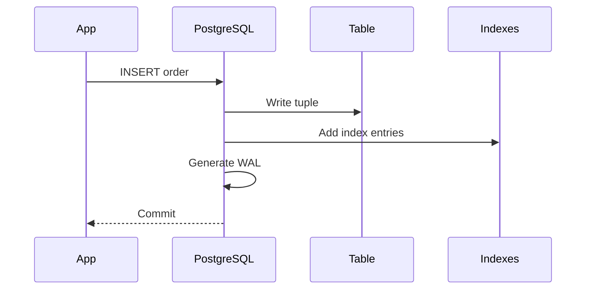
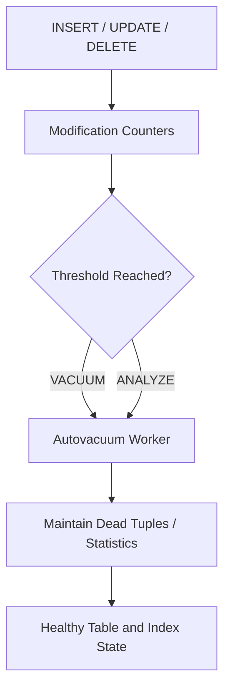
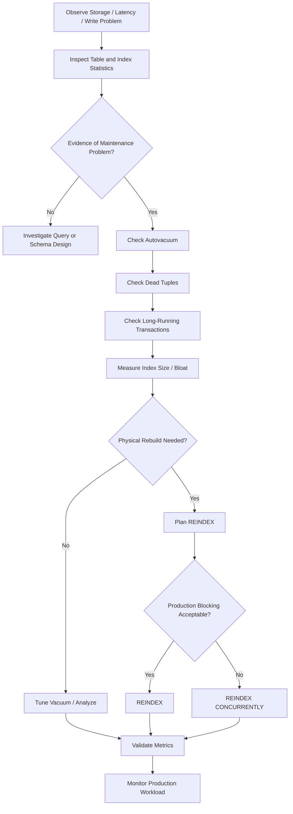

# 32- Index Maintenance

## Overview

Indexes improve read performance by providing efficient access paths, but they are not free. As tables change, indexes must be maintained alongside the underlying data. Inserts, updates, and deletes can create index entries, dead tuples, page fragmentation, and stale planner statistics.

In PostgreSQL, index maintenance is closely connected to:

- `VACUUM` and autovacuum.
- `ANALYZE` and autoanalyze.
- Index bloat and physical page utilization.
- `REINDEX`.
- `CREATE INDEX CONCURRENTLY`.
- Table and index statistics.
- Long-running transactions.
- Write-heavy workloads.
- Storage and I/O capacity.

A useful production model is:

```text
Application Writes
       │
       ├── INSERT ──┐
       ├── UPDATE ──┼──> Table + Index Maintenance
       └── DELETE ──┘
                       │
                       ├── Dead Tuples
                       ├── Index Growth
                       ├── Page Splits
                       └── Statistics Changes
                                  │
                                  ▼
                       VACUUM / ANALYZE / REINDEX
```

Index maintenance is therefore not simply "rebuild indexes periodically." The correct operation depends on the underlying problem.

## Why Index Maintenance Matters

An index is a physical data structure stored separately from the table heap. Every relevant table modification may require corresponding index changes.

For example:

```sql
CREATE INDEX idx_orders_customer_id
ON orders (customer_id);
```

An insert into `orders` generally requires:

```text
INSERT row
   │
   ├── Write table tuple
   └── Add index entry
```

If the table has five indexes, one logical insert can require maintenance of all five indexes.

This creates a fundamental trade-off:

| Benefit | Cost |
|---|---|
| Faster reads | More storage |
| Faster filtering | Slower writes |
| Faster joins | More WAL generation |
| Faster ordering | More cache pressure |
| Better query plans | Maintenance overhead |

Good index maintenance keeps these costs under control without unnecessarily sacrificing query performance.

## PostgreSQL Table and Index Architecture

PostgreSQL stores tables and indexes as relations backed by disk pages.

A simplified model is:

```text
Database
   │
   ├── Table relation
   │      ├── Heap pages
   │      └── Tuples
   │
   └── Index relation
          ├── Index pages
          └── Index entries
```

For a B-tree index:

```text
Root
 │
 ├── Internal pages
 │      ├── Internal page
 │      └── Internal page
 │
 └── Leaf pages
        ├── Key → TID
        ├── Key → TID
        └── Key → TID
```

Updates and deletes can cause physical changes to both the table and its indexes.

## What Happens During INSERT

Consider:

```sql
INSERT INTO orders (
    customer_id,
    status,
    created_at,
    total
)
VALUES (
    12345,
    'pending',
    now(),
    149.99
);
```

If the table has indexes on `customer_id`, `status`, and `created_at`, PostgreSQL must maintain those structures as part of the write.

Conceptually:



The exact internal behavior depends on PostgreSQL's storage and transaction mechanisms, but the important engineering implication is that every additional index increases write-path work.

## What Happens During UPDATE

Updates require particular attention.

Suppose:

```sql
UPDATE orders
SET status = 'completed'
WHERE id = 1001;
```

If `status` is indexed, the index must reflect the new value.

If the updated column is not indexed, PostgreSQL may be able to use a HOT update under suitable conditions, avoiding new index entries.

This distinction is important for write-heavy systems.

### HOT Updates

Heap-Only Tuples, or HOT updates, allow PostgreSQL to create a new row version without updating indexes when the indexed columns remain unchanged and other storage conditions permit it.

Conceptually:

```text
UPDATE row
   │
   ├── Indexed column changed?
   │        │
   │        ├── Yes → Index maintenance required
   │        │
   │        └── No → HOT may be possible
   │
   └── New row version
```

This is one reason unnecessary indexes can hurt write performance beyond their raw storage footprint.

## What Happens During DELETE

A delete creates a dead tuple that remains physically present until vacuum can clean it up.

Conceptually:

```text
DELETE
  │
  ▼
Tuple becomes dead
  │
  ▼
VACUUM determines it is removable
  │
  ├── Heap cleanup
  └── Index cleanup / visibility maintenance
```

A delete does not mean the corresponding disk pages immediately shrink.

This distinction is important when investigating storage growth.

## VACUUM vs ANALYZE

These operations solve different problems.

| Operation | Primary purpose |
|---|---|
| `VACUUM` | Reclaim/reuse dead tuple space and maintain visibility information |
| `ANALYZE` | Collect planner statistics |
| `REINDEX` | Rebuild an index |
| `VACUUM FULL` | Rewrite the table to compact it aggressively |

Do not use them interchangeably.

## VACUUM

Normal vacuum is an essential part of PostgreSQL maintenance.

```sql
VACUUM orders;
```

It can:

- Mark dead tuple space as reusable.
- Update visibility information.
- Clean up dead index entries where appropriate.
- Help prevent transaction ID wraparound.
- Improve the effectiveness of index-only scans through visibility map maintenance.

Normal `VACUUM` generally does not rewrite the entire table.

That makes it suitable for routine production maintenance.

## VACUUM ANALYZE

You can combine vacuum and statistics collection:

```sql
VACUUM (ANALYZE) orders;
```

This is useful when both physical cleanup and planner statistics need attention.

However, routine systems should normally rely on autovacuum rather than scheduling blanket manual `VACUUM ANALYZE` operations without evidence.

## Autovacuum

Autovacuum is PostgreSQL's automatic maintenance mechanism.

It can automatically perform:

- Vacuuming.
- Analyzing.

A simplified workflow:



For production systems, autovacuum configuration should be considered part of index and database maintenance strategy.

## Monitoring Autovacuum

Inspect table maintenance information:

```sql
SELECT
    schemaname,
    relname AS table_name,
    n_live_tup,
    n_dead_tup,
    last_vacuum,
    last_autovacuum,
    last_analyze,
    last_autoanalyze
FROM pg_stat_user_tables
ORDER BY n_dead_tup DESC;
```

A high `n_dead_tup` value does not automatically mean that the system is broken, but it is a useful signal when combined with:

- Table size.
- Modification rate.
- Autovacuum timing.
- Query latency.
- Storage growth.
- Long-running transactions.

## Index Usage Monitoring

Inspect index activity:

```sql
SELECT
    schemaname,
    relname AS table_name,
    indexrelname AS index_name,
    idx_scan,
    idx_tup_read,
    idx_tup_fetch
FROM pg_stat_user_indexes
ORDER BY idx_scan ASC;
```

This can identify indexes that appear unused or rarely used.

However, low usage does not automatically mean an index should be removed.

An index may be:

- Used by rare but critical queries.
- Used only during reporting.
- Required by a constraint.
- Needed for an operational incident path.
- Used by workloads that have not occurred since statistics were reset.

Always validate before dropping.

## Identifying Large Indexes

Index storage should be monitored independently from table storage.

```sql
SELECT
    schemaname,
    relname AS table_name,
    indexrelname AS index_name,
    pg_size_pretty(pg_relation_size(indexrelid)) AS index_size
FROM pg_stat_user_indexes
ORDER BY pg_relation_size(indexrelid) DESC;
```

Large indexes are not necessarily problematic. A large, heavily used index can be completely justified.

The useful question is:

> Is the storage and write cost justified by the workload benefit?

## Index Bloat

Index bloat refers broadly to inefficient use of index pages caused by accumulated changes, page splits, deleted entries, and other physical characteristics.

Bloat can increase:

- Index size.
- Buffer-cache pressure.
- Disk I/O.
- Backup size.
- Maintenance work.

A simplified representation:

```text
Healthy index

[used][used][used][used][used]


Fragmented / less efficient index

[used][free][used][free][free][used]
```

Actual PostgreSQL index layout is more complex than this model, and "free space" should not be interpreted as simply equivalent to permanently wasted bytes.

## Causes of Index Bloat

Common contributors include:

- Heavy updates.
- Heavy deletes.
- Random insert patterns.
- B-tree page splits.
- Long-running transactions delaying cleanup.
- Workloads with frequent churn.
- Indexes that have become much larger than the current workload requires.

Bloat should be measured rather than assumed.

## Does VACUUM Remove Index Bloat?

Normal `VACUUM` can clean dead index entries and make space reusable, but it generally does not compact an index into a smaller physical relation.

Therefore:

```text
VACUUM
    ↓
Clean/reuse internal free space

REINDEX
    ↓
Build a new index structure
```

If the objective is to physically rebuild an index, `REINDEX` is the relevant operation.

## REINDEX

`REINDEX` rebuilds an index.

For a specific index:

```sql
REINDEX INDEX idx_orders_customer_id;
```

For all indexes on a table:

```sql
REINDEX TABLE orders;
```

For an entire database:

```sql
REINDEX DATABASE production_db;
```

The appropriate scope should be as narrow as possible.

Rebuilding an entire database just because one index is inefficient is usually excessive.

## When to REINDEX

Consider reindexing when there is evidence of:

- Significant index corruption.
- Severe index bloat or inefficient structure.
- An index that needs physical rebuilding.
- A relevant storage or performance issue that rebuilding can address.
- Certain operational or version-specific maintenance requirements.

Do not adopt:

```text
"REINDEX every Sunday"
```

as a generic maintenance policy.

Routine reindexing without evidence wastes I/O and can create operational risk.

## REINDEX CONCURRENTLY

For production systems where availability matters, PostgreSQL supports:

```sql
REINDEX INDEX CONCURRENTLY idx_orders_customer_id;
```

Concurrent reindexing reduces blocking of normal table operations compared with a regular reindex, at the cost of additional work and complexity.

Use it when:

- The index is important to production traffic.
- Blocking writes or reads is unacceptable.
- The operational environment supports the required PostgreSQL behavior.

Always validate version-specific restrictions and operational requirements before running it.

## Regular REINDEX vs Concurrent REINDEX

| Property | `REINDEX` | `REINDEX CONCURRENTLY` |
|---|---|---|
| Rebuilds index | Yes | Yes |
| Lower blocking impact | No | Yes |
| Additional work | Lower | Higher |
| Operational complexity | Lower | Higher |
| Production suitability | Depends on workload | Often preferable for live systems |
| Transaction behavior | Simpler | More complex |

Concurrent operations are not automatically better. They trade lower blocking for additional resource consumption and operational complexity.

## CREATE INDEX CONCURRENTLY

When creating a new production index without blocking normal writes, use:

```sql
CREATE INDEX CONCURRENTLY idx_orders_customer_status
ON orders (customer_id, status);
```

This is different from `REINDEX CONCURRENTLY`.

| Command | Purpose |
|---|---|
| `CREATE INDEX CONCURRENTLY` | Create a new index with reduced blocking |
| `REINDEX CONCURRENTLY` | Rebuild an existing index with reduced blocking |

`CREATE INDEX CONCURRENTLY` can take substantially longer and consume more resources than a regular index build.

## Index Maintenance and Transactions

Long-running transactions can interfere with cleanup.

Conceptually:

```text
Transaction A
    │
    └── Holds old snapshot
             │
             ▼
        Dead tuples remain
             │
             ▼
        VACUUM cannot fully remove them
             │
             ▼
        Table / indexes grow
```

Monitor long-running transactions when investigating persistent dead tuples or vacuum problems.

Useful query:

```sql
SELECT
    pid,
    usename,
    application_name,
    state,
    xact_start,
    now() - xact_start AS transaction_age,
    query
FROM pg_stat_activity
WHERE xact_start IS NOT NULL
ORDER BY xact_start;
```

Application bugs can therefore become database maintenance problems.

## Index Maintenance and Write Amplification

Every index participating in a write increases the amount of work required to maintain the database.

Suppose a table has:

```text
orders
├── primary key index
├── customer_id index
├── status index
├── created_at index
├── customer_status index
└── customer_created_at index
```

An insert may need to update several index structures.

At high write rates, this can increase:

- CPU utilization.
- WAL volume.
- Disk writes.
- Replication traffic.
- Storage consumption.
- Checkpoint pressure.

This is why "add an index for every query" is not a scalable strategy.

## Index Maintenance and WAL

Index modifications contribute to WAL.

More indexes generally mean more write activity that must be represented in WAL, although the exact volume depends on the operation and index type.

This can affect:

- Replication bandwidth.
- Replica replay.
- Point-in-time recovery.
- WAL retention.
- Storage costs.

A write-heavy microservice can therefore experience replication pressure simply from an overly indexed table.

## Index Maintenance and Replication

On a primary/replica architecture:

```text
Application
     │
     ▼
Primary PostgreSQL
     │
     ├── Table changes
     ├── Index changes
     └── WAL
          │
          ▼
      Read Replica
```

Heavy index maintenance can contribute to WAL generation and replica lag.

For Aurora PostgreSQL, RDS PostgreSQL, or self-managed PostgreSQL, monitor:

- WAL generation.
- Replica lag.
- I/O.
- CPU.
- Storage.
- Checkpoint behavior.

Index maintenance should be evaluated as part of the entire replication topology.

## Index Maintenance During Deployments

Schema changes should be treated as production operations.

For a large table:

```sql
CREATE INDEX CONCURRENTLY idx_orders_customer_created
ON orders (customer_id, created_at DESC);
```

This can run for a significant amount of time.

A deployment strategy should consider:

- Migration duration.
- Lock behavior.
- Database CPU.
- I/O saturation.
- Replication lag.
- Application traffic.
- Failure recovery.
- Partial or invalid indexes.

Avoid putting expensive blocking index builds into a migration path that must complete quickly during application startup.

## Failed Concurrent Index Builds

Concurrent index creation can leave an invalid index after failure.

Inspect indexes using:

```sql
SELECT
    schemaname,
    tablename,
    indexname,
    indexdef
FROM pg_indexes
WHERE tablename = 'orders';
```

For deeper catalog inspection:

```sql
SELECT
    c.relname AS index_name,
    i.indisvalid,
    i.indisready
FROM pg_class c
JOIN pg_index i
    ON i.indexrelid = c.oid
WHERE c.relname = 'idx_orders_customer_created';
```

If a concurrent build fails, investigate the resulting index state before retrying blindly.

## Index Maintenance and Constraints

Not every index is an ordinary query optimization index.

Some indexes enforce constraints.

For example:

```sql
CREATE UNIQUE INDEX idx_users_email
ON users (email);
```

Dropping or rebuilding an index associated with a constraint requires additional care.

Before removing an index, determine whether it supports:

- A primary key.
- A unique constraint.
- An exclusion constraint.
- Foreign-key-related access patterns.
- Application queries.

Never classify indexes solely by `idx_scan`.

## Index Maintenance Checklist

Before changing an index:

1. Identify the workload using the index.
2. Determine whether it supports a constraint.
3. Check usage statistics.
4. Check index size.
5. Inspect representative execution plans.
6. Understand write frequency on the table.
7. Consider replication and WAL impact.
8. Check maintenance history.
9. Choose the least disruptive operation.
10. Validate after the change.

## Production Maintenance Workflow



## Measuring Before and After Maintenance

Never evaluate maintenance solely by whether an operation completed successfully.

Before the operation, capture:

- Index size.
- Query latency.
- Buffer reads/hits.
- Execution plan.
- CPU.
- I/O.
- WAL rate.
- Replica lag.

After the operation, compare the same metrics.

Example:

```sql
EXPLAIN (ANALYZE, BUFFERS)
SELECT id, total
FROM orders
WHERE customer_id = 12345
ORDER BY created_at DESC
LIMIT 50;
```

The goal is to determine whether maintenance produced a meaningful operational improvement.

## Index Maintenance Strategy by Workload

| Workload | Primary concern | Maintenance focus |
|---|---|---|
| Read-heavy | Query latency | Preserve useful indexes and monitor bloat |
| Write-heavy | Write amplification | Minimize unnecessary indexes |
| High-churn | Dead tuples | Autovacuum effectiveness |
| Large analytical | Storage/I/O | Statistics, scan efficiency, selective indexing |
| Multi-tenant | Skew | Statistics and tenant-aware indexing |
| Time-series | Rapid data changes | Vacuum/analyze and partition strategy |
| High availability | Blocking | Concurrent maintenance |
| Replica-heavy | WAL volume | Index/write amplification |

## Django and FastAPI Applications

Application frameworks can unintentionally create excessive indexes.

For Django:

```python
class Order(models.Model):
    customer_id = models.BigIntegerField(db_index=True)
    status = models.CharField(max_length=32, db_index=True)
    created_at = models.DateTimeField(db_index=True)
```

This is convenient, but it can result in several independent indexes.

Before adding another index through `Meta.indexes`:

```python
class Meta:
    indexes = [
        models.Index(
            fields=["customer_id", "-created_at"],
            name="orders_customer_created_idx",
        ),
    ]
```

check whether existing indexes already provide the required access path.

For FastAPI, the same database principles apply regardless of the ORM or database-access library used.

Framework abstraction does not remove database maintenance costs.

## Migration Best Practices

For large production tables:

- Avoid unnecessary index creation during peak traffic.
- Prefer concurrent index creation where appropriate.
- Test migration behavior on production-sized data.
- Monitor database resources while migrations execute.
- Make migrations observable and reversible where practical.
- Do not assume a migration that works on a development database will behave similarly on a billion-row production table.

For Django specifically, long-running PostgreSQL operations may require migration patterns that avoid wrapping concurrent index operations in a transaction.

The exact migration strategy should match the PostgreSQL and Django versions in use.

## Common Mistakes

### Rebuilding Every Index Periodically

A blanket reindexing schedule is usually unnecessary.

**Why it happens:** Indexes are treated as static objects that periodically need "refreshing."

**Avoid it:** Measure index size, usage, bloat, and workload impact first.

### Confusing VACUUM With REINDEX

`VACUUM` and `REINDEX` solve different problems.

**Avoid it:** Use vacuum for routine tuple cleanup and reindex only when rebuilding an index is justified.

### Dropping Low-Usage Indexes Immediately

An index with a low `idx_scan` count may still be operationally important.

**Avoid it:** Check constraints, application queries, reporting workloads, statistics reset times, and query plans before removal.

### Ignoring Autovacuum

Manual maintenance cannot reliably replace correct autovacuum configuration on active systems.

**Avoid it:** Monitor autovacuum effectiveness and tune high-churn tables based on measured workload.

### Running Blocking Maintenance During Peak Traffic

A regular `REINDEX` or non-concurrent index build can cause unacceptable blocking.

**Avoid it:** Use concurrent operations when appropriate and schedule heavier work during controlled maintenance windows.

### Ignoring Long-Running Transactions

A transaction can prevent cleanup from progressing.

**Avoid it:** Monitor transaction age and investigate sessions that retain old snapshots for excessive periods.

### Adding Indexes Without Considering Writes

Every additional index increases maintenance work.

**Avoid it:** Evaluate read benefit against write amplification, storage, WAL, and replication cost.

### Assuming Index Size Alone Means Bloat

Large indexes can be legitimate.

**Avoid it:** Compare size with table size, usage, workload, and appropriate bloat measurements.

### Running `VACUUM FULL` Casually

`VACUUM FULL` rewrites the table and requires much stronger locking than normal vacuum.

**Avoid it:** Treat it as a disruptive table-rewrite operation requiring explicit planning.

## Interview Traps

### "Does VACUUM Shrink the Index File?"

Normal `VACUUM` primarily makes dead space reusable and performs maintenance. It does not generally compact an index into a smaller physical relation the way rebuilding it can.

### "Why Do Indexes Slow Down Writes?"

Because writes may require corresponding index modifications. More indexes mean more CPU, memory, I/O, WAL, and storage work.

### "When Should You REINDEX?"

When there is evidence that rebuilding the index is justified, such as corruption or significant structural inefficiency. Routine periodic reindexing without evidence is not a general best practice.

### "What Is the Difference Between REINDEX and VACUUM?"

`VACUUM` performs routine table/index maintenance and dead-tuple cleanup. `REINDEX` rebuilds an index.

### "Why Can Long Transactions Cause Bloat?"

Old snapshots can prevent PostgreSQL from determining that old row versions are no longer visible to any transaction. This can delay cleanup and allow dead data to accumulate.

### "Why Use CREATE INDEX CONCURRENTLY?"

To reduce blocking of normal table operations while creating a new index, at the cost of additional work and operational complexity.

## Operational Best Practices

- Let autovacuum handle routine maintenance unless evidence indicates it needs tuning.
- Monitor dead tuples, autovacuum activity, analyze activity, index usage, and index size.
- Treat `REINDEX` as a targeted remediation operation rather than routine housekeeping.
- Prefer concurrent index operations when production availability requires reduced blocking.
- Monitor CPU, I/O, WAL generation, and replica lag during large index operations.
- Test index migrations against production-scale data.
- Investigate long-running transactions when vacuum cleanup appears ineffective.
- Review indexes as part of schema evolution and query optimization.
- Remove redundant indexes only after validating workload and constraint dependencies.
- Consider write amplification before adding indexes to high-throughput tables.
- Capture before-and-after execution plans for maintenance operations intended to improve query performance.
- Tune autovacuum settings per high-churn table when global defaults are insufficient.
- Treat database maintenance as an operational workload with capacity and failure considerations.
- Use monitoring and evidence rather than fixed maintenance schedules.
- Document destructive or disruptive maintenance operations and their rollback/recovery procedures.

## Key Takeaways

- **Index maintenance is a continuous interaction between table writes, dead tuples, autovacuum, statistics, storage, and index structure—not simply periodic index rebuilding.**
- **Use `VACUUM` for routine cleanup, `ANALYZE` for planner statistics, and `REINDEX` when an index genuinely needs to be rebuilt.**
- **Long-running transactions, excessive indexes, high write rates, and poorly tuned autovacuum can cause significant storage, I/O, WAL, and performance problems.**
- **For production systems, prefer evidence-driven maintenance and concurrent operations when blocking cannot be tolerated.**
- **Every index should be evaluated as part of the complete workload: read performance, write amplification, storage, replication, maintenance cost, and operational risk.**