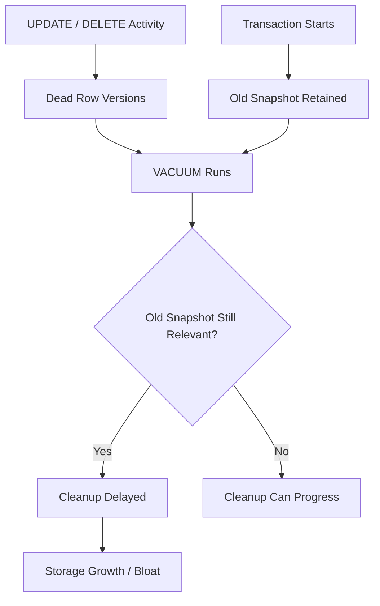
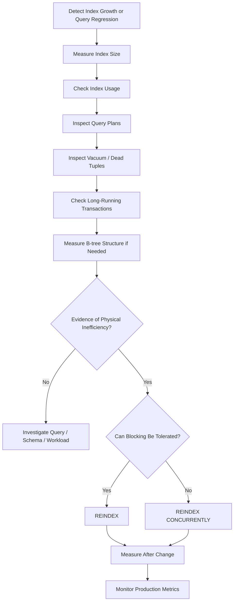

# 33- Index Fragmentation

## Overview

Index fragmentation describes inefficient physical organization within an index that can develop as rows are inserted, updated, and deleted. In PostgreSQL, fragmentation is closely related to B-tree page splits, deleted index entries, page utilization, tuple churn, and the ability of vacuum to clean obsolete entries.

The term is sometimes used too broadly. PostgreSQL does not expose a single universal "fragmentation percentage" comparable to some other database systems. Production diagnosis should therefore focus on observable effects:

- Unexpected index growth.
- Poor page utilization.
- Excessive index I/O.
- Increasing cache pressure.
- Dead index entries.
- Write amplification.
- Index structures that are substantially larger than expected.
- Query performance degradation that correlates with index size or access patterns.

The important distinction is:

```text
Table / index changes
        │
        ├── Dead tuples / index entries
        │          │
        │          └── VACUUM → cleanup / reusable space
        │
        └── B-tree page splits / physical inefficiency
                   │
                   └── REINDEX → rebuild index structure
```

Fragmentation is therefore an **observed physical and workload problem**, not a reason to automatically rebuild indexes on a fixed schedule.

## Why Index Fragmentation Matters

An index is intended to provide an efficient access path to table data. As its physical structure becomes less efficient, the database may need to read more index pages to perform the same logical operation.

A larger or less efficiently packed index can increase:

- Buffer-cache consumption.
- Random and sequential I/O.
- Index scan cost.
- Backup storage.
- Storage costs.
- WAL and replication workload during maintenance.
- Time required for index scans and maintenance.

For a heavily used production index, even modest physical inefficiency can matter because the index may be accessed thousands or millions of times per second.

However, index size alone does not prove a performance problem. A large index can still be highly efficient and justified by the workload.

## How PostgreSQL B-tree Fragmentation Develops

B-tree indexes are organized into pages containing index tuples. PostgreSQL must preserve the ordering properties of the B-tree as new keys are inserted.

When an index page becomes full, PostgreSQL can split the page:

```text
Before

[ A B C D E F ]

Insert G

        Page full
            │
            ▼
      Page Split
       /       \
[ A B C ]   [ D E F G ]
```

Repeated page splits can increase the number of physical pages needed by the index.

Random insert patterns are more likely to distribute writes across different parts of a B-tree than monotonically increasing keys.

For example:

```text
Sequential keys:

1001
1002
1003
1004
1005
  │
  └── Writes tend toward the right side of the tree


Random keys:

8421
1732
9920
4011
2657
  │
  └── Writes affect many parts of the tree
```

The exact behavior depends on the index structure, workload, PostgreSQL version, and key distribution.

## Fragmentation vs Bloat

These terms are related but should not be treated as identical.

| Concept | Meaning |
|---|---|
| Fragmentation | Broad description of inefficient physical organization |
| Bloat | Excess physical space relative to the useful data structure |
| Dead index entries | Entries that no longer correspond to live row versions |
| Page split | Structural B-tree operation that creates additional pages |
| Unused index | An index that provides little or no workload value |

A production investigation should identify the specific condition rather than simply labeling the index "fragmented."

## Sources of Index Fragmentation and Bloat

Common contributors include:

- High-frequency updates.
- High-frequency deletes.
- Random key insertion.
- Large changes in indexed values.
- Long-running transactions delaying cleanup.
- High-churn workloads.
- Poor index design.
- Redundant indexes.
- Large variable-width indexed values.
- Workloads that cause frequent B-tree page splits.

A particularly important distinction is whether the problem is caused by **dead entries** or by the physical structure itself.

## UPDATE and Index Fragmentation

Consider:

```sql
UPDATE orders
SET customer_id = 98765
WHERE id = 1001;
```

If `customer_id` is indexed, changing the indexed value requires index maintenance.

For workloads that frequently update indexed columns, the index can experience substantial churn.

By contrast, if an update changes only non-indexed columns, PostgreSQL may be able to perform a HOT update under appropriate conditions.

```text
UPDATE
  │
  ├── Indexed column changed
  │       └── Index maintenance
  │
  └── Indexed columns unchanged
          └── HOT may be possible
```

This is one reason excessive indexing can have consequences beyond write latency.

## DELETE and Dead Index Entries

A delete does not immediately mean that all physical storage associated with the row disappears.

PostgreSQL's MVCC model means old row versions and related index entries may remain until they are safe to clean up.

Conceptually:

```text
DELETE row
    │
    ▼
Row version becomes obsolete
    │
    ▼
VACUUM
    │
    ├── Heap cleanup
    └── Index cleanup
```

If cleanup is delayed, dead data can accumulate and increase physical storage requirements.

## Long-Running Transactions

Long-running transactions are a common reason vacuum cannot reclaim obsolete row versions.

An old transaction snapshot may still require visibility of older versions.



When investigating persistent index growth, inspect long-running transactions rather than assuming the index itself is defective.

```sql
SELECT
    pid,
    usename,
    application_name,
    state,
    xact_start,
    now() - xact_start AS transaction_age,
    query
FROM pg_stat_activity
WHERE xact_start IS NOT NULL
ORDER BY xact_start;
```

Application-level transaction management can therefore directly influence database storage health.

## How VACUUM Relates to Fragmentation

Normal vacuum is routine PostgreSQL maintenance.

```sql
VACUUM orders;
```

It can:

- Remove dead tuples when they are no longer needed.
- Mark space for reuse.
- Maintain visibility information.
- Perform index cleanup.
- Prevent transaction ID wraparound.

Normal `VACUUM` does not generally rebuild the entire index into a compact structure.

This distinction is critical:

```text
VACUUM
    ↓
Clean obsolete entries
    ↓
Make existing space reusable


REINDEX
    ↓
Build a new index structure
    ↓
Compact the physical representation
```

Vacuum should therefore be the first line of routine maintenance, not `REINDEX`.

## How REINDEX Relates to Fragmentation

`REINDEX` rebuilds an index from its logical contents.

```sql
REINDEX INDEX idx_orders_customer_id;
```

This can produce a more compact index when the existing physical structure has become inefficient.

For a table:

```sql
REINDEX TABLE orders;
```

Use the narrowest appropriate scope. Rebuilding every index on a database because one index has grown unnecessarily can create substantial and avoidable I/O.

## REINDEX CONCURRENTLY

Production systems often cannot tolerate extended blocking from index maintenance.

PostgreSQL supports:

```sql
REINDEX INDEX CONCURRENTLY idx_orders_customer_id;
```

This is designed to reduce blocking of normal operations while rebuilding an index.

The trade-off is additional work and operational complexity.

| Property | `REINDEX` | `REINDEX CONCURRENTLY` |
|---|---|---|
| Rebuilds index | Yes | Yes |
| Reduced blocking | No | Yes |
| Resource overhead | Lower | Higher |
| Operational complexity | Lower | Higher |
| Suitable for busy systems | Sometimes | Often preferable |

Concurrent maintenance still consumes CPU, I/O, memory, and storage resources. It should not be treated as free background work.

## Measuring Index Size

Start with basic index-size measurements:

```sql
SELECT
    schemaname,
    relname AS table_name,
    indexrelname AS index_name,
    pg_size_pretty(pg_relation_size(indexrelid)) AS index_size
FROM pg_stat_user_indexes
ORDER BY pg_relation_size(indexrelid) DESC;
```

For a specific index:

```sql
SELECT
    pg_size_pretty(pg_relation_size('idx_orders_customer_id'));
```

A large index is not automatically fragmented.

Interpret size alongside:

- Number of table rows.
- Indexed column widths.
- Number of index columns.
- Index type.
- Query workload.
- Index usage.
- Historical growth.
- Write rate.

## Inspecting Index Usage

Usage statistics help determine whether the physical cost of an index is justified.

```sql
SELECT
    schemaname,
    relname AS table_name,
    indexrelname AS index_name,
    idx_scan,
    idx_tup_read,
    idx_tup_fetch
FROM pg_stat_user_indexes
ORDER BY idx_scan ASC;
```

An index with very low usage and substantial size deserves investigation.

Do not immediately drop it.

Statistics can be reset, workloads can be seasonal, and indexes may support constraints or infrequent but critical queries.

## Measuring B-tree Structure

For deeper PostgreSQL-specific analysis, extensions such as `pgstattuple` can provide physical statistics.

For example:

```sql
CREATE EXTENSION IF NOT EXISTS pgstattuple;
```

Then:

```sql
SELECT *
FROM pgstatindex('idx_orders_customer_id');
```

Depending on PostgreSQL version and extension behavior, this can provide information about:

- Tree level.
- Index pages.
- Deleted pages.
- Average leaf density.
- Leaf fragmentation.

This is substantially more useful than guessing fragmentation from index size alone.

The extension should be enabled and used according to your organization's database security and operational policies.

## Leaf Density and Fragmentation

For B-tree indexes, leaf-page density can help identify how efficiently pages are being utilized.

Conceptually:

```text
High density

[████████████████]
[████████████████]
[████████████████]


Lower density

[██████          ]
[████████        ]
[████            ]
```

Lower density may increase the number of pages required to represent the same logical index.

But there is no universal density threshold that means "rebuild immediately."

Interpret the measurement against:

- Index growth.
- Workload.
- Cache hit rate.
- Query latency.
- I/O.
- Expected index size.
- Historical measurements.

## Fragmentation and Query Performance

An index can become larger without causing a noticeable query regression if the relevant pages remain in memory.

For example:

```text
Small index
    │
    └── Fits easily in shared buffers / OS cache
             │
             ▼
        Low I/O cost


Larger index
    │
    └── Exceeds effective cache capacity
             │
             ▼
        More physical I/O
             │
             ▼
        Potential latency increase
```

The performance impact therefore depends on the relationship between index size and available memory, not merely on fragmentation metrics.

For critical queries, validate using:

```sql
EXPLAIN (ANALYZE, BUFFERS)
SELECT id, total
FROM orders
WHERE customer_id = 12345
ORDER BY created_at DESC
LIMIT 50;
```

Look at:

- Actual execution time.
- Shared buffer hits.
- Shared buffer reads.
- Scan type.
- Rows examined.
- Rows returned.

## Fragmentation and Cache Pressure

Indexes consume the same database memory resources that other useful data needs.

Suppose a database has:

```text
Shared buffers
    │
    ├── Frequently accessed table pages
    ├── Frequently accessed index pages
    ├── Other indexes
    └── Other relations
```

Adding or unnecessarily enlarging indexes can reduce cache efficiency.

This means an index can indirectly slow down unrelated queries by consuming buffer-cache capacity.

For high-scale systems, index design should therefore be considered a **memory management decision**, not only a query optimization decision.

## Fragmentation and Write-Heavy Systems

Write-heavy workloads are particularly sensitive to index maintenance.

Consider:

```text
10 million writes/day
        │
        ├── Table modification
        ├── Index modification
        ├── WAL generation
        └── Vacuum workload
```

With six indexes, the database may have substantially more physical work than with one or two carefully selected indexes.

This affects:

- CPU.
- I/O.
- WAL.
- Replica replay.
- Autovacuum.
- Storage.
- Backup duration.

Index fragmentation should therefore be considered together with index count and write amplification.

## Fragmentation and Replication

In a primary/replica architecture:


Heavy write activity and index maintenance can increase WAL generation.

During large index operations, monitor:

- Primary CPU.
- Primary I/O.
- WAL generation.
- Replica lag.
- Storage throughput.
- Replica replay rate.

An index rebuild that improves the primary but creates unacceptable replica lag is not a successful production optimization.

## Sequential vs Random Index Keys

Key distribution affects B-tree behavior.

A monotonically increasing key such as:

```sql
id BIGINT GENERATED ALWAYS AS IDENTITY
```

typically causes new entries to be concentrated near the right side of a B-tree.

Random identifiers can distribute inserts across the index.

For example:

```text
Sequential:

100
101
102
103
104
105
  │
  └── Mostly append toward the high-key end


Random:

8f3...
1a9...
c42...
04b...
7e1...
  │
  └── Inserts distributed throughout the key space
```

Random identifiers are not inherently wrong. They can be useful for distributed systems and externally exposed identifiers. The engineering trade-off is that their indexing behavior may differ from sequential keys.

## Fillfactor and B-tree Indexes

PostgreSQL supports index-specific fillfactor settings for applicable index types.

For a B-tree:

```sql
CREATE INDEX idx_orders_customer_id
ON orders (customer_id)
WITH (fillfactor = 80);
```

A lower fillfactor leaves more room on pages for future inserts.

This can sometimes reduce page splits for workloads with specific insertion patterns.

However, lower fillfactor also means:

- More initial pages.
- Larger indexes.
- More storage.
- Potentially more cache pressure.

Fillfactor should therefore be tuned from measured workload characteristics rather than applied universally.

## When Fillfactor Can Help

Fillfactor can be useful when:

- The index experiences significant page splits.
- Keys are inserted in ways that cause pages to fill and split repeatedly.
- The workload has predictable update/insert characteristics.
- Extra storage is acceptable.

It is less useful to blindly set low fillfactor on every index.

## Fragmentation in Different Index Types

Fragmentation behavior depends on the index type.

| Index type | Typical use | Fragmentation considerations |
|---|---|---|
| B-tree | Equality, ranges, ordering | Page splits, dead entries, physical density |
| Hash | Equality | Different physical behavior; narrower workload |
| GIN | Arrays, full-text, JSONB | Pending-list and maintenance behavior matter |
| GiST | Geometric / specialized searches | Structure-specific maintenance |
| BRIN | Large naturally ordered data | Very different storage model; summarization matters |

The discussion of page splits and leaf density in this document primarily applies to PostgreSQL B-tree indexes.

Do not apply B-tree maintenance assumptions to every index type.

## When to Rebuild an Index

Consider rebuilding when there is evidence of a real problem.

Good signals include:

- Measured index inefficiency.
- Significant physical growth without corresponding logical growth.
- Evidence from `pgstatindex` or other appropriate tooling.
- Index corruption.
- A maintenance operation known to require rebuilding.
- A meaningful relationship between index structure and production performance.

Weak signals include:

- "The index is old."
- "The index is large."
- "It has been six months."
- "Someone always reindexes on Sunday."

The decision should be evidence-driven.

## Production Rebuild Workflow



## Before-and-After Validation

Capture baseline measurements before rebuilding.

Useful metrics include:

| Metric | Why it matters |
|---|---|
| Index size | Detect physical size changes |
| Index scans | Determine workload value |
| Query latency | Validate user-visible impact |
| Buffer hits/reads | Measure cache and I/O behavior |
| CPU | Detect maintenance overhead |
| Disk I/O | Detect physical workload |
| WAL generation | Understand replication/recovery impact |
| Replica lag | Protect HA/read-replica behavior |
| Dead tuples | Detect cleanup problems |

After the operation, compare equivalent measurements.

Do not conclude that a rebuild worked simply because the index became smaller.

The desired outcome is improved system behavior, not a lower byte count.

## Common Mistakes

### Treating Fragmentation as a Fixed Percentage

There is no universal PostgreSQL rule such as "rebuild when fragmentation exceeds 30%."

**Why it happens:** Engineers import maintenance rules from other database platforms.

**Avoid it:** Use PostgreSQL-specific measurements and correlate them with workload impact.

### Reindexing on a Fixed Schedule

Routine weekly or monthly reindexing is often unnecessary.

**Why it happens:** Rebuilding an index appears to be a simple preventative maintenance task.

**Avoid it:** Rebuild based on evidence.

### Confusing VACUUM With REINDEX

Vacuum and reindex address different physical conditions.

**Avoid it:** Use vacuum for routine MVCC cleanup and reindex when the index structure itself needs rebuilding.

### Assuming Large Means Fragmented

A 500 GB index may be perfectly healthy if the table and indexed data justify its size.

**Avoid it:** Compare logical data volume, index definition, usage, and physical measurements.

### Dropping an Index Because It Has Few Scans

`idx_scan = 0` or a low scan count is not sufficient evidence by itself.

**Avoid it:** Check statistics reset timing, constraints, application code, scheduled workloads, and rare critical queries.

### Ignoring Long Transactions

Vacuum can appear ineffective when old snapshots prevent cleanup.

**Avoid it:** Monitor transaction age before concluding that index maintenance is failing.

### Rebuilding During Peak Traffic

Index rebuilds consume substantial resources.

**Avoid it:** Schedule maintenance carefully and use concurrent operations when appropriate.

### Ignoring Replica Lag

A maintenance operation can overload the primary or generate substantial WAL.

**Avoid it:** Monitor replicas throughout large index operations.

### Lowering Fillfactor Everywhere

A lower fillfactor can reduce available page capacity and increase index size.

**Avoid it:** Use it only when the workload justifies the trade-off.

## Security and Reliability Considerations

Index maintenance is primarily a performance concern, but it can affect reliability and availability.

### Permissions

Index maintenance requires appropriate database privileges.

Do not grant broad administrative privileges to application users simply so that applications can create or rebuild indexes.

Prefer controlled schema migrations executed by deployment infrastructure.

### Availability

Large maintenance operations can consume enough resources to affect application traffic.

Protect production systems with:

- Controlled maintenance windows.
- Resource monitoring.
- Connection and lock awareness.
- Replica monitoring.
- Tested migration procedures.
- Explicit rollback or recovery procedures where applicable.

### Disaster Recovery

Index rebuilding can produce substantial I/O and WAL activity.

Consider the impact on:

- WAL storage.
- Backup systems.
- Point-in-time recovery.
- Replica synchronization.
- Recovery time objectives.

For large databases, database maintenance should be included in capacity planning for backup and recovery infrastructure.

## Monitoring Recommendations

A production PostgreSQL monitoring system should track more than query latency.

Useful database-level signals include:

```text
Index size growth
       │
       ├── Index usage
       ├── Dead tuples
       ├── Autovacuum activity
       ├── Transaction age
       ├── CPU
       ├── Disk I/O
       ├── WAL generation
       └── Replica lag
```

Alert on sustained abnormal behavior rather than single measurements.

Examples:

- Dead tuples growing continuously.
- Autovacuum unable to keep up.
- Transaction age becoming unusually high.
- Rapid unexplained index growth.
- Replica lag during maintenance.
- Query latency increasing alongside cache misses or index I/O.

## Practical Production Checklist

Before rebuilding an index:

- [ ] Confirm the index is actually used.
- [ ] Check whether it supports a constraint.
- [ ] Measure current index size.
- [ ] Inspect dead tuples and autovacuum activity.
- [ ] Check for long-running transactions.
- [ ] Capture representative execution plans.
- [ ] Determine whether physical inefficiency is measurable.
- [ ] Estimate maintenance duration.
- [ ] Check available disk capacity.
- [ ] Check replica capacity and lag.
- [ ] Choose `REINDEX` or `REINDEX CONCURRENTLY`.
- [ ] Monitor CPU, I/O, WAL, and latency during the operation.
- [ ] Compare before-and-after measurements.

## Interview Traps

### Is Index Fragmentation Always Bad?

No. Some physical inefficiency may have little measurable impact if the index remains cache-friendly and query performance is healthy.

### Does VACUUM Rebuild Indexes?

No. Normal vacuum performs cleanup and makes space reusable. It does not generally rebuild the index structure.

### Why Can Random Keys Increase Index Maintenance Cost?

Random keys distribute inserts throughout the B-tree, potentially causing more page-level activity than append-oriented sequential keys.

### Does REINDEX Improve Every Slow Query?

No. Rebuilding an index only helps when index physical structure is actually contributing to the problem. Poor SQL, incorrect indexing, stale statistics, insufficient memory, lock contention, or I/O saturation may be the real cause.

### Is a Smaller Index Always Faster?

Not necessarily. A smaller structure can improve cache efficiency, but query performance depends on access patterns, selectivity, visibility, table layout, memory, and the optimizer's chosen plan.

### Why Is `REINDEX CONCURRENTLY` Useful?

It reduces the blocking impact of rebuilding an important index on a live system, while consuming additional resources and requiring more operational care.

## Key Takeaways

- **Index fragmentation is a physical-structure concern that should be measured through workload and PostgreSQL-specific statistics rather than assumed from index age or size.**
- **B-tree page splits, dead entries, updates, deletes, random key patterns, and delayed vacuum cleanup can contribute to inefficient index storage.**
- **`VACUUM` handles routine cleanup and space reuse; `REINDEX` rebuilds the physical index structure when evidence justifies it.**
- **Production index maintenance must account for blocking, CPU, I/O, WAL generation, storage capacity, replica lag, and application availability.**
- **The correct maintenance decision is evidence-driven: correlate physical index measurements with query plans and production behavior before rebuilding or changing an index.**