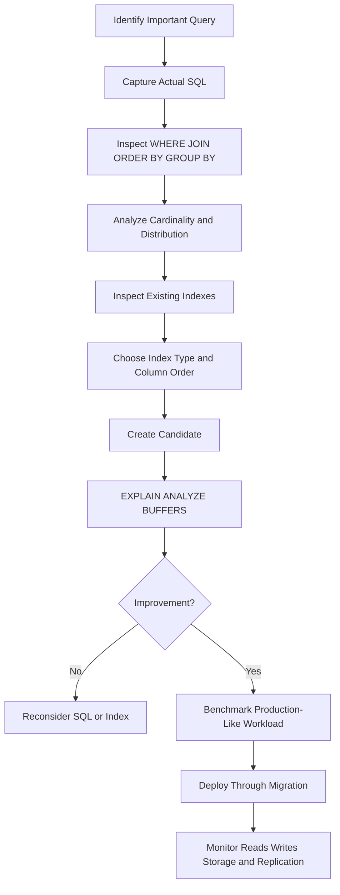

# 34- Choosing the Right Index

## Overview

Choosing the right index is a query-design problem, not a column-selection exercise. A useful index provides the database with an efficient access path for an important workload while keeping storage, write amplification, cache pressure, maintenance, and operational costs under control.

The correct index depends on several interacting factors:

- Query predicates in `WHERE`.
- Join conditions.
- `ORDER BY` requirements.
- `GROUP BY` patterns.
- Column cardinality and selectivity.
- Data distribution and skew.
- Query frequency and latency requirements.
- Read/write ratio.
- Table size and growth rate.
- Existing indexes and constraints.
- Database engine and supported index types.

For most backend systems, index design should follow this sequence:

```text
Production query
      │
      ▼
Understand access pattern
      │
      ├── WHERE
      ├── JOIN
      ├── ORDER BY
      ├── GROUP BY
      └── SELECT
      │
      ▼
Understand data distribution
      │
      ▼
Inspect existing indexes
      │
      ▼
Choose index type + column order
      │
      ▼
Validate with EXPLAIN
      │
      ▼
Benchmark realistic workload
      │
      ▼
Deploy + monitor
```

The examples use PostgreSQL because it exposes the concepts clearly and provides strong tools for execution-plan analysis.

## Start With the Query, Not the Column

A common indexing mistake is:

> "This column appears in a `WHERE` clause, so it needs an index."

A better approach is:

> "What access path does the database need to execute this important query efficiently?"

Consider:

```sql
SELECT id, total
FROM orders
WHERE customer_id = 12345
ORDER BY created_at DESC
LIMIT 50;
```

A natural candidate is:

```sql
CREATE INDEX idx_orders_customer_created
ON orders (customer_id, created_at DESC);
```

This index can support the complete access pattern:

```text
customer_id = 12345
       │
       ▼
Locate customer's index range
       │
       ▼
Read rows in created_at DESC order
       │
       ▼
Stop after 50 rows
```

An index only on `customer_id` may still improve filtering, but the database may have to perform additional work to satisfy the ordering requirement.

The important distinction is that an index should be designed around the **query shape**, not around individual columns.

## The Main Index Selection Questions

Before creating an index, evaluate the workload systematically.

| Question | Why it matters |
|---|---|
| Which query needs improvement? | Prevents speculative indexes |
| How frequently does it execute? | High-frequency queries have greater optimization value |
| Which columns appear in `WHERE`? | Determines filtering opportunities |
| Which columns participate in `JOIN`? | Can reduce join work |
| Does the query require ordering? | An index may eliminate or reduce sorting |
| Does it use `LIMIT`? | Ordered indexes can allow early termination |
| What is the column cardinality? | Determines potential filtering effectiveness |
| Is the distribution skewed? | Average cardinality may hide useful subsets |
| How often is the table written? | Every index adds maintenance work |
| How large is the table? | Determines whether indexing provides meaningful savings |
| What indexes already exist? | Prevents unnecessary overlap |
| Is the index needed for integrity? | Constraints can require unique indexes |

A senior-level indexing decision considers the entire workload rather than optimizing one SQL statement in isolation.

## Choosing the Index Type

PostgreSQL provides several index types.

| Index type | Typical use | Example workload |
|---|---|---|
| B-tree | Equality, ranges, ordering | `id = ?`, `created_at >= ?` |
| Hash | Equality-only access | Specialized equality workloads |
| GIN | Composite values | JSONB, arrays |
| GiST | Extensible operator classes | Ranges, spatial workloads |
| SP-GiST | Specialized partitioned structures | Certain non-balanced data |
| BRIN | Large physically correlated tables | Append-only time-series data |

For conventional backend application queries, **B-tree is normally the default choice**.

Specialized index types should be selected because the data type, operators, or physical data layout justify them.

## B-tree Indexes

B-tree indexes are the general-purpose choice for many relational workloads.

They commonly support:

- Equality comparisons.
- Range comparisons.
- Ordered scans.
- `BETWEEN`.
- Many `ORDER BY` patterns.

Example:

```sql
CREATE INDEX idx_users_email
ON users (email);
```

Query:

```sql
SELECT id
FROM users
WHERE email = 'user@example.com';
```

Range example:

```sql
CREATE INDEX idx_orders_created_at
ON orders (created_at);
```

```sql
SELECT id, created_at
FROM orders
WHERE created_at >= TIMESTAMP '2026-01-01'
  AND created_at < TIMESTAMP '2026-02-01';
```

B-tree is particularly useful when a query needs both selective filtering and ordered access.

## Composite Indexes

A composite index contains multiple key columns:

```sql
CREATE INDEX idx_orders_customer_status_created
ON orders (customer_id, status, created_at DESC);
```

The order of columns is part of the index design.

For an index:

```text
(customer_id, status, created_at)
```

these patterns are generally strong matches:

```sql
WHERE customer_id = ?
```

```sql
WHERE customer_id = ?
  AND status = ?
```

```sql
WHERE customer_id = ?
  AND status = ?
ORDER BY created_at DESC
```

But:

```sql
WHERE status = ?
```

does not generally receive the same benefit because `status` is not the leading key.

Composite indexes should therefore be designed around the queries that matter, not simply by concatenating every commonly filtered column.

## Equality, Range, and Ordering

A useful starting heuristic for composite B-tree indexes is:

```text
Equality predicates
       ↓
Range predicates
       ↓
Ordering requirements
```

Consider:

```sql
SELECT id, created_at
FROM orders
WHERE customer_id = 12345
  AND status = 'paid'
  AND created_at >= TIMESTAMP '2026-08-01'
ORDER BY created_at DESC
LIMIT 100;
```

A candidate index is:

```sql
CREATE INDEX idx_orders_customer_status_created
ON orders (customer_id, status, created_at DESC);
```

The equality predicates narrow the index search before the timestamp condition is applied.

However, this is a **design heuristic, not an absolute formula**. Real workloads can justify different column ordering based on query frequency, selectivity, ordering requirements, and other access patterns.

Always validate the candidate using the actual execution plan.

## Selectivity and Cardinality

Selectivity describes how much a predicate reduces the candidate row set.

Suppose a table contains 10 million rows:

| Predicate | Approximate matches | Filtering usefulness |
|---|---:|---|
| `id = 123` | 1 | Very high |
| `email = ...` | 1 | Very high |
| `customer_id = ...` | 5,000 | Often useful |
| `status = 'paid'` | 5,000,000 | Low by itself |
| `is_active = true` | 9,500,000 | Very low |

A low-cardinality column is not automatically useless.

For example, if only 0.1% of rows are pending:

```text
status = 'pending' → 0.1%
status = 'paid'    → 99.9%
```

a partial index targeting pending rows can be extremely effective.

Index design therefore needs to consider:

- Cardinality.
- Selectivity.
- Distribution.
- Data skew.
- Query frequency.
- Table size.

## Indexes for WHERE Conditions

Consider a multi-tenant application:

```sql
SELECT id
FROM users
WHERE tenant_id = 42
  AND email = 'user@example.com';
```

If email uniqueness is scoped to a tenant, a unique composite index may be appropriate:

```sql
CREATE UNIQUE INDEX idx_users_tenant_email
ON users (tenant_id, email);
```

This simultaneously provides:

- Efficient tenant-scoped lookup.
- Database-level uniqueness enforcement.

Whether `tenant_id` should lead the index depends on the workload and business constraint.

If the application also frequently performs:

```sql
SELECT id
FROM users
WHERE email = 'user@example.com';
```

without a tenant predicate, a tenant-leading index may not be the best access path for that query.

## Indexes for JOINs

Consider:

```sql
SELECT o.id, c.name
FROM orders AS o
JOIN customers AS c
    ON c.id = o.customer_id
WHERE o.status = 'paid';
```

`customers.id` is normally indexed because it is the primary key.

The referencing column may also benefit from an index:

```sql
CREATE INDEX idx_orders_customer_id
ON orders (customer_id);
```

This is especially useful for queries such as:

```sql
SELECT id, created_at
FROM orders
WHERE customer_id = 42;
```

It can also matter for join strategies and parent-row modifications.

In PostgreSQL, creating a foreign key does **not** automatically create an index on the referencing column.

For high-volume child tables, indexing foreign-key columns is often useful, particularly when:

- Child rows are frequently queried by parent ID.
- Parent rows can be deleted or updated.
- Cascading operations need to locate child rows efficiently.

Do not treat "foreign key" as an automatic indexing rule. Validate the workload.

## Indexes for ORDER BY

Consider:

```sql
SELECT id, created_at
FROM orders
WHERE customer_id = 42
ORDER BY created_at DESC
LIMIT 50;
```

A candidate index:

```sql
CREATE INDEX idx_orders_customer_created
ON orders (customer_id, created_at DESC);
```

can provide rows in the required order within the customer's index range.

This is especially valuable for:

```sql
ORDER BY ...
LIMIT N
```

because the database may be able to stop after retrieving the required number of rows rather than sorting a large candidate set.

This pattern appears frequently in:

- Activity feeds.
- User timelines.
- Recent orders.
- Audit logs.
- Notification lists.
- Search result pagination.

## Indexes for GROUP BY

Indexes can sometimes help grouping, but they are not a guaranteed optimization.

Consider:

```sql
SELECT customer_id, COUNT(*)
FROM orders
GROUP BY customer_id;
```

An index on `customer_id` can provide ordered access, which may be useful for certain plans.

However, PostgreSQL may choose a hash aggregate or another strategy because it estimates that approach to be cheaper.

Therefore:

```text
Index exists
    ≠
Index will be used
    ≠
Index is the fastest strategy
```

Use `EXPLAIN (ANALYZE, BUFFERS)` to determine whether the index actually improves the workload.

## Partial Indexes

A partial index contains only rows matching a predicate.

Example:

```sql
CREATE INDEX idx_jobs_pending
ON jobs (priority DESC, created_at)
WHERE status = 'pending';
```

This is useful when:

- Only a small subset of rows is queried frequently.
- The subset has a stable predicate.
- Indexing all rows would waste storage and maintenance effort.

Query:

```sql
SELECT id
FROM jobs
WHERE status = 'pending'
ORDER BY priority DESC, created_at
LIMIT 100;
```

A partial index can be substantially smaller than an equivalent full-table index.

### Advantages

- Smaller index.
- Lower storage consumption.
- Less maintenance for excluded rows.
- Better cache efficiency.
- Efficient targeting of hot subsets.

### Limitations

- The query must be compatible with the index predicate.
- It only covers the indexed subset.
- Workload changes can invalidate the original assumption.

Common use cases include:

```text
status = 'pending'
deleted_at IS NULL
active = true
processed = false
tenant-specific hot data
```

## Expression Indexes

An expression index indexes the result of an expression.

Example:

```sql
CREATE INDEX idx_users_lower_email
ON users (lower(email));
```

Query:

```sql
SELECT id
FROM users
WHERE lower(email) = 'user@example.com';
```

A normal index on `email` does not necessarily provide the required access path because the query operates on `lower(email)`.

Expression indexes are useful for:

- Case-insensitive lookup.
- Normalized values.
- Computed expressions.
- Date/time transformations.
- Application-specific search normalization.

The indexed expression should match the application's actual query pattern.

## Covering Indexes

A covering index contains the key columns needed for searching and may include additional columns required by a query.

PostgreSQL supports included columns:

```sql
CREATE INDEX idx_orders_customer_created
ON orders (customer_id, created_at DESC)
INCLUDE (total, status);
```

The key columns determine the search and ordering behavior.

Included columns are stored in the index but do not participate in the index ordering.

A query such as:

```sql
SELECT created_at, total, status
FROM orders
WHERE customer_id = 42
ORDER BY created_at DESC
LIMIT 50;
```

may benefit from an index-only scan.

However, an index-only scan is not guaranteed. PostgreSQL also needs suitable visibility information to avoid fetching heap pages.

Do not turn every index into a covering index. Wide indexes increase:

- Storage.
- Cache pressure.
- Write amplification.
- Index build time.
- Maintenance cost.

## BRIN Indexes

BRIN indexes are useful for very large tables where indexed values correlate with physical row order.

A typical example is an append-heavy event table:

```text
Physical row order

older events ───────────────────────► newer events
      │                                  │
      └──── created_at increases ────────┘
```

Example:

```sql
CREATE INDEX idx_events_created_brin
ON events USING BRIN (created_at);
```

BRIN indexes store summaries of ranges of table pages rather than individual row entries.

They are attractive when:

- The table is very large.
- Values are naturally correlated with physical storage order.
- Queries use ranges.
- Small false-positive scans are acceptable.

They can be dramatically smaller than B-tree indexes.

BRIN is generally a poor replacement for a B-tree on a randomly distributed identifier used for equality lookups.

## GIN Indexes

GIN indexes are designed for values containing multiple searchable elements.

Common uses include:

- JSONB.
- Arrays.
- Full-text search configurations.

Example:

```sql
CREATE INDEX idx_documents_metadata
ON documents USING GIN (metadata);
```

Query:

```sql
SELECT id
FROM documents
WHERE metadata @> '{"tier": "premium"}';
```

GIN can provide excellent read performance for supported operators, but it can also impose significant write and storage costs.

For write-heavy JSONB workloads, benchmark the actual query and update workload before introducing a broad GIN index.

## GiST Indexes

GiST provides a flexible framework for indexing data using extensible search strategies.

Common applications include:

- Range types.
- Geometric data.
- Spatial workloads.
- PostgreSQL extensions such as PostGIS.

Example:

```sql
CREATE INDEX idx_bookings_period
ON bookings USING GIST (booking_period);
```

The important consideration is the operator used by the query and whether the chosen operator class supports it efficiently.

Do not choose GiST merely because the data conceptually represents a range.

## Hash Indexes

Hash indexes are specialized for equality comparisons.

Example:

```sql
CREATE INDEX idx_sessions_token_hash
ON sessions USING HASH (token);
```

For many normal application workloads, B-tree already handles equality efficiently while also supporting ranges and ordering.

Therefore, a hash index generally requires a specific workload-driven justification rather than being the default for `=`.

## Unique Indexes and Constraints

If uniqueness is a business invariant, enforce it in the database.

Prefer a unique constraint when the primary purpose is data integrity:

```sql
ALTER TABLE users
ADD CONSTRAINT users_email_key UNIQUE (email);
```

PostgreSQL creates the required unique index structure.

Without database enforcement, application-level checks can race:

```text
Request A → check email → not found
Request B → check email → not found
Request A → insert
Request B → insert
```

A unique constraint makes the database the concurrency-safe authority.

For tenant-scoped uniqueness:

```sql
ALTER TABLE users
ADD CONSTRAINT users_tenant_email_key
UNIQUE (tenant_id, email);
```

This also influences index design because the uniqueness constraint creates a composite unique index.

## Column Order in Composite Indexes

These indexes are not equivalent:

```sql
CREATE INDEX idx_orders_status_customer
ON orders (status, customer_id);
```

```sql
CREATE INDEX idx_orders_customer_status
ON orders (customer_id, status);
```

Suppose the workload contains:

```sql
WHERE customer_id = ?
```

The second index is naturally aligned with that access pattern.

For:

```sql
WHERE status = ?
```

the first is more directly aligned.

For:

```sql
WHERE customer_id = ?
  AND status = ?
```

both may be viable, and the correct choice depends on the broader workload.

A simplistic rule such as "always put the most selective column first" is insufficient.

Consider:

- Equality predicates.
- Range predicates.
- Ordering.
- Join behavior.
- Query frequency.
- Cardinality.
- Data skew.
- Other queries using the same index.

## Read vs Write Trade-Off

Indexes improve reads by creating additional access paths, but every index also has a maintenance cost.

For an insert:

```text
INSERT
  │
  ├── Update table
  ├── Update index A
  ├── Update index B
  ├── Update index C
  └── Update index N
```

For updates affecting indexed columns, corresponding index entries may also need modification.

Additional indexes can increase:

- Write latency.
- CPU consumption.
- WAL volume.
- Disk usage.
- Replication work.
- Vacuum work.
- Backup size.
- Cache pressure.

Therefore:

```text
Better read performance
        ↕
Higher write and storage cost
```

The correct balance depends on workload characteristics.

## One Query vs the Entire Workload

An index that makes one query dramatically faster can still make the overall system worse.

Consider:

```text
100 reads/sec
10,000 writes/sec
```

A large index might reduce a read from 200 ms to 10 ms while adding significant cost to every write.

Compare that with:

```text
100,000 reads/sec
100 writes/sec
```

The same index may be an excellent trade-off.

Index design must therefore consider:

```text
Query importance
×
Query frequency
×
Latency sensitivity
×
Read/write ratio
×
Storage cost
```

## Avoiding Redundant and Overlapping Indexes

Suppose a table contains:

```sql
CREATE INDEX idx_orders_customer
ON orders (customer_id);

CREATE INDEX idx_orders_customer_created
ON orders (customer_id, created_at);
```

The composite index may already support many queries using `customer_id` because `customer_id` is its leading key.

However, that does not automatically prove the first index is redundant.

Evaluate:

- Actual index usage.
- Index size.
- Query plans.
- Index-only scan requirements.
- Different included columns.
- Partial predicates.
- Constraint requirements.
- Write cost.

Dropping an index should be based on evidence, not merely on prefix similarity.

## Choosing the Right Index by Query Pattern

| Query pattern | Typical starting point |
|---|---|
| Equality lookup | B-tree |
| Range query | B-tree |
| Equality + range | Composite B-tree |
| Equality + ordering + `LIMIT` | Composite B-tree matching access order |
| Frequent tenant-scoped lookup | Tenant-aware composite B-tree |
| Sparse operational subset | Partial B-tree |
| Case-normalized lookup | Expression index |
| Large physically ordered table | BRIN |
| JSONB containment | GIN |
| Array membership | GIN |
| Range/spatial operators | GiST or specialized index |
| Data-integrity uniqueness | Unique constraint |
| Read-heavy query returning indexed payload | B-tree with selective `INCLUDE` |

This matrix is a starting point. The execution plan and workload determine the final decision.

## A Production Indexing Workflow

Use a repeatable process instead of adding indexes reactively.



### Inspect Existing Indexes

Before creating an index:

```sql
SELECT
    schemaname,
    tablename,
    indexname,
    indexdef
FROM pg_indexes
WHERE tablename = 'orders'
ORDER BY indexname;
```

Inspect index usage:

```sql
SELECT
    indexrelname AS index_name,
    idx_scan,
    idx_tup_read,
    idx_tup_fetch
FROM pg_stat_user_indexes
WHERE relname = 'orders'
ORDER BY idx_scan DESC;
```

Index statistics are useful evidence, but they should be interpreted over an appropriate observation period.

An index with low usage may still be necessary for an infrequent but business-critical operation or a constraint.

## Validate With EXPLAIN

Test candidate indexes using realistic SQL:

```sql
EXPLAIN (ANALYZE, BUFFERS)
SELECT id, total
FROM orders
WHERE customer_id = 12345
ORDER BY created_at DESC
LIMIT 50;
```

Inspect:

- Execution time.
- Planning time.
- Scan type.
- Estimated rows.
- Actual rows.
- Buffer hits.
- Buffer reads.
- Sort operations.
- Heap fetches.
- Join strategy.
- Rows removed by filtering.

An index scan is not automatically evidence of an optimal plan.

The real question is whether the resulting plan is cheaper and faster for the production workload.

## Estimated Rows vs Actual Rows

Poor optimizer estimates can cause a good index to be ignored or a bad plan to be selected.

For example:

```text
Estimated rows: 100
Actual rows:    2,000,000
```

This mismatch can lead the optimizer toward an inappropriate join or scan strategy.

Before redesigning indexes, check whether statistics are current:

```sql
ANALYZE orders;
```

Highly skewed or complex distributions may require additional statistics configuration.

Index design and statistics quality are separate concerns, but they directly interact through the optimizer.

## Data Skew Changes Index Decisions

Average selectivity can hide important distributions.

Suppose:

```text
status = 'pending' → 0.1%
status = 'paid'    → 99.9%
```

A normal index on `status` may not be particularly useful for queries targeting the dominant value.

A partial index can instead target the hot operational subset:

```sql
CREATE INDEX idx_orders_pending_customer_created
ON orders (customer_id, created_at DESC)
WHERE status = 'pending';
```

This demonstrates why senior-level index design considers **distribution**, not merely the number of distinct values.

## Indexes and Backend Frameworks

ORMs such as Django and SQLAlchemy can make database access patterns less obvious.

For example, a Django query:

```python
orders = (
    Order.objects
    .filter(customer_id=customer_id)
    .order_by("-created_at")[:50]
)
```

ultimately becomes SQL that should be evaluated at the database level.

The engineering workflow should be:

```text
ORM Query
   │
   ▼
Generated SQL
   │
   ▼
Execution Plan
   │
   ▼
Index Access Path
   │
   ▼
Observed Latency
```

Do not design indexes based only on ORM model declarations. Inspect the generated SQL and validate it against the database.

The same principle applies to FastAPI services using SQLAlchemy, async database drivers, or other data-access layers.

## Indexes in Multi-Tenant Systems

Multi-tenant applications frequently include:

```sql
WHERE tenant_id = ?
```

in most queries.

For example:

```sql
SELECT id, created_at, total
FROM orders
WHERE tenant_id = 42
  AND customer_id = 123
ORDER BY created_at DESC
LIMIT 50;
```

A candidate index might be:

```sql
CREATE INDEX idx_orders_tenant_customer_created
ON orders (tenant_id, customer_id, created_at DESC);
```

This can be substantially more useful than unrelated single-column indexes when tenant scoping is consistently part of the access pattern.

However, tenant distribution matters.

If one tenant owns most of the rows, a global index may behave differently than expected. Analyze tenant skew and workload distribution before standardizing an index strategy.

## Production Deployment

Indexes should normally be created through version-controlled database migrations.

For a large production table, PostgreSQL supports:

```sql
CREATE INDEX CONCURRENTLY idx_orders_customer_created
ON orders (customer_id, created_at DESC);
```

Concurrent index creation reduces blocking of normal table writes compared with a standard index build, but it has operational constraints and can consume substantial CPU, I/O, storage, and time.

Before a large index build, evaluate:

- Available disk space.
- Database I/O capacity.
- CPU utilization.
- Replica lag.
- Maintenance windows.
- Transaction behavior.
- Failure/retry handling.
- Migration tooling.

For Django migrations, large production indexes may require non-atomic migration handling and explicit concurrent-index support rather than relying on a normal `AddIndex` operation.

## Monitoring Index Impact

After deploying an index, monitor both the target query and the broader database.

Useful signals include:

| Metric | What it tells you |
|---|---|
| Query latency | Whether the target workload improved |
| Query throughput | Whether workload capacity changed |
| `idx_scan` | Whether the index is being used |
| Buffer hits/reads | Cache and I/O behavior |
| CPU | Query and maintenance overhead |
| WAL volume | Write amplification |
| Replica lag | Replication impact |
| Index size | Storage cost |
| Table bloat | Maintenance behavior |
| Write latency | Cost of index maintenance |

An index should be considered successful only when it improves the intended workload without creating unacceptable system-level costs.

## Cost and Scalability Considerations

Indexes consume resources at several levels.

| Resource | Index impact |
|---|---|
| Disk | Additional persistent storage |
| Memory | More index pages compete for cache |
| CPU | Index maintenance and scans |
| WAL | Additional write records |
| Replication | More changes to replay |
| Backup | More data to store and transfer |
| Vacuum | Additional index maintenance |
| Deployment | Index builds consume resources |

On AWS-managed PostgreSQL, these costs can affect:

- Database instance sizing.
- EBS/storage requirements.
- I/O capacity.
- Read replica capacity.
- Backup storage.
- Operational budgets.

A small collection of high-value indexes is generally preferable to a large collection of speculative indexes.

## Reliability and High Availability

Index changes are schema changes and should be treated as production infrastructure changes.

For high-availability databases:

- Test index creation on a production-sized environment.
- Monitor replicas during large index builds.
- Verify sufficient storage before deployment.
- Use migration tooling with failure handling.
- Avoid unnecessary simultaneous index builds.
- Observe database health during rollout.
- Ensure replicas can keep up with increased WAL generation.

An index can improve application latency while simultaneously increasing database resource consumption, so both dimensions must be monitored.

## Common Mistakes

### Indexing Every Column Used in WHERE

A query such as:

```sql
WHERE tenant_id = ?
  AND status = ?
  AND created_at >= ?
```

does not necessarily need three independent indexes.

**Why it happens:** Developers map each predicate directly to an index.

**Better approach:** Evaluate whether a composite or partial index matches the complete query pattern.

### Always Putting the Most Selective Column First

Selectivity is important, but it is not a universal column-order rule.

**Why it happens:** A simple heuristic is treated as a database law.

**Better approach:** Consider equality predicates, ranges, ordering, query frequency, and the entire workload.

### Ignoring ORDER BY

An index that filters efficiently may still leave the database sorting a large result set.

**Better approach:** For latency-sensitive `ORDER BY ... LIMIT` queries, consider whether index ordering can satisfy the requested order.

### Assuming Low Cardinality Means No Index

A low-cardinality column can become useful when combined with other columns or used in a partial index.

**Better approach:** Analyze actual distribution and query workload.

### Creating Wide Covering Indexes

Adding every selected column to `INCLUDE` can produce a large, expensive index.

**Better approach:** Cover only important queries where avoiding heap access provides measurable value.

### Using Specialized Index Types Without Understanding Operators

GIN, GiST, and BRIN are powerful but workload-specific.

**Better approach:** Verify operator support, data distribution, and execution plans.

### Ignoring Write Performance

Every additional index increases maintenance work.

**Better approach:** Measure write latency, WAL generation, and replication impact.

### Trusting the ORM

An ORM abstraction can hide expensive SQL or unexpected joins.

**Better approach:** Inspect generated SQL and database execution plans.

### Creating Indexes Without Measuring

An index migration succeeding technically does not mean the optimization succeeded.

**Better approach:** Compare execution plans and workload metrics before and after deployment.

## Production Pitfalls

### Building Large Indexes During Peak Traffic

Large index builds can consume substantial CPU and I/O.

Use controlled deployment windows and monitor database resource utilization.

### Running Out of Storage

Index creation can require significant additional disk space.

Verify capacity before creating large indexes, especially on rapidly growing tables.

### Replica Lag

Index-related write amplification and large schema operations can affect replication.

Monitor replica replay and replication lag during deployment.

### Stale Statistics

The optimizer may make poor decisions when statistics do not represent current data.

Use appropriate `ANALYZE` operations and investigate persistent estimation errors.

### Obsolete Indexes

Application workloads evolve.

An index created for a previous API endpoint may remain for years while continuing to consume storage and write resources.

Periodically review:

- Index usage.
- Query workload.
- Index size.
- Schema changes.
- Application changes.
- Storage growth.

Do not automatically remove a low-usage index without checking whether it supports constraints or infrequent but critical queries.

## Security Considerations

Index design is generally a performance concern rather than an access-control mechanism.

Do not treat an index as a security boundary.

Security-sensitive systems should still enforce:

- Authorization in the application or database security layer.
- Tenant isolation.
- Row-level security where appropriate.
- Database constraints for integrity.
- Parameterized SQL to prevent injection.

Indexes can indirectly affect security-sensitive workloads by reducing the cost of authorized tenant-scoped queries, but they do not replace authorization checks.

## Interview Traps

### Is the Most Selective Column Always the First Column?

No. Selectivity is one factor. Query shape, equality predicates, ranges, ordering, and workload frequency also matter.

### Is One Index Per WHERE Column Better?

Not necessarily. A composite index can provide a more efficient access path for multi-column queries.

### Can an Index Make a Query Slower?

Yes. The optimizer can choose a suboptimal path, and the index itself adds storage and maintenance costs.

### Does PostgreSQL Always Use an Index If One Exists?

No. The optimizer estimates costs and may prefer a sequential scan or another strategy.

### Does Low Cardinality Mean a Column Should Never Be Indexed?

No. Partial and composite indexes can make low-cardinality attributes highly useful.

### Is a Covering Index Always Better?

No. It can reduce heap access while significantly increasing index size and write cost.

### Should Every Slow Query Get an Index?

No. The root cause may instead be:

- Poor SQL.
- Incorrect joins.
- Stale statistics.
- Lock contention.
- Insufficient resources.
- Excessive result sets.
- Data-model problems.
- Inefficient application behavior.

## Key Takeaways

- **Choose indexes from real query access patterns, not from individual columns in isolation.**
- **Composite index order must match the workload's filtering, range, and ordering requirements; selectivity alone is not sufficient.**
- **Specialized indexes such as partial, expression, covering, BRIN, GIN, and GiST indexes should be driven by specific workload characteristics.**
- **Every index has system-wide costs across writes, storage, WAL, cache, replication, backups, and maintenance.**
- **Validate every important index with realistic execution plans and production metrics before treating it as an optimization.**