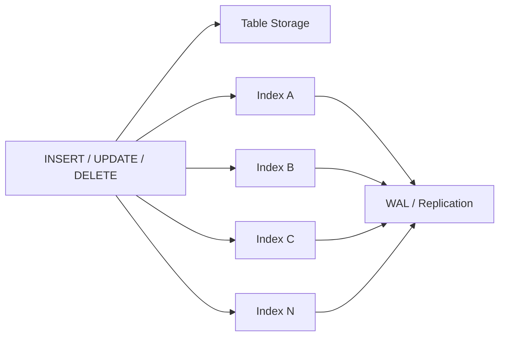
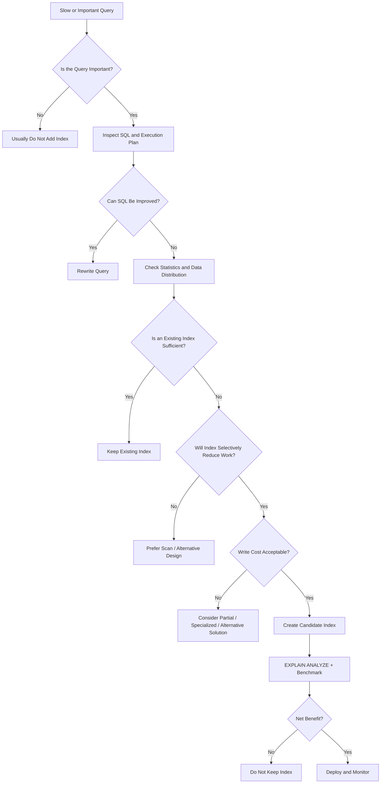

# 35- When Not to Create an Index

## Overview

Indexes are not free optimizations. They introduce additional storage, memory pressure, write amplification, WAL generation, replication work, maintenance overhead, and operational complexity.

The correct engineering decision is therefore not:

> "Can an index make this query faster?"

It is:

> "Does the performance benefit of this access path justify its ongoing system-wide cost?"

An index is usually justified when it materially improves an important workload. It should generally be avoided when:

- The table is small enough that sequential scans are cheaper.
- The query is rarely executed and does not have meaningful latency requirements.
- The predicate is poorly selective for the workload.
- The index duplicates an existing access path.
- The table is extremely write-heavy and the read benefit is negligible.
- The indexed column changes frequently.
- The query pattern is unlikely to use the index.
- The index consumes substantial storage without measurable benefit.
- The database optimizer consistently chooses a sequential scan for good reasons.

Good index design is therefore partly about knowing **when not to add one**.

## The Cost of an Index

For a table with multiple indexes, a write does more than modify the base table.



Each additional index can increase:

| Cost | Impact |
|---|---|
| Disk | Index pages consume persistent storage |
| Memory | Frequently accessed index pages compete for cache |
| CPU | Index entries must be maintained |
| Write latency | DML operations perform additional index work |
| WAL | Index modifications contribute to write-ahead logging |
| Replication | Replicas must replay the additional changes |
| Vacuum | Indexes participate in maintenance |
| Backup | More database data must be backed up |
| Deployment | Large indexes take time and resources to build |

An index that saves 50 ms on an occasional query may not justify adding several gigabytes of storage and increasing the cost of every write.

## When an Index Is Usually Not Necessary

### Small Tables

For a small table, a sequential scan can be cheaper than an index lookup.

Consider:

```sql
SELECT id
FROM countries
WHERE code = 'IN';
```

If the table contains only a few hundred rows, an index may provide little or no measurable benefit.

The database can simply scan the table:

```text
Read small table
      │
      ▼
Check rows
      │
      ▼
Return matching row
```

An index introduces another structure that must be maintained without necessarily reducing meaningful I/O.

### Important Distinction

"Small" is workload-dependent.

A table with 10,000 rows might still be performance-sensitive if:

- It is queried extremely frequently.
- It participates in expensive joins.
- It is accessed concurrently by many requests.
- Its rows are wide.
- The query is latency-critical.

Do not use a fixed row-count threshold as an indexing rule.

Validate the actual execution plan.

## Low-Selectivity Predicates

Suppose a table contains 20 million rows:

```sql
SELECT *
FROM orders
WHERE status = 'completed';
```

If 19 million rows are completed, an index on `status` may not provide an efficient access path for this query.

The database may reasonably choose:

```text
Sequential Scan
    │
    ├── Read table pages
    └── Filter status
```

instead of:

```text
Index Scan
    │
    ├── Read many index entries
    ├── Visit many heap pages
    └── Retrieve most rows anyway
```

An index is most valuable when it allows the database to avoid significant work.

### Low Cardinality Does Not Mean "Never Index"

A boolean column is a classic example:

```sql
WHERE is_active = true
```

If 99.9% of rows are active, a normal index may be unattractive.

But if only 0.1% are active, a partial index may be highly effective:

```sql
CREATE INDEX idx_users_active
ON users (id)
WHERE is_active = true;
```

The important property is the **actual distribution and workload**, not simply the data type.

## Queries That Return a Large Percentage of the Table

An index is primarily useful when it helps avoid reading large portions of the table.

Consider:

```sql
SELECT *
FROM events
WHERE created_at >= TIMESTAMP '2026-01-01';
```

If this returns 90% of the table, an index may provide little benefit.

If it returns 0.01%, an index is much more likely to help.

A useful mental model is:

```text
Small result set
      ↓
Index often valuable

Large result set
      ↓
Sequential scan may be cheaper
```

This is not absolute. Covering indexes, physical correlation, parallel scans, partitioning, and other execution strategies can change the outcome.

## Rarely Executed Queries

Suppose an administrative report runs once per month:

```sql
SELECT customer_id, COUNT(*)
FROM orders
GROUP BY customer_id;
```

Creating a large index solely to reduce a monthly report from 12 seconds to 8 seconds may be a poor trade-off if the index:

- Adds several GB of storage.
- Increases write cost.
- Increases backup size.
- Increases replication work.
- Competes for cache.

The correct decision depends on business requirements.

A 12-second query may be unacceptable for a customer-facing request but perfectly acceptable for a monthly internal report.

Index decisions must therefore consider **latency requirements**, not just raw query duration.

## Write-Heavy Tables

Indexes can be expensive on write-intensive tables.

Consider an event ingestion service:

```text
Kafka
  │
  ▼
Consumers
  │
  ▼
PostgreSQL
  │
  ├── INSERT
  ├── Index A update
  ├── Index B update
  ├── Index C update
  └── Index D update
```

If the table receives hundreds of thousands of inserts per second, unnecessary indexes can materially reduce ingestion capacity.

This is especially relevant for:

- Event stores.
- Audit logs.
- Metrics tables.
- High-volume telemetry.
- Message persistence.
- Time-series workloads.

For such systems, every index should have a clear workload justification.

## Frequently Updated Columns

An index on a frequently modified column can increase update cost.

Consider:

```sql
UPDATE jobs
SET status = 'completed'
WHERE id = 12345;
```

If `status` is indexed, changing the value may require index maintenance.

For workloads with frequent state transitions:

```text
pending
   ↓
running
   ↓
completed
```

an index on the mutable status column should have a demonstrated benefit.

If queries rarely filter by `status`, removing the index may reduce write overhead without harming meaningful reads.

## Indexes That the Query Cannot Use

An index may exist but still be ineffective because the query applies an incompatible expression or transformation.

Suppose:

```sql
CREATE INDEX idx_users_email
ON users (email);
```

The query is:

```sql
SELECT id
FROM users
WHERE lower(email) = 'user@example.com';
```

The normal `email` index may not provide the desired access path.

If this query is important, an expression index may be appropriate:

```sql
CREATE INDEX idx_users_lower_email
ON users (lower(email));
```

But if the query is rare, adding the expression index may not be justified.

The principle is:

> Do not create an index merely because a related column appears in a query. Verify that the index matches the actual operator and expression.

## Functions and Transformations

This query:

```sql
WHERE DATE(created_at) = DATE '2026-09-01'
```

can prevent a normal index on `created_at` from being used as efficiently as a direct range predicate.

A better query shape is often:

```sql
WHERE created_at >= TIMESTAMP '2026-09-01'
  AND created_at < TIMESTAMP '2026-09-02'
```

If the transformed expression is genuinely required and frequently queried, an expression index may be appropriate.

Do not immediately add an index to compensate for SQL that can be improved without one.

## When Query Rewriting Is Better Than Indexing

Suppose the application executes:

```sql
SELECT *
FROM orders
WHERE customer_id IN (
    SELECT customer_id
    FROM customers
    WHERE country = 'IN'
);
```

Before adding an index, investigate:

- Whether the query shape is optimal.
- Whether unnecessary columns are being selected.
- Whether the join is appropriate.
- Whether predicates can be pushed down.
- Whether pagination is implemented efficiently.
- Whether statistics are current.

Sometimes the best optimization is better SQL rather than another index.

A useful optimization sequence is:

```text
Understand query
      ↓
Fix obviously inefficient SQL
      ↓
Check statistics
      ↓
Inspect execution plan
      ↓
Consider index
      ↓
Benchmark
```

## When Statistics Are the Real Problem

A missing index is not the only reason for a slow query.

Suppose:

```text
Estimated rows: 100
Actual rows:    2,000,000
```

The optimizer may choose a poor plan because its assumptions about the data are incorrect.

Before adding another index, investigate:

```sql
ANALYZE orders;
```

Then inspect:

```sql
EXPLAIN (ANALYZE, BUFFERS)
SELECT ...
```

If the optimizer's estimates are consistently wrong, improving statistics may be more appropriate than adding indexes.

## Redundant Indexes

Avoid indexes that provide substantially overlapping access paths without a demonstrated need.

For example:

```sql
CREATE INDEX idx_orders_customer
ON orders (customer_id);

CREATE INDEX idx_orders_customer_created
ON orders (customer_id, created_at);
```

The composite index can support many queries beginning with `customer_id`.

That does not automatically mean the first index should be removed. Validate:

- Index usage.
- Index size.
- Query plans.
- Index-only scan requirements.
- Different workload patterns.
- Constraint requirements.

However, redundant indexes are a common source of unnecessary write amplification.

## Duplicate Indexes

Exact duplicates provide little value.

For example:

```sql
CREATE INDEX idx_a
ON orders (customer_id);

CREATE INDEX idx_b
ON orders (customer_id);
```

Unless there is a specific reason, maintaining both is unnecessary.

They consume:

- Storage.
- CPU.
- Cache.
- Write bandwidth.
- WAL.
- Maintenance resources.

Duplicate indexes often appear after repeated migrations, ORM changes, or manually created indexes.

Review schema migrations and existing indexes before adding new ones.

## Over-Indexing

A common production failure mode is gradual index accumulation:

```text
Initial schema
   │
   ├── Index A
   │
   ▼
New API endpoint → Index B
   │
   ▼
Reporting feature → Index C
   │
   ▼
Performance fix → Index D
   │
   ▼
New tenant query → Index E
   │
   ▼
Years later → 15+ overlapping indexes
```

Each index may have looked reasonable when introduced.

The aggregate workload may not be reasonable.

Over-indexing can cause:

- Slower writes.
- Larger database size.
- More expensive backups.
- Higher replication overhead.
- More complicated schema management.
- Lower cache efficiency.
- Longer maintenance operations.

Index reviews should therefore be part of long-term database maintenance.

## Wide Indexes

An index becomes increasingly expensive as its entries become larger.

Consider:

```sql
CREATE INDEX idx_orders_wide
ON orders (
    customer_id,
    status,
    created_at,
    currency,
    region,
    payment_method,
    shipping_country
);
```

Adding columns indiscriminately may increase index size substantially.

Wide indexes can reduce the number of useful index pages that fit in memory and increase write costs.

If covering behavior is required, PostgreSQL's `INCLUDE` can sometimes be more appropriate:

```sql
CREATE INDEX idx_orders_customer_created
ON orders (customer_id, created_at DESC)
INCLUDE (total, status);
```

Even then, only add included columns when measured workload benefits justify the additional storage.

## When a Covering Index Is Not Worth It

A covering index may eliminate heap access for a hot query, but it is not automatically an improvement.

Consider:

```sql
SELECT id, total, status, currency, shipping_address, billing_address
FROM orders
WHERE customer_id = 42
ORDER BY created_at DESC
LIMIT 50;
```

Trying to cover every selected column can create a very large index.

The trade-off becomes:

```text
Potentially fewer heap reads
          vs
Much larger index + higher write cost
```

Cover only important, latency-sensitive queries where the measured benefit is meaningful.

## Large Tables With Poor Physical Correlation

BRIN can be excellent for large tables when indexed values correlate with physical row order.

But if values are randomly distributed, BRIN may not provide a useful pruning effect.

For example:

```text
Physical order:
42, 9012, 7, 6001, 18, 300, ...
```

A BRIN index on the random identifier is unlikely to provide the same benefit as one on a naturally increasing timestamp.

Choose the index type based on physical data characteristics, not table size alone.

## When Partitioning Is the Better Tool

If a table has grown to billions of rows and queries naturally operate on independent data ranges, adding more indexes may not solve the underlying scalability problem.

For example:

```sql
SELECT *
FROM events
WHERE created_at >= TIMESTAMP '2026-08-01'
  AND created_at < TIMESTAMP '2026-09-01';
```

If the workload is naturally time-based, partitioning can reduce the amount of data considered by the query.

The architecture may become:

```text
events
├── events_2026_07
├── events_2026_08
├── events_2026_09
└── ...
```

Partitioning and indexing solve different problems:

| Technique | Primary benefit |
|---|---|
| Index | Efficient access within a table or partition |
| Partitioning | Reduce the amount of data that must be considered |

Do not use indexes to compensate indefinitely for an unsuitable physical data model.

## When Caching Is More Appropriate

Some workloads repeatedly request the same relatively stable data.

For example:

```text
GET /products/123
```

If the underlying data changes infrequently and the same object is requested frequently, Redis or another caching layer may be more appropriate than increasingly complex database indexes.

The architecture might be:

```text
Client
  │
  ▼
API
  │
  ▼
Redis ── hit ──► Response
  │
  └── miss
       │
       ▼
   PostgreSQL
       │
       ▼
   Populate cache
```

Caching does not replace correct database indexing, but it can eliminate repeated database work entirely for suitable workloads.

## When Read Replicas Are More Appropriate

If the problem is aggregate read load rather than a single inefficient query, adding indexes to the primary database may not address the architectural bottleneck.

For example:

```text
Application
    │
    ├── Writes ──► Primary
    │
    └── Reads ───► Read Replicas
```

Read replicas can distribute read traffic.

Indexes should still support important queries on the replicas, but the solution to a system-wide read-scaling problem may involve architecture rather than additional indexes.

## When Materialized Views Are Better

Repeatedly expensive analytical queries may be better served by precomputed data.

For example:

```sql
SELECT
    customer_id,
    date_trunc('day', created_at) AS day,
    SUM(total) AS revenue
FROM orders
GROUP BY customer_id, date_trunc('day', created_at);
```

If this calculation is repeatedly required, indexing the raw table may not be sufficient.

A materialized view can move expensive aggregation away from request time:

```text
Raw orders
    │
    ▼
Aggregation
    │
    ▼
Materialized view
    │
    ▼
Fast dashboard query
```

The trade-off is freshness and refresh complexity.

## Temporary and One-Off Workloads

Do not automatically create permanent indexes for temporary analysis.

For example, an engineer may run an investigation query against production data:

```sql
SELECT ...
FROM orders
WHERE ...
```

Creating a permanent index solely for a one-time investigation is usually inappropriate.

For controlled analytical environments, alternatives include:

- Read replicas.
- Data warehouses.
- Temporary tables.
- Offline analytical jobs.
- Exported datasets.

Production schema changes should have a durable workload justification.

## Development and Test Databases

An index useful in production may not be useful in a local development database.

A developer might test with:

```text
500 rows
```

while production contains:

```text
500,000,000 rows
```

The optimizer's behavior and performance characteristics can differ dramatically.

Conversely, an index that appears unnecessary locally may be essential in production.

Index decisions should therefore be validated against production-like:

- Row counts.
- Data distributions.
- Query frequencies.
- Concurrent workload.
- Hardware characteristics.

## Indexes That Violate the Workload's Access Pattern

Consider:

```sql
CREATE INDEX idx_orders_status_created_customer
ON orders (status, created_at, customer_id);
```

But the critical query is:

```sql
SELECT id
FROM orders
WHERE customer_id = 42
ORDER BY created_at DESC
LIMIT 50;
```

The index contains all three columns but is not necessarily a good index for this query because the leading access path is `status`, not `customer_id`.

This illustrates an important principle:

> An index containing the right columns can still be the wrong index.

If the query is important, a query-aligned index may be appropriate. If the query is rare or unimportant, creating one may not be justified.

## Do Not Index Based on ORM Fields Alone

A model definition does not tell you which access paths deserve indexes.

For example, having:

```python
class Order(models.Model):
    customer_id = models.IntegerField()
    status = models.CharField(max_length=32)
    created_at = models.DateTimeField()
```

does not mean all three columns should be indexed independently.

Instead, inspect actual application behavior:

```text
Django / SQLAlchemy / application code
              │
              ▼
          Generated SQL
              │
              ▼
       Query frequency
              │
              ▼
        EXPLAIN ANALYZE
              │
              ▼
        Index decision
```

Indexes should follow production access patterns, not ORM field availability.

## A Practical Decision Framework

Use the following decision process before creating an index.



## Questions to Ask Before Creating an Index

| Question | If the answer is "No" |
|---|---|
| Is the query important? | Avoid speculative indexing |
| Is the query frequent or latency-sensitive? | Index benefit may be too small |
| Does the current SQL need improvement? | Fix SQL first |
| Are statistics reliable? | Correct statistics first |
| Can an existing index serve the query? | Avoid duplication |
| Will the index reduce significant work? | Sequential scan may be better |
| Is selectivity sufficient? | Consider another access path |
| Is write overhead acceptable? | Avoid or narrow the index |
| Is storage cost acceptable? | Consider a smaller index |
| Can the workload be served by cache? | Consider Redis or another cache |
| Is partitioning more appropriate? | Address data-scale problems structurally |
| Has the candidate been benchmarked? | Do not deploy based on assumptions |

## Measuring the Cost of Existing Indexes

PostgreSQL exposes index statistics through `pg_stat_user_indexes`.

```sql
SELECT
    schemaname,
    relname AS table_name,
    indexrelname AS index_name,
    idx_scan,
    idx_tup_read,
    idx_tup_fetch
FROM pg_stat_user_indexes
WHERE schemaname = 'public'
ORDER BY idx_scan ASC;
```

Inspect index sizes:

```sql
SELECT
    schemaname,
    relname AS table_name,
    indexrelname AS index_name,
    pg_size_pretty(pg_relation_size(indexrelid)) AS index_size,
    idx_scan
FROM pg_stat_user_indexes
ORDER BY pg_relation_size(indexrelid) DESC;
```

Low usage combined with high storage consumption is a useful signal for review.

It is **not** automatic evidence that an index should be dropped.

Statistics may reset, workloads may be seasonal, and some indexes exist primarily to enforce constraints.

## Validating Before Dropping an Index

Index removal is a production change.

Before dropping an apparently unused index:

1. Confirm the statistics observation period is long enough.
2. Check whether the index supports a unique or exclusion constraint.
3. Search application code and migrations for dependencies.
4. Review scheduled jobs and administrative workloads.
5. Check seasonal and infrequent traffic patterns.
6. Compare query plans before and after removal.
7. Monitor application latency after deployment.

For a production PostgreSQL system, consider dropping large indexes concurrently when appropriate:

```sql
DROP INDEX CONCURRENTLY IF EXISTS idx_orders_customer;
```

This has operational restrictions, so use the migration mechanism appropriate for the deployment environment.

## Production Monitoring

After deciding not to create or to remove an index, monitor the workload that motivated the decision.

Track:

- Query latency.
- Query throughput.
- Sequential scan frequency.
- Buffer hits and reads.
- CPU utilization.
- Disk I/O.
- Write latency.
- WAL volume.
- Replica lag.
- Index usage.
- Database storage.

The objective is not to minimize the number of indexes.

The objective is to minimize the **total cost of serving the workload reliably**.

## Common Mistakes

### "Every WHERE Column Needs an Index"

A `WHERE` clause identifies a predicate, not necessarily an index requirement.

Multiple predicates may be better served by one composite index, a partial index, or no index at all.

### "Indexes Always Make Queries Faster"

An index can be slower than a sequential scan when the query needs a large percentage of the table.

### "Low Cardinality Means Never Index"

Distribution, partial indexes, composite indexes, and workload frequency can make low-cardinality columns useful.

### "More Indexes Mean Better Performance"

Additional indexes improve some reads while increasing write and maintenance costs.

### "The Database Will Automatically Remove Bad Indexes"

The optimizer can choose not to use an index, but it does not remove unnecessary indexes for you.

### "Unused Means Safe to Drop"

An apparently unused index may support:

- A rare critical query.
- A constraint.
- A scheduled report.
- Seasonal traffic.
- An operational procedure.

Validate before removal.

### "The ORM Will Tell Me What to Index"

ORM model definitions do not represent the complete production query workload.

### "Add an Index Before Looking at EXPLAIN"

This turns indexing into guesswork.

Start with:

```sql
EXPLAIN (ANALYZE, BUFFERS)
SELECT ...;
```

and understand where the database spends its time.

## Production Pitfalls

### Index Accumulation Through Migrations

Repeated schema migrations can create overlapping indexes over time.

Periodically audit:

- Index definitions.
- Index sizes.
- Usage statistics.
- Application query patterns.
- Historical migrations.

### Ignoring Write Amplification

An index may solve a read problem while creating a larger write problem.

Always monitor write-heavy tables after index changes.

### Creating Indexes on High-Churn Tables Without Measurement

Event and queue-like tables can become significantly more expensive to write when many indexes are maintained.

### Optimizing the Wrong Environment

An index decision made against a small development database may not reflect production behavior.

### Ignoring Operational Cost

Large indexes affect:

- Backups.
- Replication.
- Storage.
- Maintenance.
- Migration duration.
- Disaster recovery.

Performance optimization must include these operational costs.

## Security Considerations

Indexes are not security controls.

Do not create or avoid an index as a substitute for:

- Authorization.
- Tenant isolation.
- Row-level security.
- Input validation.
- Parameterized queries.

For multi-tenant applications, an index can make tenant-scoped access efficient, but the query must still enforce tenant authorization correctly.

For example:

```sql
SELECT id, total
FROM orders
WHERE tenant_id = $1
  AND id = $2;
```

The index:

```sql
CREATE INDEX idx_orders_tenant_id
ON orders (tenant_id);
```

does not prevent an application bug from querying another tenant's data.

Correct authorization remains mandatory.

## Scalability Guidance

As workloads grow, avoid responding to every performance problem by adding another index.

Consider the broader progression:

```text
Query optimization
      ↓
Appropriate indexes
      ↓
Caching
      ↓
Read replicas
      ↓
Partitioning
      ↓
Archival / data lifecycle
      ↓
Analytical systems
```

The appropriate solution depends on the bottleneck.

For example:

| Problem | Potential direction |
|---|---|
| One slow selective query | Query/index optimization |
| Repeated identical reads | Cache |
| Excessive read traffic | Read replicas |
| Billions of time-based rows | Partitioning / lifecycle management |
| Heavy analytical aggregation | Materialized views / warehouse |
| Excessive write cost | Reduce unnecessary indexes |
| Large historical dataset | Archival and retention strategy |

Senior database engineering is about choosing the correct layer of optimization.

## Interview Traps

### Should Every Primary Key Have an Index?

A primary key requires uniqueness enforcement, and PostgreSQL creates the supporting unique index automatically.

Do not create another identical index manually.

### Should Every Foreign Key Have an Index?

Not automatically. Foreign-key indexes are often useful for child-side lookups and parent-row modifications, but the decision should consider the workload.

### Is a Sequential Scan Always Bad?

No. For small tables or queries returning a large fraction of rows, a sequential scan can be the optimal plan.

### Is an Index That Is Never Used Always Bad?

No. It may enforce a constraint or support an infrequent but important workload.

### Should You Drop All Unused Indexes?

No. Usage statistics need context, and indexes may have purposes beyond accelerating ordinary queries.

### Does More Selectivity Always Mean a Better Index?

No. Selectivity is only one factor. Query shape, column ordering, sorting, write cost, and workload frequency also matter.

### Is Adding an Index the First Response to a Slow Query?

No. First inspect the SQL, execution plan, statistics, data distribution, and workload.

### Can Removing an Index Improve Performance?

Yes. Removing unnecessary indexes can reduce write latency, WAL generation, storage consumption, cache pressure, and maintenance work.

## Key Takeaways

- **Do not create an index unless its measurable workload benefit justifies its storage, write, replication, and maintenance costs.**
- **Sequential scans are often optimal for small tables or queries that return a large portion of the data.**
- **Before adding an index, inspect the SQL, execution plan, statistics, existing indexes, and actual data distribution.**
- **Consider alternatives such as query rewriting, caching, partitioning, read replicas, or materialized views when the bottleneck is architectural rather than index-related.**
- **Treat unused, redundant, and oversized indexes as production resources that require evidence before creation, retention, or removal.**