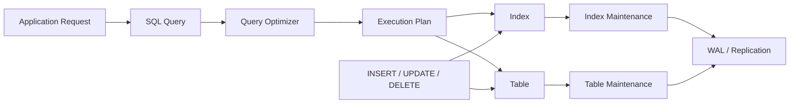
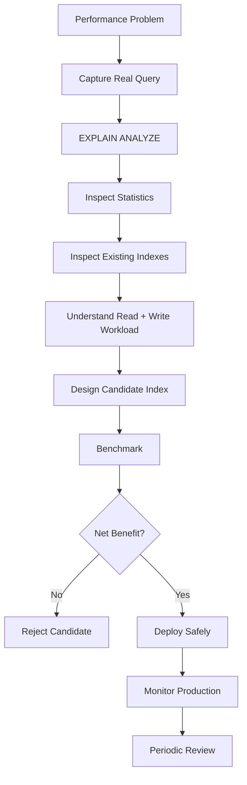

# 36- Index Anti-Patterns

## Overview

Indexing is one of the most effective ways to improve SQL read performance, but poorly designed indexes can make a database slower, larger, and harder to operate.

An **index anti-pattern** is an indexing decision that appears reasonable locally but produces poor results when evaluated against the actual query workload, data distribution, write volume, or operational requirements.

Common anti-patterns include:

- Creating indexes on every column used in `WHERE`.
- Creating many overlapping composite indexes.
- Ignoring column order in composite indexes.
- Creating indexes without inspecting execution plans.
- Keeping unused or redundant indexes indefinitely.
- Building excessively wide covering indexes.
- Indexing low-selectivity columns without understanding data distribution.
- Using indexes to compensate for inefficient SQL.
- Ignoring write amplification.
- Creating indexes for hypothetical future queries.
- Treating ORM model fields as an indexing strategy.
- Assuming an index will always be selected by the optimizer.

The senior-level approach is to treat an index as a **workload-specific data structure with measurable benefits and ongoing costs**.

## How Index Anti-Patterns Affect Production Systems

Every additional index introduces another structure that the database must maintain.



A read optimization can therefore affect the entire system:

| Area | Potential impact |
|---|---|
| Query latency | Usually improves when the index matches the workload |
| Write latency | Can increase because indexes must be maintained |
| CPU | Additional index maintenance and traversal |
| Memory | Index pages compete for buffer/cache space |
| Storage | Every index consumes disk |
| WAL | Index modifications generate additional WAL |
| Replication | Replicas must replay index-related changes |
| Backup | More data must be backed up |
| Maintenance | Vacuum and index maintenance become more expensive |
| Deployment | Large index creation can consume significant resources |

The goal is not to maximize index usage. The goal is to optimize the **total workload**.

## Anti-Pattern: Index Every Column

A common approach is:

```sql
CREATE INDEX idx_orders_customer_id
ON orders (customer_id);

CREATE INDEX idx_orders_status
ON orders (status);

CREATE INDEX idx_orders_created_at
ON orders (created_at);

CREATE INDEX idx_orders_region
ON orders (region);

CREATE INDEX idx_orders_payment_method
ON orders (payment_method);
```

This may look safe because each column appears in queries.

The problem is that each index has a cost.

For a write-heavy table:

```text
INSERT order
    │
    ├── table modification
    ├── customer_id index
    ├── status index
    ├── created_at index
    ├── region index
    └── payment_method index
```

If several of these indexes rarely provide useful execution plans, they are pure overhead.

### Better Approach

Start with actual workload patterns:

```sql
EXPLAIN (ANALYZE, BUFFERS)
SELECT id, total
FROM orders
WHERE customer_id = 42
ORDER BY created_at DESC
LIMIT 50;
```

Then design an index around the access pattern:

```sql
CREATE INDEX idx_orders_customer_created
ON orders (customer_id, created_at DESC);
```

One well-designed composite index may be more useful than several independent indexes.

## Anti-Pattern: Creating Indexes Without `EXPLAIN`

Creating an index based only on a query's `WHERE` clause is incomplete reasoning.

Before:

```sql
SELECT id, total
FROM orders
WHERE customer_id = 42;
```

inspect the current plan:

```sql
EXPLAIN (ANALYZE, BUFFERS)
SELECT id, total
FROM orders
WHERE customer_id = 42;
```

Then compare the plan after introducing the candidate index.

Important metrics include:

- Actual execution time.
- Estimated versus actual rows.
- Scan type.
- Buffer hits.
- Buffer reads.
- Rows removed by filtering.
- Sort operations.
- Join strategy.

An index should solve a demonstrated bottleneck rather than an imagined one.

## Anti-Pattern: Ignoring Composite Index Column Order

Consider:

```sql
CREATE INDEX idx_orders_customer_status_created
ON orders (customer_id, status, created_at);
```

The index is not equivalent to:

```sql
CREATE INDEX idx_orders_status_customer_created
ON orders (status, customer_id, created_at);
```

The leading columns influence which predicates and ordering requirements can efficiently use the index.

For example:

```sql
WHERE customer_id = 42
  AND status = 'pending'
ORDER BY created_at DESC
```

is naturally aligned with:

```text
customer_id → status → created_at
```

Changing the order without understanding the workload can make the index much less useful.

### Practical Rule

Do not ask:

> "Which columns should I index?"

Ask:

> "What access path does the query need?"

Then design the index around:

- Equality predicates.
- Range predicates.
- Join predicates.
- Ordering.
- Grouping.
- Required output columns.

## Anti-Pattern: Too Many Overlapping Composite Indexes

Suppose a table contains:

```sql
(customer_id, created_at)
(customer_id, status, created_at)
(customer_id, status)
(status, created_at)
```

Each index may have originated from a legitimate query.

Over time, however, the schema can accumulate redundant access paths.

This creates:

```text
More indexes
   ↓
More storage
   ↓
More write maintenance
   ↓
More WAL
   ↓
More cache pressure
   ↓
More operational complexity
```

Before adding another composite index, inspect existing definitions.

PostgreSQL:

```sql
SELECT
    schemaname,
    tablename,
    indexname,
    indexdef
FROM pg_indexes
WHERE schemaname = 'public'
ORDER BY tablename, indexname;
```

Then determine whether an existing index can support the query adequately.

## Anti-Pattern: Treating Prefixes as Interchangeable

For a B-tree index:

```sql
CREATE INDEX idx_orders_customer_status
ON orders (customer_id, status);
```

this generally supports access paths beginning with `customer_id` much better than queries that only constrain `status`.

For example:

```sql
WHERE customer_id = 42
```

aligns with the leading column.

But:

```sql
WHERE status = 'pending'
```

does not get the same benefit merely because `status` appears somewhere in the index.

The exact behavior depends on the database engine and query plan, but the important engineering principle remains:

> Composite indexes are ordered structures, not unordered sets of columns.

## Anti-Pattern: Indexing Low-Selectivity Columns Blindly

Suppose:

```sql
status
------
completed
completed
completed
completed
pending
completed
...
```

If nearly every row has `status = 'completed'`, an index on `status` may not provide a useful access path for queries returning most of the table.

```sql
CREATE INDEX idx_orders_status
ON orders (status);
```

may be unnecessary for the dominant workload.

But if a small subset is queried frequently:

```sql
WHERE status = 'pending'
```

a partial index can be more appropriate in PostgreSQL:

```sql
CREATE INDEX idx_orders_pending
ON orders (created_at)
WHERE status = 'pending';
```

This can be substantially smaller and more targeted.

### Important

Low cardinality does **not** mean a column should never be indexed.

The decision depends on:

- Data distribution.
- Query selectivity.
- Query frequency.
- Table size.
- Predicate shape.
- Write workload.
- Database engine.

## Anti-Pattern: Indexing Columns With Poor Query Selectivity

An index becomes less attractive when a query returns a large percentage of the table.

For example:

```sql
SELECT *
FROM events
WHERE created_at >= TIMESTAMP '2026-01-01';
```

If this returns 95% of the table, traversing an index and then fetching most rows may cost more than a sequential scan.

The optimizer may therefore correctly choose:

```text
Sequential Scan
```

rather than:

```text
Index Scan
```

This is not an indexing failure.

It is the optimizer choosing the cheaper access path.

## Anti-Pattern: Assuming "Index Scan" Is Always Better

Senior engineers should not equate index usage with optimal performance.

Possible execution strategies include:

| Strategy | Appropriate when |
|---|---|
| Sequential scan | Large fraction of table is needed |
| Index scan | Selective lookup with useful heap access |
| Index-only scan | Required data can be satisfied from index pages |
| Bitmap heap scan | Many matching rows but index can narrow page set |
| Parallel sequential scan | Large scan benefits from parallelism |

The correct question is:

> "Which plan minimizes the actual work for this query?"

not:

> "How do I force the database to use my index?"

## Anti-Pattern: Forcing Index Usage

Database optimizers generally make access-path decisions using:

- Statistics.
- Cost estimates.
- Table size.
- Selectivity.
- Physical characteristics.
- Available indexes.
- Query predicates.

Trying to force a specific index can hide the actual problem.

If PostgreSQL chooses a sequential scan, investigate:

```sql
EXPLAIN (ANALYZE, BUFFERS)
SELECT ...;
```

If the estimated and actual cardinalities differ significantly, investigate statistics before assuming the optimizer is wrong.

## Anti-Pattern: Using an Index to Fix Bad SQL

Consider:

```sql
SELECT *
FROM orders
WHERE DATE(created_at) = DATE '2026-09-01';
```

Instead of immediately creating an expression index, first consider a range predicate:

```sql
SELECT *
FROM orders
WHERE created_at >= TIMESTAMP '2026-09-01'
  AND created_at < TIMESTAMP '2026-09-02';
```

This expresses the desired range directly and can use a conventional index on `created_at`.

The optimization process should generally be:

```text
Bad query shape
      ↓
Rewrite SQL
      ↓
Inspect execution plan
      ↓
Validate statistics
      ↓
Consider index
      ↓
Benchmark
```

An index should not become a permanent workaround for inefficient query construction.

## Anti-Pattern: Creating an Index for an ORM Field

Consider a Django model:

```python
class Order(models.Model):
    customer_id = models.BigIntegerField()
    status = models.CharField(max_length=32)
    created_at = models.DateTimeField()
```

It does not follow that these fields should each have an index.

The application may actually execute:

```sql
SELECT id, total
FROM orders
WHERE customer_id = ?
ORDER BY created_at DESC
LIMIT 50;
```

The workload may favor:

```sql
CREATE INDEX idx_orders_customer_created
ON orders (customer_id, created_at DESC);
```

rather than three independent indexes.

ORM schema design should reflect application access patterns, not merely field presence.

## Anti-Pattern: Creating Indexes for Hypothetical Future Queries

Avoid:

```text
"We might need this query someday,
so let's create the index now."
```

The index immediately introduces cost, while the future benefit is uncertain.

This is especially problematic for:

- High-volume write tables.
- Large indexes.
- Frequently changing columns.
- Large multi-column indexes.

Prefer creating indexes in response to:

- Known workload requirements.
- Measured performance problems.
- Explicit latency requirements.
- Proven access patterns.

## Anti-Pattern: Keeping Unused Indexes Forever

PostgreSQL exposes index usage statistics:

```sql
SELECT
    schemaname,
    relname AS table_name,
    indexrelname AS index_name,
    idx_scan,
    idx_tup_read,
    idx_tup_fetch
FROM pg_stat_user_indexes
ORDER BY idx_scan ASC;
```

An index with very low usage deserves investigation.

However:

> Low usage does not automatically mean "drop it."

Consider:

- Observation period.
- Seasonal traffic.
- Scheduled jobs.
- Rare but critical queries.
- Constraint dependencies.
- Statistics resets.
- Disaster recovery and operational workflows.

Index removal should be evidence-based.

## Anti-Pattern: Ignoring Index Size

Index count alone does not reveal the full cost.

An application may have:

```text
10 small indexes
```

that are cheaper than:

```text
2 enormous indexes
```

Inspect index sizes:

```sql
SELECT
    schemaname,
    relname AS table_name,
    indexrelname AS index_name,
    pg_size_pretty(pg_relation_size(indexrelid)) AS index_size
FROM pg_stat_user_indexes
ORDER BY pg_relation_size(indexrelid) DESC;
```

Large indexes affect:

- Storage cost.
- Cache efficiency.
- Backup duration.
- Replication.
- Maintenance.
- Index build time.

## Anti-Pattern: Building Excessively Wide Covering Indexes

Suppose:

```sql
SELECT
    id,
    total,
    status,
    currency,
    region,
    payment_method
FROM orders
WHERE customer_id = 42
ORDER BY created_at DESC
LIMIT 50;
```

An engineer might attempt to cover every selected column:

```sql
CREATE INDEX idx_orders_everything
ON orders (
    customer_id,
    created_at DESC,
    id,
    total,
    status,
    currency,
    region,
    payment_method
);
```

This may reduce heap access for a particular query but can create a large index.

In PostgreSQL, `INCLUDE` can separate search keys from payload columns:

```sql
CREATE INDEX idx_orders_customer_created
ON orders (customer_id, created_at DESC)
INCLUDE (total, status, currency);
```

Even then, covering should be justified by measurement.

Do not turn every `SELECT` column into index storage.

## Anti-Pattern: Indexing Large Text Columns Without a Query Model

A conventional B-tree index is not automatically the right solution for arbitrary text search.

For example:

```sql
WHERE description LIKE '%database%'
```

does not naturally map to a standard B-tree lookup because the wildcard begins with `%`.

Depending on requirements, appropriate technologies may include:

- Full-text search.
- PostgreSQL `tsvector`.
- PostgreSQL trigram indexes.
- Dedicated search systems.

The correct solution depends on the search semantics.

An index type should match the operator and workload.

## Anti-Pattern: Using the Wrong Index Type

Different index structures solve different problems.

| Index type | Typical use |
|---|---|
| B-tree | Equality, ranges, ordering |
| Hash | Equality-focused workloads |
| GIN | Arrays, JSONB, full-text-related structures |
| GiST | Geometric/range and extensible search operations |
| BRIN | Very large tables with strong physical correlation |

For example, blindly creating a B-tree for a JSONB containment workload may not be the right design.

```sql
WHERE metadata @> '{"region": "IN"}'
```

In PostgreSQL, a GIN index may be more appropriate:

```sql
CREATE INDEX idx_orders_metadata
ON orders
USING GIN (metadata);
```

Index type selection must follow the operator class and query pattern.

## Anti-Pattern: Ignoring Physical Data Correlation

BRIN indexes can be highly effective for large tables when column values correlate with physical row ordering.

For example:

```text
Rows inserted chronologically

2026-08-01
2026-08-01
2026-08-02
2026-08-02
2026-08-03
...
```

A BRIN index on `created_at` can summarize ranges of pages efficiently.

But a randomly distributed value:

```text
7
90231
18
5002
81
...
```

may provide poor pruning.

Do not choose BRIN simply because the table is large.

## Anti-Pattern: Ignoring Partial Indexes

A normal index may contain millions of entries even though the application only queries a small subset.

Consider:

```sql
SELECT id
FROM jobs
WHERE status = 'pending'
ORDER BY created_at
LIMIT 100;
```

Instead of:

```sql
CREATE INDEX idx_jobs_status_created
ON jobs (status, created_at);
```

a PostgreSQL partial index may better reflect the workload:

```sql
CREATE INDEX idx_jobs_pending_created
ON jobs (created_at)
WHERE status = 'pending';
```

This reduces the indexed population.

Partial indexes are especially useful for:

- Active records.
- Pending jobs.
- Soft-deleted data.
- Unprocessed events.
- Current records.

They should still be validated against actual workload behavior.

## Anti-Pattern: Ignoring Write Amplification

Suppose:

```text
Table:
100 GB

Indexes:
80 GB

Writes:
50,000 rows/sec
```

Adding another large index may have a substantial impact even if it improves one API endpoint.

For every candidate index, evaluate:

```text
Read benefit
    -
Write cost
    -
Storage cost
    -
Maintenance cost
    -
Replication cost
    =
Net operational value
```

This trade-off becomes particularly important for:

- Event ingestion.
- Audit logging.
- High-volume transactional systems.
- Queue-like tables.
- Telemetry systems.

## Anti-Pattern: Indexing Highly Volatile Columns Without Need

Consider:

```sql
UPDATE jobs
SET status = 'running'
WHERE id = 123;
```

followed by:

```sql
UPDATE jobs
SET status = 'completed'
WHERE id = 123;
```

If `status` is indexed and changes frequently, every state transition can require index maintenance.

If the application rarely filters by `status`, the index may have negative net value.

If the application frequently searches pending jobs, however, a targeted partial index may still be highly beneficial.

The correct decision depends on the workload.

## Anti-Pattern: Ignoring Duplicate Indexes

These indexes provide the same basic key:

```sql
CREATE INDEX idx_orders_customer_a
ON orders (customer_id);

CREATE INDEX idx_orders_customer_b
ON orders (customer_id);
```

Keeping both creates unnecessary overhead.

Duplicate indexes can arise from:

- Repeated migrations.
- Manual database changes.
- ORM migrations.
- Multiple teams modifying the schema.
- Legacy indexes surviving application redesigns.

Periodically audit index definitions and ownership.

## Anti-Pattern: Confusing Constraint Indexes With Performance Indexes

Some indexes exist because a database constraint requires them.

For example, a primary key is backed by a unique index in PostgreSQL.

Do not assume that an index with low `idx_scan` is useless simply because it is not frequently used for query execution.

Before removing an index, determine whether it supports:

- Primary keys.
- Unique constraints.
- Exclusion constraints.
- Other database invariants.

Correctness-related indexes should be evaluated differently from optional performance indexes.

## Anti-Pattern: Ignoring Foreign-Key Workloads

A foreign-key column is not automatically required to have an index, but child-side indexes can be important for common access patterns and parent-row modifications.

For example:

```sql
CREATE TABLE orders (
    id bigint PRIMARY KEY,
    customer_id bigint REFERENCES customers(id)
);
```

If the application frequently executes:

```sql
SELECT *
FROM orders
WHERE customer_id = 42;
```

an index on `customer_id` may be appropriate.

The important distinction is:

```text
Foreign key exists
        ≠
Index is automatically required
```

The workload determines whether the index provides value.

## Anti-Pattern: Creating Indexes During Peak Traffic Without Planning

Building a large index is an operational event.

For PostgreSQL:

```sql
CREATE INDEX CONCURRENTLY idx_orders_customer_created
ON orders (customer_id, created_at DESC);
```

`CONCURRENTLY` can reduce blocking of normal writes compared with a regular index build, but it can take longer and has additional operational constraints.

Production index creation should consider:

- Table size.
- Build duration.
- Lock behavior.
- Disk requirements.
- WAL generation.
- Replica lag.
- Deployment windows.
- Failure recovery.
- Migration tooling.

Large schema changes should be treated as production changes, not simply DDL statements.

## Anti-Pattern: Ignoring Replica Impact

A large index build or a large number of index modifications can affect replication.

For a system using:

```text
Application
    │
    ├── Writes ──► Primary
    │
    └── Reads ───► Replica
```

additional index maintenance contributes to the workload that replicas must replay.

Monitor:

- Replica lag.
- WAL generation.
- Replica CPU.
- Replica disk I/O.
- Query latency.

An index that looks beneficial on the primary should still be evaluated against the complete deployment topology.

## Anti-Pattern: Optimizing Only for Read Latency

Suppose an index reduces a query from:

```text
80 ms → 5 ms
```

but increases write latency from:

```text
2 ms → 8 ms
```

If the system performs:

```text
10,000 reads/sec
100,000 writes/sec
```

the index may be a poor trade-off despite the impressive read improvement.

Optimization must consider workload volume.

A useful model is:

```text
Total workload cost
=
(read frequency × read cost)
+
(write frequency × write cost)
+
(storage/maintenance cost)
```

The exact calculation depends on the system, but the reasoning is important.

## Anti-Pattern: Ignoring Cache Effects

Indexes consume memory.

If a large index displaces frequently accessed table pages from the database buffer cache, adding the index can sometimes hurt unrelated workloads.

Consider:

```text
Database memory
├── Frequently accessed table pages
├── Hot index pages
├── Query execution memory
└── Other database structures
```

A larger index is not free simply because storage is inexpensive.

Memory locality matters.

## Anti-Pattern: Assuming Development Performance Represents Production

A query against:

```text
10,000 rows
```

may behave completely differently against:

```text
500,000,000 rows
```

Production-like validation should consider:

- Row count.
- Data distribution.
- Cardinality.
- Concurrent requests.
- Hardware.
- Cache state.
- Query frequency.
- Replica topology.

Indexes should be evaluated against realistic data volumes.

## Anti-Pattern: Ignoring Statistics

Poor statistics can produce poor query plans.

Inspect:

```sql
EXPLAIN (ANALYZE, BUFFERS)
SELECT ...
```

If the optimizer estimates:

```text
rows=100
```

but the query actually processes:

```text
2,000,000 rows
```

the problem may be statistics or data distribution rather than a missing index.

Run statistics maintenance where appropriate:

```sql
ANALYZE orders;
```

For complex or skewed workloads, database-specific statistics configuration may also be relevant.

## Anti-Pattern: Using Hints as the First Solution

Hints or optimizer configuration can sometimes be appropriate for specialized cases, but they should not be the default response to a poor plan.

Before forcing behavior, investigate:

1. Query shape.
2. Statistics.
3. Data distribution.
4. Existing indexes.
5. Table size.
6. Cost assumptions.
7. Actual execution metrics.

A forced plan can become harmful as data distributions change.

## Anti-Pattern: Ignoring Index Maintenance

Indexes require ongoing operational attention.

Monitor:

- Index size.
- Usage.
- Bloat where relevant.
- Query latency.
- Write latency.
- Vacuum activity.
- WAL volume.
- Replica lag.

PostgreSQL index usage can be reviewed with:

```sql
SELECT
    schemaname,
    relname AS table_name,
    indexrelname AS index_name,
    idx_scan,
    pg_size_pretty(pg_relation_size(indexrelid)) AS index_size
FROM pg_stat_user_indexes
ORDER BY pg_relation_size(indexrelid) DESC;
```

Monitoring should identify indexes that are:

- Large.
- Rarely used.
- Redundant.
- Expensive to maintain.
- No longer aligned with application behavior.

## Production Index Review Process

A practical review process is:



For a production index change:

1. Identify the workload.
2. Capture representative SQL.
3. Measure the current execution plan.
4. Check existing indexes.
5. Evaluate data distribution.
6. Estimate storage and write cost.
7. Create a candidate index in a representative environment.
8. Benchmark before and after.
9. Deploy using appropriate migration procedures.
10. Monitor read and write performance.
11. Reassess the index over time.

## PostgreSQL Operational Queries

### List Indexes

```sql
SELECT
    schemaname,
    tablename,
    indexname,
    indexdef
FROM pg_indexes
WHERE schemaname = 'public'
ORDER BY tablename, indexname;
```

### Inspect Index Usage

```sql
SELECT
    schemaname,
    relname AS table_name,
    indexrelname AS index_name,
    idx_scan,
    idx_tup_read,
    idx_tup_fetch
FROM pg_stat_user_indexes
ORDER BY idx_scan ASC;
```

### Inspect Index Size

```sql
SELECT
    schemaname,
    relname AS table_name,
    indexrelname AS index_name,
    pg_size_pretty(pg_relation_size(indexrelid)) AS index_size
FROM pg_stat_user_indexes
ORDER BY pg_relation_size(indexrelid) DESC;
```

### Inspect a Query Plan

```sql
EXPLAIN (ANALYZE, BUFFERS)
SELECT id, total
FROM orders
WHERE customer_id = 42
ORDER BY created_at DESC
LIMIT 50;
```

Use `EXPLAIN (ANALYZE, BUFFERS)` carefully on production systems because `ANALYZE` executes the query. Avoid running mutating statements this way unless you fully understand the consequences.

## Production Best Practices

### Design Indexes From Access Patterns

Start from:

```text
Application workload
        ↓
SQL queries
        ↓
Predicates / joins / ordering
        ↓
Execution plans
        ↓
Index design
```

not:

```text
Database columns
        ↓
Index everything
```

### Prefer Fewer, Purposeful Indexes

A small number of well-designed indexes is often better than many overlapping indexes.

### Measure Before and After

Always establish a baseline.

Compare:

- Execution time.
- Buffers.
- CPU.
- I/O.
- Rows processed.
- Write latency.

### Review Indexes Periodically

Index strategy should evolve as:

- APIs change.
- Query patterns change.
- Data volume grows.
- Data distribution changes.
- Features are removed.
- Services are migrated.

### Consider the Entire System

Evaluate effects on:

- Primary database.
- Read replicas.
- Backups.
- WAL.
- Storage.
- Cache.
- Maintenance.
- Disaster recovery.

## Common Mistakes and Pitfalls

| Mistake | Why it happens | Better approach |
|---|---|---|
| Index every `WHERE` column | Treating predicates independently | Design around complete access patterns |
| Add index before `EXPLAIN` | Guessing the bottleneck | Inspect actual execution plan |
| Ignore composite column order | Treating indexes as unordered | Design around leading access patterns |
| Keep all old indexes | Fear of removing indexes | Audit usage and dependencies |
| Create huge covering indexes | Trying to eliminate every heap lookup | Cover only measured hot paths |
| Index low-cardinality columns blindly | Assuming any filter benefits | Check selectivity and distribution |
| Ignore writes | Focusing only on reads | Measure read/write trade-offs |
| Trust development data | Small datasets hide scaling behavior | Test with production-like data |
| Force index usage | Assuming index scans are always faster | Fix statistics/query/index design |
| Use B-tree for everything | Treating all lookups alike | Match index type to operators |
| Index hypothetical queries | Optimizing uncertain future workloads | Index demonstrated workloads |
| Ignore storage | Focusing only on latency | Track index size and operational cost |

## Interview Traps

### "More indexes always improve performance."

False. Indexes improve suitable reads while increasing write and maintenance costs.

### "A sequential scan means the database is missing an index."

False. A sequential scan can be the optimal plan when a large percentage of rows is required.

### "Every foreign key should have an index."

Not universally. Foreign-key indexes are often useful, but workload and parent-row modification patterns determine whether they are necessary.

### "Low-cardinality columns should never be indexed."

False. Partial and composite indexes can make low-cardinality predicates highly useful.

### "An index containing a column can efficiently support queries on that column."

Not necessarily. Composite index ordering matters.

### "Unused indexes should always be dropped."

Not without investigation. Constraint indexes, seasonal workloads, and rare critical queries require consideration.

### "Covering indexes are always faster."

No. They can reduce table access but may become large and expensive to maintain.

### "The optimizer should always use the index I created."

No. The optimizer chooses the plan it estimates to be cheapest.

### "Indexing is purely a read optimization."

No. Indexes affect writes, WAL, replication, storage, caching, backups, and maintenance.

## Key Takeaways

- **Indexes should be designed from real query access patterns, not from database columns or hypothetical future requirements.**
- **The most dangerous index anti-pattern is optimizing a single read while ignoring write amplification, storage, cache pressure, replication, and maintenance costs.**
- **Composite index column order, selectivity, query shape, and index type determine whether an index is actually useful.**
- **Use execution plans, workload measurements, index usage statistics, and production-like data to validate index decisions instead of relying on intuition.**
- **Treat index creation, retention, and removal as ongoing production engineering decisions that must evolve with the workload.**