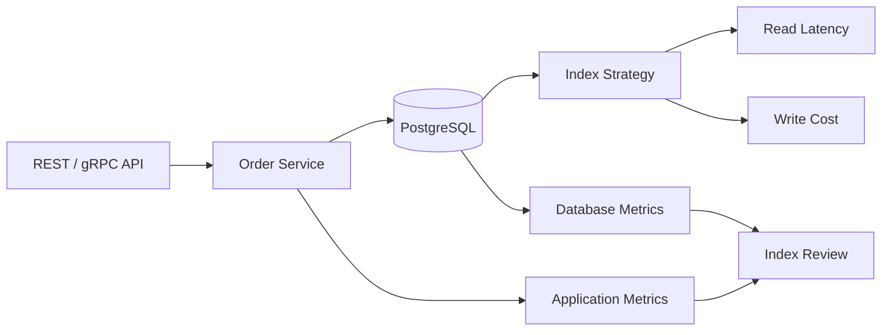

# 37- Index Decision Checklist

## Overview

An index should be treated as a production workload decision, not simply as a database schema addition. A good index provides a measurable reduction in query cost while its maintenance overhead remains acceptable for the application's read, write, storage, and operational profile.

The decision should therefore answer four questions:

1. **What query or workload problem are we solving?**
2. **Does the proposed index provide a better access path?**
3. **What does the index cost during writes and maintenance?**
4. **Can we safely operate and validate the index in production?**

This checklist provides a repeatable process for evaluating indexes in PostgreSQL-backed Python, Django, FastAPI, and microservice systems.

## Index Decision Model

A useful mental model is:

```text
                Candidate Index
                      │
          ┌───────────┴───────────┐
          │                       │
      Read Benefit             Index Cost
          │                       │
    ┌─────┼─────┐           ┌─────┼─────┐
    │     │     │           │     │     │
  Filter Join Order       Writes Storage Cache
    │     │     │           │     │     │
    └─────┼─────┘           └─────┼─────┘
          │                       │
          └──────────┬────────────┘
                     ↓
              Net Production Value
```

The correct question is not:

> "Can this query use an index?"

It is:

> "Does this index materially improve the workload enough to justify its lifetime operational cost?"

## When to Consider an Index

An index is a strong candidate when one or more of the following are true:

- A frequently executed query performs an expensive scan.
- A latency-sensitive API endpoint depends on a selective lookup.
- A join repeatedly scans a large relation.
- A query performs expensive sorting that an index can avoid.
- A queue-like workload repeatedly searches a small active subset.
- A range query needs efficient navigation over a large table.
- A production execution plan demonstrates an inefficient access path.
- A measured workload justifies the additional write and storage cost.

An index is a weaker candidate when:

- The query is rarely executed.
- The query returns most of the table.
- The table is very small.
- An existing index already provides an adequate access path.
- The proposed index is redundant.
- The workload is predominantly writes.
- The expected benefit is based only on a hypothetical future query.

## Index Decision Checklist

### Workload Validation

Before designing the index, verify the workload.

- [ ] Is there a real production query that needs improvement?
- [ ] Is the query executed frequently enough to matter?
- [ ] Is the query latency actually a bottleneck?
- [ ] Is the query part of a latency-sensitive request path?
- [ ] Is the workload representative of production traffic?
- [ ] Have read and write frequencies been considered?
- [ ] Have seasonal and scheduled workloads been considered?

A query executed once per hour does not necessarily justify an expensive index. A query executed thousands of times per second may justify substantial index overhead.

## Query Shape Checklist

Inspect the complete query rather than looking only at its `WHERE` clause.

- [ ] What columns appear in equality predicates?
- [ ] What columns appear in range predicates?
- [ ] What columns participate in joins?
- [ ] Is `ORDER BY` involved?
- [ ] Is `GROUP BY` involved?
- [ ] Is `DISTINCT` involved?
- [ ] Are there expressions applied to indexed columns?
- [ ] Are there functions or casts preventing straightforward index use?
- [ ] Is the query using `LIKE`, JSON, arrays, ranges, or other specialized operators?
- [ ] Can the query be rewritten before adding an index?

Example:

```sql
SELECT id, total
FROM orders
WHERE customer_id = 42
ORDER BY created_at DESC
LIMIT 50;
```

The access pattern is:

```text
customer_id → created_at DESC → limited result set
```

A candidate index is therefore:

```sql
CREATE INDEX idx_orders_customer_created
ON orders (customer_id, created_at DESC);
```

The important part is that the index reflects the **query access path**, not simply the fact that both columns appear in the query.

## Existing Index Checklist

Before creating anything new:

- [ ] List existing indexes on the table.
- [ ] Inspect index column order.
- [ ] Check for duplicate indexes.
- [ ] Check for overlapping indexes.
- [ ] Check whether an existing composite index already supports the query.
- [ ] Check whether a partial index already covers the workload.
- [ ] Check whether a unique or constraint-backed index exists.
- [ ] Review index sizes.
- [ ] Review index usage statistics.

PostgreSQL:

```sql
SELECT
    schemaname,
    tablename,
    indexname,
    indexdef
FROM pg_indexes
WHERE schemaname = 'public'
  AND tablename = 'orders'
ORDER BY indexname;
```

Never create an index before checking what already exists.

## Execution Plan Checklist

Capture the current execution plan:

```sql
EXPLAIN (ANALYZE, BUFFERS)
SELECT id, total
FROM orders
WHERE customer_id = 42
ORDER BY created_at DESC
LIMIT 50;
```

Review:

- [ ] Scan type.
- [ ] Estimated rows.
- [ ] Actual rows.
- [ ] Execution time.
- [ ] Planning time.
- [ ] Buffer hits.
- [ ] Buffer reads.
- [ ] Sort operations.
- [ ] Rows removed by filtering.
- [ ] Join strategy.
- [ ] Nested-loop behavior.
- [ ] Parallel execution.
- [ ] Whether estimates substantially differ from reality.

A useful signal is a large discrepancy between estimated and actual cardinality:

```text
Estimated rows: 100
Actual rows:    500,000
```

That may indicate a statistics or data-distribution problem rather than a missing index.

`EXPLAIN (ANALYZE)` executes the query, so use it carefully in production. Avoid testing mutating statements casually.

## Selectivity Checklist

Determine how selective the predicate actually is.

Ask:

- [ ] How many rows match the predicate?
- [ ] What percentage of the table is returned?
- [ ] Is the data distribution skewed?
- [ ] Does selectivity change over time?
- [ ] Does selectivity differ significantly between tenants or regions?
- [ ] Is the indexed value highly repetitive?

For example:

```sql
WHERE status = 'completed'
```

may match most rows.

Whereas:

```sql
WHERE status = 'pending'
```

may match only a small active subset.

This difference can materially affect index value.

### Important

Do not use cardinality as a rigid rule such as:

> "Low-cardinality columns should never be indexed."

Instead evaluate the complete predicate, workload, data distribution, and execution plan.

## Composite Index Checklist

For a composite index:

```sql
CREATE INDEX idx_orders_customer_status_created
ON orders (customer_id, status, created_at DESC);
```

verify:

- [ ] Leading column matches common access patterns.
- [ ] Equality predicates are considered.
- [ ] Range predicates are considered.
- [ ] Ordering requirements are considered.
- [ ] Join predicates are considered.
- [ ] Column order is intentional.
- [ ] The index does not duplicate an existing prefix.
- [ ] The index is not unnecessarily wide.

Do not treat a composite index as an unordered collection of columns.

These are different structures:

```sql
(customer_id, status, created_at)
```

and:

```sql
(status, customer_id, created_at)
```

Column order must be justified by workload.

## Ordering Checklist

If the query contains:

```sql
ORDER BY created_at DESC
```

ask:

- [ ] Can the index provide the required ordering?
- [ ] Is a sort operation expensive?
- [ ] Does the query use `LIMIT`?
- [ ] Would ordered index traversal allow the database to stop early?

For:

```sql
SELECT id
FROM orders
WHERE customer_id = 42
ORDER BY created_at DESC
LIMIT 50;
```

this can be particularly valuable:

```sql
CREATE INDEX idx_orders_customer_created
ON orders (customer_id, created_at DESC);
```

The database can potentially locate the customer's newest rows without sorting the entire matching set.

## Index Type Checklist

Choose the index type based on the operators and data structure.

| Requirement | Typical PostgreSQL choice |
|---|---|
| Equality and range lookups | B-tree |
| Ordering | B-tree |
| JSONB containment/search | GIN |
| Array membership/search | GIN |
| Full-text-related search | GIN with appropriate text-search design |
| Geometric/range workloads | GiST |
| Very large correlated tables | BRIN |
| Specialized operator semantics | Appropriate operator class/index type |

Do not default to B-tree without examining the query operators.

For example:

```sql
SELECT id
FROM orders
WHERE metadata @> '{"region": "IN"}';
```

may be a candidate for:

```sql
CREATE INDEX idx_orders_metadata
ON orders
USING GIN (metadata);
```

The exact index design should still be validated with the actual workload.

## Partial Index Checklist

Consider a partial index when only a subset of rows is relevant.

Example:

```sql
SELECT id, created_at
FROM jobs
WHERE status = 'pending'
ORDER BY created_at
LIMIT 100;
```

Candidate:

```sql
CREATE INDEX idx_jobs_pending_created
ON jobs (created_at)
WHERE status = 'pending';
```

Check:

- [ ] Is the subset stable enough to justify the design?
- [ ] Do production queries consistently contain the predicate?
- [ ] Is the partial index substantially smaller?
- [ ] Does it reduce maintenance cost compared with a full index?
- [ ] Does the query planner recognize the predicate relationship?

Partial indexes can be highly effective for:

- Pending jobs.
- Active records.
- Unprocessed events.
- Non-deleted records.
- Current state.

## Covering Index Checklist

Consider covering indexes when table access is a measurable bottleneck.

Example:

```sql
CREATE INDEX idx_orders_customer_created
ON orders (customer_id, created_at DESC)
INCLUDE (total, status);
```

Check:

- [ ] Is heap access actually expensive?
- [ ] Is the query frequent?
- [ ] Are the included columns stable enough?
- [ ] Is the index size acceptable?
- [ ] Will the index materially improve the execution plan?
- [ ] Is index-only scanning realistically achievable for the workload?

Avoid turning every selected column into index payload.

Wide covering indexes can create significant storage and write overhead.

## Write Cost Checklist

Every index increases work for relevant table modifications.

For each candidate:

- [ ] How frequently is the table inserted into?
- [ ] How frequently are indexed columns updated?
- [ ] How frequently are rows deleted?
- [ ] Is the indexed column highly volatile?
- [ ] Is the table write-heavy?
- [ ] Could the index increase WAL generation?
- [ ] Could it increase replica lag?
- [ ] Could it increase transaction latency?

For a write-heavy table:

```text
INSERT
  │
  ├── Heap/table modification
  ├── Index A
  ├── Index B
  ├── Index C
  └── Candidate Index
```

The candidate index must justify its additional work.

## Storage Checklist

Estimate the long-term storage impact.

- [ ] How large is the table?
- [ ] How large is the proposed index?
- [ ] Is the index wider than necessary?
- [ ] Will the index grow at the same rate as the table?
- [ ] Is storage capacity sufficient?
- [ ] Does the database use storage-based pricing?
- [ ] Will backups become larger?
- [ ] Will index creation require significant temporary disk space?

Check existing sizes:

```sql
SELECT
    schemaname,
    relname AS table_name,
    indexrelname AS index_name,
    pg_size_pretty(pg_relation_size(indexrelid)) AS index_size
FROM pg_stat_user_indexes
ORDER BY pg_relation_size(indexrelid) DESC;
```

## Cache and Memory Checklist

Indexes compete for database cache.

Ask:

- [ ] Will the new index be large?
- [ ] Is the index expected to be hot?
- [ ] Could it displace useful table pages?
- [ ] Does the workload already have memory pressure?
- [ ] Does the database have enough RAM for the workload?
- [ ] Could the index improve locality enough to offset its size?

A smaller, targeted index can sometimes be preferable to a broad index even when both can satisfy the same query.

## Statistics Checklist

Before concluding that the optimizer is making a poor decision:

- [ ] Are table statistics current?
- [ ] Do estimated and actual rows differ substantially?
- [ ] Is the column distribution highly skewed?
- [ ] Are correlations between columns important?
- [ ] Has the table recently experienced significant data changes?

Run:

```sql
ANALYZE orders;
```

Then re-check:

```sql
EXPLAIN (ANALYZE, BUFFERS)
SELECT id, total
FROM orders
WHERE customer_id = 42
ORDER BY created_at DESC
LIMIT 50;
```

Do not solve a statistics problem by automatically adding indexes.

## Production Deployment Checklist

Before deploying the index:

- [ ] Test the index against production-like data.
- [ ] Compare execution plans before and after.
- [ ] Measure representative query latency.
- [ ] Measure write performance.
- [ ] Estimate storage growth.
- [ ] Understand locking behavior.
- [ ] Understand migration behavior.
- [ ] Consider replica impact.
- [ ] Consider WAL generation.
- [ ] Define a rollback/removal strategy.
- [ ] Schedule large changes appropriately.
- [ ] Monitor the deployment.

For PostgreSQL, large production indexes may be created concurrently:

```sql
CREATE INDEX CONCURRENTLY idx_orders_customer_created
ON orders (customer_id, created_at DESC);
```

`CONCURRENTLY` can reduce blocking of ordinary table writes compared with a regular index build, but it has additional operational behavior and can take longer. Use your migration tooling and PostgreSQL version-specific operational guidance when planning the change.

## Post-Deployment Checklist

After deployment:

- [ ] Query latency improved.
- [ ] Execution plan uses the intended access path where appropriate.
- [ ] Write latency remains acceptable.
- [ ] CPU remains acceptable.
- [ ] Disk I/O remains acceptable.
- [ ] Index size is within expectations.
- [ ] Replica lag remains acceptable.
- [ ] WAL volume remains acceptable.
- [ ] No unexpected query regressions occurred.
- [ ] Index usage is measurable.
- [ ] Application-level latency improved.

Monitor actual usage:

```sql
SELECT
    schemaname,
    relname AS table_name,
    indexrelname AS index_name,
    idx_scan,
    idx_tup_read,
    idx_tup_fetch
FROM pg_stat_user_indexes
WHERE relname = 'orders'
ORDER BY idx_scan DESC;
```

An index that was created for a hot query but remains unused should trigger investigation.

## Removal Checklist

Before dropping an index:

- [ ] Confirm it is not required by a constraint.
- [ ] Check index usage over an adequate observation period.
- [ ] Check seasonal and scheduled workloads.
- [ ] Search application queries for dependency.
- [ ] Check whether another index provides equivalent coverage.
- [ ] Measure the write/storage benefit of removal.
- [ ] Have a rollback strategy.
- [ ] Monitor after removal.

Do not interpret:

```text
idx_scan = 0
```

as automatic proof that an index is useless.

Statistics can reset, workloads can be seasonal, and constraint-backed indexes can have correctness responsibilities.

## Decision Matrix

| Question | Yes | No |
|---|---|---|
| Is there a measured workload problem? | Continue | Usually do not add |
| Is the query frequent or latency-sensitive? | Continue | Require stronger justification |
| Can the query be improved without an index? | Consider rewrite first | Continue |
| Does an existing index already support it? | Avoid duplication | Continue |
| Is the predicate selective enough? | Continue | Validate plan carefully |
| Is column order intentional? | Continue | Redesign |
| Is the index type appropriate? | Continue | Choose appropriate type |
| Is write overhead acceptable? | Continue | Reconsider |
| Is storage overhead acceptable? | Continue | Reconsider |
| Does testing show measurable benefit? | Continue | Reject |
| Can it be deployed safely? | Deploy | Plan operational controls |
| Will production usage be monitored? | Deploy | Add observability first |

## Practical Decision Example

Suppose an orders API executes:

```sql
SELECT id, total, status
FROM orders
WHERE customer_id = $1
  AND status = 'pending'
ORDER BY created_at DESC
LIMIT 50;
```

The table contains hundreds of millions of rows.

A reasonable evaluation is:

### Query

```text
WHERE customer_id = ?
  AND status = 'pending'
ORDER BY created_at DESC
LIMIT 50
```

### Existing indexes

```text
(customer_id)
(status)
(created_at)
```

The individual indexes may not provide the most efficient access path for this complete query.

### Candidate

```sql
CREATE INDEX idx_orders_customer_pending_created
ON orders (customer_id, created_at DESC)
WHERE status = 'pending';
```

The candidate is attractive because it:

- Targets the actual active subset.
- Uses `customer_id` for lookup.
- Supports ordering by `created_at`.
- Avoids indexing rows outside the pending workload.

But it should still be validated with:

```sql
EXPLAIN (ANALYZE, BUFFERS)
SELECT id, total, status
FROM orders
WHERE customer_id = 42
  AND status = 'pending'
ORDER BY created_at DESC
LIMIT 50;
```

Then compare:

```text
Before
------
Execution time
Buffers
Rows scanned
Sort cost
CPU

After
-----
Execution time
Buffers
Rows scanned
Sort cost
CPU
```

The index should only be retained if the improvement justifies its ongoing cost.

## Django and Application-Level Checklist

For Django applications, avoid designing indexes solely from model fields.

Example:

```python
class Order(models.Model):
    customer_id = models.BigIntegerField()
    status = models.CharField(max_length=32)
    created_at = models.DateTimeField()
    total = models.DecimalField(max_digits=12, decimal_places=2)
```

Instead, inspect ORM-generated SQL:

```python
queryset = (
    Order.objects
    .filter(customer_id=customer_id, status="pending")
    .order_by("-created_at")
    .values("id", "total", "status")[:50]
)

print(queryset.query)
```

Then evaluate the generated SQL and execution plan.

A senior backend engineer considers:

```text
API endpoint
    ↓
Django ORM
    ↓
Generated SQL
    ↓
Database optimizer
    ↓
Index access path
    ↓
Actual latency
```

The index strategy belongs to the complete application/database system.

## Microservices Considerations

In a microservice architecture, each service may own a separate database or schema.

Index decisions should therefore be tied to service-specific workloads.

For example:



Do not assume an index that is useful for one service's workload is useful for another.

When services evolve independently, periodically review indexes after:

- API redesigns.
- Query changes.
- Feature removal.
- Data-volume growth.
- Read/write ratio changes.

## CI/CD and Migration Checklist

Index changes should be treated as schema changes in the deployment pipeline.

- [ ] Migration is version-controlled.
- [ ] Migration has been tested against realistic data.
- [ ] Large index builds have an operational plan.
- [ ] Migration timeout behavior is understood.
- [ ] Deployment ordering is safe.
- [ ] Replica behavior is understood.
- [ ] Monitoring is available during rollout.
- [ ] Failure handling is documented.
- [ ] Rollback or cleanup procedure is known.

For large systems, schema changes may require a staged deployment rather than a single application release.

## Common Mistakes

| Mistake | Why it happens | Corrective action |
|---|---|---|
| Indexing every filtered column | Predicate-focused thinking | Design for complete access patterns |
| Skipping `EXPLAIN` | Guessing the bottleneck | Inspect actual plans |
| Ignoring existing indexes | Schema grows organically | Audit before adding |
| Wrong composite order | Treating columns as unordered | Match order to workload |
| Ignoring write cost | Read optimization bias | Evaluate full workload |
| Creating wide indexes | Attempting to cover everything | Keep keys and payload targeted |
| Ignoring selectivity | Assuming all filters are useful | Inspect data distribution |
| Using B-tree everywhere | Defaulting to familiar technology | Match index type to operators |
| Indexing hypothetical queries | Future-proofing | Require evidence |
| Dropping low-use indexes immediately | Overinterpreting statistics | Check dependencies and observation period |
| Testing only small datasets | Development environment differs | Use production-like data |
| Creating indexes during peak traffic | Treating DDL as harmless | Plan operational deployment |
| Assuming index scan is always faster | Equating index use with optimization | Compare total execution cost |
| Ignoring replicas | Focusing on primary only | Monitor replication impact |

## Senior-Level Review Questions

Before approving an index in a production code review, ask:

### Workload

- What production query does this index optimize?
- How frequently does that query execute?
- What is the current latency and resource cost?

### Query Design

- Can the SQL be rewritten instead?
- Why are the index columns ordered this way?
- Could an existing index satisfy the query?

### Selectivity

- How many rows match?
- Does the distribution vary significantly?

### Cost

- How much storage will this index consume?
- What write amplification will it introduce?
- Could it affect WAL or replica lag?

### Operations

- How will the index be created safely?
- How long could the operation take?
- How will success be measured?
- What is the removal strategy if the index becomes obsolete?

### Evidence

- What does `EXPLAIN (ANALYZE, BUFFERS)` show?
- Was the candidate tested with realistic data?
- Is the expected improvement measurable?

A strong index review should be explainable in terms of **query shape, execution plan, workload frequency, data distribution, and operational cost**.

## Production Index Decision Template

Use the following template during design or code review:

| Decision Area | Assessment |
|---|---|
| Query | `<representative SQL>` |
| Workload frequency | `<requests/sec or executions/day>` |
| Current latency | `<baseline>` |
| Current plan | `<scan/join/sort strategy>` |
| Candidate index | `<index definition>` |
| Column order | `<reason>` |
| Index type | `<reason>` |
| Selectivity | `<expected matching rows>` |
| Existing overlap | `<none / details>` |
| Storage impact | `<estimate>` |
| Write impact | `<estimate>` |
| Replica impact | `<assessment>` |
| Deployment strategy | `<strategy>` |
| Success metric | `<measurable target>` |
| Rollback/removal plan | `<strategy>` |

This makes index decisions reviewable and prevents schema changes from becoming undocumented assumptions.

## Key Takeaways

- **Start every index decision with a real workload, representative SQL, and an execution plan rather than the table schema alone.**
- **Validate composite column order, selectivity, index type, and existing-index overlap before creating a new access path.**
- **Evaluate the complete production cost: reads, writes, storage, cache pressure, WAL, replication, backups, and maintenance.**
- **Measure the index before and after deployment, and continue monitoring its usage and operational impact.**
- **A good index decision is evidence-based, workload-specific, safely deployable, and reversible when the workload changes.**