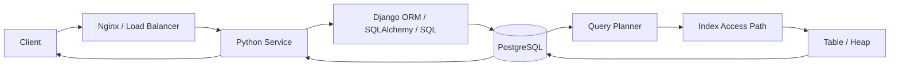
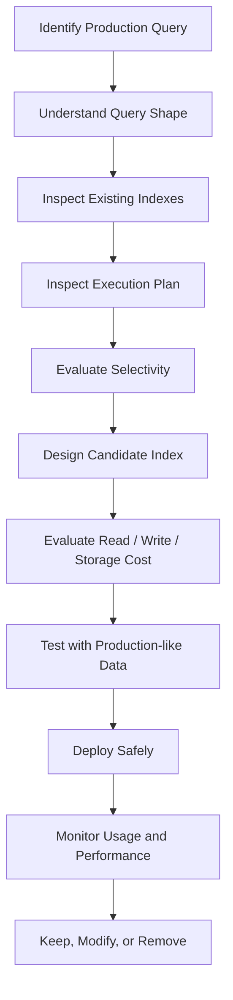

# README

## Overview

Indexes are one of the primary tools for improving SQL read performance, but effective indexing is fundamentally a workload-design problem. An index changes how the database locates, orders, and sometimes retrieves rows; it also consumes storage, memory, write I/O, WAL, and maintenance resources.

This section focuses on designing, evaluating, operating, and removing indexes in production systems. The emphasis is on PostgreSQL and backend workloads commonly generated by Python, Django, FastAPI, REST APIs, gRPC services, and microservices.

The material progresses from index fundamentals to workload-driven design, operational monitoring, and production decision-making.

## Navigation

| # | File | Description |
|---|---|---|
| 01 | [01- Index Fundamentals](./01-%20Index%20Fundamentals.md) | What indexes are and how they work |
| 02 | [02- B-Tree Indexes](./02-%20B-Tree%20Indexes.md) | General-purpose indexing structure |
| 03 | [03- Hash Indexes](./03-%20Hash%20Indexes.md) | Equality-oriented access paths |
| 04 | [04- Composite Indexes](./04-%20Composite%20Indexes.md) | Multi-column access paths |
| 05 | [05- Index Column Order](./05-%20Index%20Column%20Order.md) | Designing composite index column ordering |
| 06 | [06- Covering Indexes](./06-%20Covering%20Indexes.md) | Reducing table access with covering indexes |
| 07 | [07- Partial Indexes](./07-%20Partial%20Indexes.md) | Indexing selected row subsets |
| 08 | [08- Expression Indexes](./08-%20Expression%20Indexes.md) | Indexing computed expressions |
| 09 | [09- Unique Indexes](./09-%20Unique%20Indexes.md) | Uniqueness enforcement and lookup performance |
| 10 | [10- Primary Key Indexes](./10-%20Primary%20Key%20Indexes.md) | Primary-key access paths |
| 11 | [11- Foreign Key Indexing](./11-%20Foreign%20Key%20Indexing.md) | Join and referential workload indexing |
| 12 | [12- Indexes and ORDER BY](./12-%20Indexes%20and%20ORDER%20BY.md) | Avoiding expensive sorts with indexes |
| 13 | [13- Indexes and JOINs](./13-%20Indexes%20and%20JOINs.md) | Join access paths |
| 14 | [14- Indexes and GROUP BY](./14-%20Indexes%20and%20GROUP%20BY.md) | Grouping-related index access |
| 15 | [15- Indexes and DISTINCT](./15-%20Indexes%20and%20DISTINCT.md) | Duplicate elimination with indexes |
| 16 | [16- Indexes and LIKE](./16-%20Indexes%20and%20LIKE.md) | String-search and pattern-matching workloads |
| 17 | [17- Indexes and NULL Values](./17-%20Indexes%20and%20NULL%20Values.md) | NULL-aware indexing behavior |
| 18 | [18- Indexes and Functions](./18-%20Indexes%20and%20Functions.md) | Function-based predicates and index usability |
| 19 | [19- Indexes and OR Conditions](./19-%20Indexes%20and%20OR%20Conditions.md) | Multiple predicate access paths |
| 20 | [20- Indexes and Range Queries](./20-%20Indexes%20and%20Range%20Queries.md) | Time and numeric range indexing |
| 21 | [21- Index Selectivity](./21-%20Index%20Selectivity.md) | Measuring filtering effectiveness |
| 22 | [22- Cardinality and Index Design](./22-%20Cardinality%20and%20Index%20Design.md) | Data distribution and index design decisions |
| 23 | [23- Read Performance vs Write Performance](./23-%20Read%20Performance%20vs%20Write%20Performance.md) | Index cost trade-off analysis |
| 24 | [24- Index Storage Cost](./24-%20Index%20Storage%20Cost.md) | Disk, memory, and operational cost of indexes |
| 25 | [25- Indexing Strategy](./25-%20Indexing%20Strategy.md) | Workload-driven index design approach |
| 26 | [26- Usage Pattern Based Indexing](./26-%20Usage%20Pattern%20Based%20Indexing.md) | Designing indexes around actual queries |
| 27 | [27- Scenario Based Indexing](./27-%20Scenario%20Based%20Indexing.md) | Practical indexing decisions by scenario |
| 28 | [28- Identifying Missing Indexes](./28-%20Identifying%20Missing%20Indexes.md) | Finding inefficient access paths |
| 29 | [29- Identifying Duplicate Indexes](./29-%20Identifying%20Duplicate%20Indexes.md) | Removing redundant indexes |
| 30 | [30- Index Usage Monitoring](./30-%20Index%20Usage%20Monitoring.md) | Measuring index utilization in production |
| 31 | [31- Index Statistics](./31-%20Index%20Statistics.md) | Planner and usage statistics |
| 32 | [32- Index Maintenance](./32-%20Index%20Maintenance.md) | Keeping indexes operational |
| 33 | [33- Index Fragmentation](./33-%20Index%20Fragmentation.md) | Bloat and storage behavior |
| 34 | [34- Choosing the Right Index](./34-%20Choosing%20the%20Right%20Index.md) | Matching index types to workloads |
| 35 | [35- When Not to Create an Index](./35-%20When%20Not%20to%20Create%20an%20Index.md) | Recognizing unnecessary indexes |
| 36 | [36- Index Anti-Patterns](./36-%20Index%20Anti-Patterns.md) | Common indexing failures and mistakes |
| 37 | [37- Index Decision Checklist](./37-%20Index%20Decision%20Checklist.md) | Production index review checklist |

## Indexes in the Backend Request Path

A typical backend request reaches the database through several layers:



An index is therefore not an isolated database optimization. Its value ultimately depends on whether it improves an application workload.

For a production endpoint, the useful chain of reasoning is:

```text
API request
    ↓
Generated SQL
    ↓
Query shape
    ↓
Execution plan
    ↓
Index access path
    ↓
Rows/pages accessed
    ↓
Database latency
    ↓
Application latency
```

## How to Approach Index Design

Index design should normally follow this sequence:



The important principle is:

> **Indexes should be justified by workload evidence, not by the presence of columns in a table.**

## Core Index Concepts

### Access Paths

Without a useful index, the database may need to inspect a large portion of a table.

```text
Sequential Scan
----------------

Table
 ├── Row 1
 ├── Row 2
 ├── Row 3
 ├── ...
 └── Row N
```

With an appropriate index:

```text
Index
  │
  ├── Matching key
  │      │
  │      └── Relevant table rows
  │
  └── Unmatched keys skipped
```

The optimizer decides whether the index access path is cheaper than alternatives.

### Selectivity

Selectivity describes how effectively a predicate narrows the candidate rows.

Highly selective predicates often benefit strongly from indexes:

```sql
WHERE user_id = 918273
```

Less selective predicates may provide limited benefit:

```sql
WHERE status = 'completed'
```

However, selectivity is not an absolute rule. The optimizer considers table size, data distribution, cost estimates, cache state, query shape, and other factors.

### Composite Indexes

Composite indexes contain multiple columns:

```sql
CREATE INDEX idx_orders_customer_created
ON orders (customer_id, created_at DESC);
```

Column order matters because the index is structured according to that order.

A common workload:

```sql
SELECT id, total
FROM orders
WHERE customer_id = $1
ORDER BY created_at DESC
LIMIT 50;
```

may benefit from the composite index because it supports both the customer lookup and ordering pattern.

### Partial Indexes

Partial indexes cover only rows satisfying a predicate:

```sql
CREATE INDEX idx_jobs_pending_created
ON jobs (created_at)
WHERE status = 'pending';
```

They can be especially valuable when a small, frequently queried subset of a large table represents the active workload.

### Covering Indexes

PostgreSQL supports included columns:

```sql
CREATE INDEX idx_orders_customer_created
ON orders (customer_id, created_at DESC)
INCLUDE (total, status);
```

Included columns can allow index-only access in suitable circumstances without becoming part of the index's search key.

Covering indexes should be used selectively because wide indexes increase storage and write overhead.

## Query Planning and EXPLAIN

Index decisions should be validated using execution plans.

A typical PostgreSQL workflow is:

```sql
EXPLAIN (ANALYZE, BUFFERS)
SELECT id, total
FROM orders
WHERE customer_id = 42
ORDER BY created_at DESC
LIMIT 50;
```

Important signals include:

| Signal | Why it matters |
|---|---|
| Scan type | Shows how the table/index is accessed |
| Estimated rows | Planner's cardinality expectation |
| Actual rows | Real result cardinality |
| Execution time | Actual query cost |
| Buffers hit | Cached page activity |
| Buffers read | Physical/read I/O |
| Sort | Potential ordering cost |
| Rows removed by filter | Potentially inefficient filtering |
| Join strategy | Can expose missing or ineffective access paths |

An index should not be considered successful merely because the plan contains an index scan. The objective is lower overall workload cost.

## PostgreSQL Index Types

Index type selection should follow the operators and workload.

| Index type | Typical use |
|---|---|
| B-tree | Equality, ranges, ordering, general-purpose lookups |
| Hash | Equality-oriented access |
| GIN | Arrays, JSONB, full-text-related and containment workloads |
| GiST | Specialized operator classes, ranges, geometric and similarity workloads |
| BRIN | Very large tables where physical row ordering correlates with indexed values |

For example, JSONB containment may require a different strategy than a simple scalar equality lookup.

```sql
SELECT id
FROM orders
WHERE metadata @> '{"region": "IN"}';
```

A GIN index may be appropriate depending on the operator and workload:

```sql
CREATE INDEX idx_orders_metadata
ON orders
USING GIN (metadata);
```

## Indexes and Application Frameworks

Application frameworks generate SQL that should be inspected rather than assumed.

Django example:

```python
queryset = (
    Order.objects
    .filter(customer_id=customer_id, status="pending")
    .order_by("-created_at")
    .values("id", "total", "status")[:50]
)

print(queryset.query)
```

The resulting SQL should then be analyzed using the database's execution-plan tooling.

A model-level declaration such as:

```python
class Order(models.Model):
    customer_id = models.BigIntegerField()
    status = models.CharField(max_length=32)
    created_at = models.DateTimeField()
```

does not by itself determine the optimal index strategy.

The index should reflect actual application access patterns.

## Production Index Lifecycle

Indexes should be managed throughout their lifecycle:

```text
Design
  ↓
Create
  ↓
Validate
  ↓
Monitor
  ↓
Maintain
  ↓
Re-evaluate
  ↓
Modify or Remove
```

A production index is not necessarily permanent. Application behavior, data distribution, traffic patterns, and schema design change over time.

## Index Creation

For large PostgreSQL tables, index creation can be operationally significant.

Where appropriate:

```sql
CREATE INDEX CONCURRENTLY idx_orders_customer_created
ON orders (customer_id, created_at DESC);
```

Concurrent index creation can reduce blocking of normal table operations compared with a regular index build, but it has different execution characteristics and migration considerations.

Large index builds should account for:

- Disk availability.
- Build duration.
- I/O pressure.
- WAL generation.
- Replica impact.
- Deployment windows.
- Failure and cleanup behavior.

Schema migrations should be version-controlled and integrated into CI/CD rather than manually applied without tracking.

## Monitoring

PostgreSQL exposes index usage statistics through system views.

Example:

```sql
SELECT
    schemaname,
    relname AS table_name,
    indexrelname AS index_name,
    idx_scan,
    idx_tup_read,
    idx_tup_fetch
FROM pg_stat_user_indexes
ORDER BY idx_scan DESC;
```

Index size can be inspected with:

```sql
SELECT
    schemaname,
    relname AS table_name,
    indexrelname AS index_name,
    pg_size_pretty(pg_relation_size(indexrelid)) AS index_size
FROM pg_stat_user_indexes
ORDER BY pg_relation_size(indexrelid) DESC;
```

Monitoring should correlate database-level metrics with application metrics:

```text
Database Metrics
├── Query latency
├── Buffer activity
├── I/O
├── Index usage
├── WAL
└── Replication lag

Application Metrics
├── API latency
├── Throughput
├── Error rate
└── Endpoint-specific latency
```

An index is valuable only if the resulting database improvement translates into meaningful application-level improvement.

## Index Statistics and Planner Accuracy

The optimizer relies on statistics to estimate query costs.

A large difference between estimated and actual rows can indicate an estimation problem:

```text
Estimated rows: 100
Actual rows:    500,000
```

Before creating additional indexes, investigate:

- Outdated statistics.
- Data skew.
- Correlated columns.
- Significant recent data changes.
- Inadequate statistics targets where applicable.

Statistics can be refreshed with:

```sql
ANALYZE orders;
```

Do not automatically treat a poor plan as proof of a missing index.

## Index Maintenance

Index maintenance is part of normal database operations.

Important areas include:

- Statistics freshness.
- Index growth.
- Table and index bloat.
- Fragmentation-related behavior.
- Vacuum activity.
- Autovacuum configuration.
- Disk capacity.
- Index usage.
- Redundant indexes.

PostgreSQL does not require SQL Server-style index rebuild routines for normal operation. Maintenance strategies must account for PostgreSQL's MVCC model, VACUUM behavior, table/index bloat, and workload characteristics.

Use database-native maintenance mechanisms and measure before taking disruptive actions.

## Read Performance vs Write Performance

Indexes improve some reads but add work to modifications.

For a write:

```text
INSERT / UPDATE / DELETE
        │
        ├── Table modification
        ├── Index A maintenance
        ├── Index B maintenance
        ├── Index C maintenance
        └── Additional candidate index
```

Therefore:

```text
More indexes
    ↓
Potentially faster reads
    +
More storage
    +
More write work
    +
More maintenance
    +
Potentially more WAL / replication pressure
```

The correct index strategy balances these costs against the workload.

## Identifying Missing Indexes

Missing-index analysis should begin with slow or expensive queries rather than with tables that happen to lack indexes.

Useful evidence includes:

- Slow query logs.
- Query statistics.
- `EXPLAIN (ANALYZE, BUFFERS)`.
- High-I/O queries.
- High-frequency queries.
- Endpoint latency metrics.
- Join behavior.
- Sort-heavy queries.
- Repeated sequential scans on large relations.

The goal is to identify an inefficient access path and determine whether an index is the appropriate fix.

## Identifying Duplicate and Redundant Indexes

Duplicate indexes increase cost without adding meaningful capability.

Examples include:

```text
Index A: (customer_id)
Index B: (customer_id)
```

or unnecessarily overlapping structures where one index already satisfies the relevant workload.

Before removing an index:

- Check whether it backs a constraint.
- Check usage statistics.
- Check application workload.
- Check seasonal workloads.
- Check whether another index provides equivalent coverage.
- Plan rollback.
- Monitor after removal.

Never remove an index solely because it appears unused during a short observation period.

## Index Anti-Patterns

Common failures include:

| Anti-pattern | Problem |
|---|---|
| Index every column | Excessive storage and write overhead |
| Index every query predicate independently | Ignores complete query shape |
| Create indexes without `EXPLAIN` | Optimization by guesswork |
| Ignore existing indexes | Produces redundancy |
| Use incorrect composite order | Prevents optimal access paths |
| Create very wide covering indexes | High storage and write cost |
| Ignore write-heavy workloads | Read optimization damages writes |
| Assume index scans are always faster | Planner may correctly prefer sequential scans |
| Index hypothetical future queries | Adds cost without evidence |
| Ignore statistics | Misdiagnoses planner estimation problems |
| Ignore operational deployment | Creates avoidable production risk |

## Production Decision Framework

A practical index review should answer:

```text
1. What query is slow?
2. How often does it execute?
3. What does the current execution plan do?
4. Why is that plan expensive?
5. Does an existing index already help?
6. What candidate index matches the query shape?
7. How selective is the predicate?
8. What will the index cost in writes and storage?
9. Can it be deployed safely?
10. How will success be measured?
11. How will it be monitored?
12. When should it be removed?
```

This prevents indexing from becoming a collection of ad-hoc schema changes.

## Production Considerations

### Scalability

As tables grow, an index that was inexpensive at one million rows can become significant at hundreds of millions of rows.

Review indexes when:

- Data volume changes substantially.
- Traffic patterns change.
- Read/write ratios change.
- New endpoints are introduced.
- Old endpoints are removed.
- Multi-tenant workloads evolve.

### Reliability

Large index operations can consume substantial database resources.

For production systems:

- Test against production-like data.
- Plan large builds.
- Monitor disk and I/O.
- Monitor replica lag.
- Understand migration failure behavior.
- Keep schema changes reversible where practical.

### High Availability

In replicated PostgreSQL environments, monitor:

- WAL generation.
- Replica replay lag.
- Storage pressure.
- Query latency.
- Connection pressure.

An index that improves primary-node reads but causes unacceptable replica lag may not be a successful production optimization.

### Cost

Indexes consume:

- Persistent storage.
- Memory/cache capacity.
- CPU during maintenance.
- I/O bandwidth.
- Backup and recovery resources.

On cloud-managed PostgreSQL, these costs can translate directly into infrastructure expense.

A smaller targeted index can be more economical than a broad index that appears more generally useful.

### Security

Indexes generally do not replace authorization controls.

For multi-tenant applications, an index should support the application's access pattern, but authorization must still be enforced explicitly.

For example:

```sql
SELECT id, total
FROM orders
WHERE tenant_id = $1
  AND customer_id = $2;
```

An index may improve this lookup:

```sql
CREATE INDEX idx_orders_tenant_customer
ON orders (tenant_id, customer_id);
```

But the index does not provide tenant isolation. Authorization remains an application and database security responsibility.

## Recommended Engineering Workflow

For a production query optimization:

```text
Observe
  ↓
Measure
  ↓
Inspect SQL
  ↓
Inspect execution plan
  ↓
Check existing indexes
  ↓
Design candidate
  ↓
Estimate operational cost
  ↓
Test with realistic data
  ↓
Deploy safely
  ↓
Measure
  ↓
Monitor
  ↓
Re-evaluate
```

This process is preferable to adding indexes reactively whenever a query appears slow.

## Quick Reference

| Question | Preferred Action |
|---|---|
| Query is slow | Inspect execution plan |
| Query scans many rows | Evaluate selectivity and access path |
| Query sorts large results | Consider ordering-compatible index |
| Query filters active subset | Consider partial index |
| Query uses multiple predicates | Evaluate composite index |
| Query searches JSON/arrays | Evaluate GIN/operator class |
| Query estimates are wrong | Investigate statistics |
| Index is unused | Investigate before removal |
| Indexes overlap | Evaluate consolidation |
| Writes are slowing down | Review index count and width |
| Disk usage is growing | Inspect index sizes and bloat |
| Replica lag increases | Evaluate write/WAL impact |
| Application query changed | Re-evaluate affected indexes |

## Key Takeaways

- **Design indexes around real production query patterns, not individual columns or theoretical future workloads.**
- **Use execution plans, statistics, selectivity, and workload measurements to validate indexing decisions.**
- **Every index has an operational cost in storage, memory, writes, WAL, replication, and maintenance.**
- **Treat indexes as production infrastructure: deploy them safely, monitor their effectiveness, and remove obsolete or redundant structures.**
- **The best indexing strategy balances query performance with the complete read, write, scalability, reliability, and cost profile of the system.**