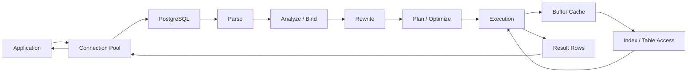
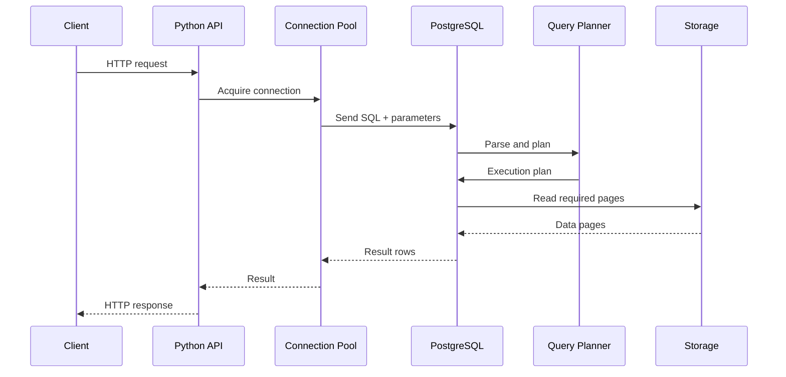
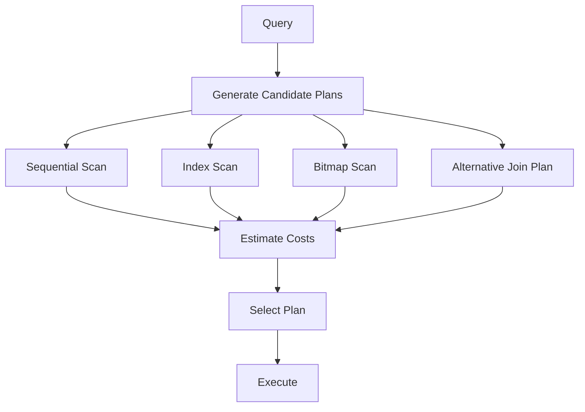
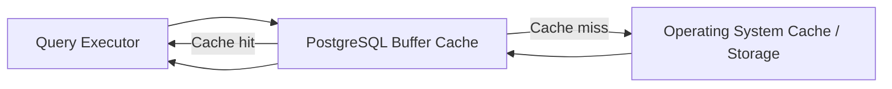
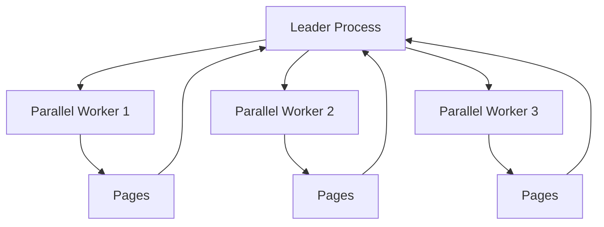

# 01- SQL Query Execution Lifecycle

## Overview

SQL query execution is the process through which a database transforms a SQL statement into a result set. A production backend engineer should understand more than SQL syntax: query execution involves parsing, semantic analysis, rewriting, planning, optimization, execution, storage access, and result delivery.

The exact implementation differs between database engines, but the general lifecycle is similar:

```text
SQL statement
    ↓
Parse
    ↓
Analyze / Bind
    ↓
Rewrite
    ↓
Plan / Optimize
    ↓
Execute
    ↓
Access storage / indexes / buffers
    ↓
Produce rows
    ↓
Return result to application
```

Understanding this lifecycle is essential for diagnosing slow APIs, inefficient ORM queries, excessive database CPU, unexpected sequential scans, poor join strategies, lock contention, and high database I/O.

This document uses PostgreSQL terminology for concrete examples while focusing on concepts that generalize across relational databases.

## End-to-End Lifecycle



At a high level:

| Phase | Responsibility |
|---|---|
| Parse | Convert SQL text into an internal representation |
| Analyze / Bind | Resolve tables, columns, functions, operators, and types |
| Rewrite | Apply rules and expand constructs such as views |
| Plan / Optimize | Select an efficient execution strategy |
| Execute | Run the selected plan |
| Storage access | Read indexes, heap/table pages, buffers, and other structures |
| Result delivery | Send rows through the database connection to the application |

Not every database exposes these phases identically, and some work may be combined or cached.

## Application to Database Flow

A typical FastAPI or Django request looks like:



The SQL statement is therefore only one part of the total latency.

For an API request:

```text
Total latency
=
application processing
+ connection acquisition
+ query planning
+ query execution
+ network transfer
+ serialization
```

A database query can be fast while the endpoint remains slow because of connection-pool waits, application processing, serialization, or network latency.

## Parse Phase

### What It Is

Parsing converts SQL text into a syntactic representation that the database can process.

For example:

```sql
SELECT id, email
FROM users
WHERE tenant_id = $1
  AND status = $2;
```

The database must recognize:

- `SELECT`
- Selected columns
- `FROM`
- Table name
- `WHERE`
- Boolean expressions
- Parameter placeholders
- Operators

### Why It Exists

The database cannot optimize raw text directly. It needs an internal representation of the SQL statement.

Conceptually:

```text
SQL text
   ↓
Tokens
   ↓
Syntax tree
   ↓
Internal query representation
```

### Production Considerations

Parsing is normally inexpensive compared with expensive query execution, but high query rates can make planning and parsing overhead significant.

Connection pooling and prepared statements can reduce repeated overhead depending on the database, driver, workload, and statement characteristics.

## Analyze and Bind Phase

After parsing, the database resolves references in the statement.

For:

```sql
SELECT u.id
FROM users AS u
WHERE u.tenant_id = $1;
```

PostgreSQL must determine:

- Does `users` exist?
- Does `users.id` exist?
- Does `users.tenant_id` exist?
- What are their data types?
- What does the operator mean for those types?
- Is the referenced function/operator valid?
- Does the executing role have required privileges?

This phase turns syntactically valid SQL into a semantically meaningful query.

A query can therefore be syntactically correct but fail during analysis:

```sql
SELECT nonexistent_column
FROM users;
```

## Rewrite Phase

The rewrite stage transforms the analyzed query according to database rules.

This is particularly important for database objects such as views.

For example:

```sql
CREATE VIEW active_users AS
SELECT id, email
FROM users
WHERE status = 'active';
```

A query against the view:

```sql
SELECT *
FROM active_users
WHERE tenant_id = 42;
```

can be internally transformed into a query involving the underlying table and view definition.

The rewrite phase can therefore be thought of as:

```text
Submitted query
      ↓
Rewrite rules
      ↓
Expanded internal query
      ↓
Planner
```

Not every SQL statement requires meaningful rewriting.

## Planning and Optimization

The planner is one of the most important stages for query performance.

The database evaluates possible execution strategies and chooses one based on estimated cost.

For example:

```sql
SELECT id, total
FROM orders
WHERE customer_id = 42
ORDER BY created_at DESC
LIMIT 50;
```

Possible strategies might include:

- Sequential scan.
- Index scan.
- Bitmap index scan.
- Different index combinations.
- Explicit sort.
- Join strategies if joins are present.
- Different join orders.
- Parallel execution where applicable.

The planner does not generally search every theoretically possible plan. Optimizers use cost models and planning strategies to find a sufficiently good plan within practical planning time.

## Cost-Based Optimization

PostgreSQL estimates the cost of candidate plans using information such as:

- Table statistics.
- Estimated row counts.
- Column distributions.
- Selectivity.
- Available indexes.
- Join conditions.
- Operator costs.
- CPU cost.
- I/O cost.
- Configuration settings.
- Parallel execution capabilities.

The planner then selects the plan with the lowest estimated cost among the considered alternatives.

Conceptually:



## Why Estimated Cost Is Not Execution Time

A common interview mistake is assuming that:

```text
cost = milliseconds
```

This is incorrect.

PostgreSQL's cost values are planner cost units used to compare plans. They are not direct measurements of elapsed time.

For actual execution time, use:

```sql
EXPLAIN (ANALYZE, BUFFERS)
SELECT *
FROM orders
WHERE customer_id = 42;
```

## Query Statistics Matter

The optimizer depends heavily on statistics.

For example, suppose PostgreSQL estimates:

```text
Expected rows: 100
Actual rows:   500,000
```

That estimation error can cause a poor plan choice.

The problem may not be a missing index. It may instead involve:

- Stale statistics.
- Data skew.
- Correlated columns.
- Incorrect assumptions about data distribution.
- Insufficient statistics detail for a difficult distribution.

Statistics can be refreshed with:

```sql
ANALYZE orders;
```

For production troubleshooting, compare estimated and actual cardinalities throughout the plan rather than looking only at the final execution time.

## Execution Plan

An execution plan is a tree of operations that describes how the database intends to execute a query.

Example:

```sql
EXPLAIN
SELECT id, total
FROM orders
WHERE customer_id = 42;
```

A simplified conceptual plan might look like:

```text
Index Scan
    ↓
orders_customer_id_idx
    ↓
Matching table rows
```

For a query without a useful selective index:

```text
Seq Scan
    ↓
orders
    ↓
Filter customer_id = 42
```

The execution plan is one of the most important tools for SQL performance analysis.

## EXPLAIN vs EXPLAIN ANALYZE

| Command | Executes query? | Main purpose |
|---|---:|---|
| `EXPLAIN` | No | Inspect estimated plan |
| `EXPLAIN ANALYZE` | Yes | Measure actual execution |
| `EXPLAIN (ANALYZE, BUFFERS)` | Yes | Measure execution and buffer activity |

Use:

```sql
EXPLAIN (ANALYZE, BUFFERS)
SELECT id, total
FROM orders
WHERE customer_id = 42;
```

Be careful with `EXPLAIN ANALYZE` on write statements because it executes the statement.

For production diagnostics, understand whether the command will modify data before running it.

## Execution Phase

Once the planner produces a plan, the executor runs it.

The execution engine processes plan nodes such as:

- Sequential scans.
- Index scans.
- Bitmap scans.
- Sorts.
- Aggregates.
- Hash operations.
- Nested-loop joins.
- Hash joins.
- Merge joins.
- Filters.
- Limits.
- Parallel workers.

A plan is generally a tree:

```text
                Aggregate
                    │
                 Hash Join
                /         \
          Seq Scan       Hash
                            │
                         Index Scan
```

Execution proceeds through these nodes according to their relationships.

## Scan Operations

### Sequential Scan

A sequential scan reads table pages and evaluates the predicate against rows.

```text
Table
 ├── Page 1 → evaluate rows
 ├── Page 2 → evaluate rows
 ├── Page 3 → evaluate rows
 └── Page N → evaluate rows
```

Sequential scans are not inherently bad.

For a query returning a large percentage of a table, reading the table sequentially may be cheaper than performing many random index lookups.

### Index Scan

An index scan uses an index to locate candidate rows.

```text
Query predicate
      ↓
Index
      ↓
Matching row locations
      ↓
Table pages
      ↓
Rows
```

An index scan is often useful for selective lookups, but the planner decides whether it is cheaper than alternatives.

### Bitmap Scan

Bitmap access can be useful when many rows match but an index can still narrow the candidate pages.

Conceptually:

```text
Index
  ↓
Matching row/page locations
  ↓
Bitmap
  ↓
Heap pages
  ↓
Rows
```

Bitmap scans are particularly useful for some moderately selective predicates and combinations of indexes.

## Filtering

A database may access rows or pages and then apply additional filtering.

For example:

```sql
SELECT *
FROM orders
WHERE customer_id = 42
  AND status = 'completed';
```

An index may identify rows using `customer_id`, after which `status` is evaluated.

The important question is not simply:

> Is there an index on `customer_id`?

It is:

> How many rows does the access path produce, and how much additional work is required to reach the final result?

## Sorting

Queries involving:

```sql
ORDER BY created_at DESC
```

may require an explicit sort.

For example:

```text
Scan
 ↓
Rows
 ↓
Sort
 ↓
Limit
```

An appropriately designed index can sometimes provide rows in the required order, potentially avoiding an explicit sort.

For example:

```sql
CREATE INDEX idx_orders_customer_created
ON orders (customer_id, created_at DESC);
```

This may be useful for:

```sql
SELECT id, total
FROM orders
WHERE customer_id = 42
ORDER BY created_at DESC
LIMIT 50;
```

Whether the index is actually used depends on the complete workload and planner estimates.

## Join Execution

For joins, the planner chooses a join strategy.

Common PostgreSQL strategies include:

| Join strategy | Typical characteristics |
|---|---|
| Nested Loop | Useful when one side is small and the other side can be efficiently probed |
| Hash Join | Useful for many equality joins |
| Merge Join | Useful when inputs can be efficiently produced in compatible sorted order |

Example:

```sql
SELECT o.id, c.email
FROM orders AS o
JOIN customers AS c
  ON c.id = o.customer_id
WHERE o.status = 'pending';
```

The planner evaluates:

- Which table should be accessed first.
- Join order.
- Available indexes.
- Estimated cardinality.
- Join algorithm.
- Whether parallelism is useful.

This is why adding an index to a join column does not automatically guarantee a faster join.

## Aggregation

Queries such as:

```sql
SELECT customer_id, COUNT(*)
FROM orders
GROUP BY customer_id;
```

require aggregation.

The planner may choose different strategies depending on cardinality, memory, ordering, and cost estimates.

Typical conceptual paths include:

```text
Scan
 ↓
Hash Aggregate
 ↓
Result
```

or:

```text
Ordered Input
 ↓
Group Aggregate
 ↓
Result
```

The correct plan depends on the data and workload.

## LIMIT and Early Termination

`LIMIT` can significantly affect plan selection.

Consider:

```sql
SELECT id
FROM orders
WHERE customer_id = 42
ORDER BY created_at DESC
LIMIT 20;
```

An index compatible with the predicate and ordering can allow the executor to find the first 20 rows without processing the entire matching set.

This is one reason pagination and "latest N records" workloads often benefit from carefully designed indexes.

## Buffer Cache and Storage

Query execution does not always require physical disk reads.

PostgreSQL commonly reads database pages through its buffer management system and the operating system's caching layers.

Conceptually:



This means the same query can have different latency characteristics depending on cache state.

`EXPLAIN (ANALYZE, BUFFERS)` helps expose buffer activity.

Typical information includes:

- Shared hits.
- Shared reads.
- Shared dirtied pages.
- Shared written pages.

A high number of cache hits is not automatically proof that a query is efficient. The number of pages touched and total execution time still matter.

## Index Access and Table Access

A common misconception is:

> Using an index means the database reads only the index.

In many cases, the database must use the index to locate table rows and then access the corresponding table pages.

Conceptually:

```text
Index
  ↓
Tuple location
  ↓
Heap / table page
  ↓
Row
```

A query can therefore have an index scan but still perform substantial table I/O.

Covering indexes and index-only scans can reduce table access in suitable workloads, but visibility and storage conditions affect whether PostgreSQL can actually avoid heap access.

## Parameterized Queries

Backend applications should use parameterized SQL.

Python example:

```python
cursor.execute(
    """
    SELECT id, email
    FROM users
    WHERE tenant_id = %s
      AND status = %s
    """,
    (tenant_id, status),
)
```

This provides:

- SQL injection protection.
- Correct parameter handling.
- Better separation between query structure and values.

Never construct SQL using string interpolation for untrusted values:

```python
# Unsafe
query = f"SELECT * FROM users WHERE email = '{email}'"
```

Security and query performance are separate concerns, but both are part of production query execution.

## Prepared Statements and Plan Reuse

Prepared statements can separate statement preparation from repeated execution.

Conceptually:

```text
Prepare SQL
    ↓
Parse / Analyze / Plan
    ↓
Prepared statement
    ↓
Execute with parameter values
    ↓
Execute again
    ↓
Execute again
```

The exact behavior depends on the PostgreSQL driver and server-side prepared-statement configuration.

Prepared execution can reduce repeated planning overhead, but plan reuse introduces an important trade-off: a single plan may not be optimal for every parameter value when data distribution is highly skewed.

Senior engineers should therefore understand the difference between:

- Parse overhead.
- Planning overhead.
- Execution overhead.
- Generic plans.
- Custom plans.

## Query Planning vs Query Execution

These are separate performance dimensions.

```text
Query latency
├── Parse
├── Analysis
├── Rewrite
├── Planning
└── Execution
```

For most expensive queries, execution dominates.

However, extremely high query rates involving many short queries can make planning overhead significant.

This distinction matters when diagnosing workloads with:

- Very high QPS.
- Very short queries.
- Dynamic SQL.
- Large or complex statements.
- Repeated prepared statements.

## ORM Query Execution

Django and other ORMs do not eliminate SQL execution concerns.

For example:

```python
orders = (
    Order.objects
    .filter(customer_id=42)
    .order_by("-created_at")[:50]
)
```

The ORM eventually generates SQL and sends it to PostgreSQL.

A backend engineer should be able to move between:

```text
ORM code
    ↓
Generated SQL
    ↓
Execution plan
    ↓
Database behavior
    ↓
API latency
```

Useful Django techniques include:

```python
print(queryset.query)
```

and:

```python
queryset.explain(analyze=True, buffers=True)
```

For expensive endpoints, inspect the actual generated SQL and execution plan rather than optimizing ORM code in isolation.

## N+1 Query Problem

Query execution lifecycle knowledge is especially useful for identifying N+1 problems.

Example:

```python
orders = Order.objects.all()

for order in orders:
    print(order.customer.email)
```

Depending on the ORM configuration, this can result in:

```text
1 query → fetch orders
N queries → fetch each customer
```

Instead, relationship loading can often be optimized:

```python
orders = (
    Order.objects
    .select_related("customer")
    .all()
)
```

The resulting SQL and plan should still be inspected because reducing query count does not automatically guarantee the optimal workload.

## Query Execution and Transactions

Queries execute within transaction semantics.

A request may perform:

```text
BEGIN
  ↓
SELECT
  ↓
UPDATE
  ↓
INSERT
  ↓
COMMIT
```

Locks, isolation level, row visibility, and concurrent transactions can affect observed performance.

A fast SQL statement can still experience high latency because it is waiting on:

- Locks.
- Connection availability.
- I/O.
- Transaction conflicts.
- Resource contention.

Therefore:

```text
Query execution time
≠
Always the same as application-observed query latency
```

## Concurrency and Locking

Concurrent transactions can influence execution behavior.

For example:

```sql
UPDATE accounts
SET balance = balance - 100
WHERE id = 42;
```

The statement may spend time waiting for another transaction holding a conflicting lock.

Production diagnostics should therefore distinguish between:

- CPU-bound queries.
- I/O-bound queries.
- Lock-waiting queries.
- Connection-pool waiting.
- Network delays.
- Application-side delays.

## Parallel Query Execution

PostgreSQL can use parallel execution for suitable queries.

Conceptually:



Parallelism can improve large analytical operations, but it is not universally beneficial.

Potential costs include:

- Worker startup.
- CPU contention.
- Memory consumption.
- Scheduling overhead.
- Increased resource pressure.

A small OLTP query should not be expected to benefit from parallel execution.

## Result Materialization and Transfer

After execution produces rows, PostgreSQL sends the results through the connection to the application.

For example:

```text
Database
  ↓
Result tuples
  ↓
Database protocol
  ↓
Driver
  ↓
Python objects
  ↓
Application serialization
  ↓
HTTP response
```

Returning unnecessary columns or rows can increase:

- Database work.
- Network traffic.
- Driver processing.
- Python memory usage.
- JSON serialization time.
- API response size.

Prefer selecting only required data:

```sql
SELECT id, email
FROM users
WHERE tenant_id = $1;
```

instead of:

```sql
SELECT *
FROM users
WHERE tenant_id = $1;
```

when the application needs only a subset of columns.

## Pagination and Query Execution

Offset pagination:

```sql
SELECT id, created_at
FROM orders
ORDER BY created_at DESC
LIMIT 50 OFFSET 100000;
```

can require the database to process and discard a large number of rows before returning the requested page.

Keyset pagination can avoid much of this work:

```sql
SELECT id, created_at
FROM orders
WHERE created_at < $1
ORDER BY created_at DESC
LIMIT 50;
```

In production APIs with large datasets, keyset pagination is often preferable when the product semantics permit it.

## Monitoring Query Execution

A production monitoring strategy should combine database and application metrics.

| Metric | What it helps identify |
|---|---|
| Query latency | Slow SQL |
| Query frequency | High-impact repeated queries |
| Rows returned | Result volume |
| Buffer hits/reads | Memory and I/O behavior |
| CPU | Compute pressure |
| Disk I/O | Storage pressure |
| Lock waits | Concurrency contention |
| Connections | Pool/database pressure |
| Temporary files | Memory pressure and spills |
| Replication lag | Primary workload impact |
| API latency | End-to-end user impact |

PostgreSQL statistics can be inspected through facilities such as `pg_stat_statements` when enabled.

A useful operational workflow is:

```text
Find expensive query
      ↓
Measure frequency × latency
      ↓
Inspect SQL
      ↓
Inspect EXPLAIN ANALYZE
      ↓
Compare estimated vs actual rows
      ↓
Inspect buffers / I/O
      ↓
Identify bottleneck
      ↓
Change query / index / schema / architecture
      ↓
Measure again
```

## Common Performance Bottlenecks

| Bottleneck | Typical symptoms | Possible direction |
|---|---|---|
| Missing index | Large scans for selective predicates | Evaluate index |
| Wrong index | Index exists but plan remains expensive | Revisit query/index shape |
| Poor statistics | Large estimate/actual row mismatch | Refresh or improve statistics |
| N+1 queries | Many repeated small queries | Optimize ORM relationship loading |
| Large sort | High sort cost or disk spill | Review ordering/index strategy |
| Large result set | High transfer and serialization time | Select fewer rows/columns |
| Lock contention | Query waits despite low CPU | Investigate concurrent transactions |
| Connection saturation | Requests wait for connections | Tune pool and database capacity |
| Offset pagination | Deep pages become increasingly slow | Consider keyset pagination |
| Excessive writes | High WAL/I/O and write latency | Review indexes and workload |
| CPU saturation | High database CPU | Optimize plans or scale capacity |
| I/O saturation | High physical reads | Improve access paths/cache/storage |

## Production Troubleshooting Method

When a query is slow, avoid immediately adding an index.

Use a structured process:

### Identify the Exact SQL

Capture the actual statement generated by the application.

ORM code alone is insufficient.

### Measure Frequency

A query that takes 500 ms once per hour may be less important than a query taking 20 ms thousands of times per second.

A useful prioritization model is:

```text
Impact ≈ frequency × latency × resource cost
```

This is not a database formula, but it is a useful engineering prioritization heuristic.

### Inspect the Execution Plan

Use:

```sql
EXPLAIN (ANALYZE, BUFFERS)
SELECT ...
```

Inspect:

- Scan type.
- Join strategy.
- Estimated vs actual rows.
- Sorts.
- Aggregation.
- Buffer activity.
- Execution time.

### Identify the Actual Bottleneck

Ask:

```text
Is it:
- Planning?
- CPU?
- I/O?
- Sorting?
- Joining?
- Lock waiting?
- Too many rows?
- Too many queries?
- Connection contention?
```

Only then select an optimization.

## Common Mistakes

### Assuming Sequential Scan Means Bad Query

Sequential scans are often correct when a query needs a large percentage of the table.

### Assuming Index Scan Is Always Faster

An index can be expensive when it causes many random table accesses.

### Looking Only at Estimated Plans

`EXPLAIN` provides estimates. For runtime behavior, validate with `EXPLAIN ANALYZE` against representative data.

### Ignoring Estimated vs Actual Rows

Large cardinality estimation errors can lead to poor join and scan choices.

### Optimizing ORM Code Without Inspecting SQL

An elegant ORM expression can generate inefficient SQL.

### Returning Too Much Data

Fetching thousands of rows when an endpoint needs only a few wastes database, network, and application resources.

### Confusing Database Latency With API Latency

Connection pools, Python processing, serialization, network transfer, and other components can dominate total response time.

### Adding Indexes Without Measuring

Every index introduces storage and write-maintenance cost.

### Running `EXPLAIN ANALYZE` Carelessly

`EXPLAIN ANALYZE` executes the query. Be especially careful with `INSERT`, `UPDATE`, and `DELETE`.

## Interview Traps

| Question | Correct reasoning |
|---|---|
| Is a sequential scan always bad? | No. It can be optimal for large result sets. |
| Does an index guarantee faster queries? | No. The planner chooses based on estimated cost. |
| Does `EXPLAIN` execute the query? | Normally no; `EXPLAIN ANALYZE` does. |
| Is planner cost measured in milliseconds? | No. It is an internal relative cost unit. |
| Does an index scan mean no table reads? | No. Many index scans still require heap/table access. |
| Why can an index exist but not be used? | The planner may estimate another path as cheaper. |
| Why can a query become slow as data grows? | Cardinality, I/O, statistics, sorting, joins, and access paths can change. |
| Why can an API be slow if SQL is fast? | Connection, application processing, serialization, or network latency may dominate. |
| Is fewer SQL queries always better? | Not automatically; query complexity and amount of data transferred also matter. |
| Why can the same prepared query behave differently with parameters? | Data distribution can make different plans optimal for different values. |

## Production Best Practices

- Inspect actual SQL generated by application frameworks.
- Use `EXPLAIN (ANALYZE, BUFFERS)` for measured execution analysis.
- Compare estimated and actual cardinalities.
- Evaluate query frequency in addition to individual latency.
- Design indexes around actual workload patterns.
- Select only required columns and rows.
- Prefer keyset pagination for large ordered datasets where appropriate.
- Avoid N+1 query patterns.
- Monitor connection-pool utilization.
- Monitor lock waits and replication lag.
- Keep database statistics current.
- Test query changes using production-like data volumes and distributions.
- Validate optimizations using application-level latency, not only database-level execution time.
- Treat query tuning as an iterative measure → change → measure process.

## Key Takeaways

- **SQL execution is a lifecycle: parse, analyze, rewrite, plan, execute, access data, and return results.**
- **The query planner chooses an execution strategy using statistics and cost estimates; an existing index does not guarantee that it will be used.**
- **`EXPLAIN (ANALYZE, BUFFERS)` is a primary tool for understanding actual execution behavior, especially scan types, cardinality errors, and I/O.**
- **Production query performance depends on the entire request path, including connection pooling, locks, database resources, network transfer, and application-side processing.**
- **Optimize from measured workload evidence: identify the bottleneck first, make the smallest appropriate change, and validate the result under realistic production conditions.**