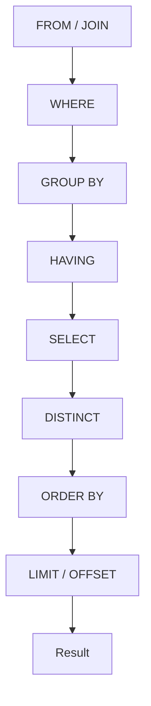

# 02- Logical Query Processing Order

## Overview

SQL is written in a syntax that is convenient for humans, but SQL clauses are **logically processed in a different order** from the order in which they appear in the statement.

For a typical query:

```sql
SELECT customer_id, COUNT(*) AS order_count
FROM orders
WHERE status = 'completed'
GROUP BY customer_id
HAVING COUNT(*) >= 10
ORDER BY order_count DESC
LIMIT 20;
```

the logical processing order is approximately:

```text
FROM
  ↓
WHERE
  ↓
GROUP BY
  ↓
HAVING
  ↓
SELECT
  ↓
DISTINCT
  ↓
ORDER BY
  ↓
LIMIT / OFFSET
```

This distinction explains several important SQL behaviors:

- Why a `SELECT` alias usually cannot be referenced in `WHERE`.
- Why `HAVING` can use aggregate expressions.
- Why `WHERE` is normally applied before aggregation.
- Why `ORDER BY` can often reference a `SELECT` alias.
- Why `LIMIT` does not reduce the work required by earlier logical stages.
- Why a query's logical order differs from its physical execution plan.

The logical query processing order is a **reasoning model**, not a statement that the database physically executes every clause in exactly this sequence. A cost-based optimizer can transform the physical execution strategy while preserving the query's required semantics.

## Logical Order vs Written Order

A SQL statement is usually written as:

```sql
SELECT ...
FROM ...
WHERE ...
GROUP BY ...
HAVING ...
ORDER BY ...
LIMIT ...;
```

The logical model is:

```text
FROM
WHERE
GROUP BY
HAVING
SELECT
DISTINCT
ORDER BY
LIMIT
```

This creates an important distinction:

| Concept | Meaning |
|---|---|
| Written order | Syntax developers use to express a SQL statement |
| Logical order | Conceptual sequence used to determine query semantics |
| Physical execution order | Actual operations selected by the database optimizer |

The physical execution plan may look very different from the logical order.

For example, PostgreSQL may push predicates closer to table access, choose an index scan, reorder joins, or perform other transformations.

## The Complete Logical Processing Model



The exact logical phases vary somewhat across SQL features and database implementations, but this model is sufficient for reasoning about most production queries.

## FROM

### What It Does

`FROM` establishes the initial row set.

For a simple query:

```sql
SELECT *
FROM orders;
```

the logical input is the `orders` relation.

For multiple tables:

```sql
SELECT o.id, c.email
FROM orders AS o
JOIN customers AS c
  ON c.id = o.customer_id;
```

the `FROM` phase includes the join operation.

Conceptually:

```text
FROM
 ↓
tables
 ↓
joins
 ↓
combined row source
```

### Why It Matters

Every subsequent logical phase operates on the row source produced by `FROM`.

If the `FROM` clause produces one million joined rows, later stages may need to process those rows unless the optimizer can safely reduce the work.

### JOIN and FROM

Joins are logically part of forming the `FROM` result.

For example:

```sql
FROM orders AS o
JOIN customers AS c
  ON c.id = o.customer_id
```

produces a combined row source containing columns from both relations.

For outer joins, the join semantics are especially important because unmatched rows may be preserved with `NULL` values.

### Production Considerations

Join cardinality is one of the most important factors in query performance.

A join can multiply rows:

```text
customers
    1
    │
    └──────< orders
```

One customer may have thousands of orders. Joining additional one-to-many relationships can produce unexpectedly large intermediate results.

Always reason about:

- Join keys.
- Cardinality.
- Relationship direction.
- Duplicate rows.
- Outer join semantics.
- Required indexes.
- Estimated vs actual row counts.

## WHERE

### What It Does

`WHERE` filters individual rows from the `FROM` result.

Example:

```sql
SELECT id, customer_id, total
FROM orders
WHERE status = 'completed';
```

Conceptually:

```text
FROM orders
      ↓
All candidate rows
      ↓
WHERE status = 'completed'
      ↓
Filtered rows
```

### Why It Matters

Filtering early reduces the logical row set available to subsequent operations such as grouping and joining.

For example:

```sql
SELECT customer_id, COUNT(*)
FROM orders
WHERE status = 'completed'
GROUP BY customer_id;
```

The grouping logically operates only on completed orders.

### SELECT Alias Is Not Available in WHERE

Consider:

```sql
SELECT
    total * 1.18 AS total_with_tax
FROM orders
WHERE total_with_tax > 100;
```

This normally fails because `WHERE` is logically processed before `SELECT`.

At the point `WHERE` is evaluated, `total_with_tax` has not yet been created as a `SELECT` output alias.

Instead:

```sql
SELECT
    total * 1.18 AS total_with_tax
FROM orders
WHERE total * 1.18 > 100;
```

Or use a subquery when the derived value should be reused:

```sql
SELECT total_with_tax
FROM (
    SELECT total * 1.18 AS total_with_tax
    FROM orders
) AS q
WHERE total_with_tax > 100;
```

### NULL and WHERE

SQL uses three-valued logic:

```text
TRUE
FALSE
UNKNOWN
```

Rows are retained by `WHERE` only when the predicate evaluates to `TRUE`.

For example:

```sql
WHERE deleted_at = NULL
```

does not correctly find `NULL` values.

Use:

```sql
WHERE deleted_at IS NULL
```

This is a semantic issue caused by SQL's treatment of `NULL`, not simply a syntax preference.

## GROUP BY

### What It Does

`GROUP BY` transforms the filtered row set into groups.

Example:

```sql
SELECT customer_id, COUNT(*)
FROM orders
WHERE status = 'completed'
GROUP BY customer_id;
```

Conceptually:

```text
FROM
 ↓
WHERE
 ↓
Filtered orders
 ↓
GROUP BY customer_id
 ↓
One logical group per customer
```

### Why It Exists

Aggregation functions such as:

- `COUNT`
- `SUM`
- `AVG`
- `MIN`
- `MAX`

operate across groups of rows.

For example:

```sql
SELECT
    customer_id,
    SUM(total) AS revenue
FROM orders
GROUP BY customer_id;
```

produces one result row per `customer_id`.

### GROUP BY and SELECT

A selected expression generally must either:

- Be included in the grouping criteria, or
- Be derived through an aggregate expression,

subject to database-specific rules and functional-dependency handling.

For example:

```sql
SELECT customer_id, status, COUNT(*)
FROM orders
GROUP BY customer_id;
```

is not generally valid because `status` can have multiple values within a customer group.

A correct query might be:

```sql
SELECT customer_id, status, COUNT(*)
FROM orders
GROUP BY customer_id, status;
```

## HAVING

### What It Does

`HAVING` filters groups after grouping and aggregation.

Example:

```sql
SELECT
    customer_id,
    COUNT(*) AS order_count
FROM orders
GROUP BY customer_id
HAVING COUNT(*) >= 10;
```

Conceptually:

```text
FROM
 ↓
WHERE
 ↓
GROUP BY
 ↓
Aggregate groups
 ↓
HAVING
 ↓
Qualified groups
```

### WHERE vs HAVING

| Requirement | Prefer |
|---|---|
| Filter individual rows before aggregation | `WHERE` |
| Filter aggregated groups | `HAVING` |
| Filter using `COUNT`, `SUM`, `AVG`, etc. | `HAVING` |
| Reduce input before expensive grouping | `WHERE` |

Example:

```sql
SELECT
    customer_id,
    COUNT(*) AS completed_orders
FROM orders
WHERE status = 'completed'
GROUP BY customer_id
HAVING COUNT(*) >= 10;
```

Here:

- `WHERE` removes non-completed orders.
- `GROUP BY` creates customer groups.
- `COUNT(*)` counts completed orders per customer.
- `HAVING` keeps customers with at least 10 completed orders.

### Avoid Using HAVING for Row Filtering

This:

```sql
SELECT customer_id, COUNT(*)
FROM orders
GROUP BY customer_id
HAVING customer_id = 42;
```

may be semantically valid, but a row-level predicate is generally clearer as:

```sql
SELECT customer_id, COUNT(*)
FROM orders
WHERE customer_id = 42
GROUP BY customer_id;
```

The second form expresses the intended filtering stage more directly and can give the optimizer a better opportunity to reduce work.

## SELECT

### What It Does

`SELECT` determines the output expressions.

Example:

```sql
SELECT
    customer_id,
    total * 1.18 AS total_with_tax
FROM orders;
```

The expressions in the `SELECT` list produce the columns returned to the client.

### Why SELECT Appears Later Than WHERE

This explains a fundamental SQL behavior:

```sql
SELECT total * 1.18 AS total_with_tax
FROM orders
WHERE total_with_tax > 100;
```

The alias is logically introduced during `SELECT`, while `WHERE` is evaluated earlier.

This is one of the most common logical-order interview questions.

### SELECT Expressions

A `SELECT` expression can contain:

- Column references.
- Arithmetic.
- Functions.
- Conditional expressions.
- Aggregate expressions.
- Window functions, subject to their own processing semantics.
- Scalar subqueries.

Example:

```sql
SELECT
    id,
    quantity * unit_price AS line_total,
    CASE
        WHEN status = 'completed' THEN 'closed'
        ELSE 'open'
    END AS lifecycle_state
FROM order_items;
```

## DISTINCT

### What It Does

`DISTINCT` removes duplicate result rows.

Example:

```sql
SELECT DISTINCT customer_id
FROM orders;
```

Conceptually:

```text
FROM
 ↓
WHERE
 ↓
SELECT
 ↓
DISTINCT
 ↓
Unique result rows
```

### Performance Considerations

Deduplication can require additional database work.

Depending on the query and optimizer, PostgreSQL may use mechanisms such as:

- Sort-based deduplication.
- Hash-based aggregation.
- Other plan-specific strategies.

For a large result set:

```sql
SELECT DISTINCT customer_id
FROM orders;
```

the database may need to process a substantial amount of data even though only one column is returned.

Do not use `DISTINCT` simply to hide duplicate rows created by an incorrect join.

First determine why duplicates exist.

## ORDER BY

### What It Does

`ORDER BY` determines the ordering of the result.

Example:

```sql
SELECT
    id,
    total
FROM orders
ORDER BY total DESC;
```

### SELECT Alias and ORDER BY

Unlike `WHERE`, `ORDER BY` can generally reference a `SELECT` alias:

```sql
SELECT
    total * 1.18 AS total_with_tax
FROM orders
ORDER BY total_with_tax DESC;
```

This works because ordering is logically performed after the `SELECT` result has been formed.

### Production Considerations

Sorting can be expensive for large result sets.

An index may sometimes allow the database to produce rows in the required order without an explicit sort.

For example:

```sql
CREATE INDEX idx_orders_customer_created
ON orders (customer_id, created_at DESC);
```

can be useful for:

```sql
SELECT id, created_at
FROM orders
WHERE customer_id = 42
ORDER BY created_at DESC
LIMIT 50;
```

The actual plan should always be validated with `EXPLAIN`.

## LIMIT and OFFSET

### What It Does

`LIMIT` restricts the number of rows returned.

```sql
SELECT id, email
FROM users
ORDER BY created_at DESC
LIMIT 50;
```

`OFFSET` skips rows:

```sql
SELECT id, email
FROM users
ORDER BY created_at DESC
LIMIT 50 OFFSET 1000;
```

### Important Performance Distinction

Logical processing places `LIMIT` after ordering.

Therefore:

```sql
ORDER BY created_at DESC
LIMIT 50
```

conceptually means:

```text
Produce ordered result
       ↓
Take first 50 rows
```

The physical optimizer can often avoid sorting or scanning unnecessary rows when an appropriate index exists.

Without such an optimization, a large `OFFSET` can still require substantial work.

### Keyset Pagination

For large datasets, keyset pagination can provide a better access pattern:

```sql
SELECT id, created_at
FROM orders
WHERE created_at < $1
ORDER BY created_at DESC
LIMIT 50;
```

A stable ordering key should normally be unique or combined with a unique tie-breaker.

For example:

```sql
SELECT id, created_at
FROM orders
WHERE (created_at, id) < ($1, $2)
ORDER BY created_at DESC, id DESC
LIMIT 50;
```

with a compatible index:

```sql
CREATE INDEX idx_orders_created_id
ON orders (created_at DESC, id DESC);
```

## A Complete Example

Consider:

```sql
SELECT
    customer_id,
    COUNT(*) AS completed_orders,
    SUM(total) AS revenue
FROM orders
WHERE status = 'completed'
  AND created_at >= DATE '2026-01-01'
GROUP BY customer_id
HAVING SUM(total) >= 10000
ORDER BY revenue DESC
LIMIT 20;
```

The logical reasoning is:

```text
FROM orders
      ↓
WHERE status = 'completed'
      ↓
WHERE created_at >= 2026-01-01
      ↓
GROUP BY customer_id
      ↓
COUNT / SUM per customer
      ↓
HAVING SUM(total) >= 10000
      ↓
SELECT customer_id, COUNT(*), SUM(total)
      ↓
ORDER BY revenue DESC
      ↓
LIMIT 20
```

The important point is that the `LIMIT` applies to the final ordered result, not to the original `orders` table.

## Logical Order and Query Optimization

The logical model should not be confused with the physical execution plan.

Suppose the query contains:

```sql
SELECT
    customer_id,
    COUNT(*)
FROM orders
WHERE status = 'completed'
GROUP BY customer_id;
```

The logical model says:

```text
FROM → WHERE → GROUP BY → SELECT
```

The physical plan might instead contain:

```text
Index Scan
    ↓
Filtered rows
    ↓
HashAggregate
    ↓
Result
```

or:

```text
Seq Scan
    ↓
Filter
    ↓
Sort
    ↓
GroupAggregate
    ↓
Result
```

The optimizer is free to change physical operations as long as the resulting behavior remains semantically correct.

## Predicate Pushdown

One important optimization is predicate pushdown.

Consider:

```sql
SELECT *
FROM (
    SELECT *
    FROM orders
) AS o
WHERE o.status = 'completed';
```

The logical semantics can be represented as filtering the outer result, but the optimizer may push the predicate toward the underlying table.

Conceptually:

```text
Logical:
Subquery
  ↓
WHERE

Optimized physical strategy:
Table scan
  ↓
Filter status
  ↓
Remaining operations
```

This can significantly reduce the amount of data processed by later operators.

Predicate pushdown is one reason you should not infer physical execution directly from SQL clause order.

## Join Reordering

Consider:

```sql
SELECT ...
FROM orders o
JOIN customers c ON c.id = o.customer_id
JOIN regions r ON r.id = c.region_id
WHERE r.country = 'IN';
```

The SQL text presents the tables in a particular order, but the optimizer may choose another physical join order.

A potentially useful strategy could be to filter regions first, depending on cardinality and statistics:

```text
regions
  ↓
country = 'IN'
  ↓
customers
  ↓
orders
```

The exact strategy depends on the optimizer's cost estimates.

## Window Functions

Window functions require additional care because they do not behave like ordinary aggregation.

Example:

```sql
SELECT
    customer_id,
    order_id,
    total,
    ROW_NUMBER() OVER (
        PARTITION BY customer_id
        ORDER BY created_at DESC
    ) AS order_rank
FROM orders;
```

Window functions operate over the rows available after the relevant filtering/grouping stages but before the final result ordering and limiting semantics.

A common practical pattern is to use a subquery when filtering on a window-function result:

```sql
SELECT *
FROM (
    SELECT
        customer_id,
        order_id,
        total,
        ROW_NUMBER() OVER (
            PARTITION BY customer_id
            ORDER BY created_at DESC
        ) AS order_rank
    FROM orders
) AS ranked
WHERE order_rank <= 3;
```

This works because the outer query can filter the result produced by the inner query.

## Why Query Structure Matters

Logical processing order helps determine where a computation belongs.

For example:

```text
Need to filter rows?
        ↓
WHERE

Need to group rows?
        ↓
GROUP BY

Need to filter groups?
        ↓
HAVING

Need to calculate output expressions?
        ↓
SELECT

Need final ordering?
        ↓
ORDER BY

Need final row limit?
        ↓
LIMIT
```

This reasoning is useful when writing complex SQL, debugging errors, and reviewing ORM-generated queries.

## Subqueries and Query Boundaries

A subquery creates a new query scope.

For example:

```sql
SELECT total_with_tax
FROM (
    SELECT total * 1.18 AS total_with_tax
    FROM orders
) AS q
WHERE total_with_tax > 100;
```

The inner query produces:

```text
total_with_tax
```

The outer query can then treat that output as a column in its own logical processing pipeline.

This is useful when an expression must be referenced by a later logical phase.

CTEs provide another way to establish a query boundary:

```sql
WITH priced_orders AS (
    SELECT
        id,
        total * 1.18 AS total_with_tax
    FROM orders
)
SELECT id, total_with_tax
FROM priced_orders
WHERE total_with_tax > 100;
```

Whether a CTE creates an optimization barrier depends on the database version and query characteristics; modern PostgreSQL can inline suitable CTEs, while explicit materialization can also be requested.

## Application and ORM Implications

Logical query processing is important when working with Django, SQLAlchemy, or other ORM systems.

For example:

```python
queryset = (
    Order.objects
    .filter(status="completed")
    .values("customer_id")
    .annotate(order_count=Count("id"))
    .filter(order_count__gte=10)
    .order_by("-order_count")
)
```

The ORM constructs SQL that expresses operations corresponding to:

```text
Filter rows
   ↓
Group
   ↓
Aggregate
   ↓
Filter groups
   ↓
Order
```

The important engineering skill is not memorizing ORM method ordering mechanically. It is understanding the SQL semantics the ORM generates.

Always inspect generated SQL and execution plans for performance-sensitive queries.

## Performance Implications

Logical processing order helps identify where work occurs, but it does not by itself determine performance.

For example:

```sql
WHERE tenant_id = 42
GROUP BY customer_id
ORDER BY COUNT(*) DESC
LIMIT 20;
```

The database may still need to:

- Locate matching rows.
- Group them.
- Compute aggregates.
- Sort or otherwise rank groups.
- Return the top 20.

An index on `tenant_id` may reduce the initial row set, while an index may not directly eliminate the need for aggregation and ordering.

Use:

```sql
EXPLAIN (ANALYZE, BUFFERS)
SELECT
    customer_id,
    COUNT(*) AS order_count
FROM orders
WHERE tenant_id = 42
GROUP BY customer_id
ORDER BY order_count DESC
LIMIT 20;
```

to inspect actual behavior.

## Common Mistakes

### Confusing Written Order With Logical Order

Incorrect assumption:

```text
SELECT → FROM → WHERE → ...
```

The `SELECT` keyword appears first, but it is not the first logical operation.

### Using SELECT Aliases in WHERE

This fails in normal SQL semantics:

```sql
SELECT price * quantity AS total
FROM order_items
WHERE total > 100;
```

Use the expression directly or introduce a subquery/CTE.

### Using HAVING for Ordinary Row Filtering

Prefer:

```sql
WHERE status = 'completed'
```

over unnecessarily delaying the predicate to `HAVING`.

### Assuming LIMIT Makes the Entire Query Cheap

`LIMIT 10` does not necessarily mean the database processes only 10 source rows.

The database may need to perform filtering, joins, aggregation, and ordering before it can determine the correct 10 rows.

### Adding DISTINCT to Hide Bad Joins

If a join unexpectedly duplicates rows, investigate the join cardinality before adding:

```sql
DISTINCT
```

### Assuming Logical Order Equals Physical Execution

The optimizer can reorder and transform operations.

Always inspect the execution plan when performance matters.

### Ignoring NULL Semantics

Use:

```sql
IS NULL
```

and:

```sql
IS NOT NULL
```

instead of equality comparisons with `NULL`.

### Assuming ORM Method Order Maps Directly to Database Execution Order

ORM chains are abstractions. Understand the generated SQL and its execution plan.

## Production Best Practices

- Use logical processing order to reason about SQL semantics.
- Treat `FROM` and joins as the source-row construction stage.
- Push ordinary row predicates into `WHERE`.
- Use `HAVING` for group-level filtering.
- Do not rely on `SELECT` aliases in clauses that logically precede `SELECT`.
- Use subqueries or CTEs to create explicit query boundaries when needed.
- Avoid `DISTINCT` as a workaround for incorrect joins.
- Validate large-query behavior with `EXPLAIN (ANALYZE, BUFFERS)`.
- Separate logical query reasoning from physical execution-plan analysis.
- Use appropriate indexes to reduce filtering, joining, or ordering costs where the workload justifies them.
- Prefer keyset pagination for large ordered datasets when the API semantics permit it.
- Inspect generated SQL when using Django or other ORMs.
- Test performance with production-like cardinality and data distribution.

## Interview Traps

| Question | Correct reasoning |
|---|---|
| What is the logical order of a typical SQL query? | `FROM → WHERE → GROUP BY → HAVING → SELECT → DISTINCT → ORDER BY → LIMIT/OFFSET` |
| Why can't `WHERE` usually reference a SELECT alias? | `WHERE` is logically processed before `SELECT` creates the alias. |
| Why can `ORDER BY` reference a SELECT alias? | `ORDER BY` is logically processed after the SELECT result is formed. |
| When should you use HAVING? | To filter groups after aggregation. |
| Does SQL physically execute clauses in logical order? | Not necessarily. The optimizer can transform the physical plan. |
| Does LIMIT guarantee only a small amount of database work? | No. Earlier operations may still need to process many rows. |
| Why use a subquery for a calculated alias? | It creates a new query scope where the calculated value becomes an input column. |
| Is DISTINCT a good fix for duplicate rows from a join? | Usually no. First diagnose the join cardinality. |
| Does FROM mean only the base table? | No. The logical FROM stage includes the row source formed through joins. |
| Why does WHERE usually improve aggregation performance? | It can reduce the rows entering later grouping and aggregation operations. |

## Key Takeaways

- **SQL's logical processing order is different from its written syntax: `FROM → WHERE → GROUP BY → HAVING → SELECT → DISTINCT → ORDER BY → LIMIT/OFFSET`.**
- **Logical order explains alias visibility, row filtering, aggregation, group filtering, ordering, and pagination semantics.**
- **Logical processing is a semantic model, not the physical execution plan; optimizers can reorder and transform operations while preserving results.**
- **Use `WHERE` for row-level filtering, `HAVING` for group-level filtering, and query boundaries such as subqueries or CTEs when an intermediate result must become a new input.**
- **For production performance, reason from logical semantics first, then validate the actual physical behavior with execution plans and representative workload data.**