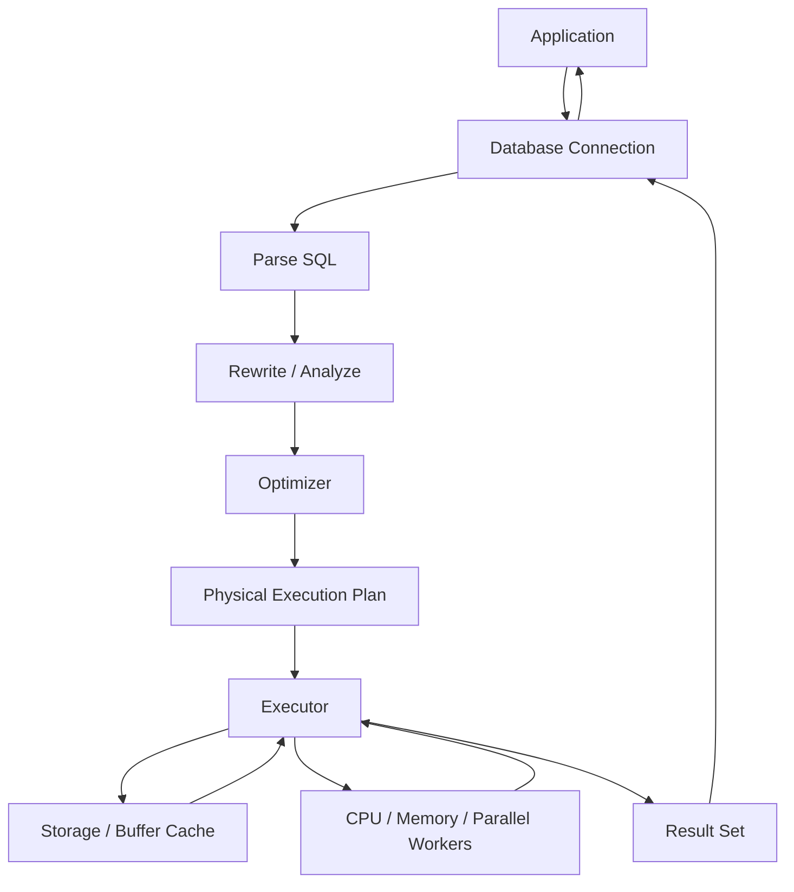
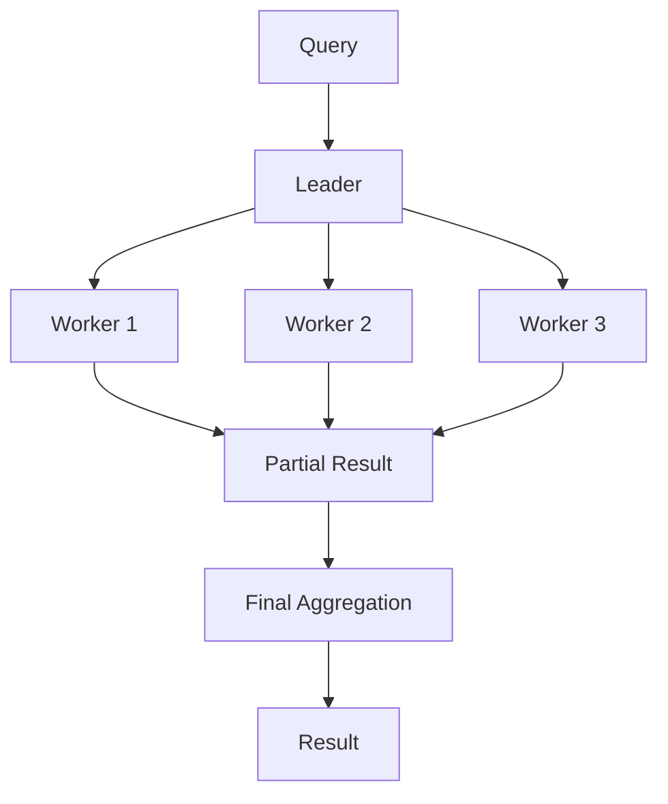

# 03- Physical Query Execution

## Overview

SQL describes **what data should be returned**, while the database optimizer determines **how to retrieve and process that data**.

The physical execution of a query is the sequence of concrete operations performed by the database engine. Typical operations include:

- Sequential scans.
- Index scans.
- Index-only scans.
- Bitmap scans.
- Nested loop joins.
- Hash joins.
- Merge joins.
- Sorts.
- Aggregation.
- Materialization.
- Parallel execution.
- Filtering and projection.

For example:

```sql
SELECT
    o.id,
    o.total
FROM orders AS o
WHERE o.customer_id = 42
ORDER BY o.created_at DESC
LIMIT 50;
```

The database does not simply execute the SQL from top to bottom. An optimizer evaluates possible execution strategies and chooses a physical plan based on factors such as:

- Table and index statistics.
- Estimated cardinality.
- Selectivity.
- Available indexes.
- Join relationships.
- Sort requirements.
- Memory availability.
- Parallelism.
- Cost estimates.
- Database configuration.

A senior backend engineer should therefore be able to move through three levels of reasoning:

```text
SQL statement
    ↓
Logical query semantics
    ↓
Physical execution plan
    ↓
Actual runtime behavior
```

The physical execution plan is the primary tool for understanding why a query is fast, slow, CPU-heavy, I/O-heavy, memory-heavy, or unexpectedly expensive.

## Logical Query vs Physical Execution

Consider:

```sql
SELECT
    customer_id,
    COUNT(*) AS order_count
FROM orders
WHERE status = 'completed'
GROUP BY customer_id;
```

The logical interpretation is:

```text
FROM orders
    ↓
WHERE status = 'completed'
    ↓
GROUP BY customer_id
    ↓
COUNT(*)
    ↓
SELECT result
```

A physical plan could instead look conceptually like:

```text
Index Scan / Sequential Scan
        ↓
      Filter
        ↓
   HashAggregate
        ↓
      Result
```

The database is free to choose a different physical strategy as long as the resulting query semantics remain correct.

This distinction is fundamental:

| Layer | Question answered |
|---|---|
| SQL syntax | What did the developer request? |
| Logical processing | What does the query mean? |
| Physical plan | How does the database intend to execute it? |
| Actual execution | What happened at runtime? |

## The Query Execution Pipeline

A simplified database request lifecycle looks like:



The exact architecture varies by database, but the important distinction is between:

1. Parsing and analysis.
2. Planning and optimization.
3. Physical execution.
4. Storage and resource access.
5. Result delivery.

## Parsing and Analysis

When the application sends:

```sql
SELECT id, total
FROM orders
WHERE customer_id = 42;
```

the database first needs to understand the statement.

This includes activities such as:

- Parsing SQL syntax.
- Resolving table names.
- Resolving column names.
- Checking types.
- Checking permissions.
- Building internal representations of the query.

The database then has enough information to reason about possible execution strategies.

### Why This Matters

Parsing and planning are usually small compared with expensive execution, but they can matter for:

- Extremely high query rates.
- Very complex SQL.
- Dynamic SQL generation.
- Systems with excessive query-shape variation.
- Applications that fail to reuse prepared statements or equivalent mechanisms.

Connection pooling and appropriate statement handling can reduce unnecessary overhead in high-throughput services.

## Query Optimization

After parsing and analysis, the optimizer evaluates candidate strategies.

For example:

```sql
SELECT *
FROM orders
WHERE customer_id = 42;
```

Possible strategies might include:

```text
Sequential Scan
Index Scan
Bitmap Index Scan + Bitmap Heap Scan
```

The optimizer estimates the cost of each strategy and selects one.

The chosen plan is based on estimates rather than a guarantee that the selected strategy will always be fastest under every data distribution.

## Cost-Based Optimization

Modern relational databases generally use cost-based optimization.

The optimizer estimates:

- Number of rows.
- Number of pages or blocks.
- CPU work.
- Random vs sequential I/O.
- Join cardinality.
- Sort cost.
- Aggregation cost.
- Parallel execution cost.

A simplified model is:

```text
Estimated cost =
    I/O cost
  + CPU cost
  + memory-related cost
  + parallelism considerations
```

The actual formula is database-specific.

The important engineering point is that **the optimizer makes decisions from statistics and cost models**.

## Cardinality Estimates

Cardinality means the number of rows expected at a particular stage.

Suppose PostgreSQL estimates:

```text
Seq Scan on orders
Estimated rows: 10,000
```

but actual execution produces:

```text
Actual rows: 5,000,000
```

That is a major estimation error.

Such errors can cause the optimizer to select an inappropriate plan.

For example:

```text
Bad estimate
    ↓
Expected small input
    ↓
Nested Loop selected
    ↓
Actual input is huge
    ↓
Millions of repeated operations
    ↓
Slow query
```

Cardinality estimation is therefore one of the most important concepts in query optimization.

## Sequential Scan

A sequential scan reads the table's pages and examines rows to determine which satisfy the query.

Example:

```sql
SELECT *
FROM orders
WHERE status = 'completed';
```

A sequential scan can be entirely appropriate when:

- A large percentage of rows match.
- The table is relatively small.
- There is no useful index.
- Reading the table sequentially is cheaper than random index access.
- The query needs most table columns and rows.

A sequential scan is **not inherently bad**.

### Important Principle

Do not interpret:

```text
Seq Scan
```

as:

```text
Slow query
```

The correct question is:

> Is the sequential scan cheaper than the alternatives for this workload?

## Index Scan

An index scan uses an index to locate matching rows.

Example:

```sql
CREATE INDEX idx_orders_customer_id
ON orders (customer_id);
```

Then:

```sql
SELECT *
FROM orders
WHERE customer_id = 42;
```

may use the index.

Conceptually:

```text
Index
  ↓
Matching row locations
  ↓
Table pages
  ↓
Rows
```

Index scans are particularly useful when the predicate is selective and the query does not need a large fraction of the table.

### Limitations

Index access can become expensive when:

- Many rows match.
- Table pages are scattered.
- The query needs many columns not contained in the index.
- Random heap access becomes more expensive than sequential reading.

The optimizer may therefore correctly choose a sequential scan even when an index exists.

## Index-Only Scan

An index-only scan can satisfy a query using index data without fetching the corresponding table rows when the required data is available in the index and the database's visibility rules allow it.

Example:

```sql
CREATE INDEX idx_orders_customer_created
ON orders (customer_id, created_at);
```

A query such as:

```sql
SELECT customer_id, created_at
FROM orders
WHERE customer_id = 42;
```

may be eligible for an index-only scan.

Potential benefits include:

- Less table I/O.
- Reduced random access.
- Better cache efficiency.
- Lower latency.

Whether it is actually index-only depends on the database and storage engine's visibility mechanisms.

## Bitmap Scans

PostgreSQL can use bitmap strategies when an index can identify many matching rows efficiently.

Conceptually:

```text
Index
  ↓
Bitmap of matching pages
  ↓
Heap pages
  ↓
Rows
```

Bitmap scans can be useful when:

- Many rows match.
- Index access identifies relevant pages efficiently.
- A direct index scan would require too many random heap accesses.

PostgreSQL may also combine multiple indexes through bitmap operations.

For example:

```sql
SELECT *
FROM orders
WHERE customer_id = 42
  AND status = 'completed';
```

The optimizer may potentially combine separate indexes rather than requiring one composite index.

However, this does not mean that creating many single-column indexes is always preferable to designing appropriate composite indexes.

## Filter vs Index Condition

Execution plans often distinguish between conditions used to access an index and filters applied after retrieving rows.

Conceptually:

```text
Index Condition
    ↓
Rows/pages selected through index
    ↓
Filter
    ↓
Final rows
```

If a large number of rows are removed by a filter after index access, the index may not be selective enough for the complete workload.

This is an important diagnostic signal when reading execution plans.

## Join Algorithms

When a query joins tables, the optimizer chooses a physical join algorithm.

The three major relational join strategies are:

| Join | Typical strength | Typical weakness |
|---|---|---|
| Nested Loop | Excellent for small outer inputs and efficient inner lookup | Can become very expensive for large outer inputs |
| Hash Join | Effective for large equality joins | Requires memory for hash structures and does not support arbitrary join predicates |
| Merge Join | Efficient when inputs are appropriately sorted | May require sorting when suitable ordering is unavailable |

No join algorithm is universally best.

## Nested Loop Join

Conceptually:

```text
For each row in outer relation:
    find matching rows in inner relation
```

For example:

```sql
SELECT
    o.id,
    c.email
FROM orders AS o
JOIN customers AS c
  ON c.id = o.customer_id
WHERE o.id = 100;
```

If only one order is being processed and `customers.id` is indexed, a nested loop can be extremely efficient.

Conceptually:

```text
One order
   ↓
Index lookup on customers
   ↓
One matching customer
```

### When It Becomes Dangerous

If the outer side unexpectedly contains millions of rows:

```text
1,000,000 outer rows
        ×
inner lookup
        ↓
potentially millions of operations
```

A nested loop can become expensive.

This is why incorrect cardinality estimates can produce severe performance problems.

## Hash Join

A hash join is commonly effective for equality joins.

Conceptually:

```text
Build side
    ↓
Hash table
    ↓
Probe side
    ↓
Matching rows
```

Example:

```sql
SELECT
    o.id,
    c.email
FROM orders AS o
JOIN customers AS c
  ON c.id = o.customer_id;
```

The database can build a hash structure for one relation and probe it with rows from the other.

### Advantages

- Effective for large equality joins.
- Does not require pre-sorted inputs.
- Often performs well for substantial in-memory joins.

### Limitations

- Requires memory.
- Large hash tables can spill to disk.
- Primarily useful for equality-based join conditions.

## Merge Join

A merge join processes two ordered inputs.

Conceptually:

```text
Sorted A ───────┐
                ├── Merge
Sorted B ───────┘
```

It can be efficient when inputs are already appropriately ordered or can be obtained cheaply in sorted order.

The trade-off is that sorting can itself be expensive.

## Aggregation Operators

Queries involving:

```sql
GROUP BY
COUNT()
SUM()
AVG()
MIN()
MAX()
```

require aggregation.

Common physical approaches include:

- Hash aggregation.
- Group aggregation after sorting.
- Parallel aggregation.

Example:

```sql
SELECT
    customer_id,
    COUNT(*)
FROM orders
GROUP BY customer_id;
```

A hash-based strategy may conceptually look like:

```text
Rows
 ↓
Hash by customer_id
 ↓
Aggregate each group
 ↓
Result
```

A sort-based strategy may look like:

```text
Rows
 ↓
Sort by customer_id
 ↓
Scan groups
 ↓
Aggregate
 ↓
Result
```

The optimizer chooses according to estimated costs and available resources.

## Sort Operations

Queries using:

```sql
ORDER BY
```

may require an explicit sort.

Example:

```sql
SELECT id, total
FROM orders
ORDER BY total DESC;
```

Conceptually:

```text
Rows
 ↓
Sort
 ↓
Ordered rows
```

Sorting can consume:

- CPU.
- Memory.
- Temporary disk space when it spills.

### Avoiding Sorts With Indexes

An appropriate index can sometimes provide rows in the required order.

Example:

```sql
CREATE INDEX idx_orders_customer_created
ON orders (customer_id, created_at DESC);
```

For:

```sql
SELECT id, created_at
FROM orders
WHERE customer_id = 42
ORDER BY created_at DESC
LIMIT 50;
```

the index can potentially support both filtering and ordering.

The actual plan must be verified rather than assumed.

## Memory and Disk Spills

Physical operators may require memory.

Examples include:

- Hash joins.
- Hash aggregation.
- Sorts.
- Materialization.

If available memory is insufficient, an operator may spill intermediate data to temporary storage.

Conceptually:

```text
Rows
 ↓
Operator
 ↓
Memory limit reached
 ↓
Temporary disk I/O
 ↓
Continue processing
```

Disk spilling can substantially increase latency.

When diagnosing a slow query, inspect:

- Sort methods.
- Temporary file usage.
- Hash batches.
- Memory configuration.
- Data volume.
- Concurrency.

Increasing database memory blindly is not a safe solution because many concurrent queries can consume memory simultaneously.

## Parallel Query Execution

Modern databases can execute some operations using multiple workers.

Conceptually:



Parallelism can improve throughput for sufficiently large workloads.

It can be counterproductive for:

- Tiny queries.
- Latency-sensitive point lookups.
- Highly concurrent systems where worker contention is already high.
- Queries whose parallel coordination overhead exceeds their useful work.

A production system should optimize for overall workload behavior, not only the fastest execution time for one isolated query.

## Materialization

A database may materialize an intermediate result.

Conceptually:

```text
Subplan
  ↓
Materialize
  ↓
Temporary/intermediate representation
  ↓
Repeated consumption
```

Materialization can sometimes prevent repeated computation, but it may consume memory or temporary storage.

Whether materialization occurs depends on the database and chosen execution plan.

## Reading EXPLAIN Plans

For PostgreSQL, start with:

```sql
EXPLAIN
SELECT
    o.id,
    o.total
FROM orders AS o
WHERE o.customer_id = 42;
```

This shows the estimated plan.

For actual runtime behavior:

```sql
EXPLAIN (ANALYZE, BUFFERS)
SELECT
    o.id,
    o.total
FROM orders AS o
WHERE o.customer_id = 42;
```

`ANALYZE` executes the query, so use it carefully in production.

A typical plan may contain:

```text
Limit
  -> Index Scan using idx_orders_customer_created on orders
       Index Cond: (customer_id = 42)
```

Read the plan from the bottom upward to understand how rows flow toward the final result.

## Estimated vs Actual Rows

One of the highest-value execution-plan checks is:

```text
estimated rows
vs
actual rows
```

For example:

```text
Index Scan
  estimated rows: 100
  actual rows:    105
```

This is generally a healthy estimate.

But:

```text
Index Scan
  estimated rows: 100
  actual rows:    5,000,000
```

is a serious mismatch.

Large estimation errors can propagate through the plan and cause poor join or aggregation choices.

## EXPLAIN (ANALYZE, BUFFERS)

For PostgreSQL:

```sql
EXPLAIN (ANALYZE, BUFFERS, VERBOSE)
SELECT
    customer_id,
    COUNT(*) AS order_count
FROM orders
WHERE status = 'completed'
GROUP BY customer_id;
```

Important information includes:

| Plan information | What it tells you |
|---|---|
| `cost` | Optimizer's estimated startup and total cost |
| `rows` | Estimated rows |
| `actual time` | Measured execution time |
| `actual rows` | Rows actually produced |
| `loops` | Number of executions of the node |
| `Buffers` | Shared buffer hits/reads and related I/O |
| `Planning Time` | Time spent planning |
| `Execution Time` | Measured execution time |

A node executed many times deserves particular attention.

For example:

```text
Nested Loop
  loops=100000
```

may indicate that an inner operation is being repeated extensively.

## A Practical Diagnostic Workflow

When a production query is slow, use a disciplined process.

### Identify the Exact Query

Capture:

- SQL statement.
- Parameters.
- Frequency.
- Endpoint or background job.
- Typical and worst-case latency.

Do not optimize a query shape using only a synthetic parameter.

### Capture the Execution Plan

Start with:

```sql
EXPLAIN
SELECT ...;
```

Then, in a safe environment:

```sql
EXPLAIN (ANALYZE, BUFFERS)
SELECT ...;
```

### Compare Estimates With Reality

Look for:

```text
estimated rows ≠ actual rows
```

Large discrepancies often indicate stale or insufficient statistics, correlated data, parameter sensitivity, or a fundamentally difficult estimation problem.

### Find the Expensive Operator

Look for:

- High actual time.
- High loop counts.
- Large row counts.
- Large buffer reads.
- Disk-based sorts.
- Hash spills.
- Large intermediate result sets.

### Determine the Resource Bottleneck

Ask:

```text
CPU?
I/O?
Memory?
Locking?
Network?
Planning?
Contention?
```

A slow query is not always a query-plan problem.

### Change One Important Variable

Examples:

- Add or modify an index.
- Rewrite a predicate.
- Reduce selected columns.
- Change pagination strategy.
- Improve statistics.
- Rewrite a join.
- Reduce unnecessary rows earlier.

Then compare plans and runtime.

## Example: Poor Query Plan

Suppose:

```sql
SELECT
    o.id,
    o.created_at,
    o.total
FROM orders AS o
WHERE o.customer_id = 42
ORDER BY o.created_at DESC
LIMIT 50;
```

An inefficient plan might be conceptually:

```text
Seq Scan orders
    ↓
Filter customer_id = 42
    ↓
Sort by created_at DESC
    ↓
Limit 50
```

If the table contains hundreds of millions of rows, this can be expensive.

A more suitable index may be:

```sql
CREATE INDEX idx_orders_customer_created
ON orders (customer_id, created_at DESC);
```

The resulting plan may become conceptually:

```text
Index Scan
    ↓
customer_id = 42
already ordered by created_at
    ↓
Limit 50
```

The important optimization is not simply "add an index." It is matching the access path to the query's:

```text
filter + ordering + result-size
```

## Query Plan Stability

A query can have different plans over time.

Reasons include:

- Table growth.
- Changed data distribution.
- Updated statistics.
- New indexes.
- Dropped indexes.
- Configuration changes.
- Database version changes.
- Different parameter values.
- Memory pressure.
- Changed workload.

A query that was fast six months ago can become slow without any application code change.

Production monitoring should therefore track important query performance over time.

## Statistics and Plan Quality

The optimizer relies heavily on statistics.

Statistics can describe properties such as:

- Approximate row counts.
- Value distributions.
- Most common values.
- Histograms.
- Distinct-value estimates.
- Correlations, depending on database capabilities.

If statistics are inaccurate, the optimizer can make poor decisions.

For PostgreSQL, regular `ANALYZE` activity is therefore important.

Autovacuum normally manages routine statistics collection, but high-change or unusual tables may require deliberate tuning and observation.

## Parameter Sensitivity

The best physical plan can depend on parameter values.

Consider:

```sql
SELECT *
FROM orders
WHERE customer_id = $1;
```

If one customer has:

```text
10 orders
```

while another has:

```text
50,000,000 orders
```

the ideal access strategy may differ.

An index-based lookup can be excellent for the first case, while a different strategy may be better for the second.

This is one reason production performance testing should use realistic parameter distributions rather than a single convenient value.

## ORM and Physical Plans

Frameworks such as Django can generate complex SQL.

For example:

```python
orders = (
    Order.objects
    .filter(customer_id=42, status="completed")
    .order_by("-created_at")[:50]
)
```

The ORM abstracts SQL generation, but it does not eliminate database execution costs.

For performance-sensitive ORM queries:

```text
Python ORM
   ↓
Generated SQL
   ↓
Database optimizer
   ↓
Physical execution plan
   ↓
Storage / CPU / memory
```

Use ORM query inspection and database execution plans together.

The same principle applies to SQLAlchemy and other data-access layers.

## Production Monitoring

Query performance should be monitored at the workload level.

Useful metrics include:

| Metric | Why it matters |
|---|---|
| Query latency | Detects slow requests |
| p95 / p99 latency | Captures tail behavior |
| Execution frequency | Identifies high-impact queries |
| Rows returned | Detects excessive data transfer |
| Rows scanned | Indicates inefficient access |
| Buffer reads | Shows storage/cache pressure |
| Temporary I/O | Detects spills |
| CPU time | Identifies CPU-heavy queries |
| Lock wait time | Separates query execution from contention |
| Query errors | Detects operational failures |

A query taking 500 ms once per day may matter less than a query taking 50 ms and executing 100,000 times per minute.

A useful prioritization model is:

```text
Impact ≈ latency × frequency × affected traffic
```

This is a heuristic, not a database metric.

## Security and Operational Considerations

Execution-plan analysis can expose sensitive information through:

- Query parameters.
- Table names.
- Application-specific identifiers.
- Data distribution.
- Internal schema details.

Treat collected plans and database logs according to your organization's access controls.

When using:

```sql
EXPLAIN (ANALYZE)
```

remember that the statement executes.

For production diagnostics:

- Prefer read-only queries where appropriate.
- Avoid expensive statements during peak traffic.
- Use replicas or controlled environments when possible.
- Consider statement timeouts.
- Capture representative plans without exposing sensitive parameters unnecessarily.

## Common Mistakes

### Assuming Seq Scan Means a Bad Plan

A sequential scan can be optimal for large result sets or small tables.

Evaluate:

```text
rows needed
vs
rows scanned
vs
alternative access cost
```

### Assuming Every Query Should Use an Index

Indexes have maintenance and storage costs, and random index access can be slower than sequential access for large result sets.

### Looking Only at Cost

`cost=...` is an optimizer estimate, not elapsed time in milliseconds.

Use:

```sql
EXPLAIN (ANALYZE, BUFFERS)
```

to inspect actual runtime behavior.

### Ignoring Actual Row Counts

A plan with dramatically incorrect cardinality estimates can explain otherwise surprising optimizer decisions.

### Optimizing Without Real Parameters

Testing:

```text
customer_id = 1
```

does not prove performance for:

```text
customer_id = 987654
```

when data distribution is highly skewed.

### Increasing Memory Blindly

More memory can help sorts and hash operations, but excessive per-query memory multiplied by high concurrency can destabilize the database.

### Optimizing the Slowest Individual Query

A moderately slow query executed millions of times can have more production impact than an extremely slow query executed once.

### Running EXPLAIN ANALYZE Carelessly

`EXPLAIN ANALYZE` executes the query. Do not treat it as a passive inspection command.

### Ignoring Locks

A query can appear slow because it is waiting on a lock rather than because its execution plan is inefficient.

### Changing Multiple Things at Once

If you add indexes, rewrite SQL, change configuration, and change application behavior simultaneously, it becomes difficult to determine which change produced the improvement.

## Interview Traps

| Question | Strong answer |
|---|---|
| What is a physical execution plan? | The concrete set of database operations used to execute a SQL statement. |
| Is the SQL written order the physical execution order? | No. The optimizer can transform the execution strategy. |
| Is a sequential scan always bad? | No. It can be optimal when a large portion of a table is needed or the table is small. |
| What does an index scan do? | Uses an index to locate relevant rows or row locations. |
| When can an index be slower than a sequential scan? | When many rows match and random table access becomes more expensive than sequential reading. |
| What is cardinality? | The number of rows produced or expected at a plan node. |
| Why compare estimated and actual rows? | Large differences can reveal inaccurate statistics or difficult estimation and lead to poor plans. |
| What is a nested loop join good for? | Small outer inputs with efficient lookups into the inner relation. |
| When is a hash join useful? | Large equality joins where building and probing a hash structure is efficient. |
| Why can a sort become expensive? | It consumes CPU and memory and may spill to temporary storage. |
| What does `EXPLAIN ANALYZE` provide? | Actual execution measurements, but it also executes the query. |
| What does `BUFFERS` help identify? | Database cache hits, reads, and I/O behavior. |
| Can the same query have different plans? | Yes. Data distribution, statistics, parameters, indexes, configuration, and database versions can change plan selection. |
| Does adding an index guarantee better performance? | No. The optimizer may reject it, or index access may be more expensive for the workload. |

## Production Best Practices

- Treat the execution plan as the primary evidence for query-performance diagnosis.
- Distinguish logical SQL semantics from physical execution strategy.
- Compare estimated rows with actual rows when investigating unexpected plans.
- Use `EXPLAIN (ANALYZE, BUFFERS)` in controlled environments for detailed PostgreSQL analysis.
- Do not treat sequential scans as inherently problematic.
- Evaluate indexes according to selectivity, filtering, ordering, join patterns, and workload frequency.
- Watch for high loop counts, large intermediate results, sort spills, and hash spills.
- Test queries with representative data distributions and parameters.
- Monitor p95/p99 latency and execution frequency rather than only average latency.
- Consider CPU, I/O, memory, locking, and network behavior before assuming the optimizer is at fault.
- Re-check important execution plans after major data growth, schema changes, index changes, database upgrades, or configuration changes.
- Optimize the production workload, not an isolated benchmark.
- Make one material change at a time and compare before/after execution plans.
- Keep query diagnostics and execution-plan data protected because they can reveal internal schema and operational information.

## Key Takeaways

- **A physical execution plan describes how the database actually intends to execute a SQL statement using scans, joins, aggregation, sorting, and other operators.**
- **The optimizer chooses physical strategies from statistics, cardinality estimates, indexes, resource costs, and workload characteristics; SQL syntax does not dictate the physical plan.**
- **Estimated-versus-actual row counts are one of the most valuable signals for diagnosing unexpected execution plans and poor optimizer decisions.**
- **Sequential scans, nested loops, and other operators are not inherently bad; their suitability depends on cardinality, selectivity, data distribution, and workload shape.**
- **Production query optimization requires execution-plan analysis plus workload monitoring, realistic parameters, and validation of CPU, I/O, memory, and locking behavior.**