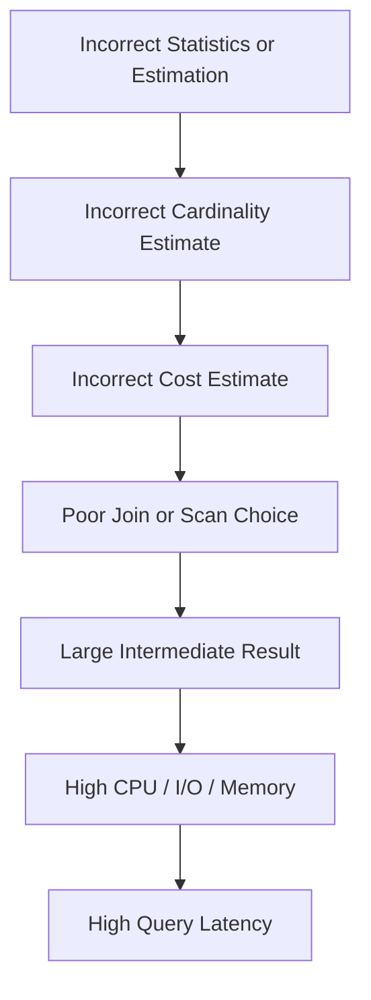
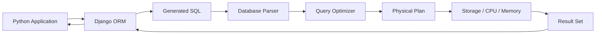

# 04- Query Optimizer

## Overview

The **query optimizer** is the database component responsible for selecting an efficient physical execution strategy for a SQL statement while preserving its semantics.

A SQL query describes the desired result:

```sql
SELECT
    o.id,
    o.total
FROM orders AS o
WHERE o.customer_id = 42
ORDER BY o.created_at DESC
LIMIT 50;
```

The optimizer decides how that result should be produced. It may choose:

- Sequential scans.
- Index scans.
- Index-only scans.
- Bitmap scans.
- Nested loop joins.
- Hash joins.
- Merge joins.
- Sort operations.
- Hash or sorted aggregation.
- Parallel execution.
- Materialization.

The optimizer is therefore the bridge between **declarative SQL** and **physical database execution**.

```text
Application
    ↓
SQL query
    ↓
Parser / Analyzer
    ↓
Query Optimizer
    ↓
Cost-based plan selection
    ↓
Physical Execution Plan
    ↓
Executor
    ↓
Storage / CPU / Memory
    ↓
Result
```

For backend engineers, understanding the optimizer is essential because adding an index or rewriting SQL does not guarantee better performance. The database must determine that the proposed strategy is actually cheaper for the current data distribution and workload.

## Why the Query Optimizer Exists

SQL is declarative. Developers specify **what** they want rather than explicitly specifying every physical operation required to retrieve it.

For example:

```sql
SELECT
    c.email,
    COUNT(o.id) AS order_count
FROM customers AS c
JOIN orders AS o
    ON o.customer_id = c.id
WHERE c.country = 'IN'
GROUP BY c.email;
```

There can be many physically valid ways to execute this query:

```text
Plan A:
customers → filter → nested loop → orders → aggregate

Plan B:
orders → hash → customers → filter → aggregate

Plan C:
customers → filter → sort
orders → sort
merge join → aggregate
```

The optimizer evaluates possible strategies and chooses one according to its cost model.

Without an optimizer, application developers would have to manually determine:

- Which table to scan first.
- Which indexes to use.
- Which join algorithm to use.
- When to sort.
- How to aggregate.
- Whether to parallelize work.
- How intermediate results should be processed.

The optimizer automates this decision-making while allowing the database engine to adapt to changing data and workload characteristics.

## What the Query Optimizer Considers

The optimizer considers multiple inputs when generating a plan.

| Input | Influence on planning |
|---|---|
| SQL structure | Determines available logical operations |
| Table statistics | Estimates data distribution and cardinality |
| Indexes | Provide alternative access paths |
| Constraints | Provide information about relationships and uniqueness |
| Join conditions | Determine possible join strategies |
| Predicate selectivity | Estimates how many rows will match |
| Ordering requirements | Influences index usage and sort operations |
| Aggregation | Influences hash vs sort-based strategies |
| Memory configuration | Affects hash and sort decisions |
| Parallelism settings | Determines whether parallel execution is attractive |
| Cost parameters | Influence relative cost of CPU and I/O |
| Parameter values | Can affect selectivity and plan quality |
| Database version | Can change optimizer behavior and capabilities |

The optimizer does **not** know the future. It makes decisions using available metadata and statistical estimates.

## Cost-Based Optimization

Modern relational databases generally use **cost-based optimization**.

The optimizer generates candidate plans and estimates the cost of executing them.

Conceptually:

```text
SQL
 ↓
Candidate Plan A ── estimated cost: 10
Candidate Plan B ── estimated cost: 35
Candidate Plan C ── estimated cost: 18
 ↓
Choose Plan A
```

The cost is an internal unit used by the optimizer. It should not be interpreted directly as milliseconds.

For PostgreSQL, for example:

```sql
EXPLAIN
SELECT *
FROM orders
WHERE customer_id = 42;
```

may produce a plan containing:

```text
Index Scan using idx_orders_customer_id on orders
(cost=0.42..12.31 rows=20 width=64)
```

The `cost` values are optimizer estimates, not measured elapsed time.

Actual execution requires:

```sql
EXPLAIN (ANALYZE, BUFFERS)
SELECT *
FROM orders
WHERE customer_id = 42;
```

## Statistics Drive Optimizer Decisions

The optimizer needs to estimate how much data each operation will process.

Suppose a table contains:

```text
orders = 100,000,000 rows
```

and the query is:

```sql
SELECT *
FROM orders
WHERE customer_id = 42;
```

If the optimizer estimates:

```text
customer_id = 42 → 20 rows
```

an index lookup is likely attractive.

If it estimates:

```text
customer_id = 42 → 40,000,000 rows
```

a sequential scan may be cheaper.

The same SQL statement can therefore receive different plans depending on the data distribution.

## Cardinality Estimation

**Cardinality** is the number of rows expected at a particular stage of the execution plan.

For example:

```text
Seq Scan orders
estimated rows: 10,000
```

The optimizer uses cardinality estimates to decide which operations are appropriate.

A major optimization problem occurs when estimated and actual cardinalities differ significantly:

```text
Estimated: 100 rows
Actual:    5,000,000 rows
```

The optimizer may have selected a plan that is excellent for 100 rows but terrible for 5 million.

This can cascade through a plan:



## Selectivity

Selectivity describes how effectively a predicate reduces the number of rows.

Consider:

```sql
WHERE customer_id = 42
```

If only 20 of 100 million rows match, the predicate is highly selective.

Now consider:

```sql
WHERE status = 'completed'
```

if 95% of the table contains completed orders.

That predicate is not very selective.

A highly selective predicate often makes index access attractive.

A low-selectivity predicate may make a sequential scan more efficient.

### Practical Rule

Do not ask:

> Does this column have an index?

Ask:

> For this query and this data distribution, is indexed access cheaper than the alternatives?

## Access Path Selection

The optimizer can choose among different ways to access a table.

| Access path | Typical use |
|---|---|
| Sequential scan | Large portion of table must be examined |
| Index scan | Selective lookup with useful index |
| Index-only scan | Required data can be satisfied from index |
| Bitmap scan | Many matching rows/pages with useful indexes |
| Table-specific alternatives | Depend on database engine and storage architecture |

For example:

```sql
SELECT
    id,
    created_at
FROM orders
WHERE customer_id = 42;
```

with:

```sql
CREATE INDEX idx_orders_customer
ON orders (customer_id);
```

may use an index.

But:

```sql
SELECT *
FROM orders;
```

will commonly favor a sequential scan because nearly the entire table is required.

## Join Order Optimization

Join order can have a major effect on performance.

Consider:

```sql
SELECT *
FROM customers AS c
JOIN orders AS o
    ON o.customer_id = c.id
JOIN payments AS p
    ON p.order_id = o.id
WHERE c.country = 'IN';
```

The optimizer can consider different join orders.

Conceptually:

```text
Option A:
customers → orders → payments

Option B:
orders → payments → customers

Option C:
customers → payments → orders
```

The optimal order depends on:

- Cardinality.
- Selectivity.
- Available indexes.
- Join predicates.
- Intermediate result sizes.
- Statistics.

A strong plan generally tries to avoid creating unnecessarily large intermediate results.

## Join Algorithm Selection

The optimizer also chooses the physical join algorithm.

### Nested Loop

Conceptually:

```text
for each row in outer input:
    find matching rows in inner input
```

This is often excellent when the outer input is small and the inner relation has an efficient lookup path.

Example:

```sql
SELECT
    o.id,
    c.email
FROM orders AS o
JOIN customers AS c
    ON c.id = o.customer_id
WHERE o.id = 100;
```

If only one order is processed and `customers.id` is indexed, a nested loop can be extremely efficient.

### Hash Join

A hash join generally works by:

```text
Build relation
    ↓
Create hash table
    ↓
Probe relation
    ↓
Find matches
```

It is particularly useful for large equality joins.

### Merge Join

A merge join processes ordered inputs:

```text
Sorted input A ──┐
                 ├── Merge
Sorted input B ──┘
```

It can be effective when the inputs are already appropriately ordered or sorting them is inexpensive.

The optimizer compares these alternatives rather than assuming one join type is always superior.

## Predicate Pushdown

The optimizer can often move filters closer to the data source when doing so preserves query semantics.

Consider:

```sql
SELECT
    c.id,
    o.id
FROM customers AS c
JOIN orders AS o
    ON o.customer_id = c.id
WHERE c.country = 'IN';
```

Conceptually, processing can become:

```text
customers
   ↓
filter country = 'IN'
   ↓
join with orders
```

rather than carrying irrelevant customer rows into the join.

Reducing rows earlier can reduce:

- CPU work.
- Memory usage.
- Join work.
- Network transfer.
- Intermediate result size.

Predicate pushdown is one reason the physical execution strategy may differ significantly from the SQL's textual order.

## Projection and Column Pruning

The optimizer may also avoid carrying unnecessary columns through intermediate operations.

Instead of processing:

```sql
SELECT *
FROM customers
JOIN orders
    ON customers.id = orders.customer_id;
```

a query that requests only:

```sql
SELECT customers.email, orders.total
```

gives the optimizer more opportunity to minimize unnecessary data movement.

This is another reason to avoid unnecessary `SELECT *` in performance-sensitive queries and production APIs.

## Aggregation Strategy

For:

```sql
SELECT
    customer_id,
    COUNT(*)
FROM orders
GROUP BY customer_id;
```

the optimizer may choose:

```text
Hash Aggregate
```

or:

```text
Sort
 ↓
Group Aggregate
```

The choice depends on factors such as:

- Number of rows.
- Number of groups.
- Available memory.
- Existing ordering.
- Cost estimates.
- Parallel execution opportunities.

Large aggregations can become expensive when intermediate data no longer fits comfortably in memory.

## Sort Strategy

Consider:

```sql
SELECT
    id,
    created_at
FROM orders
ORDER BY created_at DESC
LIMIT 100;
```

The optimizer considers whether:

- An index can provide the required ordering.
- A sort is cheaper.
- A top-N strategy can reduce work.
- The result can be obtained through a selective access path.

An index such as:

```sql
CREATE INDEX idx_orders_created_at
ON orders (created_at DESC);
```

may provide an efficient ordered access path.

However, index usage is still a cost decision.

## Query Rewriting

The optimizer can transform a query while preserving its semantics.

Depending on the database, transformations can include:

- Predicate pushdown.
- Join reordering.
- Simplification of expressions.
- Subquery transformations.
- Constant folding.
- Elimination of unnecessary operations.
- Partition pruning.
- Join elimination in applicable cases.

For example:

```sql
WHERE 1 = 1
  AND customer_id = 42
```

can be simplified internally.

More complex transformations may fundamentally change the execution strategy while producing the same result.

## Subqueries and CTEs

Consider:

```sql
SELECT *
FROM customers
WHERE id IN (
    SELECT customer_id
    FROM orders
    WHERE status = 'completed'
);
```

The optimizer may transform the query into a semi-join or another equivalent strategy.

CTEs also require careful interpretation.

Modern PostgreSQL versions can inline eligible CTEs rather than necessarily materializing every CTE.

Therefore, the assumption:

> CTE always means materialization

is incorrect for modern PostgreSQL.

When performance matters, inspect the actual execution plan instead of relying on simplified rules.

## Parameterized Queries and Plan Selection

Backend applications commonly use parameterized SQL:

```sql
SELECT
    id,
    total
FROM orders
WHERE customer_id = $1;
```

This is essential for security and efficient database interaction, but plan selection can become complicated when parameter values have highly skewed distributions.

For example:

```text
customer A → 10 rows
customer B → 20,000,000 rows
```

A single plan may not be equally efficient for both values.

Database-specific behavior around prepared statements, custom plans, generic plans, and plan caching can therefore matter in high-performance systems.

The correct approach is database-specific: inspect the workload and execution plans rather than assuming prepared statements always produce one universal plan.

## Statistics Maintenance

Because optimizer decisions depend on statistics, statistics must remain representative of current data.

In PostgreSQL, statistics are maintained through `ANALYZE`, normally integrated with autovacuum behavior.

Manual analysis can be useful after substantial data changes:

```sql
ANALYZE orders;
```

For high-volume production tables, monitor whether:

- Data distribution changes rapidly.
- Large bulk loads occur.
- Statistics become stale.
- Estimates diverge significantly from actual row counts.

A query can become slow without an application-code change simply because the data distribution changed.

## Extended Statistics

Single-column statistics can be insufficient when columns are correlated.

Consider:

```sql
WHERE country = 'IN'
  AND currency = 'INR'
```

If these values are strongly correlated, treating the columns as independent can produce poor cardinality estimates.

PostgreSQL supports extended statistics for certain multi-column relationships.

Example:

```sql
CREATE STATISTICS orders_country_currency_stats
    (dependencies, ndistinct, mcv)
ON country, currency
FROM orders;

ANALYZE orders;
```

This can provide the optimizer with additional information about relationships between columns.

Use extended statistics when execution plans demonstrate estimation problems that ordinary statistics do not adequately address.

## The Optimizer and Indexes

Creating an index does not force the optimizer to use it.

For example:

```sql
CREATE INDEX idx_orders_status
ON orders (status);
```

does not mean:

```sql
WHERE status = 'completed'
```

will always use that index.

If:

```text
95% of rows = completed
```

the optimizer may reasonably decide:

```text
Sequential scan < index scan + many heap accesses
```

This is expected behavior.

Indexes should therefore be evaluated using:

- Selectivity.
- Query frequency.
- Ordering requirements.
- Join patterns.
- Table size.
- Write workload.
- Storage overhead.

## Cost Model vs Real Hardware

The optimizer operates using a database-specific cost model.

The model may approximate:

- Sequential I/O.
- Random I/O.
- CPU processing.
- Cache behavior.
- Parallel execution.

These estimates do not perfectly model every real-world environment.

For example:

```text
Production:
large buffer cache
fast NVMe
high concurrency
```

may behave differently from:

```text
Development:
small dataset
cold cache
different storage
```

This is why development benchmarks cannot automatically predict production performance.

## Execution Plans Are Evidence

Use:

```sql
EXPLAIN
```

to inspect the estimated plan.

Use:

```sql
EXPLAIN (ANALYZE, BUFFERS)
```

to compare estimates with actual execution behavior in PostgreSQL.

A useful investigation looks like:

```text
SQL
 ↓
EXPLAIN
 ↓
Understand chosen plan
 ↓
EXPLAIN ANALYZE
 ↓
Compare estimated vs actual rows
 ↓
Inspect time / buffers / loops
 ↓
Identify bottleneck
 ↓
Change one variable
 ↓
Re-test
```

For example:

```sql
EXPLAIN (ANALYZE, BUFFERS)
SELECT
    o.id,
    o.total
FROM orders AS o
WHERE o.customer_id = 42
ORDER BY o.created_at DESC
LIMIT 50;
```

Important signals include:

- `actual time`.
- `actual rows`.
- `loops`.
- Buffer hits.
- Buffer reads.
- Temporary I/O.
- Sort method.
- Hash batches.
- Parallel workers.

## When the Optimizer Makes a Poor Choice

A poor plan does not necessarily mean the optimizer is defective.

Common causes include:

| Cause | Typical symptom |
|---|---|
| Stale statistics | Incorrect row estimates |
| Correlated columns | Incorrect combined selectivity |
| Data skew | One parameter behaves differently from another |
| Missing index | Expensive scans or joins |
| Poor index design | Index exists but does not match access pattern |
| Changed data distribution | Previously good plan becomes inefficient |
| Insufficient memory | Hash or sort spills |
| Cost settings | Plan does not reflect actual environment |
| Complex predicates | Difficult cardinality estimation |
| Parameter-sensitive workload | Different values require different strategies |

The first response should be diagnosis, not disabling optimizer behavior.

## Query Optimization Example

Suppose an API serves:

```http
GET /customers/42/orders?limit=50
```

The application executes:

```sql
SELECT
    id,
    created_at,
    total
FROM orders
WHERE customer_id = 42
ORDER BY created_at DESC
LIMIT 50;
```

An inefficient plan could be:

```text
Seq Scan orders
    ↓
Filter customer_id = 42
    ↓
Sort created_at DESC
    ↓
Limit 50
```

For a large table, an index such as:

```sql
CREATE INDEX idx_orders_customer_created
ON orders (customer_id, created_at DESC);
```

can provide a more suitable access path:

```text
Index Scan
    ↓
customer_id = 42
    ↓
already ordered by created_at
    ↓
Limit 50
```

The optimization is not simply:

> Add an index.

The engineering reasoning is:

```text
Frequent access pattern
        +
Selective equality predicate
        +
Required ordering
        +
Small LIMIT
        ↓
Composite index matching the access path
```

The plan must still be verified because actual usefulness depends on data distribution and workload.

## ORM Interaction

Django, SQLAlchemy, and similar frameworks generate SQL, but the database optimizer remains responsible for physical execution.

For Django:

```python
orders = (
    Order.objects
    .filter(customer_id=42)
    .order_by("-created_at")
    .values("id", "created_at", "total")[:50]
)
```

The performance chain is:



An ORM abstraction does not remove the need to understand execution plans.

For performance-sensitive endpoints, inspect:

- Generated SQL.
- Execution plan.
- Index usage.
- Returned row count.
- Query frequency.
- Application-side serialization cost.

## Production Monitoring

Optimizer decisions should be evaluated against real workload behavior.

Track:

| Metric | Why it matters |
|---|---|
| Query frequency | High-frequency queries can dominate total database load |
| p50 latency | Typical query behavior |
| p95 latency | Tail behavior |
| p99 latency | Severe tail latency |
| Rows returned | Application and network workload |
| Rows scanned | Access-path efficiency |
| Buffer reads | Storage/cache pressure |
| CPU time | CPU-bound workload detection |
| Temporary I/O | Sort/hash spill detection |
| Lock wait | Separates execution cost from contention |
| Plan changes | Detects workload or statistics-driven regressions |

A query that executes:

```text
1,000,000 times/hour × 50 ms
```

can be more operationally important than a query that takes:

```text
5 seconds × 2 times/hour
```

Optimize based on workload impact rather than isolated execution time.

## Plan Changes in Production

A plan can change without application code changing.

Common triggers include:

- Table growth.
- Data distribution changes.
- `ANALYZE`.
- New indexes.
- Removed indexes.
- Configuration changes.
- Database upgrades.
- Different parameter values.
- Memory availability.
- Partition changes.

This means query performance should be observed continuously for critical workloads.

For major releases or schema changes:

1. Capture important query plans before the change.
2. Apply the schema or configuration change.
3. Re-run representative queries.
4. Compare estimated and actual behavior.
5. Monitor production latency after deployment.

## Common Mistakes

### Assuming the Optimizer Must Use Every Index

The optimizer chooses the cheapest estimated strategy.

An existing index can be intentionally ignored.

### Treating `Seq Scan` as an Error

A sequential scan may be optimal for:

- Small tables.
- Large result sets.
- Low-selectivity predicates.
- Queries requiring most table columns.

### Reading Cost as Milliseconds

This is incorrect:

```text
cost=100
```

does not mean:

```text
100 ms
```

Cost is an internal estimate.

### Ignoring Cardinality Errors

If:

```text
estimated rows = 100
actual rows = 5,000,000
```

investigate why the optimizer misunderstood the workload.

### Adding Indexes Without Examining Query Patterns

An index should support a real access pattern.

Excessive indexing increases:

- Storage consumption.
- Write overhead.
- Vacuum/maintenance work.
- Planning complexity in some workloads.

### Testing Only One Parameter

A query may perform differently for:

```text
customer_id = 1
```

and:

```text
customer_id = 999999
```

when data is skewed.

### Assuming Development Behavior Equals Production

A 10,000-row development database does not meaningfully represent a 500-million-row production table.

### Disabling Optimizer Features Too Early

Database configuration changes should follow evidence.

Do not globally disable:

- Join algorithms.
- Sequential scans.
- Parallelism.
- Index usage.

just because one query received an unexpected plan.

### Increasing Memory Without Considering Concurrency

More memory can improve individual operations but can create instability when many concurrent queries consume memory simultaneously.

### Optimizing Before Identifying the Bottleneck

A query may be slow because of:

```text
CPU
I/O
locks
network
serialization
application code
```

not necessarily because the optimizer chose a bad plan.

## Production Best Practices

- Treat the optimizer as a cost-based decision system, not a deterministic rule engine.
- Keep table and index statistics representative of current production data.
- Compare estimated and actual row counts when diagnosing unexpected plans.
- Design indexes around actual filtering, joining, ordering, and pagination patterns.
- Do not force index usage unless there is a strong database-specific reason and the operational consequences are understood.
- Test performance with realistic data volumes and parameter distributions.
- Monitor important query shapes continuously rather than relying only on development benchmarks.
- Use `EXPLAIN` for estimated plans and `EXPLAIN (ANALYZE, BUFFERS)` for controlled runtime analysis in PostgreSQL.
- Remember that `EXPLAIN ANALYZE` executes the query.
- Investigate statistics and cardinality estimation before making aggressive optimizer configuration changes.
- Consider correlated columns and extended statistics when ordinary statistics produce poor estimates.
- Re-evaluate important queries after major data growth, schema changes, index changes, or database upgrades.
- Separate database execution latency from application serialization, network, lock-wait, and connection-pool latency.
- Optimize according to workload impact: latency, frequency, resource consumption, and affected traffic.
- Treat execution plans as operational artifacts that may expose internal schema and workload information.

## Interview Traps

| Question | Strong answer |
|---|---|
| What does a query optimizer do? | It chooses an efficient physical execution strategy for a SQL query while preserving its semantics. |
| Why is SQL called declarative? | The query describes the desired result rather than explicitly specifying the physical execution steps. |
| What does cost-based optimization mean? | The optimizer estimates the cost of candidate plans and chooses the plan with the lowest estimated cost according to its model. |
| Does the optimizer always choose the fastest possible plan? | No. It chooses based on estimates and its cost model; inaccurate statistics or difficult estimation can lead to poor choices. |
| Why can an index be ignored? | It may be estimated to be more expensive than a sequential scan or another access path. |
| Is a sequential scan always bad? | No. It can be optimal for small tables or queries that retrieve a large percentage of rows. |
| Why are statistics important? | They provide information used to estimate cardinality and selectivity, which influence plan selection. |
| What is cardinality estimation? | Estimating how many rows an operation will produce. |
| What happens when cardinality is badly estimated? | The optimizer can select inappropriate scans, join orders, join algorithms, or aggregation strategies. |
| Why can the same query receive different plans? | Data distribution, statistics, parameters, indexes, configuration, database versions, and resource conditions can change optimizer decisions. |
| What is predicate pushdown? | Applying filtering as close to the data source as possible when semantics permit, reducing intermediate rows and work. |
| Why can join order matter? | Different join orders can produce dramatically different intermediate result sizes and execution costs. |
| What is the difference between `EXPLAIN` and `EXPLAIN ANALYZE`? | `EXPLAIN` shows the estimated plan; `EXPLAIN ANALYZE` executes the query and reports actual runtime behavior. |
| Why use `BUFFERS` in PostgreSQL? | It helps identify cache hits, reads, and I/O behavior associated with plan nodes. |
| How would you investigate a bad plan? | Compare estimated vs actual rows, inspect expensive nodes and resource usage, validate statistics and indexes, then make and measure one targeted change. |

## Key Takeaways

- **The query optimizer converts declarative SQL into a physical execution strategy by evaluating scans, joins, ordering, aggregation, and other operations.**
- **Statistics and cardinality estimates are central to optimizer decisions; inaccurate estimates can produce inefficient execution plans even when indexes and SQL appear correct.**
- **An index is an available access path, not an instruction to the optimizer; sequential scans or other strategies can legitimately be cheaper.**
- **Senior-level query optimization requires analyzing actual execution behavior, data distribution, workload frequency, and resource consumption rather than relying on rules of thumb.**
- **Use execution plans as evidence, change one meaningful variable at a time, and continuously monitor critical query shapes as production data and workloads evolve.**