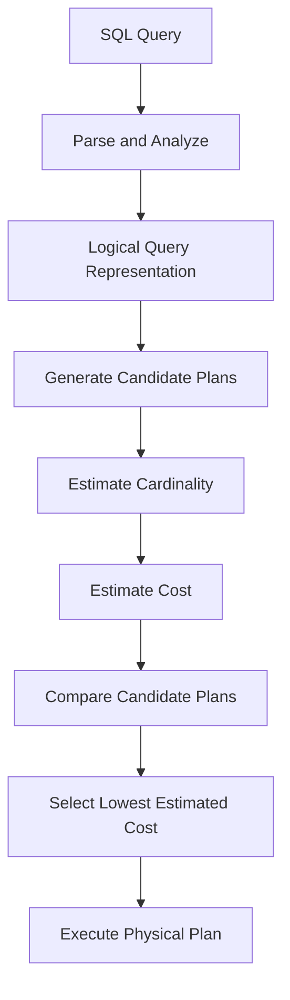

# 05- Cost Based Optimization

## Overview

**Cost-Based Optimization (CBO)** is the process by which a database optimizer evaluates alternative execution plans and selects the plan with the lowest estimated cost.

A SQL statement describes the required result, but usually does not specify:

- Which indexes to use.
- Which tables to access first.
- Which join algorithm to use.
- Whether to sort or use existing ordering.
- Whether to aggregate using hashing or sorting.
- Whether to execute operations in parallel.
- Which access path is cheapest.

The optimizer makes these decisions using a **cost model**, database statistics, available indexes, constraints, configuration, and query structure.

```text
SQL Query
    │
    ▼
Parse / Analyze
    │
    ▼
Generate Candidate Plans
    │
    ├── Sequential Scan
    ├── Index Scan
    ├── Nested Loop
    ├── Hash Join
    ├── Merge Join
    ├── Sort / Aggregate
    └── Parallel Alternatives
    │
    ▼
Estimate Cardinality
    │
    ▼
Estimate Resource Cost
    │
    ▼
Compare Plans
    │
    ▼
Choose Lowest Estimated Cost
    │
    ▼
Execute Plan
```

CBO is fundamental to production SQL performance because the fastest plan for one dataset or parameter value may be the wrong plan for another.

## Why Cost-Based Optimization Exists

A single SQL query can have many semantically equivalent execution strategies.

Consider:

```sql
SELECT
    c.email,
    o.total
FROM customers AS c
JOIN orders AS o
    ON o.customer_id = c.id
WHERE c.country = 'IN';
```

The database could potentially:

- Scan `customers` first and use an index on `orders.customer_id`.
- Scan `orders` first and build a hash structure.
- Use a merge join.
- Use different indexes.
- Apply filtering before or after other operations where semantics permit.
- Execute portions of the query in parallel.

The optimizer exists so application developers do not have to manually choose a physical strategy for every query.

The key engineering principle is:

> SQL expresses the desired result; the optimizer chooses an efficient way to produce it.

## What "Cost" Means

Optimizer cost is an internal numerical estimate.

For example, PostgreSQL may show:

```text
Index Scan using idx_orders_customer_id on orders
(cost=0.42..15.31 rows=20 width=64)
```

The values:

```text
0.42..15.31
```

are **not milliseconds**.

They represent estimated cost according to the database's cost model.

A plan with:

```text
cost=10
```

is not necessarily twice as fast as:

```text
cost=5
```

and cost should not be directly interpreted as wall-clock execution time.

The optimizer uses cost primarily to compare candidate plans.

## Cost-Based Optimization Inputs

CBO decisions depend on multiple inputs.

| Input | Why it matters |
|---|---|
| Table statistics | Estimate row counts and distributions |
| Indexes | Provide alternative access paths |
| Predicate selectivity | Estimates how much data is filtered |
| Cardinality | Estimates rows produced by each operation |
| Join predicates | Determine valid join strategies |
| Constraints | Provide semantic and uniqueness information |
| Ordering requirements | Influence index and sort decisions |
| Memory configuration | Affects hash and sort operations |
| CPU cost parameters | Estimate computation cost |
| I/O cost parameters | Estimate storage access cost |
| Parallelism settings | Influence parallel plan choices |
| Data distribution | Determines selectivity and cardinality |
| Query structure | Determines possible transformations |
| Parameter values | May change selectivity |
| Database version | Optimizer capabilities and behavior |

The optimizer is therefore only as good as the information available to it.

## The Cost-Based Optimization Process

A simplified CBO workflow is:



The exact implementation differs between database engines, but the fundamental process is similar.

## Cardinality Estimation

Cardinality estimation predicts how many rows an operation will produce.

Consider:

```sql
SELECT *
FROM orders
WHERE customer_id = 42;
```

Suppose:

```text
orders = 100,000,000 rows
```

The optimizer may estimate:

```text
customer_id = 42
estimated rows = 25
```

That estimate strongly influences the selected access path.

If the optimizer instead estimates:

```text
estimated rows = 40,000,000
```

a sequential scan may become more attractive.

### Why Cardinality Matters

Cardinality estimates influence:

- Index vs sequential scans.
- Join order.
- Join algorithm.
- Sort operations.
- Aggregation strategy.
- Parallelism.
- Memory allocation decisions.
- Intermediate result sizes.

A cardinality error early in a plan can therefore cause several downstream decisions to become incorrect.

## Selectivity

Selectivity estimates how strongly a predicate reduces the input.

Suppose:

```text
orders = 100,000,000
```

and:

```sql
WHERE customer_id = 42
```

returns:

```text
20 rows
```

The predicate is highly selective.

But:

```sql
WHERE status = 'completed'
```

might return:

```text
95,000,000 rows
```

If `status = 'completed'` matches most rows, using an index may require many random table accesses and become more expensive than scanning the table sequentially.

This explains an important production behavior:

> An indexed predicate does not imply an index scan.

## Statistics

Statistics allow the optimizer to make informed estimates about data.

Typical statistical information includes:

- Approximate row counts.
- Distinct-value estimates.
- Most common values.
- Histograms.
- Null fractions.
- Value distributions.
- Correlations or dependencies where supported.

For PostgreSQL, statistics are maintained through `ANALYZE` and are normally managed automatically as part of autovacuum behavior.

You can explicitly analyze a table:

```sql
ANALYZE orders;
```

After substantial data changes, fresh statistics can be critical to plan quality.

## Stale Statistics

Consider a table that originally contains:

```text
1,000,000 rows
```

The optimizer estimates:

```text
customer_id = 42 → 10 rows
```

Later, a bulk operation adds:

```text
100,000,000 rows
```

with a highly skewed distribution.

If the statistics do not adequately represent the new data, the optimizer may still make estimates based on an outdated picture of the table.

That can result in:

```text
Incorrect cardinality
        ↓
Incorrect cost
        ↓
Incorrect plan
        ↓
Poor performance
```

Statistics should therefore be treated as operational data, not merely metadata.

## Cost Components

The exact cost model differs between database engines, but optimizer models commonly account for categories such as:

### I/O Cost

The optimizer estimates the cost of reading data pages or blocks.

For example:

```text
Sequential scan:
read many pages sequentially

Index access:
read index pages
    +
fetch matching table pages
```

The relative cost depends heavily on how many rows and pages are involved.

### CPU Cost

CPU work can include:

- Predicate evaluation.
- Expression evaluation.
- Join comparisons.
- Hashing.
- Sorting.
- Aggregation.
- Tuple processing.

A plan that reduces I/O may still be expensive if it performs significant CPU work.

### Memory Effects

Operations such as:

- Hash joins.
- Hash aggregation.
- Sorts.

can consume substantial memory.

If available memory is insufficient, the database may spill intermediate data to temporary storage, increasing execution time.

### Parallel Execution

The optimizer can sometimes determine that a query benefits from parallel workers.

Parallel execution introduces both benefits and costs:

```text
Potential benefit:
more CPU resources

Potential cost:
worker startup
coordination
data redistribution
synchronization
```

Parallelism is therefore another cost-based decision rather than an unconditional optimization.

## Sequential Scan vs Index Scan

Consider:

```sql
SELECT *
FROM orders
WHERE status = 'completed';
```

Suppose 90% of rows match.

An index on `status` exists:

```sql
CREATE INDEX idx_orders_status
ON orders (status);
```

The optimizer may still select:

```text
Sequential Scan
```

because the alternative could be:

```text
Index
  ↓
Find huge number of matching entries
  ↓
Fetch many table pages
  ↓
Process almost entire table
```

Compared with:

```text
Sequential Scan
  ↓
Read table efficiently
  ↓
Evaluate predicate
```

The second strategy can be cheaper.

## Join Cost

Join algorithms have different cost characteristics.

| Join | Often attractive when |
|---|---|
| Nested Loop | Outer input is small and inner lookup is efficient |
| Hash Join | Large equality joins are involved |
| Merge Join | Inputs are suitably ordered or sorting is reasonable |

For:

```sql
SELECT
    o.id,
    c.email
FROM orders AS o
JOIN customers AS c
    ON c.id = o.customer_id;
```

the optimizer estimates the cost of possible join strategies.

### Nested Loop

Conceptually:

```text
For each row from A:
    lookup matching rows in B
```

If:

```text
A = 10 rows
B = 100 million rows
B has useful index
```

a nested loop may be excellent.

If:

```text
A = 50 million rows
```

repeated lookups may become prohibitively expensive.

### Hash Join

Conceptually:

```text
Build hash table from smaller input
                ↓
Scan other input
                ↓
Probe hash table
```

This can be efficient for large equality joins.

However, hash operations consume memory and may spill when the working set is too large.

### Merge Join

Conceptually:

```text
Sorted A ───────┐
                ├── Merge matching keys
Sorted B ───────┘
```

Sorting may be expensive, but if inputs are already ordered appropriately, a merge join can be attractive.

## Join Order and Cost

Join order can drastically affect total cost.

Consider:

```sql
SELECT *
FROM customers AS c
JOIN orders AS o
    ON o.customer_id = c.id
JOIN payments AS p
    ON p.order_id = o.id
WHERE c.country = 'IN';
```

A good plan may reduce the customer relation first:

```text
customers
    ↓
country = 'IN'
    ↓
smaller customer set
    ↓
join orders
    ↓
join payments
```

An alternative order could produce a much larger intermediate relation.

The optimizer therefore evaluates join ordering as part of its planning process.

## Intermediate Result Size

Senior-level SQL optimization requires thinking beyond the final result size.

A query may return only:

```text
100 rows
```

while processing:

```text
500 million intermediate rows
```

For example:

```text
Large scan
    ↓
Large join
    ↓
Large intermediate relation
    ↓
Filter
    ↓
100 output rows
```

A good plan attempts to reduce expensive intermediate work where semantics allow.

This is why cardinality estimates at **every major plan node** matter.

## Cost of Sorting

Consider:

```sql
SELECT
    id,
    created_at
FROM orders
ORDER BY created_at DESC
LIMIT 100;
```

Possible strategies include:

```text
Sequential scan
    ↓
Sort
    ↓
Limit
```

or:

```text
Index ordered by created_at
    ↓
Read first 100 entries
    ↓
Limit
```

An index can therefore be valuable not only for filtering but also for satisfying ordering requirements.

The optimizer compares the cost of sorting versus using an available ordered access path.

## Aggregation Cost

For:

```sql
SELECT
    customer_id,
    COUNT(*)
FROM orders
GROUP BY customer_id;
```

the optimizer may choose a hash-based or sort-based aggregation strategy.

Conceptually:

```text
Hash Aggregate

Rows
 ↓
Hash by customer_id
 ↓
Accumulate counts
 ↓
Result
```

or:

```text
Sort
 ↓
Group adjacent customer_id values
 ↓
Aggregate
```

The preferred strategy depends on estimated rows, groups, memory, ordering, and other plan characteristics.

## Predicate Selectivity and Cost

A predicate's selectivity can change the optimal plan.

Suppose:

```text
Table: 100 million rows

customer_id = 42:
20 rows

status = 'completed':
90 million rows
```

Then:

| Predicate | Expected selectivity | Likely access strategy |
|---|---:|---|
| `customer_id = 42` | Very high | Index likely attractive |
| `status = 'completed'` | Low | Sequential scan may be attractive |

These are not guarantees.

The optimizer makes the decision from estimates and cost parameters.

## Composite Indexes and Cost

Consider:

```sql
CREATE INDEX idx_orders_customer_created
ON orders (customer_id, created_at DESC);
```

and:

```sql
SELECT
    id,
    created_at,
    total
FROM orders
WHERE customer_id = 42
ORDER BY created_at DESC
LIMIT 50;
```

This index can potentially provide:

```text
customer_id filtering
        +
created_at ordering
        +
early LIMIT
```

The resulting access path may be much cheaper than:

```text
scan
  ↓
filter
  ↓
sort
  ↓
limit
```

However, index creation should be driven by workload patterns rather than by the assumption that every frequently queried column needs an index.

## Cost Model Configuration

Database engines expose configuration affecting cost estimation.

In PostgreSQL, examples include settings related to:

- Sequential page cost.
- Random page cost.
- CPU tuple processing.
- CPU operator evaluation.
- Parallel setup cost.
- Parallel tuple processing.

For example:

```sql
SHOW random_page_cost;
SHOW seq_page_cost;
```

These settings influence the optimizer's relative cost calculations.

### Production Guidance

Do not tune cost parameters simply to force one query toward an index.

Cost parameters are global assumptions about the environment. Changing them can improve one workload while degrading many others.

Before changing them:

1. Confirm the observed problem.
2. Examine execution plans.
3. Validate statistics.
4. Check available indexes.
5. Compare estimated and actual behavior.
6. Benchmark representative workloads.
7. Measure the impact across multiple query shapes.

## When Cost Estimates Differ from Reality

The optimizer may estimate:

```text
rows=100
```

while execution produces:

```text
actual rows=2,000,000
```

This indicates a cardinality estimation problem.

The resulting plan may contain:

```text
Nested Loop
```

because the optimizer expected a tiny input.

But when millions of rows actually arrive:

```text
Nested Loop
    ↓
millions of repeated lookups
    ↓
high CPU / I/O
    ↓
high latency
```

A hash join may have been better for the actual workload.

The important diagnostic signal is the **estimated-vs-actual row discrepancy**.

## PostgreSQL Plan Analysis

Use:

```sql
EXPLAIN
SELECT
    o.id,
    o.total
FROM orders AS o
WHERE o.customer_id = 42;
```

to inspect the estimated plan.

For controlled runtime analysis:

```sql
EXPLAIN (ANALYZE, BUFFERS)
SELECT
    o.id,
    o.total
FROM orders AS o
WHERE o.customer_id = 42;
```

Important fields include:

| Field | Meaning |
|---|---|
| `cost` | Estimated optimizer cost |
| `rows` | Estimated output rows |
| `width` | Estimated average row width |
| `actual time` | Measured execution timing |
| `actual rows` | Measured rows produced |
| `loops` | Number of times the node executed |
| `Buffers` | Buffer/cache and I/O information |

A common diagnostic pattern is:

```text
Estimated rows
      vs
Actual rows
      ↓
Large discrepancy?
      ↓
Investigate statistics / correlation / predicates
```

Remember that:

```sql
EXPLAIN ANALYZE
```

executes the query.

Do not run modifying statements against production casually.

For write queries, controlled techniques such as transactions and `ROLLBACK` may help during investigation, but production safety depends on the statement and database environment.

## Parameter-Sensitive Plans

Consider:

```sql
SELECT *
FROM orders
WHERE customer_id = $1;
```

Data distribution may be highly skewed:

```text
customer_id = 1
    → 20 rows

customer_id = 2
    → 25 rows

customer_id = 999
    → 30,000,000 rows
```

A plan that is excellent for 20 rows may be poor for 30 million rows.

This creates a parameter-sensitive optimization problem.

The exact behavior depends on the database's prepared-statement and plan-caching mechanisms.

The engineering response is to:

- Identify skew.
- Compare plans for representative parameter values.
- Understand the database's plan-cache behavior.
- Avoid assuming one plan is optimal for every parameter.
- Use database-specific solutions only after measuring the workload.

## Data Correlation

Simple statistical assumptions can become inaccurate when columns are correlated.

Consider:

```sql
WHERE country = 'IN'
  AND currency = 'INR'
```

If these columns are strongly correlated, independently estimating their selectivity can produce a poor cardinality estimate.

Modern databases provide mechanisms for representing some multi-column relationships.

In PostgreSQL:

```sql
CREATE STATISTICS customer_country_currency_stats
    (dependencies, ndistinct, mcv)
ON country, currency
FROM customers;

ANALYZE customers;
```

This should be introduced only when execution-plan evidence demonstrates a relevant estimation problem.

## Cost-Based Optimization and ORMs

ORMs generate SQL, but the database optimizer still makes the physical execution decisions.

For example, Django might generate a query equivalent to:

```python
orders = (
    Order.objects
    .filter(customer_id=42)
    .order_by("-created_at")
    .values("id", "created_at", "total")[:50]
)
```

The application-level chain is:

```mermaid
sequenceDiagram
    participant App as Python Application
    participant ORM as Django ORM
    participant DB as Database
    participant Opt as Query Optimizer
    participant Exec as Executor
    participant Storage as Storage

    App->>ORM: Build QuerySet
    ORM->>DB: Generated SQL
    DB->>Opt: Parse and optimize
    Opt->>Opt: Estimate cardinality and cost
    Opt->>Exec: Selected physical plan
    Exec->>Storage: Read required pages
    Storage-->>Exec: Data
    Exec-->>DB: Result
    DB-->>ORM: Result set
    ORM-->>App: Python objects / values
```

The ORM therefore does not eliminate database performance analysis.

For production endpoints, inspect:

- Generated SQL.
- Execution plan.
- Index usage.
- Query frequency.
- Returned rows.
- Database resource consumption.

## Cost-Based Optimization in Distributed Systems

In distributed SQL systems, the cost problem becomes more complex.

The optimizer may need to consider:

- Network transfer.
- Data locality.
- Partition pruning.
- Distributed joins.
- Data redistribution.
- Remote storage access.
- Parallel workers.
- Cross-node communication.

Conceptually:

```text
Node A ────────┐
               │
Node B ────────┼── Network Shuffle ──→ Join
               │
Node C ────────┘
```

A locally efficient operation can become expensive if it requires moving large amounts of data between nodes.

For distributed workloads, minimizing network movement can be as important as minimizing disk I/O.

## Production Failure Modes

### Stale Statistics

**Problem:** The optimizer's picture of the data is outdated.

**Effect:** Incorrect cardinality and cost estimates.

**Mitigation:**

- Ensure automatic statistics maintenance is functioning.
- Run targeted `ANALYZE` after substantial changes where appropriate.
- Monitor large or rapidly changing tables.

### Data Skew

**Problem:** A small number of values account for a large percentage of rows.

**Effect:** One plan performs well for common values but poorly for others.

**Mitigation:**

- Inspect distributions.
- Test representative parameters.
- Understand plan caching.
- Consider database-specific statistics features.

### Correlated Predicates

**Problem:** The optimizer treats related columns as more independent than they actually are.

**Effect:** Incorrect combined selectivity.

**Mitigation:**

- Inspect estimated vs actual rows.
- Use extended statistics where supported and justified.

### Cost Settings Misrepresent Hardware

**Problem:** Optimizer cost assumptions do not reflect the production environment.

**Effect:** Systematically biased plan choices.

**Mitigation:**

- Benchmark before changing settings.
- Change global cost parameters cautiously.
- Validate effects across multiple workloads.

### Memory Pressure

**Problem:** Hash or sort operations exceed effective working memory.

**Effect:** Temporary I/O and longer execution time.

**Mitigation:**

- Inspect execution plans.
- Measure memory and temporary I/O behavior.
- Tune carefully with concurrency in mind.

## Common Mistakes

### Treating the Lowest Cost as the Fastest Query

Optimizer cost is an estimate, not measured wall-clock time.

### Assuming Indexes Always Win

Indexes are useful access paths, but their cost can exceed sequential access for large result sets.

### Ignoring Statistics

Poor statistics can make an otherwise well-designed database choose poor plans.

### Changing Cost Parameters to Fix One Query

Global optimizer settings affect many queries and can create regressions elsewhere.

### Looking Only at the Final Query Latency

A query can be slow because of:

- Lock waits.
- Connection acquisition.
- Network latency.
- Application serialization.
- CPU contention.
- Storage latency.

Separate database execution time from end-to-end API latency.

### Optimizing Without Checking Cardinality

Estimated and actual row counts should be compared when a plan looks suspicious.

### Assuming One Plan Fits Every Parameter

Highly skewed workloads can require different strategies for different parameter values.

### Testing on Tiny Development Databases

Cost decisions change significantly as table size and data distribution change.

### Ignoring Intermediate Results

A query returning 100 rows may still process millions or billions of rows internally.

### Using Hints as the First Solution

Database-specific hints or forced plan mechanisms can sometimes be useful, but they should follow diagnosis rather than replace it.

## Production Optimization Workflow

Use a repeatable evidence-based process:

```text
1. Identify the expensive query
          ↓
2. Capture representative parameters
          ↓
3. Inspect EXPLAIN plan
          ↓
4. Inspect EXPLAIN ANALYZE where safe
          ↓
5. Compare estimated vs actual cardinality
          ↓
6. Identify expensive plan nodes
          ↓
7. Validate statistics and indexes
          ↓
8. Check I/O, CPU, memory, and locks
          ↓
9. Make one targeted change
          ↓
10. Re-run representative workload
          ↓
11. Compare latency and resource usage
          ↓
12. Monitor production after deployment
```

The goal is not to make the plan *look* better. The goal is to reduce actual resource consumption and latency under realistic workload conditions.

## Production Best Practices

- Treat optimizer cost as a relative planning metric, not a time measurement.
- Keep optimizer statistics representative of current production data.
- Investigate estimated-vs-actual cardinality discrepancies before making aggressive plan changes.
- Design indexes around actual filtering, joining, ordering, and pagination patterns.
- Test highly skewed parameter values independently.
- Consider correlated-column statistics when ordinary statistics produce poor estimates.
- Tune optimizer cost parameters only after validating the underlying workload and hardware assumptions.
- Avoid globally changing optimizer behavior to fix a single query.
- Measure CPU, I/O, memory, temporary-file usage, and lock waits in addition to query latency.
- Test with realistic data volumes and distributions.
- Re-evaluate important plans after major data growth, schema changes, database upgrades, or index changes.
- Treat query plans as workload-dependent artifacts rather than permanent guarantees.
- For high-traffic APIs, optimize according to total workload impact rather than isolated query latency.
- In distributed databases, account for network data movement and redistribution costs.
- Use controlled production-safe procedures when inspecting queries that modify data.

## Interview Traps

| Question | Strong answer |
|---|---|
| What is cost-based optimization? | A database optimization strategy that estimates the cost of alternative execution plans and selects the plan with the lowest estimated cost. |
| Is optimizer cost measured in milliseconds? | No. It is an internal relative estimate used to compare plans. |
| What determines optimizer cost? | Factors such as estimated rows, I/O, CPU, memory-related operations, parallelism, configuration, and database-specific cost parameters. |
| Why are statistics important? | They provide information used to estimate cardinality and selectivity, which directly influence plan selection. |
| Why might an index not be used? | The optimizer may estimate that scanning the table or using another access path is cheaper. |
| What is cardinality estimation? | Predicting how many rows an operation will produce. |
| What happens when cardinality estimation is wrong? | Join order, join algorithm, scan strategy, aggregation, and memory decisions can all become suboptimal. |
| Why can a nested loop become unexpectedly slow? | The optimizer may expect a small outer relation, but the actual outer cardinality can be much larger, causing many repeated inner lookups. |
| Why can the same query perform differently for different parameters? | Data distributions can be skewed, causing different parameter values to have very different selectivities and optimal access strategies. |
| Should you change `random_page_cost` when one query chooses a sequential scan? | Not immediately. First validate statistics, indexes, cardinality estimates, and actual workload behavior. |
| What is the difference between estimated and actual rows? | Estimated rows come from the optimizer's model; actual rows are measured during execution. Large discrepancies are valuable diagnostic signals. |
| How would you troubleshoot a bad cost-based decision? | Inspect the execution plan, compare estimated and actual cardinality, validate statistics and indexes, examine resource usage, then make and measure a targeted change. |
| Why is a sequential scan sometimes faster than an index scan? | For large result sets, sequential page access can be cheaper than traversing an index and fetching many table pages. |
| What is the most important mindset for CBO troubleshooting? | Treat the execution plan as a hypothesis generated from estimates and verify it against actual production-like execution behavior. |

## Key Takeaways

- **Cost-Based Optimization compares alternative physical execution strategies using estimated resource costs and selects the plan it believes is cheapest.**
- **Cardinality and selectivity estimates are foundational to CBO; inaccurate statistics can cascade into poor scan, join, aggregation, and ordering decisions.**
- **Optimizer cost is a relative planning metric, not milliseconds, and a lower estimated cost does not guarantee lower real-world latency.**
- **Indexes, join algorithms, memory, parallelism, and cost parameters must be evaluated as parts of the optimizer's complete decision rather than in isolation.**
- **Senior-level optimization means validating optimizer assumptions against actual execution, realistic data distributions, and production workload behavior before changing the query or database configuration.**