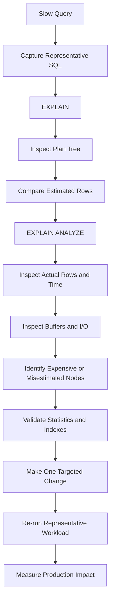

# 06- Execution Plans

## Overview

An **execution plan** describes how a database intends to execute a SQL statement. It exposes the physical operations selected by the query optimizer, including scans, joins, sorts, aggregations, filters, and index access.

Execution plans are one of the most important tools for diagnosing SQL performance because query text alone rarely explains where database time and resources are being spent.

A typical investigation looks like:

```text
SQL Query
   │
   ▼
Query Optimizer
   │
   ▼
Estimated Execution Plan
   │
   ├── Scan strategy
   ├── Join strategy
   ├── Join order
   ├── Sort / Aggregate
   ├── Estimated rows
   └── Estimated cost
   │
   ▼
Optional Runtime Analysis
   │
   ├── Actual time
   ├── Actual rows
   ├── Loops
   ├── Buffer activity
   └── Temporary I/O
```

The important distinction is:

- **Estimated plan** — what the optimizer predicts.
- **Actual execution plan** — what happened while the query executed.

Senior-level SQL performance work focuses on comparing those two views and determining why the optimizer's assumptions differ from production reality.

## Why Execution Plans Matter

A query such as:

```sql
SELECT
    o.id,
    o.total
FROM orders AS o
WHERE o.customer_id = 42
ORDER BY o.created_at DESC
LIMIT 50;
```

does not reveal whether the database:

- Performs a sequential scan.
- Uses an index.
- Reads millions of rows and filters them.
- Uses an index that also satisfies the ordering.
- Sorts a large intermediate result.
- Performs an index-only scan.
- Executes operations in parallel.

The execution plan makes those decisions visible.

This allows engineers to move from:

> "This query is slow."

to:

> "The query is using a sequential scan, estimates 20 rows but processes 4.8 million, and performs a large sort because no useful ordered access path exists."

That distinction is the foundation of systematic query optimization.

## Estimated vs Actual Plans

### Estimated Plan

An estimated plan is generated without executing the query.

PostgreSQL:

```sql
EXPLAIN
SELECT
    o.id,
    o.total
FROM orders AS o
WHERE o.customer_id = 42;
```

This is useful for understanding what the optimizer expects to happen.

### Actual Plan

An actual plan includes runtime measurements.

PostgreSQL:

```sql
EXPLAIN (ANALYZE, BUFFERS)
SELECT
    o.id,
    o.total
FROM orders AS o
WHERE o.customer_id = 42;
```

`ANALYZE` executes the statement, so it must be used carefully with `INSERT`, `UPDATE`, and `DELETE`.

For a read-only query, the output can contain information such as:

```text
Index Scan using idx_orders_customer_id on orders
(cost=0.42..15.31 rows=20 width=64)
(actual time=0.05..0.18 rows=18 loops=1)
```

The optimizer estimated:

```text
rows = 20
```

while execution produced:

```text
actual rows = 18
```

That is a relatively healthy estimate.

## Anatomy of an Execution Plan

Execution plans are generally represented as a tree.

For example:

```text
Limit
└── Index Scan
    └── Index condition: customer_id = 42
```

The lower nodes generally produce data consumed by their parent nodes.

A more complex example:

```text
Limit
└── Sort
    └── Hash Join
        ├── Seq Scan: customers
        └── Hash
            └── Seq Scan: orders
```

Understanding this tree structure is more important than memorizing individual plan node names.

## Common Plan Node Categories

| Category | Examples | Purpose |
|---|---|---|
| Scan | Sequential Scan, Index Scan | Read base table data |
| Join | Nested Loop, Hash Join, Merge Join | Combine relations |
| Sort | Sort, Incremental Sort | Produce required ordering |
| Aggregate | Hash Aggregate, GroupAggregate | Calculate grouped results |
| Filter | Filter, Index Condition | Reduce rows |
| Limit | Limit | Stop after required number of rows |
| Materialization | Materialize | Reuse intermediate results |
| Gather | Gather, Gather Merge | Combine parallel worker results |
| Subquery | SubPlan | Execute dependent subquery operations |

The exact node types depend on the database engine.

## Reading a Plan as a Tree

Consider:

```text
Limit
  -> Index Scan
```

The execution flow is conceptually:

```text
Index Scan
    ↓
produce ordered matching rows
    ↓
Limit
    ↓
return first N rows
```

For:

```text
Hash Join
├── Seq Scan customers
└── Hash
    └── Seq Scan orders
```

the database may:

```text
Scan orders
    ↓
Build hash structure
    ↓
Scan customers
    ↓
Probe hash structure
    ↓
Produce matching rows
```

The exact internal execution strategy is database-specific, but the plan tree provides the high-level execution structure.

## Sequential Scans

A sequential scan reads table pages sequentially.

Example:

```text
Seq Scan on orders
(cost=0.00..1800000.00 rows=90000000)
```

A sequential scan is not inherently bad.

It can be the correct strategy when:

- A large percentage of the table is required.
- The table is small.
- The predicate is not selective.
- Reading pages sequentially is cheaper than many random accesses.
- No useful index exists.

The common mistake is assuming:

> Sequential scan = slow query.

The correct question is:

> Is this scan appropriate for the amount of data the query actually needs?

## Index Scans

An index scan uses an index to locate matching rows.

Example:

```text
Index Scan using idx_orders_customer_id on orders
```

Conceptually:

```text
Query predicate
      ↓
Index
      ↓
Matching row locations
      ↓
Table pages
      ↓
Rows
```

Index scans are often useful for selective predicates, but the optimizer decides whether the index is cheaper than alternatives.

## Index-Only Scans

An index-only scan can sometimes satisfy a query using index data without fetching the corresponding table rows.

For example:

```sql
CREATE INDEX idx_orders_customer_created
ON orders (customer_id, created_at DESC);
```

A query that needs only indexed columns may be eligible for an index-only strategy:

```sql
SELECT
    customer_id,
    created_at
FROM orders
WHERE customer_id = 42
ORDER BY created_at DESC
LIMIT 50;
```

Whether the database can avoid heap/table access depends on the database engine and its visibility or storage metadata.

Index-only scans can significantly reduce I/O, but they should not be assumed merely because all requested columns appear in an index.

## Bitmap Access

PostgreSQL can use bitmap-based access when an ordinary index scan is not the most efficient strategy.

Conceptually:

```text
Index
  ↓
Collect matching page/row locations
  ↓
Build bitmap
  ↓
Read relevant table pages
  ↓
Filter rows
```

Bitmap access can be useful when many rows match but scanning the entire table would still be more expensive.

A plan may contain:

```text
Bitmap Heap Scan
└── Bitmap Index Scan
```

The distinction matters because the database is balancing index traversal against table-page access.

## Join Nodes

Execution plans expose the selected join algorithm.

### Nested Loop

```text
Nested Loop
├── Outer input
└── Inner input
```

Conceptually:

```text
for each row in outer:
    find matching rows in inner
```

It can be excellent when:

```text
outer rows = small
inner lookup = cheap
```

It can become expensive when the outer relation is unexpectedly large.

### Hash Join

```text
Hash Join
├── Input A
└── Hash
    └── Input B
```

Conceptually:

```text
Build hash table
      ↓
Scan other relation
      ↓
Probe hash table
```

Hash joins are commonly effective for large equality joins.

They require memory and can become more expensive when hash structures spill to temporary storage.

### Merge Join

```text
Merge Join
├── Sorted input A
└── Sorted input B
```

The database compares ordered streams and advances through them as matching keys are found.

It can be attractive when inputs are already suitably ordered or sorting is relatively inexpensive.

## Join Order

Execution plans reveal which relations are joined first.

Consider:

```sql
SELECT *
FROM customers AS c
JOIN orders AS o
    ON o.customer_id = c.id
JOIN payments AS p
    ON p.order_id = o.id
WHERE c.country = 'IN';
```

The optimizer may choose:

```text
customers
    ↓
filter country
    ↓
join orders
    ↓
join payments
```

rather than another join ordering.

Join order matters because intermediate result size can dominate total query cost.

## Filters

Execution plans distinguish between filtering performed as part of an access path and filtering performed after rows have been fetched.

For example:

```text
Index Cond:
    customer_id = 42

Filter:
    status = 'completed'
```

The distinction is important.

An `Index Cond` can restrict which index entries are visited.

A `Filter` may mean the database first retrieves candidate rows and then evaluates the additional predicate.

Conceptually:

```text
Index condition
      ↓
Candidate rows
      ↓
Filter condition
      ↓
Output
```

The exact semantics depend on the database engine and plan node.

## Sort Operations

A plan containing:

```text
Sort
```

indicates that ordering work is required.

For:

```sql
SELECT *
FROM orders
ORDER BY created_at DESC
LIMIT 100;
```

the database may either:

```text
Scan
 ↓
Sort
 ↓
Limit
```

or potentially use an appropriate index:

```text
Ordered Index Scan
 ↓
Limit
```

The second strategy can avoid sorting a large result set.

However, an index should not automatically be created for every `ORDER BY`. The workload, selectivity, write cost, and existing indexes must justify it.

## Aggregation Nodes

For:

```sql
SELECT
    customer_id,
    COUNT(*)
FROM orders
GROUP BY customer_id;
```

the plan may contain:

```text
HashAggregate
```

or:

```text
GroupAggregate
└── Sort
```

The choice depends on factors such as:

- Estimated rows.
- Number of groups.
- Available memory.
- Existing ordering.
- Cost model.

## LIMIT and Early Termination

`LIMIT` can significantly affect the optimal plan.

Consider:

```sql
SELECT
    id,
    created_at
FROM orders
WHERE customer_id = 42
ORDER BY created_at DESC
LIMIT 20;
```

An index matching the filtering and ordering requirements may allow the database to stop after finding 20 rows.

Without such an access path, the database might need to process and sort many more rows before applying the limit.

This is particularly important for API endpoints implementing:

- Recent activity feeds.
- Admin tables.
- Search results.
- Pagination.
- Latest-event queries.

## Estimated Cost

A PostgreSQL plan may contain:

```text
(cost=0.42..125.50 rows=100 width=72)
```

The fields represent optimizer estimates.

| Field | Meaning |
|---|---|
| Startup cost | Estimated cost before producing the first row |
| Total cost | Estimated cost to produce all rows |
| Rows | Estimated output cardinality |
| Width | Estimated average row size |

These costs are **not milliseconds**.

Use them to understand optimizer decisions, not as direct latency measurements.

## Actual Runtime Metrics

With:

```sql
EXPLAIN (ANALYZE, BUFFERS)
```

you may see:

```text
(actual time=0.100..25.500 rows=100 loops=1)
```

Important runtime fields include:

| Field | Meaning |
|---|---|
| `actual time` | Measured execution time for the node |
| `actual rows` | Rows produced per loop |
| `loops` | Number of executions of the node |
| `Buffers` | Buffer/cache and I/O activity |
| `Planning Time` | Time spent creating the plan |
| `Execution Time` | Measured execution duration |

A critical detail is that:

```text
total node work ≈ actual time × loops
```

when interpreting repeated nodes, although the exact reporting semantics depend on the database's plan output.

## Estimated Rows vs Actual Rows

One of the highest-value execution-plan checks is:

```text
estimated rows
        vs
actual rows
```

Healthy example:

```text
rows=100
actual rows=95
```

Potentially problematic example:

```text
rows=100
actual rows=5,000,000
```

The second case indicates a major estimation error.

That error can cause downstream decisions such as:

```text
Expected 100 rows
      ↓
Choose Nested Loop
      ↓
Actual 5,000,000 rows
      ↓
Millions of repeated lookups
      ↓
High latency
```

Cardinality estimation errors are often more important than the individual plan node that appears slow.

## Buffers and I/O

For PostgreSQL:

```sql
EXPLAIN (ANALYZE, BUFFERS)
SELECT
    *
FROM orders
WHERE customer_id = 42;
```

Buffer information helps distinguish database-cache behavior from physical I/O.

You may encounter metrics such as:

```text
Buffers:
  shared hit=...
  shared read=...
```

Conceptually:

- **Hit** — required data was already available in shared buffers.
- **Read** — data had to be read into shared buffers.

A query with low execution time on a warm cache may behave differently after cache pressure or during a cold-cache scenario.

This is why performance testing should use representative workload conditions.

## Parallel Execution

Plans may include nodes such as:

```text
Gather
└── Parallel Seq Scan
```

Conceptually:

```text
             Query
               │
             Gather
          ┌────┼────┐
          ▼    ▼    ▼
       Worker Worker Worker
          │    │    │
          └────┼────┘
               ▼
            Results
```

Parallel execution can reduce elapsed time for sufficiently large workloads, but it introduces:

- Worker startup overhead.
- Coordination overhead.
- Additional CPU consumption.
- Possible contention with other queries.
- Additional memory pressure.

A parallel plan is therefore not automatically better.

## Planning Time vs Execution Time

Execution plans can expose:

```text
Planning Time: 0.500 ms
Execution Time: 120.000 ms
```

These represent different phases.

```text
Application
    ↓
Parse / Plan
    ↓
Planning Time
    ↓
Execute
    ↓
Execution Time
    ↓
Return result
```

For ordinary OLTP queries, execution time is often the dominant concern.

However, extremely complex queries, generated SQL, or workloads with frequent replanning can make planning overhead significant.

## Practical PostgreSQL Example

Consider:

```sql
SELECT
    o.id,
    o.total,
    o.created_at
FROM orders AS o
WHERE o.customer_id = 42
  AND o.status = 'completed'
ORDER BY o.created_at DESC
LIMIT 50;
```

An initial investigation should inspect:

```sql
EXPLAIN (ANALYZE, BUFFERS)
SELECT
    o.id,
    o.total,
    o.created_at
FROM orders AS o
WHERE o.customer_id = 42
  AND o.status = 'completed'
ORDER BY o.created_at DESC
LIMIT 50;
```

Suppose the plan reveals:

```text
Seq Scan
    estimated rows: 50
    actual rows: 2,000,000

Sort
    actual rows: 2,000,000

Limit
    actual rows: 50
```

The important observation is not merely:

> "The query has a sort."

The deeper diagnosis is:

```text
Poor cardinality/access path
        ↓
Large row set
        ↓
Large sort
        ↓
LIMIT applied late
        ↓
High execution cost
```

An appropriate composite index might change the access path:

```sql
CREATE INDEX CONCURRENTLY idx_orders_customer_status_created
ON orders (customer_id, status, created_at DESC);
```

The new plan must then be measured rather than assumed to be better.

## Execution Plan Investigation Workflow

Use an evidence-based workflow.



### What to Inspect First

A practical order is:

1. Identify the highest-cost or highest-time operations.
2. Compare estimated and actual row counts.
3. Check join order and join algorithm.
4. Check scan strategy.
5. Look for large sorts or aggregations.
6. Inspect buffer and I/O activity.
7. Check for temporary-file or spill behavior.
8. Validate statistics.
9. Validate indexes.
10. Re-test after one controlled change.

This avoids blindly optimizing individual nodes.

## Execution Plans and ORMs

Frameworks such as Django and SQLAlchemy generate SQL, but the database still controls physical execution.

For Django:

```python
queryset = (
    Order.objects
    .filter(
        customer_id=42,
        status="completed",
    )
    .order_by("-created_at")
    .values("id", "total", "created_at")[:50]
)
```

Inspect the generated SQL and analyze it at the database level.

Django can expose SQL through tooling and logging, while database-native `EXPLAIN` should be used for physical execution analysis.

The complete performance path is:

```text
Python
  ↓
ORM
  ↓
Generated SQL
  ↓
Database parser
  ↓
Optimizer
  ↓
Execution plan
  ↓
Executor
  ↓
Storage / buffers
```

Optimizing only Python code without examining the SQL plan can miss the actual bottleneck.

## Production Considerations

### Run Plans with Representative Data

Execution plans depend on:

- Table size.
- Data distribution.
- Statistics.
- Indexes.
- Configuration.
- Parameter values.
- Cache state.

A plan tested against 10,000 development rows may be irrelevant to a production table containing 500 million rows.

### Use Representative Parameters

Highly skewed data can produce different optimal plans for different parameter values.

For example:

```text
customer_id = 10
    → 20 rows

customer_id = 999
    → 10,000,000 rows
```

Test both when the workload permits.

### Account for Cache State

A query that is fast because all required pages are cached may behave differently under production memory pressure.

Benchmarking should distinguish:

- Warm-cache behavior.
- Cold-cache or cache-pressure behavior.
- Sustained workload behavior.

### Consider Concurrency

A query that takes 100 ms in isolation may behave very differently when executed:

```text
1 request
vs
1,000 concurrent requests
```

Concurrency can amplify:

- CPU contention.
- Buffer pressure.
- Lock contention.
- Connection-pool pressure.
- I/O saturation.
- Temporary storage usage.

### Treat Plans as Workload-Dependent

A plan that is optimal today may become suboptimal after:

- Major data growth.
- Data distribution changes.
- New indexes.
- Dropped indexes.
- Schema changes.
- Database upgrades.
- Configuration changes.

Execution plans should therefore be re-evaluated as workload characteristics change.

## PostgreSQL Plan Safety

`EXPLAIN` does not execute the query:

```sql
EXPLAIN
SELECT ...
```

`EXPLAIN ANALYZE` executes it:

```sql
EXPLAIN ANALYZE
SELECT ...
```

This distinction is critical for writes.

For example:

```sql
EXPLAIN ANALYZE
DELETE FROM orders
WHERE created_at < CURRENT_DATE - INTERVAL '7 years';
```

can actually delete rows.

Never assume that `EXPLAIN ANALYZE` is a dry-run mechanism.

For production write queries, use database-specific safe testing strategies and controlled environments.

## Monitoring Execution Plans in Production

Execution-plan analysis should be connected to workload monitoring.

Track:

- Query latency.
- Query execution frequency.
- Rows returned.
- CPU consumption.
- Buffer activity.
- Physical I/O.
- Temporary I/O.
- Lock waits.
- Connection utilization.
- Plan changes.
- Error rates.

A query taking:

```text
500 ms × 2 executions/hour
```

may matter less than:

```text
20 ms × 100,000 executions/minute
```

Optimization priority should therefore consider **total workload impact**, not only individual query latency.

## Common Mistakes

### Treating Every Sequential Scan as a Bug

Sequential scans are often optimal for large result sets.

### Optimizing Estimated Cost Instead of Actual Performance

Estimated cost is an optimizer metric. Validate changes using actual runtime and resource measurements.

### Looking Only at the Slowest Plan Node

A slow node can be a consequence of an earlier cardinality estimation error.

Trace the plan tree upward and downward.

### Ignoring `loops`

A node taking:

```text
1 ms
```

per execution and running:

```text
100,000 loops
```

is not a 1 ms operation from the workload's perspective.

### Ignoring Cardinality Errors

Large estimated-vs-actual row discrepancies are often strong evidence of why the optimizer selected a poor strategy.

### Adding an Index Without Measuring

Indexes can improve reads but increase:

- Write cost.
- Storage usage.
- Vacuum/maintenance work.
- Backup size.
- DDL complexity.

### Using Production `EXPLAIN ANALYZE` Carelessly

`ANALYZE` executes the statement. This is particularly dangerous for write queries.

### Testing Only with Warm Cache

Cache behavior can hide storage-related performance problems.

### Testing Only One Parameter

Skewed data distributions can produce parameter-sensitive performance.

### Assuming a New Plan Is Automatically Better

A plan may have a different shape while consuming more CPU, I/O, or memory.

Measure the complete workload.

## Interview Traps

| Question | Strong answer |
|---|---|
| What is an execution plan? | A representation of the physical operations the database uses or intends to use to execute a SQL statement. |
| What is the difference between `EXPLAIN` and `EXPLAIN ANALYZE` in PostgreSQL? | `EXPLAIN` shows the estimated plan without executing the statement; `EXPLAIN ANALYZE` executes it and reports actual runtime statistics. |
| Is a sequential scan always bad? | No. It can be optimal when a large portion of a table must be read or when the table is small. |
| What is the most important thing to compare in a plan? | Estimated versus actual cardinality, along with execution time and resource usage. |
| Why can a nested loop become slow? | The optimizer may expect a small outer input, but a much larger actual input causes repeated inner operations. |
| Why might an index not be used? | The optimizer may estimate that another access path, such as a sequential scan, is cheaper. |
| What does `loops` mean? | How many times a plan node was executed. |
| What does `Buffers` tell you in PostgreSQL? | It provides information about shared-buffer hits and reads, helping diagnose memory/cache and I/O behavior. |
| Why can `LIMIT` change the optimal plan? | An access path that can produce the first required rows cheaply may be preferable even if its total cost differs from alternatives. |
| What does a large estimated-vs-actual row discrepancy indicate? | The optimizer's cardinality assumptions may be inaccurate, potentially causing poor downstream plan choices. |
| Why should execution plans be tested with production-like data? | Table size, distribution, statistics, indexes, and parameter selectivity directly affect optimizer decisions. |
| Can a plan change without changing the SQL? | Yes. Statistics, data distribution, indexes, configuration, database versions, and other environmental factors can change plan selection. |
| How do you approach a slow execution plan? | Inspect the plan tree, compare estimated and actual rows, identify expensive operations, validate statistics/indexes, make one targeted change, and measure again. |
| Why is optimizing one query execution insufficient? | Production performance depends on query frequency, concurrency, resource consumption, and interaction with the rest of the workload. |

## Key Takeaways

- **Execution plans expose the database's physical strategy for executing SQL, making scans, joins, sorting, aggregation, and parallelism visible.**
- **The most valuable diagnostic signal is often the difference between estimated and actual rows; cardinality errors can cascade into poor plan decisions.**
- **`EXPLAIN` shows estimated behavior, while `EXPLAIN ANALYZE` measures actual execution and must be used carefully because it executes the statement.**
- **A good execution plan is workload-dependent; evaluate latency, CPU, I/O, memory, concurrency, and representative data rather than optimizing plan shape alone.**
- **Senior-level SQL tuning is an evidence-driven loop: inspect the plan, identify the incorrect assumption or expensive operation, make one targeted change, and measure the production impact.**