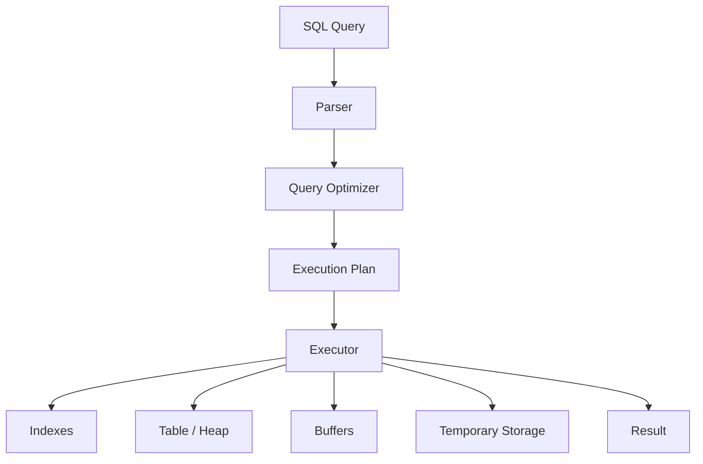
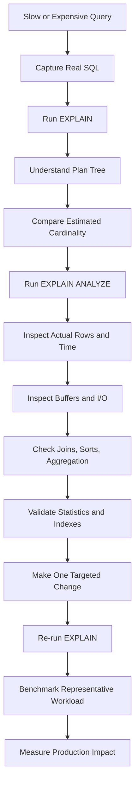

# 07- EXPLAIN

## Overview

`EXPLAIN` is the primary SQL diagnostic tool for understanding how a database plans to execute a query. It exposes the optimizer's chosen access paths and execution operators, allowing engineers to investigate scans, joins, sorting, aggregation, cardinality estimates, costs, and—when requested—actual runtime behavior.

For production backend systems, `EXPLAIN` should be part of the normal workflow for investigating slow or resource-intensive SQL rather than relying on query text alone.

In PostgreSQL, the most commonly used forms are:

```sql
EXPLAIN
SELECT *
FROM orders
WHERE customer_id = 42;
```

and:

```sql
EXPLAIN (ANALYZE, BUFFERS)
SELECT *
FROM orders
WHERE customer_id = 42;
```

The critical distinction is:

| Command | Executes query? | Estimated plan | Actual runtime | Buffer information |
|---|---:|---:|---:|---:|
| `EXPLAIN` | No | Yes | No | No |
| `EXPLAIN (ANALYZE)` | Yes | Yes | Yes | No |
| `EXPLAIN (BUFFERS)` | No | Yes | No | Yes |
| `EXPLAIN (ANALYZE, BUFFERS)` | Yes | Yes | Yes | Yes |

`EXPLAIN` is especially valuable because query performance depends on decisions that are invisible in the SQL statement itself.

## What `EXPLAIN` Reveals

A query such as:

```sql
SELECT
    o.id,
    o.total
FROM orders AS o
WHERE o.customer_id = 42
ORDER BY o.created_at DESC
LIMIT 50;
```

does not tell you whether PostgreSQL will:

- Perform a sequential scan.
- Use an index.
- Use a bitmap access path.
- Sort rows explicitly.
- Use an existing index for ordering.
- Execute joins using nested loops, hash joins, or merge joins.
- Execute parts of the query in parallel.
- Process significantly more rows than expected.

`EXPLAIN` makes those decisions visible.

Conceptually:



This gives an engineer a concrete model for diagnosing database performance.

## Basic Syntax

The simplest form is:

```sql
EXPLAIN
SELECT
    id,
    total
FROM orders
WHERE customer_id = 42;
```

A typical result might look like:

```text
Index Scan using idx_orders_customer_id on orders
  (cost=0.42..15.31 rows=20 width=40)
```

The plan tells you that PostgreSQL expects an index scan and provides optimizer estimates.

For runtime analysis:

```sql
EXPLAIN ANALYZE
SELECT
    id,
    total
FROM orders
WHERE customer_id = 42;
```

A result might contain:

```text
Index Scan using idx_orders_customer_id on orders
  (cost=0.42..15.31 rows=20 width=40)
  (actual time=0.05..0.18 rows=18 loops=1)
```

Now the plan contains both estimates and measurements.

## `EXPLAIN` vs `EXPLAIN ANALYZE`

### `EXPLAIN`

Use:

```sql
EXPLAIN
SELECT ...
```

when you want to inspect the optimizer's expected strategy without executing the query.

Advantages:

- Safe for write statements because the statement is not executed.
- Fast to obtain.
- Useful for understanding optimizer decisions.
- Suitable for initial investigation.

Limitations:

- Does not show actual runtime.
- Does not reveal actual row counts.
- Cannot directly show whether estimates are accurate.
- Cannot expose runtime-only behavior such as actual buffer activity.

### `EXPLAIN ANALYZE`

Use:

```sql
EXPLAIN ANALYZE
SELECT ...
```

when actual execution behavior is required.

It provides:

- Actual execution time.
- Actual row counts.
- Loop counts.
- Runtime plan behavior.

However, `ANALYZE` executes the query.

This is critical:

```sql
EXPLAIN ANALYZE
DELETE FROM orders
WHERE created_at < CURRENT_DATE - INTERVAL '7 years';
```

can actually delete rows.

`EXPLAIN ANALYZE` is therefore **not a dry-run mechanism** for writes.

For destructive or production-critical operations, use a controlled environment or another database-specific safe validation strategy.

## Understanding the Plan Tree

Execution plans are trees.

For example:

```text
Limit
└── Index Scan
```

The lower node provides rows to the parent:

```text
Index Scan
     ↓
matching rows
     ↓
Limit
     ↓
first N rows
```

A more complex plan might look like:

```text
Limit
└── Sort
    └── Hash Join
        ├── Seq Scan on customers
        └── Hash
            └── Seq Scan on orders
```

When reading a plan, understand:

1. Which node produces the data.
2. Which node consumes it.
3. How many rows flow between nodes.
4. Where filtering occurs.
5. Where sorting or aggregation occurs.
6. Which operation consumes the most time or resources.

Do not simply search for a node called `Seq Scan` or `Sort` and declare it the problem.

## Important `EXPLAIN` Fields

A PostgreSQL plan commonly contains:

```text
(cost=0.42..125.50 rows=100 width=72)
(actual time=0.10..25.50 rows=95 loops=1)
```

### Startup Cost

The first number:

```text
0.42
```

is the estimated startup cost before the node can begin producing useful output.

It is an optimizer cost unit, not milliseconds.

### Total Cost

The second number:

```text
125.50
```

is the estimated cost of producing all rows from the node.

Again, it is not a duration in milliseconds.

### Estimated Rows

```text
rows=100
```

is the optimizer's expected number of output rows.

This value is extremely important because downstream plan decisions depend on cardinality estimates.

### Width

```text
width=72
```

is the estimated average row width in bytes.

It contributes to estimates involving memory, sorting, hashing, and data movement.

### Actual Time

With `ANALYZE`:

```text
actual time=0.10..25.50
```

represents measured execution time for the node.

The first value represents startup behavior and the second represents the time by which the reported rows were produced.

### Actual Rows

```text
rows=95
```

shows how many rows were actually produced per loop.

### Loops

```text
loops=1
```

shows how many times the node was executed.

A node executed many times can be expensive even when its individual execution time looks small.

## Estimated vs Actual Rows

One of the most useful techniques when reading an actual execution plan is comparing:

```text
estimated rows
        vs
actual rows
```

Healthy example:

```text
rows=100
actual rows=95
```

Potentially problematic example:

```text
rows=100
actual rows=5,000,000
```

The second case means the optimizer significantly underestimated the number of rows.

That can cause poor downstream choices:

```text
Estimated: 100 rows
        ↓
Nested Loop appears cheap
        ↓
Actual: 5,000,000 rows
        ↓
Millions of inner lookups
        ↓
High CPU / I/O / latency
```

This is why cardinality estimation is often more important than simply identifying the visually largest plan node.

## Sequential Scans

A sequential scan reads table pages sequentially.

Example:

```text
Seq Scan on orders
  (cost=0.00..1800000.00 rows=90000000)
```

A sequential scan is not inherently a performance problem.

It may be optimal when:

- The query needs a large percentage of the table.
- The table is small.
- The predicate is not selective.
- Sequential page access is cheaper than random index lookups.
- No useful index exists.

The incorrect rule is:

> Never allow sequential scans.

The correct rule is:

> Determine whether the sequential scan is appropriate for the amount of data the query needs.

## Index Scans

An index scan uses an index to locate qualifying rows.

Example:

```text
Index Scan using idx_orders_customer_id on orders
```

Conceptually:

```text
Predicate
   ↓
Index
   ↓
Matching index entries
   ↓
Table rows
   ↓
Result
```

Index scans are often useful for selective queries, but PostgreSQL may deliberately choose a sequential scan when it estimates that the index path will cost more.

## Bitmap Scans

PostgreSQL can use bitmap access when many rows match a predicate but reading the entire table would still be inefficient.

A typical structure is:

```text
Bitmap Heap Scan
└── Bitmap Index Scan
```

Conceptually:

```text
Index
  ↓
Matching locations
  ↓
Bitmap
  ↓
Relevant table pages
  ↓
Rows
```

Bitmap access can be effective for moderately selective queries because it can organize table-page access more efficiently than repeatedly performing random heap lookups.

## Index-Only Scans

An index-only scan can sometimes satisfy a query directly from an index without fetching the corresponding table rows.

For example:

```sql
CREATE INDEX idx_orders_customer_created
ON orders (customer_id, created_at DESC);
```

A query such as:

```sql
SELECT
    customer_id,
    created_at
FROM orders
WHERE customer_id = 42
ORDER BY created_at DESC
LIMIT 50;
```

may be eligible for an index-only scan.

Whether PostgreSQL can actually avoid heap access also depends on visibility information maintained for the table.

Therefore:

> All selected columns being present in an index does not guarantee an index-only scan.

## Sort Operations

A plan containing:

```text
Sort
```

means PostgreSQL needs to produce ordered output.

For:

```sql
SELECT
    id,
    created_at
FROM orders
ORDER BY created_at DESC
LIMIT 100;
```

one possible strategy is:

```text
Seq Scan
   ↓
Sort
   ↓
Limit
```

An appropriate index may allow:

```text
Index Scan
   ↓
Limit
```

which can avoid sorting a large intermediate result.

However, creating an index solely to remove a sort should be justified by the workload.

## Join Operations

`EXPLAIN` exposes the selected join algorithm.

### Nested Loop

Example:

```text
Nested Loop
├── Outer Input
└── Inner Input
```

Conceptually:

```text
for each outer row:
    find matching inner rows
```

Nested loops can be excellent when:

- The outer input is small.
- The inner side has an efficient index.
- The query is highly selective.

They can become very expensive when the outer input is much larger than estimated.

### Hash Join

Example:

```text
Hash Join
├── Input
└── Hash
    └── Input
```

Conceptually:

```text
Build hash structure
       ↓
Scan other relation
       ↓
Probe hash structure
       ↓
Matching rows
```

Hash joins are commonly effective for large equality joins.

They require memory, and memory pressure can cause additional I/O.

### Merge Join

Example:

```text
Merge Join
├── Sorted Input A
└── Sorted Input B
```

The join processes ordered inputs and advances through them as matching keys are found.

Merge joins can be effective when inputs are already suitably ordered or sorting them is inexpensive.

## Filtering

Execution plans can distinguish between predicates used to access data and predicates applied after candidate rows have been retrieved.

For example:

```text
Index Cond:
    customer_id = 42

Filter:
    status = 'completed'
```

Conceptually:

```text
Index condition
      ↓
Candidate rows
      ↓
Filter
      ↓
Output
```

A filter applied after row retrieval may indicate that the access path is broader than the final predicate.

This does not automatically mean the query is poorly indexed, but it is worth investigating when a large number of rows are removed by the filter.

## Aggregation

For:

```sql
SELECT
    customer_id,
    COUNT(*)
FROM orders
GROUP BY customer_id;
```

PostgreSQL may choose an aggregation strategy such as:

```text
HashAggregate
```

or:

```text
GroupAggregate
└── Sort
```

The optimizer considers factors such as:

- Estimated input rows.
- Number of groups.
- Memory availability.
- Existing ordering.
- Estimated cost.

Large aggregation workloads should be examined for memory pressure and temporary I/O.

## `LIMIT` and Early Termination

`LIMIT` can strongly influence the optimal plan.

Consider:

```sql
SELECT
    id,
    created_at
FROM orders
WHERE customer_id = 42
ORDER BY created_at DESC
LIMIT 20;
```

If an index can efficiently provide rows in the requested order, PostgreSQL may be able to stop after finding 20 qualifying rows.

Without an appropriate access path, it may need to process and sort substantially more data.

This is particularly important for backend APIs implementing:

- Recent activity.
- Latest events.
- Admin dashboards.
- Search results.
- Pagination.
- User timelines.

## Buffer Analysis

For PostgreSQL, use:

```sql
EXPLAIN (ANALYZE, BUFFERS)
SELECT
    *
FROM orders
WHERE customer_id = 42;
```

Buffer information helps identify memory/cache and I/O behavior.

Common metrics include:

```text
Buffers:
  shared hit=...
  shared read=...
```

Generally:

| Metric | Meaning |
|---|---|
| `shared hit` | Data was already available in PostgreSQL shared buffers |
| `shared read` | Data had to be read into PostgreSQL shared buffers |
| `temp read` | Temporary data was read |
| `temp written` | Temporary data was written |

A query that is fast with a warm cache may behave differently under production cache pressure.

Therefore, benchmark queries under representative workload conditions.

## Planning Time and Execution Time

An actual plan may end with:

```text
Planning Time: 0.450 ms
Execution Time: 25.300 ms
```

These are separate phases.

```mermaid
sequenceDiagram
    participant App as Backend Application
    participant DB as PostgreSQL
    participant Opt as Optimizer
    participant Exec as Executor
    participant Storage as Storage

    App->>DB: SQL query
    DB->>Opt: Parse / optimize
    Opt-->>DB: Execution plan
    DB->>Exec: Execute plan
    Exec->>Storage: Read indexes / table pages
    Storage-->>Exec: Data
    Exec-->>DB: Result rows
    DB-->>App: Result
```

For typical OLTP workloads, execution time is usually more significant than planning time.

Planning overhead can become important for:

- Very complex SQL.
- Frequently executed dynamically generated queries.
- Large query structures.
- Workloads where execution itself is extremely cheap.

## Parallel Plans

`EXPLAIN` may show:

```text
Gather
└── Parallel Seq Scan
```

Conceptually:

```text
                 Query
                   │
                Gather
             ┌─────┼─────┐
             ▼     ▼     ▼
          Worker Worker Worker
             │     │     │
             └─────┼─────┘
                   ▼
                Results
```

Parallel execution can reduce elapsed time for sufficiently large operations.

However, it can also increase:

- CPU consumption.
- Memory usage.
- Worker coordination overhead.
- Resource contention.

A parallel plan should therefore be evaluated against the entire workload rather than assumed to be better.

## Practical Query Investigation

Consider:

```sql
SELECT
    o.id,
    o.total,
    o.created_at
FROM orders AS o
WHERE o.customer_id = 42
  AND o.status = 'completed'
ORDER BY o.created_at DESC
LIMIT 50;
```

Start with:

```sql
EXPLAIN
SELECT
    o.id,
    o.total,
    o.created_at
FROM orders AS o
WHERE o.customer_id = 42
  AND o.status = 'completed'
ORDER BY o.created_at DESC
LIMIT 50;
```

If the plan looks suspicious, collect runtime information:

```sql
EXPLAIN (ANALYZE, BUFFERS)
SELECT
    o.id,
    o.total,
    o.created_at
FROM orders AS o
WHERE o.customer_id = 42
  AND o.status = 'completed'
ORDER BY o.created_at DESC
LIMIT 50;
```

Suppose the result reveals:

```text
Seq Scan
  estimated rows: 50
  actual rows: 2,000,000

Sort
  actual rows: 2,000,000

Limit
  actual rows: 50
```

The correct diagnosis is not simply:

> "There is a sort."

The more useful reasoning is:

```text
Large candidate set
      ↓
Poor access path
      ↓
Large sort
      ↓
LIMIT applied after expensive work
      ↓
High latency
```

A potentially appropriate index might be:

```sql
CREATE INDEX CONCURRENTLY idx_orders_customer_status_created
ON orders (customer_id, status, created_at DESC);
```

The index should then be validated with a new execution plan and representative workload.

Creating the index is a hypothesis, not proof of an optimization.

## Useful PostgreSQL Options

PostgreSQL provides several `EXPLAIN` options.

| Option | Purpose |
|---|---|
| `ANALYZE` | Execute the statement and report actual runtime statistics |
| `BUFFERS` | Report buffer and temporary I/O activity |
| `VERBOSE` | Show additional plan details |
| `COSTS` | Show estimated costs |
| `SETTINGS` | Show relevant non-default planner settings |
| `WAL` | Show WAL generation information for applicable operations |
| `TIMING` | Report per-node timing information |
| `SUMMARY` | Include planning and execution summaries |
| `FORMAT JSON` | Return machine-readable JSON output |

Example:

```sql
EXPLAIN (
    ANALYZE,
    BUFFERS,
    SETTINGS,
    FORMAT JSON
)
SELECT
    id,
    total
FROM orders
WHERE customer_id = 42;
```

JSON output can be useful for automated analysis and CI/CD tooling.

## `EXPLAIN` Output Formats

PostgreSQL supports formats including:

```sql
EXPLAIN (FORMAT TEXT)
SELECT * FROM orders;
```

```sql
EXPLAIN (FORMAT JSON)
SELECT * FROM orders;
```

```sql
EXPLAIN (FORMAT YAML)
SELECT * FROM orders;
```

```sql
EXPLAIN (FORMAT XML)
SELECT * FROM orders;
```

Text is usually easiest for manual investigation.

JSON is useful when execution plans need to be:

- Parsed programmatically.
- Stored for comparison.
- Analyzed by tooling.
- Integrated into performance automation.

## Using `EXPLAIN` with ORMs

Modern backend applications often generate SQL through an ORM.

For example, Django:

```python
queryset = (
    Order.objects
    .filter(
        customer_id=42,
        status="completed",
    )
    .order_by("-created_at")
    .values("id", "total", "created_at")[:50]
)
```

The ORM expression is only one layer of the execution path:

```text
Python
   ↓
ORM
   ↓
Generated SQL
   ↓
PostgreSQL parser
   ↓
Optimizer
   ↓
Execution plan
   ↓
Executor
   ↓
Storage
```

Django provides query inspection facilities, including:

```python
print(queryset.explain())
```

For deeper diagnosis, use database-native `EXPLAIN` options appropriate to the investigation.

The key principle is:

> ORM optimization and database execution-plan optimization are related but different tasks.

Reducing Python overhead does not fix a database query that performs millions of unnecessary row operations.

## Parameter-Sensitive Investigation

The optimal plan can depend on parameter values.

Consider:

```text
customer_id = 42
    → 20 matching rows

customer_id = 999
    → 10,000,000 matching rows
```

An index-based strategy may be excellent for the first case but much less attractive for the second.

When diagnosing a parameterized query, test representative values.

Do not assume that a single execution plan explains all production executions.

## Production Investigation Workflow

A disciplined workflow is:



A practical checklist:

1. Capture the actual SQL generated by the application.
2. Run `EXPLAIN` first.
3. Understand the plan tree.
4. Identify large cardinality differences.
5. Run `EXPLAIN (ANALYZE, BUFFERS)` where safe.
6. Identify expensive operators.
7. Check buffer and temporary I/O behavior.
8. Validate indexes and statistics.
9. Test representative parameter values.
10. Make one targeted change.
11. Re-run the plan.
12. Measure the effect under representative concurrency.

This avoids making multiple changes simultaneously and losing causal information.

## Production Safety

### Read Queries

For a read-only query:

```sql
EXPLAIN (ANALYZE, BUFFERS)
SELECT ...
```

is generally safe from a data-modification perspective because the underlying statement is read-only.

It can still consume substantial CPU, memory, and I/O.

Therefore, running expensive `ANALYZE` workloads against production should be deliberate.

### Write Queries

Never assume:

```sql
EXPLAIN ANALYZE
UPDATE ...
```

is harmless.

`ANALYZE` executes the statement.

For production writes:

- Prefer a staging or production-like environment.
- Use controlled test data.
- Use transactions where appropriate for safe validation.
- Understand trigger and side-effect behavior.
- Verify whether the statement can modify external state through database mechanisms.

## Common Mistakes

### Assuming `EXPLAIN` Gives Actual Runtime

It does not.

```sql
EXPLAIN
SELECT ...
```

shows estimates.

Use:

```sql
EXPLAIN ANALYZE
SELECT ...
```

for actual execution measurements.

### Treating Cost as Milliseconds

This:

```text
cost=0.42..125.50
```

does not mean:

```text
0.42 ms → 125.50 ms
```

Costs are optimizer units used for comparing possible plans.

### Assuming Sequential Scans Are Bad

A sequential scan can be the optimal strategy for large result sets.

### Ignoring Cardinality Estimates

A query estimated at 100 rows but actually producing millions can cause poor join and access-path decisions.

### Ignoring `loops`

A node that takes:

```text
0.2 ms
```

but executes:

```text
100,000 loops
```

can represent substantial workload cost.

### Looking Only for Expensive Nodes

The visible expensive operation may be a consequence of an earlier estimation or access-path problem.

### Running `EXPLAIN ANALYZE` on Destructive Statements

This can modify production data.

### Testing Only Development Data

Plans can change dramatically with:

- Table size.
- Data distribution.
- Statistics.
- Indexes.
- Parameter selectivity.
- Configuration.

### Testing Only Warm Cache

A query can appear fast because required pages are already cached.

### Assuming an Index Will Be Used

PostgreSQL's optimizer may legitimately prefer another strategy.

### Making Multiple Changes at Once

If you change:

- SQL.
- Indexes.
- Statistics.
- Configuration.

simultaneously, it becomes difficult to determine which change actually improved or degraded performance.

## Performance and Scalability Considerations

Execution-plan analysis should consider more than individual latency.

A query taking:

```text
500 ms × 2 executions/hour
```

may be less important than:

```text
20 ms × 100,000 executions/minute
```

Production optimization should consider:

- Query frequency.
- CPU consumption.
- Logical and physical I/O.
- Memory pressure.
- Temporary I/O.
- Lock contention.
- Connection-pool usage.
- Concurrent workload.
- Data growth.
- Cache behavior.

For high-throughput backend services, a small inefficiency multiplied by a large request volume can become a major infrastructure cost.

## Monitoring and Operations

Execution plans are most useful when combined with workload-level monitoring.

Track:

- Query latency.
- Query frequency.
- Rows processed.
- CPU usage.
- Buffer hits.
- Physical reads.
- Temporary-file activity.
- Lock waits.
- Connection utilization.
- Plan changes.
- Error rates.

For PostgreSQL workloads, tools such as `pg_stat_statements` can help identify high-impact queries before using `EXPLAIN` for detailed investigation.

A practical workflow is:

```text
Workload monitoring
       ↓
Identify expensive query
       ↓
EXPLAIN
       ↓
EXPLAIN ANALYZE
       ↓
Diagnose plan
       ↓
Optimize
       ↓
Measure again
```

This is more reliable than manually inspecting random SQL statements.

## Interview Traps

| Question | Strong answer |
|---|---|
| What does `EXPLAIN` do? | It shows the optimizer's planned execution strategy for a SQL statement. |
| Does `EXPLAIN` execute the query in PostgreSQL? | No. `EXPLAIN ANALYZE` executes it. |
| What is the biggest danger of `EXPLAIN ANALYZE`? | It actually executes the underlying statement, which can modify data for writes. |
| Are PostgreSQL cost values milliseconds? | No. They are optimizer cost units used to compare execution strategies. |
| What should you compare in an actual plan? | Estimated vs actual rows, execution time, loops, I/O, and resource consumption. |
| Is a sequential scan always bad? | No. It can be optimal when a large portion of a table is needed or the table is small. |
| Why can a nested loop become unexpectedly expensive? | The optimizer may underestimate the outer relation, causing many more inner lookups than expected. |
| What does `BUFFERS` provide? | Buffer hit/read information and temporary I/O details useful for diagnosing memory and storage behavior. |
| Why are estimated rows important? | Cardinality estimates influence join order, join algorithms, scan strategies, and other optimizer decisions. |
| Can the same SQL have different plans? | Yes. Statistics, data distribution, indexes, configuration, parameter values, and database versions can affect plan selection. |
| Why should production-like data be used? | Table size and data distribution strongly influence optimizer estimates and plan choices. |
| Is an index always faster than a sequential scan? | No. For sufficiently large result sets, sequential access can be cheaper. |
| What does `loops` tell you? | How many times a plan node was executed. |
| What is a good SQL tuning workflow? | Inspect the plan, compare estimates with actuals, identify the root cause, make one targeted change, and measure again. |

## Key Takeaways

- **`EXPLAIN` reveals the optimizer's execution strategy; `EXPLAIN ANALYZE` additionally executes the query and reports actual runtime behavior.**
- **Estimated-versus-actual row counts are critical because cardinality errors can lead to poor scan, join, sort, and aggregation decisions.**
- **PostgreSQL cost values are optimizer units, not milliseconds; use actual timing, buffers, I/O, and workload metrics to validate performance.**
- **Execution-plan analysis must account for realistic data, parameters, cache state, concurrency, and query frequency rather than evaluating a query in isolation.**
- **Use `EXPLAIN` as an evidence-driven tuning tool: inspect, measure, make one targeted change, re-plan, and validate the impact.**