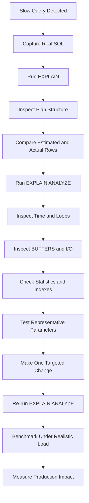

# 08- EXPLAIN ANALYZE

## Overview

`EXPLAIN ANALYZE` is PostgreSQL's primary mechanism for measuring how a SQL statement actually executes. Unlike plain `EXPLAIN`, which reports the optimizer's estimated plan, `EXPLAIN ANALYZE` executes the statement and adds observed runtime information such as actual row counts, execution time, loop counts, and—when combined with `BUFFERS`—I/O behavior.

It is one of the most important tools for production SQL performance investigation because it lets engineers compare:

```text
Optimizer expectations
        ↓
Actual execution behavior
```

That comparison exposes problems such as inaccurate cardinality estimates, inefficient join strategies, excessive scans, unexpected sorts, repeated nested-loop work, and I/O pressure.

The most common diagnostic form is:

```sql
EXPLAIN (ANALYZE, BUFFERS)
SELECT
    id,
    total,
    created_at
FROM orders
WHERE customer_id = 42
ORDER BY created_at DESC
LIMIT 50;
```

The critical operational rule is:

> `EXPLAIN ANALYZE` executes the underlying SQL statement.

This makes it extremely useful for reads and potentially dangerous for `INSERT`, `UPDATE`, `DELETE`, and other statements with side effects.

## `EXPLAIN` vs `EXPLAIN ANALYZE`

| Capability | `EXPLAIN` | `EXPLAIN ANALYZE` |
|---|---:|---:|
| Shows execution plan | Yes | Yes |
| Shows optimizer estimates | Yes | Yes |
| Executes statement | No | Yes |
| Actual row counts | No | Yes |
| Actual execution timing | No | Yes |
| Loop counts | No | Yes |
| Runtime behavior | No | Yes |
| Suitable for destructive SQL without precautions | Safer | Potentially dangerous |

Plain `EXPLAIN`:

```sql
EXPLAIN
SELECT *
FROM orders
WHERE customer_id = 42;
```

Actual execution:

```sql
EXPLAIN ANALYZE
SELECT *
FROM orders
WHERE customer_id = 42;
```

For deeper investigation:

```sql
EXPLAIN (ANALYZE, BUFFERS)
SELECT *
FROM orders
WHERE customer_id = 42;
```

`BUFFERS` is especially useful for determining whether the query is primarily benefiting from cached pages or performing significant physical reads.

## What `EXPLAIN ANALYZE` Measures

An actual PostgreSQL plan can contain information similar to:

```text
Index Scan using idx_orders_customer_id on orders
  (cost=0.42..15.31 rows=20 width=72)
  (actual time=0.041..0.127 rows=18 loops=1)
```

The two sets of values answer different questions.

| Value | Meaning |
|---|---|
| `cost` | Optimizer estimate used for comparing plans |
| `rows` before `actual` | Estimated output rows |
| `width` | Estimated average row width |
| `actual time` | Measured execution time for the node |
| `actual rows` | Rows actually emitted per loop |
| `loops` | Number of times the node executed |

The most important diagnostic comparison is often:

```text
estimated rows
      vs
actual rows
```

For example:

```text
rows=100
actual rows=95
```

is generally much less concerning than:

```text
rows=100
actual rows=5,000,000
```

The second case indicates a major cardinality-estimation error that can affect subsequent optimizer decisions.

## Reading an Execution Plan

Execution plans are trees.

Example:

```text
Limit
└── Index Scan
```

The child node produces rows for the parent:

```text
Index Scan
     ↓
matching rows
     ↓
Limit
     ↓
result
```

A more complex plan:

```text
Limit
└── Sort
    └── Hash Join
        ├── Seq Scan on customers
        └── Hash
            └── Seq Scan on orders
```

Read the tree from the bottom upward to understand how rows are produced, while using the actual timing and row counts to determine where the workload is being spent.

A useful investigation asks:

1. How many rows were expected?
2. How many rows were actually produced?
3. How many times did the node execute?
4. How much time did it consume?
5. How much data did it read?
6. Why did the optimizer choose this strategy?
7. Is the expensive node the root cause or a consequence of an earlier mistake?

## Actual Time

A node may report:

```text
(actual time=0.100..25.500 rows=1000 loops=1)
```

The two timing values represent the node's startup and total timing behavior.

Do not interpret every node's second timing value as an independent cost that can simply be added together. Parent nodes include work performed by their child nodes.

For example:

```text
Hash Join
  actual time=10..100
```

contains work associated with its child nodes.

Instead, investigate where time is concentrated in the execution tree and understand the relationship between parent and child operations.

## Actual Rows

Actual row counts are among the most valuable pieces of information in an execution plan.

Consider:

```text
Index Scan
  (cost=0.42..50.00 rows=100)
  (actual time=0.03..5.00 rows=10000 loops=1)
```

The optimizer expected:

```text
100 rows
```

but received:

```text
10,000 rows
```

That 100× difference can cause downstream operators to behave very differently from what the optimizer expected.

For example:

```text
Bad cardinality estimate
        ↓
Nested Loop selected
        ↓
Actual outer rows much larger
        ↓
Inner scan repeated many times
        ↓
CPU + I/O increase
        ↓
High query latency
```

## Loops

`loops` indicates how many times a plan node executed.

Consider:

```text
Index Scan
  (actual time=0.02..0.03 rows=5 loops=10000)
```

The individual execution appears inexpensive, but the node ran 10,000 times.

When evaluating repeated work, consider:

```text
effective work ≈ per-loop work × loops
```

For nested loops, this is particularly important.

A plan node that takes a small amount of time per invocation can become expensive when invoked thousands or millions of times.

## Nested Loop Analysis

A nested loop conceptually behaves like:

```text
for each row in outer input:
    execute inner operation
```

Example:

```text
Nested Loop
├── Index Scan on customers
└── Index Scan on orders
```

This can be excellent when the outer side is small and the inner lookup is indexed.

It becomes dangerous when the optimizer underestimates the outer relation.

Example:

```text
Estimated outer rows: 10
Actual outer rows: 1,000,000
```

If the inner operation executes once for every outer row, the plan may perform approximately one million inner operations.

When investigating a nested loop, always inspect:

- Outer estimated rows.
- Outer actual rows.
- Inner estimated rows.
- Inner actual rows.
- Inner `loops`.
- Inner execution time.

Do not conclude that "nested loop is bad." Determine whether the number of repeated operations is appropriate.

## Sequential Scan Analysis

A sequential scan is not inherently a performance problem.

Example:

```text
Seq Scan on orders
  (cost=0.00..1800000.00 rows=90000000)
  (actual time=0.010..4200.000 rows=90000000 loops=1)
```

A sequential scan can be optimal when:

- Most of the table is required.
- The table is small.
- The predicate is not selective.
- Reading the table sequentially is cheaper than random index access.

The right question is:

> Did PostgreSQL choose the cheapest access strategy for the amount of data this query actually needs?

If a query expects 20 rows but scans millions, investigate indexes, predicates, statistics, and data distribution.

## Index Scan Analysis

Example:

```text
Index Scan using idx_orders_customer_id on orders
  (cost=0.42..500.00 rows=100)
  (actual time=0.05..120.00 rows=100000 loops=1)
```

An index scan can still be expensive if the predicate matches many rows.

An index is not automatically beneficial merely because it appears in the plan.

Investigate:

- Selectivity.
- Number of heap fetches.
- Actual rows.
- Required columns.
- Ordering requirements.
- Cache behavior.
- Query frequency.

The objective is not:

> "Make every query use an index."

The objective is:

> "Choose an access path appropriate for the workload."

## Bitmap Heap Scans

A common PostgreSQL pattern is:

```text
Bitmap Heap Scan
└── Bitmap Index Scan
```

The index identifies matching tuple locations, and PostgreSQL uses that information to access relevant table pages.

`EXPLAIN ANALYZE` can reveal whether this strategy is effective.

When investigating a bitmap plan, pay attention to:

- Estimated vs actual rows.
- Heap blocks accessed.
- Buffer activity.
- Number of rows removed by filters.
- Whether the bitmap became lossy.

Bitmap scans can be an appropriate middle ground between a highly selective index scan and a full sequential scan.

## Sort Analysis

Consider:

```text
Sort
  (cost=...)
  (actual time=500.000..700.000 rows=2000000 loops=1)
```

The sort may be expensive because PostgreSQL has to order a large intermediate result.

With:

```sql
EXPLAIN (ANALYZE, BUFFERS)
SELECT
    id,
    created_at
FROM orders
ORDER BY created_at DESC
LIMIT 100;
```

an appropriate index might allow PostgreSQL to produce rows in the required order and stop after 100 rows.

However, do not automatically create an index for every `Sort`.

Determine:

- How many rows are being sorted.
- Whether the sort is spilling to disk.
- Whether the ordering is required.
- Whether an index can provide useful ordering.
- Whether the query frequency justifies the index.

## Temporary I/O and Memory Pressure

Sorts and hash operations may require substantial memory.

With:

```sql
EXPLAIN (ANALYZE, BUFFERS)
SELECT
    customer_id,
    COUNT(*)
FROM orders
GROUP BY customer_id;
```

you may see temporary buffer activity when an operation spills to temporary storage.

Example:

```text
Buffers:
  shared hit=50000
  shared read=10000
  temp read=20000
  temp written=22000
```

Temporary I/O can indicate that operations such as sorting or hashing exceeded available working memory for that operation.

Do not respond by blindly increasing `work_mem`.

Higher memory settings can multiply across:

- Concurrent sessions.
- Parallel workers.
- Multiple plan nodes.
- Multiple simultaneous queries.

Memory changes should be evaluated against concurrency and overall database resource limits.

## `BUFFERS`

For PostgreSQL performance analysis, this is often the most useful form:

```sql
EXPLAIN (ANALYZE, BUFFERS)
SELECT
    id,
    total
FROM orders
WHERE customer_id = 42;
```

Common metrics include:

| Metric | Meaning |
|---|---|
| `shared hit` | Page was found in PostgreSQL shared buffers |
| `shared read` | Page had to be read into shared buffers |
| `shared dirtied` | Shared page was modified |
| `shared written` | Shared page was written |
| `temp read` | Temporary blocks were read |
| `temp written` | Temporary blocks were written |

A query with many `shared hit` blocks may be largely served from PostgreSQL's buffer cache.

A query with substantial `shared read` activity may be more I/O-dependent.

Buffer metrics should be interpreted with system-level metrics such as:

- Disk latency.
- IOPS.
- CPU utilization.
- Memory pressure.
- Cache behavior.
- Concurrent workload.

## `TIMING`

PostgreSQL can report per-node timing information:

```sql
EXPLAIN (
    ANALYZE,
    BUFFERS,
    TIMING
)
SELECT *
FROM orders
WHERE customer_id = 42;
```

Per-node timing provides detailed visibility but can introduce measurement overhead.

For very fast queries executed many times, the instrumentation overhead may become significant relative to the query itself.

When precise timing is not required, disabling detailed timing can reduce overhead:

```sql
EXPLAIN (
    ANALYZE,
    BUFFERS,
    TIMING OFF
)
SELECT *
FROM orders
WHERE customer_id = 42;
```

`TIMING OFF` still reports actual row counts and loop information while reducing per-node timing instrumentation overhead.

## `WAL`

For write-heavy operations, PostgreSQL can report WAL-related information:

```sql
EXPLAIN (
    ANALYZE,
    BUFFERS,
    WAL
)
UPDATE orders
SET status = 'archived'
WHERE created_at < CURRENT_DATE - INTERVAL '7 years';
```

WAL information can help investigate the write amplification and logging behavior of data modifications.

Because `ANALYZE` executes the statement, this example must be run only in a controlled environment or with explicit safeguards.

## Planning Time vs Execution Time

An actual plan may end with:

```text
Planning Time: 0.500 ms
Execution Time: 125.400 ms
```

These represent different phases:

```mermaid
sequenceDiagram
    participant App as Backend Application
    participant DB as PostgreSQL
    participant Opt as Query Optimizer
    participant Exec as Executor
    participant Storage as Storage

    App->>DB: SQL statement
    DB->>Opt: Optimize
    Opt-->>DB: Execution plan
    DB->>Exec: Execute plan
    Exec->>Storage: Read index / table pages
    Storage-->>Exec: Data
    Exec-->>DB: Result
    DB-->>App: Rows
```

For normal OLTP workloads, execution time is usually the primary concern.

Planning time can become relevant when:

- Queries are extremely cheap.
- SQL is highly complex.
- The same dynamic query is planned frequently.
- Query generation creates large statements.
- Many unique query structures are submitted.

## Cardinality Estimation Problems

Cardinality errors are among the most important problems to detect with `EXPLAIN ANALYZE`.

Example:

```text
Hash Join
  estimated rows=1000
  actual rows=5000000
```

Possible causes include:

- Stale statistics.
- Skewed data distributions.
- Correlated predicates.
- Complex expressions.
- Inadequate statistics targets.
- Parameter-dependent selectivity.
- Data changes not reflected accurately in statistics.

A first investigation should include table statistics and recent maintenance activity.

For PostgreSQL, inspect statistics through:

```sql
SELECT
    schemaname,
    tablename,
    attname,
    n_distinct,
    most_common_vals,
    most_common_freqs,
    histogram_bounds
FROM pg_stats
WHERE tablename = 'orders'
  AND attname IN ('customer_id', 'status');
```

The exact remediation depends on the cause.

Possible actions include:

- Running `ANALYZE`.
- Improving statistics targets where justified.
- Creating extended statistics for relevant column relationships.
- Rewriting predicates.
- Investigating data skew.

Do not immediately add indexes to compensate for an estimation problem.

## Parameter-Sensitive Plans

The same query structure can behave differently for different parameter values.

For example:

```text
customer_id = 42
    → 20 rows

customer_id = 100
    → 10,000,000 rows
```

An index-based plan may be excellent for one value while a sequential scan is better for another.

When investigating parameterized queries, test representative values:

```sql
EXPLAIN (ANALYZE, BUFFERS)
SELECT *
FROM orders
WHERE customer_id = 42;
```

and:

```sql
EXPLAIN (ANALYZE, BUFFERS)
SELECT *
FROM orders
WHERE customer_id = 100;
```

Do not optimize a parameterized production query based on a single unusually selective or unusually common parameter.

## PostgreSQL Plan Example

Consider a backend API that retrieves recent completed orders:

```sql
SELECT
    id,
    customer_id,
    total,
    created_at
FROM orders
WHERE customer_id = 42
  AND status = 'completed'
ORDER BY created_at DESC
LIMIT 50;
```

Start with:

```sql
EXPLAIN
SELECT
    id,
    customer_id,
    total,
    created_at
FROM orders
WHERE customer_id = 42
  AND status = 'completed'
ORDER BY created_at DESC
LIMIT 50;
```

Then collect actual behavior:

```sql
EXPLAIN (
    ANALYZE,
    BUFFERS,
    TIMING
)
SELECT
    id,
    customer_id,
    total,
    created_at
FROM orders
WHERE customer_id = 42
  AND status = 'completed'
ORDER BY created_at DESC
LIMIT 50;
```

Suppose the plan shows:

```text
Seq Scan on orders
  estimated rows=50
  actual rows=2000000

Sort
  actual rows=2000000

Limit
  actual rows=50
```

The important observation is not merely that a `Sort` exists.

The stronger diagnosis is:

```text
Large actual candidate set
        ↓
Expensive table scan
        ↓
Large sort
        ↓
LIMIT applied only after processing many rows
        ↓
High latency and I/O
```

A potential optimization could involve a composite index:

```sql
CREATE INDEX CONCURRENTLY idx_orders_customer_status_created
ON orders (customer_id, status, created_at DESC);
```

The change must then be validated:

```sql
EXPLAIN (
    ANALYZE,
    BUFFERS
)
SELECT
    id,
    customer_id,
    total,
    created_at
FROM orders
WHERE customer_id = 42
  AND status = 'completed'
ORDER BY created_at DESC
LIMIT 50;
```

An index being selected is not itself proof of improvement. Compare:

- Execution time.
- Buffer activity.
- Rows processed.
- CPU consumption.
- Write overhead from the additional index.
- Performance under realistic concurrency.

## Write Statement Safety

The most important safety distinction is:

```sql
EXPLAIN
```

does not execute the statement, while:

```sql
EXPLAIN ANALYZE
```

does.

For example:

```sql
EXPLAIN ANALYZE
DELETE FROM orders
WHERE created_at < CURRENT_DATE - INTERVAL '7 years';
```

can actually delete matching rows.

Similarly:

```sql
EXPLAIN ANALYZE
UPDATE accounts
SET status = 'inactive'
WHERE last_login_at < CURRENT_DATE - INTERVAL '2 years';
```

can modify data.

Potential side effects also include:

- Trigger execution.
- Constraint checks.
- WAL generation.
- Lock acquisition.
- Cascading changes.
- Application-visible data modifications.

For destructive or high-impact SQL:

- Prefer a production-like staging environment.
- Use representative data.
- Validate the query with plain `EXPLAIN` first.
- Use transactions where they provide a meaningful safety boundary.
- Understand trigger and cascade behavior.
- Avoid casually running large `ANALYZE` statements on production.

## Read Query Safety

Read-only `EXPLAIN ANALYZE` statements do not modify application data, but they can still affect production resources.

A large query may:

- Consume CPU.
- Read large amounts of data.
- Evict useful cached pages.
- Consume memory.
- Generate temporary I/O.
- Compete with application traffic.
- Increase database latency for other queries.

Therefore:

> Read-only does not mean operationally free.

Use controlled timing and representative query limits when investigating large workloads.

## Using `EXPLAIN ANALYZE` Through Django

Django applications often generate SQL through the ORM.

Example:

```python
queryset = (
    Order.objects
    .filter(
        customer_id=42,
        status="completed",
    )
    .order_by("-created_at")
    .values("id", "customer_id", "total", "created_at")[:50]
)

print(queryset.explain(analyze=True, buffers=True))
```

The important architectural distinction is:

```text
Django QuerySet
      ↓
Generated SQL
      ↓
PostgreSQL
      ↓
Optimizer
      ↓
Execution Plan
      ↓
Executor
      ↓
Storage
```

The ORM controls SQL generation, but PostgreSQL controls query planning and execution.

If a Django endpoint is slow because PostgreSQL processes millions of rows, changing Python code without addressing the database workload will not solve the root problem.

## API Performance Investigation

For a FastAPI or Django API:

```text
HTTP request
     ↓
Application
     ↓
ORM / SQL driver
     ↓
PostgreSQL
     ↓
Query execution
     ↓
Result serialization
     ↓
HTTP response
```

Suppose application monitoring reports:

```text
Endpoint latency: 800 ms
Database query: 730 ms
```

The next step is not to optimize Python serialization blindly.

Capture the SQL and investigate:

```sql
EXPLAIN (
    ANALYZE,
    BUFFERS
)
...
```

Then determine whether the database is spending time on:

- Table scans.
- Index access.
- Joins.
- Sorting.
- Aggregation.
- I/O.
- Repeated nested-loop operations.

This creates an evidence-based optimization loop.

## Production Investigation Workflow

A disciplined workflow:



Recommended process:

1. Identify the high-impact query from workload monitoring.
2. Capture the actual SQL and relevant parameters.
3. Run plain `EXPLAIN`.
4. Understand the complete plan tree.
5. Run `EXPLAIN (ANALYZE, BUFFERS)` when safe.
6. Compare estimated and actual row counts.
7. Investigate expensive nodes and repeated loops.
8. Check I/O and temporary storage behavior.
9. Validate indexes and statistics.
10. Test representative parameter values.
11. Make one targeted change.
12. Re-run the analysis.
13. Benchmark under representative concurrency.
14. Confirm the change improves the production workload.

## Monitoring and Workload Context

`EXPLAIN ANALYZE` analyzes one execution. Production performance is a workload problem.

A query that takes:

```text
500 ms × 2 executions/hour
```

may be less important than:

```text
20 ms × 100,000 executions/minute
```

Prioritize queries using workload metrics such as:

- Total execution time.
- Mean latency.
- P95/P99 latency.
- Execution frequency.
- Rows processed.
- Buffer activity.
- CPU consumption.
- I/O.
- Lock waits.
- Temporary-file usage.

PostgreSQL's `pg_stat_statements` can help identify high-impact query patterns before drilling into an individual execution plan.

## Comparing Plans Before and After Optimization

Never evaluate an optimization only by asking:

> "Is the new plan using the index?"

Compare the complete behavior.

| Metric | Before | After | Desired result |
|---|---:|---:|---|
| Execution time | 750 ms | 35 ms | Lower |
| Actual rows processed | 2,000,000 | 50 | Lower |
| Shared reads | 80,000 | 120 | Depends on workload |
| Shared hits | 100,000 | 500 | Depends on workload |
| Temp writes | 20,000 | 0 | Often lower |
| CPU | High | Low | Lower |
| Plan stability | Variable | Stable | Appropriate |

The correct optimization is the one that improves the workload's relevant service-level objectives without creating unacceptable write, storage, memory, or operational costs.

## Common Mistakes

### Treating `EXPLAIN ANALYZE` as a Dry Run

It is not.

```sql
EXPLAIN ANALYZE UPDATE ...
```

executes the update.

Use plain `EXPLAIN` when you only need the estimated plan.

### Running Destructive Analysis in Production

A write query can modify production data.

Validate destructive statements in a safe environment or use an explicitly controlled transaction strategy when appropriate.

### Assuming the Slowest Node Is Always the Root Cause

A large sort or expensive join may be caused by an earlier cardinality or access-path problem.

Trace the data flow through the plan.

### Ignoring `loops`

A 1 ms node executed 100,000 times is not necessarily cheap.

### Ignoring Estimated vs Actual Rows

Large cardinality errors can explain unexpected join and scan choices.

### Treating Sequential Scans as Automatically Bad

Sequential scans can be optimal for large result sets.

### Treating Index Usage as the Goal

The goal is efficient execution, not index usage.

### Ignoring Buffer Activity

Two queries with identical execution times in a warm cache can behave very differently under memory pressure.

### Testing Only One Parameter Value

Highly skewed data can make one parameter representative of almost nothing.

### Testing Only Development Data

Plans depend heavily on table size, data distribution, statistics, indexes, and configuration.

### Increasing Memory Blindly

Increasing `work_mem` can improve an individual sort or hash operation while creating memory pressure under concurrency.

### Making Several Changes Simultaneously

Changing SQL, indexes, statistics, and database settings at once makes it difficult to establish causality.

## Production Best Practices

### Start With Plain `EXPLAIN`

Use:

```sql
EXPLAIN
SELECT ...;
```

to understand the planned strategy before executing an expensive statement.

### Add `ANALYZE` for Evidence

Use:

```sql
EXPLAIN (ANALYZE, BUFFERS)
SELECT ...;
```

when actual execution behavior is required and execution is safe.

### Prefer Representative Workloads

Use production-like:

- Data volume.
- Data distribution.
- Parameter values.
- Indexes.
- PostgreSQL configuration.
- Concurrency.

### Change One Variable at a Time

A controlled experiment produces better engineering evidence.

### Measure the Whole Workload

A faster individual query can still be a bad optimization if it:

- Increases write latency.
- Adds excessive indexes.
- Increases storage cost.
- Creates lock contention.
- Consumes excessive memory.

### Keep Plans as Diagnostic Evidence

For important performance investigations, preserve before/after plans and relevant metrics.

This makes regressions easier to identify during:

- Schema migrations.
- PostgreSQL upgrades.
- Data growth.
- Index changes.
- Application releases.

## Interview Traps

| Question | Strong answer |
|---|---|
| What is the main difference between `EXPLAIN` and `EXPLAIN ANALYZE`? | `EXPLAIN` shows the estimated plan without executing the query; `EXPLAIN ANALYZE` executes the query and reports actual runtime statistics. |
| Can `EXPLAIN ANALYZE` modify data? | Yes. If the underlying statement modifies data, `ANALYZE` executes it. |
| What should you compare first in an actual plan? | Estimated vs actual rows, execution time, loops, and resource usage. |
| Why are row estimates important? | They influence join strategies, access paths, and downstream optimizer decisions. |
| What does `loops` mean? | The number of times a plan node was executed. |
| Why can a nested loop be unexpectedly expensive? | A larger-than-estimated outer relation can cause the inner operation to execute many more times than expected. |
| Are cost units milliseconds? | No. They are optimizer cost units used to compare alternative plans. |
| Is a sequential scan always bad? | No. It can be optimal when a large percentage of a table is needed or the table is small. |
| Why use `BUFFERS`? | To understand shared-buffer activity and temporary I/O during execution. |
| Why can a query perform well in testing but poorly in production? | Data size, distribution, cache state, statistics, parameters, concurrency, and configuration may differ. |
| Why might `TIMING OFF` be useful? | Per-node timing instrumentation can add overhead, particularly for very fast queries. |
| Should you optimize every query that has a `Sort` node? | No. Determine whether the sort is actually expensive and whether avoiding it provides meaningful workload-level benefit. |
| What is the correct tuning workflow? | Capture the real query, inspect the plan, measure actual execution, identify the root cause, make one targeted change, and validate the workload again. |

## Key Takeaways

- **`EXPLAIN ANALYZE` executes the SQL statement and exposes actual runtime behavior, making it fundamentally different from plain `EXPLAIN`.**
- **Estimated-versus-actual row counts, `loops`, timing, and buffer activity are the core signals for diagnosing execution-plan problems.**
- **A slow plan node is not always the root cause; trace cardinality, data flow, access paths, and repeated work through the entire plan tree.**
- **Use `EXPLAIN ANALYZE` carefully in production because even read-only queries consume database resources and write statements can modify data.**
- **Validate optimizations against representative parameters, data, concurrency, and workload-level metrics rather than judging success solely by index usage or a single query execution.**