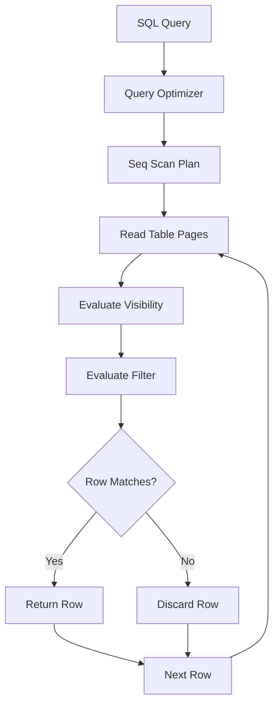
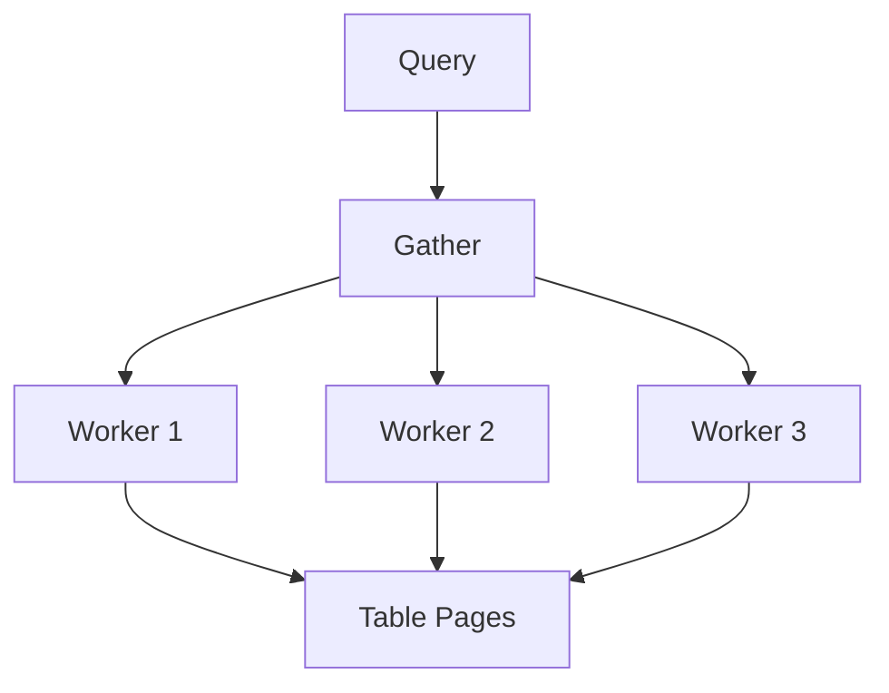
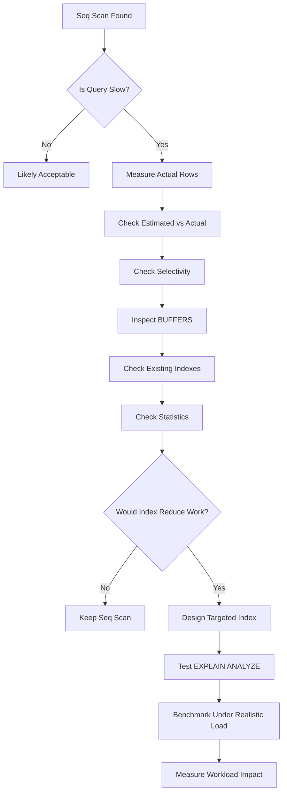

# 09- Sequential Scans

## Overview

A sequential scan, often shown as `Seq Scan` in PostgreSQL execution plans, reads table pages sequentially and evaluates the query's predicates against the rows it encounters.

It is one of the fundamental table-access strategies in a relational database:

```text
Query
  ↓
Optimizer
  ↓
Seq Scan
  ↓
Read table pages
  ↓
Evaluate predicates
  ↓
Return qualifying rows
```

A sequential scan is **not inherently a performance problem**. For many workloads, especially queries that need a large portion of a table, sequential access is cheaper than traversing an index and then fetching many table rows.

The engineering question is not:

> "Why is PostgreSQL using a sequential scan?"

It is:

> "Is a sequential scan the appropriate access path for this query, given the data volume, selectivity, table layout, cache state, and workload?"

Understanding this distinction is critical when diagnosing slow SQL.

## What Is a Sequential Scan?

A sequential scan reads the table from beginning to end, checking each relevant row against the query conditions.

For example:

```sql
SELECT
    id,
    customer_id,
    total
FROM orders
WHERE status = 'completed';
```

A simplified execution model is:

```text
Table pages
┌─────┬─────┬─────┬─────┬─────┬─────┐
│ P1  │ P2  │ P3  │ P4  │ P5  │ P6  │
└─────┴─────┴─────┴─────┴─────┴─────┘
  ↓     ↓     ↓     ↓     ↓     ↓
 scan  scan  scan  scan  scan  scan
  ↓     ↓     ↓     ↓     ↓     ↓
evaluate status = 'completed'
  ↓
matching rows
```

Unlike an index scan, PostgreSQL does not first use a separate index structure to identify candidate rows.

The database instead processes the table's pages sequentially and applies the relevant filter.

## Why Sequential Scans Exist

Sequential scans exist because indexes have a cost.

Suppose a table contains 10 million rows and a query returns 8 million of them.

Using an index may require:

```text
Index traversal
     ↓
Millions of index entries
     ↓
Table/heap fetches
     ↓
Potentially random page access
```

A sequential scan can instead perform:

```text
Sequential table access
     ↓
Evaluate predicate
     ↓
Return 8 million matching rows
```

For a large result set, the second strategy can be cheaper.

This is why adding an index does not guarantee that PostgreSQL will use it.

## Sequential Scan vs Index Scan

| Characteristic | Sequential Scan | Index Scan |
|---|---|---|
| Access pattern | Sequential table access | Index-driven |
| Best for | Large portions of a table | Selective lookups |
| Random I/O | Usually lower | Can be higher |
| Large result sets | Often efficient | Can become expensive |
| Small result sets | Often inefficient | Usually efficient |
| Requires index | No | Yes |
| Maintenance overhead | None | Index must be maintained |
| Sensitive to selectivity | Yes | Yes |
| Can be optimal | Frequently | Frequently |

The optimizer chooses between these and other strategies based on estimated cost.

## How PostgreSQL Executes a Sequential Scan

At a high level:



The storage engine works with pages rather than conceptually issuing one storage operation per row.

PostgreSQL also evaluates tuple visibility according to its MVCC model, meaning a row is returned only if it is visible to the current transaction's snapshot.

Therefore, a sequential scan can involve more than simply:

```text
read row → check WHERE → return
```

It interacts with:

- Table pages.
- Buffer management.
- MVCC visibility.
- Predicate evaluation.
- Storage I/O.
- CPU.
- Parallel execution where applicable.

## Example Execution Plan

Consider:

```sql
EXPLAIN
SELECT
    id,
    customer_id,
    total
FROM orders
WHERE status = 'completed';
```

A plan might look like:

```text
Seq Scan on orders
  (cost=0.00..250000.00 rows=7000000 width=40)
  Filter: (status = 'completed')
```

The optimizer estimates that approximately 7 million rows will qualify.

With actual execution:

```sql
EXPLAIN (ANALYZE, BUFFERS)
SELECT
    id,
    customer_id,
    total
FROM orders
WHERE status = 'completed';
```

You might see:

```text
Seq Scan on orders
  (cost=0.00..250000.00 rows=7000000 width=40)
  (actual time=0.050..2100.000 rows=6800000 loops=1)
  Filter: (status = 'completed')
  Rows Removed by Filter: 3200000
  Buffers: shared hit=90000 read=30000
```

This tells you:

- PostgreSQL expected approximately 7 million matching rows.
- Approximately 6.8 million actually matched.
- 3.2 million rows were filtered out.
- The table required substantial page access.
- The plan's cardinality estimate was reasonably close.

The sequential scan may be completely reasonable because most of the table is needed.

## When Sequential Scans Are Appropriate

### Large Result Sets

If a query needs a substantial percentage of a table, scanning the table can be more efficient than repeatedly following index references.

Example:

```sql
SELECT COUNT(*)
FROM orders
WHERE created_at >= CURRENT_DATE - INTERVAL '30 days';
```

If most rows were created within the last 30 days, an index may provide little benefit.

### Small Tables

For small tables, index traversal overhead may exceed the cost of simply reading the table.

Example:

```text
countries
---------
~200 rows
```

An index is rarely necessary just to avoid reading a few hundred rows.

### Low-Selectivity Predicates

Consider:

```sql
WHERE status = 'active'
```

If:

```text
95% of rows = active
5% of rows = inactive
```

an index on `status` may not be attractive for queries retrieving active rows.

### Analytical Queries

Reporting and analytics queries often process substantial amounts of data.

Sequential access can be efficient for:

- Aggregations.
- Full-table analysis.
- Large reporting windows.
- ETL workloads.
- Data validation.
- Batch processing.

### Queries Returning Most Columns

If the query requires many columns from many matching rows, index-based access can require substantial heap access.

A sequential scan can avoid repeated random lookups.

## When Sequential Scans Become Suspicious

A sequential scan deserves investigation when a query is expected to return very few rows from a large table.

Example:

```sql
SELECT
    id,
    email
FROM users
WHERE email = 'customer@example.com';
```

Suppose:

```text
Table rows:       50,000,000
Expected matches: 1
Plan:             Seq Scan
```

This is potentially problematic if the predicate is selective and the query executes frequently.

A suitable index might be:

```sql
CREATE UNIQUE INDEX CONCURRENTLY idx_users_email
ON users (email);
```

Afterward, validate the actual plan rather than assuming the index improved performance.

```sql
EXPLAIN (ANALYZE, BUFFERS)
SELECT
    id,
    email
FROM users
WHERE email = 'customer@example.com';
```

## Selectivity Is the Key Decision Factor

Selectivity describes how effectively a predicate reduces the number of candidate rows.

Consider a table containing 10 million rows.

| Predicate | Approximate matches | Likely access strategy |
|---|---:|---|
| `id = 42` | 1 | Index |
| `email = 'x@example.com'` | 1 | Index |
| `status = 'cancelled'` | 100,000 | Often index |
| `status = 'active'` | 9,000,000 | Often sequential |
| No filter | 10,000,000 | Sequential |
| Date range matching 80% | 8,000,000 | Often sequential |

These are not hard rules.

The optimizer also considers:

- Table size.
- Index size.
- Data distribution.
- Cache state.
- Random page cost.
- Sequential page cost.
- CPU cost.
- Correlation between index order and physical table order.
- Parallel execution.
- Query projections.
- Available statistics.

## Cost Model

PostgreSQL's optimizer uses a cost model rather than a simple rule such as:

```text
small result → index
large result → sequential scan
```

Important configuration parameters include:

- `seq_page_cost`
- `random_page_cost`
- `cpu_tuple_cost`
- `cpu_index_tuple_cost`
- `cpu_operator_cost`

For example:

```sql
SHOW seq_page_cost;
SHOW random_page_cost;
SHOW cpu_tuple_cost;
```

The costs are **not milliseconds**.

They are relative units used by the optimizer to compare alternative plans.

A common mistake is changing these values simply because a particular query chose a sequential scan.

Tune planner cost parameters based on measured workload characteristics, not on a single query.

## `Rows Removed by Filter`

This metric can be especially useful:

```text
Rows Removed by Filter: 9,900,000
```

Suppose the query returns:

```text
100 rows
```

while scanning:

```text
10,000,000 rows
```

That means the database did substantial work to produce a tiny result.

This can indicate:

- Missing index.
- Poor predicate design.
- Incorrect index choice.
- Low selectivity.
- Data distribution that differs from expectations.

For example:

```sql
EXPLAIN (ANALYZE, BUFFERS)
SELECT *
FROM users
WHERE email = 'customer@example.com';
```

If the plan shows:

```text
Seq Scan on users
  actual rows=1
  Rows Removed by Filter: 49999999
```

and this query is a high-frequency API lookup, investigate indexing immediately.

## Estimated vs Actual Rows

A sequential scan becomes particularly interesting when the optimizer's estimate differs significantly from reality.

Example:

```text
Seq Scan
  estimated rows=10
  actual rows=5,000,000
```

The optimizer believed the predicate was highly selective.

Possible causes include:

- Stale statistics.
- Data skew.
- Correlated columns.
- Complex expressions.
- Poorly represented distributions.
- Parameter-sensitive behavior.

Check statistics:

```sql
SELECT
    schemaname,
    tablename,
    attname,
    n_distinct,
    most_common_vals,
    most_common_freqs,
    histogram_bounds
FROM pg_stats
WHERE tablename = 'orders'
  AND attname = 'status';
```

If statistics are stale, refresh them:

```sql
ANALYZE orders;
```

For more complex relationships, PostgreSQL extended statistics may be appropriate.

Do not add an index simply because the estimated row count is wrong. Fix the underlying estimation problem when that is the root cause.

## Buffer Behavior

Use:

```sql
EXPLAIN (ANALYZE, BUFFERS)
SELECT
    id,
    customer_id,
    total
FROM orders
WHERE status = 'completed';
```

Example:

```text
Buffers:
  shared hit=90000
  shared read=30000
```

Interpretation:

- `shared hit` means pages were found in PostgreSQL's shared buffers.
- `shared read` means pages had to be read into the buffer cache.

A sequential scan can perform very well when the table is already cached.

Conversely, a large sequential scan against a cold or storage-constrained database can create significant I/O pressure.

Do not evaluate sequential scans independently from the database's memory and storage environment.

## Sequential Scans and Cache State

The same SQL statement can behave differently depending on cache state.

Conceptually:

```text
Warm cache
Query
  ↓
Sequential scan
  ↓
Mostly memory access
  ↓
Lower latency
```

versus:

```text
Cold cache
Query
  ↓
Sequential scan
  ↓
Storage reads
  ↓
Higher latency
```

This is one reason benchmark results should not rely on a single execution.

Production workload characteristics matter.

## Parallel Sequential Scans

PostgreSQL can parallelize suitable sequential scans.

A plan may look like:

```text
Gather
└── Parallel Seq Scan on orders
```

Conceptually:



Parallelism can make large scans significantly faster when:

- The relation is large.
- The query is expensive enough to justify worker startup.
- Multiple CPU cores are available.
- The workload permits parallel execution.
- The relevant operations support parallelism.

Parallelism is not free.

It consumes:

- CPU.
- Worker processes.
- Memory.
- I/O bandwidth.

An OLTP database serving many concurrent requests may prefer fewer expensive parallel operations rather than aggressively parallelizing every scan.

## Sequential Scans and `LIMIT`

Consider:

```sql
SELECT
    id,
    email
FROM users
WHERE status = 'active'
LIMIT 10;
```

A sequential scan may still be efficient if PostgreSQL can find the first 10 qualifying rows quickly.

It does not necessarily have to scan the entire table.

For example:

```text
Seq Scan
  ↓
first page
  ↓
matching rows found
  ↓
LIMIT reached
  ↓
stop
```

This is different from:

```sql
SELECT
    id,
    email
FROM users
WHERE status = 'active'
ORDER BY created_at DESC
LIMIT 10;
```

If PostgreSQL cannot obtain the requested ordering efficiently, it may need to process a much larger candidate set before satisfying the `ORDER BY`.

An index that supports both filtering and ordering may dramatically change the plan.

## Sequential Scans and Sorting

Consider:

```sql
SELECT
    id,
    total
FROM orders
WHERE status = 'completed'
ORDER BY created_at DESC
LIMIT 50;
```

A plan might be:

```text
Limit
└── Sort
    └── Seq Scan on orders
```

The important question is not simply whether the scan is sequential.

Investigate how many rows reach the sort:

```text
Seq Scan
  ↓
2,000,000 matching rows
  ↓
Sort
  ↓
50 rows returned
```

An appropriate index could potentially allow PostgreSQL to retrieve rows in useful order and stop earlier.

The index design must match the actual workload.

## Sequential Scans and Joins

Sequential scans frequently appear inside join plans.

Example:

```sql
SELECT
    o.id,
    c.email
FROM orders AS o
JOIN customers AS c
    ON c.id = o.customer_id
WHERE o.status = 'completed';
```

A possible plan:

```text
Hash Join
├── Seq Scan on orders
└── Hash
    └── Seq Scan on customers
```

This can be completely appropriate if:

- Many orders are being processed.
- Most customers participate in the join.
- Building a hash table is cheaper than repeated index lookups.

Trying to force index scans on both tables can actually make the query slower.

## Sequential Scans in OLTP Systems

In transactional backend systems, sequential scans are often appropriate for:

- Small lookup tables.
- Administrative queries.
- Batch operations.
- Large result sets.
- Low-frequency reporting queries.

They become concerning when a high-frequency request repeatedly scans a large table for a highly selective predicate.

For example:

```text
100 API requests/second
        ↓
Each query scans 50 million users
        ↓
CPU + I/O pressure
        ↓
Database saturation
        ↓
API latency increases
```

This is a workload problem, not merely a query-plan problem.

## Sequential Scans in Django

Django does not prevent PostgreSQL from using sequential scans.

Example:

```python
users = (
    User.objects
    .filter(email="customer@example.com")
    .values("id", "email")
)
```

Django generates SQL, but PostgreSQL determines the access path.

You can inspect the generated query plan through the ORM:

```python
print(
    users.explain(
        analyze=True,
        buffers=True,
    )
)
```

For a highly selective lookup such as email, verify that the database has an appropriate index.

For example, a Django model field can be indexed:

```python
class User(models.Model):
    email = models.EmailField(unique=True)
```

A uniqueness constraint normally creates an appropriate unique index in PostgreSQL.

The important production principle is:

> Define indexes according to actual query patterns and constraints, not simply according to ORM model structure.

## Sequential Scans and ORMs

ORM-generated queries can unexpectedly create large scan workloads.

For example:

```python
Order.objects.filter(
    customer__region="APAC",
    status="completed",
)
```

The application developer may see a concise ORM expression while PostgreSQL sees joins, predicates, and access paths.

Always inspect the actual SQL and execution plan when database latency is involved.

The optimization boundary is:

```text
Application code
      ↓
ORM
      ↓
Generated SQL
      ↓
PostgreSQL optimizer
      ↓
Execution plan
```

## When Not to Add an Index Just to Avoid a Sequential Scan

Adding an index has costs.

Each additional index can increase:

- Storage consumption.
- `INSERT` latency.
- `UPDATE` latency.
- `DELETE` latency.
- Vacuum work.
- Backup size.
- Replication traffic.
- Index maintenance complexity.

Therefore:

```text
Seq Scan
    ≠
Missing Index
```

Before adding an index, determine:

1. Is the query actually slow?
2. How frequently does it execute?
3. How many rows does it need?
4. Is the predicate selective?
5. Is the sequential scan the dominant cost?
6. Would an index reduce total work?
7. What write overhead would the index introduce?
8. Is the query important enough to justify the operational cost?

## Common Causes of Unexpected Sequential Scans

| Cause | Why it happens | Investigation |
|---|---|---|
| No suitable index | Planner has no efficient alternative | Inspect indexes |
| Low selectivity | Index would still touch many rows | Check data distribution |
| Small table | Sequential access is cheaper | Check relation size |
| Stale statistics | Planner estimates selectivity incorrectly | Run/check `ANALYZE` |
| Data skew | Average statistics hide important values | Inspect `pg_stats` |
| Function on column | Existing index may not match expression | Inspect predicate |
| Type mismatch | Predicate may require conversion | Inspect generated SQL |
| Leading wildcard | Normal B-tree index may not help | Inspect search pattern |
| Large result set | Index traversal can be more expensive | Check actual rows |
| Cost parameters | Planner estimates access paths differently | Inspect planner settings |

## Predicates That Can Prevent Efficient B-Tree Usage

Consider:

```sql
WHERE email = 'user@example.com'
```

This is typically index-friendly with a suitable B-tree index.

Compare:

```sql
WHERE LOWER(email) = 'user@example.com'
```

An ordinary index on:

```sql
(email)
```

may not support this expression efficiently.

An expression index may be appropriate:

```sql
CREATE INDEX CONCURRENTLY idx_users_lower_email
ON users (LOWER(email));
```

Similarly:

```sql
WHERE name LIKE '%john%'
```

does not generally benefit from a normal B-tree index in the same way as a left-anchored pattern.

The appropriate solution depends on the search requirements and database capabilities.

## Production Investigation Workflow

When a sequential scan appears in a slow query:



Recommended process:

1. Capture the actual SQL.
2. Run `EXPLAIN`.
3. Run `EXPLAIN (ANALYZE, BUFFERS)` when safe.
4. Compare estimated and actual rows.
5. Determine the percentage of the table being accessed.
6. Check `Rows Removed by Filter`.
7. Inspect buffer activity.
8. Review existing indexes.
9. Check statistics and data distribution.
10. Test representative parameter values.
11. Add or modify an index only when evidence supports it.
12. Compare before and after plans.
13. Validate under realistic concurrency.
14. Confirm that index maintenance costs remain acceptable.

## Common Mistakes

### Assuming Every Sequential Scan Is Bad

A sequential scan can be the optimal plan.

Judge it by workload and actual cost.

### Adding an Index Without Measuring

An index can increase write overhead without meaningfully improving the target query.

Measure first.

### Looking Only at the Plan Node Name

Seeing:

```text
Seq Scan
```

is not enough.

Inspect:

- Actual rows.
- Estimated rows.
- Timing.
- Buffers.
- Rows removed by filter.
- Loops.
- Query frequency.

### Ignoring Result Size

If a query returns millions of rows, an index may not provide a meaningful advantage.

### Ignoring Table Size

A sequential scan over a 500-row table is not equivalent to one over a 500-million-row table.

### Ignoring Data Distribution

A predicate may be selective for one value and unselective for another.

### Assuming an Index Must Be Used

The optimizer is allowed to choose a sequential scan when it estimates that it is cheaper.

### Forcing Index Usage

Database hints or configuration changes intended solely to eliminate sequential scans can produce worse plans as data changes.

### Ignoring Statistics

Bad statistics can lead the optimizer to make poor access-path decisions.

### Changing Planner Costs for One Query

Planner cost settings affect the entire workload.

Do not globally tune them to force a desired plan for a single query.

### Benchmarking Only Warm Cache Performance

A query that is fast when all pages are cached may behave differently under memory pressure.

### Ignoring Concurrency

A sequential scan that is acceptable once per minute may become expensive when executed hundreds of times per second.

## Operational Considerations

### CPU

Sequential scans perform predicate evaluation across rows and can consume substantial CPU for large tables.

Monitor:

- Database CPU utilization.
- Query execution time.
- Query frequency.
- CPU per query.

### I/O

Large scans can generate significant storage reads when data is not cached.

Monitor:

- Read throughput.
- IOPS.
- Storage latency.
- Buffer reads.
- Temporary I/O.

### Memory

Sequential scans interact with PostgreSQL's buffer cache.

A large scan can also influence cache residency and compete with other workload data.

### Replication

Read-heavy workloads on a primary database can compete with replication-related resources.

For large analytical queries, consider whether replicas or dedicated analytical infrastructure are more appropriate for the workload.

### Cost

On cloud-managed PostgreSQL services, unnecessary large scans can increase:

- CPU consumption.
- Storage I/O.
- Instance sizing requirements.
- Operational headroom requirements.

A query optimization should therefore be evaluated against infrastructure cost, not just latency.

## High Availability and Read Replicas

Read replicas can help isolate read workloads, but they do not make inefficient queries inherently efficient.

For example:

```text
Application
    ↓
Read Replica
    ↓
Large sequential scan
    ↓
Replica CPU / I/O saturation
```

The workload has simply moved.

Use replicas for workload isolation where appropriate, while still optimizing high-impact queries.

## Monitoring

Use workload-level monitoring to identify expensive scan patterns.

Useful PostgreSQL sources include:

```sql
SELECT
    query,
    calls,
    total_exec_time,
    mean_exec_time,
    rows
FROM pg_stat_statements
ORDER BY total_exec_time DESC
LIMIT 20;
```

For deeper analysis, correlate query statistics with:

- Execution plans.
- Database CPU.
- Storage latency.
- Buffer activity.
- Lock waits.
- Application endpoint latency.

A sequential scan should become a tuning priority when it contributes materially to production SLO violations or resource saturation.

## Security Considerations

Sequential scans do not inherently create a security vulnerability.

However, inefficient queries can become an operational security concern when exposed through user-controlled API parameters.

For example, an endpoint allowing unrestricted filtering or reporting can accidentally permit expensive queries:

```text
Unbounded API query
      ↓
Large database scan
      ↓
High CPU / I/O
      ↓
Resource exhaustion
```

Protect production APIs with:

- Pagination.
- Reasonable result limits.
- Query timeouts where appropriate.
- Rate limiting.
- Authorization checks.
- Validated filter parameters.
- Safe query construction.

Do not rely on indexes alone to protect database resources.

## Interview Traps

| Question | Strong answer |
|---|---|
| Is a sequential scan always bad? | No. It is often optimal for small tables or queries that need a large portion of a table. |
| Why might PostgreSQL prefer a sequential scan over an index? | The optimizer estimates that sequential access has lower total cost, often because the query is not selective enough. |
| Does adding an index guarantee that PostgreSQL will use it? | No. The optimizer chooses the lowest-cost plan based on statistics, cost estimates, and query characteristics. |
| What makes a sequential scan suspicious? | Scanning a large table to return very few rows, especially for a high-frequency query. |
| What does `Rows Removed by Filter` tell you? | How many rows reached the filter but did not satisfy it, helping reveal wasted work. |
| Can a sequential scan stop before reading the entire table? | Yes. For example, a query with `LIMIT` can stop once enough qualifying rows have been found. |
| Why can an index be slower for a large result set? | Index-driven access may require many table fetches and random page accesses, while sequential access can read pages efficiently. |
| What should you inspect before adding an index? | Actual workload, selectivity, row counts, buffers, existing indexes, statistics, and write-maintenance costs. |
| Can stale statistics cause a sequential scan? | Yes. Incorrect cardinality estimates can lead the optimizer to choose an inappropriate access path. |
| Is `Seq Scan` itself evidence of a missing index? | No. The plan must be evaluated in context. |
| Why might a sequential scan be faster in production than in development? | Production may have a warmer cache, different storage characteristics, or a different workload and data distribution. |
| Can sequential scans be parallelized? | Yes. PostgreSQL can use parallel sequential scans when the planner determines that parallel execution is beneficial and the query supports it. |

## Key Takeaways

- **A sequential scan is a legitimate and often optimal access strategy; its presence alone does not indicate a performance problem.**
- **Evaluate sequential scans using selectivity, actual row counts, buffer activity, execution time, table size, and query frequency rather than the plan node name alone.**
- **A sequential scan that processes millions of rows to return a handful of rows is a strong candidate for investigating indexes, statistics, predicates, and data distribution.**
- **Indexes are not free: they consume storage and add write, vacuum, replication, and maintenance overhead, so eliminate sequential scans only when the workload justifies it.**
- **Optimize from measured execution behavior and workload impact, then validate the change under representative data, parameters, cache conditions, and concurrency.**