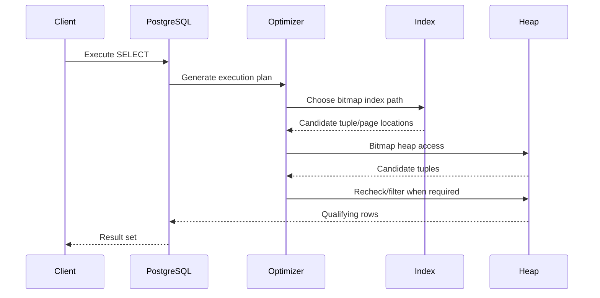

# 11- Bitmap Scans

## Overview

A **bitmap scan** is a PostgreSQL table-access strategy that combines index lookups with efficient heap-page access.

It is useful when a query is selective enough that an index helps identify candidate rows, but not selective enough for a traditional index scan to fetch those rows individually.

Instead of immediately visiting the heap for every matching index entry, PostgreSQL builds a bitmap representing the table pages and tuples that may satisfy the query. It can then visit the relevant heap pages in a more efficient order.

The high-level flow is:

```text
SQL Query
    ↓
Query Optimizer
    ↓
Bitmap Index Scan
    ↓
Bitmap of matching heap locations
    ↓
Bitmap Heap Scan
    ↓
Read relevant table pages
    ↓
Recheck / Filter
    ↓
Result
```

Bitmap scans are particularly important for queries that return a moderate number of rows from large tables and for queries combining multiple indexes.

## Why Bitmap Scans Exist

A regular index scan can become inefficient when matching rows are distributed across many heap pages.

Consider:

```text
Index Scan

Index entry 1 → Heap Page 8
Index entry 2 → Heap Page 420
Index entry 3 → Heap Page 17
Index entry 4 → Heap Page 901
Index entry 5 → Heap Page 32
...
```

Visiting heap pages one tuple at a time can result in significant random I/O.

A bitmap strategy separates the operation into two phases:

```text
Phase 1
Index
  ↓
Collect matching tuple/page locations
  ↓
Bitmap

Phase 2
Bitmap
  ↓
Group relevant heap pages
  ↓
Read pages efficiently
  ↓
Evaluate candidate tuples
```

This gives PostgreSQL another option between:

```text
Sequential Scan
```

and:

```text
Index Scan
```

The optimizer chooses among these strategies based on estimated cost.

## Bitmap Scan Components

A typical bitmap execution plan contains two related nodes:

```text
Bitmap Heap Scan
└── Bitmap Index Scan
```

The two nodes have different responsibilities.

| Node | Responsibility |
|---|---|
| `Bitmap Index Scan` | Uses an index to identify candidate tuple/page locations |
| `Bitmap Heap Scan` | Visits the relevant heap pages and retrieves qualifying rows |

The `Bitmap Index Scan` creates the bitmap.

The `Bitmap Heap Scan` consumes that bitmap.

## Bitmap Index Scan

A bitmap index scan uses an index to identify matching table locations.

Example:

```sql
SELECT
    id,
    customer_id,
    total
FROM orders
WHERE customer_id = 123;
```

With:

```sql
CREATE INDEX idx_orders_customer_id
ON orders (customer_id);
```

PostgreSQL may produce:

```text
Bitmap Heap Scan on orders
  Recheck Cond: (customer_id = 123)
  -> Bitmap Index Scan on idx_orders_customer_id
       Index Cond: (customer_id = 123)
```

The index scan does not necessarily fetch each row immediately.

Instead, it builds a bitmap of candidate heap locations.

## Bitmap Heap Scan

The bitmap heap scan then uses the bitmap to determine which heap pages need to be visited.

Conceptually:

```text
Bitmap
├── Page 10 → tuples 2, 7
├── Page 15 → tuple 4
├── Page 31 → tuples 1, 5, 9
└── Page 40 → tuple 3

        ↓

Read relevant heap pages

        ↓

Check candidate tuples

        ↓

Return qualifying rows
```

This can reduce the cost of scattered heap access.

## Bitmap Scans vs Index Scans

| Characteristic | Index Scan | Bitmap Scan |
|---|---|---|
| Index used | Yes | Yes |
| Heap access | Tuple-oriented | Page-oriented |
| Builds bitmap | No | Yes |
| Excellent for very selective lookups | Yes | Sometimes unnecessary |
| Useful for moderate result sets | Sometimes | Often |
| Can combine multiple indexes | Limited | Yes |
| Random heap access | Potentially high | Reduced/grouped |
| Additional memory | Lower | Bitmap memory required |
| Can preserve index order | Yes, depending on index/plan | No |
| Works naturally with `ORDER BY` | Often | Generally no |

A bitmap scan is therefore not simply a "better index scan." It solves a different access-pattern problem.

## Bitmap Scans and Selectivity

The amount of data returned strongly influences whether a bitmap scan is attractive.

Consider:

```text
1 row from 100 million
    ↓
Index Scan is likely attractive
```

Compared with:

```text
10 million rows from 100 million
    ↓
Sequential Scan may be attractive
```

Between those extremes:

```text
500,000 rows from 100 million
    ↓
Bitmap Scan may be attractive
```

These are conceptual examples rather than fixed thresholds.

The actual choice depends on:

- Table size.
- Number of matching rows.
- Number of affected heap pages.
- Data distribution.
- Cache state.
- Index statistics.
- Random page cost.
- Sequential page cost.
- CPU costs.
- Parallel execution possibilities.
- Available memory.

## Bitmap Scans and Multiple Indexes

One of the most important capabilities of bitmap scans is combining multiple indexes.

Suppose:

```sql
CREATE INDEX idx_orders_customer_id
ON orders (customer_id);

CREATE INDEX idx_orders_status
ON orders (status);
```

A query might be:

```sql
SELECT
    id,
    customer_id,
    status,
    total
FROM orders
WHERE customer_id = 123
  AND status = 'completed';
```

PostgreSQL can potentially use both indexes:

```text
Bitmap Index Scan: customer_id
          ↓
       Bitmap A

Bitmap Index Scan: status
          ↓
       Bitmap B

          ↓

      Bitmap AND

          ↓

   Bitmap Heap Scan
```

A conceptual execution plan:

```text
Bitmap Heap Scan on orders
  Recheck Cond: ((customer_id = 123) AND (status = 'completed'))
  -> BitmapAnd
       -> Bitmap Index Scan on idx_orders_customer_id
            Index Cond: (customer_id = 123)
       -> Bitmap Index Scan on idx_orders_status
            Index Cond: (status = 'completed')
```

This allows PostgreSQL to intersect candidate locations from multiple indexes.

## Bitmap AND

`BitmapAnd` combines bitmaps using logical AND.

For:

```sql
WHERE customer_id = 123
  AND status = 'completed'
```

the database conceptually computes:

```text
Customer bitmap
    AND
Status bitmap
    ↓
Rows/pages satisfying both conditions
```

This can be useful when separate indexes provide good filtering power.

However, it does **not** mean that separate single-column indexes are always preferable to a composite index.

For frequently executed queries, a purpose-built composite index such as:

```sql
CREATE INDEX idx_orders_customer_status
ON orders (customer_id, status);
```

may provide a better access path.

The correct choice should be validated with actual workload plans.

## Bitmap OR

Bitmap scans can also combine indexes with logical OR.

For:

```sql
SELECT
    id,
    customer_id,
    status
FROM orders
WHERE customer_id = 123
   OR status = 'priority';
```

PostgreSQL may conceptually build:

```text
Customer bitmap
      ↓
    Bitmap A

Status bitmap
      ↓
    Bitmap B

      ↓

   Bitmap OR

      ↓

Bitmap Heap Scan
```

A possible plan shape:

```text
Bitmap Heap Scan on orders
  Recheck Cond: ((customer_id = 123) OR (status = 'priority'))
  -> BitmapOr
       -> Bitmap Index Scan on idx_orders_customer_id
       -> Bitmap Index Scan on idx_orders_status
```

`BitmapOr` is useful when multiple indexes independently identify candidate rows.

## Exact vs Lossy Bitmaps

PostgreSQL bitmaps can represent matching tuples at different levels of precision.

A bitmap can contain:

- **Exact entries** identifying specific tuples.
- **Lossy entries** identifying a heap page rather than individual tuples.

An exact representation can conceptually look like:

```text
Page 42
  ├── tuple 3
  ├── tuple 8
  └── tuple 14
```

A lossy representation may look like:

```text
Page 42
  └── page may contain matching tuples
```

When a page is represented lossily, PostgreSQL must inspect tuples on that page and recheck the condition.

This is one reason `Recheck Cond` appears in bitmap heap scan plans.

## Why Lossy Bitmaps Occur

Bitmap memory is limited by PostgreSQL's memory configuration, particularly `work_mem`.

A bitmap that tracks many individual tuple locations can require substantial memory.

When memory pressure increases, PostgreSQL may represent more pages in a lossy form.

Conceptually:

```text
Many matching tuples
        ↓
Large bitmap
        ↓
Memory pressure
        ↓
Lossy bitmap representation
        ↓
More heap tuples need rechecking
```

This can increase CPU work.

It does not necessarily mean the query is badly designed; it indicates that bitmap representation and memory requirements are part of the execution cost.

## `work_mem` and Bitmap Scans

`work_mem` controls memory available to many query operations, including bitmap-related processing.

Inspect it:

```sql
SHOW work_mem;
```

A larger value can allow more detailed bitmap representations in some workloads.

However, increasing `work_mem` globally is risky because it is a **per-operation** memory setting, and a single query can have multiple memory-consuming operations.

For example:

```text
100 concurrent queries
        ×
multiple memory-consuming operations
        ×
large work_mem
        ↓
Potentially significant memory usage
```

Production tuning should therefore consider:

- Query concurrency.
- Connection pool size.
- Number of memory-intensive operations.
- Query workload.
- Available RAM.
- PostgreSQL configuration.
- Managed database limits.

Do not increase `work_mem` simply because a bitmap scan contains lossy pages.

## Understanding `Recheck Cond`

A bitmap heap scan commonly contains:

```text
Recheck Cond: (customer_id = 123)
```

This indicates that PostgreSQL verifies the condition when processing heap tuples.

This is particularly important for lossy bitmap entries.

A simplified flow is:

```text
Bitmap Index Scan
       ↓
Candidate pages/tuples
       ↓
Bitmap Heap Scan
       ↓
Recheck condition
       ↓
Return matching rows
```

`Recheck Cond` should not automatically be interpreted as a performance problem.

The important question is how much work is associated with the recheck.

## `Rows Removed by Filter`

A bitmap heap scan can still perform additional filtering.

Example:

```text
Bitmap Heap Scan on orders
  Recheck Cond: (customer_id = 123)
  Filter: (total > 1000)
  Rows Removed by Filter: 250000
```

The index helped identify customer rows, but many retrieved rows were discarded by:

```sql
total > 1000
```

This can indicate that a more suitable index might reduce work.

For example:

```sql
CREATE INDEX idx_orders_customer_total
ON orders (customer_id, total);
```

may or may not be better depending on the workload and query patterns.

Always validate the resulting plan rather than adding indexes mechanically.

## Bitmap Scans and Table Correlation

Bitmap scans can be advantageous when matching rows are scattered throughout the table.

Consider:

```text
Index matches:

Page 10
Page 400
Page 17
Page 900
Page 25
Page 701
...
```

A regular index scan may jump between heap pages repeatedly.

A bitmap can first identify relevant pages:

```text
{10, 17, 25, 400, 701, 900}
```

and then process those pages more systematically.

This is one of the primary reasons bitmap access can outperform a conventional index scan for moderately selective queries.

## Bitmap Scans and `ORDER BY`

Bitmap scans generally do not preserve the ordering of an index.

For example:

```sql
SELECT
    id,
    created_at
FROM orders
WHERE customer_id = 123
ORDER BY created_at DESC;
```

A regular index scan using:

```sql
(customer_id, created_at DESC)
```

can potentially produce rows in the desired order.

A bitmap scan collects matching locations and processes heap pages rather than simply following index order.

Therefore, if ordered retrieval is important, a bitmap scan may require an additional sort:

```text
Bitmap Heap Scan
      ↓
Matching rows
      ↓
Sort
      ↓
ORDER BY result
```

This can make a purpose-built ordered index scan preferable.

## Bitmap Scans and `LIMIT`

Bitmap scans are not always ideal for small `LIMIT` queries.

Consider:

```sql
SELECT
    id,
    created_at,
    total
FROM orders
WHERE customer_id = 123
ORDER BY created_at DESC
LIMIT 20;
```

A suitable index can allow PostgreSQL to find the first 20 rows and stop:

```text
Index
  ↓
customer_id = 123
  ↓
created_at DESC
  ↓
20 rows
  ↓
Stop
```

A bitmap strategy may first collect a larger set of candidate locations.

For latency-sensitive APIs with small limits, an ordered index scan can therefore be more efficient.

## Bitmap Scan Lifecycle

A simplified execution lifecycle is:



The optimizer does not literally execute the query during planning. The diagram represents the conceptual relationship between planning and execution stages.

## Practical PostgreSQL Example

Consider a large `orders` table:

```sql
CREATE TABLE orders (
    id BIGINT GENERATED ALWAYS AS IDENTITY PRIMARY KEY,
    customer_id BIGINT NOT NULL,
    status TEXT NOT NULL,
    created_at TIMESTAMPTZ NOT NULL,
    total NUMERIC(12, 2) NOT NULL
);
```

Create indexes:

```sql
CREATE INDEX idx_orders_customer_id
ON orders (customer_id);

CREATE INDEX idx_orders_status
ON orders (status);
```

Analyze the query:

```sql
EXPLAIN (ANALYZE, BUFFERS)
SELECT
    id,
    customer_id,
    status,
    total
FROM orders
WHERE customer_id = 123
  AND status = 'completed';
```

A possible plan shape is:

```text
Bitmap Heap Scan on orders
  Recheck Cond: ((customer_id = 123) AND (status = 'completed'))
  -> BitmapAnd
       -> Bitmap Index Scan on idx_orders_customer_id
            Index Cond: (customer_id = 123)
       -> Bitmap Index Scan on idx_orders_status
            Index Cond: (status = 'completed')
```

The actual plan depends on table statistics and data distribution.

## Reading Bitmap Scan Plans

When analyzing a bitmap plan, inspect:

| Plan field | What to evaluate |
|---|---|
| `Bitmap Index Scan` | Which indexes participate |
| `BitmapAnd` | Whether multiple predicates are intersected |
| `BitmapOr` | Whether multiple predicates are unioned |
| `Bitmap Heap Scan` | How heap pages are accessed |
| `Recheck Cond` | Conditions re-evaluated at heap level |
| `Heap Blocks: exact` | Pages represented precisely |
| `Heap Blocks: lossy` | Pages represented approximately |
| `Rows Removed by Filter` | Additional filtering work |
| `actual rows` | Actual result cardinality |
| `loops` | Number of executions |
| `Buffers` | Cache and disk page activity |
| Estimated rows | Optimizer cardinality estimate |

Example:

```text
Bitmap Heap Scan on orders
  Recheck Cond: (customer_id = 123)
  Heap Blocks: exact=120 lossy=40
  Rows Removed by Filter: 15000
```

This tells you that the bitmap involved both exact and lossy heap-page representations and that additional rows were removed by a filter.

The next step is to determine whether this work is acceptable for the query's latency and frequency.

## `EXPLAIN (ANALYZE, BUFFERS)`

Use:

```sql
EXPLAIN (ANALYZE, BUFFERS)
SELECT
    id,
    customer_id,
    status,
    total
FROM orders
WHERE customer_id = 123
  AND status = 'completed';
```

For production investigation, focus on:

```text
estimated rows
        vs
actual rows

exact blocks
        vs
lossy blocks

rows removed
        ↓
filtering cost

shared hit
        vs
shared read
        ↓
cache / storage behavior
```

A bitmap plan with many shared reads may behave very differently from the same plan when the relevant pages are already cached.

## Statistics Matter

Bitmap scan decisions depend heavily on cardinality estimates.

Refresh statistics when appropriate:

```sql
ANALYZE orders;
```

Inspect column statistics:

```sql
SELECT
    tablename,
    attname,
    n_distinct,
    most_common_vals,
    most_common_freqs
FROM pg_stats
WHERE tablename = 'orders'
  AND attname IN ('customer_id', 'status');
```

If PostgreSQL estimates:

```text
10,000 rows
```

but execution returns:

```text
2,000,000 rows
```

the optimizer may choose a poor access strategy.

Significant estimation errors can come from:

- Stale statistics.
- Highly skewed data.
- Correlated columns.
- Insufficient statistics detail.
- Data distribution changes.
- Complex predicates.

## Extended Statistics

Columns can be correlated.

For example:

```text
status = 'completed'
```

may be strongly correlated with:

```text
payment_state = 'paid'
```

Treating predicates as independent can lead to inaccurate row estimates.

PostgreSQL supports extended statistics for some multi-column estimation problems.

Example:

```sql
CREATE STATISTICS orders_status_payment_stats
ON status, payment_state
FROM orders;
```

Then refresh statistics:

```sql
ANALYZE orders;
```

This can improve cardinality estimates and therefore improve optimizer decisions.

## Bitmap Scans vs Composite Indexes

Suppose a query frequently uses:

```sql
WHERE customer_id = ?
  AND status = ?
```

You could have:

```text
Index A: customer_id
Index B: status
```

and PostgreSQL could potentially use:

```text
BitmapAnd(A, B)
```

Alternatively:

```text
Index: (customer_id, status)
```

may provide a more direct access path.

| Strategy | Advantages | Limitations |
|---|---|---|
| Two single-column indexes | Flexible for independent queries | May require bitmap combination |
| Composite index | Efficient for known multi-column access pattern | Less flexible for unrelated predicates |
| Bitmap combination | Can combine existing indexes | Additional bitmap processing |
| Sequential scan | Simple and efficient for broad reads | Reads the table broadly |

The correct choice depends on the complete workload, not one query.

## Bitmap Scans in Backend APIs

Consider a FastAPI endpoint:

```text
GET /orders?customer_id=123&status=completed
```

The request path may be:

```text
Client
  ↓
Nginx / Load Balancer
  ↓
FastAPI
  ↓
Database connection pool
  ↓
PostgreSQL
  ↓
Bitmap Index Scan(s)
  ↓
Bitmap Heap Scan
  ↓
Rows
  ↓
FastAPI serialization
  ↓
HTTP response
```

At high request rates, database work can dominate application latency.

A bitmap scan can be beneficial when the query has moderate selectivity and multiple predicates, but the endpoint should still enforce:

- Pagination.
- Maximum page sizes.
- Authorization.
- Validated filters.
- Reasonable query complexity.
- Appropriate timeouts.

An efficient database plan does not make an unbounded API query safe.

## Production Considerations

### Do Not Force Bitmap Scans

PostgreSQL's optimizer should normally decide whether a bitmap strategy is appropriate.

Avoid changing planner settings merely to force a particular plan without evidence.

### Validate With Production-Like Data

A development database with:

```text
5,000 rows
```

may choose:

```text
Seq Scan
```

while production with:

```text
500,000,000 rows
```

may choose:

```text
Bitmap Heap Scan
```

Execution plans are data-dependent.

### Watch Memory

Bitmap operations consume memory.

Monitor:

- Query concurrency.
- `work_mem`.
- Database RAM.
- Connection counts.
- Concurrent memory-heavy operations.

### Monitor Query Latency

Use:

```sql
EXPLAIN (ANALYZE, BUFFERS)
```

for controlled investigation and use PostgreSQL query statistics/observability tooling to identify frequently expensive queries.

### Monitor Data Growth

A plan that is efficient today may change as:

```text
Table size
    +
Data distribution
    +
Statistics
    +
Cache behavior
```

change over time.

## Common Mistakes

### Assuming Bitmap Scan Means the Index Is Perfectly Used

A bitmap scan can still process a large number of heap pages.

Always inspect:

```text
actual rows
Buffers
Heap Blocks
Rows Removed by Filter
```

### Treating Lossy Pages as Automatically Bad

Lossy pages indicate that PostgreSQL is representing bitmap information at page granularity.

They can increase rechecking work, but whether that matters depends on the overall execution cost.

### Increasing `work_mem` Globally

A larger `work_mem` may reduce lossy representation in some queries, but global increases can create substantial memory pressure under concurrency.

### Creating Single-Column Indexes for Every Predicate

Two indexes that happen to match one query do not necessarily form the best long-term design.

Review:

```text
query frequency
+
selectivity
+
composite index opportunities
+
write overhead
```

### Ignoring `ORDER BY`

A bitmap plan can be efficient for filtering but still require a costly sort.

For latency-sensitive ordered queries, evaluate whether a composite ordered index is more appropriate.

### Ignoring `LIMIT`

A highly selective ordered lookup with a small `LIMIT` may favor a regular index scan because it can stop early.

### Looking Only at the Top-Level Node

The performance characteristics are distributed across:

```text
Bitmap Heap Scan
    ↓
BitmapAnd / BitmapOr
    ↓
Bitmap Index Scans
```

Analyze the entire subtree.

## Performance Tuning Workflow

Use an evidence-driven workflow:

```text
Identify slow query
       ↓
Capture EXPLAIN (ANALYZE, BUFFERS)
       ↓
Inspect estimated vs actual rows
       ↓
Inspect bitmap index operations
       ↓
Inspect exact vs lossy heap blocks
       ↓
Inspect filters and removed rows
       ↓
Evaluate index design
       ↓
Test alternative index/query
       ↓
Compare execution plans
       ↓
Benchmark realistic workload
       ↓
Monitor production impact
```

Useful commands include:

```sql
EXPLAIN (ANALYZE, BUFFERS, VERBOSE)
SELECT
    id,
    customer_id,
    status,
    total
FROM orders
WHERE customer_id = 123
  AND status = 'completed';
```

And:

```sql
ANALYZE orders;
```

For a large production index change:

```sql
CREATE INDEX CONCURRENTLY idx_orders_customer_status
ON orders (customer_id, status);
```

Test the new plan before deciding whether an existing index can be removed.

## When Bitmap Scans Are a Good Fit

Bitmap scans are often attractive when:

- The query returns more than a tiny number of rows.
- The table is large.
- An index can substantially reduce candidate pages.
- Matching rows are distributed across the heap.
- Multiple indexes can be combined effectively.
- A sequential scan would read substantially more data.
- The query does not depend heavily on preserving index order.

They are less attractive when:

- Only one or a few rows are required.
- A highly selective ordered index can stop early.
- Most of the table matches.
- Sorting dominates the workload.
- Bitmap construction itself becomes significant.
- The query is extremely latency-sensitive and a direct index path is cheaper.

These are workload characteristics, not absolute rules.

## Interview Traps

| Question | Strong answer |
|---|---|
| What is a bitmap scan? | A PostgreSQL access strategy that uses an index to build a bitmap of candidate heap locations and then reads the relevant heap pages through a bitmap heap scan. |
| Why use a bitmap scan instead of an index scan? | It can reduce the cost of scattered heap access when a moderate number of rows match. |
| What is `Bitmap Index Scan`? | The phase that uses an index to construct candidate tuple/page locations. |
| What is `Bitmap Heap Scan`? | The phase that visits heap pages identified by the bitmap and retrieves/rechecks candidate tuples. |
| What is `BitmapAnd`? | It intersects candidate locations from multiple bitmap-producing index scans for predicates combined with `AND`. |
| What is `BitmapOr`? | It combines candidate locations from multiple bitmap-producing index scans for predicates combined with `OR`. |
| Why does a bitmap scan have `Recheck Cond`? | Heap tuples may need condition verification, especially when bitmap entries are lossy. |
| What is a lossy bitmap? | A representation that identifies a heap page rather than individual matching tuples, requiring additional tuple-level rechecks. |
| Can a bitmap scan preserve index ordering? | Generally no. Bitmap processing is page-oriented, so an additional sort may be required for `ORDER BY`. |
| Is a bitmap scan always faster than an index scan? | No. The optimizer chooses based on estimated cost, and highly selective queries often favor direct index scans. |
| Is a bitmap scan always better than a sequential scan? | No. If a large portion of the table matches, a sequential scan may be cheaper. |
| Does a bitmap scan mean multiple indexes are being used? | Not necessarily. A bitmap heap scan can be driven by a single bitmap index scan; multiple indexes are combined when the plan contains `BitmapAnd` or `BitmapOr`. |
| What configuration can affect bitmap memory behavior? | `work_mem` influences memory available to operations such as bitmap construction, but changing it must account for concurrency and total database memory. |
| How do you investigate a bitmap scan? | Use `EXPLAIN (ANALYZE, BUFFERS)` and inspect row estimates, actual rows, heap blocks, lossy pages, filtering, and buffer activity. |

## Key Takeaways

- **Bitmap scans bridge the gap between highly selective index scans and broad sequential scans by collecting index matches and processing heap pages efficiently.**
- **`Bitmap Index Scan` builds candidate locations, while `Bitmap Heap Scan` retrieves and rechecks rows from the relevant table pages.**
- **`BitmapAnd` and `BitmapOr` allow PostgreSQL to combine multiple index paths, but a purpose-built composite index may still be better for frequently executed query patterns.**
- **Lossy bitmap pages can increase tuple rechecking, and `work_mem` affects bitmap memory behavior; tune memory carefully under production concurrency.**
- **Evaluate bitmap scans with actual execution data—especially row estimates, heap blocks, buffers, filtering, ordering, and `LIMIT` behavior—rather than assuming the presence of a bitmap scan indicates good or bad performance.**