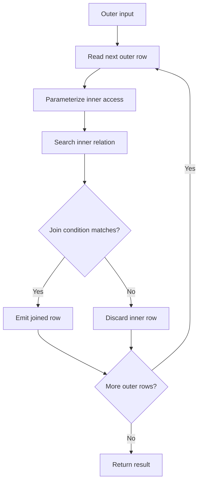
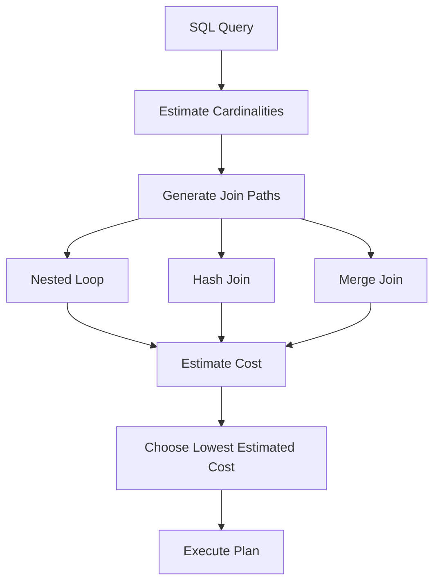

# 12- Nested Loop Join

## Overview

A **Nested Loop Join** is a join algorithm that processes one input relation as the outer side and repeatedly searches the inner relation for matching rows.

Conceptually:

```text
Outer relation
      ↓
Take one row
      ↓
Search inner relation
      ↓
Return matching rows
      ↓
Take next outer row
      ↓
Repeat
```

The algorithm is simple and can be extremely efficient when the outer input is small and the inner side has an efficient access path, typically an index.

It can also become one of the most expensive join strategies when a large outer relation causes repeated scans of a large inner relation.

For senior backend engineers, the important question is not:

> "Is Nested Loop Join good or bad?"

It is:

> "Given the cardinality, access path, caching behavior, and join predicate, is Nested Loop Join the cheapest strategy?"

PostgreSQL, like other relational databases, chooses among multiple join strategies based on estimated cost. Common alternatives include:

- Nested Loop Join
- Hash Join
- Merge Join

## Why Nested Loop Joins Exist

A database needs an execution strategy for combining rows from two relations.

For:

```sql
SELECT
    o.id,
    o.total,
    c.email
FROM orders AS o
JOIN customers AS c
    ON c.id = o.customer_id;
```

the database must determine how to find the corresponding customer for each order.

A nested loop can execute this conceptually as:

```text
Order 101
    ↓
Find customer 7
    ↓
Return joined row

Order 102
    ↓
Find customer 12
    ↓
Return joined row

Order 103
    ↓
Find customer 7
    ↓
Return joined row
```

If `customers.id` is indexed, each lookup can be inexpensive.

This makes nested loops particularly useful for **small outer inputs combined with fast inner lookups**.

## Basic Algorithm

The simplified algorithm is:

```text
for each row in outer:
    for each row in inner:
        if join condition matches:
            emit joined row
```

For relations:

```text
Outer = N rows
Inner = M rows
```

a naive nested loop can have approximately:

```text
O(N × M)
```

comparisons.

However, production database systems rarely rely on the naive form when an efficient inner access path exists.

With an index on the inner relation, the effective work can instead resemble:

```text
Outer rows × inner index lookup cost
```

This distinction is critical when reading execution plans.

## Nested Loop Variants

A nested loop can use different access methods for the inner side.

| Inner access | Typical behavior |
|---|---|
| Sequential Scan | Repeatedly scans the inner relation |
| Index Scan | Performs an index lookup for each outer row |
| Index Only Scan | Uses index data without requiring heap access for all rows |
| Bitmap Heap Scan | Builds and consumes bitmap access for matching rows |
| Materialize | Caches the inner result for repeated reuse |
| Memoize | Caches parameterized inner results for repeated parameter values |

The join algorithm and the inner access method are separate concepts.

For example:

```text
Nested Loop
├── Seq Scan on customers
└── Index Scan on orders
```

is still a Nested Loop Join, even though the inner side is accessed through an index.

## Join Lifecycle

A simplified execution flow is:



The key characteristic is that the inner operation can depend on values from the current outer row.

This is often called a **parameterized inner path**.

## Parameterized Inner Lookup

Consider:

```sql
SELECT
    o.id,
    o.total,
    c.email
FROM orders AS o
JOIN customers AS c
    ON c.id = o.customer_id
WHERE o.status = 'pending';
```

Suppose PostgreSQL first obtains:

```text
pending orders
```

Then for every order:

```text
order.customer_id
        ↓
customers.id index lookup
        ↓
customer row
```

The inner index lookup is parameterized by the current outer row.

Conceptually:

```text
Outer row:
customer_id = 42
        ↓
Index Scan:
customers.id = 42

Outer row:
customer_id = 91
        ↓
Index Scan:
customers.id = 91
```

This is one of the strongest use cases for nested loops.

## Example Execution Plan

A possible PostgreSQL plan is:

```text
Nested Loop
  -> Index Scan using idx_orders_status on orders
       Index Cond: (status = 'pending')
  -> Index Scan using customers_pkey on customers
       Index Cond: (id = orders.customer_id)
```

The plan means:

1. PostgreSQL obtains qualifying `orders`.
2. For each order, it uses the order's `customer_id`.
3. It performs an indexed lookup into `customers`.
4. Matching customer rows are joined with the order.

The exact plan depends on statistics, indexes, data distribution, cost parameters, and the query.

## When Nested Loop Is Efficient

Nested loops are often efficient when the outer relation is small.

For example:

```text
10 qualifying orders
        ↓
10 customer index lookups
```

This is usually much cheaper than processing millions of rows unnecessarily.

A common production pattern is:

```sql
SELECT
    o.id,
    o.created_at,
    o.total
FROM orders AS o
JOIN customers AS c
    ON c.id = o.customer_id
WHERE c.id = 123
  AND o.created_at >= CURRENT_DATE - INTERVAL '7 days';
```

If the query identifies one customer and the matching orders are efficiently indexed, a nested loop can be an excellent plan.

## The Importance of Outer Cardinality

Nested loop performance is highly sensitive to the number of outer rows.

Consider:

```text
Outer rows = 10
Inner lookup cost = 1 unit

Total ≈ 10 units
```

Compared with:

```text
Outer rows = 10,000,000
Inner lookup cost = 1 unit

Total ≈ 10,000,000 units
```

Even a cheap inner lookup becomes expensive when repeated millions of times.

This is why the following plan information matters:

```text
actual rows
loops
```

A plan showing:

```text
Index Scan on customers
(actual rows=1 loops=500000)
```

means the inner operation was executed approximately 500,000 times.

That can be perfectly valid for a small workload and disastrous for a high-volume workload.

## Nested Loop With Sequential Scan

A nested loop can also use a sequential scan on the inner side.

Conceptually:

```text
Nested Loop
├── Outer: 100 rows
└── Inner: Sequential Scan of 1,000,000 rows
```

If the inner table is rescanned for every outer row, the potential work is enormous:

```text
100 × 1,000,000
```

This is usually undesirable for a large inner relation.

However, the optimizer may still choose such a plan when:

- The tables are small.
- The outer relation has very few rows.
- The inner relation is already cached.
- The estimated cost is lower than alternatives.
- The query or predicates make other join strategies less attractive.

Do not classify the plan as wrong without examining actual execution behavior.

## Materialization

PostgreSQL can materialize the inner side of a nested loop.

Conceptually:

```text
Nested Loop
├── Outer
└── Materialize
      └── Inner Scan
```

Instead of repeatedly executing the underlying inner scan, PostgreSQL can cache its result for reuse.

The conceptual flow becomes:

```text
First outer row
    ↓
Build/read materialized inner result
    ↓
Reuse cached inner rows

Second outer row
    ↓
Reuse materialized result

Third outer row
    ↓
Reuse materialized result
```

Materialization can reduce repeated I/O or computation.

It does not automatically mean that the query is inefficient.

## Memoization

Modern PostgreSQL versions can use `Memoize` for suitable parameterized nested-loop inner paths.

The idea is to cache inner results by parameter value.

Suppose many outer rows contain the same:

```text
customer_id = 123
```

Instead of repeatedly executing:

```text
customers.id = 123
```

PostgreSQL can potentially reuse a cached result.

Conceptually:

```text
Outer customer_id = 123
        ↓
Memoize lookup
        ↓
Cache miss
        ↓
Index Scan
        ↓
Store result

Outer customer_id = 123
        ↓
Memoize lookup
        ↓
Cache hit
        ↓
Reuse result
```

This can be particularly useful when outer rows contain repeated join keys.

## Nested Loop With `LIMIT`

Nested loops can be particularly effective when only a small number of rows are needed.

Example:

```sql
SELECT
    o.id,
    o.created_at,
    o.total
FROM customers AS c
JOIN orders AS o
    ON o.customer_id = c.id
WHERE c.id = 123
ORDER BY o.created_at DESC
LIMIT 20;
```

With an appropriate index:

```sql
CREATE INDEX idx_orders_customer_created_at
ON orders (customer_id, created_at DESC);
```

the database can potentially:

```text
Find customer 123
       ↓
Index lookup into orders
       ↓
Rows already ordered by created_at
       ↓
Return first 20
       ↓
Stop
```

This can be substantially cheaper than processing a large result set and sorting it afterward.

## Nested Loop and Index Design

Nested loops often depend on an efficient inner access path.

Suppose:

```sql
JOIN orders AS o
    ON o.customer_id = c.id
```

A useful index may be:

```sql
CREATE INDEX idx_orders_customer_id
ON orders (customer_id);
```

For:

```sql
JOIN orders AS o
    ON o.customer_id = c.id
WHERE o.status = 'completed';
```

a composite index may sometimes be more effective:

```sql
CREATE INDEX idx_orders_customer_status
ON orders (customer_id, status);
```

The appropriate index depends on:

- Join predicate.
- Additional filters.
- Selectivity.
- Query frequency.
- Ordering requirements.
- Table size.
- Write workload.

Do not create indexes solely because a nested loop appears in a plan.

## Index Scan vs Index Only Scan

A nested loop's inner side can sometimes use an index-only scan.

Example plan:

```text
Nested Loop
  -> Index Scan on customers
  -> Index Only Scan using idx_orders_customer_created
       Index Cond: (customer_id = customers.id)
```

An index-only scan can reduce heap access when the required columns are available from the index and PostgreSQL's visibility information permits avoiding heap fetches.

This can make repeated nested-loop lookups significantly cheaper.

## Nested Loop vs Hash Join

The two strategies solve different workload shapes.

| Characteristic | Nested Loop | Hash Join |
|---|---|---|
| Best general case | Small outer + efficient inner lookup | Larger inputs with equality joins |
| Inner access | Index or other access path | Hash table |
| Repeated lookups | Yes | Usually no |
| Excellent for tiny outer input | Yes | Often unnecessary |
| Good for large unsorted inputs | Sometimes | Often |
| Equality join | Yes | Yes |
| Range join | Yes | Generally not the primary strategy |
| Sensitive to outer cardinality | Highly | Less directly |
| Can benefit from parameterized paths | Yes | No |
| Memory usage | Usually lower | Hash table can require significant memory |

For:

```text
1,000,000 orders
10 customers
```

a nested loop may be attractive if the customer relation is the outer side and orders can be efficiently indexed.

For:

```text
10,000,000 orders
5,000,000 customers
```

a hash join may be more appropriate depending on predicates and available indexes.

## Nested Loop vs Merge Join

Merge joins rely on sorted inputs.

| Characteristic | Nested Loop | Merge Join |
|---|---|---|
| Requires sorted inputs | No | Yes |
| Small outer input | Excellent | Often unnecessary |
| Equality joins | Yes | Yes |
| Ordered inputs | Can exploit them | Strong advantage |
| Range predicates | Flexible | Useful in some cases |
| Repeated inner lookups | Yes | No |
| Sort cost | Not inherently required | May be required |

A merge join can become attractive when both inputs are already appropriately ordered or can be obtained efficiently through indexes.

## Join Strategy Selection

The optimizer generally considers multiple candidate plans:



The optimizer does not simply select a join type based on table size.

It considers the estimated cost of the complete plan.

## Cardinality Estimation

Cardinality estimates are critical to nested-loop decisions.

Suppose PostgreSQL estimates:

```text
Outer rows = 20
```

but the actual result is:

```text
Outer rows = 2,000,000
```

A nested loop based on the incorrect estimate may perform millions of inner lookups.

This can transform a seemingly efficient plan into a production latency problem.

Always compare:

```text
estimated rows
vs
actual rows
```

using:

```sql
EXPLAIN (ANALYZE, BUFFERS)
SELECT
    ...
```

Large estimation errors are often more important than the join type itself.

## Practical PostgreSQL Example

Consider:

```sql
CREATE TABLE customers (
    id BIGINT PRIMARY KEY,
    email TEXT NOT NULL
);

CREATE TABLE orders (
    id BIGINT PRIMARY KEY,
    customer_id BIGINT NOT NULL,
    status TEXT NOT NULL,
    created_at TIMESTAMPTZ NOT NULL,
    total NUMERIC(12, 2) NOT NULL
);
```

Create the relevant index:

```sql
CREATE INDEX idx_orders_customer_created_at
ON orders (customer_id, created_at DESC);
```

Query:

```sql
SELECT
    c.id,
    c.email,
    o.id AS order_id,
    o.created_at,
    o.total
FROM customers AS c
JOIN orders AS o
    ON o.customer_id = c.id
WHERE c.id = 123
ORDER BY o.created_at DESC
LIMIT 20;
```

A possible plan shape is:

```text
Limit
  -> Nested Loop
       -> Index Scan using customers_pkey on customers
            Index Cond: (id = 123)
       -> Index Scan using idx_orders_customer_created_at on orders
            Index Cond: (customer_id = customers.id)
```

This is a strong access pattern because:

- The customer lookup is highly selective.
- The orders lookup is parameterized by `customer_id`.
- The composite index supports the join condition.
- The index ordering can support `ORDER BY`.
- `LIMIT 20` allows the executor to stop early.

## Diagnosing Nested Loop Performance

Start with:

```sql
EXPLAIN (ANALYZE, BUFFERS)
SELECT
    c.id,
    c.email,
    o.id AS order_id,
    o.created_at,
    o.total
FROM customers AS c
JOIN orders AS o
    ON o.customer_id = c.id
WHERE c.id = 123
ORDER BY o.created_at DESC
LIMIT 20;
```

Inspect:

| Signal | Why it matters |
|---|---|
| Outer `actual rows` | Determines how many inner executions occur |
| Inner `loops` | Shows repeated execution count |
| Estimated vs actual rows | Reveals cardinality estimation problems |
| `Buffers` | Shows cache hits and reads |
| Inner access method | Determines lookup efficiency |
| `Rows Removed by Filter` | Reveals unnecessary tuple processing |
| Execution time | Measures actual query cost |
| Planning time | Important for complex queries |

A suspicious pattern might be:

```text
Nested Loop
  -> Seq Scan on customers
       actual rows=500000
  -> Index Scan on orders
       loops=500000
```

Even if each individual index lookup is fast, 500,000 executions may make the overall query expensive.

## Reading `loops`

`loops` is particularly important for nested loops.

Suppose:

```text
Index Scan on orders
(actual time=0.02..0.03 rows=2 loops=100000)
```

The inner node was executed 100,000 times.

The approximate cumulative work can be significant even when:

```text
actual time per loop
```

looks tiny.

When evaluating nested loops, think in terms of:

```text
outer cardinality
×
inner work per outer row
```

rather than evaluating the inner node in isolation.

## Data Distribution Matters

Two databases with identical schemas and indexes can produce different plans.

For example:

```text
Database A:
customer_id = 123 → 5 orders

Database B:
customer_id = 123 → 5,000,000 orders
```

A nested loop may be excellent for the first workload and expensive for the second.

Data skew therefore matters.

Highly popular keys can produce very different execution behavior from average keys.

This is particularly important for:

- Multi-tenant systems.
- E-commerce platforms.
- SaaS applications.
- Social platforms.
- Event systems.

A plan that performs well for average tenants may perform poorly for a large tenant.

## Statistics and `ANALYZE`

Keep statistics current:

```sql
ANALYZE customers;
ANALYZE orders;
```

For frequently changing production tables, PostgreSQL's autovacuum/analyze system normally maintains statistics automatically, but highly dynamic workloads may require configuration or targeted analysis.

Inspect statistics:

```sql
SELECT
    tablename,
    attname,
    n_distinct,
    most_common_vals,
    most_common_freqs
FROM pg_stats
WHERE tablename IN ('customers', 'orders');
```

If estimates are consistently poor, investigate statistics quality before forcing a join strategy.

## Common Causes of Bad Nested Loops

A nested loop may become problematic because of:

- Incorrect cardinality estimates.
- Missing inner indexes.
- Low-selectivity inner predicates.
- Large outer relations.
- Data skew.
- Stale statistics.
- Correlated predicates that are poorly estimated.
- Excessive repeated inner execution.
- Unexpected parameter values.
- Poor composite-index design.

The solution is not always "use a hash join."

The underlying estimation or access-path problem should first be understood.

## Common Mistakes

### Assuming Nested Loop Means Bad Performance

Nested loops are often the optimal strategy for highly selective queries.

A plan such as:

```text
Nested Loop
  → 1 customer
  → 20 indexed orders
```

can be extremely efficient.

### Looking Only at Join Type

Do not diagnose:

```text
Nested Loop
```

without examining its children.

These two plans have radically different characteristics:

```text
Nested Loop
├── Index Scan
└── Index Scan
```

and:

```text
Nested Loop
├── Seq Scan
└── Seq Scan
```

### Ignoring `loops`

A 0.1 ms inner operation executed once is very different from a 0.1 ms operation executed one million times.

### Missing the Inner Index

A nested loop over a large outer input can be disastrous when every outer row triggers an expensive inner scan.

For:

```sql
JOIN orders
  ON orders.customer_id = customers.id
```

verify that the inner access path can efficiently use:

```sql
orders(customer_id)
```

when appropriate.

### Assuming an Index Guarantees an Index Scan

Having an index does not mean PostgreSQL must use it.

The optimizer may correctly determine that:

```text
Sequential Scan
```

or:

```text
Hash Join
```

is cheaper.

### Forcing Join Types Prematurely

Planner settings such as:

```sql
SET enable_nestloop = off;
```

can be useful for controlled diagnostics, but they should not normally be used as the production fix.

First investigate:

- Statistics.
- Indexes.
- Cardinality.
- Query structure.
- Data distribution.

### Ignoring `LIMIT` and Ordering

A nested loop can be especially efficient when it can exploit an ordered index and stop after a small number of rows.

Conversely, a plan that performs millions of lookups before applying a limit may indicate a poor access path.

## Production Considerations

### Index the Inner Lookup Path

For common nested-loop patterns, ensure the inner side can efficiently locate matching rows.

Example:

```sql
CREATE INDEX idx_orders_customer_id
ON orders (customer_id);
```

For filtering and ordering:

```sql
CREATE INDEX idx_orders_customer_status_created
ON orders (customer_id, status, created_at DESC);
```

Index design should follow real query patterns rather than theoretical join relationships.

### Keep Statistics Healthy

Incorrect cardinality estimates are one of the most important causes of poor join selection.

Use:

```sql
ANALYZE orders;
```

and ensure autovacuum/analyze is functioning appropriately.

### Watch High-Cardinality Outer Inputs

A nested loop that was efficient when:

```text
outer = 100 rows
```

can become problematic when:

```text
outer = 1,000,000 rows
```

Monitor actual query behavior as datasets grow.

### Consider Connection Pooling

For Python applications using Django or FastAPI, database connection pooling limits concurrency against PostgreSQL.

More concurrent queries can amplify the cost of inefficient nested loops.

The goal is not maximum connection count but sustainable database throughput.

### Use Query Timeouts

Application and database safeguards can prevent unexpectedly expensive queries from consuming resources indefinitely.

For PostgreSQL:

```sql
SET statement_timeout = '5s';
```

Configure this carefully according to endpoint requirements.

### Benchmark Realistic Data

Always test joins against production-like:

- Row counts.
- Data distributions.
- Tenant sizes.
- Indexes.
- Cache conditions.
- Concurrency.

A nested loop that performs well on a development dataset may fail under production cardinalities.

## Backend API Example

Consider a FastAPI endpoint:

```text
GET /customers/123/orders?limit=20
```

The application might execute:

```sql
SELECT
    o.id,
    o.created_at,
    o.total
FROM customers AS c
JOIN orders AS o
    ON o.customer_id = c.id
WHERE c.id = $1
ORDER BY o.created_at DESC
LIMIT $2;
```

With:

```sql
CREATE INDEX idx_orders_customer_created_at
ON orders (customer_id, created_at DESC);
```

the database can potentially execute:

```text
HTTP request
    ↓
FastAPI
    ↓
PostgreSQL
    ↓
Customer index lookup
    ↓
Nested Loop
    ↓
Parameterized order index lookup
    ↓
First 20 ordered rows
    ↓
Response
```

This is a strong example of aligning:

```text
API access pattern
+
SQL predicate
+
JOIN condition
+
index structure
+
ORDER BY
+
LIMIT
```

A senior engineer should evaluate these as one system rather than treating the database query independently from the API design.

## Security Considerations

Nested-loop optimization does not replace query security.

Use parameterized queries:

```python
cursor.execute(
    """
    SELECT
        o.id,
        o.total
    FROM orders AS o
    WHERE o.customer_id = %s
    ORDER BY o.created_at DESC
    LIMIT %s
    """,
    (customer_id, limit),
)
```

Do not construct SQL using string interpolation:

```python
# Avoid
query = f"""
SELECT *
FROM orders
WHERE customer_id = {customer_id}
"""
```

Database performance and SQL injection prevention are separate concerns, but both belong in production query design.

## Reliability and Scalability

A database can remain functionally correct while becoming operationally unhealthy due to expensive joins.

Watch for:

```text
High query latency
       ↓
Long-running transactions
       ↓
Connection pool saturation
       ↓
Request queueing
       ↓
Higher application latency
       ↓
Potential cascading failure
```

For high-throughput systems:

- Keep result sets bounded.
- Use pagination.
- Avoid accidental cross joins.
- Index common join paths.
- Monitor query latency.
- Monitor database CPU and I/O.
- Control connection concurrency.
- Test plans against realistic data volumes.
- Reassess indexes as access patterns evolve.

## Cost Considerations

Nested loops can affect infrastructure cost indirectly.

An inefficient repeated lookup can increase:

- PostgreSQL CPU usage.
- Storage I/O.
- Database instance size requirements.
- Read replica workload.
- Application latency.
- Connection utilization.

On managed databases such as AWS RDS or Aurora PostgreSQL, better query plans can sometimes delay the need for larger database instances.

Optimization should therefore consider:

```text
Query execution cost
+
Database resource consumption
+
Concurrency
+
Infrastructure cost
```

rather than measuring only one query's latency.

## Interview Traps

| Question | Strong answer |
|---|---|
| What is a Nested Loop Join? | A join strategy that iterates over an outer input and searches an inner input for matches for each outer row. |
| What is its complexity? | A naive implementation is roughly `O(N × M)`, but indexed inner access can make practical performance much better. |
| When is Nested Loop ideal? | When the outer input is small and the inner relation has an efficient lookup path, often an index. |
| Is Nested Loop always slow? | No. It is often optimal for highly selective queries and small outer inputs. |
| Why can Nested Loop become expensive? | Inner work is repeated for every outer row, so large outer cardinality can multiply the cost. |
| What does `loops` tell you? | How many times an execution-plan node was executed, which is particularly important for nested-loop inner nodes. |
| Why is an inner index important? | It can turn repeated full scans into efficient parameterized lookups. |
| When might Hash Join be better? | When both inputs are relatively large and an equality join can efficiently use a hash table. |
| When might Merge Join be better? | When inputs are already sorted or can be efficiently produced in the required order. |
| What is a parameterized inner path? | An inner access path whose lookup condition depends on values from the current outer row. |
| What does `Memoize` do? | It can cache results of parameterized inner lookups so repeated outer keys can reuse previous results. |
| Does a Nested Loop require an index? | No. The inner side can use sequential scans, materialization, bitmap access, or other supported paths. |
| How do you investigate a suspicious Nested Loop? | Use `EXPLAIN (ANALYZE, BUFFERS)` and inspect outer cardinality, inner `loops`, actual vs estimated rows, access paths, filtering, and buffer activity. |
| Should you disable Nested Loop to fix a slow query? | Generally no. Planner settings can help diagnose behavior, but the underlying statistics, cardinality, query, or index problem should normally be addressed. |

## Key Takeaways

- **Nested Loop Join is often optimal when the outer input is small and the inner side has an efficient parameterized access path, especially an index.**
- **The key performance equation is outer cardinality multiplied by inner work per outer row; always inspect `actual rows` and `loops`.**
- **A Nested Loop is not inherently slow—the access methods beneath it determine much of its real execution cost.**
- **Incorrect cardinality estimates, missing indexes, data skew, and large outer inputs are common causes of unexpectedly expensive nested loops.**
- **Use `EXPLAIN (ANALYZE, BUFFERS)` and realistic production-like data to compare Nested Loop, Hash Join, and Merge Join rather than forcing a join strategy based on assumptions.**