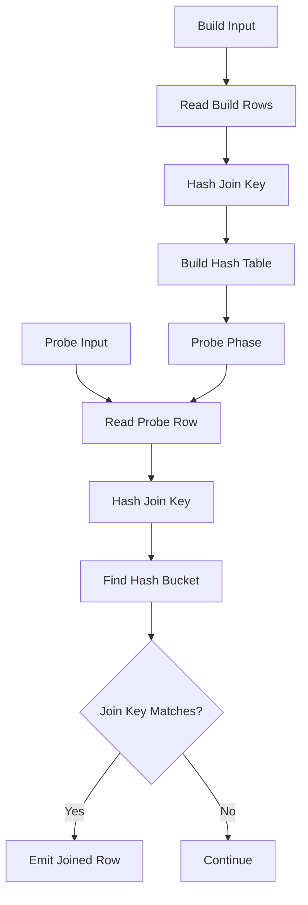
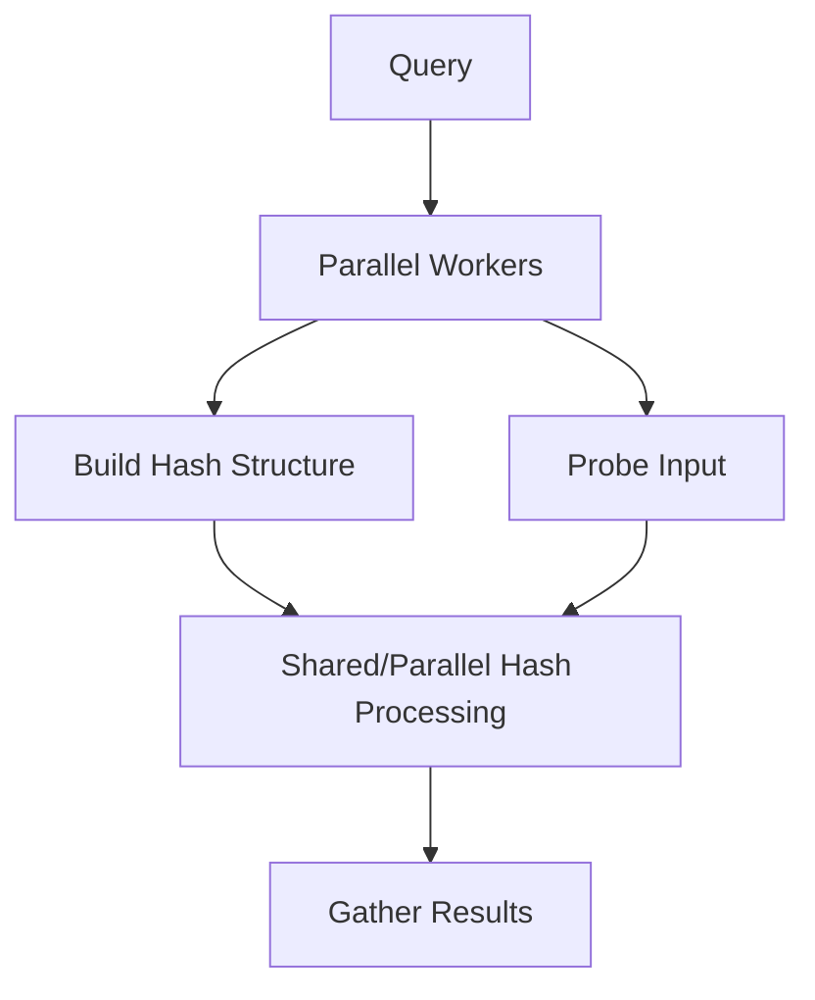

# 13- Hash Join

## Overview

A **Hash Join** is a relational database join algorithm that uses a hash table to efficiently match rows from two inputs based on an equality condition.

It is particularly effective when:

- Both inputs contain many rows.
- The join predicate uses equality, such as `a.customer_id = b.id`.
- An index-based lookup for every outer row would be expensive.
- The inputs do not already have a useful ordering.
- The database can allocate sufficient memory for the hash structure.

For large equality joins, a hash join can avoid the repeated inner lookups characteristic of a Nested Loop Join.

The central idea is:

```text
Build a hash table from one input
            ↓
Hash rows from the other input
            ↓
Look for matching hash buckets
            ↓
Compare join keys
            ↓
Emit matching rows
```

The optimizer chooses a hash join when its estimated total cost is competitive with alternatives such as Nested Loop Join and Merge Join.

## Why Hash Joins Exist

Consider:

```sql
SELECT
    o.id,
    o.total,
    c.email
FROM orders AS o
JOIN customers AS c
    ON c.id = o.customer_id;
```

If there are millions of orders and millions of customers, performing an index lookup into `customers` for every order can require a very large number of random accesses.

A hash join can instead:

1. Read one input and build a hash table on the join key.
2. Read the other input.
3. Hash its join key.
4. Locate candidate matching rows in the hash table.
5. Compare the actual join keys.
6. Emit matches.

Conceptually:

```text
customers
    ↓
hash(customer.id)
    ↓
Hash Table

orders
    ↓
hash(order.customer_id)
    ↓
Hash Table Lookup
    ↓
Matching customer
```

This turns the join into a largely sequential processing operation rather than performing an independent lookup for every outer row.

## Equality Join Requirement

Hash joins are primarily designed for equality predicates:

```sql
ON a.id = b.id
```

or:

```sql
ON a.customer_id = b.customer_id
```

They are not generally the appropriate strategy for predicates such as:

```sql
ON a.created_at < b.created_at
```

or:

```sql
ON a.price BETWEEN b.min_price AND b.max_price
```

The ability to partition and look up rows using an equality key is fundamental to the hash-join algorithm.

## Core Algorithm

A simplified hash join has two phases.

### Build Phase

The database selects one input as the **build side** and creates a hash table.

```text
Build input
    ↓
Read row
    ↓
Extract join key
    ↓
Compute hash
    ↓
Insert row into bucket
```

For:

```text
customers.id
```

the hash table might conceptually look like:

```text
Hash Table

Bucket 0 → customer 12
Bucket 1 → customer 91, customer 144
Bucket 2 → customer 7
Bucket 3 → customer 42
...
```

### Probe Phase

The database reads the **probe side** and searches the hash table.

```text
Probe row
    ↓
Extract join key
    ↓
Compute hash
    ↓
Find bucket
    ↓
Compare join key
    ↓
Emit matching rows
```

For:

```text
orders.customer_id = 42
```

the executor computes the hash for `42`, locates the corresponding bucket, and checks candidate rows for an exact key match.

## Hash Join Lifecycle



The build phase generally happens before the probe phase for a given hash table.

## Build Side vs Probe Side

The distinction is important when reading execution plans.

| Side | Responsibility |
|---|---|
| Build side | Used to construct the hash table |
| Probe side | Used to look up matching hash entries |
| Hash key | Column or expression used to partition rows |
| Hash table | In-memory structure containing build-side rows |

The optimizer generally prefers a build side that is relatively small because the hash table must be constructed and may need to fit efficiently in memory.

For:

```sql
orders.customer_id = customers.id
```

if `customers` has significantly fewer qualifying rows than `orders`, `customers` is often a good build-side candidate.

The exact choice is optimizer-dependent.

## Hash Join Complexity

For an ideal in-memory hash join:

```text
Build phase ≈ O(N)
Probe phase ≈ O(M)
Total ≈ O(N + M)
```

This assumes reasonably distributed hashes and sufficient memory.

That is attractive compared with the conceptual:

```text
Nested Loop ≈ O(N × M)
```

behavior of comparing every row from one input with every row from the other.

However, actual database execution includes:

- Hash table construction.
- Tuple processing.
- Memory management.
- Hash collisions.
- Filtering.
- Possible batching.
- Disk I/O when the hash table cannot fit in memory.

Therefore, Big-O notation is useful for understanding the algorithm but should not be used as a substitute for execution-plan analysis.

## Hash Buckets and Collisions

A hash function maps join keys to hash values and buckets.

Different keys can produce the same bucket:

```text
customer_id = 42
customer_id = 107
        ↓
same bucket
```

This is a **hash collision**.

The executor cannot assume that rows in the same bucket actually match. It must compare the join keys after locating the bucket.

Conceptually:

```text
Hash lookup
    ↓
Bucket
    ↓
Candidate rows
    ↓
Exact equality comparison
    ↓
Join result
```

A good hash function distributes keys reasonably evenly, reducing excessive bucket concentration.

## Memory and `work_mem`

Hash joins are strongly affected by available memory.

In PostgreSQL, `work_mem` controls the amount of memory available to an individual query operation before it generally needs to use temporary files or other spill mechanisms.

Inspect the current setting:

```sql
SHOW work_mem;
```

For a session-level diagnostic:

```sql
SET work_mem = '64MB';
```

Do not blindly increase `work_mem` globally.

A single query can contain multiple memory-consuming operations, and many concurrent sessions can execute simultaneously.

For example:

```text
100 concurrent queries
×
64 MB per operation
```

does not imply a 64 MB total database memory requirement.

Memory consumption can be substantially higher depending on concurrent operations and plan structure.

## Hash Join Spilling

If the hash table cannot be processed entirely in memory, PostgreSQL can use **batching**.

Instead of keeping everything in memory:

```text
All build rows
      ↓
One large hash table
```

the executor can partition the work:

```text
Build rows
   ↓
Hash partitioning
   ├── Batch 1
   ├── Batch 2
   ├── Batch 3
   └── ...
```

Each batch can then be processed separately.

This allows the join to handle datasets larger than available memory, but it introduces additional I/O and can substantially increase execution time.

When examining:

```sql
EXPLAIN (ANALYZE, BUFFERS)
```

pay attention to hash-related information such as:

```text
Batches
Memory Usage
Disk Usage
```

A plan that unexpectedly uses many batches or significant temporary disk activity may indicate memory pressure or cardinality-estimation problems.

## Example PostgreSQL Plan

A typical hash join plan can look like:

```text
Hash Join
  Hash Cond: (orders.customer_id = customers.id)
  -> Seq Scan on orders
  -> Hash
       -> Seq Scan on customers
```

The execution flow is:

```text
customers
    ↓
Seq Scan
    ↓
Hash
    ↓
Hash Table

orders
    ↓
Seq Scan
    ↓
Probe Hash Table
    ↓
Matching rows
```

This can be highly efficient when both tables require substantial scanning.

## Practical Example

Consider:

```sql
CREATE TABLE customers (
    id BIGINT PRIMARY KEY,
    email TEXT NOT NULL
);

CREATE TABLE orders (
    id BIGINT PRIMARY KEY,
    customer_id BIGINT NOT NULL,
    status TEXT NOT NULL,
    total NUMERIC(12, 2) NOT NULL
);
```

Query:

```sql
SELECT
    o.id,
    o.total,
    c.email
FROM orders AS o
JOIN customers AS c
    ON c.id = o.customer_id
WHERE o.status = 'completed';
```

Suppose:

```text
customers = 5 million rows
orders = 50 million rows
completed orders = 20 million rows
```

A hash join may be attractive because the optimizer can:

```text
Read qualifying customers
        ↓
Build hash table on customers.id
        ↓
Read completed orders
        ↓
Hash orders.customer_id
        ↓
Probe customer hash table
        ↓
Return matches
```

The exact plan depends on statistics, filtering, memory, data distribution, and planner cost estimates.

## Why Indexes Do Not Guarantee an Index-Based Join

A common misconception is:

> "Both tables have indexes, so the database should use those indexes for the join."

Not necessarily.

Suppose:

```text
orders = 50 million rows
customers = 5 million rows
```

If the query needs a large fraction of both tables, repeatedly performing index lookups may require substantial random I/O.

A hash join can instead scan large portions of the relations sequentially.

Conceptually:

```text
Large result set
      ↓
Sequential processing
      ↓
Hash Join
```

may be cheaper than:

```text
Large result set
      ↓
Millions of index lookups
      ↓
Random access
```

Indexes remain valuable for selective predicates and other access paths, but they do not force a particular join strategy.

## Hash Join vs Nested Loop

| Characteristic | Hash Join | Nested Loop |
|---|---|---|
| Primary strength | Large equality joins | Small outer input + efficient inner lookup |
| Equality predicate | Excellent | Excellent |
| Range predicate | Not generally suitable as the primary strategy | Flexible |
| Memory requirement | Potentially significant | Usually lower |
| Repeated inner lookup | No | Yes |
| Sequential scans | Often useful | Can be useful |
| Small outer relation | May be unnecessary | Excellent |
| Large relations | Often effective | Can become expensive |
| Sensitive to outer cardinality | Less directly | Highly |
| Index dependency | Not required | Often beneficial |
| Spill risk | Yes | Different resource profile |

The optimizer should choose based on estimated total cost rather than a fixed preference.

## Hash Join vs Merge Join

| Characteristic | Hash Join | Merge Join |
|---|---|---|
| Equality join | Excellent | Excellent |
| Requires sorted inputs | No | Yes |
| Hash memory | Required | Not inherently |
| Can spill | Yes | Sorts may spill |
| Useful when inputs already sorted | Not specifically | Yes |
| Large unsorted inputs | Often strong | May require sorting |
| Ordered output | No inherent guarantee | Can naturally preserve merge ordering |
| Range-oriented joins | Not generally | More applicable in some cases |

If both relations are already available in compatible order, a merge join can be attractive.

If the inputs are large, unsorted, and joined by equality, a hash join may be more attractive.

## Choosing the Build Side

The build side matters because it determines the hash table.

Suppose:

```text
customers = 100,000 rows
orders = 100,000,000 rows
```

Building the hash table from `customers` is usually more reasonable than attempting to hash all 100 million orders.

The optimizer considers:

- Estimated row count.
- Estimated row width.
- Selectivity.
- Available memory.
- Join predicates.
- Other plan costs.

A useful mental model is:

```text
Smaller qualifying input
        ↓
Build hash table
        ↓
Larger input
        ↓
Probe
```

This is a heuristic, not a rule that the application should enforce manually.

## Row Width Matters

Two relations with the same row count can have very different hash-memory requirements.

For example:

```text
1,000,000 rows × 100 bytes
```

versus:

```text
1,000,000 rows × 2 KB
```

The second relation requires substantially more memory if many columns are carried into the hash structure.

This is one reason query projection matters.

Prefer selecting only required columns:

```sql
SELECT
    c.id,
    c.email
FROM customers AS c;
```

instead of:

```sql
SELECT *
FROM customers AS c;
```

when the extra columns are not needed.

The optimizer may also optimize internal tuple representation, so the exact memory footprint is implementation-dependent. The engineering principle remains: unnecessary row width can increase memory and data-processing costs.

## Filtering Before the Join

Push selective predicates as early as practical.

Instead of conceptually joining everything and filtering afterward:

```text
orders ─────────┐
                ├── Join ── Filter
customers ──────┘
```

the optimizer may be able to reduce inputs before joining:

```text
orders ── Filter ──┐
                   ├── Hash Join
customers ─────────┘
```

Example:

```sql
SELECT
    o.id,
    c.email
FROM orders AS o
JOIN customers AS c
    ON c.id = o.customer_id
WHERE o.status = 'completed'
  AND c.active = true;
```

If the predicates are selective, fewer rows may need to participate in the hash join.

Do not assume manually rewriting the SQL is always necessary. A capable optimizer can often push predicates through the relational plan automatically.

## Cardinality Estimation

Hash-join selection depends heavily on estimated row counts.

Suppose PostgreSQL estimates:

```text
customers = 100,000 rows
```

but the actual number is:

```text
customers = 20,000,000 rows
```

The optimizer may underestimate:

- Hash-table memory.
- CPU work.
- Probe cost.
- Number of batches.
- Overall execution cost.

This can lead to a poor plan.

Investigate estimation problems using:

```sql
EXPLAIN (ANALYZE, BUFFERS)
SELECT
    o.id,
    c.email
FROM orders AS o
JOIN customers AS c
    ON c.id = o.customer_id
WHERE o.status = 'completed';
```

Compare:

```text
estimated rows
vs
actual rows
```

Large discrepancies deserve investigation.

## Statistics and Hash Join Decisions

PostgreSQL relies on statistics to estimate:

- Number of rows.
- Number of distinct values.
- Value distributions.
- Predicate selectivity.
- Join cardinality.

Refresh statistics when appropriate:

```sql
ANALYZE customers;
ANALYZE orders;
```

For highly skewed columns, PostgreSQL's statistics configuration can sometimes be tuned at the column level.

Example:

```sql
ALTER TABLE orders
ALTER COLUMN customer_id SET STATISTICS 500;
```

Then:

```sql
ANALYZE orders;
```

Higher statistics targets can improve estimates for some workloads but increase planning and statistics-maintenance costs.

Use targeted tuning based on evidence rather than increasing statistics targets indiscriminately.

## Hash Join and Data Skew

Hash joins work best when hash keys distribute reasonably across buckets.

Severe data skew can create hot buckets.

For example:

```text
customer_id = 1 → 40% of all orders
customer_id = 2 → 20%
customer_id = 3 → 10%
...
```

A small number of keys dominate the dataset.

This can affect:

- CPU distribution.
- Memory usage.
- Parallel execution.
- Batch behavior.
- Overall execution time.

Skew should be considered when evaluating production workloads, particularly in multi-tenant systems where a few large tenants may dominate traffic.

## Parallel Hash Join

PostgreSQL can use parallel execution for suitable queries.

A plan may look conceptually like:

```text
Gather
  └── Parallel Hash Join
       ├── Parallel Scan
       └── Parallel Hash
            └── Parallel Scan
```

Conceptually:



Parallel execution can improve throughput for large analytical workloads, but it is not automatically beneficial.

Consider:

- CPU availability.
- Worker startup overhead.
- Memory consumption.
- I/O bandwidth.
- Query concurrency.
- Result size.

A parallel plan can also compete with other production queries for CPU and memory.

## Hash Join and `LIMIT`

A hash join generally needs to build its hash structure before probing.

Therefore, a query such as:

```sql
SELECT
    o.id,
    c.email
FROM orders AS o
JOIN customers AS c
    ON c.id = o.customer_id
LIMIT 10;
```

does not necessarily mean that the database can avoid most of the join work.

A Nested Loop can sometimes exploit `LIMIT` more effectively when it can quickly find the first matching rows through indexes.

This is one reason query shape matters when comparing join algorithms.

## Transaction and Concurrency Considerations

A query using a hash join can consume significant:

- CPU.
- Memory.
- Temporary disk space.
- I/O bandwidth.

Under concurrency, several large hash joins can execute simultaneously.

For example:

```text
Query A → large hash table
Query B → large hash table
Query C → large hash table
Query D → large hash table
```

The aggregate resource usage can be much greater than the cost of one query in isolation.

Production tuning therefore requires evaluating:

```text
Single-query performance
+
Concurrent workload
+
Database resource limits
```

## Monitoring Hash Joins

Useful signals include:

| Signal | Why it matters |
|---|---|
| Execution time | Measures query latency |
| CPU utilization | Detects CPU-heavy joins |
| Temporary file usage | Indicates spill activity |
| `Batches` | Shows hash partitioning/batching |
| `Memory Usage` | Shows hash memory consumption |
| `Disk Usage` | Indicates temporary disk work |
| Estimated vs actual rows | Detects cardinality problems |
| Buffer reads/hits | Shows I/O and cache behavior |
| Query frequency | Determines aggregate resource cost |

For PostgreSQL:

```sql
EXPLAIN (ANALYZE, BUFFERS)
SELECT
    o.id,
    o.total,
    c.email
FROM orders AS o
JOIN customers AS c
    ON c.id = o.customer_id
WHERE o.status = 'completed';
```

For production-wide visibility, tools such as `pg_stat_statements` are useful for identifying frequently executed or expensive SQL statements.

## Production Optimization Strategy

When a hash join is unexpectedly slow, investigate in this order:

1. Verify the actual execution plan.
2. Compare estimated and actual cardinalities.
3. Check hash memory usage and batching.
4. Check temporary I/O.
5. Verify statistics freshness.
6. Inspect data distribution and skew.
7. Check whether predicates are sufficiently selective.
8. Compare alternative join strategies.
9. Evaluate concurrent workload.
10. Re-test against production-like data.

Do not immediately increase `work_mem`.

A memory increase may reduce spilling but can create a larger system-wide memory problem under concurrency.

## Common Mistakes

### Assuming Hash Join Is Always Faster

Hash joins are excellent for many large equality joins, but not universally optimal.

For:

```text
1 customer
20 orders
```

a nested loop with an index may be significantly cheaper.

### Assuming Hash Join Requires an Index

It does not.

A hash join can work efficiently using sequential scans.

### Ignoring Memory

Large hash tables consume memory.

A query that performs well with:

```text
1 GB available memory
```

may behave differently when the same workload runs under:

```text
tight memory constraints
```

### Increasing `work_mem` Globally

This is dangerous in high-concurrency environments.

Instead, understand:

```text
query concurrency
×
memory-consuming operations
×
per-operation memory
```

before changing global settings.

### Ignoring Temporary Disk Usage

A spilling hash join may remain correct but become substantially slower due to temporary I/O.

### Looking Only at the Hash Join Node

Inspect its children.

For example:

```text
Hash Join
├── Seq Scan on orders
└── Hash
     └── Seq Scan on customers
```

The expensive operation may be:

- Reading the base tables.
- Filtering rows.
- Building the hash.
- Spilling batches.
- Probing the hash.

### Ignoring Data Skew

Average cardinality can hide pathological values.

A tenant with millions of rows can behave very differently from thousands of small tenants.

### Forcing a Join Strategy

Planner configuration can be useful for controlled experimentation:

```sql
SET enable_hashjoin = off;
```

But disabling hash joins is generally a diagnostic technique, not a production optimization strategy.

Compare plans and understand why the optimizer selected the original strategy.

## Backend Engineering Example

Consider a reporting endpoint:

```text
GET /reports/customer-orders
```

The service may execute:

```sql
SELECT
    c.id,
    c.email,
    COUNT(o.id) AS order_count,
    SUM(o.total) AS total_spend
FROM customers AS c
JOIN orders AS o
    ON o.customer_id = c.id
WHERE o.created_at >= CURRENT_DATE - INTERVAL '30 days'
GROUP BY
    c.id,
    c.email;
```

For a large reporting workload, a hash join may be part of a broader execution plan:

```text
Recent Orders
      ↓
Scan / Filter
      ↓
Hash Join ← Customers
      ↓
Aggregate
      ↓
GROUP BY customer
      ↓
API response
```

This is different from a highly selective transactional request.

For example:

```text
GET /customers/123/orders
```

may favor:

```text
Index lookup
    ↓
Nested Loop
    ↓
Small result
```

The same database can therefore use completely different join strategies for different endpoints.

## Django and FastAPI Considerations

ORM-generated SQL should still be analyzed at the database level.

For Django:

```python
queryset = (
    Order.objects
    .select_related("customer")
    .filter(status="completed")
)
```

Inspect the generated SQL when diagnosing performance:

```python
print(queryset.query)
```

Then evaluate the actual SQL using PostgreSQL tooling.

For FastAPI or other Python services, use parameterized database access through the selected driver or ORM rather than interpolating values into SQL.

The application framework does not determine whether PostgreSQL uses a hash join. The database optimizer makes that decision from the resulting SQL, schema, statistics, configuration, and runtime conditions.

## Security Considerations

Hash-join optimization does not change the fundamental SQL security rules.

Use parameterized queries:

```python
cursor.execute(
    """
    SELECT
        o.id,
        c.email
    FROM orders AS o
    JOIN customers AS c
        ON c.id = o.customer_id
    WHERE o.status = %s
    """,
    (status,),
)
```

Avoid:

```python
# Avoid
query = f"""
SELECT *
FROM orders
WHERE status = '{status}'
"""
```

For multi-tenant systems, also ensure that tenant predicates are enforced consistently:

```sql
WHERE o.tenant_id = $1
  AND c.tenant_id = $1
```

The exact predicate depends on the schema and tenancy model.

Performance optimization must never weaken authorization or tenant isolation.

## Reliability and Scalability

Large hash joins can become operationally significant when executed concurrently.

A useful production flow is:

```text
Large query
    ↓
Large hash table
    ↓
High CPU / memory
    ↓
Temporary I/O
    ↓
Database contention
    ↓
Connection queueing
    ↓
Higher API latency
```

For scalable systems:

- Keep analytical queries away from latency-sensitive transactional paths when appropriate.
- Bound expensive API operations with pagination or asynchronous workflows.
- Monitor temporary file activity.
- Monitor CPU and memory.
- Keep statistics current.
- Test under realistic concurrency.
- Consider read replicas for suitable read-heavy workloads.
- Avoid using a read replica as a substitute for fixing an inefficient query.

For large reporting workloads, asynchronous processing through systems such as Celery can sometimes prevent long-running analytical queries from blocking synchronous API requests.

## Cost Considerations

Hash joins can be cost-efficient because they often favor sequential processing over large numbers of random index lookups.

However, expensive hash joins can increase:

- Database CPU.
- Memory pressure.
- Temporary storage I/O.
- Query latency.
- Read replica load.
- Managed database instance requirements.

On AWS RDS or Aurora PostgreSQL, monitor database-level resource utilization alongside query plans.

The optimization target should be:

```text
Query latency
+
CPU
+
Memory
+
I/O
+
Concurrency impact
+
Infrastructure cost
```

rather than query latency alone.

## Interview Traps

| Question | Strong answer |
|---|---|
| What is a Hash Join? | A join strategy that builds a hash table from one input and probes it with the other input using an equality join key. |
| When is Hash Join useful? | Primarily for relatively large equality joins where building and probing a hash table is cheaper than repeated lookups or sorting. |
| What is the ideal complexity? | Approximately `O(N + M)` for in-memory execution with good hash distribution. |
| Does Hash Join require an index? | No. It can efficiently use sequential scans. |
| What is the build side? | The input used to construct the hash table. |
| What is the probe side? | The input whose rows are used to search the hash table for matches. |
| Why should the build side generally be smaller? | The hash table consumes memory, so a smaller qualifying input reduces memory and build costs. |
| What happens if the hash table does not fit in memory? | The executor can use batching and temporary storage, increasing I/O and execution cost. |
| What does `Batches` indicate? | Hash processing has been partitioned into batches, often because the hash workload cannot be handled as one in-memory batch. |
| Why can a Hash Join be faster than indexed lookups? | For large joins, sequential scans plus hashing can be cheaper than performing millions of random index lookups. |
| Is Hash Join always faster than Nested Loop? | No. Highly selective queries with a small outer input and efficient inner indexes often favor Nested Loop. |
| Why does `LIMIT` sometimes favor Nested Loop? | Nested Loop can sometimes find the first required rows quickly through selective indexed paths, while a Hash Join may need to build the hash structure first. |
| What is hash spilling? | Processing hash data in multiple batches with temporary storage when the workload cannot be handled efficiently in memory. |
| What can cause an unexpectedly expensive Hash Join? | Poor cardinality estimates, insufficient memory, spilling, data skew, large row widths, or an inherently expensive input scan. |
| Should you increase `work_mem` immediately? | No. First determine whether spilling is actually the bottleneck and consider concurrency because higher per-operation memory can multiply across sessions. |
| How do you investigate a Hash Join? | Use `EXPLAIN (ANALYZE, BUFFERS)` and inspect actual rows, estimated rows, hash memory, batches, disk usage, buffer activity, and execution time. |
| Can Hash Join handle range joins? | It is primarily designed for equality joins; other join algorithms are generally more appropriate for range predicates. |
| What is the main senior-level consideration? | Evaluate the join strategy as part of the complete workload, including cardinality, memory, I/O, concurrency, data distribution, and alternative plans. |

## Key Takeaways

- **Hash Join builds a hash table from one input and probes it with the other, making it highly effective for large equality joins.**
- **The build side should generally be the smaller qualifying input because the hash structure consumes memory.**
- **Hash joins can spill into batches and temporary storage when memory is insufficient, making `work_mem`, concurrency, and cardinality estimates important production considerations.**
- **Hash Join is not inherently better than Nested Loop or Merge Join; the optimal strategy depends on cardinality, selectivity, indexes, ordering, memory, and workload shape.**
- **Use `EXPLAIN (ANALYZE, BUFFERS)` to evaluate actual rows, hash memory, batches, disk usage, and input-scan costs before changing indexes, memory settings, or planner behavior.**