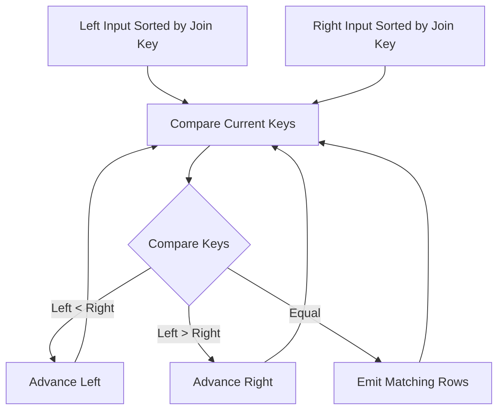

# 14- Merge Join

## Overview

A **Merge Join** is a relational database join algorithm that joins two inputs by processing them in the order of their join keys.

The algorithm relies on both inputs being ordered by the join key. If the inputs are not already ordered, the database may add sort operations before performing the join.

For an equality join such as:

```sql
SELECT
    o.id,
    c.email
FROM orders AS o
JOIN customers AS c
    ON c.id = o.customer_id;
```

a merge join conceptually processes the two ordered streams together:

```text
customers.id       orders.customer_id
     ↓                     ↓
   1  ────────────────  1
   2  ────────────────  2
   4  ────────────────  4
   7  ────────────────  7
     ↓
Merge matching keys
     ↓
Joined rows
```

Once both inputs are sorted, the executor can advance through them without repeatedly scanning either input.

Merge Join is especially useful when:

- Inputs are already sorted.
- Indexes can provide the required ordering.
- Large relations need to be joined.
- The join condition benefits from ordered processing.
- A Merge Join can avoid expensive additional sorting.
- The query requires ordered output or has other plan operations that benefit from sorted inputs.

It is one of the three major join strategies commonly encountered in PostgreSQL execution plans alongside **Nested Loop Join** and **Hash Join**.

## Why Merge Join Exists

A database has multiple ways to match rows between two relations.

Consider:

```sql
SELECT
    o.id,
    c.email
FROM orders AS o
JOIN customers AS c
    ON c.id = o.customer_id;
```

A Nested Loop may repeatedly search one relation.

A Hash Join may build a hash table and probe it.

A Merge Join instead exploits ordering:

```text
Input A                         Input B

1                               1
2                               2
4                               3
5                               4
8                               5
                                8

        ↓ sorted streams ↓

1 = 1 → match
2 = 2 → match
4 > 3 → advance B
4 = 4 → match
5 > 4 → advance B
5 = 5 → match
8 > 5 → advance B
8 = 8 → match
```

The executor can discard rows that can no longer produce matches and continue forward through both inputs.

This makes the algorithm particularly attractive for large, ordered datasets.

## Core Algorithm

A simplified Merge Join algorithm maintains one current row from each input.

```text
Read next row from left
Read next row from right

Compare join keys

left.key < right.key
    → advance left

left.key > right.key
    → advance right

left.key = right.key
    → emit matching rows
```

Conceptually:



The important requirement is that the ordering of both inputs is compatible with the join keys.

## Sorting Requirements

A Merge Join requires ordered inputs.

For:

```sql
ON a.customer_id = b.customer_id
```

the inputs need to be ordered by the relevant join keys.

If the database already has suitable ordered access paths, it may avoid an explicit sort.

For example:

```text
Index Scan
    ↓
rows already ordered by customer_id
    ↓
Merge Join
```

Alternatively:

```text
Seq Scan
    ↓
Sort by customer_id
    ↓
Merge Join
```

The second option introduces sorting cost.

## Indexes and Merge Join

Indexes can make Merge Join attractive because many B-tree indexes can provide rows in key order.

For example:

```sql
CREATE INDEX idx_orders_customer_id
ON orders (customer_id);
```

The database may be able to use an ordered index scan:

```text
orders
  ↓
Index Scan
  ↓
customer_id ordered
  ↓
Merge Join
```

This does **not** mean an index guarantees a Merge Join.

The optimizer still evaluates:

- Number of qualifying rows.
- Index scan cost.
- Sequential scan cost.
- Sort cost.
- Join cardinality.
- Selectivity.
- Random I/O.
- Parallelism.
- Available ordering.
- Overall query cost.

An index that provides ordering can be useful even when the final plan chooses another join strategy.

## Explicit Sort vs Existing Order

Consider:

```text
Input A
  ↓
Sort
  ↓
Merge Join
```

and:

```text
Input A
  ↓
Index Scan
  ↓
Merge Join
```

The second plan may avoid sorting, but an index scan is not automatically cheaper than a sequential scan followed by sorting.

For a large relation where most rows are required, this can happen:

```text
Sequential Scan
      ↓
Sort
      ↓
Merge Join
```

may be cheaper than:

```text
Index Scan
      ↓
Random heap access
      ↓
Merge Join
```

The optimizer must balance the cost of obtaining ordered data against the cost of sorting or scanning.

## Complexity

If both inputs are already sorted:

```text
Merge Join ≈ O(N + M)
```

where:

- `N` = number of rows in the first input.
- `M` = number of rows in the second input.

The executor generally advances each input rather than repeatedly restarting from the beginning.

If sorting is required, the overall cost includes sorting:

```text
Sort A       O(N log N)
Sort B       O(M log M)
Merge        O(N + M)
```

The actual database cost is more complex because it incorporates:

- CPU cost.
- Disk I/O.
- Memory.
- Cache behavior.
- Parallelism.
- Row width.
- Cardinality estimates.
- Existing ordering.

Therefore, the algorithmic complexity is useful for understanding the strategy, but not for predicting real query latency by itself.

## Duplicate Join Keys

Merge Join must correctly handle duplicate keys.

Consider:

```text
Left:
customer_id
----------
10
10
10

Right:
customer_id
----------
10
10
```

The result contains:

```text
3 × 2 = 6
```

matching combinations.

The executor therefore cannot simply emit one row and move past the key. It must correctly process all matching rows from both sides.

This matters when join keys are not unique.

A join such as:

```sql
SELECT *
FROM order_items AS oi
JOIN orders AS o
    ON o.id = oi.order_id;
```

usually has uniqueness on `orders.id`, while:

```sql
SELECT *
FROM events AS e1
JOIN events AS e2
    ON e1.user_id = e2.user_id;
```

may produce many-to-many matches.

Large duplicate groups can significantly increase result cardinality regardless of the efficiency of the Merge Join itself.

## Equality and Range Conditions

Merge Join is commonly associated with equality joins:

```sql
ON a.id = b.id
```

but its ordered nature also makes merge-based processing useful for some non-equality join predicates, depending on the database and exact join condition.

For example, range relationships can sometimes benefit from ordered processing:

```sql
ON a.timestamp >= b.start_time
AND a.timestamp < b.end_time
```

However, support and plan selection are database-specific.

Do not assume every range predicate can use a Merge Join. Always inspect the actual execution plan.

## Merge Join vs Hash Join

| Characteristic | Merge Join | Hash Join |
|---|---|---|
| Main technique | Compare sorted inputs | Build and probe hash table |
| Equality joins | Excellent | Excellent |
| Ordered inputs | Required | Not required |
| Existing indexes/order | Can be highly valuable | Less directly relevant |
| Sorting | May be required | Not required |
| Hash memory | Not required | Potentially significant |
| Temporary spill | Sorts may spill | Hash batches may spill |
| Large unsorted inputs | May require expensive sorts | Often attractive |
| Already sorted inputs | Excellent fit | Ordering provides little benefit |
| Ordered output | Can preserve useful ordering | Does not inherently produce ordered output |
| Range-oriented processing | Can be useful in suitable cases | Primarily equality-oriented |

The optimizer chooses between them based on estimated cost.

## Merge Join vs Nested Loop

| Characteristic | Merge Join | Nested Loop |
|---|---|---|
| Large inputs | Often effective | Can become expensive |
| Small outer input | Usually unnecessary overhead | Excellent |
| Ordered data | Major advantage | Not required |
| Index dependency | Helpful but not mandatory | Often important |
| Equality join | Excellent | Excellent |
| Range predicates | Can be useful | Flexible |
| Startup cost | Can be higher due to sorting | Often low |
| `LIMIT` | May require significant preparation | Can return rows quickly |
| Repeated inner lookup | No | Yes |
| Duplicate keys | Handles correctly | Handles correctly |

A selective API lookup may favor Nested Loop:

```text
Find customer by primary key
        ↓
Fetch small set of orders
        ↓
Return immediately
```

A large reporting query may favor Merge Join:

```text
Large ordered inputs
        ↓
Merge
        ↓
Aggregate/report
```

## Startup Cost and `LIMIT`

Merge Join can have higher startup cost when sorting is required.

For example:

```sql
SELECT
    o.id,
    c.email
FROM orders AS o
JOIN customers AS c
    ON c.id = o.customer_id
LIMIT 10;
```

If the inputs require sorting, the database may need to perform substantial work before producing the first joined row.

A Nested Loop may be preferable when:

- The outer relation is highly selective.
- The inner relation has an efficient index.
- Only a few rows are needed.
- `LIMIT` allows execution to stop early.

This is an important distinction between:

```text
startup cost
```

and:

```text
total cost
```

A plan that is excellent for scanning the entire result can be worse for returning the first few rows.

## Merge Join and Ordering

One of the strongest properties of Merge Join is its relationship with ordering.

Suppose:

```sql
SELECT
    c.id,
    o.id
FROM customers AS c
JOIN orders AS o
    ON o.customer_id = c.id
ORDER BY c.id;
```

If the plan already processes both inputs in compatible order, the join may contribute useful ordering to downstream operations.

This can potentially reduce the need for a separate sort.

However, never infer output ordering merely from the presence of a Merge Join. SQL result ordering is guaranteed only when an appropriate `ORDER BY` is present.

The optimizer may also add additional operations when required by the complete query.

## Practical PostgreSQL Example

Consider:

```sql
CREATE TABLE customers (
    id BIGINT PRIMARY KEY,
    email TEXT NOT NULL
);

CREATE TABLE orders (
    id BIGINT PRIMARY KEY,
    customer_id BIGINT NOT NULL,
    created_at TIMESTAMPTZ NOT NULL,
    total NUMERIC(12, 2) NOT NULL
);

CREATE INDEX idx_orders_customer_id
ON orders (customer_id);
```

Query:

```sql
SELECT
    c.id,
    c.email,
    o.id,
    o.total
FROM customers AS c
JOIN orders AS o
    ON o.customer_id = c.id
ORDER BY c.id;
```

The database may be able to exploit:

```text
customers primary-key order
        +
orders customer_id index order
        ↓
Merge Join
```

A simplified plan could conceptually look like:

```text
Merge Join
  Merge Cond: (c.id = o.customer_id)
  -> Index Scan using customers_pkey on customers
  -> Index Scan using idx_orders_customer_id on orders
```

The exact plan depends on table size, statistics, correlation, costs, and the selected PostgreSQL version/configuration.

## When a Sort Appears

A plan may instead look like:

```text
Merge Join
  Merge Cond: (c.id = o.customer_id)
  -> Sort
       -> Seq Scan on customers
  -> Sort
       -> Seq Scan on orders
```

Here, the Merge Join itself is not necessarily the expensive part.

The expensive work may be:

```text
Sequential Scan
       ↓
Sort
       ↓
Merge Join
```

When diagnosing performance, inspect the complete subtree rather than focusing only on the join node.

## External Sorts and Memory

If a required sort does not fit in memory, PostgreSQL can use temporary disk storage.

For example:

```text
Seq Scan
   ↓
Sort
   ↓
temporary files
   ↓
Merge Join
```

This can increase latency significantly.

Use:

```sql
EXPLAIN (ANALYZE, BUFFERS)
SELECT
    c.id,
    c.email,
    o.id
FROM customers AS c
JOIN orders AS o
    ON o.customer_id = c.id
ORDER BY c.id;
```

Look for sort information such as:

```text
Sort Method
Memory
Disk
```

A disk-based sort does not necessarily mean the query is wrong. Large datasets can legitimately require external sorting. The question is whether the cost is acceptable for the workload.

## `work_mem` and Merge Join

`work_mem` affects memory available to operations such as sorting.

Inspect it with:

```sql
SHOW work_mem;
```

For controlled testing:

```sql
SET work_mem = '128MB';
```

Increasing `work_mem` may allow a sort to remain in memory:

```text
Disk sort
    ↓
Memory pressure
    ↓
Temporary I/O
```

becoming:

```text
In-memory sort
    ↓
No temporary sort files
```

But increasing it globally without considering concurrency can be dangerous.

Multiple concurrent queries can each execute multiple memory-consuming operations.

The correct production approach is to:

- Measure temporary I/O.
- Identify expensive sorts.
- Understand concurrency.
- Tune selectively.
- Re-test under realistic load.

## Cardinality Estimates

Merge Join selection is highly dependent on estimated cardinalities and costs.

Suppose PostgreSQL estimates:

```text
orders = 100,000 rows
```

but actual execution processes:

```text
orders = 50,000,000 rows
```

The optimizer may choose an inappropriate strategy because its cost model was based on incorrect assumptions.

Inspect:

```sql
EXPLAIN (ANALYZE, BUFFERS)
SELECT
    c.id,
    o.id
FROM customers AS c
JOIN orders AS o
    ON o.customer_id = c.id;
```

Compare:

```text
rows=estimated
```

with:

```text
actual rows
```

Large discrepancies can indicate stale statistics, insufficient statistics detail, data skew, or predicates whose selectivity is difficult to estimate.

## Statistics

Keep PostgreSQL statistics current:

```sql
ANALYZE customers;
ANALYZE orders;
```

Autovacuum normally performs automatic statistics maintenance, but heavily modified or unusual workloads may require investigation.

For columns where selectivity estimation is particularly important, a higher statistics target can sometimes improve estimates:

```sql
ALTER TABLE orders
ALTER COLUMN customer_id SET STATISTICS 500;

ANALYZE orders;
```

Use this selectively. More detailed statistics can increase analysis and planning overhead.

## Merge Join with Index Scans

An index can provide ordering without requiring a separate sort.

Conceptually:

```text
Index Scan
     ↓
ordered tuples
     ↓
Merge Join
```

But an index scan can be more expensive than a sequential scan when a large fraction of a table is required.

Consider:

```text
Option A

Seq Scan
   ↓
Sort
   ↓
Merge Join
```

versus:

```text
Option B

Index Scan
   ↓
Merge Join
```

The optimizer chooses based on its cost model.

Senior-level query tuning requires asking:

> Is the index providing useful ordering cheaply enough to justify using it?

rather than:

> Can I force the database to use the index?

## Parallel Execution

Merge Join can participate in parallel execution plans, but the exact shape depends on database version, query structure, and planner capabilities.

Parallel execution can introduce additional considerations:

- Worker startup cost.
- Data redistribution.
- Sorting work.
- Memory consumption.
- CPU contention.
- Synchronization overhead.

A parallel plan is not automatically faster.

For latency-sensitive APIs, adding workers can sometimes increase resource contention with other queries even when the individual query becomes faster.

## Merge Join and Aggregation

Merge Join can be useful before an aggregation when the resulting order aligns with downstream operations.

For example:

```sql
SELECT
    c.id,
    COUNT(o.id)
FROM customers AS c
JOIN orders AS o
    ON o.customer_id = c.id
GROUP BY c.id
ORDER BY c.id;
```

A plan may combine:

```text
Ordered customer input
        +
Ordered order input
        ↓
Merge Join
        ↓
Aggregation
        ↓
Ordered result
```

Whether this actually happens depends on the optimizer and aggregate strategy.

Do not assume that a Merge Join automatically makes every downstream operation cheaper.

## Production Query Analysis

Use:

```sql
EXPLAIN (ANALYZE, BUFFERS)
SELECT
    c.id,
    c.email,
    o.id,
    o.total
FROM customers AS c
JOIN orders AS o
    ON o.customer_id = c.id;
```

Focus on:

| Plan detail | Why it matters |
|---|---|
| `Merge Join` | Confirms selected join strategy |
| `Merge Cond` | Shows join keys |
| `Sort` | Identifies ordering work |
| `Sort Method` | Shows in-memory or external sort |
| `Memory` | Shows sort memory usage |
| `Disk` | Indicates sort spill |
| `Index Scan` | May provide required ordering |
| `Seq Scan` | May be cheaper for large inputs |
| Estimated rows | Planner's cardinality assumption |
| Actual rows | Runtime cardinality |
| Buffers | I/O and cache behavior |
| Execution Time | Actual runtime |

A common diagnostic pattern is:

```text
Merge Join
├── Sort
│   └── Seq Scan
└── Sort
    └── Seq Scan
```

If the query is slow, investigate whether the sorting or underlying scans dominate the execution time.

## Common Mistakes

### Assuming Merge Join Is Always Better for Large Tables

Large tables alone do not imply Merge Join.

If both inputs are unsorted and a Hash Join can process them without expensive sorts, Hash Join may be cheaper.

### Assuming an Index Guarantees Merge Join

An index provides a possible access path and potentially useful ordering.

The optimizer can still choose:

```text
Seq Scan
+
Hash Join
```

if that is cheaper.

### Ignoring Sort Cost

A Merge Join may look elegant while the expensive work happens immediately before it:

```text
Sort
  ↓
Sort
  ↓
Merge Join
```

Always inspect the entire plan.

### Increasing `work_mem` Globally

This can reduce sort spilling but increase aggregate memory consumption under concurrency.

Tune based on workload evidence.

### Forcing Index Scans

An index scan can be more expensive than a sequential scan for a large portion of a table.

Let the optimizer choose unless controlled testing demonstrates a persistent planning problem.

### Ignoring Duplicate Join Keys

Duplicate keys can multiply output rows:

```text
N matching left rows
×
M matching right rows
=
N × M output rows
```

The join algorithm cannot eliminate legitimate result cardinality.

### Assuming Merge Join Guarantees Output Order

SQL ordering is guaranteed only with `ORDER BY`.

A Merge Join's internal processing order should not be treated as an application-level ordering contract.

### Comparing Plans Without Realistic Data

A Merge Join that performs well on:

```text
100,000 rows
```

may behave differently on:

```text
100 million rows
```

Test using production-like:

- Cardinalities.
- Data distributions.
- Indexes.
- Statistics.
- Concurrency.
- Memory limits.

## Interview Traps

| Question | Strong answer |
|---|---|
| What is a Merge Join? | A join algorithm that processes two inputs in compatible join-key order and advances through them to find matches. |
| What is the key requirement? | Inputs must be appropriately ordered by the join keys. |
| Does Merge Join always require a Sort node? | No. Existing ordering from an index or another plan operation may satisfy the requirement. |
| Why are indexes useful for Merge Join? | Ordered index scans can provide the required ordering without a separate sort. |
| Is an index required? | No. The database can sort sequentially scanned inputs. |
| What is the ideal merge phase complexity? | Approximately `O(N + M)` when inputs are already sorted. |
| What happens if inputs are unsorted? | The database may add Sort nodes, potentially making Merge Join more expensive. |
| How does Merge Join compare with Hash Join? | Hash Join avoids sorting and is often strong for large unsorted equality joins; Merge Join is attractive when inputs are already ordered or ordering is otherwise useful. |
| How does Merge Join compare with Nested Loop? | Merge Join is often better for larger inputs, while Nested Loop can be excellent for small/selective outer inputs with efficient inner lookups. |
| Why can `LIMIT` favor Nested Loop? | Nested Loop can sometimes produce the first rows quickly without sorting entire inputs. |
| Can duplicate keys be handled? | Yes. The executor must produce all valid combinations for duplicate matching keys. |
| Does Merge Join guarantee ordered query results? | No. SQL requires an explicit `ORDER BY` to guarantee result ordering. |
| What should you inspect when Merge Join is slow? | Sort cost, scan cost, estimated vs actual rows, buffers, temporary I/O, join cardinality, and whether another join strategy is cheaper. |
| What does a disk-based Sort indicate? | The sort used temporary storage rather than fitting entirely in memory. |
| Should `work_mem` always be increased when a sort spills? | No. Consider query requirements, concurrency, memory pressure, and whether eliminating the sort is a better solution. |
| Why might PostgreSQL choose a sequential scan instead of an index scan? | If a large portion of the table is needed, sequential access plus sorting can be cheaper than index-driven random heap access. |
| What is the senior-level perspective? | Evaluate Merge Join as part of the complete execution plan and workload, considering ordering, sort cost, cardinality, memory, I/O, concurrency, and alternative join strategies. |

## Key Takeaways

- **Merge Join processes two inputs in compatible join-key order, advancing through both streams instead of repeatedly probing one input.**
- **Its major advantage appears when useful ordering already exists through indexes or upstream operations; otherwise, required sorts can dominate its cost.**
- **Merge Join, Hash Join, and Nested Loop are workload-dependent strategies rather than universally ranked alternatives.**
- **Duplicate join keys can multiply result cardinality, while `LIMIT` and highly selective predicates can make Nested Loop more attractive.**
- **Use `EXPLAIN (ANALYZE, BUFFERS)` to distinguish join cost from scan, sort, temporary I/O, and cardinality-estimation problems before tuning indexes or memory.**