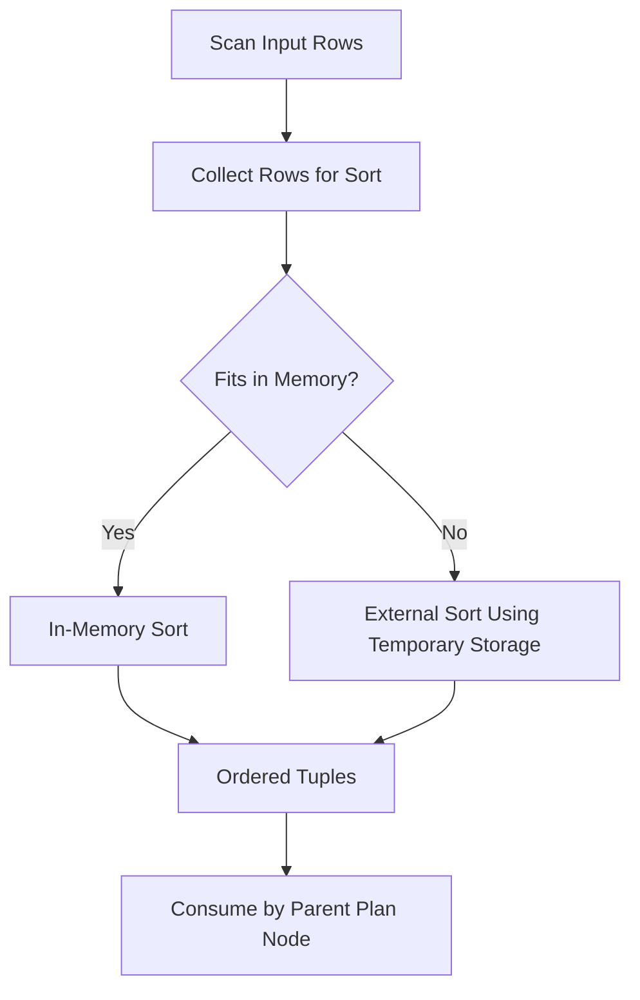

# 15- Sort Operations

## Overview

A **Sort operation** orders rows according to one or more expressions. Sorting is a fundamental execution primitive used by SQL databases for:

- `ORDER BY`
- `GROUP BY` in some execution strategies
- `DISTINCT`
- Merge Join
- Window functions
- Set operations
- Ordered aggregates
- Other operators that require ordered input

Sorting is logically simple but can become one of the most expensive operations in a production query because it may require reading a large number of rows, allocating substantial memory, comparing values, and potentially writing temporary data to disk.

For backend systems, understanding Sort operations is important because a query that looks inexpensive at the SQL level can become expensive at execution time:

```text
API Request
    ↓
Application
    ↓
SQL Query
    ↓
Seq Scan
    ↓
Sort
    ↓
Limit
    ↓
Response
```

A senior engineer should therefore ask not only:

> "Does the query have an index?"

but also:

> "Can the database obtain the required ordering without sorting a large intermediate result?"

## Why Sort Operations Exist

SQL allows applications to request ordered results:

```sql
SELECT
    id,
    email
FROM users
ORDER BY created_at DESC;
```

The database must produce rows in the requested order before returning the result.

If the chosen access path already produces that order, an explicit Sort may be unnecessary.

For example, a suitable B-tree index can potentially provide the required ordering:

```sql
CREATE INDEX idx_users_created_at
ON users (created_at DESC);
```

Conceptually:

```text
Index Scan
    ↓
Rows already ordered
    ↓
Result
```

Without a suitable ordered access path:

```text
Seq Scan
    ↓
Unordered rows
    ↓
Sort
    ↓
Result
```

The optimizer chooses between these alternatives based on estimated cost.

## Where Sort Appears

Sort operations can occur for several reasons.

| SQL feature | Why sorting may be required |
|---|---|
| `ORDER BY` | Produce requested result ordering |
| `DISTINCT` | Group equal values together in sort-based strategies |
| `GROUP BY` | Support sort-based aggregation |
| Merge Join | Provide ordered join inputs |
| Window functions | Provide required partition/order structure |
| Set operations | Support duplicate elimination or ordering |
| Ordered aggregates | Supply required aggregate input ordering |
| Subqueries | Satisfy ordering requirements of execution nodes |

The exact execution strategy is database-specific. PostgreSQL, for example, can choose between sort-based and hash-based approaches for several operations.

## Basic Sort Lifecycle

A simplified execution flow is:



The database first obtains rows from its child plan node.

It then orders those rows according to the required sort keys.

The sorted output is consumed by the parent plan node.

The important performance distinction is whether the operation can remain in memory or must use temporary storage.

## In-Memory Sort

When the sort fits within the memory available to the operation, the database can perform the sort without writing the sorted data to temporary disk storage.

Conceptually:

```text
Input rows
    ↓
Memory
    ↓
Sort
    ↓
Ordered rows
```

This is generally faster than an external sort because it avoids additional temporary I/O.

However, "in memory" does not mean "free."

The database still needs:

- CPU time for comparisons.
- Memory for sort state and tuples.
- Time to read the input.
- Time to produce ordered output.

For large datasets, even an in-memory sort can be expensive.

## External Sort

If the sort cannot fit within available memory, the database may use temporary storage.

Conceptually:

```text
Large input
    ↓
Read chunks
    ↓
Sort chunks
    ↓
Temporary files
    ↓
Merge sorted chunks
    ↓
Ordered output
```

This is commonly called an **external sort**.

Disk-backed sorting can significantly increase query latency because the execution path now includes temporary I/O.

In PostgreSQL, `EXPLAIN (ANALYZE, BUFFERS)` can expose sort behavior.

For example:

```sql
EXPLAIN (ANALYZE, BUFFERS)
SELECT
    id,
    email,
    created_at
FROM users
ORDER BY created_at DESC;
```

A plan may report information such as:

```text
Sort Method: external merge  Disk: ...
```

The exact output depends on the query and PostgreSQL version.

## `work_mem` and Sorting

In PostgreSQL, `work_mem` controls the amount of memory available to individual query operations before they may need temporary storage.

Inspect the current setting:

```sql
SHOW work_mem;
```

For controlled testing:

```sql
SET work_mem = '128MB';
```

Increasing `work_mem` can allow a larger sort to remain in memory.

However, this is not a universal performance fix.

A single query can perform multiple memory-consuming operations, and multiple concurrent queries can execute simultaneously.

For example:

```text
100 concurrent queries
        ×
multiple sort/hash operations
        ×
large work_mem
        ↓
Potentially high memory consumption
```

Therefore:

> `work_mem` is effectively an operation-level memory budget, not simply a per-query global memory allocation.

Production tuning should consider concurrency, query shape, workload, and observed temporary I/O.

## Sort Cost

A comparison-based sort is commonly described as approximately:

```text
O(N log N)
```

for `N` rows.

But database execution cost depends on much more than the mathematical sorting algorithm.

Important factors include:

- Number of rows.
- Row width.
- Number and type of sort keys.
- CPU cost of comparisons.
- Memory availability.
- Cache state.
- Temporary I/O.
- Existing ordering.
- Parallel execution.
- Cardinality estimates.

A sort over:

```text
10,000 narrow rows
```

is very different from sorting:

```text
50,000,000 wide rows
```

Even when both have the same logical SQL structure.

## Sorting Wide Rows

Consider:

```sql
SELECT *
FROM events
ORDER BY created_at DESC;
```

If `events` contains large payload columns, the database may need to process substantially more data than necessary.

Compare this with:

```sql
SELECT
    id,
    created_at,
    event_type
FROM events
ORDER BY created_at DESC;
```

Reducing unnecessary columns can decrease:

- Memory consumption.
- Tuple processing.
- Data movement.
- Temporary file size.
- Network transfer.

However, PostgreSQL's internal sort representation and tuple handling mean the relationship between selected columns and memory usage is not simply "all selected bytes are copied unchanged." The practical recommendation remains the same:

> Avoid carrying unnecessary wide data through expensive intermediate operations.

## `ORDER BY` and Indexes

A suitable index can sometimes eliminate an explicit Sort.

Consider:

```sql
SELECT
    id,
    created_at
FROM orders
ORDER BY created_at DESC
LIMIT 50;
```

With:

```sql
CREATE INDEX idx_orders_created_at
ON orders (created_at DESC);
```

the database may use an ordered index scan:

```text
Index Scan
    ↓
First 50 matching index entries
    ↓
Result
```

This can be dramatically cheaper than:

```text
Seq Scan
    ↓
Read millions of rows
    ↓
Sort millions of rows
    ↓
Return 50 rows
```

This is one of the most important production applications of index ordering.

## `ORDER BY ... LIMIT`

Sorting becomes particularly important for pagination and API endpoints.

Consider:

```sql
SELECT
    id,
    created_at,
    total
FROM orders
ORDER BY created_at DESC
LIMIT 50;
```

If no useful ordering exists, the database may need to process a large portion of the relation before returning the top 50 rows.

With a suitable index, it may instead walk the index and stop after enough rows are obtained.

Conceptually:

```text
Without useful index

All rows
   ↓
Sort
   ↓
Top 50
```

versus:

```text
With useful ordering

Index
   ↓
Already ordered
   ↓
First 50
```

This distinction becomes increasingly important as table size grows.

## Top-N Optimization

Databases can optimize queries where only a small number of ordered rows are required.

For:

```sql
SELECT
    id,
    created_at
FROM orders
ORDER BY created_at DESC
LIMIT 20;
```

the database does not necessarily need to perform a full conventional sort of every row.

Depending on the optimizer and execution strategy, it may use a top-N strategy or an index that provides the required ordering.

This is why `LIMIT` should be considered when interpreting a Sort node.

A plan that looks like:

```text
Sort
  Sort Key: created_at DESC
  -> Seq Scan
```

may internally use a bounded/top-N sorting strategy when only a limited number of rows are required.

Always inspect the actual execution plan rather than inferring the implementation from SQL syntax alone.

## Sort Direction

Indexes can support ordering in different directions.

For example:

```sql
CREATE INDEX idx_orders_created_at
ON orders (created_at);
```

A B-tree index can generally be scanned forward or backward, so an index created with ascending order can often support both:

```sql
ORDER BY created_at ASC
```

and:

```sql
ORDER BY created_at DESC
```

For multi-column indexes, direction and null-ordering interactions become more important.

For example:

```sql
CREATE INDEX idx_orders_customer_created
ON orders (customer_id, created_at DESC);
```

can be useful for queries whose filtering and ordering align with that index structure.

Do not add separate ascending and descending indexes blindly.

## Composite Indexes and Ordering

Consider:

```sql
SELECT
    id,
    customer_id,
    created_at
FROM orders
WHERE customer_id = 42
ORDER BY created_at DESC
LIMIT 50;
```

A composite index such as:

```sql
CREATE INDEX idx_orders_customer_created
ON orders (customer_id, created_at DESC);
```

can potentially support both:

- Filtering by `customer_id`.
- Ordering by `created_at`.

Conceptually:

```text
Index
(customer_id, created_at DESC)
          ↓
customer_id = 42
          ↓
rows already ordered
          ↓
LIMIT 50
```

This is generally more valuable than creating unrelated indexes:

```text
(customer_id)
(created_at)
```

when the workload repeatedly requires the combined access pattern.

The correct index depends on the complete query workload.

## Sort and Merge Join

Merge Join requires appropriately ordered inputs.

For example:

```sql
SELECT
    c.id,
    o.id
FROM customers AS c
JOIN orders AS o
    ON o.customer_id = c.id;
```

A Merge Join might receive:

```text
Customer input
    ↓
Sort by id
    ↓
Merge Join
```

and:

```text
Order input
    ↓
Sort by customer_id
    ↓
Merge Join
```

The sorting operations can become a substantial part of the query cost.

Alternatively, existing indexes may provide the required ordering:

```text
Customer index
    ↓
ordered rows
    \
     → Merge Join
    /
Order index
    ↓
ordered rows
```

This is one reason indexes can affect execution strategy beyond simple point lookups.

## Sort and Window Functions

Window functions frequently require ordered input.

Consider:

```sql
SELECT
    customer_id,
    order_id,
    created_at,
    ROW_NUMBER() OVER (
        PARTITION BY customer_id
        ORDER BY created_at DESC
    ) AS position
FROM orders;
```

The executor needs data organized according to the window definition.

A plan may contain sorting work similar to:

```text
Seq Scan
    ↓
Sort
    ↓
WindowAgg
```

An appropriate access path may reduce sorting requirements, although the exact planner behavior depends on the query and required ordering.

Window-heavy analytics queries should therefore be inspected carefully for:

- Large Sort nodes.
- Disk-based sorting.
- Large intermediate results.
- Partition cardinality.
- Unnecessary columns.

## Incremental Sorting

Modern PostgreSQL versions can use **Incremental Sort** when the input is already partially ordered.

For example, suppose the required order is:

```text
(customer_id, created_at)
```

but the input is already ordered by:

```text
customer_id
```

The executor may avoid sorting the entire dataset as one large set and instead sort groups within the existing ordering.

Conceptually:

```text
Input:
customer_id already ordered

1: rows
1: rows
1: rows
2: rows
2: rows
3: rows
...

        ↓

Sort each customer group by created_at

        ↓

Fully ordered output
```

This can reduce memory requirements and improve performance compared with a complete global sort.

When reading PostgreSQL plans, distinguish:

```text
Sort
```

from:

```text
Incremental Sort
```

because they represent different opportunities and costs.

## Sort and `DISTINCT`

Consider:

```sql
SELECT DISTINCT customer_id
FROM orders;
```

The database needs to eliminate duplicates.

Depending on the optimizer, it may use a sort-based strategy or another mechanism such as hashing.

A sort-based strategy conceptually performs:

```text
Rows
 ↓
Sort by customer_id
 ↓
Adjacent duplicates become identifiable
 ↓
Unique values
```

A HashAggregate may instead avoid sorting:

```text
Rows
 ↓
HashAggregate
 ↓
Unique values
```

The optimizer chooses based on estimated cost and execution requirements.

Therefore:

> A `DISTINCT` clause does not inherently mean a Sort node will appear.

## Sort and `GROUP BY`

Similarly:

```sql
SELECT
    customer_id,
    COUNT(*)
FROM orders
GROUP BY customer_id;
```

can potentially be implemented using different aggregation strategies.

A sort-based approach:

```text
Rows
 ↓
Sort customer_id
 ↓
GroupAggregate
 ↓
Result
```

or a hash-based approach:

```text
Rows
 ↓
HashAggregate
 ↓
Result
```

Again, the database chooses based on estimated costs and requirements.

## Sort and `GROUP BY` Ordering

A subtle optimization opportunity occurs when grouping and ordering use compatible keys.

For example:

```sql
SELECT
    customer_id,
    COUNT(*) AS order_count
FROM orders
GROUP BY customer_id
ORDER BY customer_id;
```

A plan that already produces grouped rows in the required order may avoid additional sorting.

This does not mean every `GROUP BY ... ORDER BY` query avoids sorting.

The optimizer must determine whether the chosen aggregation strategy produces the required ordering.

## Null Ordering

SQL databases have specific semantics for `NULL` ordering.

For example:

```sql
ORDER BY created_at DESC;
```

and:

```sql
ORDER BY created_at DESC NULLS LAST;
```

are not necessarily equivalent for all database systems and index definitions.

When an index is expected to satisfy an ordering requirement, verify:

- Sort direction.
- Null ordering.
- Collation.
- Expression.
- Composite-key ordering.

An index that looks superficially compatible may not satisfy the exact ordering required by the query.

## Collation and Sort Cost

Sorting text can involve collation rules.

Consider:

```sql
SELECT
    name
FROM customers
ORDER BY name;
```

Text comparison may be more expensive than comparing simple numeric values, particularly with complex locale-aware collation behavior.

For large text sorts, consider:

- Number of rows.
- String length.
- Collation.
- Whether ordering is actually required.
- Whether an index can provide the ordering.
- Whether the application can avoid unnecessary sorting.

Do not assume all comparisons have equivalent CPU cost.

## Sorting and Pagination

Offset pagination can make ordered queries increasingly expensive.

For example:

```sql
SELECT
    id,
    created_at
FROM orders
ORDER BY created_at DESC
LIMIT 50 OFFSET 500000;
```

Even with an appropriate ordering mechanism, the database may need to traverse or process a large number of rows before reaching the requested page.

For large datasets, **keyset pagination** is often more scalable.

Instead of:

```sql
LIMIT 50 OFFSET 500000
```

use a stable cursor condition:

```sql
SELECT
    id,
    created_at
FROM orders
WHERE (created_at, id) < (:last_created_at, :last_id)
ORDER BY created_at DESC, id DESC
LIMIT 50;
```

with a matching index:

```sql
CREATE INDEX idx_orders_created_id
ON orders (created_at DESC, id DESC);
```

This allows the database to continue from a known position rather than repeatedly skipping a large number of rows.

## Stable Ordering for APIs

Sorting only by a non-unique column can produce unstable pagination behavior.

Consider:

```sql
ORDER BY created_at DESC
```

If multiple rows have identical timestamps, their relative ordering may not be deterministic.

A more stable ordering is:

```sql
ORDER BY created_at DESC, id DESC
```

with an appropriate composite index.

This is particularly important for:

- REST APIs.
- gRPC services.
- Cursor pagination.
- Event feeds.
- Admin dashboards.
- Infinite scrolling.

The secondary key should provide deterministic ordering, typically using a unique column such as the primary key.

## Detecting Expensive Sorts

Use:

```sql
EXPLAIN (ANALYZE, BUFFERS)
SELECT
    id,
    customer_id,
    created_at
FROM orders
ORDER BY created_at DESC;
```

Look for:

```text
Sort
Sort Key
Sort Method
Memory
Disk
```

A representative plan fragment might look like:

```text
Sort
  Sort Key: created_at DESC
  Sort Method: external merge  Disk: ...
  -> Seq Scan on orders
```

This indicates that sorting is part of the execution path and that temporary disk storage was involved.

The next question should be:

> Can the ordering be obtained more cheaply?

Potential solutions include:

- A suitable index.
- More selective filtering.
- Reducing intermediate row count.
- Reducing unnecessary columns.
- Keyset pagination.
- Query restructuring.
- Avoiding unnecessary ordering.
- Appropriate memory tuning.

## Sort Diagnosis Workflow

A practical production workflow is:

1. Capture the actual query.
2. Run `EXPLAIN (ANALYZE, BUFFERS)`.
3. Identify Sort and Incremental Sort nodes.
4. Check estimated vs actual rows.
5. Check sort method and temporary disk usage.
6. Determine whether an index can provide the required ordering.
7. Check whether the query is sorting more rows than necessary.
8. Evaluate whether `LIMIT`, pagination, or filtering can reduce work.
9. Compare alternative plans.
10. Validate under production-like data and concurrency.

Do not start by increasing memory.

First determine why the sort exists.

## Avoiding Unnecessary Sorts

The most effective optimization is often to eliminate the sort rather than make it faster.

For example:

```text
Bad access pattern

Seq Scan
   ↓
Sort 10 million rows
   ↓
Limit 20
```

Potentially better:

```text
B-tree Index Scan
   ↓
First 20 rows in required order
```

This can change the amount of data processed by orders of magnitude.

Useful questions include:

- Is the `ORDER BY` required?
- Is the ordering generated by an existing index?
- Can a composite index support filtering and ordering together?
- Is the query returning only a small top-N result?
- Can keyset pagination replace large offsets?
- Are unnecessary rows being sorted?
- Are unnecessary columns being carried through the sort?
- Is a parent operation already providing useful ordering?

## Index Trade-Offs

Creating an index solely to eliminate a Sort is not automatically correct.

Indexes introduce costs:

- Additional disk space.
- Additional write overhead.
- Additional vacuum/maintenance work.
- Additional storage I/O.
- More complex schema management.
- Potentially longer deployment/migration operations.

For a frequently executed endpoint:

```text
Read-heavy workload
    +
Expensive repeated sort
    ↓
Ordering index may be highly valuable
```

For a rarely executed reporting query:

```text
Rare query
    +
Large index
    +
High write overhead
    ↓
Index may not be justified
```

Index decisions must therefore consider workload frequency and write/read trade-offs.

## Production Considerations

### Monitoring

Track queries with:

- High execution time.
- High temporary I/O.
- Large sort operations.
- High rows processed.
- Frequent execution.
- High total database time.

PostgreSQL monitoring can include:

```sql
EXPLAIN (ANALYZE, BUFFERS)
```

for individual investigation and tools such as `pg_stat_statements` for workload-level query analysis.

A useful production signal is not merely:

```text
"Sort exists"
```

but:

```text
"Sort consumes a significant portion of total database time."
```

### Memory

Avoid blindly increasing `work_mem`.

Consider:

```text
Query concurrency
×
Number of memory-intensive operations
×
Potential memory per operation
```

before changing global configuration.

### Scalability

As data volume grows, sorting costs can become a scaling bottleneck.

A query that sorts:

```text
100,000 rows
```

may be acceptable.

The same query sorting:

```text
100,000,000 rows
```

may become a major production problem.

Prefer access paths that reduce the number of rows requiring sorting.

### Reliability

Large temporary operations can increase:

- Disk pressure.
- I/O contention.
- Query latency.
- Database resource contention.

Monitor temporary file generation and storage capacity in production environments.

### AWS Considerations

For PostgreSQL workloads running on AWS, database performance can be affected by:

- CPU capacity.
- Memory.
- Storage throughput.
- Storage latency.
- IOPS configuration.
- Concurrent workload.
- Temporary file activity.

If PostgreSQL runs on Amazon RDS or Aurora, investigate database-level query behavior before simply scaling the instance.

Infrastructure scaling can help, but it should not replace query-level optimization when an avoidable sort is the real bottleneck.

## Common Mistakes and Pitfalls

### Assuming Every Sort Is a Problem

A Sort node is not inherently bad.

Sorting a small result set may be inexpensive and completely appropriate.

Optimize based on measured impact.

### Assuming Every `ORDER BY` Requires a Sort

A suitable index or upstream ordering may satisfy the requested ordering without an explicit Sort node.

### Creating an Index for Every `ORDER BY`

Indexes have write and storage costs.

Create indexes based on actual workload patterns, especially when filtering and ordering can be supported by the same composite index.

### Increasing `work_mem` Without Measuring

More memory can reduce disk spills but may cause memory pressure under concurrency.

### Ignoring Row Width

Sorting unnecessarily wide intermediate rows can increase memory and I/O requirements.

Avoid `SELECT *` in performance-sensitive queries when only a subset of columns is required.

### Ignoring `OFFSET`

Large offsets can cause substantial work even when the final result contains only a few rows.

Use keyset pagination for large, sequentially navigated datasets where appropriate.

### Ignoring Deterministic Ordering

Ordering by:

```sql
created_at
```

alone may not provide stable pagination when timestamps are duplicated.

Prefer:

```sql
created_at DESC, id DESC
```

when a deterministic order is required.

### Assuming Disk Sort Always Means a Bad Query

Large analytical workloads may legitimately require external sorting.

The correct question is whether the sort is justified and whether its latency/resource consumption is acceptable.

### Ignoring Statistics

Incorrect cardinality estimates can cause the optimizer to choose an inefficient sort strategy or join plan.

Keep database statistics current and investigate major estimated-vs-actual row discrepancies.

## Interview Traps

| Question | Strong answer |
|---|---|
| Why does a database perform a Sort? | To produce ordered input required by `ORDER BY` or another execution operator. |
| Is every `ORDER BY` implemented with a Sort node? | No. An index or existing ordering can satisfy the required order. |
| What is the typical complexity of comparison sorting? | Approximately `O(N log N)` for `N` rows, although database cost depends on I/O, memory, comparisons, and execution strategy. |
| What happens when a sort does not fit in memory? | The database may use an external sort involving temporary storage. |
| What does `work_mem` affect in PostgreSQL? | It provides memory available to individual operations such as sorts and hash operations before temporary storage may be required. |
| Is increasing `work_mem` always a good solution? | No. It can reduce spills but increase memory consumption significantly under concurrency. |
| How can an index eliminate a Sort? | An ordered index scan can produce rows in the required order. |
| Can one index support both filtering and ordering? | Yes. A composite index can often support both when its column order aligns with the query. |
| Why is `ORDER BY ... LIMIT` important? | A suitable index can allow the database to retrieve the first required rows without sorting the entire relation. |
| What is a top-N sort? | A strategy optimized for queries that need only a limited number of the highest or lowest ordered rows. |
| What is Incremental Sort? | A strategy that exploits existing partial ordering and sorts smaller groups rather than globally sorting all input rows. |
| Does `DISTINCT` always require sorting? | No. Hash-based strategies can also eliminate duplicates. |
| Does `GROUP BY` always require sorting? | No. Hash aggregation can avoid sorting when appropriate. |
| Why can large `OFFSET` pagination be expensive? | The database may still need to traverse or process many preceding rows before returning the requested page. |
| What is keyset pagination? | Pagination based on the last returned key values rather than skipping a large number of rows with `OFFSET`. |
| How do you investigate an expensive Sort? | Use `EXPLAIN (ANALYZE, BUFFERS)`, inspect rows, sort method, memory/disk usage, ordering requirements, and whether an index can eliminate or reduce the sort. |
| What is the senior-level optimization strategy? | Prefer eliminating unnecessary sorting, reducing rows before sorting, exploiting existing ordering, and only then tuning memory or infrastructure. |

## Key Takeaways

- **Sort operations are fundamental execution primitives, but large sorts can become major CPU, memory, and temporary-I/O bottlenecks.**
- **The best optimization is often to eliminate the Sort by using an access path, typically a suitable B-tree index, that already provides the required ordering.**
- **`work_mem` can reduce disk-based sorting in PostgreSQL, but increasing it blindly can create serious memory pressure under concurrency.**
- **For APIs and large datasets, composite indexes, stable ordering, `LIMIT`, and keyset pagination can dramatically reduce sorting and pagination costs.**
- **Use `EXPLAIN (ANALYZE, BUFFERS)` to determine whether sorting is actually the bottleneck before changing indexes, memory, queries, or infrastructure.**