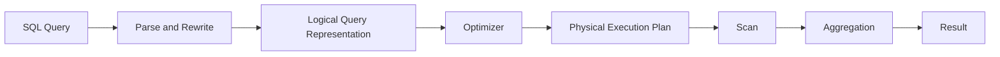
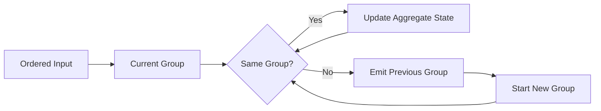
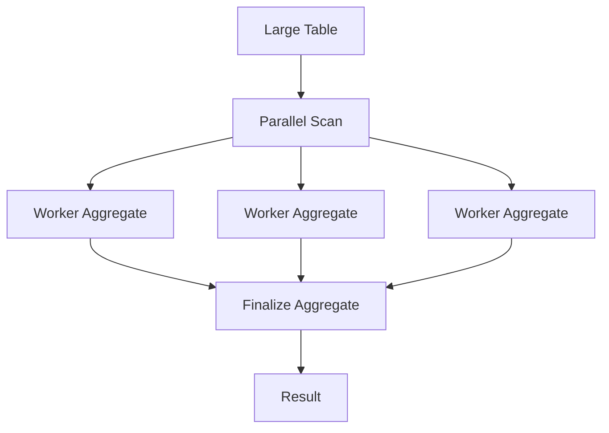
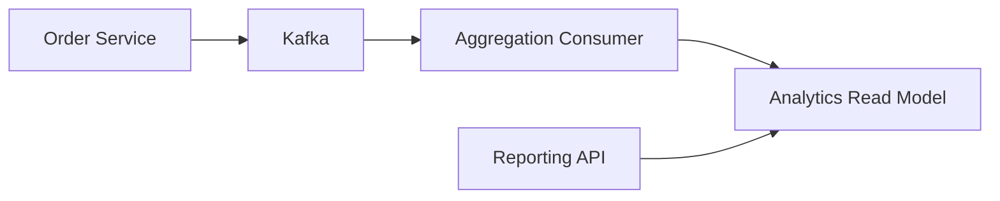
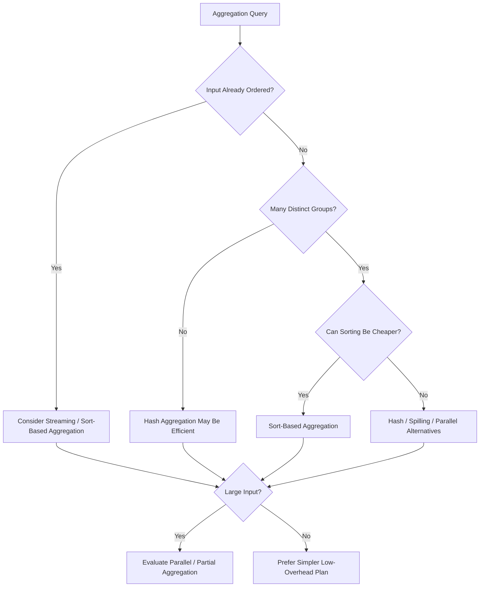

# 16- Aggregation Strategies

## Overview

Aggregation reduces multiple input rows into a smaller result set using operations such as:

- `COUNT`
- `SUM`
- `AVG`
- `MIN`
- `MAX`
- `GROUP BY`
- Aggregate expressions with `FILTER`
- Windowed aggregates

For example:

```sql
SELECT
    customer_id,
    COUNT(*) AS order_count,
    SUM(total_amount) AS revenue
FROM orders
GROUP BY customer_id;
```

The logical operation is straightforward, but the physical execution can vary substantially. A database may use strategies such as:

- Hash aggregation
- Sort-based aggregation
- Partial aggregation
- Parallel aggregation
- Index-assisted aggregation
- Streaming aggregation

The optimizer chooses an execution strategy based on estimated cardinality, available memory, ordering, indexes, parallelism, and other cost factors.

For backend systems, aggregation strategy matters because analytical queries can process millions or billions of rows even when the final API response contains only a few hundred rows.

## Logical Aggregation vs Physical Aggregation

SQL describes **what result is required**:

```sql
SELECT
    customer_id,
    COUNT(*)
FROM orders
GROUP BY customer_id;
```

The database determines **how to produce that result**.

A simplified execution pipeline is:



The same SQL statement can use different aggregation strategies depending on:

- Table size.
- Data distribution.
- Statistics.
- Available indexes.
- Memory.
- Query predicates.
- Required ordering.
- Parallel execution.
- Database configuration.

This separation between logical intent and physical execution is fundamental to query optimization.

## What an Aggregate Operation Does

Consider:

```sql
SELECT
    COUNT(*)
FROM orders;
```

The database must process the qualifying rows and maintain aggregate state.

Conceptually:

```text
Input rows
    ↓
Aggregate state
    ↓
COUNT
    ↓
One result row
```

For grouped aggregation:

```sql
SELECT
    customer_id,
    COUNT(*)
FROM orders
GROUP BY customer_id;
```

the executor maintains separate aggregate state for each group:

```text
orders
  ↓
customer_id = 10 → count
customer_id = 20 → count
customer_id = 30 → count
...
```

The physical representation of those groups depends on the selected aggregation strategy.

## Common Aggregation Strategies

| Strategy | Core idea | Strength | Main limitation |
|---|---|---|---|
| Hash aggregation | Hash group keys into memory | Fast grouping without pre-sorting | Memory pressure and possible spilling |
| Sort-based aggregation | Sort by grouping keys, then aggregate adjacent rows | Works naturally with ordered data | Sorting can be expensive |
| Streaming aggregation | Consume already-grouped input | Very low additional memory | Requires appropriately ordered input |
| Partial aggregation | Aggregate subsets before combining | Reduces data exchanged between workers | Requires compatible aggregate execution |
| Parallel aggregation | Multiple workers aggregate concurrently | Useful for large datasets | Coordination and worker overhead |
| Index-assisted aggregation | Exploit index ordering or metadata | Can avoid large scans/sorts in some cases | Depends heavily on query and index structure |

The optimizer can combine these techniques.

## Hash Aggregation

Hash aggregation stores groups in a hash table.

For:

```sql
SELECT
    customer_id,
    COUNT(*) AS order_count
FROM orders
GROUP BY customer_id;
```

the conceptual process is:

```text
Input row
   ↓
Hash(customer_id)
   ↓
Locate group
   ↓
Update COUNT
```

For example:

```text
customer_id  count
-----------  -----
101          15
205          8
310          23
...
```

### Why Hash Aggregation Exists

Hash aggregation avoids requiring the input to be sorted by the grouping key.

This can be advantageous when:

- Input is unordered.
- The number of groups is manageable.
- No useful ordering already exists.
- Sorting would be more expensive than hashing.

### Advantages

- Average hash-table lookup is approximately `O(1)`.
- Does not require global sorting.
- Often efficient for large unordered inputs.
- Can work well with parallel aggregation.

### Limitations

The primary concern is memory.

If there are many distinct groups:

```text
10 million input rows
        ↓
9 million distinct groups
        ↓
Large hash table
```

the aggregation can become memory-intensive.

Depending on the database and execution strategy, the operation may spill to temporary storage or use multiple batches.

## Sort-Based Aggregation

Sort-based aggregation first orders the input by grouping keys and then processes adjacent rows.

Conceptually:

```text
Input
 ↓
Sort by customer_id
 ↓
101
101
101
205
205
310
310
310
 ↓
Aggregate adjacent groups
```

For example:

```sql
SELECT
    customer_id,
    COUNT(*) AS order_count
FROM orders
GROUP BY customer_id;
```

can conceptually execute as:

```text
Sort
  ↓
GroupAggregate
  ↓
Result
```

### Why Sort-Based Aggregation Exists

Sorting provides a deterministic grouping structure:

```text
same key → adjacent rows
```

The executor can then maintain only the state required for the current group rather than maintaining a hash entry for every group.

### Advantages

- Works naturally with ordered input.
- Can use existing ordering.
- Can support queries that also require ordered output.
- Can have favorable memory characteristics when input is already sorted.

### Limitations

If input is not already ordered, sorting can be expensive.

For large datasets:

```text
Seq Scan
    ↓
Sort millions of rows
    ↓
GroupAggregate
```

may be more expensive than:

```text
Seq Scan
    ↓
HashAggregate
```

The optimizer evaluates this trade-off.

## Streaming Aggregation

When rows arrive already ordered by the grouping key, aggregation can be performed incrementally.

Consider:

```text
customer_id
-----------
101
101
101
205
205
310
310
```

The executor can:

1. Accumulate rows for customer `101`.
2. Emit the group when customer `205` begins.
3. Accumulate customer `205`.
4. Continue.

Only the current group's state needs to remain active.

This is particularly useful when the input comes from an index or another operator that already provides the required ordering.

Conceptually:



The exact plan terminology is database-specific, but PostgreSQL commonly represents sort-based grouped aggregation with `GroupAggregate`.

## Hash Aggregation vs Sort-Based Aggregation

| Characteristic | Hash Aggregation | Sort-Based Aggregation |
|---|---|---|
| Requires ordered input | No | Yes |
| Main structure | Hash table | Ordered groups |
| Sorting required | Usually no | Often yes |
| Memory pattern | Potentially one state per group | Can process groups sequentially |
| Sensitive to number of groups | Yes | Yes, but differently |
| Useful existing ordering | Not required | Highly valuable |
| Can provide ordered groups | Not inherently | Yes |
| Typical PostgreSQL node | `HashAggregate` | `GroupAggregate` |

Neither strategy is universally faster.

The correct question is:

> Which strategy minimizes total execution cost for this particular data distribution and workload?

## `COUNT(*)` vs `COUNT(column)`

These expressions have different semantics:

```sql
COUNT(*)
```

counts rows.

```sql
COUNT(customer_id)
```

counts non-`NULL` values of `customer_id`.

For example:

```sql
SELECT
    COUNT(*),
    COUNT(customer_id)
FROM orders;
```

If `customer_id` contains `NULL`s, the results differ.

This matters for both correctness and query design.

For existence-style counting, do not introduce unnecessary expressions that change semantics or prevent useful optimizations.

## `COUNT(DISTINCT ...)`

Consider:

```sql
SELECT
    COUNT(DISTINCT customer_id)
FROM orders;
```

The database must identify unique customer IDs before producing the count.

Possible strategies include hashing or sorting.

Conceptually:

```text
orders
   ↓
Extract customer_id
   ↓
Deduplicate
   ↓
COUNT
```

The cost depends heavily on the number of distinct values.

A table with:

```text
100 million rows
10 million distinct customers
```

has a very different aggregation problem from:

```text
100 million rows
100 distinct customers
```

Cardinality of the grouping key is therefore a major performance factor.

## High-Cardinality Groups

Consider:

```sql
SELECT
    request_id,
    COUNT(*)
FROM api_logs
GROUP BY request_id;
```

If almost every `request_id` is unique, the aggregation may produce nearly as many groups as input rows.

For example:

```text
100 million rows
        ↓
95 million groups
```

Hash aggregation can require substantial memory, while sort-based strategies may require substantial sorting work.

Before optimizing an aggregation query, determine:

- Input row count.
- Number of distinct groups.
- Average group size.
- Row width.
- Selectivity of filters.

## Low-Cardinality Groups

A query such as:

```sql
SELECT
    status,
    COUNT(*)
FROM orders
GROUP BY status;
```

may have only a handful of groups:

```text
pending
paid
cancelled
refunded
```

Even if the table contains hundreds of millions of rows, the aggregate state itself may remain small.

The expensive part may instead be scanning the input.

This distinction is important:

> Aggregation cost is determined by both the number of rows processed and the number of groups maintained.

## Filtering Before Aggregation

A major optimization principle is to reduce input rows before aggregation when the filter is logically valid.

Instead of aggregating everything:

```sql
SELECT
    customer_id,
    SUM(total_amount)
FROM orders
GROUP BY customer_id;
```

if the API only needs recent orders:

```sql
SELECT
    customer_id,
    SUM(total_amount)
FROM orders
WHERE created_at >= CURRENT_DATE - INTERVAL '30 days'
GROUP BY customer_id;
```

the database can aggregate a smaller input set.

Conceptually:

```text
Large table
    ↓
Filter
    ↓
Smaller row set
    ↓
Aggregate
```

rather than:

```text
Large table
    ↓
Aggregate everything
    ↓
Filter later
```

The optimizer may push predicates automatically when semantics allow it, but query structure should still express the intended filtering clearly.

## `WHERE` vs `HAVING`

`WHERE` filters rows before aggregation:

```sql
SELECT
    customer_id,
    COUNT(*)
FROM orders
WHERE status = 'paid'
GROUP BY customer_id;
```

`HAVING` filters groups after aggregation:

```sql
SELECT
    customer_id,
    COUNT(*)
FROM orders
GROUP BY customer_id
HAVING COUNT(*) >= 100;
```

The conceptual order is:

```text
FROM
 ↓
WHERE
 ↓
GROUP BY
 ↓
Aggregate
 ↓
HAVING
```

Therefore, if a condition can be applied before aggregation, it is generally preferable to express it as a `WHERE` predicate.

Do not rewrite `HAVING` into `WHERE` when the condition depends on aggregate results.

## Partial Aggregation

Parallel query execution can use **partial aggregation**.

Instead of sending every input row to one aggregation process:

```text
Worker 1 ─┐
Worker 2 ─┼──→ Final aggregation
Worker 3 ─┤
Worker 4 ─┘
```

workers can first compute partial aggregate states:

```text
Worker 1 → partial groups
Worker 2 → partial groups
Worker 3 → partial groups
Worker 4 → partial groups
             ↓
        Final aggregate
```

This can substantially reduce the amount of data that needs to be exchanged between workers.

For example:

```sql
SELECT
    customer_id,
    SUM(total_amount)
FROM orders
GROUP BY customer_id;
```

can conceptually become:

```text
Scan partitions
     ↓
Partial Aggregate
     ↓
Combine partial states
     ↓
Finalize Aggregate
```

The exact plan depends on the database and aggregate function.

## Parallel Aggregation

Parallel aggregation is useful when the input is large enough to justify worker coordination.

A simplified PostgreSQL-style execution model is:



Parallelism is not free.

Costs include:

- Worker startup.
- Coordination.
- Memory per worker.
- Data redistribution.
- CPU contention.
- Additional scheduling overhead.

A small query can become slower if parallel execution overhead exceeds the benefit.

## Aggregate Functions and Parallelism

Not every aggregate can necessarily be parallelized equally.

For efficient parallel aggregation, the database needs a way to combine partial states correctly.

Simple aggregates such as:

```sql
SUM()
COUNT()
MIN()
MAX()
```

are naturally suited to partial aggregation.

More complex aggregates may require more sophisticated state combination or may have restrictions depending on the database implementation.

When designing custom database functions or aggregates, consider whether they can participate in parallel execution if analytical performance matters.

## Aggregation and Indexes

Indexes do not automatically make every aggregation fast.

Consider:

```sql
SELECT
    customer_id,
    COUNT(*)
FROM orders
GROUP BY customer_id;
```

An index on:

```sql
CREATE INDEX idx_orders_customer_id
ON orders (customer_id);
```

may provide useful ordering, potentially enabling a sort-based aggregation strategy.

However, the index may still require reading a large portion of the index.

For a query that touches most rows, a sequential scan can still be cheaper than an index scan because sequential I/O is efficient.

The optimizer should determine the access path based on estimated cost.

## Index-Only Aggregation

In some cases, an index can provide all columns required by the query.

For example:

```sql
SELECT
    customer_id,
    COUNT(*)
FROM orders
GROUP BY customer_id;
```

may potentially benefit from an index containing the required grouping information.

However, PostgreSQL index-only scans also depend on visibility information and table state.

Do not assume:

```text
"Index exists"
```

means:

```text
"Index-only aggregation will happen"
```

Always validate with an actual execution plan.

## Aggregation and Covering Indexes

For a query such as:

```sql
SELECT
    customer_id,
    SUM(total_amount)
FROM orders
WHERE created_at >= :start_date
GROUP BY customer_id;
```

a workload-specific index might be considered:

```sql
CREATE INDEX idx_orders_created_customer
ON orders (created_at, customer_id)
INCLUDE (total_amount);
```

Whether this improves performance depends on:

- Date selectivity.
- Table size.
- Number of matching rows.
- Visibility map state.
- Index size.
- Write workload.
- Alternative execution plans.

A covering index can reduce heap access, but it increases index storage and write overhead.

## Aggregation and Partitioning

Large tables are often partitioned by time or another high-level dimension.

For example:

```text
orders
├── orders_2026_01
├── orders_2026_02
├── orders_2026_03
└── ...
```

A query such as:

```sql
SELECT
    customer_id,
    SUM(total_amount)
FROM orders
WHERE created_at >= DATE '2026-08-01'
GROUP BY customer_id;
```

may benefit from partition pruning if the partitioning scheme aligns with the predicate.

The execution becomes conceptually:

```text
Query
 ↓
Partition pruning
 ↓
Relevant partitions only
 ↓
Scan
 ↓
Aggregate
```

Partitioning does not inherently make aggregation faster.

Its benefit comes from reducing the amount of data that must be scanned or maintained.

## Aggregation Pushdown

In distributed or partitioned systems, aggregation can sometimes be pushed closer to the data source.

Instead of:

```text
All rows
   ↓
Network transfer
   ↓
Central aggregation
```

the system can perform:

```text
Partition A → Partial Aggregate ─┐
Partition B → Partial Aggregate ─┼→ Final Aggregate
Partition C → Partial Aggregate ─┘
```

This reduces data movement.

This principle is particularly important in distributed analytical databases and federated architectures.

For conventional PostgreSQL deployments, similar concepts appear through parallel and partial aggregation.

## Aggregation in Backend APIs

A common REST endpoint might expose:

```text
GET /customers/{id}/metrics
```

The backend could execute:

```sql
SELECT
    COUNT(*) AS order_count,
    COALESCE(SUM(total_amount), 0) AS total_revenue,
    MAX(created_at) AS last_order_at
FROM orders
WHERE customer_id = :customer_id;
```

A good application architecture should allow the database to perform the aggregation rather than retrieving every order into Python.

Avoid:

```python
orders = Order.objects.filter(customer_id=customer_id)

order_count = len(orders)
total_revenue = sum(order.total_amount for order in orders)
```

when the required result can be computed directly in SQL.

Prefer database-side aggregation through the ORM:

```python
from django.db.models import Count, Sum, Max

metrics = Order.objects.filter(
    customer_id=customer_id,
).aggregate(
    order_count=Count("id"),
    total_revenue=Sum("total_amount"),
    last_order_at=Max("created_at"),
)
```

This reduces:

- Network transfer.
- Python memory usage.
- Application CPU.
- Serialization overhead.
- Query result size.

The database is generally the appropriate execution engine for relational aggregation.

## Aggregation in FastAPI Services

A FastAPI service should similarly avoid loading large datasets into Python merely to calculate aggregates.

For example, using SQLAlchemy:

```python
from sqlalchemy import func, select

stmt = select(
    func.count(Order.id).label("order_count"),
    func.coalesce(func.sum(Order.total_amount), 0).label("total_revenue"),
).where(
    Order.customer_id == customer_id
)

result = await session.execute(stmt)
metrics = result.one()
```

The application receives a small aggregate result rather than potentially thousands or millions of rows.

## Aggregation in Microservices

Aggregation becomes more complex when the required data belongs to multiple services.

For example:

```text
Order Service
     │
     ├── order metrics
     │
Customer Service
     │
     └── customer metadata
```

Avoid blindly performing synchronous cross-service queries for large analytical workloads.

For high-volume reporting, consider:

- Materialized views.
- Event-driven aggregation.
- Kafka-based data pipelines.
- Dedicated analytical storage.
- Periodic aggregation jobs.
- Read models.

For example:



This moves expensive recurring aggregation away from latency-sensitive transactional paths.

## Pre-Aggregation and Materialized Views

If an expensive aggregation is repeatedly requested, pre-computing results may be more efficient.

For example:

```sql
CREATE MATERIALIZED VIEW daily_sales AS
SELECT
    DATE(created_at) AS sales_date,
    customer_id,
    SUM(total_amount) AS revenue
FROM orders
GROUP BY
    DATE(created_at),
    customer_id;
```

The application can then query the smaller pre-aggregated dataset.

This trades:

```text
Query-time computation
```

for:

```text
Refresh-time computation
```

The trade-off is appropriate when:

- The source data changes frequently enough to make live aggregation expensive.
- Slightly stale results are acceptable.
- The same aggregation is queried repeatedly.
- Reporting traffic is high.

## Incremental Aggregation

For high-volume event systems, aggregation can be maintained incrementally.

Example:

```text
Order Created Event
       ↓
Kafka
       ↓
Aggregation Consumer
       ↓
Daily Customer Revenue
```

Instead of repeatedly scanning:

```text
100 million orders
```

to calculate:

```text
today's revenue
```

the system can maintain an aggregate state as events arrive.

However, this introduces distributed-systems concerns:

- Idempotency.
- Duplicate events.
- Out-of-order events.
- Reprocessing.
- Backfills.
- State recovery.
- Exactly-once assumptions.
- Data correction.

Pre-aggregation is therefore an architectural trade-off, not merely a database optimization.

## Aggregation and NULL

Aggregate behavior around `NULL` must be understood.

For example:

```sql
SELECT
    COUNT(amount),
    COUNT(*),
    SUM(amount),
    AVG(amount)
FROM payments;
```

`COUNT(*)` counts rows, while `COUNT(amount)` ignores `NULL` values.

Most aggregate functions ignore `NULL` input values, with important function-specific semantics.

`SUM` over an empty input set can produce `NULL`, so application-facing queries often use:

```sql
SELECT
    COALESCE(SUM(total_amount), 0)
FROM orders
WHERE customer_id = :customer_id;
```

This avoids forcing application code to interpret `NULL` as zero when that is the intended business meaning.

## Aggregation and Data Types

Aggregate results can have data types different from their input columns.

This matters for:

- Numeric precision.
- Monetary calculations.
- Integer overflow behavior.
- Decimal precision.
- Application serialization.

For financial values, prefer appropriate exact numeric types such as PostgreSQL `numeric` rather than floating-point arithmetic.

For example:

```sql
SELECT
    SUM(total_amount)
FROM invoices;
```

should preserve the required monetary precision.

Do not assume the aggregate's output type is identical to the source column's type.

## Aggregation and Memory

Hash aggregation can become memory-intensive when group cardinality is high.

For example:

```text
Input rows:       100 million
Distinct groups:  80 million
```

is fundamentally different from:

```text
Input rows:       100 million
Distinct groups:  10
```

Monitor:

- Number of groups.
- Hash table size.
- Memory usage.
- Temporary file activity.
- Execution time.

For PostgreSQL, investigate plans using:

```sql
EXPLAIN (ANALYZE, BUFFERS)
SELECT
    customer_id,
    COUNT(*)
FROM orders
GROUP BY customer_id;
```

The plan can reveal whether PostgreSQL selected `HashAggregate`, `GroupAggregate`, parallel aggregation, or another strategy.

## Aggregation and Cardinality Estimates

The optimizer relies on statistics to estimate:

- Number of input rows.
- Number of distinct grouping values.
- Predicate selectivity.
- Data distribution.

If statistics are inaccurate, the optimizer may choose an inappropriate strategy.

For example:

```text
Estimated groups: 10,000
Actual groups:    5,000,000
```

can lead to poor memory and execution decisions.

Keep statistics current and investigate large discrepancies between estimated and actual cardinalities.

## Aggregation and `EXPLAIN ANALYZE`

Use:

```sql
EXPLAIN (ANALYZE, BUFFERS)
SELECT
    customer_id,
    SUM(total_amount)
FROM orders
GROUP BY customer_id;
```

Inspect:

- Aggregate node type.
- Estimated rows.
- Actual rows.
- Execution time.
- Memory usage where reported.
- Temporary I/O where applicable.
- Parallel workers.
- Scan strategy.
- Rows removed by filters.

A representative plan might look like:

```text
HashAggregate
  Group Key: customer_id
  -> Seq Scan on orders
```

Another query may produce:

```text
GroupAggregate
  Group Key: customer_id
  -> Sort
       Sort Key: customer_id
       -> Seq Scan on orders
```

The second plan tells you that sorting is part of the aggregation strategy.

## Choosing an Aggregation Strategy

A practical decision model is:



This is a conceptual model rather than a rule for forcing the optimizer.

In production, measure the actual plan.

## Common Aggregation Optimization Techniques

### Reduce Input Rows

Filter aggressively before aggregation when semantics allow:

```sql
WHERE created_at >= :start_date
```

### Reduce Row Width

Avoid carrying unnecessary columns through expensive intermediate operators.

### Use Appropriate Indexes

Design indexes around actual filtering and grouping patterns.

### Exploit Existing Ordering

Indexes or upstream operators that produce useful ordering can reduce sorting work.

### Use Partition Pruning

Partition large tables so selective predicates can exclude irrelevant partitions.

### Consider Pre-Aggregation

Use materialized views or read models for expensive, frequently repeated analytical queries.

### Validate Statistics

Large estimation errors can lead to poor aggregation plans.

### Measure Before Changing Memory

Memory configuration should follow observed workload behavior rather than assumptions.

## Production Pitfalls

### Aggregating in Python

Fetching millions of rows into a Django, FastAPI, or Celery worker just to calculate `COUNT`, `SUM`, or `AVG` wastes database and application resources.

Push relational aggregation into SQL whenever appropriate.

### Assuming Hash Aggregation Is Always Faster

Hash aggregation can be excellent for unordered input but can become expensive with high group cardinality or memory pressure.

### Assuming Indexes Always Improve Aggregation

An index can be slower than a sequential scan when most of the table is required.

### Ignoring Group Cardinality

The number of distinct groups can matter as much as the number of input rows.

### Increasing Memory Globally

Large per-operation memory settings can cause severe resource pressure when many queries execute concurrently.

### Returning Raw Aggregate Results Without Correct NULL Semantics

Applications may incorrectly interpret `NULL` as zero, empty, or missing data.

Use explicit SQL semantics such as `COALESCE` where business requirements demand it.

### Building Synchronous Cross-Service Aggregations

Calling multiple microservices for every dashboard request can create latency amplification and availability coupling.

Use dedicated read models or asynchronous aggregation for high-volume analytical workloads.

## Operational Considerations

### Monitoring

Monitor aggregation-heavy queries using:

- Query latency.
- Database CPU.
- Temporary I/O.
- Rows processed.
- Calls per query.
- Total database time.
- Memory pressure.
- Parallel worker utilization.

PostgreSQL deployments can use `pg_stat_statements` to identify queries consuming significant database resources.

### Scalability

Aggregation scalability depends on both:

```text
Rows processed
+
Number of groups
+
Row width
+
Execution strategy
```

Reducing any of these can materially improve performance.

### Reliability

Long-running aggregations can compete with transactional workloads.

For production systems:

- Separate OLTP and analytical workloads where appropriate.
- Use read replicas for suitable read-heavy workloads.
- Schedule expensive reports during lower-load periods.
- Consider pre-aggregated read models.
- Set appropriate statement timeouts.
- Avoid unbounded analytical queries on latency-sensitive primary databases.

A read replica can reduce primary workload, but it does not eliminate the computational cost of the aggregation itself.

### Cost

On cloud databases, inefficient aggregation increases:

- CPU utilization.
- Memory requirements.
- Storage I/O.
- Replica capacity requirements.
- Potential instance size.
- Operational overhead.

Query optimization can therefore reduce infrastructure cost as well as latency.

### Disaster Recovery

Materialized or pre-aggregated data should be treated according to its role.

If the aggregate can be rebuilt from source events or transactional data:

```text
Source data
    ↓
Rebuild pipeline
    ↓
Aggregate state
```

recovery may be simpler.

If the aggregate is the only copy of business-critical information, it requires its own backup and recovery strategy.

## Best Practices

- Prefer database-side aggregation over application-side row processing.
- Filter before aggregation whenever semantics permit.
- Understand the number of distinct groups before diagnosing memory problems.
- Use `EXPLAIN (ANALYZE, BUFFERS)` to inspect the actual aggregation strategy.
- Do not force hash or sort strategies without evidence.
- Keep database statistics current.
- Design indexes around complete workload patterns rather than isolated `GROUP BY` clauses.
- Use partitioning when it meaningfully reduces scanned data.
- Use materialized views or pre-aggregated read models for expensive recurring reports.
- Keep transactional workloads isolated from heavy analytical processing where necessary.
- Treat `NULL`, numeric precision, and aggregate semantics as correctness concerns, not just performance concerns.

## Interview Traps

| Question | Strong answer |
|---|---|
| What is aggregation? | Reducing multiple input rows into aggregate results such as counts, sums, averages, or grouped results. |
| What are common physical aggregation strategies? | Hash aggregation and sort-based/group aggregation, with streaming, partial, and parallel techniques depending on the database. |
| Why use HashAggregate? | It can efficiently group unordered input without first sorting it. |
| What is the main risk of hash aggregation? | Memory usage can grow with the number of distinct groups and may cause spilling or resource pressure. |
| Why use sort-based aggregation? | It can exploit ordered input and process adjacent groups efficiently. |
| Does `GROUP BY` always require sorting? | No. Hash aggregation can perform grouping without sorting. |
| Does `GROUP BY` always use hashing? | No. The optimizer can choose sort-based aggregation or other strategies. |
| Why does group cardinality matter? | High cardinality means more aggregate state, which can significantly increase memory or sorting costs. |
| Can an index help `GROUP BY`? | Yes, if it provides useful ordering or enables a more efficient access path, but scanning an index is not always cheaper than scanning the table. |
| Why filter before aggregation? | It reduces the number of rows the aggregate operator must process when the predicate can legally be applied before grouping. |
| What is partial aggregation? | Workers compute partial aggregate states that are later combined into final results. |
| Why is parallel aggregation useful? | It can distribute large aggregation workloads across CPU workers and reduce processing time for sufficiently large queries. |
| Is parallel aggregation always faster? | No. Worker coordination and memory overhead can outweigh benefits for smaller workloads. |
| Why can `COUNT(*)` and `COUNT(column)` differ? | `COUNT(*)` counts rows, while `COUNT(column)` ignores `NULL` values in that column. |
| Why use `COALESCE(SUM(...), 0)`? | `SUM` can return `NULL` for an empty input set, while the application may require zero as the business representation. |
| How do you diagnose an expensive aggregation? | Inspect the actual plan, input rows, group cardinality, aggregate strategy, memory/temp I/O, scans, estimates, and parallel execution. |
| When should aggregation move outside the OLTP database? | When recurring analytical workloads become large enough to compete with transactional traffic or require specialized analytical infrastructure. |
| When should you use pre-aggregation? | When the same expensive aggregation is requested frequently and some staleness or asynchronous processing is acceptable. |
| What is the senior-level optimization approach? | Reduce data before aggregation, choose an appropriate access path, exploit ordering and partition pruning, validate the physical plan, and move recurring heavy aggregation to pre-computed read models when necessary. |

## Key Takeaways

- **Aggregation strategy is a physical execution decision; the optimizer may choose hash, sort-based, streaming, partial, or parallel techniques for the same SQL.**
- **Group cardinality matters: high numbers of distinct groups can create substantial memory or sorting costs even when the input row count is unchanged.**
- **Reduce rows before aggregation, exploit useful ordering and partition pruning, and use indexes based on complete workload patterns rather than `GROUP BY` alone.**
- **For backend systems, perform relational aggregation in the database instead of loading large datasets into Python, and use pre-aggregated read models for repeatedly expensive analytical workloads.**
- **Use actual execution plans and production workload measurements to validate aggregation optimizations rather than assuming a particular strategy is universally faster.**