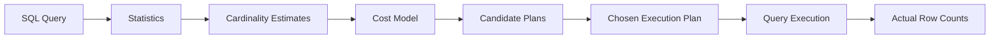
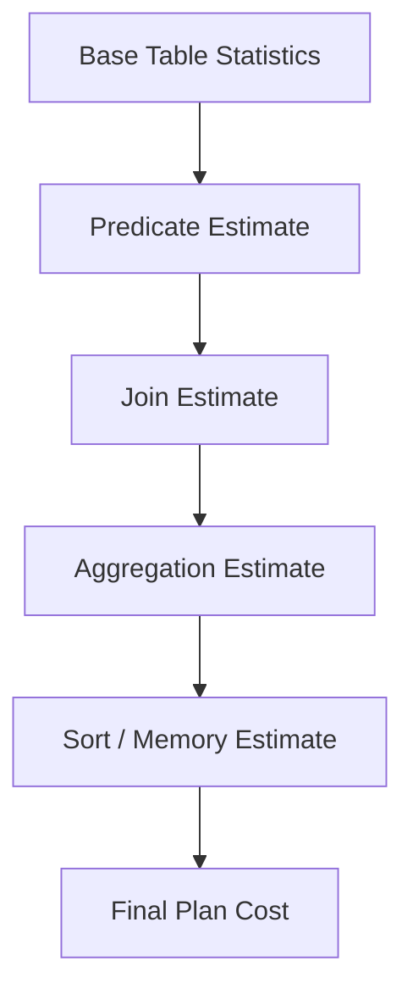

# 17- Cardinality Estimates

## Overview

Cardinality estimation is the database optimizer's process of predicting how many rows an operation will produce.

For example, given:

```sql
SELECT *
FROM orders
WHERE customer_id = 42;
```

the optimizer needs to estimate how many rows match `customer_id = 42` before choosing an execution plan.

That estimate influences decisions such as:

- Sequential scan vs index scan.
- Nested loop join vs hash join vs merge join.
- Hash aggregation vs sort-based aggregation.
- Join order.
- Parallel execution.
- Memory allocation.
- Whether an intermediate result is expected to be small or large.

A simplified optimization process is:



Cardinality estimates are predictions, not measurements. A query can therefore have a perfectly valid SQL statement and a technically available index while still receiving a poor execution plan because the optimizer incorrectly estimates the number of rows.

Understanding cardinality estimation is one of the most important steps from intermediate to senior-level SQL performance engineering.

## What Cardinality Means

Cardinality generally describes the number of rows in a relation or the number of distinct values in a column, depending on context.

For query optimization, the most important meaning is usually:

> **The estimated number of rows produced by an execution-plan node.**

For example:

```text
Seq Scan on orders
Estimated rows: 10,000
Actual rows:    850,000
```

The optimizer expected a relatively small result but the executor processed a much larger one.

This discrepancy can cause downstream plan decisions to be inappropriate.

### Cardinality vs Selectivity

These concepts are related but different.

| Concept | Meaning |
|---|---|
| Cardinality | Number of rows produced |
| Selectivity | Fraction or probability of rows satisfying a predicate |
| Distinct cardinality | Number of distinct values |
| Table cardinality | Number of rows in the relation |

For a table containing 1,000,000 rows:

```text
Predicate matches 10,000 rows

Selectivity ≈ 1%
Cardinality = 10,000 rows
```

The optimizer uses selectivity estimates to derive cardinality estimates.

## Why Cardinality Estimates Matter

The optimizer must choose between plans without executing every possible plan.

Consider:

```sql
SELECT
    o.id,
    c.name
FROM orders o
JOIN customers c
    ON c.id = o.customer_id
WHERE o.status = 'pending';
```

If the optimizer estimates:

```text
pending orders = 100
```

a nested loop may look attractive.

If the real value is:

```text
pending orders = 5,000,000
```

a hash join may have been much more appropriate.

The same SQL can therefore have dramatically different performance depending on the accuracy of the estimates.

## Statistics

The optimizer usually does not inspect every row for every query.

Instead, it relies on statistics collected from the data.

For PostgreSQL, statistics can be inspected through system catalogs such as:

```sql
SELECT
    tablename,
    attname,
    n_distinct,
    most_common_vals,
    most_common_freqs,
    histogram_bounds
FROM pg_stats
WHERE tablename = 'orders';
```

Statistics provide information about:

- Approximate row counts.
- Distinct values.
- Common values.
- Value distributions.
- Null fractions.
- Histograms.
- Correlations.

These statistics allow the optimizer to estimate query selectivity without scanning the complete table.

## How Statistics Are Collected

Statistics are maintained through PostgreSQL's `ANALYZE` process.

You can explicitly refresh statistics:

```sql
ANALYZE orders;
```

For a larger maintenance operation:

```sql
VACUUM (ANALYZE) orders;
```

PostgreSQL also performs automatic statistics collection through autovacuum/autoanalyze according to configuration and workload.

The goal is not perfect statistics. The goal is sufficiently accurate information for the optimizer to make good decisions.

## Table Row Estimates

The optimizer needs an estimate of the table's size before applying predicates.

For example:

```text
orders
Estimated rows: 10,000,000
```

Suppose the query contains:

```sql
WHERE status = 'paid'
```

and the optimizer estimates that 20% of rows match:

```text
10,000,000 × 20%
= 2,000,000 rows
```

That estimated cardinality becomes an input to later planning decisions.

## Histograms

Histograms help the optimizer understand the distribution of values.

Consider:

```text
order_amount

0-100       → many rows
100-500     → many rows
500-1000    → moderate rows
1000-5000   → fewer rows
5000+       → very few rows
```

If a query asks:

```sql
WHERE order_amount > 5000
```

the histogram helps estimate how many rows qualify.

Without distribution information, the optimizer would have much less information about predicate selectivity.

## Most Common Values

Real-world data is frequently skewed.

For example:

```text
status
------
paid        90%
pending      8%
cancelled    1%
refunded     1%
```

A uniform assumption would be very inaccurate.

Statistics can record frequently occurring values so that the optimizer can distinguish:

```sql
WHERE status = 'paid'
```

from:

```sql
WHERE status = 'refunded'
```

This is important because both predicates target the same column but can have radically different cardinalities.

## Data Skew

Data skew occurs when values are not distributed uniformly.

Example:

```text
tenant_id = 1      → 70% of all rows
tenant_id = 2       → 10%
tenant_id = 3        → 5%
other tenants       → 15%
```

A multi-tenant SaaS database is a common production example.

A query for:

```sql
WHERE tenant_id = 1
```

may produce millions of rows, while:

```sql
WHERE tenant_id = 99999
```

may produce only a few hundred.

A plan that works well for one tenant may therefore perform poorly for another if the optimizer cannot accurately model the distribution.

## Distinct Value Estimates

The optimizer needs to estimate how many distinct values a column contains.

For example:

```text
orders.customer_id

Total rows:      10,000,000
Distinct values: 500,000
```

This matters for:

```sql
GROUP BY customer_id
```

because the optimizer needs to predict the number of groups.

It also matters for joins:

```sql
orders.customer_id = customers.id
```

because distinct-value information contributes to estimating join cardinality.

## Predicate Selectivity

For a predicate:

```sql
WHERE customer_id = 42
```

the optimizer estimates the fraction of rows satisfying the condition.

A simplified model might be:

```text
Table rows:       10,000,000
Estimated selectivity: 0.0001

Estimated rows:
10,000,000 × 0.0001
= 1,000
```

That estimate can influence whether an index scan is considered worthwhile.

## Equality Predicates

Equality predicates are generally easier to estimate when statistics accurately describe the column.

Example:

```sql
SELECT *
FROM orders
WHERE customer_id = 42;
```

If `customer_id` is highly selective, an index scan may be attractive.

If most rows have the same `customer_id`, a sequential scan may be cheaper.

The optimizer therefore needs both:

- Table size.
- Value distribution.

An index alone does not determine the plan.

## Range Predicates

Range predicates are estimated using distribution information.

Example:

```sql
SELECT *
FROM orders
WHERE created_at >= CURRENT_DATE - INTERVAL '7 days';
```

The optimizer estimates the fraction of rows within the requested range.

Time-series tables can produce large estimation errors when data changes rapidly and statistics are stale.

This is especially relevant for:

- Event tables.
- Audit logs.
- Kafka-ingested data.
- Metrics tables.
- Append-heavy transactional systems.

## Combining Predicates

Consider:

```sql
SELECT *
FROM orders
WHERE status = 'paid'
  AND customer_id = 42;
```

A naive model might assume the predicates are independent:

```text
P(status = paid AND customer_id = 42)
≈
P(status = paid) × P(customer_id = 42)
```

That assumption can be wrong.

For example, certain customers may generate almost exclusively paid orders.

The actual predicates are correlated.

This is one of the major causes of cardinality estimation errors.

## Column Correlation

Suppose an orders table contains:

```text
country
region
```

and the data follows:

```text
country = IN → region is almost always Indian regions
country = US → region is almost always US regions
```

Consider:

```sql
WHERE country = 'IN'
  AND region = 'California'
```

An independence assumption may estimate a non-trivial number of rows even though the combination is impossible or nearly impossible.

Conversely:

```sql
WHERE country = 'IN'
  AND region = 'Maharashtra'
```

may be far more common than an independent estimate predicts.

Correlated predicates therefore require more sophisticated statistics when they materially affect planning.

## Extended Statistics

PostgreSQL supports extended statistics for relationships between columns.

For example:

```sql
CREATE STATISTICS orders_status_customer_stats
ON status, customer_id
FROM orders;
```

Statistics can capture relationships such as:

- Functional dependencies.
- Distinct combinations.
- Multi-column value dependencies.

After creating statistics, refresh them:

```sql
ANALYZE orders;
```

Inspect them through PostgreSQL's statistics catalogs when diagnosing estimation problems.

Extended statistics are particularly useful when ordinary single-column statistics consistently produce poor estimates for correlated predicates.

## Join Cardinality

Cardinality estimation becomes more complex for joins.

Consider:

```sql
SELECT *
FROM orders o
JOIN customers c
    ON c.id = o.customer_id;
```

The optimizer needs to estimate:

```text
Rows from orders
+
Rows from customers
+
Number of matching keys
=
Estimated join cardinality
```

If the estimate is wrong, the optimizer may choose the wrong join algorithm.

Possible strategies include:

- Nested loop join.
- Hash join.
- Merge join.

## Join Cardinality Example

Suppose:

```text
customers: 1,000,000 rows
orders:    50,000,000 rows
```

If every order belongs to exactly one customer:

```text
Expected join output ≈ 50,000,000 rows
```

But if a filter is applied:

```sql
WHERE c.country = 'IN'
```

the optimizer must estimate how many customers are in India and how many orders belong to those customers.

An error at this stage propagates into downstream plan decisions.

## Cardinality Error Propagation

Cardinality estimation errors can compound through a plan.



For example:

```text
Actual:
100,000 rows

Estimated:
1,000 rows
```

A join may then be estimated as:

```text
Estimated join rows: 5,000
Actual join rows:    10,000,000
```

The optimizer may select a nested loop based on the small estimate.

At runtime, the nested loop processes millions of rows and becomes extremely expensive.

This is why a poor estimate near the beginning of a plan can cause large downstream performance problems.

## Estimated Rows vs Actual Rows

`EXPLAIN ANALYZE` is one of the most useful tools for identifying estimation errors.

Example:

```sql
EXPLAIN (ANALYZE, BUFFERS)
SELECT *
FROM orders
WHERE customer_id = 42;
```

A simplified plan might show:

```text
Index Scan using idx_orders_customer_id on orders
  (cost=0.43..25.00 rows=10 width=128)
  (actual time=0.020..1.200 rows=1250 loops=1)
```

The important comparison is:

```text
Estimated rows: 10
Actual rows:    1250
```

The optimizer underestimated the result by:

```text
1250 / 10 = 125×
```

Large differences are strong diagnostic signals.

## Estimation Error Ratio

A useful mental model is:

```text
Estimation Error Ratio =
Actual Rows / Estimated Rows
```

For example:

| Estimated | Actual | Interpretation |
|---:|---:|---|
| 1,000 | 950 | Very close |
| 1,000 | 2,000 | 2× underestimate |
| 1,000 | 100,000 | 100× underestimate |
| 100,000 | 1,000 | 100× overestimate |

There is no universal threshold at which an estimate becomes unacceptable.

However, repeated errors of one or two orders of magnitude deserve investigation, especially when they occur near expensive joins or aggregation nodes.

## Overestimation vs Underestimation

Both are problematic, but they can affect plan choices differently.

### Underestimation

```text
Estimated: 100
Actual:    1,000,000
```

The optimizer may choose:

- Nested loops.
- Index lookups.
- Small-memory strategies.
- Non-parallel execution.

These choices can become disastrous when the real workload is much larger.

### Overestimation

```text
Estimated: 10,000,000
Actual:    10,000
```

The optimizer may choose:

- Sequential scans.
- Hash joins.
- Large memory allocations.
- Parallel execution.

The selected plan may still work, but it can be unnecessarily expensive.

## Cardinality and Join Strategy

Cardinality estimates directly influence join selection.

| Estimated join size | Possible attractive strategy |
|---|---|
| Very small outer relation | Nested loop |
| Large unordered relations | Hash join |
| Large already-ordered relations | Merge join |
| Small relation with highly selective index lookup | Nested loop + index scan |
| Large parallelizable workload | Parallel join strategy |

These are tendencies, not guarantees.

The optimizer evaluates the complete plan cost rather than applying a fixed row-count rule.

## Cardinality and Nested Loop Joins

Nested loops are particularly sensitive to underestimation.

Conceptually:

```text
Outer rows
   ↓
For each outer row
   ↓
Execute inner lookup
```

If the optimizer expects:

```text
Outer rows = 100
```

the cost may be reasonable.

If reality is:

```text
Outer rows = 5,000,000
```

the inner operation may execute millions of times.

This is a classic production symptom:

```text
Estimated rows: very small
Actual rows:    very large
Join:           Nested Loop
```

When diagnosing a slow nested loop, always inspect the estimated and actual cardinalities of both sides.

## Cardinality and Hash Joins

Hash joins generally become attractive for larger relations because they can build a hash table on one side and probe it with the other.

But the optimizer must estimate:

- Build-side cardinality.
- Probe-side cardinality.
- Row width.
- Memory requirements.
- Selectivity.

If the build side is underestimated, memory behavior can differ substantially from what the optimizer expected.

## Cardinality and Aggregation

For:

```sql
SELECT
    customer_id,
    COUNT(*)
FROM orders
GROUP BY customer_id;
```

the optimizer needs to estimate the number of groups.

For example:

```text
Input rows:       50,000,000
Estimated groups: 500,000
Actual groups:    15,000,000
```

An underestimated number of groups can affect:

- Hash aggregation memory expectations.
- Choice between hash and sort aggregation.
- Parallelism.
- Temporary I/O.
- Downstream sort costs.

## Cardinality and Sorting

Sort operations depend on how many rows are expected.

If the optimizer estimates:

```text
10,000 rows
```

but receives:

```text
10,000,000 rows
```

the operation can consume substantially more:

- CPU.
- Memory.
- Temporary storage.
- I/O.

This can turn a seemingly cheap query into a resource-intensive operation.

## Cardinality and Parallelism

The optimizer may decide whether parallel execution is worthwhile based partly on estimated work.

If it estimates:

```text
100 rows
```

it may avoid parallel execution.

If reality is:

```text
100 million rows
```

the lack of parallelism can become expensive.

Conversely, overestimating a small query can cause unnecessary parallel coordination overhead.

## Stale Statistics

One of the most common causes of poor estimates is stale statistics.

Consider an initially small table:

```text
orders = 100,000 rows
```

After a major data ingestion:

```text
orders = 100,000,000 rows
```

If statistics do not accurately reflect the new state, the optimizer may continue planning against an outdated picture.

For example:

```sql
ANALYZE orders;
```

can refresh statistics manually.

In production, investigate why automatic statistics collection did not keep up before relying on manual `ANALYZE` as a permanent solution.

## Rapidly Changing Tables

High-write tables can change significantly between statistics updates.

Common examples include:

- Event ingestion.
- Audit logs.
- Queue tables.
- Metrics.
- Order/event streams.

A query may therefore behave differently throughout the day.

Monitor whether plan regressions correlate with:

```text
Data growth
+
Statistics refresh frequency
+
Data distribution changes
```

## Statistics Target

PostgreSQL allows per-column statistics targets.

For example:

```sql
ALTER TABLE orders
ALTER COLUMN status
SET STATISTICS 500;
```

Then refresh:

```sql
ANALYZE orders;
```

A higher statistics target can provide more detailed statistics and potentially improve estimates for complex distributions.

However, increasing statistics targets globally is not automatically beneficial.

It can increase:

- Analyze time.
- Statistics storage.
- Planning overhead.

Tune important columns selectively when evidence supports it.

## Partial Indexes and Cardinality

A partial index can improve queries whose predicates match the index predicate.

Example:

```sql
CREATE INDEX idx_orders_pending
ON orders (customer_id)
WHERE status = 'pending';
```

For:

```sql
SELECT *
FROM orders
WHERE status = 'pending'
  AND customer_id = 42;
```

the optimizer can consider the smaller partial index.

However, accurate statistics remain important because the optimizer still needs to estimate how many rows satisfy the query.

Indexes and cardinality statistics solve different problems:

```text
Statistics → How many rows?
Index       → How can those rows be accessed efficiently?
```

## Parameterized Queries and Generic Plans

Prepared statements can introduce additional planning considerations.

Consider:

```sql
SELECT *
FROM orders
WHERE customer_id = $1;
```

Different parameter values may have very different cardinalities.

For example:

```text
customer_id = 1
→ 20 million rows

customer_id = 987654
→ 2 rows
```

A single generic execution plan may not be optimal for every parameter value.

Database-specific prepared-statement behavior can therefore matter in high-volume workloads.

In PostgreSQL, investigate whether a generic or custom plan is being used when parameter values have highly skewed distributions.

## Parameter Sensitivity

A query can appear inconsistent:

```text
Request A → 20 ms
Request B → 8 seconds
```

even though the SQL shape is identical.

If the parameters have radically different selectivity, the best execution strategy may differ.

This is sometimes described as:

- Parameter sensitivity.
- Parameter sniffing in systems that use that terminology.
- Generic vs custom plan behavior.

The exact mechanism is database-specific, but the underlying engineering problem is the same:

> A single plan may not be optimal for all parameter distributions.

## Detecting Cardinality Problems

Start with:

```sql
EXPLAIN (ANALYZE, BUFFERS)
SELECT ...
```

Then inspect each important node.

Look for:

```text
rows=estimated
actual rows=runtime
```

For example:

```text
Hash Join
  rows=5000
  actual rows=5000000
```

Then move upward through the plan.

The key question is:

> Where does the estimate first diverge significantly from reality?

That node is often more useful than simply focusing on the slowest node.

## A Practical Diagnostic Workflow

When a query has an unexpectedly poor plan:

1. Run the query with `EXPLAIN (ANALYZE, BUFFERS)`.
2. Compare estimated and actual rows at every major node.
3. Find the first significant cardinality mismatch.
4. Determine whether statistics are stale.
5. Inspect data distribution and skew.
6. Check whether predicates are correlated.
7. Consider extended statistics where appropriate.
8. Check whether table growth or recent bulk changes affected statistics.
9. Re-run `ANALYZE` where appropriate.
10. Compare the new plan and actual execution behavior.
11. Validate the improvement under representative production-like data.

Do not start by adding indexes blindly.

## Example: Diagnosing a Bad Estimate

Suppose:

```sql
SELECT
    o.id,
    c.name
FROM orders o
JOIN customers c
    ON c.id = o.customer_id
WHERE o.status = 'pending'
  AND o.region = 'IN';
```

The plan reports:

```text
Nested Loop
  estimated rows: 500
  actual rows:    2,500,000
```

The next step is not necessarily:

```text
"Add an index."
```

Investigate:

- Distribution of `status`.
- Distribution of `region`.
- Correlation between `status` and `region`.
- Statistics freshness.
- Number of distinct values.
- Join-key distribution.
- Whether the table recently received a large bulk load.

If `status` and `region` are correlated, extended statistics may improve the estimate.

## Example: Refreshing Statistics

A targeted maintenance operation:

```sql
ANALYZE orders;
```

Then compare:

```sql
EXPLAIN (ANALYZE, BUFFERS)
SELECT
    o.id,
    c.name
FROM orders o
JOIN customers c
    ON c.id = o.customer_id
WHERE o.status = 'pending'
  AND o.region = 'IN';
```

If the estimates become much closer to actual values and the optimizer chooses a better plan, statistics quality was likely part of the problem.

Do not stop there if the issue frequently returns. Investigate the table's modification pattern and autoanalyze configuration.

## Estimation Errors in Production

Production systems frequently contain data distributions that development environments do not reproduce.

A development database may contain:

```text
100,000 orders
```

while production contains:

```text
500,000,000 orders
```

More importantly, production may have:

- Strong tenant skew.
- Hot customers.
- Historical data concentration.
- Uneven event distributions.
- Large inactive populations.
- Highly correlated attributes.

A query that looks optimal in development can therefore receive a very different plan in production.

Performance testing should use representative data distributions, not merely representative row counts.

## Monitoring Cardinality Problems

Cardinality estimation is usually diagnosed through query plans rather than directly monitored as an application metric.

Useful operational signals include:

- Query latency.
- Plan changes.
- Rows processed.
- Database CPU.
- Temporary file usage.
- Buffer reads.
- Query execution time.
- Planning time.
- Query frequency.

For PostgreSQL, `pg_stat_statements` can help identify query patterns consuming significant resources.

When a query regresses, compare:

```text
Previous plan
+
Current plan
+
Estimated rows
+
Actual rows
+
Statistics state
```

This can distinguish a query rewrite problem from a statistics or data-distribution problem.

## Production Best Practices

### Keep Statistics Healthy

Allow automatic statistics maintenance to operate, and tune it for heavily modified large tables when necessary.

### Investigate Large Estimate Errors

Large discrepancies between estimated and actual rows are often more actionable than the final execution time alone.

### Focus on the First Significant Error

A downstream node may look expensive because it received an unexpectedly large input.

Find where the cardinality estimate first became inaccurate.

### Account for Data Skew

Uniform-distribution assumptions can be dangerously wrong for multi-tenant and event-driven systems.

### Use Extended Statistics Selectively

Use multi-column statistics when column relationships materially affect query planning.

### Test With Production-Like Data

Row counts alone are insufficient. Preserve important distributions and correlations.

### Avoid Blind Index Creation

An index may improve access paths but cannot compensate for every cardinality estimation problem.

### Recheck Plans After Major Data Changes

Bulk loads, migrations, archival operations, and major application changes can invalidate assumptions about data distribution.

## Common Mistakes

### Assuming Estimated Rows Are Actual Rows

`rows=100` in an ordinary `EXPLAIN` output is an estimate.

Use:

```sql
EXPLAIN ANALYZE
```

to obtain runtime observations.

### Looking Only at the Final Query Runtime

Execution time tells you that a query is slow.

Cardinality mismatches can explain **why** the optimizer selected the wrong strategy.

### Refreshing Statistics Without Investigating the Cause

Running:

```sql
ANALYZE;
```

may temporarily fix a problem, but recurring estimation errors may indicate inappropriate statistics settings or rapidly changing data.

### Increasing Statistics Targets Everywhere

More statistics are not automatically better.

Increase targets selectively when specific columns or distributions justify the additional overhead.

### Ignoring Correlated Predicates

Assuming:

```text
P(A AND B) = P(A) × P(B)
```

can be badly wrong when columns are correlated.

### Testing Only on Small Databases

A query plan that is optimal for 100,000 rows may be inappropriate for 500 million rows.

### Treating Indexes as a Universal Solution

A bad estimate can cause the optimizer to choose a poor plan even when the correct index already exists.

## Security Considerations

Cardinality estimation is primarily a performance concern, but query design still has security implications.

Use parameterized queries:

```python
cursor.execute(
    """
    SELECT id, total_amount
    FROM orders
    WHERE customer_id = %s
    """,
    [customer_id],
)
```

Do not construct SQL by interpolating user-controlled values.

Performance investigations should also avoid exposing sensitive production data unnecessarily. Execution plans can contain object names, predicates, and operational details that should be handled appropriately in shared logs and incident tooling.

## Scalability Considerations

At scale, cardinality errors become increasingly expensive because they influence operations over large datasets.

A small estimation error:

```text
Expected: 10,000
Actual:    100,000
```

may be manageable.

A large error:

```text
Expected: 10,000
Actual:    100,000,000
```

can affect:

- Join algorithm.
- Memory usage.
- Parallelism.
- Temporary storage.
- Database CPU.
- Lock duration.
- API latency.
- Connection pool utilization.

This is why cardinality estimation is a foundational part of scalable database engineering.

## Cost Considerations

Bad cardinality estimates can increase infrastructure costs indirectly.

An incorrect plan may cause:

- Excessive CPU.
- More storage I/O.
- Larger database instances.
- Higher replica capacity requirements.
- Temporary disk usage.
- Longer-running transactions.
- Increased application connection occupancy.

Improving statistics can therefore sometimes deliver cost savings without changing the schema or application code.

## Interview Traps

| Question | Strong answer |
|---|---|
| What is cardinality estimation? | Predicting how many rows an execution-plan node will produce before the query executes. |
| Why does cardinality matter? | It strongly influences access paths, join algorithms, aggregation strategies, sorting, parallelism, and overall plan cost. |
| Where do estimates come from? | Primarily from table and column statistics combined with predicates, constraints, data distributions, and the optimizer's estimation model. |
| What is selectivity? | The fraction of rows expected to satisfy a predicate. |
| Why can estimated and actual rows differ? | Statistics may be stale, data may be skewed, predicates may be correlated, distributions may be complex, or the optimizer's model may not capture the relationship accurately. |
| Why are stale statistics dangerous? | The optimizer plans against an outdated representation of table size and data distribution. |
| What does `EXPLAIN ANALYZE` provide? | It executes the query and reports actual runtime statistics that can be compared with optimizer estimates. |
| What should you look for in `EXPLAIN ANALYZE`? | Large differences between estimated and actual rows, especially near joins, scans, aggregates, and sorts. |
| Why can cardinality errors cause a nested loop problem? | Underestimating the outer relation can make repeated inner lookups appear cheap when they actually execute millions of times. |
| What is data skew? | A non-uniform distribution where some values occur far more frequently than others. |
| Why are correlated predicates difficult? | Single-column statistics may not capture relationships between columns, causing incorrect combined selectivity estimates. |
| What are PostgreSQL extended statistics? | Statistics that capture relationships across multiple columns, such as dependencies and distinct combinations. |
| Does an index fix cardinality estimation? | No. An index provides an access path; statistics provide information used to estimate how many rows will qualify. |
| Why can two parameter values produce different performance? | Their selectivity may differ substantially, making one execution strategy better than another. |
| What is the first thing to investigate in a bad plan? | Compare estimated and actual cardinalities and identify where the first major estimation error occurs. |
| Should you manually force a join strategy immediately? | Usually no. First investigate statistics, data distribution, predicates, and the underlying estimation error. |
| Why are production-like datasets important? | Real production distributions, skew, correlations, and table sizes can produce plans that differ significantly from development environments. |
| How do cardinality estimates affect aggregation? | They influence expected group counts, memory requirements, and the choice between aggregation strategies. |
| How do cardinality estimates affect parallelism? | Estimated workload influences whether the optimizer considers parallel execution worthwhile. |
| What is the senior-level approach to cardinality problems? | Identify the first major estimate error, validate statistics and data distribution, address correlations or stale statistics, then re-evaluate the actual execution plan. |

## Key Takeaways

- **Cardinality estimates are predictions of row counts that directly influence access paths, join algorithms, aggregation, sorting, memory, and parallel execution.**
- **Large differences between estimated and actual rows are critical diagnostic signals; use `EXPLAIN (ANALYZE, BUFFERS)` to locate where estimates first diverge.**
- **Stale statistics, data skew, high-cardinality distributions, and correlated predicates are common causes of inaccurate estimates.**
- **PostgreSQL extended statistics can improve estimates for important multi-column relationships, while statistics targets should be tuned selectively rather than globally.**
- **Senior-level query optimization starts with understanding why the optimizer made its decision, not blindly adding indexes or forcing a particular execution strategy.**