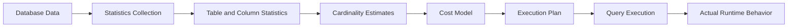
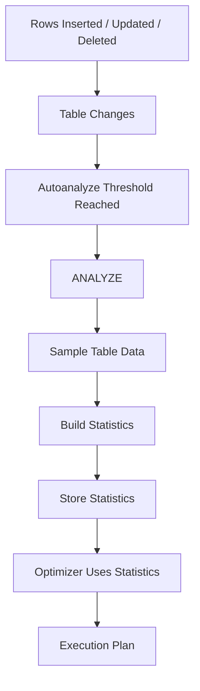
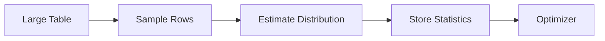
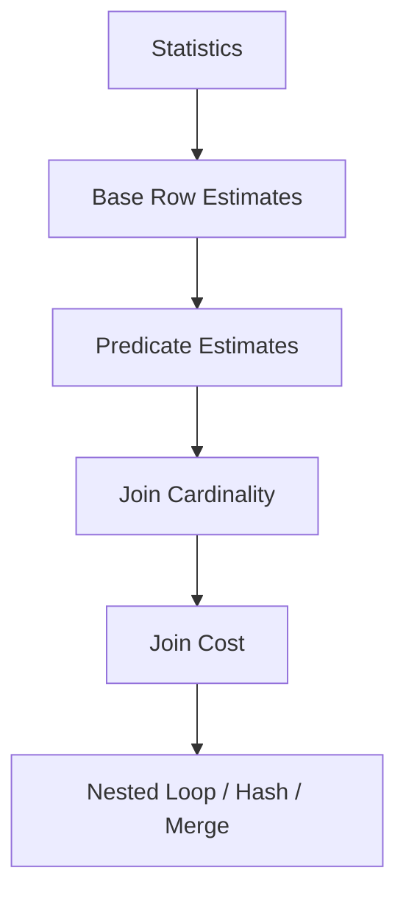

# 18- Database Statistics

## Overview

Database statistics are metadata about table size, column distributions, distinct values, null fractions, and other characteristics that the query optimizer uses to estimate query costs.

The optimizer does not normally execute every possible plan to determine which one is fastest. Instead, it uses statistics to predict how many rows each operation will process and combines those estimates with a cost model to select an execution plan.

The relationship is:



In PostgreSQL, statistics are maintained primarily through `ANALYZE` and automatic maintenance performed by autovacuum/autoanalyze. Statistics are approximate by design; their purpose is to give the optimizer enough information to make consistently good decisions without scanning entire tables during planning.

Database statistics are therefore a core dependency of query optimization. An index can exist and still be ignored if the optimizer estimates that using it is more expensive than another access path. Conversely, stale or inaccurate statistics can cause the optimizer to select an inefficient plan.

## What Database Statistics Contain

Statistics describe properties of stored data that are useful for planning.

Common information includes:

| Statistic | Purpose |
|---|---|
| Row count estimate | Estimates relation size |
| Distinct-value estimate | Estimates uniqueness and number of groups |
| Null fraction | Estimates rows containing `NULL` |
| Most common values | Handles highly frequent values |
| Most common frequencies | Estimates selectivity of common values |
| Histogram bounds | Models value distribution |
| Column correlation | Estimates relationship between logical and physical ordering |
| Extended statistics | Models relationships between multiple columns |

The exact statistics available and their implementation are database-specific. The examples in this document focus primarily on PostgreSQL because it exposes useful statistics and planning information directly.

## Why Statistics Exist

Without statistics, the optimizer would have to rely heavily on assumptions.

For example:

```sql
SELECT *
FROM orders
WHERE status = 'pending';
```

Suppose the table contains:

```text
10,000,000 rows
```

If the optimizer knows that:

```text
pending = 1%
```

it can estimate:

```text
10,000,000 × 1%
= 100,000 rows
```

That estimate can influence whether the optimizer chooses:

- Sequential scan.
- Index scan.
- Bitmap scan.
- Parallel execution.
- Different join strategies.

The optimizer therefore uses statistics to reason about the expected amount of work before execution.

## Statistics Collection Lifecycle

A simplified PostgreSQL lifecycle is:



Statistics are not necessarily updated after every row modification.

This is important because maintaining perfect statistics continuously would itself introduce significant overhead.

The system instead maintains an approximation that is refreshed periodically.

## ANALYZE

`ANALYZE` collects statistics about database tables.

For a specific table:

```sql
ANALYZE orders;
```

For a specific column:

```sql
ANALYZE orders (customer_id);
```

For the entire database:

```sql
ANALYZE;
```

A production system normally relies on automatic statistics maintenance rather than routinely running full manual analysis from application code.

Manual `ANALYZE` is useful when:

- A large bulk load has completed.
- A major data distribution change occurred.
- A query plan needs immediate investigation.
- Automatic statistics collection has not yet caught up.

## VACUUM and ANALYZE

`VACUUM` and `ANALYZE` solve different problems.

| Operation | Primary purpose |
|---|---|
| `VACUUM` | Reclaims/reuses storage from dead tuples and supports transaction visibility maintenance |
| `ANALYZE` | Collects statistics for query planning |
| `VACUUM (ANALYZE)` | Performs both operations |

Example:

```sql
VACUUM (ANALYZE) orders;
```

Do not treat `VACUUM` as a replacement for `ANALYZE`. A table can have healthy vacuuming while still having statistics that are inadequate for a particular workload.

## PostgreSQL Statistics Views

PostgreSQL exposes column statistics through `pg_stats`.

Example:

```sql
SELECT
    tablename,
    attname,
    null_frac,
    n_distinct,
    most_common_vals,
    most_common_freqs,
    histogram_bounds,
    correlation
FROM pg_stats
WHERE tablename = 'orders';
```

This is useful when diagnosing why the optimizer may be estimating a predicate incorrectly.

The view presents statistics in a more convenient form than directly querying PostgreSQL's internal statistics storage.

## Row Count Estimates

The optimizer needs an estimate of relation size.

For example:

```text
Estimated table rows = 50,000,000
```

This estimate is used as the starting point for many cardinality calculations.

A stale row-count estimate can affect the entire plan.

Suppose the table actually contains:

```text
500,000,000 rows
```

but the optimizer estimates:

```text
50,000,000 rows
```

That 10× discrepancy can affect decisions about:

- Sequential scans.
- Parallelism.
- Join algorithms.
- Memory usage.
- Aggregation.
- Sorting.

## Null Fraction

The optimizer can track the fraction of rows containing `NULL`.

For example:

```text
customer_id

NULL      → 5%
non-NULL  → 95%
```

This matters for predicates such as:

```sql
WHERE customer_id IS NULL;
```

and:

```sql
WHERE customer_id IS NOT NULL;
```

It can also influence selectivity calculations for more complex predicates.

## Distinct Value Estimates

`n_distinct` represents an estimate of the number of distinct values in a column.

Consider:

```text
orders.customer_id

Rows:             10,000,000
Distinct values:   500,000
```

The optimizer can use this information for:

```sql
GROUP BY customer_id
```

and joins such as:

```sql
JOIN customers
    ON customers.id = orders.customer_id
```

The number of distinct values affects expected join matches and group counts.

## Most Common Values

Many real datasets are highly skewed.

Example:

```text
status

paid        90%
pending      7%
cancelled    2%
refunded     1%
```

A statistics system can record frequently occurring values and their frequencies.

This lets the optimizer distinguish:

```sql
WHERE status = 'paid'
```

from:

```sql
WHERE status = 'refunded'
```

even though both are equality predicates on the same column.

This is important because an index may be useful for a highly selective value but less attractive for a value matching most of the table.

## Histograms

Histograms approximate the distribution of values that are not adequately represented by most-common-value statistics.

Conceptually:

```text
Value range
│
├── 0-100       █████████████
├── 100-500     ██████████
├── 500-1000    █████
├── 1000-5000   ██
└── 5000+       █
```

For:

```sql
WHERE amount > 5000;
```

the optimizer can use the distribution to estimate the fraction of rows satisfying the predicate.

Histograms are particularly useful for range predicates.

## Column Correlation

PostgreSQL statistics can include correlation between a column's logical ordering and the physical order of table rows.

A high positive correlation means values tend to appear in an order similar to their physical storage order.

For example, an append-heavy table may have:

```text
id increases with insertion order
```

and therefore exhibit strong correlation.

Correlation can influence the cost of index access because the optimizer considers how much table-page access may be required.

A highly correlated index scan can involve relatively efficient sequential page access, while a poorly correlated index can require many scattered heap page accesses.

## Statistics Sampling

Collecting exact statistics over very large tables can be expensive.

Database systems therefore commonly use sampling.

Conceptually:



This introduces approximation by design.

For a billion-row table, the optimizer does not need to inspect every row just to estimate whether a predicate matches 1% or 50% of the table.

The trade-off is:

```text
More accurate statistics
        ↕
More analysis work
```

## Statistics Target

PostgreSQL allows the statistics target to be adjusted.

Example:

```sql
ALTER TABLE orders
ALTER COLUMN status
SET STATISTICS 500;
```

Then:

```sql
ANALYZE orders;
```

A higher target can allow more detailed statistics to be collected for that column.

This can help when:

- The distribution is highly skewed.
- There are many distinct values.
- Query estimates are consistently poor.
- Important predicates depend on fine-grained distributions.

However, increasing the target globally is usually unnecessary.

Higher targets can increase:

- `ANALYZE` cost.
- Statistics storage.
- Planning overhead.

Tune important columns based on observed problems.

## Extended Statistics

Single-column statistics cannot fully represent relationships between columns.

Consider:

```sql
WHERE country = 'IN'
  AND state = 'Maharashtra'
```

`country` and `state` are correlated.

Knowing the distribution of each column independently may not accurately predict the distribution of the combination.

PostgreSQL supports extended statistics.

Example:

```sql
CREATE STATISTICS customer_location_stats
ON country, state
FROM customers;
```

Then refresh:

```sql
ANALYZE customers;
```

Extended statistics can model relationships such as:

- Functional dependencies.
- Distinct combinations.
- Dependencies between columns.

They should be introduced when query-plan evidence demonstrates that ordinary statistics are insufficient.

## Statistics and Cardinality Estimation

Statistics feed the optimizer's cardinality estimation process.

For example:

```sql
SELECT *
FROM orders
WHERE status = 'pending';
```

Conceptually:

```text
Table row estimate
        ↓
Column statistics
        ↓
Predicate selectivity
        ↓
Estimated qualifying rows
        ↓
Cost comparison
        ↓
Execution plan
```

If the statistics say:

```text
10,000,000 total rows
7% pending
```

the optimizer may estimate:

```text
700,000 rows
```

That estimate then influences the access path.

## Statistics and Index Selection

Statistics do not select indexes directly.

Instead, the optimizer compares the estimated cost of available strategies.

For example:

```text
Sequential Scan
    Estimated cost: 100,000

Index Scan
    Estimated cost: 20,000
```

The index scan may be chosen.

But if statistics indicate that a predicate matches most rows:

```text
Sequential Scan
    Estimated cost: 100,000

Index Scan
    Estimated cost: 180,000
```

the sequential scan may be preferred.

This explains an important production behavior:

> An existing index is not a guarantee that the optimizer will use it.

## Statistics and Join Selection

Statistics strongly influence join strategy.

Suppose:

```text
Estimated outer rows = 100
```

A nested loop may be attractive.

If statistics instead indicate:

```text
Estimated outer rows = 10,000,000
```

a hash join or merge join may become more attractive.

A simplified relationship is:



Poor statistics can therefore indirectly produce poor join choices.

## Statistics and Aggregation

Consider:

```sql
SELECT
    customer_id,
    COUNT(*)
FROM orders
GROUP BY customer_id;
```

The optimizer needs to estimate the number of groups.

If statistics indicate:

```text
500,000 distinct customer_id values
```

the optimizer can estimate approximately how many groups the aggregation may produce.

This affects decisions involving:

- Hash aggregation.
- Sort aggregation.
- Memory usage.
- Parallel aggregation.
- Downstream operations.

## Statistics and Sort Operations

For:

```sql
SELECT *
FROM orders
ORDER BY created_at;
```

the optimizer considers the expected number of rows and available ordering.

Statistics can influence whether the operation appears cheap enough to perform using an index or whether sorting a result is preferable.

If a filter unexpectedly returns millions of rows rather than thousands, a sort can become much more expensive than the optimizer expected.

## Statistics and Parallelism

The optimizer also uses estimated workload when considering parallel execution.

For example:

```text
Estimated rows = 500
```

may not justify parallel workers.

But:

```text
Estimated rows = 50,000,000
```

may make parallel execution attractive.

A significant underestimation can therefore prevent parallelism when it would have been useful.

Overestimation can have the opposite effect by introducing unnecessary parallel coordination.

## Stale Statistics

Statistics become stale when the underlying data changes substantially but statistics have not been refreshed sufficiently.

Example:

```text
After initial deployment:
orders = 100,000 rows

After one year:
orders = 200,000,000 rows
```

If the optimizer's statistics do not reflect this growth, it may make decisions based on an outdated data model.

Typical causes include:

- Large bulk inserts.
- Large deletes.
- Large updates.
- Data migrations.
- Rapidly growing event tables.
- Partition changes.
- Highly skewed workloads.

## Autoanalyze

PostgreSQL automatically triggers statistics collection through autovacuum/autoanalyze according to table activity and configuration.

The important production question is not:

> "Does PostgreSQL automatically analyze tables?"

It does.

The better question is:

> "Does automatic analysis happen frequently enough for this table's workload?"

A large, heavily modified table may require workload-specific tuning.

## Large Bulk Loads

After a major data load, statistics may not immediately represent the new distribution.

For example:

```sql
COPY orders
FROM '/data/orders.csv'
WITH (FORMAT csv);
```

After a significant load, a targeted:

```sql
ANALYZE orders;
```

may be appropriate before latency-sensitive queries depend on the new distribution.

This is especially useful in controlled deployment or ETL workflows.

## Data Skew

Data skew is one of the most important reasons to inspect statistics rather than assuming uniform distributions.

Example:

```text
tenant_id = 1      → 60% of rows
tenant_id = 2       → 15%
tenant_id = 3        → 5%
all others          → 20%
```

A query for tenant `1` can have radically different cardinality from a query for a typical tenant.

This matters in multi-tenant SaaS applications where the same API endpoint may produce dramatically different database workloads for different customers.

## Partitioned Tables

Partitioned systems add another dimension to statistics management.

Queries often contain partition-pruning predicates such as:

```sql
WHERE created_at >= DATE '2026-09-01'
  AND created_at < DATE '2026-10-01'
```

Good statistics and partition-aware planning help the optimizer estimate work after pruning.

For large partitioned datasets, monitor:

- Statistics freshness.
- Partition sizes.
- Data distribution across partitions.
- Query pruning behavior.
- Planning overhead.

Do not assume that adding partitions automatically guarantees good query performance.

## Detecting Statistics Problems

A practical starting point is:

```sql
EXPLAIN (ANALYZE, BUFFERS)
SELECT *
FROM orders
WHERE status = 'pending';
```

Compare:

```text
Estimated rows
vs
Actual rows
```

For example:

```text
rows=1000
actual rows=2500000
```

A 2,500× mismatch is strong evidence that the optimizer's assumptions need investigation.

The root cause may be:

- Stale statistics.
- Data skew.
- Correlated predicates.
- Insufficient statistics detail.
- Rapidly changing data.
- Limitations in the optimizer's estimation model.

## Finding the First Estimation Error

For a complex plan, do not only inspect the final node.

Consider:

```text
Scan
 ↓
Filter
 ↓
Join
 ↓
Aggregate
 ↓
Sort
```

If the scan estimates:

```text
10,000 rows
```

but produces:

```text
5,000,000 rows
```

then the join and aggregation estimates may also be wrong.

The first significant mismatch is often the most valuable diagnostic point.

## Practical Investigation Workflow

When investigating a query-plan regression:

1. Capture the current execution plan.
2. Compare estimated and actual row counts.
3. Identify the first major estimation mismatch.
4. Inspect statistics for the affected columns.
5. Check whether statistics are stale.
6. Examine data skew and value distribution.
7. Check correlations between predicates.
8. Consider extended statistics.
9. Refresh statistics where appropriate.
10. Re-run the query and compare the plan.
11. Validate the improvement with production-like data.

Example:

```sql
EXPLAIN (ANALYZE, BUFFERS, VERBOSE)
SELECT
    o.id,
    c.name
FROM orders AS o
JOIN customers AS c
    ON c.id = o.customer_id
WHERE o.status = 'pending'
  AND o.region = 'IN';
```

Do not immediately add an index or force a join type. First determine whether the optimizer's input assumptions are wrong.

## Monitoring Statistics Health

Statistics health is usually monitored indirectly through query behavior.

Useful signals include:

| Signal | Why it matters |
|---|---|
| Query latency | Detects user-visible regressions |
| Plan changes | May reveal optimizer decisions changing unexpectedly |
| Estimated vs actual rows | Identifies cardinality problems |
| Database CPU | Indicates excessive query work |
| Buffer reads | Indicates data-access volume |
| Temporary files | Can reveal large sorts/hashes |
| Analyze activity | Shows statistics maintenance behavior |
| Table modification rate | Indicates how quickly statistics can become stale |

PostgreSQL's `pg_stat_statements` is useful for identifying expensive or frequently executed query patterns.

## Statistics and Application Frameworks

Application frameworks such as Django and FastAPI do not perform SQL optimization themselves.

For example, Django may generate:

```sql
SELECT
    "orders"."id",
    "orders"."customer_id",
    "orders"."status"
FROM "orders"
WHERE "orders"."status" = 'pending';
```

The database optimizer receives the SQL and makes the execution-plan decision.

Therefore, an application developer investigating a slow Django endpoint should inspect both:

```text
Application query generation
+
Database execution plan
```

The same principle applies to FastAPI services, gRPC services, Celery workers, and other backend components that issue SQL.

## Operational Best Practices

### Keep Automatic Maintenance Healthy

Ensure autovacuum and autoanalyze are not disabled or starved by an inappropriate configuration.

### Tune High-Change Tables

Tables with extremely high modification rates may require more aggressive statistics maintenance than relatively static reference tables.

### Refresh After Major Data Changes

Use targeted `ANALYZE` operations when controlled bulk operations materially change table size or distribution.

### Tune Statistics Selectively

Increase statistics targets only for columns where better estimates provide measurable planning benefits.

### Use Extended Statistics for Real Correlations

Do not create extended statistics indiscriminately. Use them where multi-column relationships materially affect important queries.

### Monitor Plan Regressions

A statistics problem often appears first as a change in execution plan or query latency.

### Test With Representative Data

Preserve realistic:

- Row counts.
- Value distributions.
- Tenant skew.
- Null rates.
- Correlations.
- Historical data.

## Common Mistakes

### Assuming Statistics Are Exact

Statistics are estimates derived from sampled or summarized data.

They are intentionally approximate.

### Assuming `ANALYZE` Fixes Every Query Problem

Fresh statistics do not guarantee a good plan.

The optimizer can still make incorrect estimates because of complex distributions, correlations, or limitations in its estimation model.

### Increasing Statistics Targets Globally

More detailed statistics can increase maintenance and planning overhead.

Tune important columns rather than changing every column without evidence.

### Ignoring Data Distribution

Two columns with the same data type and row count can behave very differently because their distributions differ.

### Assuming Indexes Make Statistics Irrelevant

Indexes provide access paths. Statistics help the optimizer determine whether those paths are worthwhile.

### Treating Development Statistics as Representative

A small development database often has fundamentally different distributions from production.

### Manually Running `ANALYZE` From Application Requests

Statistics maintenance should generally be handled by database maintenance mechanisms or controlled operational workflows, not synchronous API requests.

### Ignoring Bulk Data Changes

Large ETL jobs, migrations, and imports can change table distributions dramatically.

Statistics should be considered part of the operational lifecycle of those changes.

## Production Pitfalls

### High-Write Event Tables

Tables receiving millions of inserts can change faster than statistics are refreshed.

Symptoms include:

- Sudden plan changes.
- Unexpected sequential scans.
- Join strategy changes.
- Latency spikes after data growth.

### Multi-Tenant Workloads

One tenant may account for most rows.

A plan that performs well for a typical tenant may perform poorly for a dominant tenant.

### Highly Correlated Columns

Independent single-column statistics can produce poor combined estimates.

Extended statistics may be appropriate.

### Large Historical Tables

Recent data may represent a small portion of a very large table.

Queries that focus on recent time ranges can therefore be sensitive to statistics quality and data distribution.

### Statistics After Migrations

Schema migrations that change data distribution should include performance validation.

For example:

```text
Migration
   ↓
Data transformation
   ↓
Statistics refresh
   ↓
Plan validation
```

## Security Considerations

Statistics are primarily performance metadata, but database diagnostics can reveal operational information.

Execution plans and statistics may expose:

- Table names.
- Column names.
- Query predicates.
- Application-specific identifiers.
- Internal schema details.

Avoid unnecessarily exposing production execution plans or database metadata in public logs.

Application queries should remain parameterized:

```python
cursor.execute(
    """
    SELECT id, total_amount
    FROM orders
    WHERE customer_id = %s
    """,
    [customer_id],
)
```

Statistics tuning does not remove the need for standard SQL injection protections.

## Scalability Considerations

Statistics become increasingly important as data volume grows.

A small estimation error on a small table may have little impact:

```text
Estimated: 1,000
Actual:    1,200
```

The same relative error on a large table can affect millions of rows.

At scale, poor statistics can increase:

- CPU consumption.
- Storage I/O.
- Temporary disk usage.
- Query latency.
- Connection occupancy.
- Replica workload.
- Infrastructure cost.

Healthy statistics are therefore part of database scalability, not merely query tuning.

## Reliability and High Availability

A poor execution plan can consume enough database resources to affect unrelated workloads.

For example:

```text
Bad plan
   ↓
High CPU / I/O
   ↓
Connection saturation
   ↓
API latency
   ↓
Request timeouts
   ↓
Retry amplification
   ↓
Higher database load
```

This can become a system-level reliability problem.

Use:

- Query timeouts.
- Connection pool limits.
- Appropriate database resource isolation.
- Query monitoring.
- Load testing.
- Read replicas where appropriate.
- Controlled plan changes.

Do not assume that a statistics issue is isolated to one endpoint if the affected query consumes significant shared database resources.

## Cost Considerations

Better statistics can reduce infrastructure cost by helping the optimizer avoid unnecessarily expensive execution strategies.

Potential savings include:

- Lower database CPU.
- Fewer disk reads.
- Reduced temporary storage.
- Lower replica load.
- Smaller database instances.
- Better utilization of existing capacity.

However, collecting more detailed statistics also has a cost.

The goal is not maximum statistics detail.

The goal is:

> **Enough statistics accuracy to produce reliable execution plans at an acceptable maintenance cost.**

## Interview Traps

| Question | Strong answer |
|---|---|
| What are database statistics? | Metadata describing table and column characteristics that the optimizer uses to estimate cardinality and query cost. |
| Why are statistics important? | They influence access paths, join algorithms, aggregation, sorting, parallelism, and overall plan selection. |
| How are PostgreSQL statistics collected? | Primarily through `ANALYZE`, including automatic analysis through autovacuum/autoanalyze. |
| Are statistics exact? | No. They are approximate and commonly based on sampled or summarized data. |
| What is `pg_stats`? | A PostgreSQL system view exposing planner statistics in a convenient form. |
| What does `n_distinct` represent? | An estimate of the number of distinct values in a column. |
| What are most common values used for? | Modeling highly frequent values and improving selectivity estimates for skewed distributions. |
| What are histograms used for? | Estimating the distribution and selectivity of values, especially for range predicates. |
| Why can stale statistics cause slow queries? | The optimizer may make decisions using outdated row counts or distributions. |
| Does `VACUUM` collect statistics? | No. `VACUUM` and `ANALYZE` have different primary purposes, although `VACUUM (ANALYZE)` performs both. |
| Why might an index be ignored? | The optimizer may estimate that a sequential scan or another strategy has lower cost. |
| What is extended statistics? | Statistics that capture relationships across multiple columns, improving estimates for correlated predicates. |
| Why is data skew important? | Highly uneven value distributions can make uniform assumptions inaccurate and lead to poor plans. |
| What is the statistics target? | A setting controlling the amount of detail collected for a column's statistics. |
| Should statistics targets be increased globally? | Usually no. Tune selectively based on observed estimation problems. |
| How do you detect stale or inaccurate statistics? | Compare estimated and actual rows with `EXPLAIN ANALYZE` and inspect statistics and data-change patterns. |
| What is the first thing to inspect in a bad plan? | Find where estimated cardinality first diverges significantly from actual cardinality. |
| Why are production-like datasets important? | Statistics and plans depend on real data distributions, skew, correlations, and scale, not just schema structure. |
| Can fresh statistics still produce poor estimates? | Yes. Fresh statistics do not guarantee that the optimizer's estimation model perfectly represents complex relationships. |
| Should application code manually run `ANALYZE` on every request? | No. Statistics maintenance belongs to database maintenance and controlled operational workflows. |

## Key Takeaways

- **Database statistics provide the optimizer with information about table sizes, value distributions, distinct values, nulls, and correlations.**
- **Statistics drive cardinality and cost estimates, which directly influence scans, joins, aggregation, sorting, and parallel execution.**
- **Stale statistics, skewed data, and correlated columns are common causes of inaccurate estimates and poor execution plans.**
- **Use `ANALYZE`, selective statistics-target tuning, and extended statistics to improve planning when evidence shows that statistics are insufficient.**
- **Treat statistics maintenance as a production database concern: healthy statistics, representative data, and plan monitoring are essential for predictable performance at scale.**