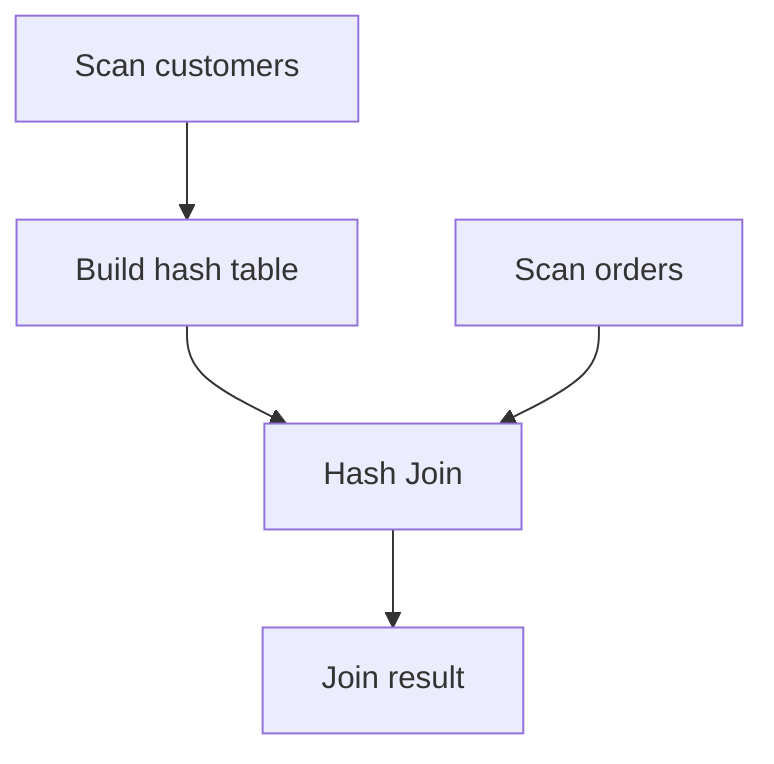
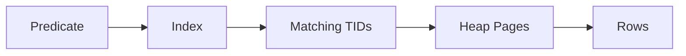
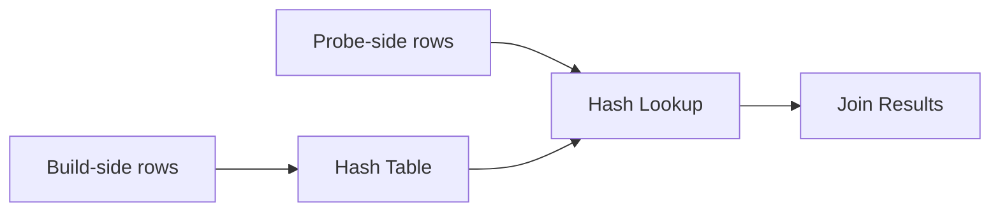
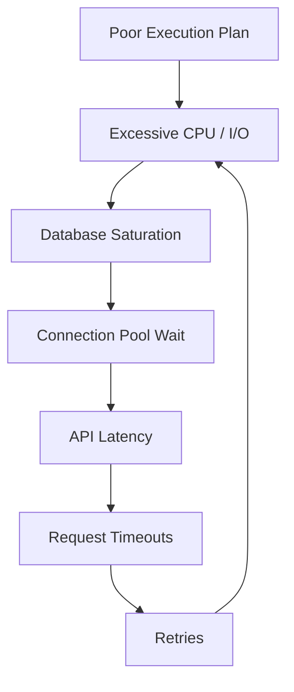

# 19- Query Plan Interpretation

## Overview

Query plan interpretation is the process of reading a database execution plan and determining **how the database intends to execute a SQL statement, where the work occurs, and why the chosen strategy may or may not be efficient**.

For backend engineers, an execution plan is one of the most useful tools for diagnosing slow database operations. Application-level symptoms such as high API latency, CPU saturation, connection-pool exhaustion, or request timeouts often originate from a poor database access path.

A query plan answers questions such as:

- Is the database scanning the entire table?
- Is an index actually being used?
- How many rows does each operator expect?
- How many rows does each operator actually process?
- Which join algorithm was selected?
- Is a sort or hash operation spilling to disk?
- Are table pages being read from memory or storage?
- Is parallel execution being used?
- Where does the estimated cardinality diverge from reality?
- Which plan node is responsible for most of the work?

The core diagnostic model is:

```text
SQL
 ↓
Optimizer
 ↓
Statistics + Cost Model
 ↓
Execution Plan
 ↓
Plan Nodes
 ↓
Actual Execution
 ↓
Runtime Metrics
```

This document focuses primarily on PostgreSQL terminology and examples because PostgreSQL exposes detailed execution plans through `EXPLAIN` and `EXPLAIN ANALYZE`.

## Why Query Plan Interpretation Matters

A slow SQL query is not necessarily caused by "missing an index."

Performance problems can come from:

- Incorrect cardinality estimates.
- Poor join strategy.
- Excessive rows processed before filtering.
- Sequential scans over unexpectedly large relations.
- Inefficient index access.
- Large sorts.
- Hash-table memory pressure.
- Disk spills.
- Poor partition pruning.
- Data skew.
- Stale statistics.
- Excessive nested-loop iterations.
- Application-generated inefficient SQL.

Without an execution plan, optimization is often guesswork.

With a plan, the investigation becomes evidence-driven:

```text
Slow query
    ↓
Capture plan
    ↓
Identify expensive nodes
    ↓
Compare estimated vs actual rows
    ↓
Determine root cause
    ↓
Change query / index / statistics / schema
    ↓
Re-run and compare
```

## Query Plan Anatomy

A PostgreSQL plan is a tree of execution nodes.

For example:

```text
Nested Loop
├── Index Scan on customers
└── Index Scan on orders
```

The parent node consumes output from its child nodes.

A more complex plan may look like:

```text
Limit
└── Sort
    └── Hash Join
        ├── Seq Scan on orders
        └── Hash
            └── Seq Scan on customers
```

The plan tree describes the execution pipeline rather than simply listing operations in SQL order.

## Reading a Plan

Consider:

```sql
EXPLAIN
SELECT
    o.id,
    o.total_amount
FROM orders AS o
WHERE o.customer_id = 42;
```

A simplified output might be:

```text
Index Scan using idx_orders_customer_id on orders
  (cost=0.42..18.50 rows=12 width=16)
```

The important fields are:

| Field | Meaning |
|---|---|
| Node type | Operation performed |
| `cost` | Estimated startup and total cost |
| `rows` | Estimated output rows |
| `width` | Estimated average row size |
| Actual rows | Rows produced during execution |
| Actual time | Runtime for the node |
| Loops | Number of executions of the node |

The most important habit is to avoid reading only the node name.

A statement such as:

```text
Index Scan
```

does not automatically mean the query is fast.

You must inspect:

```text
estimated rows
actual rows
loops
actual time
buffers
```

and understand how the node fits into the complete plan.

## Estimated Cost

PostgreSQL's `cost` values are optimizer cost units, not milliseconds.

Example:

```text
cost=0.42..18.50
```

means approximately:

```text
startup cost = 0.42
total cost   = 18.50
```

The values are used to compare alternative plans.

They should **not** be interpreted as:

```text
18.50 ms
```

A plan with:

```text
cost=100
```

is not necessarily twice as fast as one with:

```text
cost=200
```

Cost units are meaningful primarily within the optimizer's cost model.

## Startup Cost vs Total Cost

A node's cost has two components:

```text
startup cost .. total cost
```

Startup cost is the estimated cost before the node can produce its first row.

Total cost is the estimated cost of producing all rows.

This distinction matters for queries containing:

```sql
LIMIT 10;
```

A plan with slightly higher total cost but much lower startup cost may be attractive when only a small number of rows are needed.

## Estimated Rows

Consider:

```text
Index Scan
  (cost=0.42..100.00 rows=100)
```

The optimizer estimates that the node will produce approximately:

```text
100 rows
```

This estimate is critical because parent operators use it to estimate their own work.

For example:

```text
Scan estimate
      ↓
Join estimate
      ↓
Aggregate estimate
      ↓
Sort estimate
```

An incorrect estimate near the bottom of the tree can propagate through the entire plan.

## Actual Rows

With:

```sql
EXPLAIN ANALYZE
SELECT ...
```

PostgreSQL executes the query and reports actual runtime information.

For example:

```text
Index Scan using idx_orders_status on orders
  (cost=0.42..100.00 rows=100 width=32)
  (actual time=0.05..250.00 rows=250000 loops=1)
```

Here:

```text
estimated rows = 100
actual rows    = 250,000
```

The optimizer underestimated the result by:

```text
250,000 / 100 = 2,500×
```

That is a significant estimation error.

## Actual Time

A node may report:

```text
(actual time=0.05..250.00 rows=250000 loops=1)
```

The two times represent approximately:

```text
first row available = 0.05 ms
all rows available  = 250.00 ms
```

When interpreting runtime, always consider `loops`.

A node executed:

```text
actual time = 5 ms
loops = 1
```

has a very different cost from:

```text
actual time = 5 ms
loops = 10,000
```

## Loops

`loops` indicates how many times a node was executed.

This is particularly important with nested loops.

For example:

```text
Index Scan on orders
(actual time=0.10..1.20 rows=10 loops=5000)
```

The node ran 5,000 times.

The approximate aggregate work can therefore be substantial even though the per-loop timing looks small.

A common mistake is to look at:

```text
actual time=0.10..1.20
```

and conclude that the operation is cheap without considering:

```text
loops=5000
```

## Reading Plans as Trees

A useful mental model is:

> **A parent node consumes rows produced by its children.**

For:

```text
Hash Join
├── Seq Scan on orders
└── Hash
    └── Seq Scan on customers
```

the execution flow is conceptually:



Understanding this data flow makes complex plans much easier to interpret.

## Scan Nodes

Common scan operators include:

| Node | Typical purpose |
|---|---|
| Sequential Scan | Read table pages sequentially |
| Index Scan | Traverse index and fetch table rows |
| Index Only Scan | Satisfy query from index where possible |
| Bitmap Index Scan | Identify matching tuple locations through an index |
| Bitmap Heap Scan | Fetch table pages selected by bitmap |
| Tid Scan | Fetch rows by physical tuple identifier |
| Parallel Seq Scan | Sequential scan executed by workers |

The correct scan depends on:

- Selectivity.
- Table size.
- Data distribution.
- Index structure.
- Physical locality.
- Required columns.
- Estimated result size.

## Sequential Scan

A sequential scan reads the table's pages sequentially.

Example:

```text
Seq Scan on orders
  (cost=0.00..120000.00 rows=5000000 width=64)
```

A sequential scan is not automatically a performance problem.

It can be the optimal strategy when:

- The query needs a large percentage of the table.
- The table is relatively small.
- An index would require many random heap accesses.
- The query cannot use a useful index.
- The optimizer estimates sequential access to be cheaper.

The key question is:

> Is the sequential scan expensive relative to the amount of data the query actually needs?

## Index Scan

An index scan typically:

1. Traverses an index.
2. Finds matching index entries.
3. Fetches corresponding table rows.

Conceptually:



Index scans are often useful for selective predicates.

They can become expensive when many rows are matched and heap access becomes random or numerous.

## Index Only Scan

An index-only scan can avoid fetching table rows when the required data is available in the index and PostgreSQL can verify tuple visibility appropriately.

Example:

```sql
CREATE INDEX idx_orders_customer_total
ON orders (customer_id)
INCLUDE (total_amount);
```

A query such as:

```sql
SELECT total_amount
FROM orders
WHERE customer_id = 42;
```

may be eligible for an index-only scan.

However, "index-only" does not guarantee zero heap access. PostgreSQL's visibility map determines whether heap visibility checks can be avoided.

## Bitmap Scans

A bitmap strategy typically consists of:

```text
Bitmap Index Scan
        ↓
Bitmap Heap Scan
```

The index identifies matching table locations first.

The bitmap heap scan then fetches relevant heap pages.

Bitmap scans are useful when a predicate matches more rows than a traditional index scan should fetch individually, but scanning the whole table would still be wasteful.

## Join Nodes

Common join strategies include:

| Join | Typical strength |
|---|---|
| Nested Loop | Small outer input and efficient inner lookup |
| Hash Join | Large unsorted equality joins |
| Merge Join | Inputs already sorted or cheaply sortable |
| Parallel joins | Large workloads that benefit from workers |

The optimizer chooses among them using estimated cardinalities and costs.

A join node should therefore always be interpreted together with:

- Outer row count.
- Inner row count.
- Join condition.
- Number of loops.
- Input ordering.
- Memory usage.

## Nested Loop Interpretation

Example:

```text
Nested Loop
  (actual time=0.10..80.00 rows=5000 loops=1)
  -> Index Scan on customers
     (actual rows=100 loops=1)
  -> Index Scan on orders
     (actual rows=50 loops=100)
```

The inner index scan runs:

```text
100 times
```

If each lookup is cheap, this can be an excellent plan.

If the outer relation unexpectedly contains millions of rows, the same strategy can become disastrous.

The important relationship is:

```text
Outer rows × inner lookup cost
```

## Hash Join Interpretation

A hash join generally:

1. Reads one input.
2. Builds an in-memory hash table.
3. Reads the other input.
4. Probes the hash table.

Conceptually:



Hash joins are particularly effective for large equality joins when inputs do not already have useful ordering.

Inspect:

- Hash table size.
- Memory usage.
- Batches.
- Disk spill behavior.
- Estimated vs actual rows.

## Merge Join Interpretation

A merge join works with ordered inputs.

Conceptually:

```text
Input A:  10 20 30 40
Input B:  20 30 40 50

Compare current values
→ advance the smaller value
→ emit matches
```

The database may obtain ordering through:

- Index scans.
- Existing sorted data.
- Explicit sort nodes.

Merge joins can be attractive when inputs are already ordered or sorting is inexpensive relative to alternatives.

## Sort Nodes

Example:

```text
Sort
  (cost=1000..1200 rows=50000)
  Sort Key: created_at DESC
```

The important questions are:

- How many rows are being sorted?
- How large are the rows?
- Is the sort in memory?
- Does it spill to disk?
- Could an index provide the required ordering?
- Is a `LIMIT` allowing an optimized strategy?

For a large sort, inspect:

```text
Sort Method
Memory
Disk
```

with `EXPLAIN ANALYZE`.

## Aggregate Nodes

Common aggregation nodes include:

- `HashAggregate`
- `GroupAggregate`
- `Partial Aggregate`
- `Finalize Aggregate`

Example:

```text
HashAggregate
  Group Key: customer_id
```

Interpretation should consider:

- Estimated number of groups.
- Actual number of groups.
- Memory consumption.
- Disk spill.
- Parallel aggregation.

A severe underestimation of group cardinality can cause memory and execution problems.

## Filter Nodes

A filter can be represented as:

```text
Filter: status = 'pending'
```

A useful diagnostic is comparing:

```text
Rows Removed by Filter
```

with rows returned.

For example:

```text
Seq Scan on orders
  Filter: status = 'pending'
  Rows Removed by Filter: 9,900,000
  rows=100,000
```

This tells you that the scan processed far more rows than the query ultimately returned.

That may be completely valid for the workload, or it may indicate an opportunity for:

- A better index.
- Partition pruning.
- Query restructuring.
- Different data access patterns.

## Estimated vs Actual Rows

One of the most important plan interpretation techniques is comparing:

```text
rows
```

with:

```text
actual rows
```

Example:

```text
Nested Loop
  (rows=100)
  (actual rows=1000000)
```

This suggests a major cardinality estimation problem.

A useful diagnostic ratio is:

```text
estimation ratio =
actual rows / estimated rows
```

For example:

```text
1,000,000 / 100
= 10,000×
```

Large discrepancies deserve investigation, especially when they affect join strategy.

## Propagation of Estimation Errors

Suppose:

```text
Actual scan rows      = 5,000,000
Estimated scan rows   = 5,000
```

A parent join may therefore make decisions based on:

```text
5,000 rows
```

instead of:

```text
5,000,000 rows
```

This can lead to:

```text
wrong cardinality
    ↓
wrong cost
    ↓
wrong join strategy
    ↓
wrong memory expectation
    ↓
poor execution performance
```

This is why the first major estimation error is often more important than the final slow node.

## Buffers

For PostgreSQL,:

```sql
EXPLAIN (ANALYZE, BUFFERS)
SELECT ...
```

provides buffer statistics.

Example:

```text
Buffers:
  shared hit=150000
  shared read=5000
```

Broadly:

| Metric | Meaning |
|---|---|
| `shared hit` | Page found in PostgreSQL shared buffers |
| `shared read` | Page had to be read into shared buffers |
| `shared dirtied` | Page was modified |
| `shared written` | Dirty page was written |

High buffer activity can reveal that a query is touching a large amount of data even when execution time alone does not explain why.

## Cache Effects

A query can behave differently depending on whether required pages are already cached.

For example:

```text
First execution:
shared read = 100,000

Later execution:
shared hit = 100,000
```

The query may appear much faster on subsequent executions.

Do not optimize solely from a warm-cache benchmark if production behavior includes cold or partially warm access patterns.

## Temporary Disk Usage

Some operations can spill to temporary storage when memory is insufficient.

Typical operations include:

- Sorts.
- Hash operations.
- Aggregations.

Disk spills can significantly increase latency.

When diagnosing them, inspect:

```text
Sort Method
Disk
```

or hash batch information and relevant temporary I/O statistics.

The solution is not always "increase memory." Also investigate:

- Why so many rows are being processed.
- Whether filtering can happen earlier.
- Whether an index can eliminate a sort.
- Whether the query is returning unnecessarily wide rows.
- Whether the plan's cardinality estimate is wrong.

## Parallel Plans

A parallel plan may contain nodes such as:

```text
Gather
Gather Merge
Parallel Seq Scan
Partial Aggregate
Finalize Aggregate
```

Example:

```text
Gather
  Workers Planned: 2
  Workers Launched: 2
  -> Parallel Seq Scan on orders
```

Interpretation should include:

- Planned workers.
- Actual workers.
- Per-worker work.
- Leader participation.
- Whether coordination overhead is justified.
- Whether the workload is CPU- or I/O-bound.

Parallelism is not automatically faster. Small queries can become slower because of worker startup and coordination overhead.

## LIMIT and Top-N Queries

Consider:

```sql
SELECT id, created_at
FROM orders
ORDER BY created_at DESC
LIMIT 20;
```

The optimizer may choose an access path that can produce the first rows efficiently rather than minimizing the cost of processing the entire relation.

An index such as:

```sql
CREATE INDEX idx_orders_created_at
ON orders (created_at DESC);
```

may allow the database to retrieve the required rows without sorting the entire table.

When reading plans for `LIMIT` queries, pay particular attention to:

- Startup cost.
- Actual time to first rows.
- Index ordering.
- Number of rows processed before the limit.

## Predicate Pushdown

A good plan often filters data as early as practical.

Conceptually:

```text
Large table
   ↓
Filter early
   ↓
Smaller result
   ↓
Join / Aggregate
```

Filtering after an expensive join may cause significantly more work.

However, modern optimizers can rewrite queries and push predicates automatically when semantics allow it.

Do not assume the textual order of clauses determines execution order.

## Materialization

Plans may include materialization-related behavior where an intermediate result is stored temporarily so it can be reused.

Materialization can be beneficial when:

- A result is reused.
- Recomputing a child operation is expensive.

It can be harmful when:

- The intermediate result is unexpectedly large.
- Memory or temporary storage becomes a bottleneck.

Always inspect why the optimizer introduced the node rather than treating the node itself as inherently bad.

## Common Plan Patterns

| Plan pattern | Typical interpretation |
|---|---|
| `Seq Scan` on small table | Often perfectly reasonable |
| `Seq Scan` on huge table with selective predicate | Investigate |
| `Index Scan` with very high row count | May be more expensive than expected |
| `Bitmap Heap Scan` | Moderate number of index matches |
| `Nested Loop` with small outer input | Often efficient |
| `Nested Loop` with huge outer input | Potentially dangerous |
| `Hash Join` on large equality inputs | Often appropriate |
| `Sort` on millions of rows | Investigate indexing and filtering |
| `HashAggregate` with huge groups | Check memory and cardinality |
| `Gather` on large scan | Potentially useful |
| Large estimated/actual row mismatch | Investigate statistics and predicates |
| Large `Rows Removed by Filter` | Check access path and selectivity |

## Practical Example

Consider a backend API endpoint that retrieves recent orders for a customer:

```sql
SELECT
    o.id,
    o.total_amount,
    o.created_at
FROM orders AS o
WHERE o.customer_id = 42
  AND o.status = 'pending'
ORDER BY o.created_at DESC
LIMIT 20;
```

A useful index might be:

```sql
CREATE INDEX idx_orders_customer_status_created
ON orders (customer_id, status, created_at DESC);
```

Then inspect:

```sql
EXPLAIN (ANALYZE, BUFFERS)
SELECT
    o.id,
    o.total_amount,
    o.created_at
FROM orders AS o
WHERE o.customer_id = 42
  AND o.status = 'pending'
ORDER BY o.created_at DESC
LIMIT 20;
```

A favorable plan might resemble:

```text
Limit
  -> Index Scan using idx_orders_customer_status_created on orders
       Index Cond:
         (customer_id = 42)
         AND (status = 'pending')
       actual time=0.05..0.10
       rows=20
       loops=1
```

The important property is not merely that an index is present.

The plan should ideally show that:

- The predicates are used as index conditions.
- The desired ordering is obtained efficiently.
- Only a small number of rows need to be visited.
- The `LIMIT` can terminate the scan early.
- Buffer activity is low.

## A Problematic Example

Suppose the plan instead shows:

```text
Limit
  -> Sort
       Sort Method: external merge
       Disk: 450000kB
       -> Seq Scan on orders
            Filter: customer_id = 42
            Rows Removed by Filter: 499000000
```

This indicates:

```text
500M rows scanned
        ↓
filter applied
        ↓
large result
        ↓
disk-based sort
        ↓
LIMIT
```

The problem is not simply that the query contains `ORDER BY`.

The query is processing far more data than necessary.

Potential areas to investigate include:

- Composite index design.
- Table partitioning.
- Data distribution.
- Query selectivity.
- Whether the customer predicate is correctly represented.
- Statistics freshness.

## Query Plan Interpretation Workflow

Use a consistent workflow rather than jumping directly to index creation.

### Capture the Plan

Start with:

```sql
EXPLAIN (ANALYZE, BUFFERS)
SELECT ...;
```

For more detailed diagnostics:

```sql
EXPLAIN (
    ANALYZE,
    BUFFERS,
    VERBOSE,
    SETTINGS,
    SUMMARY
)
SELECT ...;
```

Use `ANALYZE` carefully on production systems because it executes the statement.

For mutating statements such as:

```sql
UPDATE
DELETE
INSERT
```

understand the operational consequences before running `EXPLAIN ANALYZE`.

### Read From the Bottom Up

Execution trees are usually easiest to understand from the leaf nodes upward.

Ask:

1. How is each base relation accessed?
2. How many rows are produced?
3. How are those rows transformed?
4. How are inputs joined?
5. How many rows reach the parent?
6. Where does the amount of work increase unexpectedly?

### Compare Estimates With Actuals

For each important node compare:

```text
estimated rows
actual rows
loops
```

Large mismatches are high-value diagnostic signals.

### Find Expensive Work

Look for:

- High actual time.
- High loop counts.
- Large buffer usage.
- Disk-based sorts.
- Hash batches.
- Huge row counts.
- Large rows removed by filters.
- Unexpected sequential scans.

### Understand the Root Cause

Do not optimize the most visually impressive node automatically.

For example:

```text
Sort = 500 ms
```

may look like the problem.

But if the sort receives:

```text
10,000,000 rows
```

the real problem may be an upstream scan returning far too many rows.

### Change One Major Variable

Possible changes include:

- Query rewrite.
- Index.
- Statistics.
- Extended statistics.
- Partitioning.
- Schema change.
- Memory configuration.

Avoid changing many unrelated variables simultaneously because it makes causality difficult to establish.

### Re-run and Compare

Compare:

```text
Execution time
Buffers
Rows
Plan structure
Estimates
Disk spills
```

The goal is not simply to obtain a different plan.

The goal is to reduce real work while preserving correctness and acceptable operational cost.

## Application-Level Interpretation

Suppose a FastAPI endpoint executes:

```python
def get_recent_orders(connection, customer_id: int):
    with connection.cursor() as cursor:
        cursor.execute(
            """
            SELECT id, total_amount, created_at
            FROM orders
            WHERE customer_id = %s
            ORDER BY created_at DESC
            LIMIT 20
            """,
            (customer_id,),
        )
        return cursor.fetchall()
```

If the endpoint is slow, investigate both layers:

```text
HTTP request
    ↓
FastAPI handler
    ↓
Database call
    ↓
SQL
    ↓
Execution plan
    ↓
Storage / CPU / memory
```

The database plan should be correlated with application metrics such as:

- Query duration.
- Endpoint latency.
- Connection-pool wait time.
- Request rate.
- Timeout rate.

A query that takes 300 ms may be acceptable at low traffic but problematic if hundreds of concurrent requests execute it continuously.

## Django and ORM Queries

For Django applications, inspect generated SQL rather than assuming ORM code is efficient.

For example:

```python
queryset = (
    Order.objects
    .filter(customer_id=42, status="pending")
    .order_by("-created_at")[:20]
)
```

The ORM may generate an efficient query, but the database still determines the execution plan.

A useful workflow is:

```text
Django ORM
    ↓
Generated SQL
    ↓
EXPLAIN
    ↓
Execution plan
    ↓
Database behavior
```

For production troubleshooting, correlate the SQL pattern with query statistics rather than analyzing isolated requests only.

## Production Considerations

### Do Not Optimize From Estimated Cost Alone

Use actual execution behavior.

Prefer evidence such as:

```text
actual time
buffers
rows
loops
I/O
```

over statements such as:

> "This plan has a lower cost, so it must be faster."

### Use Representative Data

A plan tested against:

```text
10,000 rows
```

may behave very differently against:

```text
500,000,000 rows
```

Data distribution matters as much as row count.

### Consider Concurrency

`EXPLAIN ANALYZE` measures a query in isolation.

Production performance also depends on:

- Concurrent queries.
- Lock contention.
- CPU contention.
- Buffer-cache pressure.
- Storage throughput.
- Connection-pool behavior.

### Consider Cache State

Warm-cache and cold-cache executions can differ substantially.

Use `BUFFERS` and production monitoring to understand actual I/O behavior.

### Watch for Plan Instability

Changes in:

- Statistics.
- Data distribution.
- Table size.
- PostgreSQL configuration.
- Indexes.
- Parameter values.

can cause the optimizer to choose a different plan.

Monitor important query patterns over time.

## Security Considerations

Execution plans can expose internal database information such as:

- Schema names.
- Table names.
- Column names.
- Query predicates.
- Data-access patterns.

Avoid returning raw production execution plans to API clients.

Restrict access to database diagnostic information and sanitize logs when plans contain sensitive query parameters or application-specific identifiers.

Continue using parameterized queries:

```python
cursor.execute(
    """
    SELECT id
    FROM orders
    WHERE customer_id = %s
    """,
    (customer_id,),
)
```

Query-plan analysis is a performance technique, not a substitute for SQL injection protection.

## Scalability Considerations

At scale, plan interpretation must move beyond single-query latency.

Consider:

```text
Query cost per execution
×
Executions per second
=
Database workload
```

A query that consumes:

```text
10 ms
```

and executes:

```text
100 times/second
```

can represent:

```text
~1 CPU-second of query execution per second
```

before accounting for concurrency and I/O behavior.

This is why frequently executed moderately expensive queries can matter more than rarely executed slow queries.

Evaluate:

- Latency.
- Frequency.
- Rows processed.
- Buffer reads.
- CPU.
- I/O.
- Concurrency.
- Resource contention.

## Reliability Considerations

A bad query plan can become a cascading reliability failure:



Retries can amplify the original database load.

For latency-sensitive services, combine plan optimization with:

- Query timeouts.
- Sensible connection-pool limits.
- Rate limiting where appropriate.
- Backpressure.
- Circuit breakers at service boundaries.
- Resource monitoring.

## Common Mistakes

### Treating Every Sequential Scan as Bad

A sequential scan can be the optimal strategy.

Always evaluate:

```text
table size
+
rows required
+
selectivity
+
I/O behavior
```

### Looking Only at the Root Node

The root node often summarizes work performed by its children.

Inspect the entire tree.

### Ignoring Loops

A 1 ms operation executed 100,000 times is not a 1 ms workload.

### Reading Cost as Time

PostgreSQL cost units are not milliseconds.

### Looking Only at Execution Time

Two queries can have similar runtime in a warm cache while having radically different I/O characteristics.

Use `BUFFERS` and workload-level metrics.

### Assuming Index Usage Means Fast

An index scan can still fetch millions of heap pages.

### Adding Indexes Before Reading the Plan

This can increase:

- Write overhead.
- Storage usage.
- Vacuum work.
- Maintenance complexity.

First identify the actual access problem.

### Ignoring Estimated vs Actual Rows

Cardinality errors can explain why the optimizer selected an apparently strange join or scan.

### Optimizing Only for One Parameter Value

A plan that is ideal for:

```text
customer_id = small tenant
```

may be poor for:

```text
customer_id = dominant tenant
```

Data skew matters.

### Running `EXPLAIN ANALYZE` on Mutating Queries Carelessly

`EXPLAIN ANALYZE` executes the statement.

Never treat it as a dry-run for `UPDATE`, `DELETE`, or other state-changing operations.

## Interview Traps

| Question | Strong answer |
|---|---|
| What is an execution plan? | A tree of operations the database optimizer selects to execute a SQL statement. |
| How should you read a plan? | Understand the tree, inspect leaf scans, compare estimated and actual rows, then follow data flow upward through joins, aggregation, sorting, and other operators. |
| What does `cost=10..100` mean? | Estimated startup and total cost in optimizer cost units, not milliseconds. |
| What does `rows=100` mean? | The optimizer estimates that the node will produce approximately 100 rows. |
| Why is `loops` important? | A cheap operation executed thousands of times can dominate total execution work. |
| Is a sequential scan always bad? | No. It can be optimal when a large portion of a table must be read or the table is small. |
| Why can an index scan be slow? | It may require many heap accesses, especially when many matching rows are scattered across pages. |
| What does `EXPLAIN ANALYZE` do? | It executes the query and reports actual runtime statistics alongside the optimizer's estimates. |
| Why compare estimated and actual rows? | Large differences indicate cardinality-estimation problems that can lead to poor plan selection. |
| What does `BUFFERS` provide? | Information about PostgreSQL buffer hits, reads, writes, and related page activity. |
| What is a nested-loop risk? | A large outer relation can cause the inner operation to execute many times, producing excessive work. |
| When is a hash join useful? | Typically for large equality joins when hashing one input is cheaper than repeatedly probing through nested loops or sorting both inputs. |
| When is a merge join useful? | When both inputs are already ordered or can be ordered efficiently and a merge-based join is advantageous. |
| What does `Rows Removed by Filter` tell you? | How many rows reached a filtering node but were rejected by its predicate. |
| What does a disk-based sort indicate? | The sort exceeded available in-memory working space and used temporary storage. |
| Why can a plan change unexpectedly? | Statistics, data distribution, table size, configuration, indexes, or parameter values can change optimizer cost estimates. |
| What is the first thing to investigate in a bad plan? | Significant estimated-vs-actual cardinality errors and where unnecessary work begins. |
| Should you always force a particular join type? | No. Query, statistics, schema, or data-distribution improvements are generally preferable to forcing a plan unless there is a well-understood operational reason. |
| Why is production data important for plan analysis? | Plans depend on scale, distributions, skew, correlations, and physical characteristics that small datasets may not reproduce. |
| What is the difference between plan cost and actual time? | Cost is an optimizer estimate used for comparing strategies; actual time is observed execution behavior. |

## Key Takeaways

- **Read execution plans as trees: understand each node, its inputs, its output, and how work propagates upward.**
- **Compare estimated rows with actual rows and pay close attention to `loops`; cardinality errors often explain poor plan choices.**
- **Do not label scans, joins, sorts, or indexes as inherently good or bad; evaluate them against data volume, selectivity, I/O, memory, and workload characteristics.**
- **Use `EXPLAIN (ANALYZE, BUFFERS)` to connect optimizer decisions with real execution behavior, while remembering that `ANALYZE` executes the statement.**
- **Optimize from evidence: identify where unnecessary work begins, change the underlying query/index/statistics/schema cause, and validate the result with representative production-like workloads.**