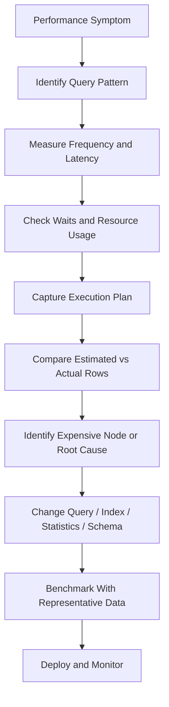
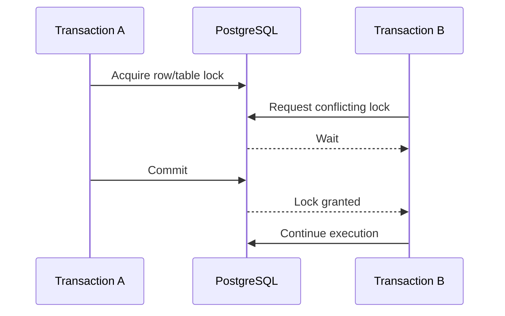

# 20- Identifying Slow Queries

## Overview

Identifying slow queries is the process of detecting SQL statements that consume excessive execution time, CPU, memory, I/O, or database capacity and then determining why they are expensive.

In production backend systems, query latency is only one part of the problem. A query that takes 500 ms may be acceptable when executed once per minute but problematic when executed thousands of times per second. Conversely, a query that takes several seconds but runs once per day may have little impact on system capacity.

Effective SQL performance analysis therefore considers:

```text
Query latency
+
Execution frequency
+
Rows processed
+
CPU
+
I/O
+
Memory
+
Concurrency
+
Lock contention
=
Database workload
```

The goal is not to make every query as fast as possible. The goal is to identify queries that materially affect application latency, database capacity, reliability, or cost.

## What Makes a Query Slow

A query can be slow because of:

- Large sequential scans.
- Poor index selection.
- Missing or ineffective indexes.
- Incorrect cardinality estimates.
- Expensive joins.
- Large sorts.
- Hash-table spills.
- Excessive aggregation.
- Lock waits.
- Disk I/O.
- Cache misses.
- Network transfer of unnecessary rows.
- Returning excessively wide result sets.
- N+1 query patterns.
- Poorly generated ORM queries.
- Data skew.
- Stale database statistics.
- High concurrency.
- Resource contention.

The first distinction to make is:

> **Is the query intrinsically expensive, or is it waiting for another resource?**

A query that reports 2 seconds of latency may have only 50 ms of execution work and 1.95 seconds of lock or resource waiting.

## Slow Query Investigation Flow

A production investigation should generally follow this path:



This prevents premature optimization based on a single slow request.

## Define a Slow Query

There is no universal threshold for a slow query.

A useful threshold depends on:

| Workload | Potentially important metric |
|---|---|
| User-facing API | p95/p99 database latency |
| High-throughput service | Total database time per second |
| Batch processing | Runtime and resource consumption |
| Analytics | CPU, I/O, memory, and execution duration |
| Transactional workload | Latency plus lock duration |
| Background jobs | Throughput and queue delay |

For a synchronous REST API, a query consistently consuming hundreds of milliseconds may deserve investigation.

For an analytical query running once per hour, several seconds may be perfectly acceptable.

## Latency Percentiles

Do not rely only on average query latency.

Consider:

```text
p50 = median
p95 = 95% of requests are faster
p99 = 99% of requests are faster
```

Example:

| Metric | Value |
|---|---:|
| p50 | 8 ms |
| p95 | 40 ms |
| p99 | 1,800 ms |

An average could hide the fact that a small percentage of requests are extremely slow.

For user-facing systems, tail latency is often more important than the average.

## Frequency Matters

Consider two queries:

```text
Query A:
2 seconds × 1 execution/hour

Query B:
20 ms × 500 executions/second
```

Query B can consume significantly more database capacity.

Approximate database execution work:

```text
20 ms × 500
= 10,000 ms
= ~10 seconds of cumulative query execution per second
```

Therefore prioritize queries using both:

```text
latency × frequency
```

and not latency alone.

## Identify Slow Queries at the Database Layer

PostgreSQL provides several mechanisms for identifying expensive SQL.

Common approaches include:

- `pg_stat_statements`.
- PostgreSQL logs.
- `EXPLAIN`.
- `EXPLAIN ANALYZE`.
- `EXPLAIN (ANALYZE, BUFFERS)`.
- Lock inspection.
- Active-session inspection.
- Application observability tools.

## pg_stat_statements

`pg_stat_statements` is one of the most useful PostgreSQL extensions for identifying query patterns that consume database resources.

It aggregates statistics for structurally similar SQL statements.

A typical query:

```sql
SELECT
    queryid,
    calls,
    total_exec_time,
    mean_exec_time,
    rows,
    shared_blks_hit,
    shared_blks_read,
    temp_blks_read,
    temp_blks_written,
    query
FROM pg_stat_statements
ORDER BY total_exec_time DESC
LIMIT 20;
```

This helps identify queries contributing the most cumulative execution time.

### Enable the Extension

The extension must be configured according to the PostgreSQL deployment environment.

For example:

```sql
CREATE EXTENSION IF NOT EXISTS pg_stat_statements;
```

Depending on PostgreSQL configuration, `pg_stat_statements` may also need to be included in `shared_preload_libraries` and the server restarted.

### Important Metrics

| Metric | Why it matters |
|---|---|
| `calls` | Execution frequency |
| `total_exec_time` | Cumulative execution cost |
| `mean_exec_time` | Average execution duration |
| `rows` | Rows returned/generated |
| `shared_blks_hit` | Buffer-cache activity |
| `shared_blks_read` | Physical/read I/O pressure |
| `temp_blks_read` | Temporary-file reads |
| `temp_blks_written` | Temporary-file writes |

The exact columns available depend on PostgreSQL version.

## Rank by Total Execution Time

To find queries consuming the most cumulative database execution time:

```sql
SELECT
    calls,
    total_exec_time,
    mean_exec_time,
    rows,
    query
FROM pg_stat_statements
ORDER BY total_exec_time DESC
LIMIT 20;
```

This answers:

> Which query patterns consume the most database execution time overall?

This is often more useful for capacity planning than finding the single slowest query.

## Rank by Mean Execution Time

To find queries with high average latency:

```sql
SELECT
    calls,
    total_exec_time,
    mean_exec_time,
    rows,
    query
FROM pg_stat_statements
WHERE calls >= 100
ORDER BY mean_exec_time DESC
LIMIT 20;
```

The minimum call threshold prevents a single unusual execution from dominating the ranking.

## Rank by Execution Frequency

A cheap query can still be expensive at very high frequency.

```sql
SELECT
    calls,
    mean_exec_time,
    total_exec_time,
    query
FROM pg_stat_statements
ORDER BY calls DESC
LIMIT 20;
```

High-frequency queries deserve attention because even small inefficiencies multiply at scale.

## Rank by I/O

For I/O-heavy workloads:

```sql
SELECT
    calls,
    shared_blks_read,
    temp_blks_read,
    temp_blks_written,
    total_exec_time,
    query
FROM pg_stat_statements
ORDER BY shared_blks_read DESC
LIMIT 20;
```

High block reads may indicate:

- Large scans.
- Poor locality.
- Insufficient cache residency.
- Ineffective indexes.
- Queries touching too much data.

High temporary block activity may indicate:

- Large sorts.
- Hash operations.
- Aggregations.
- Memory pressure.
- Poor cardinality estimates.

## PostgreSQL Logs

Database logs can reveal slow statements directly.

A PostgreSQL configuration can include a statement duration threshold such as:

```text
log_min_duration_statement = 500
```

This records statements taking at least 500 ms.

Use thresholds carefully.

Logging every statement in a high-throughput production system can create significant:

- I/O.
- Storage usage.
- Log-processing overhead.
- Observability cost.

A common strategy is to combine:

```text
pg_stat_statements
+
targeted slow-query logging
+
application tracing
```

rather than logging everything indefinitely.

## Application-Level Detection

The database is not the only place to identify slow queries.

Backend applications should measure database calls as part of request traces.

For example:

```text
HTTP request
    ↓
FastAPI / Django
    ↓
Database span
    ↓
SQL statement
    ↓
PostgreSQL
```

Useful application metrics include:

- Query duration.
- Number of SQL statements per request.
- Connection-pool wait time.
- Transaction duration.
- Endpoint latency.
- Query timeout count.
- Database error rate.

A request taking 2 seconds with 30 SQL statements should be investigated differently from one executing a single 2-second query.

## Detecting N+1 Queries

N+1 is a common application-level database performance problem.

Example:

```text
1 query to fetch 100 orders
+
100 queries to fetch customer information
=
101 queries
```

The individual queries may each be fast.

The overall request can still be slow because of:

- Network round trips.
- Connection usage.
- Query parsing/execution overhead.
- Database concurrency.
- Application serialization.

In Django, ORM relationships should be evaluated carefully using techniques such as:

```python
orders = (
    Order.objects
    .select_related("customer")
    .filter(status="pending")
)
```

or, for collections:

```python
orders = (
    Order.objects
    .prefetch_related("items")
    .filter(status="pending")
)
```

The correct choice depends on relationship type and query shape.

## Query Count vs Query Duration

Consider two API requests:

| Request | SQL count | Total DB time |
|---|---:|---:|
| A | 2 | 800 ms |
| B | 150 | 200 ms |

Request A has a slow database operation.

Request B may have an N+1 or inefficient query pattern that becomes problematic under load.

Both metrics matter:

```text
query count
+
database time
```

## Capturing an Execution Plan

Once a slow query pattern is identified, inspect its plan.

Start with:

```sql
EXPLAIN
SELECT
    o.id,
    o.total_amount
FROM orders AS o
WHERE o.customer_id = 42;
```

This shows the optimizer's chosen strategy without executing the query.

For actual runtime behavior:

```sql
EXPLAIN (ANALYZE, BUFFERS)
SELECT
    o.id,
    o.total_amount
FROM orders AS o
WHERE o.customer_id = 42;
```

`EXPLAIN ANALYZE` executes the statement.

For mutating statements such as:

```sql
UPDATE ...
DELETE ...
INSERT ...
```

do not treat it as a harmless dry run.

## What to Look For in the Plan

When investigating a slow query, inspect:

```text
1. Scan strategy
2. Estimated rows
3. Actual rows
4. Loops
5. Actual execution time
6. Buffer activity
7. Join strategy
8. Sort operations
9. Hash operations
10. Disk spills
11. Parallelism
12. Rows removed by filters
```

The objective is to determine where unnecessary work begins.

## Find the Expensive Node

Suppose a plan contains:

```text
Nested Loop
  actual time=0.10..2500.00

  -> Index Scan
     actual time=0.05..5.00

  -> Index Scan
     actual time=0.05..20.00
     loops=100000
```

The inner scan appears fast per execution.

But:

```text
20 ms × 100,000
```

can produce enormous aggregate work.

Always interpret:

```text
actual time × loops
```

in context.

## Compare Estimated and Actual Rows

Suppose:

```text
Index Scan
  rows=100
  actual rows=500000
```

The optimizer underestimated the result by:

```text
5,000×
```

This can cause the optimizer to select a plan inappropriate for the actual workload.

Investigate:

- Statistics freshness.
- Data distribution.
- Correlated predicates.
- Data skew.
- Missing extended statistics.
- Query predicates.

## Detecting Excessive Scanning

A plan such as:

```text
Seq Scan on orders
  Filter: status = 'pending'
  Rows Removed by Filter: 49,000,000
  rows=1,000,000
```

indicates that a very large number of rows were processed and discarded.

That does not automatically mean an index is required.

Evaluate:

- Table size.
- Predicate selectivity.
- Percentage of rows required.
- Physical locality.
- Query frequency.
- Whether the predicate is indexed appropriately.

## Detecting Expensive Sorting

Look for:

```text
Sort
  Sort Method: external merge
  Disk: 500000kB
```

This indicates that the sort used temporary disk storage.

Potential improvements include:

- Reduce rows before sorting.
- Return fewer columns.
- Add an index supporting the ordering.
- Improve filtering.
- Investigate cardinality estimates.
- Tune memory only when justified.

Increasing `work_mem` blindly can be dangerous because it applies per operation and potentially per concurrent session.

## Detecting Hash Spills

Hash operations may use multiple batches when the hash table cannot remain entirely in memory.

A plan may indicate batching behavior.

Investigate:

- Estimated vs actual input size.
- `work_mem`.
- Number of concurrent queries.
- Data volume.
- Hash join or aggregation strategy.

Do not simply increase `work_mem` globally.

A high value multiplied across many concurrent operations can create memory pressure.

## Detecting Lock Waits

Not every slow query has an expensive execution plan.

A query can spend most of its time waiting for another transaction.

Inspect active sessions:

```sql
SELECT
    pid,
    wait_event_type,
    wait_event,
    state,
    query_start,
    now() - query_start AS duration,
    query
FROM pg_stat_activity
WHERE state <> 'idle'
ORDER BY query_start;
```

If:

```text
wait_event_type = 'Lock'
```

the investigation should move toward transaction and locking behavior rather than indexing.

## Lock Contention Flow



A query can therefore appear slow even when its execution plan is efficient.

## Long Transactions

Long-running transactions can cause:

- Lock retention.
- Vacuum interference.
- Table and index bloat.
- Increased resource usage.
- Delayed cleanup.

Inspect transaction age and session state when investigating unusual database behavior.

In production systems, avoid holding transactions open while performing unrelated application work such as external HTTP requests.

## Query Timeout

Application-level database timeouts provide an important reliability boundary.

For PostgreSQL, a transaction or statement timeout can be configured depending on the workload.

For example:

```sql
SET statement_timeout = '5s';
```

A timeout should not be used to hide poor query performance.

Its purpose is to prevent pathological queries from consuming database capacity indefinitely.

## Production Monitoring

A production SQL monitoring strategy should cover several dimensions.

| Dimension | Example metric |
|---|---|
| Latency | p50/p95/p99 query duration |
| Frequency | Queries per second |
| CPU | Database CPU utilization |
| I/O | Read/write throughput and latency |
| Cache | Buffer hit behavior |
| Locks | Lock waits and blocked sessions |
| Connections | Active/idle/waiting connections |
| Temporary files | Temp reads/writes |
| Errors | Query failures/timeouts |
| Transactions | Transaction duration |
| Capacity | Storage and memory utilization |

Monitoring should identify both:

```text
slow individual queries
```

and:

```text
queries causing aggregate database load
```

## Query Fingerprinting

Production systems rarely execute exactly one literal query repeatedly.

For example:

```sql
SELECT * FROM orders WHERE customer_id = 10;
SELECT * FROM orders WHERE customer_id = 42;
SELECT * FROM orders WHERE customer_id = 91;
```

These represent the same query pattern.

Observability systems and PostgreSQL statistics can normalize or aggregate similar statements so engineers can reason about the query shape rather than individual parameter values.

This is important for identifying the highest-impact query patterns.

## Parameter Sensitivity and Data Skew

Different parameter values can produce very different workloads.

For example:

```text
customer_id = 10
→ 20 orders

customer_id = 999
→ 50,000,000 orders
```

A plan that works well for the first value may be inappropriate for the second.

This is particularly important for:

- Multi-tenant systems.
- Highly skewed datasets.
- Status columns.
- "Hot" customers or accounts.
- Time-series tables.

When investigating parameter-sensitive behavior, test representative parameter values rather than one convenient example.

## Query Optimization Priorities

A useful prioritization model is:

```text
Impact
=
Latency
×
Frequency
×
Resource Consumption
×
User / System Criticality
```

Prioritize:

1. High-frequency expensive queries.
2. Queries causing API tail latency.
3. Queries consuming significant CPU or I/O.
4. Queries causing lock contention.
5. Queries contributing to database saturation.
6. Queries with severe plan instability.

A single extremely slow query may still be important if it blocks critical transactions.

## Common Optimization Actions

Once the root cause is known, potential actions include:

| Root cause | Potential action |
|---|---|
| Missing index | Add an appropriate index |
| Poor composite index | Reconsider column order and included columns |
| Excessive rows | Improve filtering or query shape |
| N+1 | Use eager loading or batching |
| Bad cardinality estimate | Refresh/improve statistics |
| Large sort | Support ordering with an index or reduce input |
| Hash spill | Reduce input or tune memory carefully |
| Lock contention | Shorten transactions or change access patterns |
| Large historical table | Consider partitioning or archival |
| Repeated identical reads | Consider application/cache strategy |
| ORM-generated inefficient SQL | Inspect and rewrite ORM usage |
| Unbounded query | Add pagination or explicit limits |

Do not apply these actions mechanically. The execution plan and workload should determine the change.

## Pagination and Slow Queries

Offset pagination can become increasingly expensive:

```sql
SELECT
    id,
    created_at
FROM orders
ORDER BY created_at DESC
LIMIT 50
OFFSET 500000;
```

The database may need to process or traverse a large number of rows before returning the requested page.

Keyset pagination can be more scalable when the access pattern permits it:

```sql
SELECT
    id,
    created_at
FROM orders
WHERE created_at < $1
ORDER BY created_at DESC
LIMIT 50;
```

A suitable index can make this access pattern much more efficient.

## Avoiding `SELECT *`

Returning unnecessary columns increases:

- Data transferred from storage.
- Memory usage.
- Network traffic.
- Application deserialization cost.
- Potential index limitations.

Prefer:

```sql
SELECT
    id,
    status,
    total_amount,
    created_at
FROM orders
WHERE customer_id = $1;
```

instead of:

```sql
SELECT *
FROM orders
WHERE customer_id = $1;
```

This is especially important for wide tables and high-frequency APIs.

## Query Frequency and Caching

Caching can reduce database load, but it should not automatically be the first response to a slow query.

For example:

```text
API
 ↓
Redis
 ├── cache hit → response
 └── cache miss → PostgreSQL
```

Caching is appropriate when:

- Data is read frequently.
- Staleness is acceptable.
- Cache invalidation is manageable.
- The query is expensive or highly repetitive.

However, a poorly designed query may still need optimization even if caching currently hides its cost.

## Read Replicas

For read-heavy workloads, read replicas can reduce pressure on a primary database.

However:

```text
read replica
```

does not make an individual query intrinsically faster.

The query still needs an efficient execution plan.

Also consider:

- Replication lag.
- Read-after-write consistency.
- Routing complexity.
- Replica capacity.
- Failover behavior.

## Production Investigation Example

Suppose an API endpoint begins reporting:

```text
p99 latency = 3.2 seconds
```

Database metrics show increased query latency.

The investigation might proceed as:

```text
API p99 increases
        ↓
Trace identifies database span
        ↓
Query pattern identified
        ↓
pg_stat_statements shows high total_exec_time
        ↓
EXPLAIN (ANALYZE, BUFFERS)
        ↓
Large Nested Loop
        ↓
Estimated rows = 100
Actual rows = 2,000,000
        ↓
Cardinality estimation investigated
        ↓
Statistics / query predicates corrected
        ↓
New plan selected
        ↓
Latency and database load decrease
```

This is preferable to immediately adding an arbitrary index.

## Best Practices

### Measure Before Optimizing

Establish:

```text
baseline latency
baseline frequency
baseline resource consumption
baseline execution plan
```

Then compare after the change.

### Optimize Query Patterns, Not Individual Requests

Use normalized query statistics to identify recurring SQL shapes.

### Use Representative Parameters

Test:

- Typical values.
- Large tenants.
- Small tenants.
- Hot partitions.
- Edge cases.

### Inspect Actual Execution

When safe, use:

```sql
EXPLAIN (ANALYZE, BUFFERS)
```

rather than relying only on estimated plans.

### Investigate Resource Waits

Check whether time is spent executing or waiting.

### Avoid Global Configuration Changes as the First Fix

Changing:

```text
work_mem
shared_buffers
random_page_cost
parallel settings
```

can have broad consequences.

Fix query/schema/statistics problems first when appropriate.

### Validate Under Realistic Load

A query that is fast in isolation can still cause problems when executed concurrently thousands of times.

## Common Mistakes and Pitfalls

### Looking Only for the Slowest Query

A query taking 5 seconds once per hour may matter less than a 20 ms query executed 10,000 times per second.

### Optimizing Average Latency Only

Tail latency can dominate user experience.

Track p95 and p99.

### Assuming Slow Means CPU-Bound

Slow queries may be waiting on:

- Disk.
- Locks.
- Memory.
- Connection availability.
- Other database resources.

### Adding an Index Without Checking the Plan

An index may:

- Not be used.
- Be insufficiently selective.
- Increase write overhead.
- Increase storage.
- Increase maintenance cost.

### Ignoring Query Frequency

A small inefficiency becomes significant when multiplied by high traffic.

### Ignoring ORM Behavior

Clean-looking Django or SQLAlchemy code can generate inefficient SQL.

Always inspect the generated SQL for important paths.

### Running `EXPLAIN ANALYZE` on Production Writes

Remember:

```text
EXPLAIN
    ≠ execute

EXPLAIN ANALYZE
    = execute + measure
```

Use appropriate safety procedures for data-changing statements.

### Increasing `work_mem` Globally

`work_mem` can be consumed per operation and potentially by many concurrent sessions.

A large global setting can cause memory exhaustion.

### Using Cache as a Band-Aid

Caching may reduce symptoms while the underlying query continues to waste database resources.

### Ignoring Locks

A perfect execution plan cannot make a query fast if it is waiting several seconds for a lock.

## Interview Traps

| Question | Strong answer |
|---|---|
| What qualifies as a slow query? | It depends on workload and impact; consider latency, frequency, resource consumption, and criticality rather than one universal threshold. |
| Should you optimize the query with the highest latency? | Not necessarily. Prioritize by aggregate impact, frequency, resource usage, and user/system criticality. |
| Why is `pg_stat_statements` useful? | It aggregates execution statistics by query pattern, making high-impact SQL easier to identify. |
| Why is total execution time important? | A moderately expensive query executed very frequently can consume more database capacity than a rare slow query. |
| Why are p95 and p99 important? | They expose tail latency that averages can hide. |
| How do you investigate a slow PostgreSQL query? | Identify the query pattern, inspect workload and waits, capture an execution plan, compare estimates with actuals, identify the root cause, optimize, and validate under representative conditions. |
| What does `EXPLAIN ANALYZE` do? | It executes the statement and reports actual runtime statistics. |
| How do you distinguish execution time from lock waiting? | Inspect session wait events and lock state in addition to the execution plan. |
| Why can a fast query still be a production problem? | High execution frequency can make its aggregate CPU, I/O, or connection cost significant. |
| Is a sequential scan always a problem? | No. It can be optimal when a large fraction of a table is required or the table is small. |
| What does a large estimated-vs-actual row mismatch suggest? | Potential cardinality estimation problems caused by statistics, data distribution, correlations, skew, or query predicates. |
| Why can increasing `work_mem` be dangerous? | Memory can be consumed per operation and concurrently across sessions, so a large global value can cause memory pressure. |
| What is an N+1 query problem? | One query loads a collection and then additional queries execute per item, producing excessive database round trips. |
| Does adding an index always improve performance? | No. Indexes have read, write, storage, and maintenance costs and may not be useful for a particular access pattern. |
| How does query frequency affect prioritization? | High-frequency queries can have significant aggregate impact even when individual executions are fast. |
| Why should production-like data be used for testing? | Query plans depend on data volume, distribution, skew, statistics, and physical characteristics. |
| Why can a query be slow only for certain parameters? | Data distribution can vary significantly by parameter, causing different cardinalities and potentially different optimal plans. |
| Why is query count an important metric? | Excessive database round trips can create latency and resource overhead even when individual queries are inexpensive. |
| When should caching be considered? | When repeated reads justify avoiding database work and the application's consistency and invalidation requirements can be satisfied. |
| What is the difference between query optimization and database capacity planning? | Query optimization reduces unnecessary work per operation; capacity planning ensures the database has sufficient resources for the aggregate workload. |

## Key Takeaways

- **Identify slow queries using both latency and workload impact; frequency, CPU, I/O, locks, and concurrency matter as much as execution time.**
- **Use tools such as `pg_stat_statements`, PostgreSQL logs, application tracing, and `EXPLAIN (ANALYZE, BUFFERS)` to move from symptoms to evidence.**
- **Interpret execution plans together with estimated vs actual rows, loops, buffer activity, waits, joins, sorts, and memory behavior.**
- **Optimize the root cause rather than blindly adding indexes, increasing memory, caching everything, or changing global database settings.**
- **Validate improvements with representative data, realistic parameter distributions, concurrency, and production monitoring rather than relying only on isolated benchmarks.**