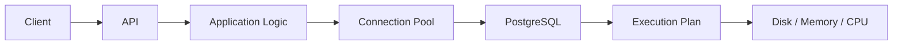

# 21- Finding Query Bottlenecks

## Overview

A query bottleneck is the part of a SQL operation or database workload that consumes a disproportionate amount of time or resources and limits overall performance.

The bottleneck may be an individual execution-plan node, such as a sequential scan, sort, join, or aggregation, but it can also exist outside the execution plan:

- Lock contention.
- Connection-pool exhaustion.
- Disk I/O.
- CPU saturation.
- Memory pressure.
- Network transfer.
- Excessive query concurrency.
- Application-level N+1 queries.
- Long-running transactions.

Finding the bottleneck is therefore different from simply finding a slow query.

A slow query tells you **what is slow**. Bottleneck analysis determines **why it is slow and where the work is being spent**.

For PostgreSQL-backed applications, the primary tools are:

```text
Application metrics
        ↓
Database workload statistics
        ↓
EXPLAIN / EXPLAIN ANALYZE
        ↓
Execution-plan nodes
        ↓
Rows / loops / buffers / waits
        ↓
Root cause
        ↓
Targeted optimization
```

## Why Bottleneck Identification Matters

Optimizing the wrong component can produce little or no improvement.

For example, suppose an API request takes 2 seconds:

```text
HTTP request                         2,000 ms
├── Application processing             50 ms
├── Database connection wait           20 ms
├── SQL execution                   1,900 ms
└── Serialization                      30 ms
```

The database execution is clearly the dominant component.

Now inspect the query:

```text
Query execution                    1,900 ms
├── Index scan                         20 ms
├── Nested Loop                     1,700 ms
├── Sort                               80 ms
└── Aggregate                         100 ms
```

The nested loop becomes the primary investigation target.

Without this decomposition, engineers may waste time optimizing application serialization, adding Redis caching, or changing unrelated indexes.

## Bottleneck Categories

| Bottleneck | Typical symptom | Investigation |
|---|---|---|
| CPU | High database CPU | Execution plan, expensive expressions, joins, aggregation |
| I/O | High reads / latency | `BUFFERS`, storage metrics, scans |
| Memory | Spills or memory pressure | Sort/hash nodes, `work_mem`, system memory |
| Locks | Query waits | `pg_stat_activity`, lock inspection |
| Connections | Pool exhaustion | Application and PostgreSQL connection metrics |
| Cardinality | Bad plan choices | Estimated vs actual rows |
| Join | Excessive loops/work | Join nodes and row counts |
| Sort | High sort cost | Sort method, input size, ordering |
| Aggregation | Large intermediate sets | Aggregate node and input cardinality |
| Network | Large result transfer | Result-set size, selected columns |
| Application | Many SQL calls | Tracing, ORM query count |
| Concurrency | Latency rises under load | Load testing and database metrics |

## A Practical Bottleneck Investigation Process

A reliable investigation follows a sequence:

1. Establish the performance symptom.
2. Identify the affected endpoint or workload.
3. Identify the SQL query pattern.
4. Measure frequency and cumulative impact.
5. Determine whether time is execution or waiting.
6. Capture the execution plan.
7. Find the most expensive plan node.
8. Compare estimated and actual cardinalities.
9. Inspect buffers, memory, and I/O.
10. Apply one targeted change.
11. Re-measure under representative conditions.

The important principle is:

> **Do not optimize until you can identify where the workload is actually spending its resources.**

## Start With the Application

Database bottlenecks often originate from application behavior.

A useful request trace might look like:



For each request, measure:

- Total request latency.
- Database latency.
- Number of SQL statements.
- Connection-pool wait time.
- Transaction duration.
- Rows returned.
- External service latency.

This distinguishes database execution problems from application/database interaction problems.

## Query Count as a Bottleneck

A request can be slow because it executes too many queries rather than because one query is inefficient.

Example:

```text
GET /orders

1 query → load orders
100 queries → load customer information
200 queries → load order items

Total = 301 queries
```

This is a classic N+1 or excessive-round-trip problem.

Even if every query takes only 2 ms:

```text
301 × 2 ms = 602 ms
```

The actual overhead can be higher because of connection, parsing, network, scheduling, and application processing costs.

In Django, inspect ORM-generated SQL and use relationship-loading strategies such as `select_related()` and `prefetch_related()` where appropriate.

## Establish the Baseline

Before changing anything, record:

```text
Query:
Execution frequency:
p50:
p95:
p99:
Mean execution time:
Total execution time:
Rows returned:
Buffers read:
Buffers hit:
Temporary blocks:
Lock waits:
Database CPU:
```

A baseline allows you to determine whether an optimization actually improved the workload.

Without a baseline, engineers often confuse:

```text
"the query looks better"
```

with:

```text
"the production workload is better"
```

## Use `pg_stat_statements`

PostgreSQL's `pg_stat_statements` provides aggregated statistics for SQL query patterns.

A useful starting query is:

```sql
SELECT
    calls,
    total_exec_time,
    mean_exec_time,
    rows,
    shared_blks_hit,
    shared_blks_read,
    temp_blks_read,
    temp_blks_written,
    query
FROM pg_stat_statements
ORDER BY total_exec_time DESC
LIMIT 20;
```

This helps identify queries that consume significant aggregate database time.

### Why Aggregate Cost Matters

Consider:

| Query | Mean time | Calls | Approx. total execution |
|---|---:|---:|---:|
| A | 2,000 ms | 2 | 4 s |
| B | 20 ms | 100,000 | 2,000 s |
| C | 500 ms | 100 | 50 s |

Query B is individually fast but has a much larger aggregate impact.

For capacity and scalability, cumulative work is often more important than the slowest single execution.

## Identify Whether the Query Is Waiting

Before analyzing the execution plan, determine whether the query is actually executing.

Inspect active sessions:

```sql
SELECT
    pid,
    state,
    wait_event_type,
    wait_event,
    query_start,
    now() - query_start AS duration,
    query
FROM pg_stat_activity
WHERE state <> 'idle'
ORDER BY query_start;
```

If a query is waiting on a lock, optimizing its execution plan may not address the immediate problem.

Conceptually:

```text
Query latency
├── Queue / connection wait
├── Lock wait
├── Execution
│   ├── CPU
│   ├── I/O
│   └── Memory
└── Result transfer
```

The first task is to identify which component dominates.

## Execution Plan Analysis

Use `EXPLAIN` to inspect the optimizer's chosen plan:

```sql
EXPLAIN
SELECT
    o.id,
    o.total_amount
FROM orders AS o
WHERE o.customer_id = 42;
```

Use `EXPLAIN ANALYZE` when actual runtime behavior is required:

```sql
EXPLAIN (ANALYZE, BUFFERS)
SELECT
    o.id,
    o.total_amount
FROM orders AS o
WHERE o.customer_id = 42;
```

Remember:

```text
EXPLAIN
→ estimates the execution plan

EXPLAIN ANALYZE
→ executes the query and reports actual execution statistics
```

`EXPLAIN ANALYZE` therefore has side effects for data-modifying statements.

## Finding the Expensive Plan Node

Execution plans form a tree.

For example:

```text
Hash Join
├── Seq Scan on customers
└── Hash
    └── Seq Scan on orders
```

The goal is not to assume the top node is the bottleneck.

A parent node's time includes work performed by its children.

Instead, inspect:

- Actual time.
- Loops.
- Actual rows.
- Buffers.
- Rows removed by filters.
- Sort/hash behavior.

## Actual Time and Loops

Suppose:

```text
Index Scan
actual time=0.020..0.500
loops=100000
```

A node that appears inexpensive per loop can become extremely expensive when repeated.

Conceptually:

```text
Per-loop work × loops
```

is often more informative than looking at per-loop latency alone.

This is especially important with nested loop joins.

## Example: Nested Loop Bottleneck

Consider:

```text
Nested Loop
├── Index Scan on customers
│   actual rows = 10,000
│
└── Index Scan on orders
    actual rows = 50
    loops = 10,000
```

The inner index scan may be efficient for one customer.

But it executes 10,000 times.

If each iteration performs meaningful work, the aggregate cost can dominate the query.

Potential root causes include:

- Too many outer rows.
- Missing or inefficient filtering.
- Poor join order.
- Incorrect cardinality estimates.
- An unsuitable join strategy.

## Compare Estimated and Actual Rows

One of the most important bottleneck signals is a large difference between:

```text
estimated rows
```

and:

```text
actual rows
```

Example:

```text
Nested Loop
estimated rows = 100
actual rows    = 2,000,000
```

A 20,000× difference can cause the optimizer to choose an inappropriate plan.

Investigate:

- Stale statistics.
- Data skew.
- Correlated columns.
- Missing extended statistics.
- Highly selective or non-selective predicates.
- Parameter-sensitive workload behavior.

## Sequential Scans

A sequential scan is not automatically a bottleneck.

For example:

```text
Seq Scan on orders
rows = 8,000,000
```

may be appropriate if the query needs a large percentage of the table.

The correct question is:

> **How much unnecessary work is the scan performing relative to the required result?**

Look for:

```text
Rows Removed by Filter
```

Example:

```text
Seq Scan on orders
actual rows = 100,000
Rows Removed by Filter = 49,900,000
```

This suggests substantial filtering work.

However, an index is useful only if it provides a better access path for the actual workload.

## Index Scan Bottlenecks

An index scan can also become a bottleneck.

For example:

```text
Index Scan
actual rows = 5,000,000
```

An index does not guarantee fast execution.

If a query retrieves a large fraction of a table, repeatedly traversing the index and fetching table pages can be more expensive than another access strategy.

Evaluate:

- Selectivity.
- Table size.
- Data locality.
- Required columns.
- Cache behavior.
- Number of heap fetches.
- Query frequency.

## Sort Bottlenecks

Sorting can become expensive when a query must order a large intermediate result.

Example:

```text
Sort
actual rows = 5,000,000
```

Check whether the sort:

- Operates on too many rows.
- Could be avoided through an index.
- Occurs before filtering.
- Spills to disk.

A useful plan detail is:

```text
Sort Method: external merge
Disk: ...
```

Disk-based sorting indicates that the operation exceeded available memory for the sort.

Potential optimizations include:

- Filtering earlier.
- Returning fewer rows.
- Supporting ordering with an appropriate index.
- Reducing selected columns.
- Carefully tuning `work_mem`.

## Hash Join and Hash Aggregation Bottlenecks

Hash-based operations require memory for their hash structures.

Large inputs can cause:

- Large memory allocations.
- Multiple hash batches.
- Temporary I/O.
- Increased CPU.

Inspect:

```text
Hash
Hash Join
HashAggregate
Batches
Memory Usage
Disk Usage
```

A hash operation should be evaluated together with:

- Input cardinality.
- Estimated cardinality.
- `work_mem`.
- Concurrent workload.

Do not increase `work_mem` globally simply because one hash operation is expensive.

## Aggregation Bottlenecks

Aggregation can become expensive when a query processes a large number of rows before reducing them.

Example:

```sql
SELECT
    customer_id,
    COUNT(*)
FROM orders
GROUP BY customer_id;
```

If the query scans tens of millions of rows to produce a small result, the aggregation itself may not be the root cause.

Investigate the complete pipeline:

```text
Scan
 ↓
Filter
 ↓
Join
 ↓
Aggregate
 ↓
Sort
```

The bottleneck may be upstream of the aggregate.

## Buffer Analysis

`EXPLAIN (ANALYZE, BUFFERS)` helps determine whether the query is performing significant buffer activity.

Example:

```sql
EXPLAIN (ANALYZE, BUFFERS)
SELECT
    id,
    total_amount
FROM orders
WHERE customer_id = 42;
```

Look at:

- Shared hits.
- Shared reads.
- Local buffers.
- Temporary reads.
- Temporary writes.

Conceptually:

```text
shared hit
→ page was already available in PostgreSQL's shared buffers

shared read
→ page had to be read into the buffer cache
```

High reads can indicate substantial storage access, although the meaning depends on workload and cache state.

## CPU Bottlenecks

A CPU-bound query may perform large amounts of:

- Joins.
- Aggregation.
- Sorting.
- Expression evaluation.
- Function calls.
- Row processing.

Database CPU metrics should be correlated with execution plans.

High CPU plus high query execution time suggests computational work.

High latency with low CPU may instead point toward:

- I/O.
- Locks.
- Connection waits.
- External contention.

## I/O Bottlenecks

I/O-heavy queries often show:

```text
High shared_blks_read
+
High storage latency
+
Large scans
```

The solution may involve:

- Better filtering.
- Better indexes.
- Reducing unnecessary rows.
- Partition pruning.
- Query restructuring.
- Storage improvements.

Do not automatically assume that faster storage is the correct solution. Reducing unnecessary I/O is usually preferable to paying for more I/O capacity.

## Lock Bottlenecks

A query can have an efficient execution plan and still be slow because another transaction holds a conflicting lock.

Investigate:

```sql
SELECT
    pid,
    wait_event_type,
    wait_event,
    state,
    query_start,
    query
FROM pg_stat_activity
WHERE wait_event_type IS NOT NULL;
```

For deeper lock analysis, inspect PostgreSQL lock catalogs and identify blocking relationships.

The important distinction is:

```text
Execution bottleneck
≠
Lock bottleneck
```

They require different fixes.

## Connection Pool Bottlenecks

The database can appear slow because application requests cannot obtain a connection quickly enough.

The flow may be:

```text
API request
    ↓
Connection pool
    ↓
No available connection
    ↓
Wait
    ↓
PostgreSQL
```

Monitor:

- Pool size.
- Pool utilization.
- Connection wait time.
- Active database sessions.
- Idle sessions.
- Transaction duration.

Increasing the pool size without understanding database capacity can make the problem worse by increasing concurrency against PostgreSQL.

## Transaction Bottlenecks

Long transactions can cause:

- Lock contention.
- Vacuum delays.
- Increased table/index bloat.
- Greater rollback cost.
- Reduced concurrency.

A common production mistake is holding a transaction open while performing non-database work:

```text
BEGIN
  ↓
Database operation
  ↓
External HTTP request
  ↓
Application processing
  ↓
Another database operation
  ↓
COMMIT
```

Prefer keeping transactions as short as practical.

## Network Bottlenecks

Sometimes PostgreSQL executes the query efficiently, but the application receives too much data.

For example:

```sql
SELECT *
FROM orders;
```

Returning millions of rows creates:

- Database work.
- Network traffic.
- Application memory usage.
- Serialization overhead.
- Increased request latency.

Reduce result-set size through:

- Explicit columns.
- Filtering.
- Pagination.
- Aggregation.
- Appropriate limits.

## Query Bottleneck vs System Bottleneck

A query can be locally efficient but globally problematic.

Example:

```text
Query latency = 5 ms
Query frequency = 20,000/sec
```

Even a 5 ms query can generate significant database CPU and I/O pressure.

Therefore investigate both:

```text
Per-query efficiency
```

and:

```text
Aggregate workload
```

## Bottleneck Classification Matrix

| Observation | Likely investigation |
|---|---|
| High CPU + long execution | Expensive plan nodes |
| High reads + long execution | Scans / I/O |
| High temp writes | Sort/hash/aggregation spill |
| Large row mismatch | Statistics/cardinality |
| High loops | Join strategy / repeated work |
| Lock wait | Blocking transactions |
| Pool wait | Connection management |
| High query count | ORM/N+1/application behavior |
| Large result set | Projection/pagination |
| Only certain parameters are slow | Data skew / parameter sensitivity |
| Fast locally but slow under load | Concurrency/resource saturation |

## Bottleneck Prioritization

When several bottlenecks exist, prioritize based on impact.

A useful mental model is:

```text
Priority
≈
Latency Impact
×
Execution Frequency
×
Resource Consumption
×
Business Criticality
```

For example:

```text
Query A
500 ms × 10 calls/sec

Query B
20 ms × 10,000 calls/sec
```

Query B may be the larger infrastructure problem even though Query A has much higher individual latency.

## Practical Investigation Example

Suppose an order API has:

```text
p95 = 400 ms
p99 = 2.8 s
```

Tracing shows:

```text
Database span = 2.5 s
```

`pg_stat_statements` identifies the query as one of the highest consumers of total execution time.

The next step is:

```sql
EXPLAIN (ANALYZE, BUFFERS)
SELECT
    o.id,
    o.created_at,
    o.total_amount
FROM orders AS o
JOIN customers AS c
    ON c.id = o.customer_id
WHERE c.account_status = 'active'
ORDER BY o.created_at DESC
LIMIT 100;
```

Suppose the plan shows:

```text
Nested Loop
  estimated rows = 100
  actual rows = 800000

Sort
  actual rows = 800000

Index Scan on orders
  loops = 800000
```

The investigation now has several concrete signals:

1. Cardinality is badly underestimated.
2. The nested loop performs excessive repeated work.
3. A large intermediate result is sorted.
4. The final `LIMIT 100` does not prevent the expensive upstream work.

The solution should target those causes rather than blindly adding an index.

## Validate the Fix

After making a change, compare:

```text
Before
├── execution time
├── rows
├── loops
├── buffers
├── CPU
└── I/O

After
├── execution time
├── rows
├── loops
├── buffers
├── CPU
└── I/O
```

A successful optimization should ideally reduce the underlying work, not merely move the cost somewhere else.

## Production Validation

Benchmarking should use:

- Production-like data volume.
- Representative parameter values.
- Realistic data distribution.
- Realistic concurrency.
- Representative query frequency.

A query that executes in 10 ms against:

```text
100,000 rows
```

may behave very differently against:

```text
500,000,000 rows
```

Likewise, an optimization that improves one tenant may degrade another tenant with substantially different data volume.

## Query Plan Stability

A query does not necessarily have one permanently optimal plan.

Plans can change because of:

- Statistics changes.
- Data growth.
- Different parameter values.
- Configuration changes.
- PostgreSQL version changes.
- Index changes.
- Table distribution changes.

Production systems should therefore monitor important query patterns over time rather than treating a single execution plan as permanent truth.

## Common Mistakes and Pitfalls

### Optimizing the Highest `actual time` Node Without Understanding the Tree

Parent nodes include child work.

Always inspect the complete plan hierarchy.

### Ignoring `loops`

A cheap operation executed hundreds of thousands of times can dominate total runtime.

### Assuming Every Sequential Scan Is Bad

Sequential scans are often optimal for large portions of a table or small tables.

### Adding an Index Before Inspecting the Workload

Indexes have:

- Storage cost.
- Write overhead.
- Maintenance cost.
- Cache impact.

The query's access pattern should justify the index.

### Ignoring Cardinality Estimates

Large estimate errors can explain why the optimizer selected a poor join or aggregation strategy.

### Increasing `work_mem` Globally

Memory is consumed per operation and can multiply across concurrent sessions.

Tune carefully and measure.

### Ignoring Locks

An efficient plan cannot eliminate time spent waiting for another transaction.

### Increasing Connection Pool Size Blindly

More connections can increase database contention and CPU pressure.

Connection pools should be sized based on workload and database capacity.

### Looking Only at Average Latency

p95 and p99 often reveal production bottlenecks hidden by averages.

### Optimizing in Isolation

A query that is fast in a single-session benchmark may become expensive under production concurrency.

### Treating Caching as the First Fix

Caching can reduce query frequency but does not necessarily correct inefficient database work.

### Changing Multiple Variables at Once

If you simultaneously change:

```text
query
+
index
+
work_mem
+
connection pool
```

it becomes difficult to determine which change actually fixed or caused the behavior.

Prefer controlled changes.

## Operational Best Practices

- Keep `pg_stat_statements` available for workload analysis.
- Monitor database CPU, I/O, connections, and lock waits.
- Track query latency percentiles.
- Track cumulative query execution time.
- Monitor query frequency.
- Capture execution plans for important query patterns.
- Compare estimated and actual rows.
- Investigate buffer and temporary-file activity.
- Monitor application connection-pool wait time.
- Keep transactions short.
- Test with representative data.
- Validate performance under realistic concurrency.
- Treat indexes and configuration changes as workload-dependent decisions.
- Revisit important queries as data volume and distribution change.

## Security and Reliability Considerations

Performance debugging should not weaken production safety.

### Avoid Sensitive Data in Logs

SQL logs and tracing systems may contain:

- User identifiers.
- Email addresses.
- Search terms.
- Business data.
- Personally identifiable information.

Use parameterized queries and configure observability systems to avoid unnecessarily exposing sensitive parameter values.

### Protect Production Writes

Remember that:

```sql
EXPLAIN ANALYZE
```

executes the statement.

For write operations, use appropriate safeguards and test environments where possible.

### Use Query Timeouts

Timeouts can prevent pathological queries from consuming resources indefinitely.

For example:

```sql
SET statement_timeout = '5s';
```

Application-level and database-level timeouts should be designed consistently with the service's latency objectives.

## Senior-Level Mental Model

When diagnosing a query bottleneck, reason across multiple layers:

```text
Application
    ↓
Endpoint latency
    ↓
Query frequency
    ↓
Connection pool
    ↓
Transaction / lock state
    ↓
SQL statement
    ↓
Execution plan
    ↓
Rows and loops
    ↓
CPU / memory / I/O
    ↓
Storage and system capacity
```

The strongest diagnosis connects these layers.

For example:

> The endpoint's p99 increased because a high-frequency query began choosing a nested-loop plan after cardinality estimates became inaccurate. The resulting repeated index scans increased CPU and buffer reads, saturating database capacity under concurrent traffic.

That is a bottleneck diagnosis.

By contrast:

> The query is slow, so we added an index.

is an optimization guess.

## Interview Questions

| Question | Strong answer |
|---|---|
| What is a query bottleneck? | A part of query execution or database interaction that disproportionately consumes time or resources and limits overall performance. |
| How do you find a bottleneck? | Measure the workload, inspect waits, capture the execution plan, analyze expensive nodes, compare estimated vs actual rows, inspect buffers/resources, and validate the root cause. |
| Why are loops important in an execution plan? | A node that is inexpensive per execution can become expensive when executed many times. |
| Is the node with the highest time always the root cause? | No. Parent nodes include child work, and the actual cause may be an upstream scan, cardinality error, join strategy, or resource wait. |
| How do you distinguish CPU and I/O bottlenecks? | Correlate execution-plan behavior with CPU and buffer/storage metrics. High CPU suggests computation; high reads/storage latency suggests I/O, although workloads can involve both. |
| Can an index scan be a bottleneck? | Yes. Retrieving a large fraction of a table through an index can generate substantial random access and heap work. |
| Is a sequential scan always bad? | No. It can be optimal when a large portion of a table is required or the table is small. |
| What does a large estimated-vs-actual row mismatch indicate? | Cardinality estimation problems that can lead to poor join, scan, or aggregation choices. |
| Why should you inspect locks? | Query latency can be dominated by waiting rather than execution, requiring transaction or concurrency fixes instead of query-plan changes. |
| Why can increasing the connection pool make performance worse? | It can increase concurrent database work, CPU pressure, lock contention, and memory usage. |
| How can `pg_stat_statements` help? | It identifies query patterns by execution frequency and cumulative resource usage, helping prioritize the highest-impact workload. |
| Why are p95 and p99 important? | They reveal tail latency that averages can hide. |
| Why can a 5 ms query be a bottleneck? | At sufficiently high frequency, its aggregate CPU, I/O, and connection cost can become substantial. |
| What does `EXPLAIN ANALYZE` do? | It executes the statement and reports actual execution statistics, so it must be used carefully with writes. |
| What does `EXPLAIN (ANALYZE, BUFFERS)` add? | It combines actual execution measurements with buffer activity, helping distinguish and quantify database work and I/O behavior. |
| How should you optimize a query with a large sort? | Determine why so many rows reach the sort, then consider earlier filtering, an appropriate ordering index, reduced result size, or carefully evaluated memory changes. |
| Why should you avoid changing multiple performance variables simultaneously? | It makes causality difficult to establish and can hide regressions. |
| How do you validate a query optimization? | Compare execution time, rows, loops, buffers, CPU/I/O, and production workload behavior before and after the change. |
| Why can a query become slower after data growth? | Statistics, cardinality, selectivity, cache behavior, and the relative cost of different execution strategies can change as data grows. |
| What separates a senior bottleneck analysis from a basic optimization? | A senior analysis connects query behavior to workload frequency, concurrency, resource consumption, application latency, and database capacity before selecting a targeted fix. |

## Key Takeaways

- **A bottleneck is the resource or operation limiting overall performance; finding a slow query is only the starting point.**
- **Use execution plans, estimated-vs-actual rows, loops, buffers, waits, and workload statistics to identify where the database is actually spending resources.**
- **Always distinguish execution work from lock waits, connection waits, I/O, CPU, memory, and application-level query overhead.**
- **Prioritize bottlenecks by aggregate impact: latency, frequency, resource consumption, concurrency, and business criticality all matter.**
- **Validate optimizations with representative data and realistic concurrency, and change one major variable at a time so the result is measurable and explainable.**