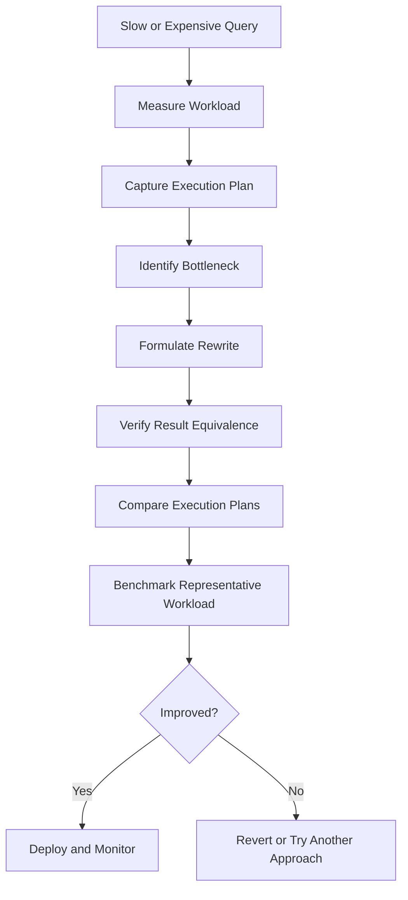

# 22- Query Rewriting

## Overview

Query rewriting is the process of changing the SQL expression of a query to reduce execution cost while preserving its intended result.

The objective is not to make SQL shorter or more elegant. The objective is to reduce unnecessary work by giving the database optimizer a better representation of the requested operation or by allowing the query to exploit a more efficient access path.

Common rewrites include:

- Replacing unnecessary subqueries with joins.
- Replacing correlated subqueries with joins or pre-aggregation.
- Replacing `OR` predicates with `UNION ALL` when appropriate.
- Filtering rows earlier.
- Removing unnecessary columns.
- Rewriting predicates so indexes can be used.
- Replacing repeated aggregation with pre-aggregation.
- Rewriting pagination queries.
- Eliminating unnecessary `DISTINCT`.
- Replacing application-side filtering with database-side filtering.
- Rewriting ORM-generated SQL that performs excessive work.

Query rewriting is most useful after identifying a real bottleneck. A rewrite should be validated with `EXPLAIN (ANALYZE, BUFFERS)` and representative workload measurements.

## Why Query Rewriting Matters

A database optimizer can choose among many execution strategies, but it can only optimize the SQL expression and information available to it.

Two queries can return the same logical result while producing very different execution plans:

```text
SQL representation A
        ↓
Large intermediate result
        ↓
Expensive join
        ↓
Sort
        ↓
Filter

SQL representation B
        ↓
Early filtering
        ↓
Smaller join
        ↓
Targeted aggregation
        ↓
Result
```

The second representation may require substantially less CPU, memory, and I/O.

However, modern optimizers already perform many transformations automatically. Query rewriting should therefore focus on changes that materially alter the optimizer's available choices or reduce unnecessary work.

## Query Rewriting Workflow

A production workflow should look like:



Do not start by rewriting SQL purely because another form looks more sophisticated.

The correct sequence is:

1. Measure the existing query.
2. Understand its execution plan.
3. Identify unnecessary work.
4. Rewrite the query.
5. Verify semantic equivalence.
6. Compare plans and runtime.
7. Test under realistic concurrency.
8. Deploy and monitor.

## Baseline Before Rewriting

Record the existing behavior before changing the SQL:

```text
Execution time
p50 / p95 / p99 latency
Calls per second
Rows returned
Rows processed
Shared buffer hits
Shared buffer reads
Temporary I/O
CPU utilization
Lock waits
Planning time
Execution time
```

For PostgreSQL, start with:

```sql
EXPLAIN (ANALYZE, BUFFERS)
SELECT
    id,
    customer_id,
    total_amount
FROM orders
WHERE customer_id = 42;
```

For frequently executed workloads, aggregate statistics from `pg_stat_statements` are also valuable.

## Preserve Semantics First

A rewrite is only an optimization if it preserves the intended behavior.

Pay particular attention to:

- `NULL` semantics.
- Duplicate rows.
- Outer-join behavior.
- Ordering guarantees.
- Aggregation semantics.
- Empty-result behavior.
- Correlated predicates.
- `DISTINCT`.
- `LIMIT` and `OFFSET`.
- Time-zone behavior.
- Type conversions.

For example, these queries are not necessarily equivalent:

```sql
SELECT customer_id
FROM orders
WHERE status = 'paid';
```

and:

```sql
SELECT DISTINCT customer_id
FROM orders
WHERE status = 'paid';
```

The second removes duplicates and therefore performs a different operation.

## Rewrite Predicates to Preserve Index Usage

One of the most common rewrites is removing expressions that prevent efficient use of an index.

Consider:

```sql
SELECT id
FROM users
WHERE LOWER(email) = 'alice@example.com';
```

A normal index on `email` may not support this expression efficiently.

Depending on the database and workload, an expression index can be appropriate:

```sql
CREATE INDEX idx_users_lower_email
ON users (LOWER(email));
```

Alternatively, if application semantics allow normalized storage, store normalized values and query directly:

```sql
SELECT id
FROM users
WHERE email_normalized = 'alice@example.com';
```

The important distinction is that query rewriting and indexing often work together.

## Avoid Applying Functions to Indexed Columns When Unnecessary

Consider:

```sql
SELECT *
FROM orders
WHERE DATE(created_at) = DATE '2026-09-01';
```

A more index-friendly range predicate is:

```sql
SELECT *
FROM orders
WHERE created_at >= TIMESTAMP '2026-09-01 00:00:00'
  AND created_at < TIMESTAMP '2026-09-02 00:00:00';
```

This allows a normal index on `created_at` to support a range scan more naturally.

It also avoids applying a function to every candidate row.

### Production Consideration

Time boundaries should be generated using the application's intended timezone semantics. Do not casually replace timezone-aware timestamps with hard-coded UTC or local-time boundaries without understanding the business requirement.

## Avoid Implicit Type Conversions

Comparing incompatible types can introduce casts or prevent the expected access path.

For example, if:

```text
user_id = BIGINT
```

the application should bind the parameter using the appropriate numeric type rather than converting the database column unnecessarily.

Prefer:

```sql
SELECT *
FROM users
WHERE id = $1;
```

with a correctly typed parameter rather than constructing SQL containing arbitrary string conversions.

Parameterized queries also protect against SQL injection.

## Replace Correlated Subqueries When They Repeat Work

Consider:

```sql
SELECT
    c.id,
    (
        SELECT COUNT(*)
        FROM orders AS o
        WHERE o.customer_id = c.id
    ) AS order_count
FROM customers AS c;
```

This may cause repeated work for many customer rows.

A pre-aggregated join can make the computation more explicit:

```sql
SELECT
    c.id,
    COALESCE(o.order_count, 0) AS order_count
FROM customers AS c
LEFT JOIN (
    SELECT
        customer_id,
        COUNT(*) AS order_count
    FROM orders
    GROUP BY customer_id
) AS o
    ON o.customer_id = c.id;
```

The actual performance depends on data distribution and the optimizer. Modern PostgreSQL can optimize some correlated subqueries effectively, so always compare execution plans rather than assuming the join is faster.

## Use `EXISTS` for Existence Checks

If the application only needs to know whether a related row exists, avoid retrieving or counting all matching rows.

Instead of:

```sql
SELECT
    c.id
FROM customers AS c
JOIN orders AS o
    ON o.customer_id = c.id
GROUP BY c.id
HAVING COUNT(*) > 0;
```

use:

```sql
SELECT
    c.id
FROM customers AS c
WHERE EXISTS (
    SELECT 1
    FROM orders AS o
    WHERE o.customer_id = c.id
);
```

`EXISTS` expresses the actual requirement: determine whether at least one matching row exists.

The database can often stop searching once the existence condition is satisfied.

## `COUNT(*)` vs `EXISTS`

Do not use `COUNT(*)` when the application only needs a boolean.

Less direct:

```sql
SELECT COUNT(*) > 0
FROM orders
WHERE customer_id = 42;
```

More directly expressed:

```sql
SELECT EXISTS (
    SELECT 1
    FROM orders
    WHERE customer_id = 42
);
```

This can reduce work when a matching row is found early.

## Replace `IN` With `EXISTS` Carefully

`IN` and `EXISTS` can often represent related logic:

```sql
SELECT *
FROM customers
WHERE id IN (
    SELECT customer_id
    FROM orders
    WHERE status = 'paid'
);
```

An alternative is:

```sql
SELECT c.*
FROM customers AS c
WHERE EXISTS (
    SELECT 1
    FROM orders AS o
    WHERE o.customer_id = c.id
      AND o.status = 'paid'
);
```

Neither form should be assumed to be universally faster.

Modern optimizers can transform these expressions into similar semi-join strategies.

Choose based on:

- Semantics.
- Readability.
- Data distribution.
- Execution plan.
- Actual workload.

## `NOT IN` and `NULL` Semantics

Be particularly careful when rewriting `NOT IN` to `NOT EXISTS`.

For example:

```sql
WHERE customer_id NOT IN (
    SELECT customer_id
    FROM orders
)
```

has `NULL` semantics that can differ from:

```sql
WHERE NOT EXISTS (
    SELECT 1
    FROM orders AS o
    WHERE o.customer_id = c.id
)
```

`NOT EXISTS` is often safer when expressing anti-join semantics, but the rewrite must account for the original query's intended behavior.

## Replace `OR` With `UNION ALL` When It Helps

A predicate such as:

```sql
SELECT *
FROM orders
WHERE customer_id = 42
   OR status = 'pending';
```

may be difficult to optimize efficiently depending on available indexes and selectivity.

Sometimes separate branches can produce better access paths:

```sql
SELECT *
FROM orders
WHERE customer_id = 42

UNION ALL

SELECT *
FROM orders
WHERE status = 'pending'
  AND customer_id <> 42;
```

The additional predicate prevents duplicate rows.

This rewrite is not automatically better. It can also increase work, especially when both predicates match many rows.

Use it only when the execution plan demonstrates a meaningful benefit.

## `UNION` vs `UNION ALL`

`UNION` removes duplicates:

```sql
SELECT id FROM active_users
UNION
SELECT id FROM premium_users;
```

`UNION ALL` preserves duplicates:

```sql
SELECT id FROM active_users
UNION ALL
SELECT id FROM premium_users;
```

`UNION` may require sorting or hashing to remove duplicates.

If duplicate removal is not required by the business semantics, `UNION ALL` avoids that work.

## Filter Earlier

Reducing intermediate result sets is one of the most valuable optimization principles.

Less efficient conceptual flow:

```text
orders
  ↓
join millions of rows
  ↓
filter customer/status
  ↓
aggregate
```

Prefer, when semantically valid:

```text
orders
  ↓
filter
  ↓
smaller input
  ↓
join
  ↓
aggregate
```

Example:

```sql
SELECT
    c.id,
    COUNT(o.id)
FROM customers AS c
JOIN orders AS o
    ON o.customer_id = c.id
WHERE o.status = 'paid'
GROUP BY c.id;
```

The optimizer may already push predicates below joins when safe. The goal is not to manually force predicate movement but to write clear relational logic and verify the resulting plan.

## Reduce Columns Early

Avoid:

```sql
SELECT *
FROM orders;
```

when the application only needs:

```sql
SELECT
    id,
    created_at,
    total_amount
FROM orders;
```

Reducing projected columns can decrease:

- Network transfer.
- Serialization work.
- Application memory.
- Intermediate tuple width.
- Some sort/hash memory requirements.

This is particularly important for large joins and aggregations.

## Eliminate Unnecessary `DISTINCT`

`DISTINCT` is often used to hide duplicate rows introduced by an incorrect join.

Example:

```sql
SELECT DISTINCT
    c.id
FROM customers AS c
JOIN orders AS o
    ON o.customer_id = c.id;
```

If the actual requirement is simply:

> return customers who have at least one order

then:

```sql
SELECT c.id
FROM customers AS c
WHERE EXISTS (
    SELECT 1
    FROM orders AS o
    WHERE o.customer_id = c.id
);
```

better expresses the requirement and can avoid producing and deduplicating a large intermediate result.

## Rewrite Aggregation

Suppose the application needs the latest order for each customer.

A broad aggregation approach might be:

```sql
SELECT
    customer_id,
    MAX(created_at) AS latest_order_at
FROM orders
GROUP BY customer_id;
```

This is appropriate if only the timestamp is required.

If the application needs columns from the actual latest order, consider a PostgreSQL-specific `DISTINCT ON` strategy:

```sql
SELECT DISTINCT ON (customer_id)
    customer_id,
    id,
    created_at,
    total_amount
FROM orders
ORDER BY customer_id, created_at DESC, id DESC;
```

This requires careful indexing and deterministic ordering.

A suitable index might be:

```sql
CREATE INDEX idx_orders_customer_created_id
ON orders (customer_id, created_at DESC, id DESC);
```

The correct approach depends on database engine, required result semantics, and workload.

## Replace `OFFSET` Pagination for Large Datasets

Offset pagination:

```sql
SELECT
    id,
    created_at,
    total_amount
FROM orders
ORDER BY created_at DESC, id DESC
LIMIT 50
OFFSET 1000000;
```

can require the database to process and discard a large number of preceding rows.

Keyset pagination can avoid this work:

```sql
SELECT
    id,
    created_at,
    total_amount
FROM orders
WHERE (created_at, id) < ($1, $2)
ORDER BY created_at DESC, id DESC
LIMIT 50;
```

This works particularly well with an index aligned with the ordering:

```sql
CREATE INDEX idx_orders_created_id
ON orders (created_at DESC, id DESC);
```

### Why the Tie-Breaker Matters

Using only:

```sql
ORDER BY created_at DESC
```

can produce unstable pagination when multiple rows share the same timestamp.

A unique or sufficiently selective tie-breaker such as `id` makes the ordering deterministic.

## Rewrite Application-Side Filtering

Avoid:

```python
orders = list(Order.objects.all())

active_orders = [
    order for order in orders
    if order.status == "active"
]
```

This loads unnecessary rows into application memory.

Prefer filtering in SQL:

```python
active_orders = Order.objects.filter(status="active")
```

The database is designed to perform filtering close to the data and can use indexes and query planning to reduce work.

The same principle applies to FastAPI services using SQLAlchemy or other database libraries.

## Avoid N+1 Queries

Query rewriting can sometimes expose an application-level bottleneck.

Instead of:

```python
orders = Order.objects.all()

for order in orders:
    print(order.customer.name)
```

use Django's relationship loading appropriately:

```python
orders = (
    Order.objects
    .select_related("customer")
    .all()
)
```

The objective is to turn:

```text
1 query + N queries
```

into a small, predictable number of database operations.

However, eager loading everything can also create oversized joins or result sets. Optimize based on actual access patterns.

## CTEs and Query Rewriting

Common Table Expressions can improve readability:

```sql
WITH paid_orders AS (
    SELECT
        customer_id,
        total_amount
    FROM orders
    WHERE status = 'paid'
)
SELECT
    customer_id,
    SUM(total_amount)
FROM paid_orders
GROUP BY customer_id;
```

A CTE is not inherently faster than an equivalent subquery.

In PostgreSQL, CTE behavior depends on the query and version, and CTEs can be inlined in cases where appropriate. Explicit materialization can also be requested:

```sql
WITH paid_orders AS MATERIALIZED (
    SELECT
        customer_id,
        total_amount
    FROM orders
    WHERE status = 'paid'
)
SELECT
    customer_id,
    SUM(total_amount)
FROM paid_orders
GROUP BY customer_id;
```

Use `MATERIALIZED` deliberately because forcing materialization can prevent useful optimization across the query boundary.

## Subqueries vs Joins

Do not apply the simplistic rule:

> "Joins are always faster than subqueries."

Modern optimizers can transform many subqueries into efficient join-like execution strategies.

Compare:

```sql
SELECT *
FROM customers
WHERE id IN (
    SELECT customer_id
    FROM orders
    WHERE status = 'paid'
);
```

with:

```sql
SELECT DISTINCT c.*
FROM customers AS c
JOIN orders AS o
    ON o.customer_id = c.id
WHERE o.status = 'paid';
```

These queries may produce similar plans, but they are not automatically interchangeable because duplicates and semantics matter.

Choose the representation that expresses the intended relational operation clearly, then verify the plan.

## Query Rewriting and the Optimizer

A senior engineer should distinguish between:

```text
SQL rewrite
```

and:

```text
optimizer transformation
```

The optimizer may automatically perform transformations such as:

- Predicate pushdown.
- Join reordering.
- Subquery transformations.
- Constant folding.
- Partition pruning.
- Join elimination in some circumstances.

Therefore, manually rewriting something the optimizer already handles may provide no benefit.

The valuable rewrite is one that changes the optimizer's available execution strategies or removes work the optimizer cannot safely eliminate.

## Query Rewriting Decision Matrix

| Rewrite | Potential benefit | Main risk |
|---|---|---|
| `COUNT` → `EXISTS` | Stop after first match | Different semantics if count is required |
| `DISTINCT` → `EXISTS` | Avoid deduplication | Must preserve existence semantics |
| `UNION` → `UNION ALL` | Avoid duplicate elimination | Duplicate results |
| Offset → keyset | Better deep pagination | More complex cursor logic |
| Correlated subquery → pre-aggregation | Reduce repeated work | Larger intermediate relation |
| Function predicate → range | Better index access | Boundary/timezone mistakes |
| `SELECT *` → projection | Less data transfer/memory | Missing required columns |
| Application filtering → SQL filtering | Less network/memory work | Query semantics must be preserved |
| N+1 → eager loading | Fewer round trips | Oversized result sets |
| Repeated aggregation → pre-aggregation | Less repeated computation | Freshness/storage complexity |

## Query Rewriting and Indexes

A rewrite can make an existing index useful, while an index can make a rewrite unnecessary.

Consider:

```sql
WHERE DATE(created_at) = DATE '2026-09-01'
```

and:

```sql
WHERE created_at >= TIMESTAMP '2026-09-01 00:00:00'
  AND created_at < TIMESTAMP '2026-09-02 00:00:00'
```

If the table has:

```sql
CREATE INDEX idx_orders_created_at
ON orders (created_at);
```

the second form naturally expresses a range over the indexed column.

This illustrates a broader principle:

> **Indexes determine available access paths; query shape determines whether the optimizer can exploit them efficiently.**

## Validate With Execution Plans

For PostgreSQL:

```sql
EXPLAIN (ANALYZE, BUFFERS, SETTINGS)
SELECT
    c.id,
    COUNT(o.id)
FROM customers AS c
JOIN orders AS o
    ON o.customer_id = c.id
WHERE o.status = 'paid'
GROUP BY c.id;
```

Compare before and after:

| Metric | Before | After |
|---|---:|---:|
| Execution time | 820 ms | 240 ms |
| Rows processed | 2,500,000 | 420,000 |
| Shared reads | 180,000 | 42,000 |
| Temp writes | 25,000 | 0 |
| Join loops | 120,000 | 8,000 |

The most convincing optimization is one that demonstrates reduced work and improved latency rather than simply producing SQL that appears cleaner.

## Testing Result Equivalence

For important rewrites, validate the result sets.

A practical technique is to compare the original and rewritten queries using set operations where supported by the semantics:

```sql
(
    -- original query
)
EXCEPT
(
    -- rewritten query
);
```

Then check the reverse direction:

```sql
(
    -- rewritten query
)
EXCEPT
(
    -- original query
);
```

For queries where duplicates matter, simple `EXCEPT` checks may not be sufficient because set operations do not preserve duplicate multiplicity in the same way as a bag of rows.

Test:

- Empty datasets.
- Duplicate values.
- `NULL` values.
- Boundary timestamps.
- Large datasets.
- Highly selective predicates.
- Non-selective predicates.
- Multiple join matches.

## Production Rollout

For high-impact query changes:

1. Benchmark the old and new queries.
2. Test against production-like data.
3. Validate result equivalence.
4. Review the execution plan.
5. Deploy through the normal CI/CD process.
6. Monitor latency and database resource usage.
7. Compare query statistics after deployment.
8. Roll back if resource consumption or correctness regresses.

Avoid changing SQL directly in production without a controlled deployment path.

## Monitoring After a Rewrite

Track:

- Query execution time.
- p95 and p99 latency.
- Calls per second.
- Total execution time.
- Database CPU.
- Buffer reads/hits.
- Temporary file activity.
- Lock waits.
- Connection-pool wait time.
- Application endpoint latency.
- Error rate.

A rewrite that reduces one query's latency but increases CPU consumption enough to affect other workloads is not necessarily a successful optimization.

## Common Mistakes

### Assuming a Different SQL Form Is Automatically Faster

Equivalent SQL expressions can produce identical execution plans.

**Avoid it:** compare `EXPLAIN` output and actual execution metrics.

### Replacing Every Subquery With a Join

The optimizer may already produce an efficient semi-join or other equivalent strategy.

**Avoid it:** rewrite based on measured bottlenecks, not stylistic preference.

### Removing `DISTINCT` Without Understanding Duplicates

This can silently change API results.

**Avoid it:** determine whether duplicate elimination is part of the contract.

### Rewriting `NOT IN` Without Considering `NULL`

SQL's three-valued logic can produce surprising results.

**Avoid it:** explicitly test `NULL` cases and prefer `NOT EXISTS` when its semantics match the requirement.

### Replacing `UNION` With `UNION ALL` Blindly

`UNION ALL` can return duplicates that the original query intentionally removed.

**Avoid it:** confirm duplicate semantics first.

### Using `OFFSET` for Very Deep Pagination

The database may still process and discard many rows.

**Avoid it:** use keyset pagination for large ordered datasets.

### Increasing Memory Instead of Reducing Work

Increasing `work_mem` can help a sort or hash operation, but it does not eliminate unnecessary rows.

**Avoid it:** first reduce input cardinality and unnecessary operations.

### Optimizing Only a Single Parameter Value

A rewrite may improve one data distribution and degrade another.

**Avoid it:** benchmark representative parameter values and production-like distributions.

### Ignoring ORM-Generated SQL

A clean Django or SQLAlchemy expression can generate unexpectedly expensive SQL.

**Avoid it:** inspect generated SQL and execution plans for important paths.

### Making Large Rewrites Without Regression Tests

Performance improvements are irrelevant if semantics change.

**Avoid it:** maintain automated tests around query results and edge cases.

## Security Considerations

Query rewriting must not compromise SQL safety.

Always use parameterized queries:

```python
cursor.execute(
    """
    SELECT id, email
    FROM users
    WHERE organization_id = %s
      AND status = %s
    """,
    [organization_id, status],
)
```

Do not construct rewritten SQL using untrusted string interpolation:

```python
# Unsafe
query = f"SELECT * FROM users WHERE email = '{email}'"
```

Dynamic ordering, filtering, or column selection requires explicit allowlists when values cannot be passed as normal parameters.

Performance optimization is never a justification for disabling parameterization.

## Scalability Considerations

Query rewrites become increasingly important as workload volume grows.

Consider:

```text
10 ms query × 10 requests/sec
    = manageable workload

10 ms query × 10,000 requests/sec
    = substantial database workload
```

A small reduction in per-query work can produce meaningful capacity improvements at scale.

However, database performance is also constrained by:

- CPU.
- Memory.
- Storage throughput.
- Connection concurrency.
- Lock contention.
- Replication.
- Network bandwidth.

The best rewrite is usually one that reduces the amount of work the database must perform, not merely one that reduces measured latency for an isolated execution.

## Cost Considerations

Query rewriting can reduce infrastructure cost by lowering:

- CPU utilization.
- Storage I/O.
- Temporary disk activity.
- Read replicas required for workload volume.
- Database instance size requirements.

On AWS-managed PostgreSQL deployments, reducing database resource consumption can delay or eliminate unnecessary scaling.

Do not optimize purely for cost at the expense of predictable latency, reliability, or operational simplicity.

## Interview Traps

| Trap | Correct reasoning |
|---|---|
| "Joins are always faster than subqueries." | The optimizer may transform both into similar plans. Measure the actual workload. |
| "Indexes always make queries faster." | Indexes have maintenance and access costs and are not always beneficial for low-selectivity queries. |
| "`EXISTS` is always faster than `IN`." | Modern optimizers can produce equivalent plans. Compare semantics and execution plans. |
| "`UNION ALL` is always better than `UNION`." | It is cheaper only when duplicate elimination is unnecessary. |
| "Move all filtering into a CTE." | A CTE is a query-structuring mechanism, not automatically a performance optimization. |
| "Rewrite SQL until the query looks simpler." | Optimize based on measured work, execution plans, and workload behavior. |
| "A lower execution time proves success." | CPU, I/O, memory, concurrency, and result correctness must also be evaluated. |
| "The optimizer cannot optimize complex SQL." | Modern optimizers perform extensive transformations; first determine what the optimizer already does. |

## Senior-Level Query Rewriting Principles

A strong production approach follows several principles:

### Express the Actual Relational Requirement

Use:

```sql
EXISTS
```

when the requirement is existence.

Use:

```sql
COUNT
```

when the count is required.

Use:

```sql
UNION ALL
```

when duplicate preservation is intended.

The clearer the relational intent, the easier it is to reason about both correctness and optimization.

### Reduce Intermediate Data

Prefer plans that avoid processing rows that cannot contribute to the final result.

```text
Less input
→ less join work
→ less aggregation
→ less sorting
→ less memory
→ less I/O
```

### Optimize for the Workload, Not the Query Alone

Evaluate:

```text
query cost
×
frequency
×
concurrency
```

A moderately expensive query executed thousands of times per second can be more important than a very slow administrative query executed once per day.

### Treat Query Rewriting as an Evidence-Based Operation

The final decision should be supported by:

- Execution plans.
- Actual runtime.
- Buffer statistics.
- Query frequency.
- Resource utilization.
- Correctness tests.
- Production behavior.

The SQL text is only one part of the performance picture.

## Key Takeaways

- **Query rewriting is about reducing unnecessary database work while preserving exact query semantics; a different-looking SQL statement is not automatically faster.**
- **Use targeted rewrites such as `EXISTS`, predicate ranges, keyset pagination, early filtering, and reduced projections when execution plans show that they address a real bottleneck.**
- **Always account for SQL semantics involving `NULL`, duplicates, outer joins, ordering, aggregation, and pagination before declaring two queries equivalent.**
- **Validate rewrites with execution plans, realistic data, representative parameters, concurrency, and workload-level metrics rather than isolated execution time.**
- **Senior-level query optimization focuses on relational intent, intermediate cardinality, optimizer behavior, and aggregate workload cost—not SQL style alone.**