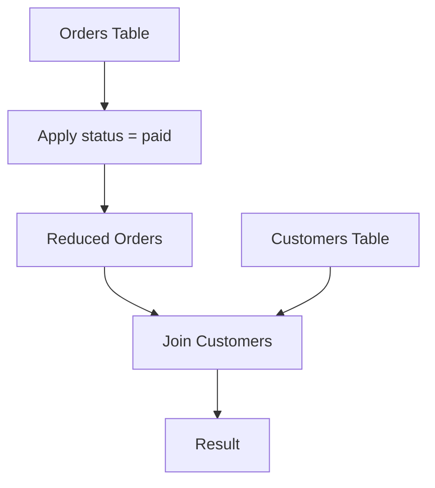
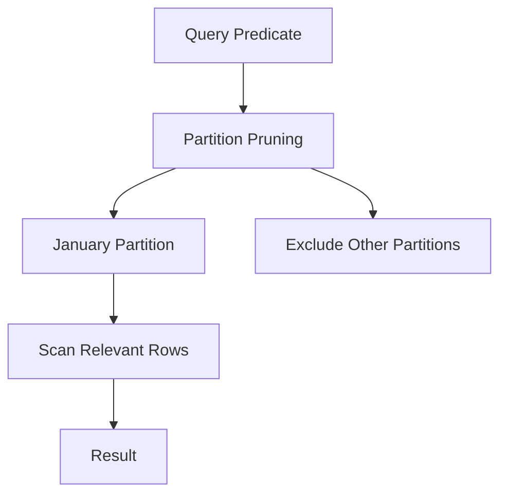

# 23- Predicate Pushdown

## Overview

Predicate pushdown is an optimization technique where filtering conditions are evaluated as close as possible to the data source before expensive operations such as joins, aggregations, sorting, or data transfer.

The core idea is simple:

```text
Process fewer rows
        ↓
Perform less work
        ↓
Use less CPU, memory, I/O, and network bandwidth
        ↓
Improve query performance
```

Predicate pushdown can occur in several places:

- Inside a database execution plan.
- Through joins and subqueries.
- Into views and CTEs when the optimizer can safely do so.
- Into partitioned tables.
- Into remote data sources.
- Into foreign-data wrappers or external query engines.
- Through application and ORM-generated SQL.

A senior backend engineer should understand that predicate pushdown is primarily an **optimizer behavior**, not merely a SQL formatting technique. Writing a filter earlier in the SQL text does not guarantee that it executes earlier. The database optimizer determines the actual execution strategy.

## Why Predicate Pushdown Matters

Consider a query joining a large `orders` table with `customers`:

```sql
SELECT
    c.id,
    c.name,
    o.total_amount
FROM customers AS c
JOIN orders AS o
    ON o.customer_id = c.id
WHERE o.status = 'paid';
```

Conceptually, the database could process:

```text
orders
  ↓
join all orders with customers
  ↓
filter status = 'paid'
```

But an optimizer can often transform the operation into:

```text
orders
  ↓
filter status = 'paid'
  ↓
smaller order relation
  ↓
join customers
```

If `orders` contains 100 million rows but only 2 million are paid, reducing the join input can dramatically reduce execution cost.

The optimization is especially valuable for:

- Large tables.
- Selective predicates.
- Expensive joins.
- Aggregations.
- Sorts.
- Hash operations.
- Partitioned datasets.
- Distributed or remote data sources.

## How Predicate Pushdown Works

A predicate is a condition that restricts rows:

```sql
WHERE status = 'paid'
```

The optimizer analyzes whether that condition can safely be evaluated earlier.

For example:

```sql
SELECT
    c.id,
    o.id
FROM customers AS c
JOIN orders AS o
    ON o.customer_id = c.id
WHERE o.status = 'paid';
```

The predicate:

```sql
o.status = 'paid'
```

references only `orders`.

Therefore, the optimizer can often apply it before the join:



The important distinction is that the **logical query** and **physical execution plan** are different.

SQL describes what result is required. The optimizer chooses how to produce that result.

## Logical Query vs Physical Plan

SQL is declarative.

When you write:

```sql
SELECT ...
FROM ...
WHERE ...
JOIN ...
```

you generally do not dictate the physical order in which operations execute.

The database can transform the relational expression when the transformation preserves semantics.

For example:

```text
Logical query
     ↓
Parse
     ↓
Rewrite / analyze
     ↓
Optimize
     ↓
Choose physical plan
     ↓
Execute
```

Predicate pushdown is one of the transformations considered during this process.

## Basic Example

Suppose:

```sql
CREATE TABLE orders (
    id BIGINT PRIMARY KEY,
    customer_id BIGINT NOT NULL,
    status TEXT NOT NULL,
    total_amount NUMERIC(12, 2) NOT NULL,
    created_at TIMESTAMPTZ NOT NULL
);
```

Query:

```sql
SELECT
    c.id,
    c.name,
    o.total_amount
FROM customers AS c
JOIN orders AS o
    ON o.customer_id = c.id
WHERE o.status = 'paid'
  AND o.created_at >= TIMESTAMPTZ '2026-01-01 00:00:00';
```

Two predicates can potentially be pushed toward the `orders` scan:

```text
status = 'paid'
created_at >= '2026-01-01'
```

Conceptually:

```text
Orders
  ↓
status = paid
  ↓
created_at >= boundary
  ↓
filtered orders
  ↓
join customers
```

This reduces the number of rows entering the join.

## Predicate Pushdown Through Joins

Predicate pushdown is particularly important with joins.

### Inner Joins

Inner joins generally provide significant opportunities for predicate pushdown.

Consider:

```sql
SELECT
    c.id,
    o.id
FROM customers AS c
JOIN orders AS o
    ON c.id = o.customer_id
WHERE c.country = 'IN';
```

The predicate:

```sql
c.country = 'IN'
```

references only `customers`.

The optimizer can often filter customers before joining them with orders.

Conceptually:

```text
Customers
    ↓
country = 'IN'
    ↓
Filtered Customers
    ↓
Join
    ↑
Orders
```

### Predicates Referencing Both Tables

Consider:

```sql
WHERE c.account_status = 'active'
  AND o.status = 'paid'
```

The optimizer can potentially push each predicate toward its respective relation:

```text
Customers
  ↓
account_status = active

Orders
  ↓
status = paid

       ↓
      Join
```

This is generally more efficient than carrying unnecessary rows into the join.

## Outer Joins Require Care

Predicate pushdown is more complicated with outer joins because filtering can change the meaning of the query.

Consider:

```sql
SELECT
    c.id,
    o.id
FROM customers AS c
LEFT JOIN orders AS o
    ON o.customer_id = c.id
WHERE o.status = 'paid';
```

The `WHERE` predicate rejects rows where `o.status` is `NULL`.

As a result, this query behaves differently from a straightforward left join that retains customers without matching orders.

Compare:

```sql
SELECT
    c.id,
    o.id
FROM customers AS c
LEFT JOIN orders AS o
    ON o.customer_id = c.id
   AND o.status = 'paid';
```

The second query preserves customers with no paid orders.

Therefore, moving a predicate between:

```sql
WHERE
```

and:

```sql
ON
```

is **not automatically semantics-preserving** for outer joins.

### Production Rule

Do not manually move predicates around joins unless you have verified the resulting semantics.

For `INNER JOIN`, many predicate movements are safe.

For `LEFT JOIN`, `RIGHT JOIN`, and `FULL JOIN`, analyze `NULL` preservation carefully.

## Predicate Pushdown and Indexes

Predicate pushdown reduces the number of rows considered by downstream operators. Indexes can reduce the cost of finding those rows.

Suppose:

```sql
SELECT
    id,
    customer_id,
    total_amount
FROM orders
WHERE status = 'paid'
  AND created_at >= TIMESTAMPTZ '2026-01-01';
```

An appropriate index may allow the database to access qualifying rows efficiently:

```sql
CREATE INDEX idx_orders_status_created_at
ON orders (status, created_at);
```

However, an index does not automatically guarantee an index scan.

The optimizer considers:

- Predicate selectivity.
- Table size.
- Index size.
- Estimated random I/O.
- Sequential I/O cost.
- Data distribution.
- Visibility and storage characteristics.
- Expected number of qualifying rows.

For low-selectivity predicates, a sequential scan can still be cheaper.

## Predicate Pushdown vs Index Condition Pushdown

These concepts are related but not identical.

| Concept | Purpose |
|---|---|
| Predicate pushdown | Evaluate filters closer to their data source |
| Index scan | Use an index to locate candidate rows |
| Index condition | Apply an index-supported condition during index access |
| Partition pruning | Eliminate irrelevant partitions |
| Filter | Reject rows that remain after an access operation |

A query can benefit from predicate pushdown even when it ultimately uses a sequential scan.

Likewise, using an index does not necessarily mean every predicate was pushed into the index access path.

## Predicate Pushdown and Aggregation

Filtering before aggregation can significantly reduce the amount of data being grouped.

Consider:

```sql
SELECT
    customer_id,
    SUM(total_amount)
FROM orders
WHERE status = 'paid'
GROUP BY customer_id;
```

The database can conceptually perform:

```text
Orders
  ↓
status = paid
  ↓
Filtered Orders
  ↓
Aggregate by customer_id
```

rather than aggregating all orders and filtering afterward.

This matters because hash aggregation and sorting can require substantial memory.

### Example of Semantically Different Filtering

These queries are not equivalent:

```sql
SELECT
    customer_id,
    SUM(total_amount)
FROM orders
WHERE status = 'paid'
GROUP BY customer_id;
```

and:

```sql
SELECT
    customer_id,
    SUM(total_amount)
FROM orders
GROUP BY customer_id
HAVING status = 'paid';
```

The second form is not valid in standard SQL because `status` is neither grouped nor aggregated.

More importantly, predicates on grouped results belong in `HAVING`, while row-level predicates generally belong in `WHERE`.

For example:

```sql
SELECT
    customer_id,
    SUM(total_amount) AS revenue
FROM orders
WHERE status = 'paid'
GROUP BY customer_id
HAVING SUM(total_amount) > 10000;
```

The database can push:

```sql
status = 'paid'
```

toward the base table, but:

```sql
SUM(total_amount) > 10000
```

cannot be evaluated until the aggregation has occurred.

## Predicate Pushdown and Sorting

Filtering before sorting can reduce sort input.

Instead of conceptually:

```text
10 million rows
      ↓
sort
      ↓
filter 100,000 rows
```

a better execution strategy is often:

```text
10 million rows
      ↓
filter
      ↓
100,000 rows
      ↓
sort
```

For example:

```sql
SELECT
    id,
    created_at,
    total_amount
FROM orders
WHERE status = 'paid'
ORDER BY created_at DESC
LIMIT 100;
```

If only a small percentage of rows are paid, sorting fewer rows can substantially reduce CPU and memory consumption.

An appropriate index may reduce both filtering and sorting work:

```sql
CREATE INDEX idx_orders_status_created_at
ON orders (status, created_at DESC);
```

Whether PostgreSQL uses it depends on the data distribution and estimated cost.

## Predicate Pushdown and `LIMIT`

`LIMIT` is not generally interchangeable with filtering.

Consider:

```sql
SELECT *
FROM orders
WHERE status = 'paid'
ORDER BY created_at DESC
LIMIT 100;
```

The database cannot simply fetch the first 100 arbitrary orders and then filter them because those rows may not be paid orders.

However, with a suitable ordering and access path, it may be able to find qualifying rows efficiently and stop once 100 rows have been found.

This is one reason why aligned indexes can be extremely effective for:

```text
filter + order + limit
```

workloads.

## Predicate Pushdown Through Subqueries

Consider:

```sql
SELECT *
FROM (
    SELECT
        id,
        customer_id,
        status
    FROM orders
) AS o
WHERE o.status = 'paid';
```

A modern optimizer can often recognize that:

```sql
status = 'paid'
```

can be evaluated against `orders` directly.

Conceptually:

```text
Subquery
  ↓
predicate
  ↓
Orders
```

may become:

```text
Orders
  ↓
status = paid
```

This is why adding an unnecessary subquery does not necessarily force materialization or prevent optimization.

## Views and Predicate Pushdown

Suppose a view is defined as:

```sql
CREATE VIEW active_orders AS
SELECT
    id,
    customer_id,
    total_amount,
    created_at
FROM orders
WHERE status = 'paid';
```

A query:

```sql
SELECT
    customer_id,
    total_amount
FROM active_orders
WHERE created_at >= TIMESTAMPTZ '2026-01-01';
```

can often be optimized as if the predicates were applied to the underlying table:

```sql
SELECT
    customer_id,
    total_amount
FROM orders
WHERE status = 'paid'
  AND created_at >= TIMESTAMPTZ '2026-01-01';
```

This allows reusable logical abstractions without necessarily sacrificing execution efficiency.

Materialized views are different because their data is physically stored and refreshed according to a separate lifecycle.

## CTEs and Predicate Pushdown

Consider:

```sql
WITH paid_orders AS (
    SELECT
        id,
        customer_id,
        total_amount,
        created_at
    FROM orders
    WHERE status = 'paid'
)
SELECT
    customer_id,
    total_amount
FROM paid_orders
WHERE created_at >= TIMESTAMPTZ '2026-01-01';
```

The optimizer may combine compatible predicates.

Conceptually:

```sql
WHERE status = 'paid'
  AND created_at >= ...
```

can be applied directly to the base relation.

Do not assume that a CTE always creates a physical intermediate table.

In PostgreSQL, CTEs can be inlined when the optimizer determines that doing so is appropriate. PostgreSQL also supports explicitly controlling this behavior with `MATERIALIZED` and `NOT MATERIALIZED`.

For example:

```sql
WITH paid_orders AS NOT MATERIALIZED (
    SELECT
        id,
        customer_id,
        total_amount
    FROM orders
    WHERE status = 'paid'
)
SELECT *
FROM paid_orders
WHERE customer_id = 42;
```

Use explicit materialization only when there is a clear reason to create an optimization boundary.

## Predicate Pushdown and Partition Pruning

Partitioned tables provide another important form of reducing data access.

Suppose orders are partitioned by date:

```text
orders
├── orders_2026_01
├── orders_2026_02
├── orders_2026_03
└── ...
```

Query:

```sql
SELECT
    id,
    total_amount
FROM orders
WHERE created_at >= TIMESTAMPTZ '2026-01-01'
  AND created_at < TIMESTAMPTZ '2026-02-01';
```

The optimizer can potentially eliminate partitions that cannot contain matching rows.

Conceptually:



This is more powerful than merely filtering rows after reading every partition.

### Partitioning Requirement

Partition pruning depends on predicates that allow the database to determine which partitions can contain matching rows.

Avoid wrapping partition keys in expressions that prevent effective pruning when a direct range predicate expresses the same requirement.

Prefer:

```sql
WHERE created_at >= $1
  AND created_at < $2
```

over unnecessarily transforming the partition key:

```sql
WHERE DATE(created_at) = $1
```

The exact behavior depends on the database engine and partitioning design.

## Predicate Pushdown in Distributed Systems

Predicate pushdown becomes even more valuable when data resides outside the local database process.

Consider:

```text
Application
    ↓
Query Engine
    ↓
Remote Data Source
    ↓
Large Dataset
```

Without pushdown:

```text
Remote source
    ↓
transfer millions of rows
    ↓
local filtering
```

With pushdown:

```text
Query Engine
    ↓
send predicate
    ↓
remote filtering
    ↓
transfer only qualifying rows
```

This can reduce:

- Network traffic.
- Remote CPU.
- Local CPU.
- Memory usage.
- Query latency.

The same principle appears in systems such as distributed SQL engines, federated queries, data warehouses, and foreign data access layers.

## Predicate Pushdown in Application Architecture

Backend applications should generally send selective filtering requirements to the database rather than retrieving large datasets and filtering them in Python.

Avoid:

```python
orders = list(Order.objects.all())

paid_orders = [
    order
    for order in orders
    if order.status == "paid"
]
```

Prefer:

```python
paid_orders = Order.objects.filter(status="paid")
```

The second form allows the database to perform filtering close to the stored data.

For APIs built with Django or FastAPI, this is especially important because unnecessary rows consume:

```text
Database I/O
    ↓
Network bandwidth
    ↓
Application memory
    ↓
Python object creation
    ↓
Serialization CPU
    ↓
HTTP response resources
```

## Predicate Pushdown in Django

Django QuerySets naturally encourage database-side filtering:

```python
orders = (
    Order.objects
    .filter(
        status="paid",
        created_at__gte=start_date,
    )
    .values(
        "id",
        "customer_id",
        "total_amount",
    )
)
```

This produces a database query containing the filtering predicates and avoids loading unnecessary model instances.

Use:

- `filter()` for database predicates.
- `select_related()` for appropriate one-to-one/foreign-key joins.
- `prefetch_related()` for appropriate many-to-many or reverse relationships.
- `values()` / `values_list()` when full model construction is unnecessary.

Do not assume that ORM expressions are efficient merely because they are concise. Inspect generated SQL for critical paths.

## Predicate Pushdown in SQLAlchemy

A similar principle applies to SQLAlchemy:

```python
stmt = (
    select(Order.id, Order.customer_id, Order.total_amount)
    .where(
        Order.status == "paid",
        Order.created_at >= start_date,
    )
)
```

The filtering is represented in SQL and can be optimized by the database.

The application should avoid fetching broad result sets merely to filter them in Python.

## When Predicate Pushdown Does Not Apply

Not every predicate can be pushed arbitrarily.

A predicate may depend on a value produced by:

- Aggregation.
- Window functions.
- Another relation.
- A volatile function.
- A later relational operation.
- An outer-join result.
- A computation whose semantics change when evaluated earlier.

Consider:

```sql
SELECT
    customer_id,
    SUM(total_amount) AS revenue
FROM orders
GROUP BY customer_id
HAVING SUM(total_amount) > 10000;
```

The predicate:

```sql
SUM(total_amount) > 10000
```

cannot simply be evaluated against individual rows because the required value does not exist until after aggregation.

This distinction is fundamental:

> **A predicate can only be pushed earlier when doing so preserves the query's semantics.**

## Predicate Pushdown and Window Functions

Consider:

```sql
SELECT *
FROM (
    SELECT
        id,
        customer_id,
        total_amount,
        ROW_NUMBER() OVER (
            PARTITION BY customer_id
            ORDER BY created_at DESC
        ) AS row_number
    FROM orders
) AS ranked
WHERE row_number = 1;
```

The predicate:

```sql
row_number = 1
```

depends on the window calculation and therefore cannot simply be applied to the base table before the window function.

However, predicates that are independent of the window calculation may be pushed earlier.

For example:

```sql
SELECT *
FROM (
    SELECT
        id,
        customer_id,
        total_amount,
        ROW_NUMBER() OVER (
            PARTITION BY customer_id
            ORDER BY created_at DESC
        ) AS row_number
    FROM orders
    WHERE status = 'paid'
) AS ranked
WHERE row_number = 1;
```

Filtering paid orders before ranking can change the intended result, so this rewrite is only correct if the requirement is explicitly:

> Find the latest paid order per customer.

If the requirement is:

> Find the latest order per customer, then return it only if that order is paid.

then pushing the status predicate before the window function changes the result.

This is an important senior-level optimization trap.

## Predicate Pushdown and Volatile Functions

A predicate involving a function may have restrictions on when it can safely be evaluated.

For example:

```sql
WHERE random() < 0.1
```

does not behave like a deterministic row property.

Moving such a predicate through relational operations can change how often the function executes and therefore change semantics.

Do not assume every filter is safely movable.

## Measuring Predicate Pushdown

For PostgreSQL, inspect the actual plan:

```sql
EXPLAIN (ANALYZE, BUFFERS)
SELECT
    c.id,
    c.name,
    o.total_amount
FROM customers AS c
JOIN orders AS o
    ON o.customer_id = c.id
WHERE o.status = 'paid'
  AND o.created_at >= TIMESTAMPTZ '2026-01-01';
```

Look for:

- Scan type.
- Filter placement.
- Rows removed by filter.
- Actual rows.
- Estimated rows.
- Join input sizes.
- Buffer reads.
- Buffer hits.
- Sort operations.
- Hash table sizes.
- Execution time.

A simplified plan might look conceptually like:

```text
Hash Join
  -> Seq Scan on customers
  -> Bitmap Heap Scan on orders
       Recheck Cond: ...
       Filter: status = 'paid'
```

The important observation is that filtering happens during or near the `orders` access path before the join consumes the rows.

## Estimated vs Actual Rows

Predicate pushdown interacts closely with cardinality estimation.

Suppose PostgreSQL estimates:

```text
estimated rows: 100,000
actual rows:    2,000,000
```

The optimizer may choose an execution strategy based on an incorrect assumption about selectivity.

A query can therefore have excellent predicate placement but still receive a poor plan.

This is why predicate pushdown and database statistics are closely related.

A senior engineer should investigate both:

```text
Predicate placement
+
Cardinality estimates
+
Access path
+
Join strategy
```

rather than treating pushdown as an isolated optimization.

## Production Optimization Workflow

Use an evidence-driven workflow:

### Capture the Baseline

Record:

```text
p50 latency
p95 latency
p99 latency
execution time
rows processed
buffer reads
CPU
temporary I/O
query frequency
```

### Inspect the Plan

Use:

```sql
EXPLAIN (ANALYZE, BUFFERS)
...
```

Identify:

- Large scans.
- Large intermediate relations.
- Expensive joins.
- Sorts.
- Hash operations.
- Poor selectivity.
- Incorrect cardinality estimates.

### Determine Pushdown Opportunities

Ask:

- Which predicates reference only one relation?
- Can they safely be evaluated earlier?
- Can partition pruning eliminate data?
- Can an index support the predicate?
- Can filtering reduce join input?
- Can filtering reduce aggregation input?
- Can filtering reduce sort input?
- Is the optimizer already performing the transformation?

### Validate Semantics

Test:

- `NULL`.
- Empty relations.
- Duplicate rows.
- Outer joins.
- Boundary conditions.
- Aggregations.
- Window functions.
- Time zones.
- Different parameter values.

### Compare Plans

Compare:

```text
Rows processed
Buffers
CPU
Memory
Sort/hash behavior
Execution time
```

### Benchmark Under Realistic Load

A rewrite that improves one execution from:

```text
500 ms → 100 ms
```

may still be problematic if it increases CPU usage under concurrency.

## Production Considerations

### High-Cardinality Tables

Pushdown is particularly valuable when tables contain millions or billions of rows.

The earlier irrelevant rows can be eliminated, the less downstream work the database must perform.

### Selectivity

Highly selective predicates usually provide more opportunity for reducing work.

For example:

```sql
WHERE id = $1
```

is usually much more selective than:

```sql
WHERE status = 'active'
```

if most rows are active.

However, selectivity is workload-dependent and should be measured rather than assumed.

### Statistics

Keep database statistics current.

In PostgreSQL, normal `ANALYZE` activity is essential for good cardinality estimates:

```sql
ANALYZE orders;
```

Autovacuum's automatic analyze behavior should generally be allowed to operate, with configuration adjusted for workload characteristics when necessary.

### Connection Pooling

Reducing query execution time can reduce connection occupancy:

```text
Shorter query
    ↓
Connection returned sooner
    ↓
Higher pool throughput
    ↓
Less application-side queueing
```

This can improve API latency even when the database query itself is only one part of the request.

### Read Replicas

Predicate pushdown can reduce read workload on replicas.

However, a poorly selective query can still consume significant replica resources even when it contains filters.

Monitor:

- Replica CPU.
- Replication lag.
- Query latency.
- I/O utilization.

## Common Mistakes

### Assuming SQL Text Order Controls Execution Order

Writing:

```sql
WHERE ...
JOIN ...
```

does not mean the filter necessarily executes before the join.

**Avoid it:** inspect the execution plan.

### Manually Forcing Pushdown Without Checking Semantics

This is especially dangerous with outer joins, aggregation, and window functions.

**Avoid it:** verify relational equivalence before rewriting.

### Assuming Predicate Pushdown Means Index Usage

A predicate can be pushed into a scan while the optimizer still chooses a sequential scan.

**Avoid it:** distinguish predicate placement from access-path selection.

### Filtering in Python After Fetching Rows

This wastes database, network, application, and serialization resources.

**Avoid it:** express selective predicates in SQL or ORM query expressions.

### Applying Functions to Partition or Indexed Columns

For example:

```sql
WHERE DATE(created_at) = $1
```

may make effective index access or partition pruning harder.

**Avoid it:** use appropriate range predicates where semantics allow.

### Ignoring `NULL` Semantics

Moving predicates across outer joins can silently change which rows survive.

**Avoid it:** test unmatched rows explicitly.

### Assuming CTEs Always Materialize

Modern PostgreSQL can inline eligible CTEs.

**Avoid it:** inspect the actual execution plan and use `MATERIALIZED` only deliberately.

### Assuming Every Filter Should Be Pushed

Some predicates depend on later operations and cannot be evaluated earlier.

**Avoid it:** determine the relational dependency of each predicate.

## Performance Comparison

| Situation | Without effective pushdown | With effective pushdown |
|---|---|---|
| Large join | More rows enter join | Smaller join inputs |
| Aggregation | More rows grouped | Fewer rows grouped |
| Sort | Larger sort input | Smaller sort input |
| Partitioned table | More partitions scanned | Irrelevant partitions eliminated |
| Remote data | More network transfer | Less data transferred |
| API query | More objects created | Fewer objects created |
| ORM query | Broad result set | Database-side filtering |
| Connection pool | Longer connection occupancy | Faster connection release |

## Security Considerations

Predicate pushdown itself is not a security mechanism.

Authorization predicates must still be applied correctly.

For example, a multi-tenant API might require:

```sql
SELECT
    id,
    total_amount
FROM orders
WHERE tenant_id = $1
  AND id = $2;
```

The `tenant_id` predicate should not be omitted merely because another predicate is highly selective.

Never rely on application-side filtering as the only tenant-isolation mechanism when the database query itself can enforce the boundary.

Always parameterize values:

```python
cursor.execute(
    """
    SELECT id, total_amount
    FROM orders
    WHERE tenant_id = %s
      AND status = %s
    """,
    [tenant_id, status],
)
```

Predicate optimization should never weaken authorization or introduce SQL injection vulnerabilities.

## Scalability Considerations

Predicate pushdown becomes increasingly valuable as systems scale because downstream work compounds with data volume.

Consider:

```text
100 million source rows
        ↓
10 million candidate rows
        ↓
1 million join rows
        ↓
100,000 aggregate rows
        ↓
1,000 API results
```

If filtering can reduce the source relation from 100 million to 1 million rows before the join, the savings can propagate through every downstream operation.

This is why senior database optimization often focuses on:

```text
Reduce data early
+
Reduce intermediate cardinality
+
Avoid unnecessary transfers
+
Exploit selective access paths
```

## Cost Considerations

Predicate pushdown can reduce:

- Database CPU.
- Storage reads.
- Memory consumption.
- Temporary disk usage.
- Network transfer.
- Application CPU.
- Application memory.
- Database instance pressure.

For cloud-hosted systems, reducing unnecessary database work can delay scaling events and improve cost efficiency.

However, adding indexes solely to support pushdown introduces:

- Storage cost.
- Write amplification.
- Maintenance overhead.
- Vacuum/index maintenance work.

Optimize the complete workload rather than a single query.

## Reliability Considerations

Database performance affects application reliability.

A query that scans a large table under high concurrency can cause:

```text
High CPU
  ↓
Longer query latency
  ↓
Connection pool exhaustion
  ↓
Request queueing
  ↓
API timeouts
  ↓
Retry storms
  ↓
Higher database load
```

Effective predicate pushdown can reduce the probability of this cascade by reducing per-query resource consumption.

Monitor the complete request path rather than only database execution time.

## Interview Traps

| Interview statement | Correct reasoning |
|---|---|
| "Predicate pushdown means the `WHERE` clause always runs first." | SQL is declarative; the optimizer determines the physical execution order. |
| "Predicate pushdown always means an index scan." | Pushdown and access-path selection are separate decisions. |
| "Moving every filter into `ON` is an optimization." | Outer-join semantics can change. |
| "A CTE prevents predicate pushdown." | PostgreSQL can inline eligible CTEs. |
| "Filtering before aggregation is always valid." | Only predicates independent of the aggregation semantics can safely move earlier. |
| "The optimizer cannot push predicates through subqueries." | Modern optimizers can transform many subqueries and views. |
| "More indexes always improve pushdown." | Indexes add write and maintenance costs and may not be useful for low-selectivity predicates. |
| "Predicate pushdown fixes bad cardinality estimates." | It can reduce work, but inaccurate statistics can still cause poor plan selection. |

## Senior-Level Reasoning

A senior engineer should evaluate predicate pushdown through the entire execution pipeline:

```text
Predicate
   ↓
Can it be evaluated earlier?
   ↓
Does moving it preserve semantics?
   ↓
How much cardinality does it eliminate?
   ↓
Can an index exploit it?
   ↓
Can partition pruning exploit it?
   ↓
How does it change joins?
   ↓
How does it change aggregation/sorting?
   ↓
What does EXPLAIN show?
   ↓
What happens under concurrency?
```

The most valuable predicates are generally those that eliminate large amounts of data before expensive operators.

However, the best optimization is not always to manually rewrite SQL. Modern optimizers already perform substantial predicate movement. The engineer's responsibility is to understand the optimizer's behavior, identify where it cannot safely transform the query, and make changes that produce measurable improvements.

## Key Takeaways

- **Predicate pushdown evaluates filters as close as safely possible to their data source, reducing rows entering expensive joins, aggregations, sorts, and transfers.**
- **SQL text order does not determine physical execution order; verify actual predicate placement with execution plans such as `EXPLAIN (ANALYZE, BUFFERS)`.**
- **Outer joins, aggregation, window functions, `NULL` semantics, and volatile expressions can restrict safe predicate movement, so correctness must be verified before optimization.**
- **Predicate pushdown complements indexes, partition pruning, and cardinality estimation but is not synonymous with any of them.**
- **Senior-level optimization focuses on reducing intermediate cardinality and total workload cost while preserving authorization, correctness, and predictable production behavior.**