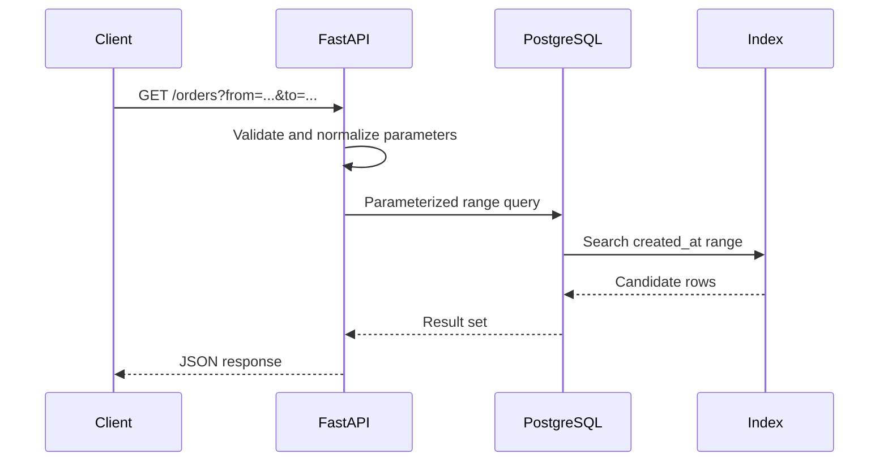

# 24- SARGability

## Overview

SARGability, short for **Search ARGument ability**, describes whether a query predicate can be efficiently evaluated using an index's search capabilities.

A predicate is generally **SARGable** when the database can use the indexed column directly to determine which index entries may satisfy the condition.

For example:

```sql
SELECT id, email
FROM users
WHERE email = 'alice@example.com';
```

If `users.email` is indexed, the database can typically use the equality predicate as an index search condition.

In contrast:

```sql
SELECT id, email
FROM users
WHERE LOWER(email) = 'alice@example.com';
```

Applying a function to the indexed column may prevent the database from using a conventional index efficiently, depending on the database engine and available indexes.

The key engineering principle is:

> **Keep indexed columns in searchable forms whenever possible, and transform the comparison value rather than the indexed column.**

SARGability is not a guarantee of index usage. The optimizer still considers selectivity, table size, statistics, cost, available indexes, and the expected result cardinality.

## Why SARGability Matters

An index exists to avoid examining every row when the query only needs a subset.

Without an effective index access path:

```text
Table
  ↓
Read many rows
  ↓
Evaluate predicate
  ↓
Discard most rows
```

With an effective searchable predicate:

```text
Index
  ↓
Locate matching key range
  ↓
Fetch qualifying rows
  ↓
Return result
```

For large tables, this difference can be substantial.

SARGability can reduce:

- Disk I/O.
- CPU usage.
- Memory consumption.
- Query latency.
- Buffer-cache pressure.
- Database connection occupancy.
- Application request latency.

However, an index scan is not automatically faster than a sequential scan. If a predicate matches a large percentage of a table, scanning the table sequentially may be cheaper.

## What Makes a Predicate SARGable

The most common SARGable patterns compare an indexed column directly against a constant or parameter.

| Predicate | Generally SARGable? | Notes |
|---|---:|---|
| `email = $1` | Yes | Direct equality lookup |
| `id = $1` | Yes | Excellent index lookup |
| `created_at >= $1` | Yes | Range scan |
| `created_at BETWEEN $1 AND $2` | Yes | Range scan |
| `price < $1` | Yes | Range scan |
| `status IN ($1, $2)` | Usually | Multiple searchable values |
| `name LIKE 'alice%'` | Often | Prefix search can use suitable indexes |
| `LOWER(email) = $1` | Not with a normal index on `email` | Function is applied to the column |
| `DATE(created_at) = $1` | Often problematic | Transformation of indexed column |
| `price + 10 > $1` | Often problematic | Column is transformed |
| `CAST(id AS TEXT) = $1` | Often problematic | Type conversion may block normal index use |
| `LIKE '%alice%'` | Usually not with a standard B-tree | Leading wildcard prevents ordinary range lookup |

The exact behavior depends on the database engine, index type, data types, collation, and optimizer.

## How Index Search Works

Consider:

```sql
CREATE INDEX idx_orders_created_at
ON orders (created_at);
```

A query such as:

```sql
SELECT id, total_amount
FROM orders
WHERE created_at >= TIMESTAMPTZ '2026-01-01';
```

can potentially use the B-tree index to find the first relevant key and then scan the appropriate key range.

Conceptually:

```text
B-tree index

           2026-06
          /        \
    2026-01        2026-09
       ↓
  first qualifying key
       ↓
  scan remaining range
```

The database does not need to inspect every table row just to determine whether `created_at` satisfies the condition.

## SARGable vs Non-SARGable Predicates

Consider an indexed column:

```sql
CREATE INDEX idx_users_created_at
ON users (created_at);
```

A SARGable query:

```sql
SELECT id
FROM users
WHERE created_at >= TIMESTAMPTZ '2026-01-01';
```

The column remains directly searchable.

A less SARGable query:

```sql
SELECT id
FROM users
WHERE DATE(created_at) = DATE '2026-01-01';
```

The database must conceptually evaluate:

```text
created_at
    ↓
DATE(created_at)
    ↓
compare with 2026-01-01
```

For a conventional B-tree index on `created_at`, this can make it harder to perform a direct index range search.

A more index-friendly equivalent is:

```sql
SELECT id
FROM users
WHERE created_at >= TIMESTAMPTZ '2026-01-01 00:00:00+00'
  AND created_at <  TIMESTAMPTZ '2026-01-02 00:00:00+00';
```

Now the indexed column is compared directly against boundaries.

## The General Rewrite Pattern

A common optimization pattern is:

```text
Function(column) OP constant
```

→

```text
column OP transformed_constant
```

when the transformation is mathematically and semantically valid.

For example:

```sql
WHERE DATE(created_at) = DATE '2026-01-01'
```

can often become:

```sql
WHERE created_at >= TIMESTAMPTZ '2026-01-01'
  AND created_at <  TIMESTAMPTZ '2026-01-02';
```

This preserves a half-open time interval:

```text
[start, end)
```

and avoids ambiguity around fractional seconds.

## Date and Time Predicates

Date filtering is one of the most common sources of accidental non-SARGability.

Avoid:

```sql
WHERE DATE(created_at) = $1
```

Prefer:

```sql
WHERE created_at >= $1
  AND created_at < $2
```

where the application supplies the beginning of the requested day and the beginning of the next day.

For example:

```python
from datetime import datetime, timedelta, timezone

start = datetime(2026, 9, 1, tzinfo=timezone.utc)
end = start + timedelta(days=1)
```

Then:

```sql
SELECT id, total_amount
FROM orders
WHERE created_at >= $1
  AND created_at < $2;
```

This pattern is useful for PostgreSQL indexes and time-partitioned tables.

### Time Zone Considerations

Be careful when constructing date boundaries.

A business day in:

```text
Asia/Kolkata
```

does not necessarily correspond to:

```text
00:00 UTC → 24:00 UTC
```

For production systems, calculate boundaries in the intended business timezone and convert them to the database representation consistently.

Incorrect timezone handling can produce both performance and correctness bugs.

## Functions on Indexed Columns

Consider:

```sql
CREATE INDEX idx_users_email
ON users (email);
```

Query:

```sql
SELECT id
FROM users
WHERE LOWER(email) = LOWER($1);
```

The normal index on `email` may not directly support this expression.

### Option: Normalize Data

If the application's business rule requires case-insensitive email comparison, storing normalized values can be preferable.

For example:

```text
Input email
    ↓
Normalize
    ↓
Store canonical representation
    ↓
Direct equality lookup
```

Then:

```sql
SELECT id
FROM users
WHERE normalized_email = $1;
```

with:

```sql
CREATE UNIQUE INDEX uq_users_normalized_email
ON users (normalized_email);
```

This makes the access pattern explicit.

### Option: Expression Index

PostgreSQL supports expression indexes:

```sql
CREATE INDEX idx_users_lower_email
ON users (LOWER(email));
```

Then:

```sql
SELECT id
FROM users
WHERE LOWER(email) = LOWER($1);
```

can potentially use the expression index.

This is an important distinction:

> A predicate that is not SARGable against one index can become efficiently searchable when the appropriate expression index exists.

Do not blindly rewrite every function expression. Choose the indexing strategy based on the application's actual access patterns.

## Arithmetic on Indexed Columns

Consider:

```sql
CREATE INDEX idx_products_price
ON products (price);
```

Query:

```sql
SELECT id
FROM products
WHERE price * 1.2 < $1;
```

The database may not be able to use the ordinary index on `price` as efficiently as a direct range predicate.

If mathematically valid, rewrite:

```sql
WHERE price < $1 / 1.2
```

The exact rewrite must account for:

- Numeric precision.
- Data types.
- Rounding.
- Overflow.
- Division by zero.
- Currency representation.

Do not sacrifice correctness for a theoretical index optimization.

## String Search

String predicates demonstrate the difference between prefix and substring searches.

### Prefix Search

```sql
WHERE username LIKE 'alice%'
```

A B-tree index may support this pattern depending on database, collation, operator class, and configuration.

The search has a known lower boundary:

```text
alice...
```

### Leading Wildcard

```sql
WHERE username LIKE '%alice'
```

or:

```sql
WHERE username LIKE '%alice%'
```

A conventional B-tree generally cannot efficiently navigate to the matching position because the beginning of the value is unknown.

For PostgreSQL workloads requiring substring search, consider appropriate specialized indexing such as `pg_trgm` where justified.

Example:

```sql
CREATE EXTENSION IF NOT EXISTS pg_trgm;

CREATE INDEX idx_users_username_trgm
ON users USING gin (username gin_trgm_ops);
```

Then:

```sql
SELECT id
FROM users
WHERE username ILIKE '%alice%';
```

can potentially use the trigram index.

The appropriate solution depends on workload and search requirements.

## Implicit Type Conversion

Type mismatches can create performance problems and sometimes prevent effective index usage.

Suppose:

```sql
CREATE INDEX idx_orders_customer_id
ON orders (customer_id);
```

where:

```text
customer_id BIGINT
```

The application should bind the parameter using a compatible type.

Prefer:

```sql
WHERE customer_id = $1
```

with a correctly typed parameter.

Be cautious with expressions such as:

```sql
WHERE CAST(customer_id AS TEXT) = $1
```

because the indexed column is being transformed.

Implicit conversions are database-specific, so inspect the execution plan rather than assuming a conversion will always disable an index.

## `COALESCE` and Indexed Columns

Consider:

```sql
WHERE COALESCE(status, 'unknown') = $1
```

The expression transforms the indexed column.

If the business requirement allows it, a direct predicate may be preferable:

```sql
WHERE status = $1
```

If `NULL` has special semantics, the correct rewrite may require additional logic:

```sql
WHERE status = $1
   OR (status IS NULL AND $1 = 'unknown');
```

Whether this is better depends on the data model and query workload.

Correctness must come before SARGability.

## `NOT`, `<>`, and Inequality Predicates

SARGability is not binary.

Predicates such as:

```sql
WHERE status <> 'cancelled'
```

can technically be searchable in some contexts, but they may be poorly selective.

If most rows are not cancelled:

```text
99% qualify
1% excluded
```

an index may provide little benefit.

Similarly:

```sql
WHERE id <> $1
```

does not identify a small contiguous range of keys.

The important question is not only:

> "Can the index represent this predicate?"

but also:

> "Will using the index reduce enough work to be worthwhile?"

## `OR` Predicates

Consider:

```sql
SELECT id
FROM users
WHERE email = $1
   OR phone = $2;
```

If both columns have suitable indexes, the optimizer may combine access paths, depending on the database engine.

In PostgreSQL, for example, bitmap operations can combine multiple indexes.

Do not automatically rewrite every `OR` into `UNION ALL`.

A rewrite such as:

```sql
SELECT id
FROM users
WHERE email = $1

UNION ALL

SELECT id
FROM users
WHERE phone = $2;
```

may introduce duplicate rows when both predicates match the same user.

Correctness and actual execution plans determine whether such a rewrite is appropriate.

## SARGability and Composite Indexes

Suppose:

```sql
CREATE INDEX idx_orders_customer_status_created
ON orders (customer_id, status, created_at);
```

A query:

```sql
SELECT id
FROM orders
WHERE customer_id = $1
  AND status = $2
  AND created_at >= $3;
```

aligns well with the index's leading columns.

Conceptually:

```text
customer_id
    ↓
status
    ↓
created_at range
```

But a query such as:

```sql
WHERE created_at >= $1
```

cannot necessarily exploit the full composite index efficiently because `created_at` is not the leading column.

This is not purely a SARGability problem. It is also an **index design and column-order problem**.

For composite indexes, evaluate:

- Equality predicates.
- Range predicates.
- Sort requirements.
- Join predicates.
- Column selectivity.
- Actual workload.

## SARGability and `ORDER BY`

A well-designed index can sometimes support both filtering and ordering.

Suppose:

```sql
CREATE INDEX idx_orders_customer_created
ON orders (customer_id, created_at DESC);
```

Query:

```sql
SELECT id, created_at, total_amount
FROM orders
WHERE customer_id = $1
ORDER BY created_at DESC
LIMIT 50;
```

The index can potentially provide:

```text
customer_id = $1
       ↓
already ordered by created_at DESC
       ↓
first 50 matching rows
```

This can avoid a large explicit sort.

SARGability therefore should be considered together with the complete access pattern:

```text
WHERE
+
JOIN
+
ORDER BY
+
LIMIT
```

## SARGability and Joins

Join predicates should also preserve searchable column relationships.

For example:

```sql
SELECT
    o.id,
    c.name
FROM orders AS o
JOIN customers AS c
    ON c.id = o.customer_id
WHERE o.customer_id = $1;
```

Indexes on the relevant join/filter columns can make the access path efficient.

Avoid unnecessary transformations:

```sql
ON CAST(c.id AS TEXT) = o.customer_id
```

when compatible data types can be used directly.

Schema design matters because joins across mismatched representations often introduce unnecessary conversions and complicate index usage.

## SARGability and Partition Pruning

SARGable predicates are particularly valuable for partitioned tables.

Suppose:

```text
orders_2026_01
orders_2026_02
orders_2026_03
...
```

with partitioning based on:

```text
created_at
```

Prefer:

```sql
WHERE created_at >= $1
  AND created_at < $2
```

because the database can potentially determine which partitions can contain matching rows.

A transformed predicate such as:

```sql
WHERE DATE(created_at) = $1
```

can make pruning harder depending on the database and partitioning setup.

A good production query should ideally reduce work at multiple levels:

```text
Partition pruning
      ↓
Index access
      ↓
Predicate filtering
      ↓
Join / aggregation
      ↓
Result
```

## SARGability and PostgreSQL

PostgreSQL does not expose a simple "SARGable" flag.

Instead, inspect the execution plan:

```sql
EXPLAIN (ANALYZE, BUFFERS)
SELECT
    id,
    total_amount
FROM orders
WHERE created_at >= TIMESTAMPTZ '2026-01-01'
  AND created_at < TIMESTAMPTZ '2026-02-01';
```

Look for operators such as:

```text
Index Scan
Index Only Scan
Bitmap Index Scan
Bitmap Heap Scan
```

and inspect:

```text
Index Cond
Filter
Rows Removed by Filter
```

A useful distinction is:

```text
Index Cond
```

versus:

```text
Filter
```

For example:

```text
Index Cond: (created_at >= ...)
Filter: (status = 'paid')
```

means the index is helping locate candidate rows using `created_at`, while `status` is being evaluated after the index access.

That does not necessarily mean the query is bad. The optimizer may have determined that this is the cheapest available plan.

## Practical PostgreSQL Example

Suppose:

```sql
CREATE INDEX idx_orders_created_at
ON orders (created_at);
```

Less index-friendly:

```sql
SELECT
    id,
    total_amount
FROM orders
WHERE DATE(created_at) = DATE '2026-09-01';
```

More index-friendly:

```sql
SELECT
    id,
    total_amount
FROM orders
WHERE created_at >= TIMESTAMPTZ '2026-09-01 00:00:00+00'
  AND created_at <  TIMESTAMPTZ '2026-09-02 00:00:00+00';
```

Verify with:

```sql
EXPLAIN (ANALYZE, BUFFERS)
SELECT
    id,
    total_amount
FROM orders
WHERE created_at >= TIMESTAMPTZ '2026-09-01 00:00:00+00'
  AND created_at <  TIMESTAMPTZ '2026-09-02 00:00:00+00';
```

Do not assume the second query will always use the index. The optimizer may correctly prefer a sequential scan if a large percentage of rows qualifies.

## SARGability in Django

ORM code can accidentally create inefficient SQL.

Prefer:

```python
orders = Order.objects.filter(
    created_at__gte=start,
    created_at__lt=end,
)
```

over retrieving a broad dataset and applying date logic in Python:

```python
orders = Order.objects.all()

filtered = [
    order
    for order in orders
    if start <= order.created_at < end
]
```

Django's `__date` lookup can be convenient:

```python
Order.objects.filter(created_at__date=target_date)
```

but the generated SQL and database behavior should be verified for high-volume workloads. For latency-sensitive queries, explicit range boundaries often provide clearer control over index and partition access.

Inspect generated SQL when optimizing:

```python
queryset = Order.objects.filter(
    created_at__gte=start,
    created_at__lt=end,
)

print(queryset.query)
```

For production diagnostics, prefer proper query logging and database observability rather than application-level `print()` statements.

## SARGability in FastAPI Applications

FastAPI does not determine SQL access paths; the database does.

A typical request flow is:



The application should:

- Validate input.
- Normalize timestamps consistently.
- Bind parameters safely.
- Push filtering into SQL.
- Avoid loading unnecessary rows.
- Return only required columns where practical.

## SARGability and Parameterization

Parameterized queries preserve both security and reusable query structure.

Prefer:

```sql
SELECT id, total_amount
FROM orders
WHERE customer_id = $1
  AND created_at >= $2;
```

with bound parameters.

Avoid dynamically constructing SQL:

```python
query = f"""
SELECT id, total_amount
FROM orders
WHERE customer_id = {customer_id}
"""
```

Parameterization prevents SQL injection and gives the database driver a well-defined query/parameter boundary.

Do not confuse parameterization with SARGability. A parameterized predicate can still be non-SARGable:

```sql
WHERE DATE(created_at) = $1
```

Security and performance are separate concerns.

## When to Use SARGability Techniques

Prioritize SARGability when:

- Tables are large.
- Queries run frequently.
- Predicates are selective.
- Latency is important.
- Queries are part of API request paths.
- Tables are heavily concurrent.
- Data is partitioned.
- Queries use expensive joins or aggregations.
- Database I/O is a bottleneck.

It is less important to optimize a tiny table where a sequential scan is consistently cheaper.

Avoid rewriting queries solely because a textbook says an index "should" be used.

## When an Index Is Still Not Used

A SARGable predicate does not guarantee index usage.

For example:

```sql
SELECT *
FROM orders
WHERE status = 'completed';
```

may be SARGable if `status` is indexed.

But if:

```text
95% of rows = completed
```

the optimizer may prefer:

```text
Sequential Scan
```

because reading most of the table through an index can cost more than scanning it directly.

Other reasons include:

- Small table size.
- Poor or stale statistics.
- Low selectivity.
- High random I/O cost.
- Visibility characteristics.
- Correlation between index order and table order.
- Cost model configuration.
- Competing indexes.
- Cached data.

The correct question is:

> **Is the chosen plan efficient for the workload?**

not:

> **Did the database use my index?**

## Measuring SARGability

Use actual execution plans.

For PostgreSQL:

```sql
EXPLAIN (ANALYZE, BUFFERS, VERBOSE)
SELECT
    id,
    customer_id,
    total_amount
FROM orders
WHERE created_at >= $1
  AND created_at < $2;
```

Compare:

| Metric | What to inspect |
|---|---|
| Execution time | Actual query latency |
| Planning time | Planning overhead |
| Index Cond | Conditions used during index access |
| Filter | Conditions evaluated after access |
| Rows Removed by Filter | Potential wasted work |
| Actual rows | Real cardinality |
| Estimated rows | Optimizer estimate |
| Buffers | I/O and cache behavior |
| Scan type | Sequential, index, bitmap, etc. |
| Sort | Whether ordering creates additional work |

Always compare plans using realistic data volumes.

## Production Workflow

Use an evidence-driven process:

1. Identify the slow query from database or application telemetry.
2. Capture representative parameter values.
3. Run `EXPLAIN (ANALYZE, BUFFERS)`.
4. Identify predicates applied to indexed columns.
5. Check whether columns are wrapped in functions or expressions.
6. Check data types and implicit casts.
7. Inspect index definitions and column order.
8. Rewrite predicates where correctness permits.
9. Re-run the execution plan.
10. Benchmark under realistic concurrency.
11. Monitor the production effect after deployment.

Do not optimize based only on a development database containing a few thousand rows.

## Common Mistakes

### Wrapping Indexed Columns in Functions

Avoid:

```sql
WHERE DATE(created_at) = $1
```

when a range predicate can express the same requirement.

### Applying Arithmetic to Columns

Avoid unnecessary expressions such as:

```sql
WHERE price * 1.2 < $1
```

when an equivalent direct comparison is safe.

### Casting Indexed Columns

Avoid:

```sql
WHERE CAST(customer_id AS TEXT) = $1
```

when parameter and column types can be aligned.

### Leading Wildcards

Do not expect a standard B-tree to efficiently support:

```sql
WHERE email LIKE '%@example.com'
```

Use a search-oriented index or data model when substring search is a real requirement.

### Assuming Every SARGable Query Uses an Index

The optimizer can correctly choose a sequential scan.

### Creating an Index for Every Predicate

Indexes increase:

- Storage usage.
- Write cost.
- Maintenance cost.
- Vacuum/index maintenance work.

Index design should follow actual query patterns.

### Ignoring Data Distribution

An index on a low-cardinality column such as:

```sql
status
```

may provide limited value when one value dominates the table.

### Optimizing Before Measuring

A theoretically better predicate can produce no meaningful improvement.

Always compare actual execution plans and production-relevant metrics.

## Production Pitfalls

### Timezone Boundary Errors

Changing:

```sql
DATE(created_at)
```

to a range predicate is good only if the range represents the correct business day.

### Precision and Rounding

Arithmetic rewrites must preserve numeric semantics.

For financial data, avoid introducing floating-point behavior merely to make a predicate searchable.

### Collation Differences

String comparisons depend on:

- Collation.
- Case sensitivity.
- Locale.
- Operator class.
- Database-specific behavior.

A prefix-search optimization should be validated under the actual database configuration.

### ORM Abstractions

An ORM expression may look harmless while generating SQL that prevents efficient index usage.

Inspect SQL for critical paths.

### Generic Query APIs

Dynamic filtering systems can generate expressions such as:

```sql
LOWER(column) = ...
```

or:

```sql
CAST(column AS TEXT) = ...
```

across many endpoints.

For shared backend infrastructure, establish query-generation rules that preserve efficient access paths.

## Security Considerations

SARGability is primarily a performance concern, but query rewrites must preserve security boundaries.

For multi-tenant systems:

```sql
SELECT id, total_amount
FROM orders
WHERE tenant_id = $1
  AND created_at >= $2
  AND created_at < $3;
```

Do not remove or weaken:

```sql
tenant_id = $1
```

merely because another predicate is more selective.

Use parameterized queries:

```python
cursor.execute(
    """
    SELECT id, total_amount
    FROM orders
    WHERE tenant_id = %s
      AND created_at >= %s
      AND created_at < %s
    """,
    (tenant_id, start, end),
)
```

Performance optimization must never bypass authorization or tenant isolation.

## Scalability Considerations

At scale, SARGable predicates can prevent unnecessary work from propagating through the entire execution plan.

Consider:

```text
100 million rows
       ↓
index range selects 500,000
       ↓
join 500,000 rows
       ↓
aggregate
       ↓
return 100 rows
```

versus:

```text
100 million rows
       ↓
scan and transform every row
       ↓
filter
       ↓
join
       ↓
aggregate
```

Reducing the initial working set can improve:

- CPU utilization.
- Buffer-cache efficiency.
- Join performance.
- Sort memory.
- Connection utilization.
- Overall database throughput.

## Cost Considerations

Indexes supporting SARGable queries can reduce read cost but increase write cost.

Every additional index may require:

```text
INSERT
  ↓
Index maintenance

UPDATE
  ↓
Index maintenance

DELETE
  ↓
Index maintenance
```

For high-write systems, excessive indexing can become a significant bottleneck.

Evaluate:

```text
Read savings
vs
Write amplification
+
Storage
+
Maintenance
```

For cloud databases, lower I/O and CPU utilization can also reduce pressure on provisioned database capacity.

## Reliability Considerations

A non-SARGable query on a large table can become a reliability problem under concurrency:

```text
Large scan
   ↓
High I/O + CPU
   ↓
Long query duration
   ↓
Connection pool occupancy
   ↓
Request queueing
   ↓
API timeouts
   ↓
Retries
   ↓
More database load
```

SARGable access paths can reduce the probability of this cascade, but they are only one part of database reliability.

Also monitor:

- Query latency.
- Database CPU.
- I/O.
- Buffer cache behavior.
- Connection pool utilization.
- Lock waits.
- Temporary file usage.
- Replication lag.

## Interview Traps

| Interview question | Strong answer |
|---|---|
| What does SARGable mean? | A predicate can be efficiently used as a search argument, commonly allowing an index access path to narrow candidate rows. |
| Does SARGable mean the database will use an index? | No. The optimizer can choose a sequential scan if it is cheaper. |
| Why is `DATE(created_at) = $1` problematic? | Applying a function to the indexed column can prevent efficient use of a normal index; a timestamp range is often better. |
| Is `LIKE 'abc%'` always indexable? | Not universally. Database, collation, index type, and operator configuration matter. |
| Is `LIKE '%abc%'` SARGable with a normal B-tree? | Generally not as an efficient B-tree range search. Specialized search indexes may be appropriate. |
| Can a function be indexed? | Yes, where the database supports expression/function indexes. |
| Is `status = 'active'` automatically fast if `status` is indexed? | No. Low selectivity may make a sequential scan cheaper. |
| Is SARGability only about indexes? | Primarily it concerns searchable access paths, but it also interacts with partition pruning, joins, sorting, and overall query planning. |

## Senior-Level Reasoning

SARGability should be treated as part of a broader query optimization model:

```text
Predicate shape
      ↓
Can it be searched efficiently?
      ↓
Suitable index?
      ↓
Correct index column order?
      ↓
Good selectivity?
      ↓
Accurate statistics?
      ↓
Partition pruning?
      ↓
Join strategy?
      ↓
Sort / aggregation cost?
      ↓
Actual production workload?
```

The goal is not to make every predicate technically SARGable or force every query onto an index.

The goal is to provide the optimizer with efficient access paths while preserving semantics.

A senior engineer therefore asks:

- Can the predicate be represented as an indexable range?
- Is the indexed column being transformed unnecessarily?
- Can the schema store normalized values instead?
- Would an expression index be more appropriate?
- Is the predicate selective enough to justify an index?
- Does the index support filtering and ordering together?
- Are partition boundaries aligned with common predicates?
- Are parameter types compatible with column types?
- Does the actual execution plan validate the expected improvement?
- Does the optimization remain beneficial under production concurrency?

## Key Takeaways

- **SARGability means structuring predicates so the database can efficiently use them as search conditions; it does not guarantee that an index will be chosen.**
- **Avoid unnecessary functions, arithmetic, and casts on indexed columns; when semantics permit, transform the comparison value or express the condition as a direct range.**
- **Date ranges, prefix searches, composite indexes, partition pruning, and join predicates should be evaluated together when designing high-performance access paths.**
- **Expression indexes and specialized indexes can make otherwise non-SARGable expressions efficiently searchable when the workload justifies them.**
- **Always validate SARGability improvements with actual execution plans, realistic data, and production-relevant concurrency rather than assuming index usage equals better performance.**