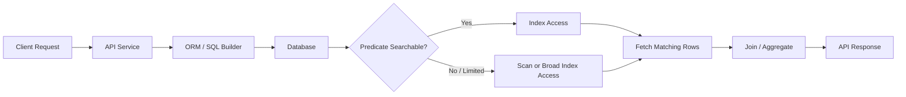

# 25- Avoiding Functions on Indexed Columns

## Overview

Applying a function or expression directly to an indexed column can prevent the database from using a conventional index as efficiently as it could with a direct predicate.

For example:

```sql
SELECT id, total_amount
FROM orders
WHERE DATE(created_at) = DATE '2026-09-01';
```

If the table has:

```sql
CREATE INDEX idx_orders_created_at
ON orders (created_at);
```

the database may be unable to use the ordinary B-tree index as a simple range search because it must evaluate `DATE(created_at)` for candidate rows.

A more index-friendly form is:

```sql
SELECT id, total_amount
FROM orders
WHERE created_at >= TIMESTAMPTZ '2026-09-01 00:00:00+00'
  AND created_at <  TIMESTAMPTZ '2026-09-02 00:00:00+00';
```

The indexed column remains unchanged, allowing the optimizer to potentially search the index directly.

This is a practical application of **SARGability**. The objective is not to force index usage, but to preserve efficient search conditions so the optimizer has good access paths available.

## Why Functions on Indexed Columns Can Be Expensive

A conventional B-tree index stores keys derived from the indexed column:

```text
created_at index

2026-08-30 09:15
2026-08-31 14:22
2026-09-01 00:03
2026-09-01 08:47
2026-09-01 18:31
2026-09-02 02:10
```

For:

```sql
WHERE created_at >= $1
  AND created_at < $2
```

the database can identify the relevant index range directly.

For:

```sql
WHERE DATE(created_at) = $1
```

the predicate conceptually becomes:

```text
Index value
    ↓
DATE(created_at)
    ↓
Compare result
```

The ordinary index is ordered by `created_at`, not by `DATE(created_at)`.

This distinction is fundamental:

> **An index can efficiently search the representation it is ordered by. If the query transforms that representation, the existing index may no longer provide the desired search boundary.**

The exact optimizer behavior is database-specific, so execution plans should always be used for verification.

## The Core Pattern

A common problematic form is:

```sql
FUNCTION(indexed_column) = value
```

or:

```sql
indexed_column + expression = value
```

Prefer, when semantics permit:

```sql
indexed_column = transformed_value
```

or:

```sql
indexed_column >= lower_bound
AND indexed_column < upper_bound
```

Examples:

| Less index-friendly pattern | Preferred pattern |
|---|---|
| `DATE(created_at) = $1` | `created_at >= $1 AND created_at < $2` |
| `LOWER(email) = $1` | Normalize the stored value or use an expression index |
| `price * 1.2 < $1` | `price < $1 / 1.2` when mathematically safe |
| `CAST(customer_id AS TEXT) = $1` | Bind `$1` using the column's type |
| `SUBSTRING(code, 1, 3) = 'ABC'` | Use a suitable prefix/range strategy or expression index |
| `COALESCE(status, 'unknown') = $1` | Use direct predicates where semantics permit |

These are patterns, not universal rewrite rules. Correctness and actual query plans take precedence.

## Date and Time Filtering

Date filtering is one of the most common production cases.

### Problematic Form

```sql
SELECT id
FROM orders
WHERE DATE(created_at) = DATE '2026-09-01';
```

The database must evaluate the function for the relevant rows instead of directly searching the `created_at` key space.

### Range-Based Form

```sql
SELECT id
FROM orders
WHERE created_at >= TIMESTAMPTZ '2026-09-01 00:00:00+00'
  AND created_at <  TIMESTAMPTZ '2026-09-02 00:00:00+00';
```

This expresses the desired day as a half-open interval:

```text
[2026-09-01 00:00:00, 2026-09-02 00:00:00)
```

The half-open form is preferable because it avoids guessing the maximum timestamp representable during the day.

### Application-Supplied Boundaries

A backend service can calculate the boundaries before issuing the query:

```python
from datetime import datetime, timedelta, timezone

start = datetime(2026, 9, 1, tzinfo=timezone.utc)
end = start + timedelta(days=1)
```

Then:

```sql
SELECT id, total_amount
FROM orders
WHERE created_at >= $1
  AND created_at < $2;
```

This keeps transformation logic outside the indexed database column.

## Time Zone Correctness

Avoid treating a performance rewrite as purely syntactic.

Suppose users request:

```text
2026-09-01 in Asia/Kolkata
```

The corresponding UTC interval is not simply:

```text
00:00 UTC → 24:00 UTC
```

The application should calculate the business-day boundaries in the intended timezone and then convert them consistently.

The correct process is:

```text
User date + timezone
        ↓
Business-day boundaries
        ↓
UTC timestamps
        ↓
Parameterized range predicate
        ↓
Index search
```

This preserves both:

- Query performance.
- Business correctness.

A fast query returning the wrong day's data is still a broken query.

## String Functions

String normalization is another common source of expressions on indexed columns.

Suppose:

```sql
CREATE INDEX idx_users_email
ON users (email);
```

A query such as:

```sql
SELECT id
FROM users
WHERE LOWER(email) = LOWER($1);
```

transforms the indexed column.

There are several possible production strategies.

### Normalize at Write Time

If email addresses are required to follow a canonical representation, store the normalized value:

```sql
CREATE UNIQUE INDEX uq_users_normalized_email
ON users (normalized_email);
```

Then:

```sql
SELECT id
FROM users
WHERE normalized_email = $1;
```

This provides a direct equality lookup.

The normalization rule must be defined carefully. Do not assume that arbitrary Unicode strings can safely be normalized using simplistic application logic.

### Expression Index

PostgreSQL supports expression indexes:

```sql
CREATE INDEX idx_users_lower_email
ON users (LOWER(email));
```

Then:

```sql
SELECT id
FROM users
WHERE LOWER(email) = LOWER($1);
```

can potentially use the expression index.

This is useful when the transformed representation is itself an important query dimension.

## Arithmetic Expressions

Suppose:

```sql
CREATE INDEX idx_products_price
ON products (price);
```

Avoid unnecessarily transforming the indexed column:

```sql
SELECT id
FROM products
WHERE price * 1.2 < $1;
```

When mathematically safe, the predicate can be rewritten as:

```sql
SELECT id
FROM products
WHERE price < $1 / 1.2;
```

However, the rewrite must preserve:

- Numeric precision.
- Rounding behavior.
- Data type semantics.
- Overflow behavior.
- Boundary conditions.

For financial values, prefer exact numeric types such as `NUMERIC` where appropriate rather than introducing floating-point arithmetic during an optimization.

## Type Casting

Type conversions on indexed columns can also interfere with efficient index access.

Suppose:

```sql
CREATE INDEX idx_orders_customer_id
ON orders (customer_id);
```

and:

```text
customer_id BIGINT
```

Prefer:

```sql
WHERE customer_id = $1
```

with `$1` supplied using a compatible type.

Avoid:

```sql
WHERE CAST(customer_id AS TEXT) = $1
```

because the indexed value is being transformed.

A better solution is usually to fix the application parameter type or align the schema types.

Type conversion behavior is database-specific, so verify the generated execution plan.

## `COALESCE` and Null Handling

Consider:

```sql
CREATE INDEX idx_orders_status
ON orders (status);
```

and:

```sql
WHERE COALESCE(status, 'unknown') = $1
```

The expression transforms the indexed column.

If the application semantics permit it, use a direct predicate:

```sql
WHERE status = $1;
```

If `NULL` has special meaning, explicitly represent that logic:

```sql
WHERE status = $1
   OR (status IS NULL AND $1 = 'unknown');
```

The rewrite must preserve the original three-valued SQL logic.

Do not remove `NULL` handling just to make a predicate appear more index-friendly.

## Substring and Prefix Functions

Consider:

```sql
CREATE INDEX idx_users_username
ON users (username);
```

A predicate such as:

```sql
WHERE LEFT(username, 5) = 'alice';
```

transforms the indexed value.

For a fixed prefix, an equivalent prefix search may be more appropriate:

```sql
WHERE username LIKE 'alice%';
```

A B-tree can potentially support prefix searches depending on the database, collation, operator class, and configuration.

For substring searches:

```sql
WHERE username LIKE '%alice%';
```

a standard B-tree generally cannot efficiently perform the search as a normal ordered range lookup.

PostgreSQL workloads requiring substring search may benefit from trigram indexing:

```sql
CREATE EXTENSION IF NOT EXISTS pg_trgm;

CREATE INDEX idx_users_username_trgm
ON users USING gin (username gin_trgm_ops);
```

Then:

```sql
SELECT id
FROM users
WHERE username ILIKE '%alice%';
```

can potentially use the specialized index.

The correct index type should be selected from actual search requirements rather than from the function name alone.

## `EXTRACT` and Date Parts

Queries like:

```sql
SELECT id
FROM events
WHERE EXTRACT(YEAR FROM occurred_at) = 2026;
```

apply a function to the indexed column.

If the requirement is the entire year, use a range:

```sql
SELECT id
FROM events
WHERE occurred_at >= TIMESTAMPTZ '2026-01-01 00:00:00+00'
  AND occurred_at <  TIMESTAMPTZ '2027-01-01 00:00:00+00';
```

For month filtering:

```sql
SELECT id
FROM events
WHERE occurred_at >= TIMESTAMPTZ '2026-09-01 00:00:00+00'
  AND occurred_at <  TIMESTAMPTZ '2026-10-01 00:00:00+00';
```

This is generally preferable for an index on `occurred_at`.

## Functions in Join Predicates

The same principle applies to joins.

Avoid unnecessary transformations such as:

```sql
SELECT o.id
FROM orders AS o
JOIN customers AS c
  ON CAST(c.id AS TEXT) = o.customer_id;
```

Prefer compatible column types:

```sql
SELECT o.id
FROM orders AS o
JOIN customers AS c
  ON c.id = o.customer_id;
```

When a join key is transformed, the optimizer may have fewer efficient access paths available.

Schema consistency is therefore an important part of query performance.

## Functions and Composite Indexes

Suppose:

```sql
CREATE INDEX idx_orders_customer_created
ON orders (customer_id, created_at);
```

A query such as:

```sql
SELECT id
FROM orders
WHERE customer_id = $1
  AND created_at >= $2
  AND created_at < $3;
```

provides the optimizer with a direct equality condition followed by a range condition.

If instead:

```sql
WHERE customer_id = $1
  AND DATE(created_at) = $2;
```

the `created_at` component is transformed.

The query may still use the index for:

```text
customer_id = $1
```

while evaluating the date expression as a filter.

This distinction is important:

```text
Index Cond
    ↓
Rows identified using index

Filter
    ↓
Rows tested after access
```

A query can therefore be partially index-assisted without being fully searchable through all predicates.

## Expression Indexes: The Right Exception

Avoiding functions on indexed columns does not mean functions should never be used.

If an expression is a stable and important query dimension, an expression index can be the correct design.

For example:

```sql
CREATE INDEX idx_orders_order_date
ON orders ((created_at::date));
```

Then:

```sql
SELECT id
FROM orders
WHERE created_at::date = DATE '2026-09-01';
```

may use the expression index.

This is appropriate when:

- The expression is queried frequently.
- The expression has meaningful selectivity.
- The additional index maintenance cost is acceptable.
- The query semantics require the transformed representation.
- The database supports the required expression index.

The trade-off is:

```text
Expression index
    ↓
Faster reads for matching queries
    +
Additional storage
    +
Additional write/index-maintenance cost
```

Do not create expression indexes simply because a query contains a function.

## Generated or Computed Columns

Another option is to materialize a derived value.

For example, an application may frequently query a normalized or derived attribute.

Conceptually:

```text
Raw column
    ↓
Derived representation
    ↓
Indexed derived value
```

This can make query semantics explicit and can be useful when the same transformation is used across many queries.

The exact implementation varies by database:

- Generated columns.
- Computed columns.
- Materialized derived data.
- Application-level normalization.

Choose based on workload and consistency requirements.

## Query Plan Verification

Never assume that removing a function improved performance.

Use the execution plan.

For PostgreSQL:

```sql
EXPLAIN (ANALYZE, BUFFERS)
SELECT
    id,
    total_amount
FROM orders
WHERE created_at >= TIMESTAMPTZ '2026-09-01 00:00:00+00'
  AND created_at <  TIMESTAMPTZ '2026-09-02 00:00:00+00';
```

Inspect:

- `Index Scan`.
- `Index Only Scan`.
- `Bitmap Index Scan`.
- `Bitmap Heap Scan`.
- `Index Cond`.
- `Filter`.
- Estimated rows.
- Actual rows.
- Buffers.
- Execution time.

For example:

```text
Index Scan using idx_orders_created_at on orders
  Index Cond: (
    (created_at >= '2026-09-01'::timestamptz)
    AND
    (created_at < '2026-09-02'::timestamptz)
  )
```

This indicates that the timestamp boundaries are being used as an index condition.

## SARGability Is Not the Same as Index Usage

A direct predicate may still result in a sequential scan.

For example:

```sql
SELECT id
FROM orders
WHERE status = 'completed';
```

may be SARGable when `status` is indexed.

But if:

```text
95% of orders = completed
```

the optimizer may correctly decide that reading the table sequentially is cheaper.

The engineering goal is therefore:

> **Provide efficient access paths and allow the optimizer to choose the cheapest correct plan.**

Do not treat:

```text
Index Scan = good
Sequential Scan = bad
```

as a universal rule.

## Backend Application Example

A FastAPI service might receive:

```text
GET /orders?date=2026-09-01
```

A poor implementation might generate:

```sql
SELECT id, total_amount
FROM orders
WHERE DATE(created_at) = $1;
```

A better design is:

```text
HTTP date
   ↓
Validate date
   ↓
Calculate start/end boundaries
   ↓
Parameterized SQL
   ↓
Index range scan
```

For example:

```python
from datetime import date, datetime, time, timedelta, timezone

requested_date = date(2026, 9, 1)

start = datetime.combine(
    requested_date,
    time.min,
    tzinfo=timezone.utc,
)
end = start + timedelta(days=1)
```

Query:

```sql
SELECT id, total_amount
FROM orders
WHERE created_at >= $1
  AND created_at < $2;
```

The application performs the transformation once instead of requiring the database to apply a function to every candidate `created_at` value.

For real applications, calculate the boundaries using the user's or business domain's intended timezone rather than assuming UTC.

## Django Example

Prefer a range-oriented queryset for high-volume timestamp filtering:

```python
orders = Order.objects.filter(
    created_at__gte=start,
    created_at__lt=end,
)
```

This generally produces a direct range predicate.

Be cautious with convenience lookups such as:

```python
orders = Order.objects.filter(
    created_at__date=target_date,
)
```

They can be perfectly valid and may be optimized appropriately depending on the database and indexes, but the generated SQL should be inspected for latency-sensitive workloads.

A useful optimization workflow is:

```text
Django ORM
    ↓
Generated SQL
    ↓
EXPLAIN / EXPLAIN ANALYZE
    ↓
Execution plan
    ↓
Production metrics
```

ORM convenience should not replace database-level verification.

## Request Lifecycle Impact

A function on an indexed column can affect the entire backend request path.



If a query scans significantly more rows than necessary, the impact can propagate to:

- Database CPU.
- Database I/O.
- Connection pool utilization.
- API latency.
- Worker utilization.
- Kubernetes pod capacity.
- Autoscaling behavior.
- Cloud database cost.

A query optimization is therefore often a system-level optimization rather than an isolated SQL change.

## Production Considerations

### Measure Before Changing

Capture:

- Query latency.
- Rows examined.
- Rows returned.
- Buffer activity.
- CPU.
- I/O.
- Frequency.
- Concurrent executions.

A 5 ms query executed ten times per minute is usually less important than a 500 ms query executed thousands of times per minute.

### Compare Equivalent Queries

When testing a rewrite:

```text
Original query
      ↓
Execution plan + runtime
      ↓
Rewritten query
      ↓
Execution plan + runtime
      ↓
Compare under realistic data
```

Use representative data distribution and realistic parameter values.

### Test Cold and Warm Cache Behavior

A query can behave differently when:

```text
Data already cached
```

versus:

```text
Data must be read from storage
```

Do not judge a database optimization from a single warm-cache execution.

### Consider Write Overhead

Adding an expression index can improve reads but increase:

- INSERT cost.
- UPDATE cost.
- DELETE cost.
- Storage.
- Index maintenance.

For high-write systems, measure the trade-off.

## Common Mistakes

### Assuming Every Function Disables an Index

This is too simplistic.

Modern databases may support:

- Expression indexes.
- Functional indexes.
- Specialized operators.
- Generated columns.
- Query transformations.

Always inspect the actual plan.

### Optimizing Without Checking the Plan

A query rewrite may be more verbose but provide no measurable benefit.

Use:

```sql
EXPLAIN (ANALYZE, BUFFERS)
```

when appropriate.

### Rewriting Date Queries Incorrectly

Do not replace:

```sql
DATE(created_at) = $1
```

with arbitrary timestamps such as:

```sql
created_at BETWEEN '2026-09-01 00:00:00' AND '2026-09-01 23:59:59'
```

This can miss rows with fractional seconds near the end of the day.

Prefer:

```sql
created_at >= $1
AND created_at < $2
```

### Ignoring Time Zones

A range predicate can be technically efficient and semantically wrong if its boundaries use the wrong timezone.

### Adding Too Many Expression Indexes

Indexes are not free.

Every additional index increases storage and write maintenance.

### Forcing Index Usage

Do not use hints or optimizer workarounds simply because an index exists.

First determine why the optimizer selected its plan.

### Breaking Correctness for Performance

A mathematically equivalent rewrite must remain equivalent under the actual SQL type system and `NULL` semantics.

## Performance Comparison

| Approach | Index-friendly | Typical use |
|---|---:|---|
| Direct equality | Excellent | IDs, normalized keys |
| Direct range | Excellent | Timestamps, numeric ranges |
| Function on column | Often poor with ordinary index | Derived comparisons |
| Expression index | Good for matching expression | Frequently queried derived values |
| Generated column + index | Good | Stable derived attributes |
| Prefix search | Often good with suitable index/configuration | Autocomplete |
| Leading-wildcard search | Poor for ordinary B-tree | Substring search |
| Application-side filtering | Poor for large datasets | Should generally be avoided |
| Specialized search index | Good for supported search pattern | Full-text / substring workloads |

## Operational and Monitoring Considerations

Database monitoring should identify query patterns where indexed columns are repeatedly transformed.

Useful signals include:

- High query latency.
- High rows scanned per row returned.
- High buffer reads.
- Frequent sequential scans on large tables.
- Increasing temporary I/O.
- Database CPU saturation.
- Connection pool exhaustion.

For PostgreSQL, tools such as `pg_stat_statements` can help identify expensive or frequently executed queries.

A useful production metric is:

```text
Rows examined / Rows returned
```

A high ratio is not automatically a problem, but it is a useful signal for investigating whether predicates and indexes are aligned with workload.

## Reliability and Scalability

Poor predicate design can cause a feedback loop under load:

```text
Non-selective / non-searchable predicate
            ↓
More rows processed
            ↓
Higher CPU + I/O
            ↓
Longer query duration
            ↓
Connections remain occupied longer
            ↓
Request queue grows
            ↓
Application retries increase load
            ↓
Database saturation
```

Keeping predicates searchable can reduce the amount of work performed per request and therefore improve system throughput.

However, database scalability still requires broader controls:

- Appropriate indexes.
- Connection-pool sizing.
- Query timeouts.
- Read replicas where appropriate.
- Caching where justified.
- Partitioning for large datasets.
- Capacity planning.
- Backpressure.
- Rate limiting.

## Interview Traps

| Question | Strong answer |
|---|---|
| Why avoid functions on indexed columns? | A function can transform the indexed value so a normal index cannot directly provide the desired search boundary. |
| Does a function always prevent index usage? | No. Expression/function indexes and database-specific optimizations can support such predicates. |
| Why is `DATE(created_at) = $1` commonly rewritten? | A timestamp range preserves direct access to the indexed `created_at` values. |
| Is an index scan always faster? | No. Low-selectivity queries or small tables can make sequential scans cheaper. |
| What is the best replacement for a date equality predicate? | Usually a half-open range using `>= start` and `< end`, with correctly calculated timezone boundaries. |
| Should every function expression get an expression index? | No. Indexes have storage and write-maintenance costs and should follow real query patterns. |
| What should you use to verify the optimization? | An actual execution plan and representative workload measurements. |
| Is SARGability a database-specific concept? | The term is widely used, but the exact optimizer and index behavior are database-specific. |

## Senior-Level Decision Framework

When you see:

```sql
WHERE FUNCTION(indexed_column) = value
```

evaluate it systematically:

```text
Is the query actually slow?
        ↓
Check execution plan
        ↓
Is the indexed column transformed?
        ↓
Can the predicate be rewritten safely?
        ↓
Can boundaries be calculated outside SQL?
        ↓
Would an expression index be better?
        ↓
Is the predicate selective?
        ↓
Does the index match the complete access pattern?
        ↓
Benchmark with realistic data
        ↓
Monitor production impact
```

The right optimization may be:

1. Rewrite the predicate.
2. Normalize data at write time.
3. Change the schema.
4. Add an expression index.
5. Add a generated column.
6. Use a specialized index.
7. Keep the existing query because the optimizer already has a good plan.

Senior SQL optimization is about choosing the cheapest correct access path, not mechanically eliminating every function from every predicate.

## Key Takeaways

- **Avoid unnecessary functions and expressions on indexed columns because they can prevent conventional indexes from being used as direct search paths.**
- **For date and timestamp filtering, prefer half-open ranges such as `>= start AND < end`, with boundaries calculated using the correct business timezone.**
- **Expression indexes, generated columns, and specialized indexes are valid alternatives when a transformed representation is an intentional and frequent query dimension.**
- **Do not assume that removing a function automatically improves performance; verify the actual execution plan, selectivity, I/O, and runtime with representative data.**
- **Optimize for the complete production access pattern—filtering, joins, ordering, partition pruning, writes, and concurrency—not for index usage alone.**