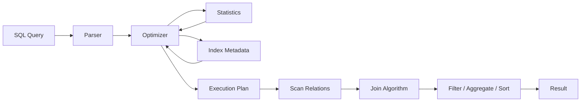
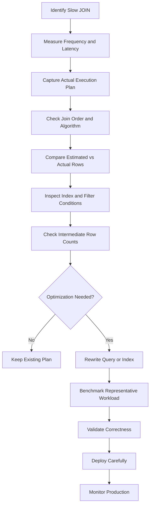

# 26- JOIN Optimization

## Overview

JOINs are often among the most expensive operations in production SQL because they combine rows from multiple relations and can amplify the amount of data processed by subsequent filters, aggregations, sorting, and application serialization.

JOIN optimization is therefore less about choosing a particular JOIN syntax and more about controlling:

- How many rows enter the join.
- How efficiently matching rows are found.
- Which join algorithm the optimizer selects.
- Whether appropriate indexes exist.
- Whether predicates are selective and searchable.
- Whether cardinality estimates are accurate.
- Whether intermediate results fit in memory.
- Whether the resulting plan remains stable as data volume changes.

A query such as:

```sql
SELECT
    o.id,
    o.total_amount,
    c.email
FROM orders AS o
JOIN customers AS c
    ON c.id = o.customer_id
WHERE o.created_at >= $1
  AND o.created_at < $2;
```

may be inexpensive with a selective timestamp predicate and suitable indexes, but become significantly more expensive if the database must process millions of orders before joining them.

The most important optimization principle is:

> **Reduce the amount of data participating in expensive operations as early as correctness allows, while providing the optimizer with useful indexes and accurate statistics.**

## Why JOIN Performance Matters

JOIN cost affects more than database execution time.

A slow JOIN can increase:

```text
Database CPU
    ↓
Longer query execution
    ↓
Connections occupied longer
    ↓
Connection pool pressure
    ↓
Higher API latency
    ↓
More concurrent requests
    ↓
Database saturation
```

In a backend service, one inefficient JOIN can therefore become a system-wide scalability problem.

This is particularly important for:

- Django ORM queries.
- FastAPI services using SQLAlchemy or async database drivers.
- Reporting APIs.
- Search endpoints.
- Admin dashboards.
- Financial transaction queries.
- Microservices backed by relational databases.
- Batch jobs and Celery workers.

## How the Database Executes a JOIN

A relational database does not necessarily execute a JOIN in the textual order written in SQL.

The optimizer can:

- Reorder joins.
- Push predicates.
- Choose different join algorithms.
- Select indexes.
- Estimate cardinalities.
- Change scan strategies.
- Materialize intermediate results when useful.

Conceptually:



The SQL statement expresses **what** data is required. The execution plan determines **how** the database retrieves it.

## JOIN Types and Performance

The logical JOIN type determines result semantics. The physical join algorithm determines execution behavior.

| Logical JOIN | Purpose | Common physical algorithms |
|---|---|---|
| `INNER JOIN` | Matching rows from both sides | Nested Loop, Hash Join, Merge Join |
| `LEFT JOIN` | All rows from left + matches from right | Nested Loop, Hash Join, Merge Join |
| `RIGHT JOIN` | All rows from right + matches from left | Nested Loop, Hash Join, Merge Join |
| `FULL OUTER JOIN` | All rows from both sides | Hash Join, Merge Join |
| `CROSS JOIN` | Cartesian product | Nested-loop-like execution |

Do not confuse:

```sql
INNER JOIN
```

with:

```text
Nested Loop Join
```

The first is a logical operation. The second is a physical execution strategy.

## Reduce Rows Before Joining

One of the highest-value JOIN optimization techniques is reducing the input relation before the join.

Suppose:

```sql
SELECT
    o.id,
    c.email
FROM orders AS o
JOIN customers AS c
    ON c.id = o.customer_id
WHERE o.status = 'completed'
  AND o.created_at >= $1;
```

If `status` and `created_at` dramatically reduce the number of orders, the optimizer can potentially filter orders before performing the expensive portion of the join.

Conceptually:

```text
Orders
  │
  ├── millions of rows
  │
  ▼
Filter
  │
  ├── thousands of rows
  │
  ▼
JOIN Customers
```

This is usually preferable to joining a much larger intermediate result.

However, do not manually force a subquery simply because it appears to "filter first." Modern optimizers can often perform predicate pushdown and join reordering automatically.

## Filtering Before JOIN

Consider:

```sql
SELECT
    o.id,
    c.email
FROM orders AS o
JOIN customers AS c
    ON c.id = o.customer_id
WHERE o.created_at >= $1
  AND o.created_at < $2;
```

The filter belongs logically to `orders`, so the optimizer can often apply it before or during the join.

An explicit derived table:

```sql
SELECT
    o.id,
    c.email
FROM (
    SELECT id, customer_id
    FROM orders
    WHERE created_at >= $1
      AND created_at < $2
) AS o
JOIN customers AS c
    ON c.id = o.customer_id;
```

is not automatically faster.

In many databases, the optimizer can transform both forms into essentially the same plan.

The execution plan matters more than SQL formatting.

## Indexing JOIN Keys

JOIN predicates should normally use compatible, indexed columns when the workload benefits from indexed access.

For:

```sql
SELECT
    o.id,
    c.email
FROM orders AS o
JOIN customers AS c
    ON c.id = o.customer_id;
```

the primary key:

```sql
customers(id)
```

is typically already indexed.

An index on:

```sql
orders(customer_id)
```

may also be important, particularly for workloads that frequently:

- Find orders for a customer.
- Join a selective set of customers to orders.
- Use `customer_id` together with additional predicates.

Example:

```sql
CREATE INDEX idx_orders_customer_id
ON orders (customer_id);
```

Indexing both sides is not an unconditional requirement. The optimizer may scan one relation sequentially and use an index on the other, or select a hash or merge strategy instead.

## Composite Indexes for JOIN + Filter Patterns

A single-column join index may not be sufficient for the complete access pattern.

Suppose the common query is:

```sql
SELECT
    o.id,
    o.total_amount
FROM orders AS o
JOIN customers AS c
    ON c.id = o.customer_id
WHERE o.customer_id = $1
  AND o.created_at >= $2
  AND o.created_at < $3;
```

A composite index may better match the query:

```sql
CREATE INDEX idx_orders_customer_created_at
ON orders (customer_id, created_at);
```

The ordering matters.

For this access pattern:

```text
customer_id = constant
        ↓
created_at range
```

the index can efficiently narrow the search space.

Index design should be driven by actual query patterns rather than by the presence of a JOIN alone.

## JOIN Key Data Types

JOIN columns should normally use compatible data types.

Avoid:

```sql
ON CAST(o.customer_id AS TEXT) = c.id
```

when the schema can instead use matching types.

For example:

```sql
customers.id       BIGINT
orders.customer_id BIGINT
```

Then:

```sql
ON customers.id = orders.customer_id
```

is preferable.

Mismatched types can:

- Introduce casts.
- Prevent efficient index access.
- Increase CPU work.
- Complicate query plans.
- Hide schema design problems.

Schema consistency is therefore part of JOIN optimization.

## Avoid Functions on JOIN Columns

Avoid unnecessary expressions such as:

```sql
ON LOWER(c.email) = LOWER(u.email)
```

when the relationship can use a canonical key.

Prefer:

```sql
ON c.id = u.customer_id
```

for relational identity.

If joining on a transformed value is a genuine requirement, consider:

- Normalized columns.
- Expression indexes.
- Generated columns.
- Appropriate specialized indexes.

The objective is to make the join key efficiently searchable.

## Join Selectivity

Join selectivity describes how many rows are expected to match between the relations.

Consider:

```text
customers: 1,000,000 rows
orders:    50,000,000 rows
```

A join:

```sql
orders.customer_id = customers.id
```

may be highly predictable if `customer_id` references a unique customer.

A join on a non-unique attribute such as:

```sql
orders.region = customers.region
```

can produce a much larger intermediate result.

If:

```text
100,000 orders
×
50,000 customers
```

share the same region values, the resulting row count can become enormous.

This can affect:

- Memory usage.
- CPU.
- Network transfer.
- Sort operations.
- Aggregation cost.
- Temporary storage.

## Avoid Accidental Many-to-Many JOINs

A common production bug is unintentionally multiplying rows.

Suppose:

```text
customers
    1
    │
    ├── many orders
    │
    └── many addresses
```

Joining both child tables directly:

```sql
SELECT
    c.id,
    o.id AS order_id,
    a.id AS address_id
FROM customers AS c
JOIN orders AS o
    ON o.customer_id = c.id
JOIN addresses AS a
    ON a.customer_id = c.id;
```

can produce:

```text
orders per customer × addresses per customer
```

rows.

For example:

```text
10 orders × 3 addresses = 30 rows
```

for one customer.

The query may be logically valid but computationally much larger than expected.

When only existence is required, `EXISTS` can be a better expression.

## `EXISTS` Instead of Unnecessary JOINs

If the requirement is:

> Find customers who have at least one completed order.

Avoid:

```sql
SELECT DISTINCT c.id
FROM customers AS c
JOIN orders AS o
    ON o.customer_id = c.id
WHERE o.status = 'completed';
```

when the order rows themselves are not required.

Prefer:

```sql
SELECT c.id
FROM customers AS c
WHERE EXISTS (
    SELECT 1
    FROM orders AS o
    WHERE o.customer_id = c.id
      AND o.status = 'completed'
);
```

`EXISTS` expresses the actual requirement: whether a matching row exists.

Depending on the optimizer and indexes, it can stop looking once a qualifying row is found.

An index such as:

```sql
CREATE INDEX idx_orders_customer_status
ON orders (customer_id, status);
```

may support this access pattern effectively.

## `IN` Versus `EXISTS`

For semantically compatible queries, modern optimizers can often transform:

```sql
WHERE customer_id IN (...)
```

and:

```sql
WHERE EXISTS (...)
```

into similar plans.

Do not rely on simplistic rules such as:

> `EXISTS` is always faster than `IN`.

Performance depends on:

- Data distribution.
- Query shape.
- Correlation.
- NULL semantics.
- Database engine.
- Available indexes.
- Statistics.

Use the construct that expresses the intended semantics and verify the resulting plan.

## Eliminate Unnecessary JOINs

A JOIN that does not contribute columns or filtering can be unnecessary.

For example:

```sql
SELECT
    o.id,
    o.total_amount
FROM orders AS o
JOIN customers AS c
    ON c.id = o.customer_id;
```

If no customer column or customer predicate is required, the JOIN may serve no purpose.

Prefer:

```sql
SELECT
    o.id,
    o.total_amount
FROM orders AS o;
```

Removing unnecessary relations reduces optimizer complexity and can eliminate unnecessary work.

In some cases, however, a JOIN may intentionally enforce relational existence or interact with security/business rules, so removal must preserve semantics.

## `SELECT *` and JOIN Width

Avoid:

```sql
SELECT *
FROM orders AS o
JOIN customers AS c
    ON c.id = o.customer_id;
```

when only a few columns are needed.

JOINs can produce wide intermediate tuples.

Prefer:

```sql
SELECT
    o.id,
    o.total_amount,
    c.email
FROM orders AS o
JOIN customers AS c
    ON c.id = o.customer_id;
```

Reducing selected columns can lower:

- Memory usage.
- Network transfer.
- Serialization cost.
- Application CPU.

It does not automatically eliminate all database-side work, but it is an important part of controlling result width.

## Nested Loop JOIN Optimization

Nested Loop joins can be extremely efficient when one input is small and the other side can be accessed efficiently.

Conceptually:

```text
Outer relation
     │
     ├── row 1 ──→ index lookup
     ├── row 2 ──→ index lookup
     ├── row 3 ──→ index lookup
     └── ...
```

For:

```sql
SELECT
    o.id,
    c.email
FROM orders AS o
JOIN customers AS c
    ON c.id = o.customer_id
WHERE o.id = $1;
```

the outer side may contain one order, followed by an indexed lookup into `customers`.

This can be extremely cheap.

The same strategy can become expensive when the outer side contains millions of rows.

JOIN optimization therefore requires understanding the **outer relation cardinality**, not simply whether an index exists.

## Hash JOIN Optimization

Hash joins are often useful when joining larger unsorted inputs using equality predicates.

Conceptually:

```text
Build relation
     ↓
Hash table
     ↓
Probe relation
     ↓
Matching rows
```

For:

```sql
SELECT
    o.id,
    c.email
FROM orders AS o
JOIN customers AS c
    ON c.id = o.customer_id;
```

the database may build a hash structure from one side and probe it with rows from the other.

Hash joins can be efficient for large equality joins, but memory becomes important.

If the hash table cannot fit comfortably in the configured memory budget, the database may spill work to temporary storage, increasing latency.

## Merge JOIN Optimization

Merge joins work efficiently when both inputs are available in compatible sorted order.

Conceptually:

```text
Sorted A ───────┐
                ├──→ Merge
Sorted B ───────┘
```

They can be attractive when:

- Inputs are already sorted.
- Suitable indexes provide ordered access.
- Large relations need to be joined.
- Equality join conditions are available.

The cost of producing sorted inputs must be included in the overall plan.

A merge join is not automatically faster than a hash join or nested loop.

## JOIN Order

SQL does not guarantee that the database executes joins in the textual order written.

For example:

```sql
FROM a
JOIN b ON ...
JOIN c ON ...
```

does not necessarily mean:

```text
A → B → C
```

The optimizer may choose:

```text
B → C → A
```

if that is cheaper.

For complex queries, join order becomes increasingly important because intermediate row counts can differ dramatically.

Good statistics help the optimizer make these decisions.

## Cardinality Estimates and JOINs

Suppose the optimizer estimates:

```text
Estimated rows: 100
```

but the query actually produces:

```text
Actual rows: 5,000,000
```

The selected join strategy may be completely inappropriate.

For example:

```text
Expected small input
        ↓
Nested Loop chosen
        ↓
Actual input is huge
        ↓
Millions of repeated lookups
        ↓
High latency
```

This is why JOIN optimization is tightly connected to:

- Database statistics.
- Cardinality estimation.
- Data distribution.
- Histograms.
- Correlation.
- ANALYZE operations.

When the estimated and actual row counts differ significantly, investigate statistics before blindly adding indexes.

## Predicate Pushdown

Predicates that restrict one relation should be applied as early as possible when semantics allow.

Example:

```sql
SELECT
    o.id,
    c.email
FROM orders AS o
JOIN customers AS c
    ON c.id = o.customer_id
WHERE o.status = 'completed';
```

The database can often push:

```sql
o.status = 'completed'
```

toward the `orders` scan.

Conceptually:

```text
Orders
  ↓
status = completed
  ↓
Small relation
  ↓
JOIN
```

This reduces the number of rows entering the JOIN.

Predicate pushdown is usually an optimizer responsibility, but query structure can affect whether transformations are possible.

## Filtering the Correct Side

Suppose:

```sql
SELECT
    o.id,
    c.email
FROM orders AS o
JOIN customers AS c
    ON c.id = o.customer_id
WHERE c.country = 'IN';
```

The predicate targets `customers`.

If `country = 'IN'` reduces one million customers to fifty thousand, the optimizer may benefit from filtering customers before or during the join.

An index such as:

```sql
CREATE INDEX idx_customers_country_id
ON customers (country, id);
```

may be useful for this access pattern, depending on the broader workload.

Index design should account for both:

```text
Filtering
+
Joining
```

rather than considering them independently.

## CTEs and JOIN Optimization

Common Table Expressions can improve readability:

```sql
WITH recent_orders AS (
    SELECT id, customer_id
    FROM orders
    WHERE created_at >= $1
)
SELECT
    o.id,
    c.email
FROM recent_orders AS o
JOIN customers AS c
    ON c.id = o.customer_id;
```

Whether this improves performance depends on the database and query.

Modern PostgreSQL versions can inline many CTEs when appropriate, while explicit materialization can also be requested:

```sql
WITH recent_orders AS MATERIALIZED (
    SELECT id, customer_id
    FROM orders
    WHERE created_at >= $1
)
...
```

Do not use CTEs as a generic performance trick.

Use them for:

- Readability.
- Reusing expensive intermediate results.
- Explicit materialization when justified.
- Complex query structure.

Then inspect the plan.

## JOINs and Aggregation

JOINs can multiply rows before aggregation.

Consider:

```sql
SELECT
    c.id,
    COUNT(o.id)
FROM customers AS c
LEFT JOIN orders AS o
    ON o.customer_id = c.id
GROUP BY c.id;
```

This is valid, but the database may process many order rows before producing the aggregate.

For certain workloads, pre-aggregation can reduce the amount of data participating in subsequent joins:

```sql
SELECT
    c.id,
    COALESCE(o.order_count, 0) AS order_count
FROM customers AS c
LEFT JOIN (
    SELECT
        customer_id,
        COUNT(*) AS order_count
    FROM orders
    GROUP BY customer_id
) AS o
    ON o.customer_id = c.id;
```

This is not universally faster. The optimizer may already find an equivalent or better plan.

The important principle is:

> **Optimize the size of intermediate results, not merely the final result.**

## Partitioning and JOINs

Large tables may benefit from partitioning when queries contain partition-prunable predicates.

For example:

```text
orders
├── orders_2026_08
├── orders_2026_09
└── orders_2026_10
```

A query restricted to September may only need relevant partitions if the database can prune the others.

However, partitioning does not automatically optimize arbitrary JOINs.

Good partitioning requires alignment between:

- Partition key.
- Query predicates.
- Data lifecycle.
- Maintenance strategy.

Do not partition a table simply because it is large.

## Foreign Keys and JOIN Performance

Foreign keys enforce referential integrity but do not automatically create every index required for efficient querying.

For:

```sql
orders.customer_id → customers.id
```

the referenced primary key is normally indexed.

The referencing column:

```sql
orders.customer_id
```

may also need an index for common workloads.

This is particularly useful for:

- Customer → orders queries.
- Cascading operations.
- Parent/child lookups.
- Join-heavy APIs.

Constraint design and index design should be considered together.

## Practical PostgreSQL Example

Consider:

```sql
SELECT
    o.id,
    o.total_amount,
    c.email
FROM orders AS o
JOIN customers AS c
    ON c.id = o.customer_id
WHERE o.status = 'completed'
  AND o.created_at >= $1
  AND o.created_at < $2
  AND c.country = $3;
```

Potential supporting indexes might include:

```sql
CREATE INDEX idx_orders_status_created_customer
ON orders (status, created_at, customer_id);

CREATE INDEX idx_customers_country_id
ON customers (country, id);
```

Whether these indexes are optimal depends on:

- Selectivity of `status`.
- Selectivity of `created_at`.
- Selectivity of `country`.
- Table sizes.
- Query frequency.
- Write volume.
- Existing indexes.
- PostgreSQL statistics.
- Other queries using the same tables.

Adding both indexes without measurement can make writes more expensive without improving the target query.

## Query Plan Inspection

For PostgreSQL:

```sql
EXPLAIN (ANALYZE, BUFFERS)
SELECT
    o.id,
    o.total_amount,
    c.email
FROM orders AS o
JOIN customers AS c
    ON c.id = o.customer_id
WHERE o.status = 'completed'
  AND o.created_at >= TIMESTAMPTZ '2026-09-01 00:00:00+00'
  AND o.created_at < TIMESTAMPTZ '2026-09-02 00:00:00+00'
  AND c.country = 'IN';
```

Inspect:

- Join algorithm.
- Join order.
- Estimated rows.
- Actual rows.
- Index conditions.
- Filters.
- Buffers.
- Sort operations.
- Hash memory.
- Temporary reads/writes.
- Execution time.

A useful diagnostic table is:

| Observation | Possible cause |
|---|---|
| Huge actual vs estimated rows | Stale/inadequate statistics or data correlation |
| Nested Loop with huge outer input | Poor cardinality estimate or missing access path |
| Large sequential scan | Low selectivity, missing index, or optimizer decision |
| Hash spill to disk | Insufficient memory for hash operation or large intermediate data |
| Large sort before JOIN | Required ordering not available cheaply |
| High rows removed by filter | Predicate applied later than ideal or low selectivity |
| Repeated index lookups | Nested Loop over a large outer relation |
| Huge intermediate row count | Many-to-many relationship or insufficient filtering |

## Backend ORM Considerations

### Django

Django can accidentally create expensive JOINs through relationship traversal:

```python
orders = Order.objects.filter(
    customer__country="IN",
    status="completed",
)
```

The generated SQL should be inspected for high-volume endpoints.

Use:

```python
queryset.query
```

for SQL inspection during development, and database-level execution plans for actual performance analysis.

For object loading, also distinguish between:

```python
select_related()
```

and:

```python
prefetch_related()
```

`select_related()` uses SQL JOINs for suitable single-valued relationships, while `prefetch_related()` generally performs separate queries and combines results in application memory.

The right choice depends on:

- Relationship cardinality.
- Number of objects.
- Required columns.
- Query count.
- Result size.

### FastAPI and SQLAlchemy

With SQLAlchemy, eager-loading strategies can alter database access patterns.

For example:

```python
from sqlalchemy import select

stmt = (
    select(Order)
    .join(Order.customer)
    .where(Order.status == "completed")
)
```

The generated SQL should still be analyzed at the database level.

ORM abstractions do not remove the need to understand:

- Join cardinality.
- Indexes.
- Query plans.
- Result width.
- Number of round trips.

## JOINs Versus Multiple Queries

Do not assume:

> One SQL query is always faster than multiple SQL queries.

A single query may create a huge Cartesian-like intermediate result, while two focused queries may be substantially cheaper.

Conversely, replacing one efficient JOIN with multiple application queries can create an N+1 query problem.

The decision should consider:

- Number of round trips.
- Data volume.
- Join cardinality.
- Network latency.
- Connection usage.
- Application memory.
- Consistency requirements.
- Transaction boundaries.

For example:

```text
Efficient JOIN
    ↓
1 database round trip
    ↓
Small result
```

is usually preferable to:

```text
1,000 parent rows
    ↓
1,000 individual child queries
    ↓
N+1 database round trips
```

## Production Pitfalls

### Indexing Every JOIN Column

Not every JOIN requires an index on every participating column.

Indexes have:

- Storage cost.
- Write cost.
- Vacuum/maintenance cost.
- Cache pressure.

Create indexes based on real access patterns.

### Ignoring Data Distribution

A query that performs well with:

```text
10,000 customers
```

may behave very differently with:

```text
100,000,000 customers
```

Benchmark against production-like cardinalities and distributions.

### Using `DISTINCT` to Hide Duplicate JOINs

This pattern is often suspicious:

```sql
SELECT DISTINCT c.id
FROM customers AS c
JOIN orders AS o
    ON o.customer_id = c.id;
```

If the actual requirement is existence, use:

```sql
SELECT c.id
FROM customers AS c
WHERE EXISTS (
    SELECT 1
    FROM orders AS o
    WHERE o.customer_id = c.id
);
```

`DISTINCT` may introduce additional sorting or hashing and can hide an underlying cardinality problem.

### Joining Before Filtering

Do not assume the optimizer will always rescue a poorly structured query.

Complex expressions, views, aggregation, window functions, outer joins, and other semantic constraints can limit transformations.

Inspect the plan.

### Ignoring Result Width

Returning dozens of columns from several joined tables can increase memory and network costs even when the row count is reasonable.

### Ignoring ORM-Generated JOINs

A simple ORM relationship traversal can produce SQL significantly more complex than the application code suggests.

Always inspect high-value queries.

## Monitoring JOIN Performance

Production monitoring should focus on query behavior rather than isolated SQL statements.

Track:

- Query latency.
- Calls per query.
- Rows returned.
- Rows processed.
- Buffer reads.
- Temporary I/O.
- Database CPU.
- Lock waits.
- Connection utilization.
- Query error rates.

For PostgreSQL, `pg_stat_statements` is particularly useful for identifying frequently executed and expensive query patterns.

A useful operational metric is:

```text
Total database time
=
query execution time × execution frequency
```

A moderately expensive JOIN executed millions of times may deserve more attention than a very expensive analytical query executed once per day.

## Scalability Guidance

For high-scale JOIN-heavy workloads:

- Keep join keys type-compatible.
- Index common filter and join paths.
- Keep predicates searchable.
- Reduce unnecessary columns.
- Avoid accidental many-to-many multiplication.
- Use `EXISTS` when existence is the actual requirement.
- Maintain current statistics.
- Watch hash and sort memory usage.
- Consider partitioning for genuinely suitable large-table workloads.
- Consider read replicas for appropriate read-heavy workloads.
- Cache stable, high-frequency results when justified.
- Avoid N+1 access patterns in ORM-based applications.

At larger scale, database design may need to evolve beyond query tuning:

```text
Normalized relational model
        ↓
Indexes + query optimization
        ↓
Caching
        ↓
Read replicas
        ↓
Partitioning
        ↓
Precomputed / materialized data
        ↓
Service-specific data models
```

These are architectural decisions, not substitutes for fixing inefficient SQL.

## Security Considerations

JOIN optimization should never compromise query safety.

Always parameterize dynamic values:

```sql
SELECT
    o.id,
    c.email
FROM orders AS o
JOIN customers AS c
    ON c.id = o.customer_id
WHERE c.country = $1;
```

Avoid constructing SQL by concatenating request parameters.

For example, application code should pass:

```text
country = "IN"
```

as a parameter rather than interpolating it into SQL text.

Performance optimization and SQL injection prevention should be treated as independent requirements: both must be satisfied.

## Cost Considerations

In cloud-hosted databases, inefficient JOINs can increase infrastructure cost through:

- Higher CPU utilization.
- Higher storage I/O.
- Larger instance requirements.
- More replicas.
- Increased temporary storage usage.
- Longer-running workloads.

For AWS-hosted PostgreSQL, reducing database work can sometimes defer vertical scaling or reduce replica requirements.

However, adding indexes also has costs.

The production decision should therefore consider:

```text
Read performance benefit
        vs
Storage + write + maintenance cost
```

## JOIN Optimization Workflow

A repeatable workflow is more valuable than memorizing isolated SQL tricks.



A practical sequence is:

1. Identify the expensive query from production telemetry.
2. Capture the actual execution plan.
3. Inspect join order and physical join algorithm.
4. Compare estimated and actual cardinalities.
5. Check filtering and predicate pushdown.
6. Check indexes on join and filter paths.
7. Look for accidental row multiplication.
8. Consider `EXISTS` when only existence is required.
9. Reduce unnecessary columns and relations.
10. Benchmark the candidate change.
11. Validate correctness and concurrency behavior.
12. Deploy and monitor the production plan.

## Interview Traps

| Question | Strong answer |
|---|---|
| Does an `INNER JOIN` mean Nested Loop? | No. `INNER JOIN` is a logical operation; Nested Loop, Hash Join, and Merge Join are physical strategies. |
| Should every JOIN column be indexed? | No. Indexes should match actual access patterns and workload characteristics. |
| Is a Nested Loop always bad? | No. It can be extremely efficient when the outer relation is small and the inner side has an efficient lookup path. |
| Is Hash Join always faster for large tables? | No. The optimizer must consider cardinality, memory, sorting, indexes, and data distribution. |
| Why can a JOIN suddenly become slow after data growth? | Cardinality and data distribution changed, potentially making the previous plan or access strategy inappropriate. |
| Why can `DISTINCT` be a JOIN smell? | It can hide row multiplication instead of expressing the actual existence or relationship requirement. |
| When is `EXISTS` preferable to a JOIN? | When the query only needs to know whether a related row exists and does not need columns from that relation. |
| Does SQL JOIN order determine execution order? | Generally no; the optimizer can reorder joins when semantics permit. |
| What is the first thing to inspect in a slow JOIN? | The actual execution plan, especially estimated versus actual rows, join algorithm, join order, and I/O. |
| Can one query be slower than two queries? | Yes. A poorly shaped JOIN can create large intermediate results; multiple focused queries can sometimes be cheaper, although N+1 patterns must be avoided. |

## Key Takeaways

- **JOIN optimization is primarily about controlling intermediate row counts, providing useful access paths, and allowing the optimizer to choose an appropriate physical join strategy.**
- **Do not confuse logical JOIN types with physical algorithms such as Nested Loop, Hash Join, and Merge Join; the optimizer chooses the execution strategy.**
- **Indexes should support real filter-and-join access patterns, while compatible join-key types and accurate statistics are essential for reliable plans.**
- **Watch for accidental many-to-many row multiplication, unnecessary JOINs, and `DISTINCT` used to hide duplicate results; use `EXISTS` when existence is the actual requirement.**
- **For production optimization, compare estimated versus actual cardinalities, inspect execution plans, benchmark realistic workloads, and validate the change under real concurrency and data distributions.**