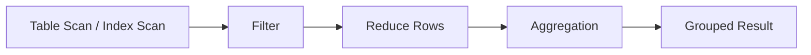
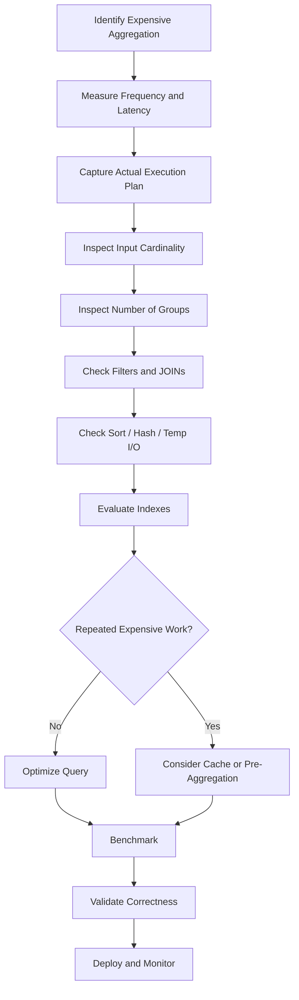

# 27- Aggregation Optimization

## Overview

Aggregation operations such as `COUNT`, `SUM`, `AVG`, `MIN`, `MAX`, `GROUP BY`, and `HAVING` are common sources of database CPU, memory, sorting, and I/O pressure. They become particularly expensive when applied to large relations, high-cardinality grouping keys, or large intermediate results produced by JOINs.

Aggregation optimization is primarily about reducing the amount of data that must be processed while preserving correctness.

The main optimization levers are:

- Filter rows before aggregation.
- Avoid unnecessary JOIN multiplication.
- Group only by required columns.
- Use appropriate indexes for filtering and grouping patterns.
- Avoid unnecessary `DISTINCT`.
- Pre-aggregate data when the same expensive computation is repeatedly requested.
- Use partitioning when it enables effective partition pruning.
- Keep statistics current so the optimizer can choose appropriate plans.
- Inspect memory usage, sorting, hashing, and temporary I/O.
- Measure the complete workload rather than optimizing a query in isolation.

A useful mental model is:

```text
Large input
    ↓
Filter early
    ↓
Reduce rows
    ↓
Reduce columns
    ↓
Aggregate
    ↓
Small result
```

The goal is not to make every aggregation use an index. The goal is to minimize total work required to produce the correct result.

## Why Aggregation Becomes Expensive

Consider:

```sql
SELECT
    customer_id,
    SUM(total_amount)
FROM orders
GROUP BY customer_id;
```

If `orders` contains 100 million rows, the database may need to inspect a substantial portion of the table even though the final result contains only one row per customer.

Aggregation cost can come from:

- Reading input rows.
- Evaluating predicates.
- Building hash tables.
- Sorting rows.
- Maintaining aggregate state.
- Spilling intermediate data to disk.
- Processing rows generated by JOINs.
- Transferring large results to the application.

In production, aggregation latency can also consume database connections for longer periods, increasing pressure on connection pools and affecting unrelated API requests.

## Logical Aggregation Versus Physical Execution

SQL describes the required result:

```sql
SELECT
    customer_id,
    COUNT(*)
FROM orders
GROUP BY customer_id;
```

The database optimizer determines how to execute it.

Common physical strategies include:

- Hash aggregation.
- Sort-based aggregation.
- Partial aggregation.
- Parallel aggregation.
- Index-assisted access paths.
- Precomputed or materialized data in some architectures.

Conceptually:



The best strategy depends on:

- Input cardinality.
- Number of groups.
- Available memory.
- Ordering of the input.
- Predicate selectivity.
- Parallelism.
- Database engine.
- Statistics.

## Filter Before Aggregating

Filtering is usually one of the most effective ways to reduce aggregation cost.

Instead of aggregating the entire table:

```sql
SELECT
    customer_id,
    SUM(total_amount)
FROM orders
GROUP BY customer_id;
```

a time-bounded API may only require recent orders:

```sql
SELECT
    customer_id,
    SUM(total_amount)
FROM orders
WHERE created_at >= $1
  AND created_at < $2
GROUP BY customer_id;
```

This can dramatically reduce the input cardinality.

A suitable index may help the database locate the relevant rows:

```sql
CREATE INDEX idx_orders_created_customer
ON orders (created_at, customer_id);
```

The optimal index depends on the actual workload and selectivity.

## `WHERE` Versus `HAVING`

Use `WHERE` to filter rows **before** aggregation:

```sql
SELECT
    customer_id,
    SUM(total_amount) AS revenue
FROM orders
WHERE status = 'completed'
GROUP BY customer_id;
```

Use `HAVING` to filter **groups after** aggregation:

```sql
SELECT
    customer_id,
    SUM(total_amount) AS revenue
FROM orders
WHERE status = 'completed'
GROUP BY customer_id
HAVING SUM(total_amount) > 10000;
```

This distinction matters because:

```text
WHERE
  ↓
fewer input rows
  ↓
GROUP BY
  ↓
fewer groups
  ↓
HAVING
```

Moving a condition from `HAVING` to `WHERE` is only valid when the condition has equivalent row-level semantics.

For example, this:

```sql
HAVING status = 'completed'
```

should generally be expressed as:

```sql
WHERE status = 'completed'
```

when `status` is not itself part of the grouping semantics.

## Hash Aggregation

Hash aggregation maintains an in-memory hash table keyed by the grouping columns.

For:

```sql
SELECT
    customer_id,
    SUM(total_amount)
FROM orders
GROUP BY customer_id;
```

the conceptual process is:

```text
Input row
   ↓
customer_id
   ↓
Hash lookup
   ↓
Existing group?
 ┌─┴───────────┐
Yes            No
 ↓              ↓
Update sum    Create group
```

Hash aggregation is attractive when:

- Input does not already have useful ordering.
- The number of groups is manageable.
- Sufficient memory is available.

Its major risk is memory consumption.

A high-cardinality grouping key such as:

```sql
GROUP BY request_id
```

may create millions of groups.

If the aggregation cannot remain in memory, the database may spill intermediate data to temporary storage.

## Sort-Based Aggregation

A database can also sort rows by grouping keys and aggregate consecutive rows.

Conceptually:

```text
Input
  ↓
Sort by customer_id
  ↓
customer A
customer A
customer A
customer B
customer B
  ↓
Aggregate consecutive groups
```

Sorting can be expensive for large datasets.

If the input is already available in the required order, however, the database may avoid or reduce sorting work.

This is one reason indexes that provide useful ordering can sometimes help aggregation.

## Hash Aggregation Versus Sort-Based Aggregation

| Strategy | Strength | Main cost |
|---|---|---|
| Hash aggregation | Efficient for unsorted input and manageable group counts | Memory usage |
| Sort-based aggregation | Useful when input is already ordered | Sorting cost |
| Parallel aggregation | Distributes work across workers | Coordination and memory overhead |
| Pre-aggregation | Avoids repeatedly processing raw data | Freshness and maintenance complexity |

The optimizer chooses based on estimated cost. Do not force a strategy without evidence.

## `COUNT(*)`, `COUNT(column)`, and `COUNT(DISTINCT)`

These expressions have different semantics and potentially different costs.

```sql
COUNT(*)
```

counts rows.

```sql
COUNT(email)
```

counts non-NULL values of `email`.

```sql
COUNT(DISTINCT customer_id)
```

counts unique non-NULL values.

`COUNT(DISTINCT ...)` can require substantially more work because the database must identify unique values.

For example:

```sql
SELECT COUNT(DISTINCT customer_id)
FROM orders;
```

may require substantial hashing or sorting for a large table.

Do not replace `COUNT(DISTINCT ...)` with `COUNT(*)` simply for performance. The semantics are different.

## Avoid Unnecessary `DISTINCT`

A common performance problem is using `DISTINCT` to compensate for JOIN multiplication:

```sql
SELECT DISTINCT
    c.id
FROM customers AS c
JOIN orders AS o
    ON o.customer_id = c.id;
```

If the requirement is:

> Return customers that have at least one order.

prefer:

```sql
SELECT c.id
FROM customers AS c
WHERE EXISTS (
    SELECT 1
    FROM orders AS o
    WHERE o.customer_id = c.id
);
```

`DISTINCT` can require additional hashing or sorting and may hide an underlying query-shape problem.

## Aggregation After JOINs

JOINs can dramatically increase the number of rows that aggregation must process.

Consider:

```sql
SELECT
    c.id,
    COUNT(o.id)
FROM customers AS c
JOIN orders AS o
    ON o.customer_id = c.id
GROUP BY c.id;
```

The database must process order rows before producing customer-level aggregates.

Now consider multiple one-to-many relationships:

```text
customer
   ├── orders
   └── payments
```

A query joining both child tables can multiply rows:

```text
orders × payments
```

before aggregation.

This can produce incorrect counts and unnecessary work.

For example:

```text
10 orders × 5 payments = 50 intermediate rows
```

even though the desired output may contain one row for the customer.

## Pre-Aggregating Before a JOIN

When row multiplication is a concern, aggregate each child relation first.

Instead of:

```sql
SELECT
    c.id,
    COUNT(o.id),
    COUNT(p.id)
FROM customers AS c
LEFT JOIN orders AS o
    ON o.customer_id = c.id
LEFT JOIN payments AS p
    ON p.customer_id = c.id
GROUP BY c.id;
```

use:

```sql
SELECT
    c.id,
    COALESCE(o.order_count, 0) AS order_count,
    COALESCE(p.payment_count, 0) AS payment_count
FROM customers AS c
LEFT JOIN (
    SELECT
        customer_id,
        COUNT(*) AS order_count
    FROM orders
    GROUP BY customer_id
) AS o
    ON o.customer_id = c.id
LEFT JOIN (
    SELECT
        customer_id,
        COUNT(*) AS payment_count
    FROM payments
    GROUP BY customer_id
) AS p
    ON p.customer_id = c.id;
```

This changes the data flow from:

```text
orders × payments
        ↓
aggregation
```

to:

```text
orders → aggregate ──┐
                     ├──→ customer
payments → aggregate ┘
```

Whether the rewritten form is faster depends on the optimizer and workload, but it is an important technique for controlling intermediate cardinality.

## Conditional Aggregation

Conditional aggregation can replace multiple scans or multiple application-side queries.

Example:

```sql
SELECT
    customer_id,
    COUNT(*) AS total_orders,
    COUNT(*) FILTER (
        WHERE status = 'completed'
    ) AS completed_orders,
    COUNT(*) FILTER (
        WHERE status = 'cancelled'
    ) AS cancelled_orders
FROM orders
GROUP BY customer_id;
```

This can produce multiple metrics in one aggregation pass.

For databases without `FILTER`, equivalent `CASE` expressions are commonly used:

```sql
SELECT
    customer_id,
    COUNT(*) AS total_orders,
    SUM(
        CASE
            WHEN status = 'completed' THEN 1
            ELSE 0
        END
    ) AS completed_orders
FROM orders
GROUP BY customer_id;
```

This is often preferable to issuing separate queries for each status.

## Grouping by High-Cardinality Columns

Grouping cost is strongly affected by the number of distinct groups.

Compare:

```sql
GROUP BY country
```

with:

```sql
GROUP BY request_id
```

If there are:

```text
10 countries
```

the aggregation state is small.

If there are:

```text
50 million request IDs
```

the aggregation state can become extremely large.

Before grouping, ask:

- How many distinct groups are expected?
- Can the grouping key be reduced?
- Is the grouping actually required?
- Can data be pre-aggregated?
- Can the result be computed from a summary table?

High cardinality is a key factor in aggregation memory usage.

## Composite Grouping Keys

Grouping by multiple columns increases the number of possible groups:

```sql
SELECT
    customer_id,
    date_trunc('day', created_at) AS day,
    SUM(total_amount)
FROM orders
GROUP BY
    customer_id,
    date_trunc('day', created_at);
```

This may be necessary for reporting, but it can generate a large number of groups.

For high-volume analytical workloads, consider:

- Pre-aggregated daily tables.
- Materialized views.
- Partitioning.
- Data warehouse systems.
- Incremental aggregation.

Do not move analytical workloads into a transactional database without considering their impact on OLTP traffic.

## Indexes and Aggregation

Indexes can help aggregation indirectly by making filtering cheaper or providing useful ordering.

Consider:

```sql
SELECT
    customer_id,
    SUM(total_amount)
FROM orders
WHERE created_at >= $1
  AND created_at < $2
GROUP BY customer_id;
```

An index beginning with:

```text
created_at
```

may help identify the relevant time range.

An index such as:

```sql
CREATE INDEX idx_orders_created_customer
ON orders (created_at, customer_id);
```

may also provide ordered access by `customer_id` within the selected range, depending on the database and execution plan.

However, an index is not automatically beneficial for a full-table aggregation.

If the query needs most of the table, a sequential scan can be cheaper than random index access.

## Covering Indexes

When a query needs only columns available in an index, some database engines can reduce table access.

For example:

```sql
CREATE INDEX idx_orders_customer_created_amount
ON orders (customer_id, created_at)
INCLUDE (total_amount);
```

For a query such as:

```sql
SELECT
    customer_id,
    SUM(total_amount)
FROM orders
WHERE created_at >= $1
GROUP BY customer_id;
```

the index may potentially provide all required columns.

In PostgreSQL, this can enable an index-only scan when visibility-map and other conditions allow it.

However:

> **An index-only scan is not guaranteed merely because the index contains all referenced columns.**

Always inspect the actual plan.

## Filtering and Partial Indexes

For workloads dominated by a stable predicate, a partial index can reduce index size.

Example:

```sql
CREATE INDEX idx_orders_completed_customer_created
ON orders (customer_id, created_at)
WHERE status = 'completed';
```

This can be useful for queries such as:

```sql
SELECT
    customer_id,
    SUM(total_amount)
FROM orders
WHERE status = 'completed'
  AND created_at >= $1
GROUP BY customer_id;
```

Partial indexes are workload-specific.

They are most useful when:

- The predicate is selective.
- The workload repeatedly uses the same predicate.
- The indexed subset is substantially smaller than the table.

They should not be created indiscriminately.

## Predicate Pushdown

The database should ideally eliminate irrelevant rows before aggregation.

For:

```sql
SELECT
    customer_id,
    SUM(total_amount)
FROM orders
WHERE created_at >= $1
GROUP BY customer_id;
```

the desired data flow is:

```text
Orders
  ↓
created_at filter
  ↓
Relevant rows
  ↓
GROUP BY customer_id
  ↓
SUM
```

not:

```text
Orders
  ↓
GROUP BY all historical rows
  ↓
Filter result
```

The optimizer can perform predicate pushdown automatically in many cases.

Complex views, outer joins, functions, aggregation boundaries, and other SQL constructs can constrain optimization opportunities.

## Aggregation and Window Functions

`GROUP BY` and window functions solve different problems.

`GROUP BY` reduces rows:

```sql
SELECT
    customer_id,
    SUM(total_amount)
FROM orders
GROUP BY customer_id;
```

A window function retains individual rows:

```sql
SELECT
    id,
    customer_id,
    total_amount,
    SUM(total_amount) OVER (
        PARTITION BY customer_id
    ) AS customer_total
FROM orders;
```

The window-function version can process significantly more output rows because it preserves every order.

Use `GROUP BY` when row reduction is required.

Use window functions when per-row detail and aggregate context are both required.

## Aggregation and `ORDER BY`

Sorting an aggregated result can introduce additional work:

```sql
SELECT
    customer_id,
    SUM(total_amount) AS revenue
FROM orders
GROUP BY customer_id
ORDER BY revenue DESC;
```

The database must produce grouped results and then order them by the aggregate value.

If there are millions of groups, sorting those groups can be expensive.

If the API only needs the top results:

```sql
SELECT
    customer_id,
    SUM(total_amount) AS revenue
FROM orders
GROUP BY customer_id
ORDER BY revenue DESC
LIMIT 100;
```

the optimizer may use a more efficient top-N strategy depending on the database.

The important distinction is:

```text
Aggregate millions of rows
    ↓
Potentially millions of groups
    ↓
Sort groups
    ↓
Return 100
```

`LIMIT` does not necessarily mean the database only processes 100 source groups.

## Aggregation and `LIMIT`

This query:

```sql
SELECT
    customer_id,
    COUNT(*)
FROM orders
GROUP BY customer_id
LIMIT 100;
```

does not mean:

> Count orders for only 100 customers.

The database generally needs to determine the grouped result before applying the final `LIMIT`.

If the requirement is to aggregate a known subset of customers, filter that subset explicitly.

For example:

```sql
SELECT
    customer_id,
    COUNT(*)
FROM orders
WHERE customer_id = ANY($1)
GROUP BY customer_id;
```

This can dramatically reduce the amount of input processed.

## Parallel Aggregation

Large aggregations can sometimes benefit from parallel execution.

Conceptually:

```text
             Orders
                │
       ┌────────┼────────┐
       ▼        ▼        ▼
    Worker 1 Worker 2 Worker 3
       │        │        │
       └────────┼────────┘
                ▼
        Partial Aggregates
                ↓
         Final Aggregate
```

Parallel aggregation can improve throughput for sufficiently large workloads.

It is not always beneficial because parallel execution introduces:

- Worker startup cost.
- Additional memory consumption.
- Coordination overhead.
- CPU contention.
- Potential impact on other database workloads.

For latency-sensitive OLTP systems, aggressively parallelizing queries can hurt overall system throughput.

## Pre-Aggregation

If an expensive aggregation is requested repeatedly, recomputing it from raw data may be wasteful.

For example:

```sql
SELECT
    customer_id,
    date_trunc('day', created_at) AS day,
    SUM(total_amount)
FROM orders
GROUP BY
    customer_id,
    date_trunc('day', created_at);
```

If thousands of API requests repeatedly request the same daily totals, a summary table may be more appropriate:

```text
orders
   ↓
Aggregation job
   ↓
daily_customer_metrics
   ↓
API
```

A summary table might contain:

```text
customer_id
date
order_count
total_revenue
```

The trade-off is:

| Approach | Benefit | Cost |
|---|---|---|
| Aggregate raw data | Always derives from source data | Expensive at query time |
| Cache result | Very fast reads | Invalidation complexity |
| Summary table | Predictable query performance | Maintenance complexity |
| Materialized view | Database-managed precomputation | Refresh/freshness trade-offs |
| Data warehouse | Scales analytical workloads | Additional infrastructure |

Pre-aggregation is especially useful for dashboards, reporting APIs, and recurring business metrics.

## Incremental Aggregation

For very high-volume systems, summary data can sometimes be updated incrementally.

For example:

```text
New order
   ↓
Transactional write
   ↓
Event / Kafka
   ↓
Aggregation consumer
   ↓
Daily customer metrics
```

A Kafka or Celery-based pipeline can maintain derived metrics without repeatedly scanning the entire orders table.

This introduces distributed-systems concerns:

- Event ordering.
- Duplicate events.
- Idempotency.
- Late-arriving events.
- Reprocessing.
- Backfills.
- Consistency between source and derived data.

Use this architecture only when query-time aggregation is no longer appropriate.

## Materialized Views

For PostgreSQL and similar relational systems, materialized views can precompute expensive aggregations.

Example:

```sql
CREATE MATERIALIZED VIEW daily_customer_revenue AS
SELECT
    customer_id,
    date_trunc('day', created_at)::date AS day,
    COUNT(*) AS order_count,
    SUM(total_amount) AS revenue
FROM orders
WHERE status = 'completed'
GROUP BY
    customer_id,
    date_trunc('day', created_at)::date;
```

Queries can then operate against the smaller materialized result:

```sql
SELECT
    customer_id,
    revenue
FROM daily_customer_revenue
WHERE day >= $1
  AND day < $2;
```

The main limitation is freshness.

A materialized view represents the state at its last refresh rather than necessarily reflecting every committed transaction immediately.

## Partitioning and Aggregation

Partitioning can reduce aggregation work when predicates align with the partition key.

For example:

```text
orders
├── orders_2026_07
├── orders_2026_08
└── orders_2026_09
```

A query restricted to September can potentially avoid scanning older partitions.

```sql
SELECT
    customer_id,
    SUM(total_amount)
FROM orders
WHERE created_at >= DATE '2026-09-01'
  AND created_at < DATE '2026-10-01'
GROUP BY customer_id;
```

Partitioning is most effective when it supports actual workload patterns.

It does not automatically make every aggregation faster.

## Aggregation Memory and Spilling

Large aggregations can exceed available working memory.

For hash aggregation:

```text
Input
  ↓
Hash groups
  ↓
Memory exhausted
  ↓
Spill to temporary storage
  ↓
Additional I/O
  ↓
Higher latency
```

For PostgreSQL, inspect execution plans for indicators of temporary I/O and memory behavior.

Example:

```sql
EXPLAIN (ANALYZE, BUFFERS)
SELECT
    customer_id,
    SUM(total_amount)
FROM orders
GROUP BY customer_id;
```

When an aggregation spills, investigate:

- Number of groups.
- Input cardinality.
- Query shape.
- Memory configuration.
- Whether pre-filtering is possible.
- Whether pre-aggregation is appropriate.

Do not simply increase database-wide memory settings to fix one query. Memory is a shared resource.

## Aggregation and Data Types

Use appropriate data types for aggregate calculations.

For monetary values, prefer an exact numeric representation such as:

```sql
NUMERIC(18, 2)
```

rather than binary floating-point values when exact financial semantics are required.

For counts and high-volume totals, choose types large enough to represent realistic values.

Incorrect numeric types can produce either:

- Precision problems.
- Overflow risks.
- Unnecessary storage.

Correctness takes precedence over micro-optimizing numeric representation.

## ORM Aggregation

### Django

Django supports database-side aggregation:

```python
from django.db.models import Count, Sum

customer_metrics = (
    Order.objects
    .filter(status="completed")
    .values("customer_id")
    .annotate(
        order_count=Count("id"),
        revenue=Sum("total_amount"),
    )
)
```

This is preferable to loading all orders into Python and calculating:

```python
sum(order.total_amount for order in orders)
```

because the database is optimized for set-based operations and avoids transferring unnecessary rows to the application.

However, complex ORM relationship annotations can accidentally introduce JOIN multiplication.

Always inspect the generated SQL and execution plan for high-volume queries.

### SQLAlchemy

SQLAlchemy can express database-side aggregation directly:

```python
from sqlalchemy import func, select

stmt = (
    select(
        Order.customer_id,
        func.count(Order.id).label("order_count"),
        func.sum(Order.total_amount).label("revenue"),
    )
    .where(Order.status == "completed")
    .group_by(Order.customer_id)
)
```

The important optimization boundary remains the database.

ORM syntax should not be evaluated as a performance indicator by itself.

## Application-Side Aggregation

Avoid loading large datasets into Python merely to aggregate them:

```python
orders = await repository.get_all_orders()

total = sum(order.total_amount for order in orders)
```

This creates:

```text
Database
  ↓
Millions of rows
  ↓
Network
  ↓
Python memory
  ↓
Python CPU
  ↓
Aggregate
```

A database-side query:

```sql
SELECT SUM(total_amount)
FROM orders;
```

allows the database to perform the aggregation before returning the much smaller result.

Application-side aggregation is reasonable when:

- Data already exists in application memory.
- The aggregation cannot be expressed efficiently in SQL.
- Data comes from multiple non-database sources.
- The dataset is deliberately small.

## Monitoring Aggregation Performance

Track aggregation-heavy queries using database telemetry and query statistics.

Important metrics include:

- Execution latency.
- Calls per query.
- Rows returned.
- Rows examined or processed.
- Shared buffer reads.
- Temporary reads/writes.
- CPU utilization.
- Memory pressure.
- Lock waits.
- Query frequency.

For PostgreSQL, `pg_stat_statements` is useful for finding expensive aggregation queries.

Prioritize queries using:

```text
Total database time
=
execution time × execution frequency
```

A query taking 500 ms once per day may be less important than one taking 30 ms and executing hundreds of thousands of times per hour.

## Query Plan Inspection

Use actual execution plans when optimizing aggregation.

For PostgreSQL:

```sql
EXPLAIN (ANALYZE, BUFFERS)
SELECT
    customer_id,
    COUNT(*) AS order_count,
    SUM(total_amount) AS revenue
FROM orders
WHERE status = 'completed'
  AND created_at >= $1
  AND created_at < $2
GROUP BY customer_id;
```

Inspect:

- Scan type.
- Estimated rows.
- Actual rows.
- Aggregation strategy.
- Number of groups.
- Sort operations.
- Hash operations.
- Memory usage.
- Temporary I/O.
- Parallel workers.
- Filter selectivity.

A useful diagnostic table:

| Observation | Possible cause |
|---|---|
| Huge input row count | Weak or missing filter |
| Huge estimated/actual row mismatch | Stale or insufficient statistics |
| Very high group count | High-cardinality grouping key |
| Temporary I/O | Sort/hash/aggregation spilling |
| Large sort before aggregation | Input ordering unavailable |
| Large JOIN before aggregation | Row multiplication |
| High execution frequency | Candidate for caching/pre-aggregation |
| Full-table scan | Query genuinely needs most rows or index is not cost-effective |

## Production Optimization Workflow

Use a measurement-driven process:



A practical sequence is:

1. Identify the expensive aggregation from production telemetry.
2. Capture the actual execution plan.
3. Measure input and output cardinalities.
4. Check whether filters can reduce input earlier.
5. Check whether JOINs multiply rows.
6. Inspect grouping cardinality.
7. Inspect hash, sort, and temporary I/O behavior.
8. Evaluate indexes based on actual access patterns.
9. Determine whether repeated computation justifies pre-aggregation or caching.
10. Benchmark with production-like data distributions.
11. Validate correctness, freshness, and concurrency behavior.
12. Monitor the query after deployment.

## Common Mistakes

### Aggregating Before Filtering

```sql
SELECT
    customer_id,
    SUM(total_amount)
FROM orders
GROUP BY customer_id
HAVING MIN(created_at) >= $1;
```

If the requirement is simply to aggregate orders in a date range, this is often better expressed as:

```sql
SELECT
    customer_id,
    SUM(total_amount)
FROM orders
WHERE created_at >= $1
GROUP BY customer_id;
```

The semantics must be checked before rewriting, but row-level filters should generally be applied before aggregation when valid.

### Joining Multiple One-to-Many Tables

Directly joining multiple child relations can multiply rows and produce incorrect aggregates.

Pre-aggregate each child relation when necessary.

### Using `COUNT(DISTINCT ...)` to Hide JOIN Problems

If `COUNT(DISTINCT order_id)` is required because the query duplicates order rows through another JOIN, investigate the JOIN structure first.

The `DISTINCT` may be correct, but it can also indicate an unnecessary intermediate result.

### Assuming an Index Makes Aggregation Fast

If a query processes most of a large table, a sequential scan may be cheaper than traversing an index.

Always inspect the plan.

### Increasing Memory Without Reducing Work

Increasing `work_mem` or equivalent settings can reduce spilling, but it does not fix excessive input cardinality or an inefficient query shape.

Reduce work first.

### Aggregating in Python

Do not transfer millions of rows to Django, FastAPI, or another backend service just to calculate a simple aggregate that the database can compute.

### Ignoring Freshness Requirements

Replacing live aggregation with a cache or materialized view changes consistency and freshness characteristics.

Document the acceptable staleness.

### Optimizing Only for One Query

An index that improves one aggregation can slow writes and consume cache capacity.

Evaluate the broader workload.

## Security Considerations

Aggregation endpoints often accept dynamic filters such as:

```text
date range
customer ID
status
region
```

Always parameterize values:

```sql
SELECT
    customer_id,
    SUM(total_amount)
FROM orders
WHERE created_at >= $1
  AND created_at < $2
GROUP BY customer_id;
```

Do not construct SQL by concatenating request parameters.

Also consider authorization boundaries.

An aggregation query can accidentally expose sensitive information through:

- Customer-level metrics.
- Financial totals.
- Small group sizes.
- Cross-tenant data.
- Administrative reporting endpoints.

For multi-tenant applications, tenant filtering should be enforced consistently and close to the data-access boundary.

Performance optimization must not remove security predicates merely because they appear expensive.

## Scalability Guidance

For OLTP systems:

- Keep aggregation inputs selective.
- Avoid large analytical scans on primary database instances.
- Use appropriate indexes for common filters.
- Prevent JOIN multiplication.
- Cache stable high-frequency metrics when appropriate.
- Consider read replicas for suitable workloads.
- Move heavy analytical workloads to specialized systems when necessary.

For high-volume analytics:

```text
Transactional database
        ↓
Events / CDC
        ↓
Analytical storage
        ↓
Pre-aggregation
        ↓
Reporting API
```

This separates transactional request workloads from expensive analytical processing.

The correct architecture depends on:

- Data volume.
- Freshness requirements.
- Query complexity.
- Reporting frequency.
- Operational complexity.
- Cost.

## Cost Considerations

Aggregation-heavy workloads can increase infrastructure cost through:

- Higher database CPU.
- Increased storage I/O.
- Temporary disk usage.
- Larger database instances.
- Additional read replicas.
- Longer-running background jobs.

Pre-aggregation can reduce recurring compute costs, but introduces storage and maintenance costs.

The right question is not:

> "Can this query be made faster?"

It is:

> "What is the lowest-cost architecture that satisfies the required latency, freshness, correctness, and scale?"

## Interview Traps

| Question | Strong answer |
|---|---|
| Is `GROUP BY` always expensive? | No. Cost depends on input size, number of groups, filtering, memory, ordering, and execution strategy. |
| Should an index always be created for a `GROUP BY` column? | No. The query may scan most of the table, making a sequential scan cheaper. |
| What is usually the first aggregation optimization? | Reduce the input rows as early as correctness allows. |
| Why can a JOIN make `COUNT()` incorrect? | A one-to-many or many-to-many JOIN can multiply rows before aggregation. |
| When is `COUNT(DISTINCT ...)` expensive? | When many values must be deduplicated, potentially requiring substantial hashing or sorting. |
| Why can aggregation spill to disk? | The aggregation state or required sort exceeds available memory. |
| Is increasing `work_mem` always the solution? | No. It may reduce spilling but does not eliminate excessive input or poor query shape and can increase memory pressure. |
| When should aggregation move out of an OLTP database? | When recurring analytical workloads consume significant transactional resources or require capabilities better suited to analytical systems. |
| Why use a summary table? | To avoid repeatedly recomputing expensive aggregates from large raw datasets. |
| What is the trade-off of pre-aggregation? | Faster and more predictable reads at the cost of additional maintenance and potentially stale data. |

## Key Takeaways

- **Optimize aggregation by reducing input rows and intermediate results before grouping; filtering and JOIN design often matter more than the aggregate function itself.**
- **High-cardinality grouping, large JOINs, sorting, and hash-table memory usage are major sources of aggregation cost and can cause temporary I/O spills.**
- **Indexes can support aggregation through selective filtering or useful ordering, but a sequential scan may be cheaper when a large portion of the table must be processed.**
- **Repeated expensive aggregations are strong candidates for caching, summary tables, materialized views, or dedicated analytical infrastructure when freshness requirements permit.**
- **Use actual execution plans and production telemetry to validate aggregation optimizations, and evaluate correctness, freshness, memory pressure, and overall workload impact—not just query latency.**