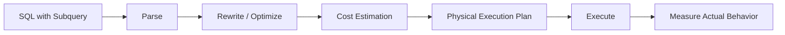
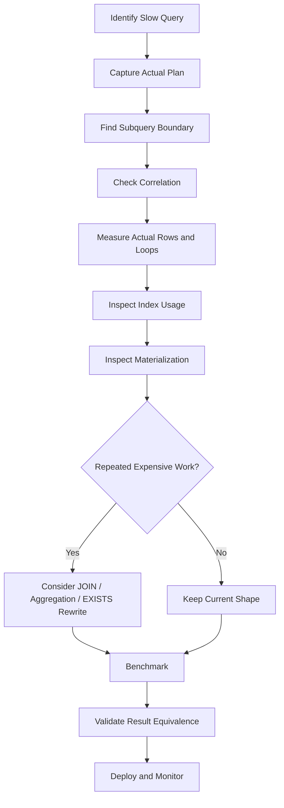

# 28- Subquery Optimization

## Overview

A subquery is a query nested inside another SQL statement. Subqueries are useful for expressing existence checks, scalar lookups, filtering, and intermediate result sets, but their performance depends heavily on how the database optimizer transforms and executes them.

Modern relational optimizers can often rewrite subqueries into joins, semi-joins, anti-joins, aggregates, or other equivalent execution strategies. Therefore, the presence of a subquery in SQL does **not** automatically mean poor performance.

The important engineering question is:

> What execution plan does the database produce for the subquery, and how much work does that plan perform?

Subquery optimization focuses on:

- Reducing unnecessary repeated work.
- Choosing `EXISTS` or `IN` appropriately.
- Avoiding accidental correlated-subquery execution.
- Controlling intermediate result cardinality.
- Rewriting subqueries when the optimizer cannot produce an efficient plan.
- Indexing the columns used by subquery predicates.
- Avoiding unnecessary materialization.
- Measuring actual execution behavior with query plans.

## Types of Subqueries

Common subquery forms include:

| Type | Example | Typical purpose |
|---|---|---|
| Scalar subquery | `SELECT (SELECT ...)` | Return one value |
| `EXISTS` subquery | `WHERE EXISTS (...)` | Test existence |
| `IN` subquery | `WHERE id IN (...)` | Match against a set |
| Correlated subquery | References outer query | Per-row relationship check |
| Derived table | `FROM (SELECT ...)` | Intermediate relation |
| Common Table Expression | `WITH ... AS (...)` | Named intermediate query |
| `ANY` / `ALL` | `WHERE x > ALL (...)` | Compare against a set |

The performance characteristics are different for each form.

## How the Optimizer Sees a Subquery

SQL is declarative. The database is free to transform logically equivalent expressions into different physical plans.

For example:

```sql
SELECT c.id
FROM customers AS c
WHERE EXISTS (
    SELECT 1
    FROM orders AS o
    WHERE o.customer_id = c.id
);
```

The optimizer may transform this conceptually into a semi-join:

```text
customers
    │
    ├──── semi-join ──── orders
    │
    ▼
customers having orders
```

The SQL syntax does not necessarily determine the physical execution strategy.

A useful workflow is:



This is why replacing every subquery with a JOIN is not a valid optimization rule.

## Correlated Versus Uncorrelated Subqueries

### Uncorrelated Subquery

An uncorrelated subquery does not reference columns from the outer query.

```sql
SELECT id
FROM customers
WHERE id IN (
    SELECT customer_id
    FROM orders
    WHERE status = 'completed'
);
```

The inner query can conceptually be evaluated independently.

### Correlated Subquery

A correlated subquery references the outer query:

```sql
SELECT
    c.id,
    c.email
FROM customers AS c
WHERE EXISTS (
    SELECT 1
    FROM orders AS o
    WHERE o.customer_id = c.id
      AND o.status = 'completed'
);
```

The inner predicate references:

```text
c.id
```

from the outer query.

A naïve mental model is:

```text
for every customer:
    execute subquery against orders
```

However, modern optimizers may transform the query into a semi-join or another efficient plan.

Therefore:

> A correlated subquery is potentially expensive, but correlation alone does not prove that the database will execute it once per outer row.

Always inspect the execution plan.

## Why Correlated Subqueries Can Be Expensive

Consider:

```sql
SELECT
    c.id,
    (
        SELECT COUNT(*)
        FROM orders AS o
        WHERE o.customer_id = c.id
    ) AS order_count
FROM customers AS c;
```

If the optimizer executes the inner aggregation independently for every customer, the database may repeatedly access `orders`.

With millions of customers, this can become expensive.

An alternative is to aggregate once:

```sql
SELECT
    c.id,
    COALESCE(o.order_count, 0) AS order_count
FROM customers AS c
LEFT JOIN (
    SELECT
        customer_id,
        COUNT(*) AS order_count
    FROM orders
    GROUP BY customer_id
) AS o
    ON o.customer_id = c.id;
```

The rewritten version can be preferable when it allows the database to compute the child aggregation once.

The optimizer may already perform an equivalent transformation, so compare actual plans before and after rewriting.

## `EXISTS` for Existence Checks

When the requirement is only:

> Does at least one matching row exist?

`EXISTS` expresses that intent directly.

```sql
SELECT c.id
FROM customers AS c
WHERE EXISTS (
    SELECT 1
    FROM orders AS o
    WHERE o.customer_id = c.id
      AND o.status = 'completed'
);
```

The database can use a semi-join or stop searching once existence is established.

An unnecessary count is often less direct:

```sql
SELECT c.id
FROM customers AS c
WHERE (
    SELECT COUNT(*)
    FROM orders AS o
    WHERE o.customer_id = c.id
      AND o.status = 'completed'
) > 0;
```

The latter asks for a count even though only existence matters.

### Why `SELECT 1` Is Used

Inside `EXISTS`:

```sql
SELECT 1
```

is conventional because the actual selected value is irrelevant.

These are generally equivalent in meaning:

```sql
EXISTS (
    SELECT 1
    FROM orders AS o
    WHERE ...
)
```

and:

```sql
EXISTS (
    SELECT o.id
    FROM orders AS o
    WHERE ...
)
```

The important part is the existence of a matching row, not the projected value.

## `IN` Versus `EXISTS`

Consider:

```sql
SELECT id
FROM customers
WHERE id IN (
    SELECT customer_id
    FROM orders
    WHERE status = 'completed'
);
```

This expresses membership in a set.

The equivalent existence form is:

```sql
SELECT c.id
FROM customers AS c
WHERE EXISTS (
    SELECT 1
    FROM orders AS o
    WHERE o.customer_id = c.id
      AND o.status = 'completed'
);
```

For many workloads, the optimizer can produce similar plans.

Do not assume one syntax is universally faster.

### NULL Semantics Matter

`NOT IN` deserves special attention because NULL values can change its semantics.

Suppose:

```sql
SELECT id
FROM customers
WHERE id NOT IN (
    SELECT customer_id
    FROM orders
);
```

If the subquery contains a `NULL`, SQL's three-valued logic can cause rows to evaluate to `UNKNOWN` rather than `TRUE`.

For anti-existence checks, `NOT EXISTS` is often safer:

```sql
SELECT c.id
FROM customers AS c
WHERE NOT EXISTS (
    SELECT 1
    FROM orders AS o
    WHERE o.customer_id = c.id
);
```

This is both a correctness and optimization consideration.

## Scalar Subqueries

A scalar subquery returns a single value.

Example:

```sql
SELECT
    c.id,
    (
        SELECT MAX(o.created_at)
        FROM orders AS o
        WHERE o.customer_id = c.id
    ) AS last_order_at
FROM customers AS c;
```

The inner query must produce at most one row.

Scalar subqueries are useful for:

- Latest related value.
- Calculated metrics.
- Configuration lookups.
- Derived attributes.

They can become expensive when evaluated repeatedly for a large outer relation.

A grouped rewrite may sometimes be more efficient:

```sql
SELECT
    c.id,
    o.last_order_at
FROM customers AS c
LEFT JOIN (
    SELECT
        customer_id,
        MAX(created_at) AS last_order_at
    FROM orders
    GROUP BY customer_id
) AS o
    ON o.customer_id = c.id;
```

Again, benchmark rather than assuming the rewrite is superior.

## `MAX()` and Latest-Row Queries

A common pattern is finding the latest related record:

```sql
SELECT
    c.id,
    (
        SELECT MAX(o.created_at)
        FROM orders AS o
        WHERE o.customer_id = c.id
    ) AS last_order_at
FROM customers AS c;
```

If the actual requirement is the complete latest order row, a scalar `MAX()` is insufficient because it only returns the timestamp.

PostgreSQL can use a lateral query for this pattern:

```sql
SELECT
    c.id,
    latest.id,
    latest.created_at
FROM customers AS c
LEFT JOIN LATERAL (
    SELECT
        o.id,
        o.created_at
    FROM orders AS o
    WHERE o.customer_id = c.id
    ORDER BY o.created_at DESC
    LIMIT 1
) AS latest
    ON TRUE;
```

A useful supporting index is:

```sql
CREATE INDEX idx_orders_customer_created
ON orders (customer_id, created_at DESC);
```

This can allow the database to efficiently locate the newest order for each customer.

Whether this is preferable to a window function or `DISTINCT ON` depends on the database and workload.

## Derived Tables

A derived table is a subquery in the `FROM` clause:

```sql
SELECT
    customer_id,
    order_count
FROM (
    SELECT
        customer_id,
        COUNT(*) AS order_count
    FROM orders
    GROUP BY customer_id
) AS summary;
```

Derived tables are useful for:

- Creating intermediate relational results.
- Pre-aggregating data before a JOIN.
- Separating complex query stages.

The database may inline or otherwise optimize the derived table rather than physically materializing it.

Do not assume:

```sql
FROM (SELECT ...)
```

always creates a temporary table.

The actual behavior depends on the database optimizer and query structure.

## CTEs and Subquery Optimization

A Common Table Expression can improve readability:

```sql
WITH customer_orders AS (
    SELECT
        customer_id,
        COUNT(*) AS order_count
    FROM orders
    GROUP BY customer_id
)
SELECT
    c.id,
    COALESCE(co.order_count, 0) AS order_count
FROM customers AS c
LEFT JOIN customer_orders AS co
    ON co.customer_id = c.id;
```

A CTE is not inherently faster or slower than a subquery.

Database versions and query characteristics determine whether the optimizer can inline or materialize the CTE.

In PostgreSQL, CTEs may be explicitly controlled in applicable cases:

```sql
WITH customer_orders AS MATERIALIZED (
    SELECT
        customer_id,
        COUNT(*) AS order_count
    FROM orders
    GROUP BY customer_id
)
SELECT ...
```

or:

```sql
WITH customer_orders AS NOT MATERIALIZED (
    SELECT
        customer_id,
        COUNT(*) AS order_count
    FROM orders
    GROUP BY customer_id
)
SELECT ...
```

Use these controls only when execution-plan evidence justifies them.

## Avoiding Unnecessary Materialization

Materialization can be useful when an expensive intermediate result is reused, but it can also introduce additional memory or I/O work.

Conceptually:

```text
Subquery
   ↓
Materialize result
   ↓
Read materialized result
```

If the intermediate result is large and only used once, unnecessary materialization can add cost.

When diagnosing a slow subquery, inspect whether the database:

- Inlines the subquery.
- Materializes it.
- Re-scans it.
- Builds a temporary structure.
- Recomputes it.
- Uses an index on the underlying relation.

## Subqueries and JOIN Rewriting

Consider:

```sql
SELECT c.id
FROM customers AS c
WHERE c.id IN (
    SELECT o.customer_id
    FROM orders AS o
    WHERE o.status = 'completed'
);
```

A JOIN rewrite is:

```sql
SELECT DISTINCT c.id
FROM customers AS c
JOIN orders AS o
    ON o.customer_id = c.id
WHERE o.status = 'completed';
```

The `DISTINCT` is necessary because one customer can have multiple completed orders.

Without it:

```sql
SELECT c.id
FROM customers AS c
JOIN orders AS o
    ON o.customer_id = c.id
WHERE o.status = 'completed';
```

the same customer can appear multiple times.

This demonstrates an important point:

> Rewriting a subquery as a JOIN can introduce row multiplication that was not present in the original query.

For pure existence semantics, `EXISTS` often expresses the intent more directly.

## Aggregating Before Joining

Subqueries are particularly useful for reducing cardinality before a JOIN.

For example:

```sql
SELECT
    c.id,
    COALESCE(o.revenue, 0) AS revenue
FROM customers AS c
LEFT JOIN (
    SELECT
        customer_id,
        SUM(total_amount) AS revenue
    FROM orders
    WHERE status = 'completed'
    GROUP BY customer_id
) AS o
    ON o.customer_id = c.id;
```

The derived table reduces potentially millions of order rows into one row per customer before joining.

```text
orders
  ↓
filter
  ↓
GROUP BY customer_id
  ↓
small result
  ↓
JOIN customers
```

This can be substantially more efficient than joining raw orders first and aggregating a much larger intermediate result.

## Indexing Subquery Predicates

A correlated existence check commonly looks like:

```sql
SELECT c.id
FROM customers AS c
WHERE EXISTS (
    SELECT 1
    FROM orders AS o
    WHERE o.customer_id = c.id
      AND o.status = 'completed'
);
```

An index supporting the inner lookup can be valuable:

```sql
CREATE INDEX idx_orders_customer_status
ON orders (customer_id, status);
```

The correct column order depends on the access pattern and selectivity.

For a partial workload dominated by completed orders, a partial index may be appropriate in PostgreSQL:

```sql
CREATE INDEX idx_orders_completed_customer
ON orders (customer_id)
WHERE status = 'completed';
```

Index design should be based on actual workload and write cost rather than the presence of a subquery alone.

## Correlated Subqueries With `LIMIT`

A common efficient pattern is:

```sql
SELECT
    c.id,
    latest.id,
    latest.created_at
FROM customers AS c
LEFT JOIN LATERAL (
    SELECT
        o.id,
        o.created_at
    FROM orders AS o
    WHERE o.customer_id = c.id
    ORDER BY o.created_at DESC
    LIMIT 1
) AS latest
    ON TRUE;
```

The `LIMIT 1` constrains the amount of related data required for each customer.

With an appropriate index:

```sql
CREATE INDEX idx_orders_customer_created
ON orders (customer_id, created_at DESC);
```

the database can potentially perform a targeted lookup instead of scanning all orders for each customer.

This is a good example of where a correlated operation can be efficient when the outer relation is manageable and the inner access path is highly selective.

## Subqueries and Cardinality

Subquery performance depends heavily on intermediate result size.

Consider:

```sql
WHERE id IN (
    SELECT customer_id
    FROM orders
)
```

If the subquery produces tens of millions of rows, the database has substantially more work than if it produces a few thousand.

Important questions include:

- How many rows does the subquery produce?
- How many distinct values does it contain?
- Is deduplication required?
- Can predicates reduce it?
- Can the database use a semi-join?
- Is the subquery executed once or repeatedly?
- Is it materialized?

Cardinality estimates should be checked when the actual behavior appears surprising.

## Predicate Pushdown Into Subqueries

Push selective predicates as close to the data source as correctness allows.

Instead of:

```sql
SELECT
    customer_id,
    SUM(total_amount)
FROM (
    SELECT *
    FROM orders
) AS o
WHERE status = 'completed'
GROUP BY customer_id;
```

prefer the direct form:

```sql
SELECT
    customer_id,
    SUM(total_amount)
FROM orders
WHERE status = 'completed'
GROUP BY customer_id;
```

The optimizer may perform this transformation automatically, but simpler SQL can make intent clearer and can avoid optimization barriers in more complex query structures.

## Subqueries Returning Large Sets

Avoid constructing a massive intermediate set when the requirement is only to test existence.

Instead of:

```sql
WHERE customer_id IN (
    SELECT customer_id
    FROM orders
    WHERE status = 'completed'
)
```

consider:

```sql
WHERE EXISTS (
    SELECT 1
    FROM orders
    WHERE orders.customer_id = customers.id
      AND status = 'completed'
)
```

when correlated existence semantics match the requirement.

The optimizer may produce the same physical plan, but `EXISTS` communicates that only existence matters.

## Subquery Versus Window Function

Some subqueries can be replaced by window functions.

For example:

```sql
SELECT
    o.id,
    o.customer_id,
    o.total_amount
FROM orders AS o
WHERE o.total_amount > (
    SELECT AVG(o2.total_amount)
    FROM orders AS o2
);
```

A window-function formulation is:

```sql
SELECT
    id,
    customer_id,
    total_amount
FROM (
    SELECT
        id,
        customer_id,
        total_amount,
        AVG(total_amount) OVER () AS average_amount
    FROM orders
) AS o
WHERE total_amount > average_amount;
```

Window functions can be useful when the aggregate must be associated with each individual row.

However, they can also require processing and retaining more rows than a grouped query. The appropriate formulation depends on the required output.

## Subquery Versus JOIN

| Requirement | Often natural choice |
|---|---|
| Test whether a related row exists | `EXISTS` |
| Test whether no related row exists | `NOT EXISTS` |
| Retrieve columns from related rows | `JOIN` |
| Aggregate related rows before joining | Derived table / CTE |
| Retrieve one ordered related row | `LATERAL` / correlated lookup |
| Compare against a scalar value | Scalar subquery |
| Calculate per-row aggregate context | Window function |
| Match a set of values | `IN` / semi-join |

These are guidelines, not universal performance rules.

The optimizer may transform several syntactic forms into the same physical plan.

## Detecting an Expensive Subquery

Use actual execution plans.

For PostgreSQL:

```sql
EXPLAIN (ANALYZE, BUFFERS)
SELECT
    c.id,
    (
        SELECT COUNT(*)
        FROM orders AS o
        WHERE o.customer_id = c.id
    ) AS order_count
FROM customers AS c;
```

Look for:

- Repeated scans.
- High actual loop counts.
- Large row estimates versus actual rows.
- Sequential scans on large relations.
- Nested-loop operations over large outer relations.
- Temporary I/O.
- Excessive buffer reads.
- Unexpected materialization.
- Expensive sorting or hashing.

A particularly important pattern is:

```text
Actual Rows: 1
Loops: 1,000,000
```

for an inner operation.

That can indicate substantial repeated work.

However, a high loop count alone does not prove a problem. If each lookup is a cheap indexed operation returning quickly, the plan may still be appropriate.

## Production Query Tuning Workflow



A reliable process is:

1. Identify the production query from telemetry.
2. Capture the actual execution plan.
3. Determine whether the subquery is correlated.
4. Compare estimated and actual cardinalities.
5. Inspect inner-operation loop counts.
6. Check indexes on correlated predicates.
7. Check for unnecessary sorting, hashing, or materialization.
8. Consider `EXISTS`, `JOIN`, pre-aggregation, window functions, or lateral queries.
9. Benchmark with production-like data distributions.
10. Verify that the rewrite preserves NULL and duplicate semantics.
11. Measure overall workload impact after deployment.

## Common Mistakes

### Assuming Every Subquery Is Slow

Modern optimizers can transform many subqueries into efficient joins or semi-joins.

Judge the execution plan, not the SQL syntax.

### Blindly Replacing Subqueries With JOINs

A JOIN can multiply rows and change both performance and correctness.

Always verify duplicate semantics.

### Using `COUNT(*) > 0` Instead of `EXISTS`

If only existence matters, `EXISTS` communicates the requirement more directly and can allow efficient early-exit or semi-join strategies.

### Using `NOT IN` Without Considering NULL

`NULL` values can cause surprising three-valued-logic behavior.

Use `NOT EXISTS` when anti-existence semantics are intended and verify the query semantics.

### Assuming Correlated Means N+1

A correlated subquery resembles an N+1 operation conceptually, but the optimizer may transform it into a set-based plan.

Inspect actual loops and execution behavior.

### Ignoring Inner-Query Indexes

For:

```sql
WHERE EXISTS (
    SELECT 1
    FROM orders
    WHERE orders.customer_id = customers.id
)
```

the inner lookup column often needs an appropriate index.

### Materializing Large Intermediate Results

A large subquery result can consume significant memory or temporary storage.

Reduce cardinality before materialization when possible.

### Rewriting Without Validating Semantics

Equivalent-looking queries can differ because of:

- NULL behavior.
- Duplicate rows.
- Outer joins.
- Empty result sets.
- Aggregate semantics.
- `NOT IN` behavior.
- Multiple matching child rows.

Performance improvements are not useful if they change the result.

## ORM Considerations

### Django

Django supports subqueries through `Subquery` and `Exists`.

Example:

```python
from django.db.models import Exists, OuterRef

completed_orders = Order.objects.filter(
    customer_id=OuterRef("pk"),
    status="completed",
)

customers = Customer.objects.annotate(
    has_completed_order=Exists(completed_orders),
).filter(
    has_completed_order=True,
)
```

This keeps the existence check in the database rather than loading orders into Python.

Django also supports scalar subqueries:

```python
from django.db.models import OuterRef, Subquery

latest_order = (
    Order.objects
    .filter(customer_id=OuterRef("pk"))
    .order_by("-created_at")
)

customers = Customer.objects.annotate(
    latest_order_id=Subquery(
        latest_order.values("id")[:1]
    )
)
```

For high-volume endpoints, inspect the generated SQL and execution plan rather than assuming ORM-generated SQL is optimal.

### SQLAlchemy

SQLAlchemy can express correlated existence checks:

```python
from sqlalchemy import exists, select

completed_order = exists(
    select(1).where(
        Order.customer_id == Customer.id,
        Order.status == "completed",
    )
)

stmt = select(Customer.id).where(completed_order)
```

The ORM expression is only the query construction layer. Database-side optimization still depends on the generated SQL and physical execution plan.

## Security Considerations

Subqueries should use parameterized values just like any other SQL.

Prefer:

```sql
SELECT id
FROM customers
WHERE id IN (
    SELECT customer_id
    FROM orders
    WHERE status = $1
);
```

over dynamically concatenating request values.

Performance rewrites must also preserve authorization predicates.

For a multi-tenant application:

```sql
SELECT ...
FROM customers AS c
WHERE c.tenant_id = $1
  AND EXISTS (
      SELECT 1
      FROM orders AS o
      WHERE o.customer_id = c.id
        AND o.tenant_id = $1
  );
```

Tenant isolation must not be accidentally removed during query optimization.

The exact authorization model may instead enforce tenant boundaries through database policies, repository-level constraints, or another architecture. Optimization should preserve whichever model the application relies on.

## Scalability Guidance

For high-traffic APIs:

- Prefer selective correlated lookups with supporting indexes when the access pattern is efficient.
- Use `EXISTS` for existence semantics.
- Avoid repeated expensive scalar subqueries over huge outer relations.
- Pre-aggregate when the same relationship metrics are repeatedly requested.
- Consider caching stable derived values.
- Move heavy analytical workloads away from transactional databases when appropriate.
- Use read replicas only when their consistency characteristics are acceptable.

A typical backend flow might be:

```text
FastAPI / Django
      ↓
Repository / ORM
      ↓
Parameterized SQL
      ↓
PostgreSQL
      ↓
Index / Join / Subquery plan
      ↓
Small result
      ↓
API response
```

The application should generally receive only the data it actually needs.

## Cost and Operational Considerations

Subquery performance affects more than individual request latency.

Expensive subqueries can cause:

- Higher database CPU.
- Increased buffer reads.
- More temporary disk I/O.
- Longer-held database connections.
- Increased connection-pool pressure.
- Reduced capacity for unrelated queries.
- Larger database instances.
- Higher cloud infrastructure costs.

When evaluating an optimization, consider:

```text
Query latency
×
Execution frequency
×
Resource consumption
```

A 200 ms query executed once per day is usually less urgent than a 20 ms query executed thousands of times per minute.

## Interview Traps

| Question | Strong answer |
|---|---|
| Are subqueries slower than JOINs? | Not inherently. The optimizer may transform a subquery into a join, semi-join, or another equivalent plan. |
| Is a correlated subquery always N+1? | No. The optimizer may decorrelate it. Inspect actual loops and the execution plan. |
| When is `EXISTS` preferable? | When only the existence of a related row matters. |
| Why can `NOT IN` be dangerous? | NULL values in the subquery can produce UNKNOWN results under SQL's three-valued logic. |
| Should every subquery be rewritten as a JOIN? | No. A JOIN can introduce duplicates and change semantics. |
| What makes a correlated subquery efficient? | A selective outer relation and an efficient indexed inner lookup can make repeated lookups inexpensive. |
| How do you diagnose an expensive subquery? | Inspect actual rows, loops, scan types, indexes, materialization, buffers, and timing with an actual execution plan. |
| When is pre-aggregation useful? | When repeatedly processing large child relations is expensive and aggregation can safely reduce cardinality before a JOIN. |
| Does a CTE always materialize? | No. Behavior depends on the database and version; PostgreSQL can inline applicable CTEs and also supports explicit materialization controls. |
| What must be checked after a query rewrite? | Result equivalence, NULL semantics, duplicate behavior, execution plan, latency, resource usage, and workload impact. |

## Key Takeaways

- **A subquery is not inherently slow; optimize the execution plan rather than the SQL syntax alone.**
- **Use `EXISTS` and `NOT EXISTS` for existence semantics, and be especially careful with `NOT IN` because of NULL behavior.**
- **Correlated subqueries can be expensive when they cause repeated work, but modern optimizers may decorrelate them into efficient set-based plans.**
- **JOIN rewrites, pre-aggregation, lateral queries, and window functions can improve performance, but every rewrite must preserve duplicate and NULL semantics.**
- **Use actual execution plans, cardinality, loop counts, index usage, and production query frequency to determine whether a subquery is a real bottleneck.**