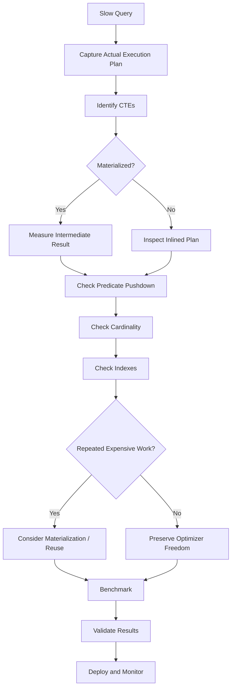

# 29- CTE Optimization

## Overview

A Common Table Expression (CTE) is a named query expression introduced with `WITH`. CTEs improve query structure by allowing complex SQL to be decomposed into logical stages, but their performance characteristics depend on the database engine, version, query shape, and whether the optimizer can inline or must materialize the CTE.

A CTE is primarily a **query-structuring mechanism**, not automatically a performance optimization.

For example:

```sql
WITH customer_orders AS (
    SELECT
        customer_id,
        COUNT(*) AS order_count
    FROM orders
    WHERE status = 'completed'
    GROUP BY customer_id
)
SELECT
    c.id,
    c.email,
    COALESCE(co.order_count, 0) AS order_count
FROM customers AS c
LEFT JOIN customer_orders AS co
    ON co.customer_id = c.id;
```

The CTE gives the query a logical intermediate relation:

```text
orders
   │
   ├── filter completed orders
   │
   ├── GROUP BY customer_id
   │
   ▼
customer_orders
   │
   ▼
JOIN customers
   │
   ▼
API result
```

For performance-sensitive SQL, the important questions are:

- Can the optimizer inline the CTE?
- Is the CTE materialized?
- How many rows does it produce?
- Is it referenced once or multiple times?
- Can predicates be pushed into it?
- Does materialization prevent a better access path?
- Are indexes available for the operations inside it?
- Does the CTE reduce or increase intermediate data?
- What does the actual execution plan show?

## CTE Versus Subquery

A CTE and an equivalent derived table can express the same logical operation.

### CTE

```sql
WITH active_customers AS (
    SELECT
        id,
        email
    FROM customers
    WHERE status = 'active'
)
SELECT *
FROM active_customers
WHERE email LIKE '%@example.com';
```

### Derived Table

```sql
SELECT *
FROM (
    SELECT
        id,
        email
    FROM customers
    WHERE status = 'active'
) AS active_customers
WHERE email LIKE '%@example.com';
```

The optimizer may produce the same physical execution plan for both.

The choice should therefore initially be based on:

- Readability.
- Reuse within the statement.
- Query complexity.
- Required materialization semantics.
- Database-specific optimizer behavior.

Do not assume that the CTE version is faster merely because it appears more structured.

## CTE Execution Models

There are two important mental models.

### Inline CTE

The optimizer incorporates the CTE's relational expression into the surrounding query.

Conceptually:

```text
WITH cte AS (...)
SELECT ...
FROM cte
WHERE ...
```

becomes:

```text
SELECT ...
FROM original_relation
WHERE cte_conditions
  AND outer_conditions
```

This can allow:

- Predicate pushdown.
- Index usage.
- Join reordering.
- Join elimination where applicable.
- Better cardinality optimization.

### Materialized CTE

The database computes the CTE result first and stores it as an intermediate result before the outer query consumes it.

Conceptually:

```text
Base tables
    │
    ▼
Execute CTE
    │
    ▼
Materialized intermediate result
    │
    ▼
Outer query
```

Materialization can be useful when:

- The CTE is expensive to compute.
- The result is referenced multiple times.
- Recomputing it would be more expensive.
- A deliberate optimization barrier is desirable.

But it can hurt when:

- The CTE produces a huge result.
- The outer query could have filtered rows earlier.
- The CTE is referenced only once.
- Materialization causes unnecessary memory or temporary I/O.

## PostgreSQL CTE Behavior

Modern PostgreSQL versions can inline applicable CTEs rather than automatically materializing every CTE.

PostgreSQL also supports explicit control:

```sql
WITH customer_orders AS MATERIALIZED (
    SELECT
        customer_id,
        COUNT(*) AS order_count
    FROM orders
    GROUP BY customer_id
)
SELECT ...
```

or:

```sql
WITH customer_orders AS NOT MATERIALIZED (
    SELECT
        customer_id,
        COUNT(*) AS order_count
    FROM orders
    GROUP BY customer_id
)
SELECT ...
```

These controls should be used only when execution-plan evidence supports the decision.

A good production rule is:

> Treat `MATERIALIZED` and `NOT MATERIALIZED` as performance controls, not stylistic preferences.

Other database engines have different optimizer rules. Never transfer PostgreSQL-specific CTE behavior directly to MySQL, SQL Server, Oracle, or another database without checking its optimizer semantics.

## When Materialization Helps

Suppose an expensive intermediate result is referenced multiple times:

```sql
WITH monthly_sales AS (
    SELECT
        customer_id,
        SUM(total_amount) AS revenue
    FROM orders
    WHERE created_at >= DATE '2026-01-01'
      AND created_at < DATE '2026-02-01'
    GROUP BY customer_id
)
SELECT
    ...
FROM monthly_sales AS s1
JOIN monthly_sales AS s2
    ON s1.customer_id = s2.customer_id;
```

If the database can reuse a materialized result efficiently, computing the expensive aggregation once can be beneficial.

The trade-off is:

```text
Without useful materialization:
    expensive computation
           ↓
      repeated work

With useful materialization:
    expensive computation
           ↓
    intermediate result
       ↙         ↘
   consumer 1   consumer 2
```

However, the exact execution strategy is optimizer-dependent. Do not manually force materialization unless the plan demonstrates that reuse provides a measurable benefit.

## When Materialization Hurts

Consider:

```sql
WITH large_orders AS (
    SELECT *
    FROM orders
)
SELECT
    id,
    customer_id
FROM large_orders
WHERE customer_id = 42;
```

If the intermediate result is materialized before applying the outer predicate, the database may process far more rows than necessary.

The desired behavior is effectively:

```text
orders
   │
   └── customer_id = 42
          │
          ▼
      small result
```

rather than:

```text
orders
   │
   ▼
materialize millions of rows
   │
   ▼
filter customer_id = 42
```

Whether the database actually behaves this way must be verified with the execution plan.

## Predicate Pushdown

One of the most important CTE optimization concepts is predicate pushdown.

Consider:

```sql
WITH customer_orders AS (
    SELECT
        customer_id,
        created_at,
        total_amount
    FROM orders
)
SELECT
    customer_id,
    SUM(total_amount)
FROM customer_orders
WHERE created_at >= DATE '2026-01-01'
GROUP BY customer_id;
```

An optimizer may be able to push:

```sql
created_at >= DATE '2026-01-01'
```

into the underlying `orders` scan.

The effective execution becomes closer to:

```sql
SELECT
    customer_id,
    SUM(total_amount)
FROM orders
WHERE created_at >= DATE '2026-01-01'
GROUP BY customer_id;
```

Predicate pushdown reduces:

- Rows scanned.
- Rows transferred between operators.
- Aggregation input.
- Memory consumption.
- Temporary storage.
- CPU consumption.

## CTEs as Optimization Barriers

A materialized CTE can act as an optimization boundary.

For example:

```text
Outer query predicates
        │
        X
        │
   CTE boundary
        │
        ▼
   CTE execution
```

The optimizer may not be able to move an outer predicate through that boundary.

This matters because relational optimizers gain much of their power from transforming the entire expression tree.

A senior-level performance review therefore asks:

> Does this CTE preserve optimizer freedom, or does it intentionally restrict it?

## Reducing CTE Cardinality

A good CTE often reduces data before expensive downstream operations.

For example:

```sql
WITH completed_orders AS (
    SELECT
        customer_id,
        total_amount
    FROM orders
    WHERE status = 'completed'
)
SELECT
    c.id,
    SUM(co.total_amount) AS revenue
FROM customers AS c
JOIN completed_orders AS co
    ON co.customer_id = c.id
GROUP BY c.id;
```

The CTE filters rows before the join.

An even stronger form can aggregate first:

```sql
WITH customer_revenue AS (
    SELECT
        customer_id,
        SUM(total_amount) AS revenue
    FROM orders
    WHERE status = 'completed'
    GROUP BY customer_id
)
SELECT
    c.id,
    COALESCE(cr.revenue, 0) AS revenue
FROM customers AS c
LEFT JOIN customer_revenue AS cr
    ON cr.customer_id = c.id;
```

Instead of joining every completed order to customers, the query can reduce orders to one row per customer before joining.

The general optimization principle is:

> Reduce cardinality before expensive joins, sorts, and aggregations when the required semantics allow it.

## CTEs and Aggregation

CTEs are useful for separating aggregation stages.

For example:

```sql
WITH customer_monthly_sales AS (
    SELECT
        customer_id,
        DATE_TRUNC('month', created_at) AS month,
        SUM(total_amount) AS monthly_revenue
    FROM orders
    WHERE status = 'completed'
    GROUP BY
        customer_id,
        DATE_TRUNC('month', created_at)
)
SELECT
    customer_id,
    AVG(monthly_revenue) AS average_monthly_revenue
FROM customer_monthly_sales
GROUP BY customer_id;
```

This performs:

```text
orders
   ↓
filter
   ↓
customer + month aggregation
   ↓
monthly result
   ↓
customer aggregation
   ↓
final result
```

This can be much easier to reason about than deeply nested SQL.

However, every intermediate relation still has a cost. If the first aggregation produces millions of rows, the CTE does not magically make the query cheap.

## CTEs and JOIN Optimization

CTEs can be useful when a large relation should be reduced before a JOIN.

Example:

```sql
WITH active_customer_orders AS (
    SELECT
        customer_id,
        COUNT(*) AS order_count
    FROM orders
    WHERE status = 'completed'
    GROUP BY customer_id
)
SELECT
    c.id,
    c.email,
    aco.order_count
FROM customers AS c
JOIN active_customer_orders AS aco
    ON aco.customer_id = c.id
WHERE c.status = 'active';
```

The intermediate result contains at most one row per customer.

This can prevent row multiplication that would occur if raw order records were joined first.

The actual optimizer may reorder operations or use another equivalent strategy, so verify the physical plan.

## CTEs and Window Functions

CTEs can make window-function queries easier to structure.

```sql
WITH ranked_orders AS (
    SELECT
        id,
        customer_id,
        total_amount,
        created_at,
        ROW_NUMBER() OVER (
            PARTITION BY customer_id
            ORDER BY created_at DESC, id DESC
        ) AS row_number
    FROM orders
)
SELECT
    id,
    customer_id,
    total_amount,
    created_at
FROM ranked_orders
WHERE row_number = 1;
```

This pattern is useful for retrieving the latest order per customer.

A suitable index may improve the underlying access path, although window functions can still require sorting or other processing depending on the plan:

```sql
CREATE INDEX idx_orders_customer_created_id
ON orders (customer_id, created_at DESC, id DESC);
```

Always validate the plan with realistic data.

## CTEs and Recursive Queries

Recursive CTEs are primarily a capability for traversing hierarchical or graph-like data.

Example:

```sql
WITH RECURSIVE category_tree AS (
    SELECT
        id,
        parent_id,
        name,
        0 AS depth
    FROM categories
    WHERE id = 10

    UNION ALL

    SELECT
        c.id,
        c.parent_id,
        c.name,
        ct.depth + 1
    FROM categories AS c
    JOIN category_tree AS ct
        ON c.parent_id = ct.id
)
SELECT
    id,
    parent_id,
    name,
    depth
FROM category_tree
ORDER BY depth, id;
```

Recursive CTEs can become expensive because the recursive step may produce increasingly large intermediate sets.

Production considerations include:

- Indexing the recursive join key.
- Preventing unintended cycles.
- Limiting recursion depth when appropriate.
- Controlling result cardinality.
- Testing worst-case tree depth.
- Monitoring execution time and temporary storage.

For hierarchical APIs, do not assume recursive SQL is always preferable to application-side traversal or a specialized data model.

## Recursive CTE Performance

The recursive join should normally have an efficient access path.

For:

```sql
JOIN category_tree AS ct
    ON c.parent_id = ct.id
```

an index on the child relationship can be important:

```sql
CREATE INDEX idx_categories_parent_id
ON categories (parent_id);
```

Without appropriate indexing, each recursive step can perform increasingly expensive scans.

A common production failure mode is testing a recursive query against a shallow development hierarchy and discovering poor behavior after production data contains thousands or millions of related nodes.

## CTEs and Index Usage

A CTE does not eliminate the need for indexes.

Suppose:

```sql
WITH recent_orders AS (
    SELECT
        id,
        customer_id,
        created_at
    FROM orders
    WHERE created_at >= CURRENT_DATE - INTERVAL '30 days'
)
SELECT
    customer_id,
    COUNT(*)
FROM recent_orders
GROUP BY customer_id;
```

An index on:

```sql
CREATE INDEX idx_orders_created_customer
ON orders (created_at, customer_id);
```

may be useful depending on the workload, selectivity, table size, and database planner.

Index design should consider:

- Filtering predicates.
- Join predicates.
- Grouping.
- Ordering.
- Data distribution.
- Write overhead.
- Index size.

Do not create an index simply because a column appears inside a CTE.

## CTE Versus Temporary Tables

CTEs and temporary tables solve different problems.

| Property | CTE | Temporary table |
|---|---|---|
| Lifetime | Single statement | Usually transaction/session scoped |
| Persistent schema | No | No |
| Explicit materialization | Database-dependent | Yes |
| Reusable across statements | No | Yes |
| Index intermediate data | Generally no | Yes |
| Useful for multi-step workflows | Limited | Strong |
| Optimizer visibility | Query-dependent | Separate relation |
| Setup overhead | Low | Higher |
| Good for | Query composition | Multi-step processing |

A temporary table may be appropriate when an intermediate result:

- Is reused across several statements.
- Is large enough to benefit from indexing.
- Requires explicit lifecycle control.
- Needs statistics or a separate execution boundary.
- Is part of a deliberate batch-processing workflow.

A CTE is generally preferable when the intermediate result exists only to structure one statement.

## CTE Versus Temporary Table Example

Suppose an expensive customer segmentation result is used by several statements.

A CTE requires repeating the computation in each statement:

```sql
WITH high_value_customers AS (
    SELECT customer_id
    FROM orders
    GROUP BY customer_id
    HAVING SUM(total_amount) > 10000
)
SELECT ...
FROM high_value_customers;
```

A temporary table can make the intermediate result reusable:

```sql
CREATE TEMP TABLE high_value_customers AS
SELECT
    customer_id
FROM orders
GROUP BY customer_id
HAVING SUM(total_amount) > 10000;

CREATE INDEX idx_high_value_customers_customer
ON high_value_customers (customer_id);
```

Then multiple statements can consume it.

This introduces additional write, storage, lifecycle, and concurrency considerations, so it should not be used merely because a CTE appears slow.

## Avoiding `SELECT *` in CTEs

Avoid carrying unnecessary columns through a CTE:

```sql
WITH customer_orders AS (
    SELECT *
    FROM orders
)
SELECT
    customer_id,
    SUM(total_amount)
FROM customer_orders
GROUP BY customer_id;
```

Prefer:

```sql
WITH customer_orders AS (
    SELECT
        customer_id,
        total_amount
    FROM orders
)
SELECT
    customer_id,
    SUM(total_amount)
FROM customer_orders
GROUP BY customer_id;
```

Benefits include:

- Smaller intermediate rows.
- Lower memory pressure.
- Less temporary I/O.
- Better query readability.
- Lower risk of accidentally coupling downstream logic to unrelated columns.

Column pruning may happen automatically, but explicit projection makes the intended data flow clearer.

## CTE Reuse

CTEs are especially useful when the same logical relation is referenced multiple times.

For example:

```sql
WITH active_customers AS (
    SELECT
        id,
        tenant_id
    FROM customers
    WHERE status = 'active'
)
SELECT ...
FROM active_customers AS a
JOIN active_customers AS b
    ON a.tenant_id = b.tenant_id;
```

Whether this is faster than duplicating the expression depends on optimizer behavior.

If materialization occurs, reuse may avoid repeated work.

If inlining occurs, each reference may be optimized independently.

The right question is not:

> "Does the CTE avoid duplication?"

The right question is:

> "What physical work does the database perform for each reference?"

## CTE Optimization With Query Plans

Use actual execution plans.

For PostgreSQL:

```sql
EXPLAIN (ANALYZE, BUFFERS)
WITH customer_revenue AS (
    SELECT
        customer_id,
        SUM(total_amount) AS revenue
    FROM orders
    WHERE status = 'completed'
    GROUP BY customer_id
)
SELECT
    c.id,
    COALESCE(cr.revenue, 0) AS revenue
FROM customers AS c
LEFT JOIN customer_revenue AS cr
    ON cr.customer_id = c.id
WHERE c.status = 'active';
```

Inspect:

| Plan characteristic | What to investigate |
|---|---|
| Large estimated/actual row counts | Cardinality and filtering |
| Large estimate mismatch | Statistics or data skew |
| Sequential scan | Whether it is actually appropriate |
| High loops | Repeated work |
| Temporary I/O | Materialization, sorting, hashing |
| Large hash tables | Memory pressure and join cardinality |
| Sort-heavy plan | Ordering/window requirements |
| Large execution time | Primary expensive operators |
| CTE scan | Whether materialization is occurring |

Do not optimize based only on whether the plan visually contains a `CTE Scan`.

## Detecting CTE Materialization

A plan can reveal whether the CTE result is being separately produced and consumed.

For example, a PostgreSQL plan may expose a structure conceptually similar to:

```text
CTE Scan
    │
    ▼
CTE customer_revenue
    │
    ▼
HashAggregate
    │
    ▼
Seq Scan on orders
```

This indicates that the CTE has become a distinct execution component.

Compare that with an inlined plan where the optimizer can incorporate the CTE expression directly into the surrounding plan.

The exact plan format varies by database and version.

## `MATERIALIZED` Versus `NOT MATERIALIZED`

When supported, explicit controls should be used carefully.

### Force Materialization

```sql
WITH expensive_result AS MATERIALIZED (
    SELECT
        customer_id,
        SUM(total_amount) AS revenue
    FROM orders
    GROUP BY customer_id
)
SELECT ...
FROM expensive_result;
```

Potential benefits:

- Prevents repeated computation.
- Creates a deliberate intermediate result.
- Can stabilize a desired execution boundary.

Potential costs:

- Additional memory.
- Temporary I/O.
- Loss of predicate pushdown.
- Loss of join reordering opportunities.
- Larger intermediate result.

### Encourage Inlining

```sql
WITH customer_orders AS NOT MATERIALIZED (
    SELECT
        customer_id,
        total_amount
    FROM orders
    WHERE status = 'completed'
)
SELECT ...
FROM customer_orders;
```

Potential benefits:

- Greater optimizer freedom.
- Predicate pushdown.
- Better index selection.
- Better join ordering.

Potential costs:

- Repeated computation if referenced multiple times.
- Potentially more complex execution plans.
- Higher total work when reuse would have been beneficial.

Use explicit controls only after measuring.

## CTE Optimization Workflow



A practical tuning process is:

1. Identify the production query from telemetry.
2. Capture an actual execution plan.
3. Determine whether each CTE is inlined or materialized.
4. Measure the CTE's actual output cardinality.
5. Check whether selective predicates are pushed down.
6. Inspect indexes used inside the CTE.
7. Check repeated references and repeated computation.
8. Compare a CTE with an equivalent derived table or direct query when useful.
9. Consider explicit materialization only when evidence supports it.
10. Benchmark against production-like data distributions.
11. Verify result equivalence.
12. Monitor database CPU, memory, I/O, latency, and throughput after deployment.

## Common CTE Anti-Patterns

### Using CTEs Merely to Make SQL Look Modular

A CTE can improve readability, but excessive decomposition can make the query harder for humans and sometimes harder for the optimizer to reason about.

Use CTEs when they represent meaningful relational stages.

### Assuming CTE Means Materialized Temporary Table

A CTE is not automatically a temporary table.

The database may inline it.

### Assuming CTE Means Faster

A CTE is primarily a query-expression feature.

It does not inherently reduce execution cost.

### Forcing Materialization Without Evidence

Materialization can prevent predicate pushdown and introduce temporary work.

Only force it when the resulting execution plan is demonstrably better.

### Creating Huge CTE Results

Avoid:

```sql
WITH everything AS (
    SELECT *
    FROM orders
)
SELECT ...
FROM everything;
```

when only a small subset of columns and rows is required.

Filter and project early where appropriate.

### Ignoring Repeated CTE References

A CTE referenced multiple times may have very different performance characteristics from a single-use CTE.

Check whether the optimizer recomputes or reuses the underlying work.

### Using CTEs to Hide Poor Query Design

A complex query does not become efficient simply because it is divided into several CTEs.

Always evaluate:

- Cardinality.
- Join strategy.
- Index usage.
- Aggregation.
- Sorting.
- Materialization.
- Actual execution time.

## Production Considerations

### Query Latency

For API endpoints, CTE optimization should be evaluated against the complete request path:

```text
Client
  ↓
Nginx / Load Balancer
  ↓
Django / FastAPI
  ↓
Database connection pool
  ↓
SQL execution
  ↓
CTE / JOIN / Aggregate
  ↓
Result serialization
  ↓
Response
```

A database optimization is valuable when it reduces the end-to-end cost or increases database capacity.

### Connection Pool Pressure

A query that holds a database connection for 2 seconds is significantly more disruptive than one that completes in 20 ms.

Long-running CTE queries can:

- Exhaust connection pools.
- Increase request queueing.
- Increase transaction duration.
- Delay unrelated queries.

This is particularly important in Django and FastAPI services using bounded database connection pools.

### Memory and Temporary Storage

Large materialized CTEs, sorts, hashes, and aggregates can consume significant database memory and temporary disk.

Monitor:

- Temporary file usage.
- Database memory pressure.
- Disk I/O.
- Query execution time.
- Concurrent query count.

### Read Replicas

Moving read-heavy CTE queries to a PostgreSQL read replica can reduce primary-database load, but only when replica lag and consistency requirements are acceptable.

A read replica does not fix an inefficient query. It only moves the workload.

### Caching

If a CTE repeatedly computes relatively stable aggregates, application or distributed caching may be appropriate.

For example:

```text
FastAPI
   │
   ├── Redis cache hit ──► response
   │
   └── cache miss
          │
          ▼
      PostgreSQL
          │
          ▼
       aggregate
          │
          ▼
       Redis
```

Caching should not replace query optimization when the underlying query is unnecessarily expensive.

## Django and ORM Considerations

Django applications may generate complex SQL through ORM expressions, annotations, subqueries, and query composition.

For example, an application may use:

```python
from django.db.models import Count, Q

customers = (
    Customer.objects
    .filter(status="active")
    .annotate(
        completed_orders=Count(
            "orders",
            filter=Q(orders__status="completed"),
        )
    )
)
```

The ORM may generate SQL involving joins and aggregates rather than a CTE.

If a CTE is needed for a specific query shape, evaluate whether the ORM can express the operation efficiently or whether a carefully reviewed SQL query is justified.

Important production practices include:

- Inspect generated SQL.
- Use `EXPLAIN`.
- Avoid loading large intermediate results into Python.
- Avoid solving database query problems with application-side loops.
- Keep tenant and authorization predicates intact.
- Benchmark ORM-generated SQL against hand-written alternatives when necessary.

## Security Considerations

CTE optimization must never remove security predicates.

For a multi-tenant system:

```sql
WITH tenant_orders AS (
    SELECT
        customer_id,
        total_amount
    FROM orders
    WHERE tenant_id = $1
      AND status = 'completed'
)
SELECT
    customer_id,
    SUM(total_amount)
FROM tenant_orders
GROUP BY customer_id;
```

The tenant boundary must remain part of the optimized query.

Always use parameterized queries:

```sql
WHERE tenant_id = $1
```

rather than dynamically concatenating tenant identifiers or request parameters.

Query optimization should preserve:

- Tenant isolation.
- Authorization constraints.
- Row-level security assumptions.
- Data visibility rules.

Performance must never be achieved by accidentally broadening the dataset.

## Scalability Guidance

For large production datasets:

- Keep intermediate CTE cardinality under control.
- Filter before expensive operations where possible.
- Aggregate before joining when semantics allow.
- Avoid unnecessary materialization.
- Use indexes supporting filtering and joining.
- Measure repeated CTE references.
- Test with realistic data skew.
- Monitor temporary I/O and memory.
- Separate transactional and analytical workloads when necessary.
- Consider precomputed aggregates for repeatedly requested metrics.

For very large analytical workloads, repeatedly executing complex CTE chains against a transactional PostgreSQL database may be a sign that the workload belongs in an analytical system or pre-aggregation pipeline.

## Interview Traps

| Question | Strong answer |
|---|---|
| Is a CTE faster than a subquery? | Not inherently. They may produce the same execution plan. |
| Is a CTE always materialized? | No. Modern optimizers can inline applicable CTEs, depending on database and query characteristics. |
| When can materialization help? | When an expensive result is reused or deliberate intermediate-result isolation is beneficial. |
| When can materialization hurt? | When it creates a large intermediate result or prevents predicate pushdown and other optimizations. |
| What is predicate pushdown? | Moving filters closer to the underlying data source so fewer rows participate in later operations. |
| Should every CTE be marked `NOT MATERIALIZED`? | No. Explicit controls should be driven by execution-plan evidence. |
| What is the difference between a CTE and a temporary table? | A CTE is statement-scoped query structure; a temporary table is a physical relation that can persist across statements and can be indexed. |
| Can a CTE improve readability without improving performance? | Yes. Readability and execution performance are separate concerns. |
| How do you determine whether a CTE is a bottleneck? | Use an actual execution plan and inspect timing, cardinality, loops, scans, materialization, memory, and temporary I/O. |
| What is a common CTE mistake? | Assuming that introducing a CTE automatically creates a reusable materialized result or improves performance. |

## Key Takeaways

- **CTEs are primarily a query-structuring mechanism; they are not inherently faster than subqueries or derived tables.**
- **Understand whether the database inlines or materializes a CTE because that choice directly affects predicate pushdown, repeated work, memory, and I/O.**
- **Reduce intermediate cardinality through selective filtering and pre-aggregation when the query semantics allow it.**
- **Use `MATERIALIZED` or `NOT MATERIALIZED` only when execution-plan evidence demonstrates a benefit.**
- **Optimize CTEs with actual execution plans, realistic data, index analysis, and production workload measurements rather than SQL syntax alone.**