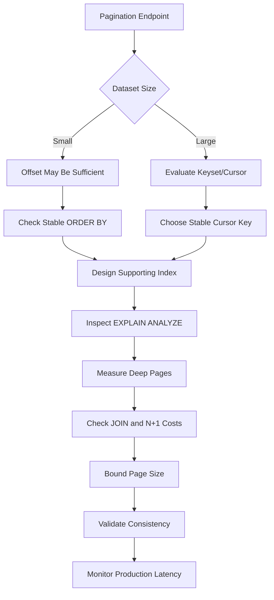

# 30- Pagination Optimization

## Overview

Pagination limits the number of rows returned by a query and allows APIs to expose large datasets incrementally. It is common in REST APIs, administrative interfaces, search endpoints, reporting systems, and service-to-service APIs.

Pagination is not automatically a performance optimization. A poorly designed pagination query can become increasingly expensive as the requested page moves deeper into a large dataset.

The central performance problem is usually **how the database locates the starting point for the next page**.

Two broad approaches dominate production systems:

- **Offset pagination** — use `LIMIT` and `OFFSET`.
- **Keyset pagination** — use a stable ordering key and a cursor representing the last row seen.

For small datasets, offset pagination is simple and often sufficient. For large or frequently changing datasets, keyset pagination usually provides more predictable performance.

## Why Pagination Performance Matters

Consider an API endpoint:

```text
GET /api/orders?page=5000&page_size=50
```

A naïve implementation may execute:

```sql
SELECT
    id,
    customer_id,
    status,
    created_at,
    total_amount
FROM orders
ORDER BY created_at DESC, id DESC
LIMIT 50
OFFSET 249950;
```

The database may need to process or traverse a large number of preceding rows before returning the requested 50 rows.

As the offset increases:

```text
Page 1       → small amount of work
Page 100     → more work
Page 5,000   → potentially substantial work
Page 100,000 → potentially very expensive
```

The application sees only 50 rows, but the database may need to examine significantly more.

## Pagination Strategies

| Strategy | Query mechanism | Deep-page performance | Stable under inserts | Random page access | Typical use |
|---|---|---:|---:|---:|---|
| Offset | `LIMIT/OFFSET` | Degrades | No | Yes | Admin UIs, small datasets |
| Keyset | `WHERE` + ordered key | Usually predictable | Better | No | Large production APIs |
| Cursor | Encoded position | Usually predictable | Better | No | Public APIs |
| Time-based | Timestamp boundary | Good with suitable index | Depends on ordering | No | Feeds, event streams |
| Hybrid | Offset for shallow, cursor for deep | Workload-dependent | Depends | Limited | Specialized APIs |

Cursor pagination is usually an API representation of keyset pagination rather than a fundamentally different database access technique.

## Offset Pagination

Offset pagination uses:

```sql
LIMIT <page_size>
OFFSET <rows_to_skip>
```

Example:

```sql
SELECT
    id,
    email,
    created_at
FROM customers
ORDER BY created_at DESC, id DESC
LIMIT 50
OFFSET 1000;
```

For page number `n` and page size `s`:

```text
OFFSET = (n - 1) × s
```

For example:

```text
page = 21
size = 50

OFFSET = (21 - 1) × 50
       = 1000
```

### Advantages

- Simple to implement.
- Easy to understand.
- Supports random page access.
- Works naturally with UI controls such as "Page 10".
- Compatible with many ORM pagination APIs.
- Convenient when the dataset is small.

### Limitations

- Deep offsets can become expensive.
- Results can shift when rows are inserted or deleted.
- Large offsets can increase database work.
- Page-number semantics become increasingly inefficient for large datasets.

## Why Large OFFSET Can Be Expensive

Suppose:

```sql
SELECT id
FROM orders
ORDER BY created_at DESC
LIMIT 50
OFFSET 1000000;
```

The database cannot generally jump directly to "row 1,000,001" without considering the ordering and visibility rules required to produce the correct result.

Even when an index supports the ordering, the database may need to walk past many index entries before producing the requested page.

Conceptually:

```text
Index
│
├── row 1
├── row 2
├── row 3
├── ...
├── row 1,000,000   ← skipped
├── row 1,000,001   ← first returned row
└── row 1,000,050   ← last returned row
```

This is why an index does not automatically make arbitrarily large offsets cheap.

## Keyset Pagination

Keyset pagination uses the values of the last row from the previous page as the starting boundary for the next query.

For example, suppose the ordering is:

```sql
ORDER BY created_at DESC, id DESC
```

The first page:

```sql
SELECT
    id,
    customer_id,
    created_at,
    total_amount
FROM orders
ORDER BY created_at DESC, id DESC
LIMIT 50;
```

Assume the final row returned has:

```text
created_at = 2026-08-31 12:30:00
id         = 12345
```

The next page can use:

```sql
SELECT
    id,
    customer_id,
    created_at,
    total_amount
FROM orders
WHERE
    created_at < TIMESTAMP '2026-08-31 12:30:00'
    OR (
        created_at = TIMESTAMP '2026-08-31 12:30:00'
        AND id < 12345
    )
ORDER BY created_at DESC, id DESC
LIMIT 50;
```

Instead of asking the database to skip 50 rows repeatedly, the query specifies the exact position after which rows should be returned.

## Why Keyset Pagination Scales Better

With a suitable index:

```text
Previous page
     │
     ▼
last_seen = (created_at, id)
     │
     ▼
Index seek
     │
     ▼
next 50 rows
```

The database can use the boundary as an index range condition.

The amount of work is therefore much less dependent on how many pages have already been traversed.

This makes keyset pagination particularly useful for:

- Large tables.
- High-traffic APIs.
- Infinite scrolling.
- Activity feeds.
- Event timelines.
- Order histories.
- Audit logs.
- Message lists.
- Time-ordered resources.

## Stable Ordering Is Mandatory

Pagination requires deterministic ordering.

Avoid:

```sql
ORDER BY created_at DESC
```

if `created_at` is not unique and the database is free to order rows with identical timestamps arbitrarily.

Prefer:

```sql
ORDER BY created_at DESC, id DESC
```

where `id` is unique.

The ordering must match the pagination boundary.

For descending order:

```sql
WHERE
    created_at < :last_created_at
    OR (
        created_at = :last_created_at
        AND id < :last_id
    )
```

For ascending order:

```sql
WHERE
    created_at > :last_created_at
    OR (
        created_at = :last_created_at
        AND id > :last_id
    )
```

The unique tie-breaker prevents duplicates and gaps caused by equal primary sort values.

## Composite Keyset Pagination

For:

```sql
ORDER BY created_at DESC, id DESC
```

the logical cursor is:

```text
(created_at, id)
```

The query condition is:

```sql
WHERE
    created_at < :created_at
    OR (
        created_at = :created_at
        AND id < :id
    )
```

Some PostgreSQL queries can express this using row-value comparison:

```sql
SELECT
    id,
    customer_id,
    created_at
FROM orders
WHERE (created_at, id) < (:created_at, :id)
ORDER BY created_at DESC, id DESC
LIMIT 50;
```

The exact syntax and optimizer behavior should be validated for the target database.

## Indexing for Pagination

The index should support the pagination predicate and ordering.

For:

```sql
ORDER BY created_at DESC, id DESC
```

a useful PostgreSQL index can be:

```sql
CREATE INDEX idx_orders_created_id
ON orders (created_at DESC, id DESC);
```

The exact index direction may not always be necessary because PostgreSQL can scan indexes in either direction, but explicitly matching the intended ordering can make the design clearer.

For a tenant-scoped endpoint:

```sql
SELECT
    id,
    customer_id,
    created_at
FROM orders
WHERE tenant_id = $1
  AND (created_at, id) < ($2, $3)
ORDER BY created_at DESC, id DESC
LIMIT 50;
```

the index should generally begin with the equality filter:

```sql
CREATE INDEX idx_orders_tenant_created_id
ON orders (tenant_id, created_at DESC, id DESC);
```

The design principle is:

```text
Equality predicates
        ↓
Range / pagination predicate
        ↓
Ordering columns
```

Index design must still be validated against actual query plans and workload characteristics.

## Filtering and Pagination

Pagination should be applied to the final logical dataset, not to an unrelated intermediate result.

Example:

```sql
SELECT
    id,
    customer_id,
    created_at
FROM orders
WHERE tenant_id = $1
  AND status = 'completed'
ORDER BY created_at DESC, id DESC
LIMIT 50;
```

A suitable index may be:

```sql
CREATE INDEX idx_orders_tenant_status_created_id
ON orders (
    tenant_id,
    status,
    created_at DESC,
    id DESC
);
```

Whether this is the best index depends on:

- Selectivity of `tenant_id`.
- Selectivity of `status`.
- Query frequency.
- Table size.
- Write rate.
- Other query patterns.

Do not create indexes solely from the SQL text without considering the complete workload.

## Partial Indexes

When a query consistently targets a small subset of rows, a partial index can be effective in PostgreSQL.

For example:

```sql
CREATE INDEX idx_orders_active_created_id
ON orders (tenant_id, created_at DESC, id DESC)
WHERE status = 'active';
```

This can reduce index size and potentially improve access for:

```sql
SELECT
    id,
    customer_id,
    created_at
FROM orders
WHERE tenant_id = $1
  AND status = 'active'
  AND (created_at, id) < ($2, $3)
ORDER BY created_at DESC, id DESC
LIMIT 50;
```

Partial indexes are workload-specific. They are not appropriate when queries frequently need rows outside the indexed predicate.

## Pagination With JOINs

JOINs can complicate pagination.

Consider:

```sql
SELECT
    o.id,
    o.created_at,
    c.email
FROM orders AS o
JOIN customers AS c
    ON c.id = o.customer_id
WHERE o.tenant_id = $1
ORDER BY o.created_at DESC, o.id DESC
LIMIT 50;
```

If the ordering and filtering columns belong to `orders`, an index on:

```sql
CREATE INDEX idx_orders_tenant_created_id
ON orders (tenant_id, created_at DESC, id DESC);
```

can help the database locate the correct orders before performing the customer lookup.

This is often preferable to creating a large intermediate joined result and paginating afterward.

## Pagination Before Expensive JOINs

A useful optimization pattern is to identify the page of IDs first, then fetch related data.

For example:

```sql
WITH page AS (
    SELECT
        id,
        customer_id,
        created_at
    FROM orders
    WHERE tenant_id = $1
      AND (created_at, id) < ($2, $3)
    ORDER BY created_at DESC, id DESC
    LIMIT 50
)
SELECT
    p.id,
    p.created_at,
    c.email
FROM page AS p
JOIN customers AS c
    ON c.id = p.customer_id
ORDER BY p.created_at DESC, p.id DESC;
```

The key idea is:

```text
Large orders table
       │
       ▼
filter + index seek
       │
       ▼
50 order IDs
       │
       ▼
JOIN related data
       │
       ▼
API response
```

This can be valuable when related joins are expensive, but the optimizer may transform the query. Verify the actual plan before assuming the CTE physically executes first.

## Pagination and One-to-Many JOINs

A common mistake is paginating after a one-to-many join:

```sql
SELECT
    c.id,
    c.email,
    o.id AS order_id
FROM customers AS c
LEFT JOIN orders AS o
    ON o.customer_id = c.id
ORDER BY c.id
LIMIT 50;
```

If one customer has many orders, one logical customer can occupy many physical result rows.

The `LIMIT 50` therefore does not necessarily mean 50 customers.

If the API contract is "50 customers", identify and paginate customers first:

```sql
WITH customer_page AS (
    SELECT
        id,
        email
    FROM customers
    WHERE id > $1
    ORDER BY id
    LIMIT 50
)
SELECT
    cp.id,
    cp.email,
    o.id AS order_id
FROM customer_page AS cp
LEFT JOIN orders AS o
    ON o.customer_id = cp.id
ORDER BY cp.id, o.id;
```

This distinction is critical in ORM-generated SQL as well.

## Avoiding COUNT(*) for Every Page

Many pagination implementations execute:

```sql
SELECT COUNT(*)
FROM orders
WHERE tenant_id = $1;
```

alongside:

```sql
SELECT ...
FROM orders
WHERE tenant_id = $1
ORDER BY created_at DESC, id DESC
LIMIT 50;
```

The count can be expensive for large filtered datasets.

If the API does not require an exact total, consider returning:

```json
{
  "items": [],
  "next_cursor": "..."
}
```

instead of:

```json
{
  "items": [],
  "page": 500,
  "total_pages": 100000,
  "total_items": 5000000
}
```

For cursor-based APIs, a common approach is to fetch one extra row:

```sql
LIMIT 51
```

Then:

- Return the first 50 rows.
- If row 51 exists, provide a `next_cursor`.
- Discard row 51 from the response.

This avoids requiring an exact count.

## Pagination and `COUNT(*) OVER ()`

A query can expose the total using a window function:

```sql
SELECT
    id,
    customer_id,
    created_at,
    COUNT(*) OVER () AS total_count
FROM orders
WHERE tenant_id = $1
ORDER BY created_at DESC, id DESC
LIMIT 50;
```

This may be convenient but does not make counting free.

The database still needs to determine the total cardinality of the filtered result.

For large datasets, exact total counts can therefore dominate the cost even when only 50 rows are returned.

## Cursor Design

A cursor should represent the position in the ordered result set.

For:

```sql
ORDER BY created_at DESC, id DESC
```

a cursor may contain:

```json
{
  "created_at": "2026-08-31T12:30:00Z",
  "id": 12345
}
```

For public APIs, this state is commonly encoded:

```text
base64url(...)
```

A production cursor should generally be:

- Opaque to clients.
- Validated on decode.
- Versioned if the format may evolve.
- Bound to relevant query semantics where necessary.
- Safe from tampering.
- Independent of sensitive internal information.

A cursor should not expose secrets or authorization-sensitive information.

## Cursor Integrity

Suppose a cursor is simply:

```text
created_at=2026-08-31&id=12345
```

Clients can modify it.

That is not automatically a security vulnerability, but the server must treat cursor values as untrusted input.

Validate:

- Data types.
- Allowed ranges.
- Expected cursor version.
- Query compatibility.
- Tenant context.
- Sort direction.

If the cursor is signed, the server can detect tampering.

For example, conceptually:

```text
cursor payload
     │
     ▼
encode
     │
     ▼
sign
     │
     ▼
opaque cursor
```

The exact implementation depends on the API architecture and security requirements.

## Pagination Consistency

Pagination over changing data introduces consistency questions.

Suppose page 1 returns:

```text
A
B
C
```

Then a new row `X` is inserted at the beginning.

With offset pagination:

```text
Page 1:
X
A
B

Page 2:
C
D
E
```

Depending on timing and concurrent changes, rows may be duplicated or skipped between requests.

Keyset pagination is more resilient because the next request continues from a specific ordering boundary:

```text
Page 1
A
B
C
     │
     ▼
cursor = C
     │
     ▼
Page 2
D
E
F
```

However, keyset pagination does not provide a globally consistent snapshot across separate requests. Updates to ordering columns, deletes, inserts, and transaction boundaries can still affect what users see.

For strict consistency requirements, consider snapshot semantics or a stable versioning strategy rather than relying solely on pagination technique.

## Choosing the Correct Sort Key

Good pagination keys should be:

- Deterministic.
- Indexed.
- Stable during pagination.
- Efficient for range comparisons.
- Selective enough to support the workload.
- Combined with a unique tie-breaker when necessary.

Common choices:

| Sort key | Suitable? | Notes |
|---|---|---|
| Auto-increment ID | Excellent | Stable and unique |
| UUID | Good | Good tie-breaker; ordering semantics depend on UUID type |
| `created_at` | Good with tie-breaker | Timestamp may not be unique |
| `updated_at` | Risky | Changes can move rows between pages |
| Random value | Poor | Difficult to paginate predictably |
| Non-unique status | Poor | Insufficient ordering precision |

A frequently useful ordering is:

```sql
ORDER BY created_at DESC, id DESC
```

## Pagination on Mutable Ordering Columns

Consider:

```sql
ORDER BY updated_at DESC, id DESC
```

If an item is updated after page 1 is retrieved, it can move to the beginning of the result set.

The next page may then behave differently.

For feeds and history endpoints, immutable creation ordering is often safer:

```sql
ORDER BY created_at DESC, id DESC
```

If business requirements explicitly require "most recently updated", the API should document the consistency behavior.

## Limit Page Size

Never allow clients to request arbitrary page sizes:

```http
GET /orders?page_size=1000000
```

A backend should enforce a maximum:

```python
MAX_PAGE_SIZE = 100

page_size = min(requested_page_size, MAX_PAGE_SIZE)
```

The exact limit depends on:

- Row width.
- Query complexity.
- API latency targets.
- Network bandwidth.
- Serialization cost.
- Database capacity.

Pagination protects the database only if the maximum page size is also controlled.

## API Pagination Design

A cursor-based REST API can use:

```http
GET /api/orders?limit=50
```

Response:

```json
{
  "items": [
    {
      "id": 12345,
      "created_at": "2026-08-31T12:30:00Z"
    }
  ],
  "next_cursor": "eyJ2IjoxLCJpZCI6MTIzNDUsImNyZWF0ZWRfYXQiOiIyMDI2..."
}
```

The next request:

```http
GET /api/orders?limit=50&cursor=eyJ2IjoxLCJpZCI6MTIzNDUsImNyZWF0ZCI6...
```

A useful response contract should make it clear:

- How many rows are returned.
- Whether more data exists.
- How to request the next page.
- Whether the cursor is opaque.
- What ordering is guaranteed.

## FastAPI Example

A simplified production-oriented pattern:

```python
from datetime import datetime

from fastapi import FastAPI, Query
from pydantic import BaseModel

app = FastAPI()


class Order(BaseModel):
    id: int
    customer_id: int
    created_at: datetime


class OrderPage(BaseModel):
    items: list[Order]
    next_cursor: str | None


@app.get("/orders", response_model=OrderPage)
async def list_orders(
    limit: int = Query(default=50, ge=1, le=100),
    cursor: str | None = None,
):
    # Decode and validate the cursor before constructing the SQL query.
    # The database query should use a parameterized keyset predicate.
    raise NotImplementedError
```

The important design is not the framework code itself. The database query should remain responsible for efficient filtering and ordering rather than loading large datasets into Python and paginating there.

## Django Example

Django's `Paginator` commonly maps to offset-based behavior:

```python
from django.core.paginator import Paginator

orders = Order.objects.order_by("-created_at", "-id")

paginator = Paginator(orders, 50)
page = paginator.get_page(page_number)
```

This is convenient and appropriate for many internal interfaces.

For high-volume APIs, consider implementing keyset/cursor pagination explicitly rather than assuming ORM pagination is efficient for deep pages.

For example, conceptually:

```python
orders = (
    Order.objects
    .filter(
        created_at__lt=last_created_at,
    )
    .order_by("-created_at", "-id")[:50]
)
```

When using a composite boundary, the exact ORM expression should preserve the same lexicographic semantics as the SQL query.

## N+1 Problems After Pagination

Pagination reduces the number of primary rows returned, but it does not automatically prevent N+1 queries.

For example:

```python
orders = Order.objects.order_by("-created_at", "-id")[:50]

for order in orders:
    print(order.customer.email)
```

This may execute one query for orders plus many customer queries.

Prefer appropriate eager loading:

```python
orders = (
    Order.objects
    .select_related("customer")
    .order_by("-created_at", "-id")[:50]
)
```

The exact strategy depends on relationship cardinality.

For one-to-many or many-to-many relationships, `prefetch_related()` may be more appropriate.

Pagination and query optimization must therefore be considered together.

## Measuring Pagination Performance

Use actual execution plans.

For PostgreSQL:

```sql
EXPLAIN (ANALYZE, BUFFERS)
SELECT
    id,
    customer_id,
    created_at
FROM orders
WHERE tenant_id = 42
  AND (created_at, id) < (
      TIMESTAMP '2026-08-31 12:30:00',
      12345
  )
ORDER BY created_at DESC, id DESC
LIMIT 50;
```

Compare this against the offset version:

```sql
EXPLAIN (ANALYZE, BUFFERS)
SELECT
    id,
    customer_id,
    created_at
FROM orders
WHERE tenant_id = 42
ORDER BY created_at DESC, id DESC
LIMIT 50
OFFSET 500000;
```

Measure:

- Execution time.
- Planning time.
- Rows scanned.
- Rows returned.
- Buffer hits.
- Buffer reads.
- Temporary I/O.
- CPU utilization.
- Lock waits.
- Database connection occupancy.

Benchmark several depths:

```text
page 1
page 100
page 1,000
page 10,000
page 100,000
```

A pagination strategy should be evaluated against the depth users and services actually reach.

## Pagination Performance Workflow



## Production Considerations

### Database Load

Pagination can significantly affect database capacity.

A deep-offset endpoint under high concurrency can produce:

```text
100 requests/sec
×
large OFFSET processing
×
complex joins
=
high CPU / I/O
```

The result may be elevated:

- Query latency.
- CPU utilization.
- Buffer reads.
- Connection pool usage.
- API latency.
- Error rates.

Keyset pagination can provide substantially more predictable work when the query and index are designed correctly.

### Network and Serialization Cost

Database optimization is only one part of pagination.

Returning 1,000 rows can also increase:

- Database-to-application transfer.
- JSON serialization.
- Response size.
- Network latency.
- Client memory usage.

Keep page sizes bounded and return only required columns.

### Caching

Caching individual pages can be difficult when using offset pagination because inserts and deletes can shift page contents.

Cursor-based results are also mutable, but cacheability can sometimes be improved when the cursor and query parameters represent a deterministic boundary.

Do not assume pagination results are safe to cache without considering:

- Authorization.
- Tenant identity.
- Query filters.
- Data freshness.
- Cursor semantics.
- HTTP cache behavior.

### Read Replicas

Read-heavy pagination workloads can be routed to replicas where eventual consistency is acceptable.

However:

- Replica lag can change visible results.
- Newly created records may not immediately appear.
- Cursor behavior can differ if requests move between replicas.

For APIs requiring strict read-after-write semantics, route appropriately or use a consistency strategy.

### Partitioned Tables

Very large event or audit tables may be partitioned by time or another suitable key.

Pagination can benefit when the query's predicates allow partition pruning:

```sql
WHERE created_at >= :start_time
  AND created_at < :end_time
```

But partitioning does not automatically make pagination fast.

The query must still have an efficient ordering and filtering strategy.

## Common Mistakes and Pitfalls

### Using Huge OFFSET Values

```sql
LIMIT 50 OFFSET 1000000;
```

**Why it happens:** offset pagination is easy to implement.

**Problem:** the database may need to traverse a large amount of ordered data.

**Better approach:** use keyset/cursor pagination for large datasets.

### Sorting Without a Unique Tie-Breaker

```sql
ORDER BY created_at DESC
```

**Why it happens:** timestamps appear unique in development.

**Problem:** multiple rows can share the same timestamp.

**Better approach:**

```sql
ORDER BY created_at DESC, id DESC
```

### Missing Supporting Indexes

A keyset predicate without an appropriate index may still scan a large portion of the table.

**Better approach:** align the index with tenant/filter columns, pagination keys, and ordering.

### Paginating a One-to-Many JOIN Directly

**Problem:** `LIMIT 50` may limit joined rows rather than logical parent records.

**Better approach:** paginate the parent entity first when the API contract is based on parent records.

### Counting Every Page

**Problem:** an exact `COUNT(*)` over a large filtered dataset can become expensive.

**Better approach:** omit totals when unnecessary or use an explicit approximate-count strategy when the product requirements allow it.

### Unlimited Page Sizes

**Problem:**

```http
?page_size=1000000
```

can become a denial-of-service vector against database and application resources.

**Better approach:** enforce a server-side maximum.

### Paginating in Python

Avoid:

```python
orders = list(Order.objects.all())
page = orders[offset:offset + limit]
```

This loads unnecessary data into application memory.

Pagination should happen in the database:

```python
orders = Order.objects.all()[offset:offset + limit]
```

or through an appropriate keyset strategy.

### Assuming Indexes Solve Everything

An index can improve row location, but the query may still be dominated by:

- Expensive joins.
- Sorting.
- Aggregation.
- Row visibility checks.
- Large result rows.
- Exact counting.
- ORM-generated N+1 queries.

Always inspect the complete execution plan.

## Security Considerations

Pagination parameters are untrusted input.

Validate:

- Page size.
- Cursor structure.
- Sort direction.
- Filter values.
- Tenant boundaries.
- Authorization constraints.

Use parameterized SQL:

```sql
WHERE tenant_id = $1
  AND (created_at, id) < ($2, $3)
```

Do not construct SQL by string concatenation.

For example, avoid:

```python
query = f"""
    SELECT *
    FROM orders
    WHERE tenant_id = {tenant_id}
"""
```

Pagination endpoints should also be protected against resource exhaustion through:

- Maximum page size.
- Query timeouts where appropriate.
- Rate limiting.
- Authentication and authorization.
- Reasonable filter complexity.
- Monitoring for abnormal deep-page requests.

## Scalability Guidance

For high-scale APIs:

- Prefer keyset/cursor pagination for large datasets.
- Use deterministic ordering.
- Add supporting composite indexes.
- Bound page size.
- Avoid unnecessary exact counts.
- Return only required columns.
- Avoid N+1 queries.
- Paginate logical parent entities rather than multiplied JOIN rows.
- Benchmark deep-page access.
- Monitor query latency and database resource consumption.
- Keep cursor formats versionable.
- Consider immutable ordering keys for feeds and histories.

A common production architecture is:

```text
Client
  │
  ▼
Nginx / Load Balancer
  │
  ▼
FastAPI / Django
  │
  ├── authentication / authorization
  │
  ├── cursor validation
  │
  └── bounded page size
          │
          ▼
     PostgreSQL
          │
          ├── composite index
          │
          └── keyset range scan
```

## Offset Versus Keyset: Decision Guide

| Requirement | Recommended approach |
|---|---|
| Small table | Offset |
| Internal admin UI | Offset |
| Users need "go to page 50" | Offset |
| Infinite scrolling | Keyset/Cursor |
| Very large table | Keyset/Cursor |
| High-throughput API | Keyset/Cursor |
| Frequently changing feed | Keyset/Cursor |
| Exact total required | Offset or cursor + separate count |
| Stable chronological history | Keyset |
| Arbitrary random access | Offset |
| Service-to-service iteration | Keyset/Cursor |

The decision is not ideological. Choose based on:

```text
dataset size
+
access pattern
+
consistency requirements
+
API requirements
+
index availability
+
database workload
```

## Interview Traps

| Question | Strong answer |
|---|---|
| Why can `OFFSET` become slow? | The database may need to traverse or process many preceding rows before returning the requested page. |
| Does an index make large OFFSET free? | No. An index can make ordering and lookup more efficient, but the database may still need to walk past many entries. |
| What is keyset pagination? | Pagination based on an ordered key boundary rather than a row count offset. |
| Why use `id` with `created_at`? | `created_at` may not be unique, so `id` provides deterministic ordering and prevents ambiguous boundaries. |
| Is cursor pagination always consistent? | No. It reduces some offset-related shifting but does not create a cross-request database snapshot. |
| Why can `COUNT(*)` hurt pagination performance? | Exact counting may require processing a large filtered result even though the API only returns a small page. |
| What index supports `ORDER BY created_at DESC, id DESC`? | Typically an index beginning with the relevant equality filters followed by the ordering/range columns. |
| Can pagination solve an N+1 problem? | No. Pagination limits rows but does not prevent additional queries per row. |
| Why can JOINs break pagination? | One-to-many joins multiply physical rows, so `LIMIT 50` may not represent 50 logical parent records. |
| What is the main trade-off of keyset pagination? | It provides efficient sequential traversal but does not naturally support arbitrary page-number access. |

## Key Takeaways

- **Offset pagination is simple but can become increasingly expensive for deep pages because the database may need to traverse many preceding rows.**
- **Keyset/cursor pagination provides more predictable large-scale performance by using indexed ordering keys as range boundaries.**
- **Always use deterministic ordering, typically combining a primary sort key such as `created_at` with a unique tie-breaker such as `id`.**
- **Design pagination indexes around equality filters, pagination boundaries, and ordering columns, then validate them with actual execution plans.**
- **Production pagination must also control page size, avoid unnecessary counts and N+1 queries, preserve authorization boundaries, and account for consistency under concurrent data changes.**