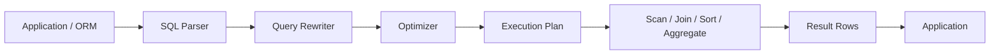
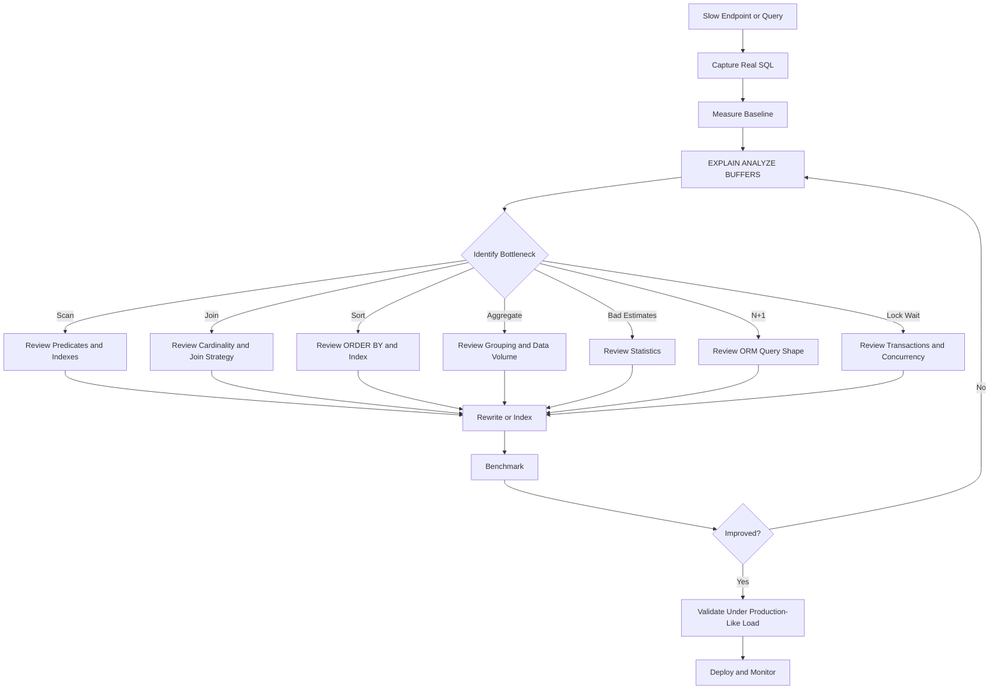

# 31- Query Optimization Rules

## Overview

SQL query optimization is the disciplined process of reducing the resources required to execute a query while preserving its correctness and required behavior.

For backend systems, query performance directly affects:

- API latency.
- Database CPU and I/O.
- Connection pool utilization.
- Application throughput.
- Infrastructure cost.
- Lock contention.
- Overall system reliability.

A useful optimization mindset is:

```text
Correct query
    ↓
Understand workload
    ↓
Inspect execution plan
    ↓
Identify bottleneck
    ↓
Rewrite query / improve index / change access pattern
    ↓
Benchmark
    ↓
Validate production impact
```

The most important rule is:

> **Do not optimize SQL based on appearance alone. Optimize based on measured execution behavior.**

A query that looks complex can be fast, while a simple query can become extremely expensive on a large table.

This document focuses primarily on relational databases and uses PostgreSQL examples because PostgreSQL exposes execution-plan details particularly well. The underlying principles apply broadly to other relational databases.

## The Core Optimization Rules

| Rule | Primary goal |
|---|---|
| Measure before changing SQL | Avoid speculative optimization |
| Inspect the execution plan | Understand actual database behavior |
| Return only required rows | Reduce database and application work |
| Return only required columns | Reduce I/O and network transfer |
| Keep predicates index-friendly | Enable efficient index access |
| Avoid unnecessary functions on indexed columns | Preserve index usability |
| Use selective filters early | Reduce rows processed downstream |
| Design indexes for real query patterns | Improve filtering and ordering |
| Avoid unnecessary `JOIN`s | Reduce work and row multiplication |
| Avoid unnecessary `DISTINCT` | Prevent expensive deduplication |
| Control pagination depth | Avoid large offset costs |
| Avoid unnecessary exact counts | Prevent full-result counting |
| Rewrite expensive subqueries when appropriate | Improve optimizer choices |
| Keep statistics current | Help the optimizer estimate cardinality |
| Avoid ORM-generated N+1 queries | Reduce query count |
| Benchmark with production-like data | Prevent misleading conclusions |

These are guidelines rather than absolute laws. The optimizer may legitimately choose a different strategy when statistics, data distribution, or query costs make it cheaper.

## Start With Measurement

Before modifying a query, establish a baseline.

For PostgreSQL:

```sql
EXPLAIN (ANALYZE, BUFFERS)
SELECT
    id,
    customer_id,
    created_at
FROM orders
WHERE tenant_id = 42
  AND status = 'completed'
ORDER BY created_at DESC
LIMIT 50;
```

Important measurements include:

| Metric | What it tells you |
|---|---|
| Execution Time | Actual query duration |
| Planning Time | Time spent generating the plan |
| Actual Rows | Rows actually produced |
| Estimated Rows | Optimizer's cardinality estimate |
| Buffers | Memory and disk I/O behavior |
| Loops | Number of times a plan node executes |
| Sort Method | How sorting was performed |
| Temporary I/O | Potential memory pressure or spilling |
| Index usage | Whether expected indexes are being used |

Do not rely only on total execution time.

For example:

```text
Execution Time: 800 ms
```

does not explain whether the problem is:

- Sequential scanning.
- Bad cardinality estimates.
- An inefficient join.
- Sorting.
- Aggregation.
- Disk I/O.
- Lock waiting.
- Excessive loops.

The execution plan provides that context.

## Understand the Query Lifecycle

A useful mental model is:



The optimizer considers multiple possible strategies and estimates their cost using:

- Table statistics.
- Index statistics.
- Cardinality estimates.
- Available indexes.
- Join relationships.
- Predicate selectivity.
- Sorting requirements.
- Aggregation requirements.
- Database configuration.

The optimizer's goal is not to make SQL text look elegant. Its goal is to select a low-cost execution strategy.

## Rule: Return Only Required Rows

Avoid:

```sql
SELECT *
FROM orders
WHERE tenant_id = $1;
```

Prefer:

```sql
SELECT
    id,
    customer_id,
    status,
    created_at,
    total_amount
FROM orders
WHERE tenant_id = $1;
```

This matters because unnecessary columns can increase:

- Heap or table I/O.
- Memory usage.
- Network transfer.
- Serialization cost.
- Application memory.
- Cache pressure.

For wide tables, this difference can be significant.

### Production Consideration

An API endpoint should generally select only fields required by its response contract.

In Django:

```python
orders = (
    Order.objects
    .filter(tenant_id=tenant_id)
    .values(
        "id",
        "customer_id",
        "status",
        "created_at",
        "total_amount",
    )
)
```

In SQLAlchemy:

```python
stmt = select(
    Order.id,
    Order.customer_id,
    Order.status,
    Order.created_at,
    Order.total_amount,
).where(Order.tenant_id == tenant_id)
```

Avoid selecting large JSON, text, or binary columns when the endpoint does not need them.

## Rule: Filter as Early as Practical

Consider:

```sql
SELECT ...
FROM orders AS o
JOIN customers AS c
    ON c.id = o.customer_id
WHERE o.tenant_id = $1;
```

The optimizer may already push predicates down into scans and joins. SQL text order does not necessarily determine physical execution order.

The important point is to express restrictive predicates correctly and provide indexes that allow the optimizer to exploit them.

For example:

```sql
CREATE INDEX idx_orders_tenant_customer
ON orders (tenant_id, customer_id);
```

may be useful for workload patterns involving:

```sql
WHERE tenant_id = $1
```

and the subsequent join.

Do not assume that manually rewriting the SQL into a particular textual order will force execution order.

## Rule: Use SARGable Predicates

A predicate is generally considered SARGable when it can be transformed into an efficient search condition that allows the database to use an appropriate index.

Prefer:

```sql
WHERE created_at >= $1
```

over expressions that transform the indexed column:

```sql
WHERE DATE(created_at) = $1
```

The second form may prevent efficient use of a normal index on `created_at`.

Rewrite the date condition as a range:

```sql
WHERE created_at >= $1
  AND created_at < $2
```

For example:

```text
2026-09-01 00:00:00
≤ created_at <
2026-09-02 00:00:00
```

This preserves the original timestamp column and provides an index-friendly range.

## Rule: Avoid Functions on Indexed Columns

Avoid:

```sql
WHERE LOWER(email) = LOWER($1)
```

when the intention is to use a normal index on:

```sql
email
```

Better approaches include:

- Functional indexes.
- Case-insensitive data types where appropriate.
- Normalizing values at write time.
- Querying using a representation that matches the indexed data.

For PostgreSQL:

```sql
CREATE INDEX idx_users_lower_email
ON users (LOWER(email));
```

Then:

```sql
SELECT id
FROM users
WHERE LOWER(email) = LOWER($1);
```

can use the functional index when the planner determines it is beneficial.

The correct solution depends on the data model and workload.

## Rule: Avoid Leading Wildcards for Normal B-Tree Searches

This predicate is often difficult for a standard B-tree index:

```sql
WHERE email LIKE '%@example.com'
```

because the search does not begin with a known prefix.

A prefix search:

```sql
WHERE email LIKE 'admin%'
```

can be index-friendly depending on database, collation, and index configuration.

For PostgreSQL workloads requiring general substring or full-text searching, consider specialized indexing such as:

- `pg_trgm`.
- Full-text search.
- Search systems such as OpenSearch when justified.

Do not introduce a separate search engine simply because one query is slow. First understand the query volume and data characteristics.

## Rule: Design Indexes Around Query Patterns

An index should support real access patterns.

Suppose the common query is:

```sql
SELECT
    id,
    created_at,
    total_amount
FROM orders
WHERE tenant_id = $1
  AND status = $2
ORDER BY created_at DESC
LIMIT 50;
```

A candidate index is:

```sql
CREATE INDEX idx_orders_tenant_status_created
ON orders (
    tenant_id,
    status,
    created_at DESC
);
```

This aligns:

```text
tenant_id
    ↓
status
    ↓
created_at ordering
```

The exact column order depends on the workload and selectivity.

### Composite Index Principle

For many workloads, a useful starting point is:

```text
equality predicates
        ↓
range predicates
        ↓
ordering columns
```

But this is not a universal rule. Always verify with `EXPLAIN`.

## Rule: Do Not Create Indexes Blindly

Indexes improve reads but add costs to:

- `INSERT`.
- `UPDATE`.
- `DELETE`.
- Storage.
- Vacuum and maintenance.
- Backup size.
- Cache utilization.

A table with excessive overlapping indexes can become write-heavy and expensive.

Before creating an index, ask:

1. Which production query requires it?
2. How frequently does that query execute?
3. How selective are its predicates?
4. How large is the table?
5. What is the write rate?
6. Does another index already support the query?
7. Will the index improve the actual execution plan?

## Rule: Use Partial Indexes for Narrow Workloads

If a query repeatedly targets a small subset of rows, a partial index may be more efficient than indexing the entire table.

Example:

```sql
CREATE INDEX idx_orders_pending
ON orders (tenant_id, created_at DESC)
WHERE status = 'pending';
```

This can support queries such as:

```sql
SELECT
    id,
    created_at,
    total_amount
FROM orders
WHERE tenant_id = $1
  AND status = 'pending'
ORDER BY created_at DESC
LIMIT 50;
```

Advantages:

- Smaller index.
- Lower maintenance cost.
- Potentially better cache efficiency.

Limitation:

The index does not help queries requiring rows outside its predicate.

## Rule: Understand Selectivity

Selectivity describes how effectively a predicate narrows the result set.

Suppose:

```text
10,000,000 rows
```

and:

```sql
WHERE status = 'active'
```

returns:

```text
8,000,000 rows
```

The predicate is not highly selective.

An index on `status` alone may not be useful enough to justify index access.

Conversely:

```sql
WHERE id = $1
```

may return exactly one row.

The optimizer can compare the estimated costs of:

```text
Index Scan
vs
Sequential Scan
```

and choose the cheaper strategy.

### Important Interview Point

> **An index existing does not mean the optimizer should use it.**

A sequential scan can be the correct plan when a large fraction of the table must be read.

## Rule: Investigate Cardinality Estimates

A major cause of poor plans is an incorrect estimate of how many rows a predicate will return.

For example:

```text
Estimated rows: 100
Actual rows:    5,000,000
```

The optimizer may choose a nested loop because it expects very few rows, while the actual workload makes that strategy extremely expensive.

Large estimation errors should trigger investigation of:

- Stale statistics.
- Data skew.
- Correlated columns.
- Inadequate statistics targets.
- Complex predicates.
- Parameter-sensitive behavior.
- Missing extended statistics.

For PostgreSQL:

```sql
ANALYZE orders;
```

Do not treat `ANALYZE` as a universal fix. It refreshes statistics; it does not repair poor schema or query design.

## Rule: Keep Statistics Current

The optimizer depends on statistics.

PostgreSQL's autovacuum/analyze system normally maintains them automatically, but high-volume or unusual workloads may require tuning.

Check statistics-related configuration:

```sql
SHOW default_statistics_target;
```

Run:

```sql
ANALYZE orders;
```

after substantial data changes when immediate planner accuracy matters.

For skewed or correlated columns, PostgreSQL can use extended statistics:

```sql
CREATE STATISTICS orders_tenant_status_stats
ON tenant_id, status
FROM orders;
```

Then:

```sql
ANALYZE orders;
```

This can improve estimates for correlated predicates.

## Rule: Avoid Unnecessary `DISTINCT`

`DISTINCT` can require additional work:

```sql
SELECT DISTINCT customer_id
FROM orders;
```

Depending on the plan, the database may need to:

- Sort rows.
- Hash rows.
- Process a large intermediate result.

If duplicates are caused by an unnecessary join, fix the join instead of blindly adding `DISTINCT`.

Avoid:

```sql
SELECT DISTINCT c.id
FROM customers AS c
JOIN orders AS o
    ON o.customer_id = c.id
WHERE o.status = 'completed';
```

when the actual requirement is existence.

Prefer:

```sql
SELECT
    c.id
FROM customers AS c
WHERE EXISTS (
    SELECT 1
    FROM orders AS o
    WHERE o.customer_id = c.id
      AND o.status = 'completed'
);
```

The optimizer may be able to implement this efficiently as a semi-join.

## Rule: Choose the Correct JOIN

Different join strategies have different performance characteristics.

| Join strategy | Typical strength |
|---|---|
| Nested Loop | Small outer input + efficient inner lookup |
| Hash Join | Large unsorted inputs with equality join |
| Merge Join | Inputs already sorted or efficiently sortable |
| Semi Join | Existence checks |
| Anti Join | Absence checks |

The optimizer chooses the physical strategy based on estimated costs.

Do not force a join strategy simply because one strategy appears faster in a single test.

Investigate:

- Input cardinality.
- Available indexes.
- Join selectivity.
- Memory.
- Statistics.
- Data distribution.

## Rule: Avoid Unnecessary JOINs

If an endpoint only needs:

```sql
SELECT
    id,
    status
FROM orders
WHERE tenant_id = $1;
```

do not join:

```sql
customers
addresses
payments
products
```

unless their data is actually required.

Every additional join can introduce:

- Additional scans.
- Hash tables.
- Index lookups.
- Sorts.
- Row multiplication.
- Memory consumption.

This is particularly important with ORM query builders, where eager-loading configuration can unintentionally generate expensive SQL.

## Rule: Watch for One-to-Many Row Multiplication

Consider:

```sql
SELECT
    c.id,
    c.email,
    o.id AS order_id
FROM customers AS c
JOIN orders AS o
    ON o.customer_id = c.id;
```

If one customer has 1,000 orders, that customer produces 1,000 result rows.

Adding:

```sql
DISTINCT
```

may hide the symptom rather than solve the underlying requirement.

If the requirement is:

> Find customers who have at least one completed order.

Use:

```sql
SELECT
    c.id,
    c.email
FROM customers AS c
WHERE EXISTS (
    SELECT 1
    FROM orders AS o
    WHERE o.customer_id = c.id
      AND o.status = 'completed'
);
```

This communicates the actual intent to the optimizer.

## Rule: Prefer `EXISTS` for Existence Checks

Avoid retrieving rows when only existence matters.

Instead of:

```sql
SELECT COUNT(*)
FROM orders
WHERE customer_id = $1
  AND status = 'completed';
```

when the application only needs a boolean, use:

```sql
SELECT EXISTS (
    SELECT 1
    FROM orders
    WHERE customer_id = $1
      AND status = 'completed'
);
```

The database can stop once it establishes that a matching row exists.

This is both semantically clearer and potentially cheaper.

## Rule: Use `IN`, `EXISTS`, and JOINs Based on Semantics

These constructs can sometimes be transformed into similar physical plans, but they are not universally interchangeable.

For example:

```sql
WHERE customer_id IN (
    SELECT id
    FROM customers
    WHERE tenant_id = $1
)
```

and:

```sql
WHERE EXISTS (
    SELECT 1
    FROM customers AS c
    WHERE c.id = orders.customer_id
      AND c.tenant_id = $1
)
```

may produce equivalent strategies.

The correct choice should prioritize:

1. Correct semantics.
2. Readability.
3. Measured performance.
4. Optimizer behavior for the target database.

Do not memorize simplistic rules such as "`EXISTS` is always faster than `IN`."

## Rule: Optimize Correlated Subqueries Carefully

A correlated subquery references a value from the outer query:

```sql
SELECT
    c.id,
    c.email
FROM customers AS c
WHERE EXISTS (
    SELECT 1
    FROM orders AS o
    WHERE o.customer_id = c.id
      AND o.status = 'completed'
);
```

This can be efficient when implemented as a semi-join.

But other correlated expressions can result in repeated work.

Always inspect the plan:

```sql
EXPLAIN (ANALYZE, BUFFERS)
SELECT
    ...
```

The presence of a subquery does not itself imply poor performance.

## Rule: Avoid Repeated Scalar Subqueries

A pattern such as:

```sql
SELECT
    c.id,
    (
        SELECT COUNT(*)
        FROM orders AS o
        WHERE o.customer_id = c.id
    ) AS order_count
FROM customers AS c;
```

may be reasonable for small datasets, but can become expensive depending on cardinality and indexing.

Possible alternatives include pre-aggregation:

```sql
SELECT
    c.id,
    COALESCE(o.order_count, 0) AS order_count
FROM customers AS c
LEFT JOIN (
    SELECT
        customer_id,
        COUNT(*) AS order_count
    FROM orders
    GROUP BY customer_id
) AS o
    ON o.customer_id = c.id;
```

However, the rewrite is not automatically faster.

The optimizer may transform the original query efficiently, while the rewritten version may process far more rows.

Benchmark both.

## Rule: Avoid Unnecessary Sorting

Sorting can become expensive when the database must process a large intermediate result.

Example:

```sql
SELECT
    id,
    created_at
FROM orders
WHERE tenant_id = $1
ORDER BY created_at DESC;
```

A supporting index may allow the database to retrieve rows in the desired order without a separate large sort:

```sql
CREATE INDEX idx_orders_tenant_created
ON orders (tenant_id, created_at DESC);
```

This can be especially valuable for:

```sql
ORDER BY ...
LIMIT 50
```

because the database may stop after finding the required rows.

## Rule: Optimize `ORDER BY ... LIMIT`

This is a common high-value optimization pattern.

Query:

```sql
SELECT
    id,
    created_at,
    total_amount
FROM orders
WHERE tenant_id = $1
ORDER BY created_at DESC
LIMIT 50;
```

Potential index:

```sql
CREATE INDEX idx_orders_tenant_created
ON orders (tenant_id, created_at DESC);
```

The database may be able to:

```text
Seek to tenant
      ↓
Read newest rows
      ↓
Return 50
      ↓
Stop
```

without sorting the entire tenant's dataset.

For deterministic pagination:

```sql
ORDER BY created_at DESC, id DESC
```

use:

```sql
CREATE INDEX idx_orders_tenant_created_id
ON orders (tenant_id, created_at DESC, id DESC);
```

## Rule: Avoid Deep OFFSET Pagination

Avoid relying on:

```sql
LIMIT 50 OFFSET 500000;
```

for large datasets.

Prefer keyset pagination:

```sql
SELECT
    id,
    created_at,
    total_amount
FROM orders
WHERE tenant_id = $1
  AND (created_at, id) < ($2, $3)
ORDER BY created_at DESC, id DESC
LIMIT 50;
```

This allows the database to navigate from a known ordering boundary.

Offset pagination remains appropriate for:

- Small datasets.
- Internal admin tools.
- Interfaces requiring arbitrary page numbers.

## Rule: Do Not Count When You Do Not Need the Count

This:

```sql
SELECT COUNT(*)
FROM orders
WHERE tenant_id = $1;
```

can be expensive for large filtered datasets.

If an API only needs to know whether another page exists, fetch one extra row:

```sql
SELECT
    id,
    created_at
FROM orders
WHERE tenant_id = $1
  AND (created_at, id) < ($2, $3)
ORDER BY created_at DESC, id DESC
LIMIT 51;
```

Return:

```text
first 50 rows → response
51st row      → determines has_next_page
```

This avoids requiring an exact total.

## Rule: Avoid Application-Side Filtering

Avoid:

```python
orders = list(Order.objects.all())

filtered = [
    order
    for order in orders
    if order.status == "completed"
]
```

This moves database work into the application.

Prefer:

```python
orders = Order.objects.filter(status="completed")
```

The database can then use:

- Indexes.
- Statistics.
- Predicate pushdown.
- Efficient scans.
- Join optimization.

Application-side filtering should be reserved for logic that genuinely cannot be expressed efficiently in SQL.

## Rule: Avoid N+1 Queries

A query can be individually fast while the endpoint is still slow because the application executes hundreds or thousands of queries.

Example:

```python
orders = Order.objects.all()

for order in orders:
    print(order.customer.email)
```

Potential query pattern:

```text
1 query → orders
N queries → customers
```

Use:

```python
orders = Order.objects.select_related("customer")
```

for a foreign-key relationship when appropriate.

For collections:

```python
orders = Order.objects.prefetch_related("items")
```

The correct ORM optimization depends on relationship cardinality and response requirements.

## Rule: Control ORM Query Shape

ORM abstractions do not remove SQL performance concerns.

Always inspect generated SQL when performance matters.

Django can expose executed queries during development:

```python
from django.db import connection

print(connection.queries)
```

For production analysis, prefer database-side monitoring rather than relying on application debug query logging.

The engineering workflow should be:

```text
ORM code
   ↓
Generated SQL
   ↓
Execution plan
   ↓
Database behavior
```

not:

```text
ORM code looks simple
   ↓
Assume query is fast
```

## Rule: Use CTEs Deliberately

Common Table Expressions improve readability and can structure complex queries:

```sql
WITH recent_orders AS (
    SELECT
        id,
        customer_id,
        created_at
    FROM orders
    WHERE created_at >= $1
)
SELECT
    customer_id,
    COUNT(*) AS order_count
FROM recent_orders
GROUP BY customer_id;
```

Do not assume a CTE automatically improves performance.

Modern PostgreSQL can inline eligible CTEs, while constructs such as `MATERIALIZED` can force materialization:

```sql
WITH recent_orders AS MATERIALIZED (
    ...
)
SELECT ...
```

Materialization can be useful when a computed result should intentionally be reused, but it can also increase memory and I/O.

Use execution plans to validate the choice.

## Rule: Rewrite Queries Only When the Plan Justifies It

Suppose:

```sql
SELECT ...
FROM orders
WHERE customer_id IN (
    SELECT id
    FROM customers
    WHERE tenant_id = $1
);
```

is slow.

Do not immediately rewrite it to:

```sql
SELECT ...
FROM orders AS o
JOIN customers AS c
    ON c.id = o.customer_id
WHERE c.tenant_id = $1;
```

First inspect:

```sql
EXPLAIN (ANALYZE, BUFFERS)
...
```

The optimizer may already transform both into an efficient semi-join or join.

SQL optimization is about physical execution, not merely changing syntax.

## Rule: Reduce Intermediate Result Sets

Many expensive queries become slow because a large intermediate result is created before later operations reduce it.

Conceptually:

```text
10M rows
   ↓
JOIN
   ↓
8M rows
   ↓
GROUP BY
   ↓
100K rows
   ↓
ORDER BY
   ↓
50 rows
```

A better plan may reduce data earlier:

```text
10M rows
   ↓
selective predicate
   ↓
500K rows
   ↓
JOIN
   ↓
100K rows
   ↓
GROUP BY
   ↓
50 rows
```

The optimizer can perform predicate pushdown and other transformations automatically, but query and index design determine what transformations are possible.

## Rule: Avoid Premature `GROUP BY`

If aggregation is not required, do not use it to remove duplicates caused by a bad join.

Avoid:

```sql
SELECT
    c.id
FROM customers AS c
JOIN orders AS o
    ON o.customer_id = c.id
GROUP BY c.id;
```

if the requirement is simply:

```text
customers having at least one order
```

Prefer:

```sql
SELECT
    c.id
FROM customers AS c
WHERE EXISTS (
    SELECT 1
    FROM orders AS o
    WHERE o.customer_id = c.id
);
```

This better expresses the business requirement.

## Rule: Avoid Functions That Prevent Index Usage

Common problematic patterns include:

```sql
WHERE DATE(created_at) = $1
```

```sql
WHERE LOWER(email) = $1
```

```sql
WHERE CAST(account_id AS TEXT) = $1
```

```sql
WHERE amount + 10 > $1
```

The correct rewrite depends on the expression.

Examples:

```sql
WHERE created_at >= $1
  AND created_at < $2
```

or use an appropriate expression index:

```sql
CREATE INDEX idx_users_lower_email
ON users (LOWER(email));
```

Do not mechanically rewrite every expression. Functional indexes can be the correct production solution.

## Rule: Be Careful With Implicit Type Conversion

Comparing incompatible data types can cause conversions:

```sql
WHERE account_id = $1
```

where the application binds the wrong type.

Prefer application parameters that match the database column type.

For Python applications, ensure database drivers and ORM fields correctly represent:

- Integers.
- UUIDs.
- Timestamps.
- Decimal values.
- Strings.

Implicit conversions can affect correctness and, depending on the database and expression, index usage.

## Rule: Use Parameterized Queries

Parameterized SQL is primarily a security requirement, but it also supports stable application behavior and plan management.

Use:

```sql
SELECT
    id,
    email
FROM users
WHERE id = $1;
```

not string interpolation:

```python
query = f"SELECT id, email FROM users WHERE id = {user_id}"
```

Parameterized queries prevent SQL injection when used correctly.

They also keep query structure separate from user-provided values.

## Rule: Do Not Optimize Only for the Happy Path

A query may be fast for:

```text
tenant_id = small tenant
```

but slow for:

```text
tenant_id = enterprise tenant with 50M rows
```

This is a data-distribution problem.

Benchmark:

- Small tenants.
- Large tenants.
- Empty results.
- Highly selective filters.
- Low-selectivity filters.
- Deep pagination.
- Worst-case date ranges.
- Peak concurrency.

Production performance is often determined by the worst realistic input rather than the median development dataset.

## Rule: Consider Concurrency, Not Just Single-Query Latency

Suppose a query takes:

```text
20 ms
```

in isolation.

At:

```text
1 request/sec
```

it may be irrelevant.

At:

```text
1,000 requests/sec
```

the same query can consume significant database resources.

Consider:

```text
query CPU
×
query frequency
×
concurrent execution
```

Optimization priorities should therefore consider workload volume.

A 5 ms query executed millions of times can matter more than a 500 ms administrative query executed once per day.

## Rule: Watch Connection Pool Pressure

Slow SQL holds database connections longer.

For example:

```text
Request
  ↓
Acquire DB connection
  ↓
Execute slow query
  ↓
Connection remains occupied
  ↓
Return connection
```

Under load:

```text
slow queries
    ↓
connections held longer
    ↓
pool exhaustion
    ↓
requests queue
    ↓
API latency increases
    ↓
timeouts
```

This is why SQL performance can become an application reliability problem.

Monitor:

- Connection pool utilization.
- Active connections.
- Query latency.
- Waiting connections.
- Query concurrency.
- Database CPU.
- I/O latency.

## Rule: Distinguish CPU, I/O, and Lock Problems

A slow query does not always mean poor query design.

Potential causes include:

| Symptom | Possible cause |
|---|---|
| High CPU | Expensive joins, sorting, aggregation |
| High disk reads | Large scans, poor locality |
| High buffer reads | Large working set |
| Lock waits | Concurrent transactions |
| Connection waits | Pool exhaustion |
| Temporary I/O | Sort/hash spilling |
| Bad row estimates | Stale or insufficient statistics |
| High application latency | DB or network bottleneck |

Always identify the bottleneck before changing SQL.

## Rule: Use Appropriate Timeouts

Long-running queries can consume resources and damage system stability.

Application-level timeouts should be aligned with endpoint requirements.

For PostgreSQL, a session or transaction can use:

```sql
SET LOCAL statement_timeout = '2s';
```

Use carefully and according to the transaction/session architecture.

Timeouts are not an optimization technique. They are a reliability boundary that prevents pathological queries from consuming resources indefinitely.

## Rule: Avoid Unbounded Queries in APIs

Avoid exposing endpoints that effectively allow:

```sql
SELECT *
FROM audit_logs;
```

with no:

- Time range.
- Pagination.
- Result limit.
- Tenant filter.

Prefer:

```sql
SELECT
    id,
    actor_id,
    action,
    created_at
FROM audit_logs
WHERE tenant_id = $1
  AND created_at >= $2
ORDER BY created_at DESC, id DESC
LIMIT 100;
```

This protects both the database and application layer.

## Rule: Optimize Aggregations Intentionally

Large aggregations can require substantial:

- CPU.
- Memory.
- Disk.
- Sorting.
- Hashing.

Example:

```sql
SELECT
    customer_id,
    COUNT(*) AS order_count,
    SUM(total_amount) AS revenue
FROM orders
WHERE created_at >= $1
GROUP BY customer_id;
```

For high-volume analytical workloads, consider:

- Pre-aggregated tables.
- Materialized views.
- Incremental aggregation.
- Read replicas.
- Dedicated analytical systems.

Do not move analytical workloads into the primary transactional database without understanding the resource impact.

## Rule: Consider Covering Indexes Carefully

If a query frequently needs a small set of columns, PostgreSQL can sometimes benefit from an index that contains additional non-key columns.

Example:

```sql
CREATE INDEX idx_orders_tenant_created_covering
ON orders (tenant_id, created_at DESC)
INCLUDE (id, status, total_amount);
```

This can enable index-only scans when visibility and other conditions permit.

Advantages:

- Less heap access.
- Potentially lower I/O.
- Faster read-heavy queries.

Limitations:

- Larger indexes.
- Higher write and maintenance cost.
- Index-only scans depend on visibility information.
- Not every query benefits.

Measure before and after.

## Rule: Avoid Over-Selecting Wide Rows

Consider:

```sql
SELECT *
FROM events
WHERE tenant_id = $1
ORDER BY created_at DESC
LIMIT 100;
```

If each row contains a large JSON document or payload, the query may be expensive even though only 100 rows are returned.

Prefer:

```sql
SELECT
    id,
    event_type,
    created_at
FROM events
WHERE tenant_id = $1
ORDER BY created_at DESC
LIMIT 100;
```

Fetch large payloads only when the endpoint actually requires them.

## Rule: Treat Caching as a Separate Optimization Layer

Redis can reduce repeated database reads:

```text
Client
  ↓
API
  ↓
Redis cache
  ├── hit → response
  │
  └── miss
        ↓
     PostgreSQL
        ↓
     Redis
        ↓
     response
```

But caching should not be used to hide a fundamentally inefficient query.

Before caching, establish:

- Why the query is expensive.
- Whether the data is cacheable.
- Appropriate TTL.
- Invalidation strategy.
- Cache key design.
- Tenant isolation.
- Staleness tolerance.

A cache can reduce database load, but it introduces consistency and operational complexity.

## Rule: Optimize at the Correct Layer

A slow endpoint can be represented as:

```text
HTTP request
    ↓
Nginx / Load Balancer
    ↓
FastAPI / Django
    ↓
ORM
    ↓
SQL
    ↓
PostgreSQL
    ↓
Disk / Cache
```

The database may not be the only bottleneck.

Measure:

- HTTP latency.
- Application CPU.
- ORM query count.
- Database query latency.
- Database wait events.
- Network latency.
- Serialization time.
- Cache latency.

Optimizing a 10 ms SQL query will not solve an endpoint spending 500 ms serializing a huge response.

## Query Optimization Workflow

Use a repeatable process:



## A Practical Optimization Checklist

### Query Shape

- Is every selected column required?
- Is every selected row required?
- Is the query bounded?
- Is pagination appropriate?
- Is there an unnecessary `DISTINCT`?
- Is there an unnecessary `GROUP BY`?
- Are there unnecessary joins?
- Are correlated subqueries actually needed?

### Predicates

- Are predicates SARGable?
- Are functions applied to indexed columns?
- Are implicit type conversions occurring?
- Are filters selective?
- Can a range predicate replace an expression?
- Are tenant and authorization filters applied correctly?

### Indexes

- Does an appropriate index exist?
- Does the index match equality filters?
- Does it support range predicates?
- Does it support ordering?
- Is a partial index appropriate?
- Could a covering index help?
- Are there redundant indexes?

### Execution Plan

- Is the estimated cardinality close to actual cardinality?
- Is a sequential scan appropriate?
- Is the join strategy appropriate?
- Are there unexpected sorts?
- Are hashes spilling?
- Are loops unexpectedly large?
- Are buffers indicating excessive I/O?

### Application

- Is the ORM producing N+1 queries?
- Is data being filtered in Python instead of SQL?
- Is the result unnecessarily serialized?
- Is the connection pool under pressure?
- Is the query executed excessively often?

## Production Monitoring

Query optimization should continue after deployment.

Track:

| Metric | Purpose |
|---|---|
| Query latency | Detect slow queries |
| Query frequency | Identify high-impact queries |
| Rows returned | Detect over-fetching |
| Database CPU | Identify compute pressure |
| Buffer/cache behavior | Understand I/O |
| Disk I/O | Detect storage bottlenecks |
| Lock waits | Detect contention |
| Connection utilization | Detect pool pressure |
| Temporary file usage | Detect memory/sort pressure |
| Error/timeout rate | Detect reliability impact |

PostgreSQL environments can use:

```sql
SELECT
    query,
    calls,
    total_exec_time,
    mean_exec_time,
    rows
FROM pg_stat_statements
ORDER BY total_exec_time DESC
LIMIT 20;
```

This helps identify high-impact queries by aggregate workload rather than by looking only at individual requests.

A query with:

```text
mean_exec_time = 5 ms
calls = 10,000,000
```

may deserve more attention than:

```text
mean_exec_time = 500 ms
calls = 10
```

because total database work is much larger.

## Common Mistakes

### Optimizing Without `EXPLAIN`

**Problem:** The developer guesses why the query is slow.

**Better approach:** Inspect the actual plan and measured execution.

### Adding Indexes Everywhere

**Problem:** Reads improve in some cases while writes, storage, and maintenance costs increase.

**Better approach:** Create indexes for measured workload patterns.

### Assuming Sequential Scans Are Bad

**Problem:** Developers assume every query should use an index.

**Reality:** Reading a large percentage of a table can make a sequential scan cheaper.

### Rewriting SQL Based on Syntax Alone

**Problem:** Two SQL forms may produce the same execution plan.

**Better approach:** Compare plans and measurements.

### Adding `DISTINCT` to Fix JOIN Duplication

**Problem:** Expensive deduplication hides incorrect join semantics.

**Better approach:** Determine whether `EXISTS`, a different join, or aggregation better expresses the requirement.

### Using `COUNT(*)` Everywhere

**Problem:** Exact counts over large datasets can become expensive.

**Better approach:** Count only when the product actually requires it.

### Ignoring Data Distribution

**Problem:** Queries are tested on small, uniform development datasets.

**Better approach:** Test with realistic cardinalities and skew.

### Ignoring Concurrency

**Problem:** A query is tested once and appears fast.

**Better approach:** Measure under realistic concurrent workload.

### Fixing the Query but Ignoring ORM Behavior

**Problem:** The optimized SQL runs quickly, but the endpoint still issues hundreds of related queries.

**Better approach:** Inspect complete application query behavior.

### Using Cache to Hide Poor SQL

**Problem:** Cache reduces symptoms while the underlying query remains expensive during misses.

**Better approach:** Optimize the database access path first, then cache when appropriate.

## Production Pitfalls

### Parameter-Sensitive Workloads

The best plan can depend on parameter values.

For example:

```text
tenant A → 100 rows
tenant B → 50,000,000 rows
```

The same SQL structure may have very different optimal strategies.

When plan behavior changes significantly by parameter, investigate:

- Cardinality estimates.
- Prepared statements.
- Generic versus custom plans.
- Data distribution.
- Query decomposition.

### Statistics Drift

A table can change significantly after a plan was initially validated.

Large changes in:

- Row counts.
- Value distribution.
- Null ratios.
- Correlations.

can make previously good plans less effective.

Monitor plan regressions rather than assuming a query remains optimized forever.

### Schema Evolution

Adding columns, indexes, partitions, constraints, or changing data types can alter execution plans.

Treat major schema changes as potential performance changes and benchmark important queries afterward.

### Read Replica Lag

Moving read-heavy queries to replicas can protect the primary database, but replicas introduce consistency considerations.

Do not assume:

```text
write → immediate replica read
```

is guaranteed.

For workflows requiring read-after-write consistency, route reads appropriately.

## Security Considerations

Query optimization must not weaken security.

Never remove authorization predicates merely because they reduce query complexity.

For multi-tenant systems:

```sql
SELECT
    id,
    status,
    created_at
FROM orders
WHERE tenant_id = $1
  AND id = $2;
```

The tenant boundary is part of the query's correctness, not merely a performance concern.

Do not optimize by moving authorization filtering into Python:

```python
order = Order.objects.get(id=order_id)

if order.tenant_id != current_tenant_id:
    raise PermissionError
```

Prefer enforcing the boundary in the database query where appropriate:

```python
order = (
    Order.objects
    .filter(
        id=order_id,
        tenant_id=current_tenant_id,
    )
    .first()
)
```

Also maintain:

- Parameterized SQL.
- Bounded query inputs.
- Maximum page sizes.
- Query timeouts where appropriate.
- Rate limiting for expensive endpoints.
- Tenant-aware cache keys.

## Scalability Guidance

For systems expected to scale significantly:

- Keep high-volume queries simple and predictable.
- Design indexes from real access patterns.
- Use keyset pagination for large sequential datasets.
- Keep result sets small.
- Avoid N+1 access patterns.
- Monitor query frequency as well as latency.
- Keep statistics current.
- Separate transactional and analytical workloads when necessary.
- Use read replicas when the consistency model permits.
- Consider partitioning for genuinely large tables and appropriate access patterns.
- Consider pre-aggregation for expensive repeated analytics.
- Use Redis selectively for cacheable high-read workloads.
- Load-test database behavior under realistic concurrency.

A senior engineer should optimize for **system throughput and reliability**, not merely the execution time of one query.

## Interview Traps

| Trap | Correct reasoning |
|---|---|
| "Always use indexes." | Indexes have read, write, storage, and maintenance trade-offs. |
| "Sequential scans are always bad." | They can be optimal when a large portion of a table must be read. |
| "`EXISTS` is always faster than `IN`." | The optimizer may produce equivalent plans; semantics and measured plans matter. |
| "`JOIN` is faster than a subquery." | Not universally true; modern optimizers can transform many equivalent queries. |
| "`DISTINCT` fixes duplicate rows." | It can hide incorrect join semantics and introduce expensive deduplication. |
| "Adding an index fixes a slow query." | The bottleneck may be sorting, aggregation, joins, locks, I/O, or application behavior. |
| "The SQL text determines execution order." | The optimizer can transform the query into a different physical execution plan. |
| "A query that takes 10 ms is fast." | Frequency and concurrency determine total system impact. |
| "More indexes always improve performance." | Excessive indexes increase write and maintenance costs. |
| "Caching is query optimization." | Caching reduces repeated reads but does not repair inefficient database access. |

## Senior-Level Optimization Principles

At senior level, query optimization becomes less about memorizing SQL tricks and more about understanding the relationship between:

```text
Data model
    +
Query shape
    +
Statistics
    +
Indexes
    +
Optimizer
    +
Execution plan
    +
Concurrency
    +
Application workload
```

A query should therefore be evaluated in context.

For example:

```text
Query:
20 ms

Frequency:
50,000 requests/minute

Result:
~16.7K requests/sec
```

Even a relatively small query cost can become significant at scale.

Conversely:

```text
Query:
2 seconds

Frequency:
1 request/day
```

may not justify a complicated optimization effort if it is an internal reporting operation.

The correct optimization target is the **business and system impact**, not an arbitrary query-latency number.

## Key Takeaways

- **Measure first: use execution plans, runtime statistics, workload frequency, and production-like data before changing SQL.**
- **Write index-friendly queries, design indexes around real access patterns, and keep optimizer statistics accurate.**
- **Reduce unnecessary work by avoiding excessive rows, columns, joins, sorting, aggregation, counting, pagination offsets, and ORM-generated N+1 queries.**
- **Treat query optimization as a system-level concern involving CPU, I/O, locks, connection pools, concurrency, application behavior, and scalability.**
- **Validate every optimization against actual execution plans and realistic workload conditions; never assume a SQL rewrite or additional index is inherently faster.**