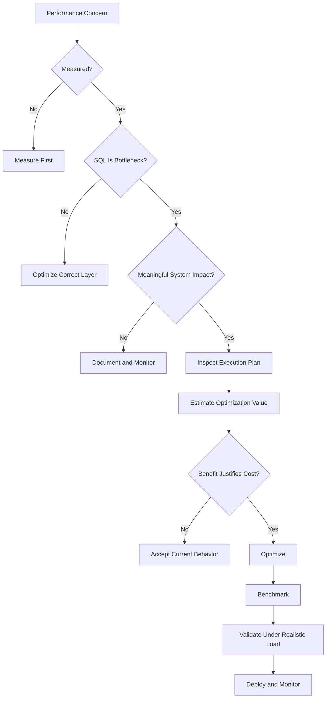
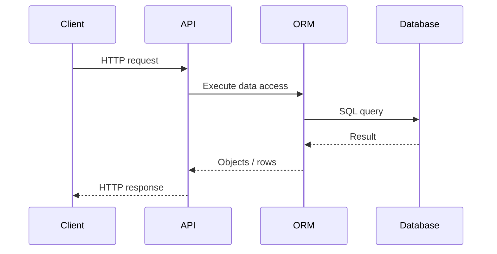
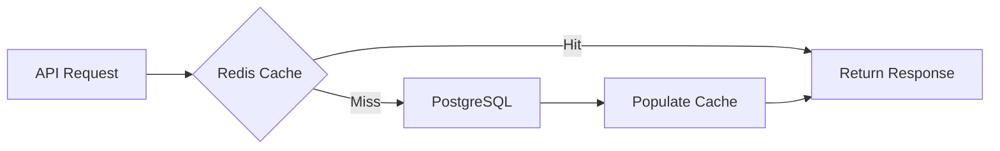

# 32- When to Optimize SQL

## Overview

SQL optimization is not an objective in itself. The goal is to improve a system when database behavior creates a meaningful impact on latency, throughput, reliability, scalability, or cost.

The most important engineering judgment is deciding **when optimization is justified** and when optimization would merely add complexity without measurable value.

A useful principle is:

> **Optimize when measured database behavior creates meaningful system impact, not simply because a query could theoretically be faster.**

For backend systems, SQL optimization becomes relevant when one or more of the following occur:

- API latency exceeds an acceptable service-level objective (SLO).
- Database CPU or I/O becomes a bottleneck.
- Connection pools approach exhaustion.
- Query volume grows faster than database capacity.
- Queries cause lock contention.
- Infrastructure costs increase because of inefficient database workload.
- Data growth changes previously acceptable query plans.
- A workload is approaching a known scalability boundary.

Optimization should therefore follow a disciplined process:

```text
Observe
  ↓
Measure
  ↓
Determine impact
  ↓
Identify bottleneck
  ↓
Estimate optimization value
  ↓
Change query / index / architecture
  ↓
Benchmark
  ↓
Validate under realistic load
  ↓
Monitor production
```

## Why Knowing When to Optimize Matters

Optimization has a cost.

A query rewrite may make SQL harder to understand. An additional index increases write and storage overhead. A caching layer introduces invalidation complexity. A materialized view introduces refresh and consistency concerns.

Therefore:

```text
Optimization benefit
        >
Complexity + maintenance + operational cost
```

is the fundamental trade-off.

A senior backend engineer does not ask only:

> "Can this query be made faster?"

They ask:

> "Is this query causing enough system impact to justify changing it?"

## The Optimization Decision Framework

Use four questions before optimizing:

| Question | Purpose |
|---|---|
| Is there a measurable problem? | Avoid premature optimization |
| Is SQL actually the bottleneck? | Avoid optimizing the wrong layer |
| Is the problem significant? | Prioritize engineering effort |
| Will the proposed change reduce the problem? | Avoid speculative changes |

A practical decision tree:



## What Counts as a Meaningful Problem?

There is no universal threshold such as:

```text
"Every query above 100 ms must be optimized."
```

The correct threshold depends on the workload.

A 200 ms query may be unacceptable for a latency-sensitive API.

The same query may be completely reasonable for a nightly reporting job.

Consider:

```text
Query latency
×
Execution frequency
×
Concurrency
×
Resource consumption
×
Business criticality
```

### Example

Consider two queries:

| Query | Average latency | Calls/day | Impact |
|---|---:|---:|---|
| User authentication lookup | 20 ms | 20 million | High |
| Internal report | 2 seconds | 10 | Low |

The 2-second query looks worse in isolation, but the authentication query may consume substantially more aggregate database resources.

This is why **frequency and workload matter as much as individual latency**.

## Optimize Based on User-Facing Impact

A database query is part of a larger request path:



Suppose:

```text
API latency = 800 ms

Database query = 20 ms
Serialization = 500 ms
External API = 250 ms
```

Optimizing the 20 ms query is unlikely to produce a meaningful improvement.

Instead, optimize the 500 ms serialization or 250 ms external dependency first.

### Senior-Level Rule

> **Optimize the largest meaningful contributor to the user-visible bottleneck.**

## Latency Budgets

Performance-sensitive APIs should have an approximate latency budget.

For example:

```text
API SLO: 300 ms

Network / framework:       40 ms
Authentication:            20 ms
Database:                 100 ms
External service:          80 ms
Serialization / overhead:  60 ms
                           ----
                           300 ms
```

If database execution increases from:

```text
100 ms → 180 ms
```

the database has consumed most of the available margin.

That may justify optimization even if the query itself is not exceptionally slow.

Latency should therefore be evaluated against the **endpoint's budget**, not an arbitrary database threshold.

## Optimize When Query Latency Is Increasing

A query can be acceptable today but represent a scalability problem.

Example:

```text
Rows       Query latency
-----------------------
100K       5 ms
1M         12 ms
10M        80 ms
100M       900 ms
```

If the dataset is growing rapidly, waiting until the query becomes an incident is poor engineering.

Optimization can be justified when measurements show that the current access pattern is approaching a known scalability boundary.

Potential responses include:

- Better indexing.
- Query rewriting.
- Partitioning.
- Keyset pagination.
- Pre-aggregation.
- Archival.
- Read replicas.
- Data-model changes.
- Dedicated analytical storage.

## Optimize When Query Frequency Is High

Query frequency can make a small inefficiency significant.

Suppose:

```text
Query latency = 5 ms
Calls = 2,000/sec
```

That query represents substantial aggregate database work.

Compare:

```text
Query A
5 ms × 2,000/sec

Query B
500 ms × 1/sec
```

Query A may deserve greater optimization priority.

Useful metrics include:

- Calls per second.
- Calls per minute.
- Total execution time.
- Mean execution time.
- p95 latency.
- p99 latency.
- Rows processed.
- Buffer reads.
- CPU time.

## Optimize When Database Resource Usage Is High

A query can be problematic even if its latency is acceptable.

For example:

```text
CPU:      90%
Memory:   85%
I/O:      saturated
Latency:  100 ms
```

The query may be fast enough for one request but expensive enough to limit overall throughput.

Watch:

- CPU utilization.
- Memory utilization.
- Buffer/cache hit behavior.
- Disk I/O.
- IOPS.
- Storage throughput.
- Temporary file usage.
- Connection utilization.
- Lock waits.

A query consuming excessive resources can become a capacity problem before it becomes an obvious latency problem.

## Optimize When Connection Pools Are Under Pressure

Slow database operations hold connections for longer.

```text
Request
   ↓
Acquire DB connection
   ↓
Execute query
   ↓
Connection remains occupied
   ↓
Return connection
```

If queries become slower:

```text
Longer query duration
        ↓
Connections occupied longer
        ↓
Pool utilization increases
        ↓
Requests wait for connections
        ↓
Application latency increases
        ↓
Timeouts / failures
```

This creates a feedback loop:

```text
Database slowdown
      ↓
Connection pressure
      ↓
Application queueing
      ↓
Higher latency
      ↓
More concurrent requests
      ↓
More database pressure
```

Query optimization can therefore be a **reliability improvement**, not merely a performance improvement.

## Optimize When Lock Contention Is Significant

Not all database performance problems are caused by inefficient execution plans.

Consider:

```text
Transaction A
    ↓
Locks row
    ↓
Long-running transaction

Transaction B
    ↓
Waits for lock
    ↓
Request latency increases
```

A query can have an excellent execution plan and still experience high latency because it is waiting for another transaction.

Investigate:

- Long-running transactions.
- Row-level locks.
- Table locks.
- DDL locks.
- Idle transactions.
- Deadlocks.
- Lock wait duration.

If lock contention is the bottleneck, rewriting the SQL scan may not solve the problem.

The correct fix may involve:

- Shorter transactions.
- Better transaction boundaries.
- Different locking behavior.
- Smaller batches.
- Improved application concurrency.
- Schema or workflow changes.

## Optimize When Query Plans Regress

A query that was fast six months ago can become slow because:

- The table grew.
- Data distribution changed.
- Statistics became inaccurate.
- An index became less useful.
- A schema changed.
- A different plan became cheaper according to the optimizer.
- Hardware or workload changed.

For PostgreSQL:

```sql
EXPLAIN (ANALYZE, BUFFERS)
SELECT
    id,
    status,
    created_at
FROM orders
WHERE tenant_id = $1
  AND status = 'pending'
ORDER BY created_at DESC
LIMIT 50;
```

Compare:

```text
Previous plan
     ↓
Current plan
     ↓
Identify regression
```

Do not assume SQL text remaining unchanged means execution behavior remains unchanged.

## Optimize When Cardinality Estimates Are Wrong

Execution plans depend heavily on row-count estimates.

Example:

```text
Estimated rows: 100
Actual rows:    2,000,000
```

This can lead the optimizer toward a poor strategy.

Potential causes include:

- Stale statistics.
- Highly skewed data.
- Correlated columns.
- Complex predicates.
- Insufficient statistics.
- Data distribution changes.

First investigate statistics:

```sql
ANALYZE orders;
```

Then compare the plan again.

Do not immediately rewrite the query if the underlying issue is incorrect statistics.

## Optimize When an ORM Generates Excessive SQL

Backend developers should optimize the **database workload**, not just individual SQL statements.

For example, Django code such as:

```python
orders = Order.objects.all()

for order in orders:
    print(order.customer.email)
```

can create:

```text
1 query → orders
N queries → customers
```

For appropriate foreign-key access:

```python
orders = Order.objects.select_related("customer")
```

For collection relationships:

```python
orders = Order.objects.prefetch_related("items")
```

The correct optimization depends on relationship cardinality and required response data.

The important measurement is:

```text
Endpoint
    ↓
Number of SQL statements
    ↓
Total DB time
    ↓
Rows processed
```

not simply the speed of one SQL statement.

## Optimize When N+1 Queries Appear

N+1 behavior is especially important in:

- Django.
- SQLAlchemy.
- GraphQL APIs.
- REST endpoints returning nested resources.
- gRPC services with repeated data lookups.

Example:

```text
GET /orders

1 query → orders
100 queries → customers
100 queries → payments

Total = 201 queries
```

Even if each query takes only a few milliseconds, total latency and database load can become significant.

Optimization is usually justified when the endpoint's query count or database time becomes material.

## Optimize When Pagination Stops Scaling

This query:

```sql
SELECT
    id,
    created_at
FROM orders
ORDER BY created_at DESC
LIMIT 50 OFFSET 500000;
```

may require the database to process and discard a large number of rows.

For large sequential datasets, keyset pagination can be more scalable:

```sql
SELECT
    id,
    created_at
FROM orders
WHERE (created_at, id) < ($1, $2)
ORDER BY created_at DESC, id DESC
LIMIT 50;
```

Optimization becomes especially valuable when:

- Tables are large.
- Users can navigate deeply.
- APIs are high traffic.
- Pagination is a core access pattern.

## Optimize When Exact Counts Are Expensive

An API may perform:

```sql
SELECT COUNT(*)
FROM orders
WHERE tenant_id = $1;
```

for every paginated request.

If users only need:

```text
"Is there another page?"
```

an exact count may be unnecessary.

Fetch one additional row:

```sql
SELECT
    id,
    created_at
FROM orders
WHERE tenant_id = $1
ORDER BY created_at DESC, id DESC
LIMIT 51;
```

Use:

```text
50 rows → response
51st row → has_next_page
```

Do not optimize exact counts if the product genuinely requires an exact total.

## Optimize When Query Shape Causes Excessive Data Processing

Consider:

```sql
SELECT *
FROM events
WHERE tenant_id = $1;
```

If the endpoint only needs:

```text
id
event_type
created_at
```

the query may transfer unnecessary data.

Prefer:

```sql
SELECT
    id,
    event_type,
    created_at
FROM events
WHERE tenant_id = $1;
```

Reducing data volume can lower:

- Database I/O.
- Memory usage.
- Network transfer.
- Application CPU.
- Serialization time.

This is particularly important for wide tables containing JSON, text, or binary payloads.

## Optimize When the Query Is Repeated Unnecessarily

Sometimes the correct optimization is not rewriting SQL but reducing how often it runs.

For example:

```text
Request A → same query
Request B → same query
Request C → same query
Request D → same query
```

If the data changes infrequently, a cache may be appropriate:



Caching should be considered when:

- The data is read frequently.
- The data changes relatively infrequently.
- Staleness is acceptable.
- Cache invalidation is manageable.

Caching should not automatically replace query optimization.

## Optimize When Database Cost Becomes Material

Cloud database resources can be expensive.

A workload that consumes:

```text
CPU
+
IOPS
+
Storage
+
Memory
+
Read replicas
```

may drive infrastructure cost.

For AWS-hosted PostgreSQL, unnecessary database work can increase:

- Compute requirements.
- Storage I/O.
- Read replica capacity.
- Backup volume.
- Scaling frequency.

Cost is a valid optimization driver when the savings exceed the engineering and operational cost of the change.

## When Not to Optimize SQL

Not every query needs optimization.

Avoid optimization when:

- The query is fast enough for its workload.
- It runs infrequently.
- It is not on a critical path.
- Database resource usage is negligible.
- The proposed optimization adds significant complexity.
- The expected benefit is too small to measure.
- The query is already well understood and stable.
- The change would make future maintenance substantially harder.

For example:

```text
Internal admin report
Execution time: 700 ms
Executions: 20/day
Database load: negligible
```

Rewriting the query to save 200 ms may have almost no business value.

## Premature Optimization

Premature optimization occurs when performance work is performed before a meaningful performance problem has been established.

Examples:

```text
Adding indexes to every column
```

```text
Rewriting readable SQL into obscure SQL
```

```text
Adding Redis for every database query
```

```text
Introducing materialized views before measuring
```

```text
Partitioning a table because it "might get large"
```

These approaches increase complexity without guaranteeing improvement.

### Why It Happens

Common causes include:

- Assuming indexes always make queries faster.
- Optimizing based on theoretical complexity.
- Testing with unrealistic datasets.
- Treating every slow-looking query as a production problem.
- Copying optimization patterns without understanding workload characteristics.

The solution is straightforward:

```text
Measure → diagnose → optimize → measure again
```

## Optimization Versus Complexity

Every optimization has a maintenance cost.

| Optimization | Potential benefit | Added complexity |
|---|---|---|
| Better predicate | High | Low |
| Appropriate index | High | Low–Medium |
| Query rewrite | Medium–High | Medium |
| Keyset pagination | High at scale | Medium |
| Redis caching | High for repeated reads | High |
| Materialized view | High for repeated analytics | High |
| Read replica | High for read-heavy workloads | Medium–High |
| Partitioning | High for appropriate large datasets | High |
| Separate analytics system | Very high at large scale | Very high |

Prefer the **simplest optimization that solves the measured problem**.

## The Optimization Hierarchy

A practical optimization order is:

```text
Correctness
    ↓
Measure
    ↓
Remove unnecessary work
    ↓
Improve query shape
    ↓
Use appropriate indexes
    ↓
Fix statistics / planner issues
    ↓
Optimize application access patterns
    ↓
Add caching
    ↓
Change data model
    ↓
Change architecture
```

Do not jump directly to architectural changes when a missing index or N+1 query is the actual problem.

## A Practical Cost-Benefit Model

A useful engineering model is:

```text
Optimization Value =
Performance Impact
×
Frequency
×
Business Importance
×
Expected Growth
```

Then compare it against:

```text
Optimization Cost =
Development Effort
+
Testing
+
Operational Complexity
+
Maintenance
+
Risk
```

For example:

```text
Problem:
API p99 = 900 ms

Database:
700 ms

Calls:
10,000/minute

Business importance:
High

Expected growth:
3×
```

This is a strong optimization candidate.

Compare with:

```text
Problem:
Internal report = 1.2 seconds

Calls:
5/day

Business importance:
Low

Growth:
Minimal
```

This is probably not a high-priority optimization.

## Measure Before Optimization

A baseline should contain enough information to determine whether the change worked.

For PostgreSQL:

```sql
EXPLAIN (ANALYZE, BUFFERS, VERBOSE)
SELECT
    id,
    customer_id,
    created_at
FROM orders
WHERE tenant_id = $1
  AND status = $2
ORDER BY created_at DESC
LIMIT 50;
```

Record:

- Planning time.
- Execution time.
- Actual rows.
- Estimated rows.
- Buffer hits.
- Buffer reads.
- Sort behavior.
- Join strategy.
- Scan strategy.

For application-level testing, record:

- p50.
- p95.
- p99.
- Requests per second.
- Database time.
- Query count.
- Error rate.

## Optimize With Production-Like Data

A query tested against:

```text
10,000 rows
```

may behave very differently against:

```text
100,000,000 rows
```

Test with realistic:

- Row counts.
- Data distributions.
- Tenant sizes.
- Null ratios.
- Hot and cold data.
- Index sizes.
- Concurrent connections.
- Request rates.

Synthetic datasets should reproduce the characteristics that influence query planning and resource usage.

## Optimize for Tail Latency

Average latency can hide severe outliers.

Consider:

```text
p50 = 20 ms
p95 = 50 ms
p99 = 2,000 ms
```

The average may appear acceptable while 1% of requests experience severe delays.

For user-facing services, monitor:

- p50.
- p95.
- p99.
- Timeout rate.

A query that occasionally causes large scans or lock waits may require optimization even when its average latency looks healthy.

## Query Optimization and Reliability

Performance and reliability are tightly coupled.

Suppose:

```text
Database query latency increases
        ↓
Connections held longer
        ↓
Connection pool fills
        ↓
Requests queue
        ↓
Timeouts increase
        ↓
Retries increase
        ↓
Database receives more work
        ↓
System becomes less stable
```

This is a form of resource exhaustion.

Therefore, query optimization can improve:

- Availability.
- Throughput.
- Timeout behavior.
- Failure rates.
- Capacity headroom.

## Production Monitoring

After optimization, continue measuring.

Useful PostgreSQL tooling includes `pg_stat_statements`:

```sql
SELECT
    query,
    calls,
    total_exec_time,
    mean_exec_time,
    rows
FROM pg_stat_statements
ORDER BY total_exec_time DESC
LIMIT 20;
```

Prioritize based on both:

```text
Mean latency
```

and:

```text
Total workload
```

For example:

```text
Query A:
5 ms × 10,000,000 calls

Query B:
2 seconds × 100 calls
```

Query A can have the larger total resource impact.

Monitor the application and database together rather than optimizing SQL in isolation.

## Production Considerations

Before deploying a significant SQL optimization:

1. Capture the existing execution plan.
2. Capture baseline latency.
3. Confirm the query's production frequency.
4. Identify affected indexes and tables.
5. Test with representative data.
6. Test concurrency where relevant.
7. Validate correctness.
8. Assess write-side impact of new indexes.
9. Roll out safely.
10. Monitor query and endpoint metrics.

For index changes on large production tables, consider operational characteristics such as lock behavior and online/concurrent index creation supported by the target database.

For PostgreSQL, for example:

```sql
CREATE INDEX CONCURRENTLY idx_orders_tenant_created
ON orders (tenant_id, created_at DESC);
```

`CREATE INDEX CONCURRENTLY` can reduce blocking of normal writes compared with a regular index build, but it has additional operational considerations and cannot be used inside a transaction block.

Always validate the deployment procedure against the production database version and migration tooling.

## Security Considerations

Performance optimization must never remove security boundaries.

For a multi-tenant application:

```sql
SELECT
    id,
    status,
    created_at
FROM orders
WHERE tenant_id = $1
  AND id = $2;
```

The `tenant_id` condition is part of correctness.

Do not optimize by retrieving:

```sql
SELECT *
FROM orders
WHERE id = $1;
```

and filtering authorization later in Python merely because it appears simpler.

Performance changes must preserve:

- Tenant isolation.
- Authorization predicates.
- Row-level security.
- Parameterized queries.
- Input validation.
- Maximum page sizes.

A faster query that returns unauthorized data is not an optimization.

## Scalability Guidance

Optimize proactively when there is evidence of a future capacity problem.

Good signals include:

- Rapid table growth.
- Increasing query frequency.
- Increasing p95/p99 latency.
- Database CPU approaching sustained capacity.
- Increasing I/O utilization.
- Connection pool pressure.
- Increasing lock waits.
- Query plans becoming less efficient.
- Increasing cloud database costs.

Avoid premature architectural complexity.

The preferred progression is usually:

```text
Efficient query
    ↓
Correct indexes
    ↓
Efficient application access
    ↓
Caching where justified
    ↓
Read scaling
    ↓
Data-model changes
    ↓
Partitioning / workload separation
    ↓
Dedicated analytical architecture
```

The exact order depends on the workload.

## Common Mistakes and Pitfalls

### Optimizing Without a Baseline

**Problem:** There is no objective way to determine whether the change helped.

**Avoid it:** Capture execution plans and latency before making changes.

### Using Arbitrary Latency Thresholds

**Problem:** Treating every query above a fixed number as slow.

**Avoid it:** Evaluate latency against endpoint requirements, frequency, concurrency, and business impact.

### Optimizing the Wrong Layer

**Problem:** Rewriting SQL when most latency comes from serialization or another service.

**Avoid it:** Trace the complete request path.

### Adding Indexes Without Measuring

**Problem:** Indexes consume storage and increase write overhead.

**Avoid it:** Create indexes for measured access patterns.

### Optimizing Average Instead of Tail Latency

**Problem:** p50 looks healthy while p99 is unacceptable.

**Avoid it:** Monitor p95/p99 for latency-sensitive services.

### Testing Only on Small Data

**Problem:** Development plans do not represent production behavior.

**Avoid it:** Test realistic data volume and distribution.

### Ignoring Query Frequency

**Problem:** A low-latency query executed millions of times can dominate workload.

**Avoid it:** Consider total execution time and calls.

### Replacing SQL With Cache Too Early

**Problem:** Caching adds invalidation and consistency complexity.

**Avoid it:** Establish that repeated reads are actually the problem.

### Introducing Architectural Complexity Prematurely

**Problem:** Read replicas, partitioning, or analytical systems are introduced before simpler fixes are exhausted.

**Avoid it:** Start with the smallest change that addresses the measured bottleneck.

### Breaking Correctness for Performance

**Problem:** Authorization filters or transactional guarantees are removed.

**Avoid it:** Treat correctness and security as non-negotiable constraints.

## Interview Perspective

A strong answer to:

> "When should you optimize a SQL query?"

is not:

> "Whenever the query is slow."

A stronger answer is:

> "I optimize when measurement shows that database behavior is materially affecting latency, throughput, resource utilization, reliability, or cost. I first confirm that SQL is actually the bottleneck, inspect the execution plan, identify the specific cause, estimate the benefit versus complexity, then benchmark the change using production-like data and monitor it after deployment."

Important interview concepts include:

- Measure before optimizing.
- Use `EXPLAIN ANALYZE`.
- Compare estimated versus actual rows.
- Consider query frequency.
- Consider p95/p99 latency.
- Understand database CPU and I/O.
- Account for concurrency and connection pools.
- Consider data growth.
- Avoid unnecessary indexes.
- Avoid premature architectural complexity.
- Validate correctness after optimization.

## Senior Engineering Perspective

The mature approach to SQL performance is not:

```text
Make every query as fast as possible.
```

It is:

```text
Make the system fast enough,
reliable enough,
scalable enough,
and cost-efficient enough
for its actual workload.
```

This distinction matters because optimization always has trade-offs.

A senior engineer evaluates:

```text
Latency
+
Throughput
+
Resource consumption
+
Concurrency
+
Growth
+
Reliability
+
Cost
+
Complexity
+
Maintainability
```

before deciding whether an optimization is worthwhile.

## Key Takeaways

- **Optimize SQL when measured database behavior materially affects latency, throughput, resource usage, reliability, scalability, or cost.**
- **Confirm that SQL is actually the bottleneck before changing queries, indexes, caching, or architecture.**
- **Prioritize optimization by workload impact: frequency, concurrency, tail latency, resource consumption, business criticality, and expected growth all matter.**
- **Prefer the simplest optimization that solves the measured problem, and validate every change with realistic data, execution plans, benchmarks, and production monitoring.**
- **Avoid premature optimization and never trade correctness, security, maintainability, or reliability for a marginal performance improvement.**