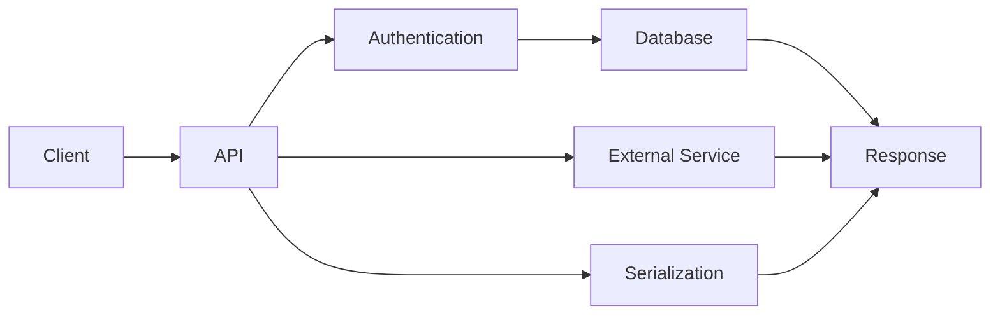

# 33- When Not to Optimize SQL

## Overview

SQL optimization should be driven by measurable engineering impact, not by the assumption that every query must be made as fast as theoretically possible.

Optimization introduces costs. Query rewrites can reduce readability, indexes increase storage and write overhead, caching introduces invalidation complexity, and architectural changes increase operational burden. A technically faster query is not automatically a better production solution.

The practical rule is:

> **Do not optimize SQL when the current behavior is already acceptable for the workload and the optimization does not provide meaningful measurable value.**

A senior backend engineer evaluates SQL performance in the context of:

- User-facing latency.
- Throughput.
- Query frequency.
- Concurrency.
- Database resource consumption.
- Reliability.
- Expected data growth.
- Infrastructure cost.
- Business importance.
- Operational and maintenance complexity.

The objective is not maximum SQL performance. The objective is an appropriately efficient and reliable system.

## Why Not Optimizing Can Be the Correct Decision

Optimization has an opportunity cost.

Consider:

```text
Current query:
    80 ms

Optimization effort:
    2 engineering days

Expected improvement:
    80 ms → 65 ms

Query frequency:
    50 executions/day

Business impact:
    Low
```

The optimization may technically work while providing almost no meaningful system benefit.

The same 15 ms improvement could be highly valuable for:

```text
Authentication endpoint:
    10,000 requests/sec
```

The correct decision depends on workload and impact rather than the raw query duration.

## The Cost of Optimization

SQL optimization can introduce several types of cost.

| Cost | Example |
|---|---|
| Development | Time required to investigate and implement |
| Complexity | Less obvious query logic |
| Maintenance | Future engineers need to understand specialized behavior |
| Storage | Additional indexes |
| Write overhead | Index maintenance during INSERT/UPDATE/DELETE |
| Operational risk | Migration or deployment complexity |
| Consistency | Caching may return stale data |
| Testing | More scenarios required |
| Portability | Database-specific optimizations |
| Architecture | Additional replicas, caches, or data stores |

An optimization is justified when its benefits outweigh these costs.

## When SQL Should Not Be Optimized

### The Query Is Already Fast Enough

If a query consistently meets its latency target and consumes negligible resources, optimization may have little value.

For example:

```text
p50:       8 ms
p95:      15 ms
p99:      25 ms
Calls:    100/min
CPU:      negligible
I/O:      negligible
```

There is little reason to spend significant engineering effort reducing it to 10 ms at p99.

The correct action may simply be to document the baseline and monitor it.

## When the Query Is Not on a Critical Path

A slow query does not necessarily require optimization.

Example:

```text
Internal administrative report
Execution time: 900 ms
Executions: 10/day
Users: 3 internal operators
```

If the query does not affect production API latency, database capacity, or user experience, optimization is likely low priority.

Compare that with:

```text
Payment authorization lookup
Execution time: 100 ms
Executions: 50,000/min
```

The second query deserves substantially more attention despite being individually faster.

## When the Database Is Not the Bottleneck

Do not optimize SQL simply because an endpoint is slow.

Consider:

```text
Endpoint latency = 1,000 ms

Database:
    50 ms

External API:
    600 ms

Serialization:
    250 ms

Application:
    100 ms
```

Reducing the SQL query from 50 ms to 30 ms has limited impact on the endpoint.

The correct approach is to trace the complete request:



Optimize the actual bottleneck rather than the most technically interesting component.

## When the Query Runs Infrequently

Query frequency strongly affects optimization priority.

Consider:

```text
Query A
2 seconds
5 executions/day

Query B
10 ms
500,000 executions/day
```

Query A is individually slower, but Query B may consume substantially more total database resources.

A useful metric is:

```text
Total query time =
execution time × execution frequency
```

For workload analysis, also consider:

```text
Total resource impact =
execution time
× frequency
× concurrency
× resource consumption
```

## When the Optimization Provides Negligible Business Value

Performance improvements should be connected to system outcomes.

Examples of meaningful outcomes:

- Lower API latency.
- Higher throughput.
- Lower infrastructure cost.
- Fewer timeouts.
- Higher connection-pool availability.
- Better user experience.
- More capacity for future growth.

If an optimization provides none of these in a meaningful way, it may not be worth doing.

## When Optimization Adds Excessive Complexity

A readable query is often preferable to a marginally faster but highly specialized query.

For example:

```sql
SELECT
    customer_id,
    COUNT(*) AS order_count
FROM orders
WHERE status = 'completed'
GROUP BY customer_id;
```

If this executes in 50 ms and runs occasionally, replacing it with a complicated combination of database-specific techniques to achieve 40 ms may not be worthwhile.

Readability matters because SQL is maintained over years, not just executed once.

A senior engineer considers:

```text
Performance
+
Correctness
+
Readability
+
Maintainability
+
Operational complexity
```

rather than performance alone.

## When an Optimization Increases Write Costs

Indexes are a common example.

An index can improve:

```sql
SELECT *
FROM orders
WHERE customer_id = $1;
```

but the index also has to be maintained when rows change.

For a write-heavy workload:

```text
INSERT / UPDATE / DELETE
        ↓
Table modification
        ↓
Index maintenance
        ↓
Additional I/O and storage
```

Adding indexes indiscriminately can therefore make the overall workload worse.

Before adding an index, evaluate:

- Query frequency.
- Selectivity.
- Table size.
- Read/write ratio.
- Index size.
- Write amplification.
- Existing indexes.
- Whether the planner actually uses the index.

## When the Query Is Read-Heavy but the Index Is Not Justified

An index should serve a meaningful access pattern.

Avoid creating indexes simply because a column appears in a `WHERE` clause.

For example:

```sql
WHERE is_active = true
```

may have poor selectivity if most rows are active.

A full or sequential scan may be cheaper than traversing an index.

The optimizer's decision depends on:

- Cardinality.
- Selectivity.
- Table size.
- Data distribution.
- Statistics.
- Cost parameters.
- Query shape.

Always validate with an execution plan.

## When Caching Would Be More Complex Than the Problem

Caching can dramatically reduce database workload, but it introduces new failure modes.

Without cache:

```text
API → PostgreSQL → Response
```

With cache:

```text
API
 ↓
Redis
 ├── hit  → Response
 └── miss → PostgreSQL
             ↓
           Redis
```

Now the system must handle:

- Cache invalidation.
- TTL selection.
- Stale data.
- Cache stampedes.
- Cache failures.
- Memory limits.
- Eviction.
- Serialization.
- Cache key design.

If a database query takes 20 ms and executes only occasionally, introducing Redis may be an unjustified complexity increase.

## When the Query Is Not Stable Enough to Optimize

Some workloads are naturally variable.

For example:

```text
Ad-hoc analytics
Dynamic reporting
Administrative searches
Rarely executed data exports
```

The query shape may vary significantly between executions.

In these cases, optimizing one specific query may provide limited value unless a stable and important workload pattern has emerged.

For analytical workloads, the appropriate solution may eventually be a dedicated analytical architecture rather than continually optimizing transactional SQL.

## When Data Volume Is Too Small for the Optimization

Optimization decisions should account for current data volume and expected growth.

Suppose:

```text
Table size:
50,000 rows

Query:
Sequential scan

Execution:
2 ms
```

Adding a complex index strategy may not provide meaningful improvement.

However, if the table is expected to reach:

```text
500 million rows
```

the future access pattern may justify proactive design.

The important distinction is:

```text
Premature optimization
        vs.
Capacity planning
```

Planning for known growth is different from optimizing without evidence.

## When the Execution Plan Is Already Appropriate

Use execution plans before assuming that SQL needs improvement.

For PostgreSQL:

```sql
EXPLAIN (ANALYZE, BUFFERS)
SELECT
    id,
    status,
    created_at
FROM orders
WHERE tenant_id = $1
  AND status = 'pending'
ORDER BY created_at DESC
LIMIT 50;
```

If the plan shows:

- Appropriate index usage.
- Reasonable row estimates.
- Low execution time.
- Low buffer reads.
- No unexpected sorts.
- No excessive loops.
- No significant waits.

then the query may already be sufficiently optimized.

An engineer should be comfortable concluding:

> "The query plan is appropriate and there is no meaningful optimization opportunity worth pursuing."

That is an engineering decision, not a failure.

## When Optimization Would Reduce Maintainability

Database code is part of the application's long-term codebase.

Compare:

```sql
SELECT
    id,
    customer_id,
    created_at
FROM orders
WHERE customer_id = $1
ORDER BY created_at DESC
LIMIT 50;
```

with a highly specialized query that relies on:

- Database-specific planner behavior.
- Complex nested subqueries.
- Vendor-specific hints.
- Unusual expression transformations.
- Multiple materialization layers.

If both satisfy the workload requirements, the simpler query is generally preferable.

Optimization should not create technical debt without measurable benefit.

## When the Problem Is Better Solved at the Application Layer

Sometimes database work exists because the application is repeatedly requesting the same information.

For example:

```text
100 API requests
      ↓
100 identical database queries
```

The real problem may be:

- Missing request-level caching.
- Missing batching.
- Duplicate application calls.
- N+1 ORM behavior.
- Inefficient service orchestration.

For Django, an N+1 problem may be addressed with:

```python
orders = (
    Order.objects
    .select_related("customer")
    .filter(status="pending")
)
```

rather than attempting to make every individual customer query faster.

The correct optimization boundary is the entire application workflow.

## When the Problem Is Better Solved Through Architecture

Some database problems are architectural rather than query-level.

Examples:

| Problem | Potential architectural solution |
|---|---|
| Heavy analytical queries | Analytics warehouse |
| Read-heavy workload | Read replicas |
| Repeated hot reads | Redis |
| Very large historical data | Archival / partitioning |
| Event-driven aggregation | Kafka + consumers |
| Expensive repeated aggregation | Materialized views |
| Large-scale search | Search engine |
| High write volume | Workload-specific data model |

Do not force a single transactional PostgreSQL database to serve every workload if the workload has fundamentally different requirements.

At the same time, do not introduce additional infrastructure until the workload justifies it.

## When Optimization Is Riskier Than the Existing Problem

Production changes carry risk.

An optimization may introduce:

- Incorrect results.
- Authorization bugs.
- Transactional inconsistencies.
- Deadlocks.
- Migration failures.
- Increased write latency.
- Memory pressure.
- Planner regressions.
- Cache consistency problems.

A 20 ms improvement may not justify a high-risk migration in a critical financial workflow.

Risk should be proportional to expected benefit.

```text
Expected Benefit
        ↓
Compare
        ↓
Implementation Risk
+
Operational Risk
+
Correctness Risk
```

## When You Should Prefer Simplicity

A useful production rule is:

> **If the current implementation satisfies the workload requirements, prefer the simpler implementation.**

Simplicity improves:

- Code review.
- Debugging.
- Onboarding.
- Incident response.
- Future optimization.
- Operational confidence.

This does not mean ignoring performance. It means avoiding complexity without a measurable reason.

## Avoid Optimizing for Theoretical Complexity Alone

Big-O notation is useful, but database performance depends on physical execution.

For example:

```text
O(n)
```

does not automatically mean:

```text
slow
```

and:

```text
O(log n)
```

does not automatically mean:

```text
fast
```

A sequential scan over a small table can outperform an index lookup because the sequential scan has low overhead and efficient memory access.

Database performance depends on:

- Data size.
- Cache state.
- I/O.
- CPU.
- Selectivity.
- Cardinality.
- Statistics.
- Query plan.
- Concurrency.
- Hardware.
- Database configuration.

Use actual measurements rather than theoretical complexity alone.

## Avoid Optimizing Based on Development Data

Development databases frequently contain:

```text
1,000 rows
```

while production contains:

```text
500,000,000 rows
```

The execution plan may change completely.

However, the opposite problem also occurs: engineers optimize production-scale behavior for a workload that will never reach that scale.

Use realistic projections:

```text
Current volume
+
Growth rate
+
Expected workload
+
Required retention
```

to determine whether optimization is justified.

## Avoid Optimizing Before Understanding the Workload

Before changing SQL, establish:

```text
Who executes the query?
How often?
With what parameters?
Against how much data?
At what concurrency?
With what latency requirements?
```

Parameter distribution can matter significantly.

For example:

```text
tenant_id = small_tenant
```

may return:

```text
100 rows
```

while:

```text
tenant_id = enterprise_tenant
```

may return:

```text
50 million rows
```

The same SQL statement can therefore behave differently depending on parameter values and data distribution.

## Avoid Optimizing Only the Average

A query may have:

```text
p50 = 10 ms
p95 = 20 ms
p99 = 1,500 ms
```

If the p99 latency violates the API SLO, optimization may be justified even though the average looks excellent.

Conversely:

```text
p50 = 100 ms
p95 = 120 ms
p99 = 150 ms
```

may be perfectly acceptable for the workload.

Use the latency percentile appropriate to the service requirement.

## When Monitoring Is Better Than Optimization

Sometimes the correct action is to establish observability and wait for evidence.

For example:

```text
Query latency:
stable for 12 months

Data growth:
moderate

CPU:
40%

I/O:
low

Connection usage:
low

Error rate:
negligible
```

There is no strong reason to make a speculative optimization.

Instead:

```text
Baseline
   ↓
Monitor
   ↓
Detect regression
   ↓
Investigate
   ↓
Optimize if necessary
```

This reduces unnecessary engineering work while preserving the ability to respond to real regressions.

## Production Monitoring Without Immediate Optimization

Monitoring should establish whether the current behavior remains healthy.

For PostgreSQL, `pg_stat_statements` can help identify expensive workloads:

```sql
SELECT
    query,
    calls,
    total_exec_time,
    mean_exec_time,
    rows
FROM pg_stat_statements
ORDER BY total_exec_time DESC
LIMIT 20;
```

Useful application metrics include:

| Metric | Why it matters |
|---|---|
| p50 latency | Typical performance |
| p95 latency | High-percentile behavior |
| p99 latency | Tail latency |
| Query count/request | Detects N+1 and excessive access |
| Total DB time | Measures database contribution |
| DB CPU | Capacity pressure |
| I/O | Storage bottlenecks |
| Connection utilization | Pool pressure |
| Lock wait time | Contention |
| Error rate | Reliability |

Monitoring provides the evidence needed to decide whether optimization is eventually necessary.

## Security Must Not Be Sacrificed

Performance is never a reason to weaken authorization or isolation.

For a multi-tenant application:

```sql
SELECT
    id,
    status,
    created_at
FROM orders
WHERE tenant_id = $1
  AND id = $2;
```

Do not remove:

```sql
tenant_id = $1
```

because a simpler lookup appears faster.

Likewise, never replace parameterized SQL with string concatenation merely to simplify or speed up query construction.

Correctness and security are constraints on optimization.

```text
Security
+
Correctness
        ↓
Cannot be traded away for
        ↓
Marginal performance gains
```

## Scalability and Future Growth

Not optimizing today does not mean ignoring tomorrow.

A query should remain under observation when:

- Table growth is rapid.
- Query frequency is increasing.
- Tenant sizes are expanding.
- Database CPU is approaching capacity.
- Storage I/O is increasing.
- p95/p99 latency is trending upward.

Use trends rather than guesses.

For example:

```text
Database CPU

40% → 48% → 57% → 66% → 75%
```

combined with:

```text
Traffic

10K → 13K → 17K → 22K → 29K requests/min
```

may justify proactive capacity planning even if current latency is acceptable.

## A Practical Decision Matrix

| Situation | Optimize now? | Reason |
|---|---|---|
| High p99 on critical API | Yes | Direct user impact |
| High DB CPU caused by query | Yes | Capacity issue |
| Query runs millions of times | Usually | Aggregate workload matters |
| Rare internal report | Usually no | Low business impact |
| Query is already within SLO | Usually no | Limited benefit |
| Database is not the bottleneck | No | Wrong optimization target |
| Optimization requires major complexity | Usually no | Poor benefit/cost ratio |
| Rapid data growth threatens future performance | Possibly | Capacity planning |
| Existing plan is efficient | No | No demonstrated problem |
| Security boundary would be weakened | Never | Correctness constraint |
| Adding cache solves a major hot-read workload | Possibly | Architectural optimization |
| Adding cache for a 5 ms rare query | No | Complexity exceeds benefit |

## A Safe "Do Not Optimize" Workflow

When deciding not to optimize, do not simply ignore the query.

Use a lightweight process:

1. Measure current behavior.
2. Confirm the workload is within its performance target.
3. Confirm SQL is not consuming excessive resources.
4. Record the relevant execution plan if useful.
5. Document known growth assumptions.
6. Add monitoring for meaningful regressions.
7. Revisit when workload characteristics change.

This turns "we do not need to optimize this" into an explicit engineering decision.

## Production Example

Consider an API:

```text
GET /customers/{id}/orders
```

Current database behavior:

```text
Query latency:
p50 = 12 ms
p95 = 25 ms
p99 = 40 ms

Requests:
500/minute

Database CPU:
35%

Connection utilization:
20%

Table size:
2 million rows
```

A proposed optimization could reduce p99 from:

```text
40 ms → 30 ms
```

but requires:

- A complex query rewrite.
- A new index.
- A migration on a large table.
- Additional write overhead.
- More complicated ORM code.

There is little evidence that this is worth the complexity.

A reasonable decision is:

```text
Keep current query
      ↓
Monitor latency and resource usage
      ↓
Revisit if traffic or data volume increases
```

Now consider the same endpoint at:

```text
50,000 requests/minute
Database CPU: 85%
p99: 700 ms
Connection utilization: 90%
```

The decision changes completely.

The workload now has a clear capacity and latency problem, making optimization justified.

## Interview Perspective

A common interview question is:

> "Should every slow SQL query be optimized?"

A strong answer is:

> "No. I first determine whether the query is actually causing meaningful impact. I look at latency against the endpoint's SLO, execution frequency, total database time, resource consumption, concurrency, and expected growth. If the query is already acceptable and the optimization would add significant complexity or operational risk, I would document the baseline and monitor it rather than optimize prematurely."

Important points to mention:

- Measure before changing SQL.
- Compare against SLOs rather than arbitrary thresholds.
- Consider p95/p99, not only averages.
- Consider frequency and aggregate workload.
- Confirm SQL is actually the bottleneck.
- Consider read/write trade-offs of indexes.
- Account for maintenance and operational complexity.
- Avoid premature caching and architectural changes.
- Preserve correctness and security.
- Revisit decisions as workload characteristics change.

## Senior Engineering Perspective

The mature position is not:

```text
"Never optimize unless production breaks."
```

Nor is it:

```text
"Every query should be maximally optimized."
```

It is:

```text
Optimize when evidence shows that optimization
provides meaningful system value.
```

That means understanding the difference between:

```text
Performance opportunity
```

and:

```text
Performance problem
```

A database engineer or backend engineer will always find theoretical improvements. The senior engineering skill is knowing which improvements are worth implementing.

The strongest optimization strategy is therefore:

```text
Measure
  ↓
Understand workload
  ↓
Establish SLO / capacity requirement
  ↓
Identify actual bottleneck
  ↓
Estimate benefit
  ↓
Estimate complexity and risk
  ↓
Optimize only when justified
  ↓
Monitor continuously
```

## Common Mistakes and Pitfalls

### Optimizing Every Query Above an Arbitrary Threshold

**Problem:** A fixed number such as 100 ms is treated as universally unacceptable.

**Why it fails:** Different workloads have different latency requirements.

**Better approach:** Compare query behavior against endpoint SLOs, workload frequency, and business impact.

### Adding Indexes to Every Filtered Column

**Problem:** Developers assume indexes are always beneficial.

**Why it fails:** Indexes consume storage and add write overhead, and low-selectivity indexes may not improve execution.

**Better approach:** Validate access patterns and execution plans.

### Introducing Redis for Minor Database Work

**Problem:** Caching is used before establishing that database reads are a meaningful bottleneck.

**Why it fails:** Cache invalidation and operational complexity can exceed the original problem.

**Better approach:** Use caching for genuinely hot, repeatable workloads where staleness and invalidation are manageable.

### Optimizing Without Measuring

**Problem:** A query is rewritten because it "looks inefficient."

**Why it fails:** SQL that looks inefficient may already have an excellent execution plan.

**Better approach:** Measure and inspect `EXPLAIN ANALYZE`.

### Ignoring Write Performance

**Problem:** Read performance is improved by adding many indexes.

**Why it fails:** Writes must maintain those indexes.

**Better approach:** Evaluate total workload, not only read latency.

### Ignoring Tail Latency

**Problem:** Average query time appears acceptable.

**Why it fails:** Rare slow executions can dominate user experience.

**Better approach:** Monitor p95 and p99 where appropriate.

### Ignoring Maintainability

**Problem:** A complicated rewrite saves a few milliseconds.

**Why it fails:** Future debugging and maintenance become harder.

**Better approach:** Require a meaningful measurable benefit before accepting substantial complexity.

### Confusing Future Planning With Premature Optimization

**Problem:** Engineers either optimize everything immediately or ignore predictable growth.

**Why it fails:** Both extremes are poor capacity planning.

**Better approach:** Use measured growth trends and workload forecasts to determine when proactive optimization is justified.

## Key Takeaways

- **Do not optimize SQL simply because a theoretical performance improvement exists; optimize when measured behavior creates meaningful system impact.**
- **Evaluate queries using workload context: SLOs, frequency, concurrency, resource consumption, tail latency, business importance, and expected growth.**
- **A simpler query that already meets requirements is often better than a faster implementation that adds unnecessary complexity, write overhead, or operational risk.**
- **If SQL is not the actual bottleneck, optimize the correct layer instead of changing database code for its own sake.**
- **When optimization is not justified, establish a baseline, monitor meaningful metrics, and revisit the decision when workload or system requirements change.**