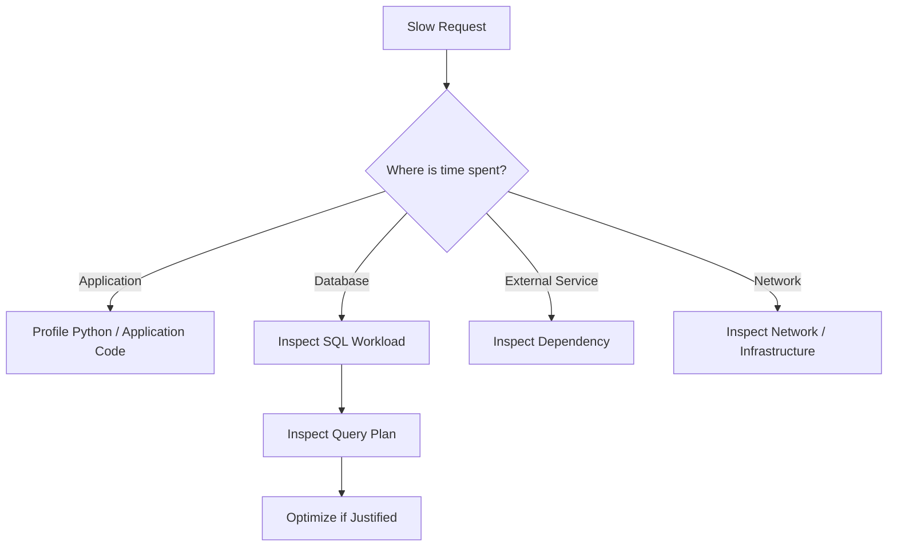
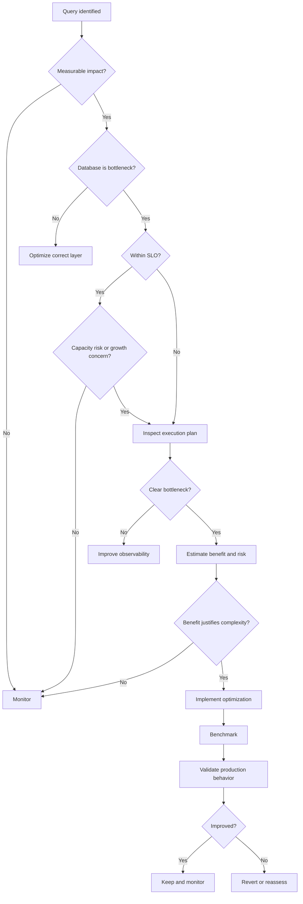
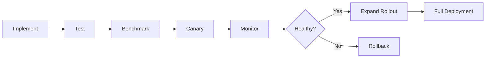

# 34- Query Optimization Decision Guide

## Overview

SQL optimization is an engineering decision, not an automatic response to every query that could be made faster.

A production database should be optimized when measurable workload characteristics indicate that query execution is affecting latency, throughput, capacity, reliability, or cost. The goal is to improve the system's overall behavior while preserving correctness, security, maintainability, and operational simplicity.

A useful decision model is:

```text
Observed problem
      ↓
Measure workload
      ↓
Confirm database/query bottleneck
      ↓
Define performance target
      ↓
Estimate optimization benefit
      ↓
Evaluate complexity and risk
      ↓
Optimize if justified
      ↓
Measure again
      ↓
Keep or revert the change
```

This guide provides a practical framework for deciding **whether SQL should be optimized, what should be optimized first, and when optimization should be deferred**.

## The Core Optimization Principle

The most important rule is:

> **Optimize measured bottlenecks that materially affect system requirements. Do not optimize SQL merely because it can theoretically be improved.**

A query can be:

- Slow but irrelevant.
- Fast but executed millions of times.
- Fast on average but dangerously slow at p99.
- Efficient but part of an inefficient application workflow.
- Correct today but approaching a capacity limit.
- Technically improvable but not worth the added complexity.

Optimization decisions must therefore consider the complete workload.

## What Makes a Query Worth Optimizing?

A query generally deserves attention when one or more of these conditions are true:

| Signal | Why it matters |
|---|---|
| High p95/p99 latency | Directly affects user-facing latency |
| High total execution time | Significant aggregate database workload |
| High execution frequency | Small inefficiencies multiply |
| High CPU consumption | Reduces database capacity |
| High I/O | Can indicate inefficient scans or poor locality |
| Lock contention | Reduces concurrency and throughput |
| Connection pool pressure | Can cause application-level latency |
| Query timeouts | Reliability problem |
| Rapid data growth | Current plan may become unsustainable |
| High infrastructure cost | Optimization may reduce capacity requirements |
| Critical business path | Small improvements can have large impact |

A single metric is rarely sufficient.

## Establish the Performance Requirement First

Before optimizing a query, define what "fast enough" means.

For an API, the target might be:

```text
p95 < 200 ms
p99 < 500 ms
```

For an internal reporting job:

```text
Completion < 30 seconds
```

For a batch process:

```text
Process 10 million records within 20 minutes
```

The same SQL execution time can therefore be acceptable in one workload and unacceptable in another.

### Query Performance vs Endpoint Performance

Do not confuse query latency with complete request latency.

For example:

```text
HTTP request
│
├── Authentication       15 ms
├── Application logic     20 ms
├── PostgreSQL query      40 ms
├── External API         300 ms
└── Serialization         15 ms
                         ─────
Total                    390 ms
```

Reducing the database query from `40 ms` to `20 ms` only reduces total latency by approximately `5%`.

If the external API is the real bottleneck, SQL optimization is the wrong priority.

## Identify the Actual Bottleneck

Use application and database observability together.



Useful measurements include:

- API latency.
- Database latency.
- Query execution time.
- Query frequency.
- Rows returned.
- Rows examined.
- Buffer reads.
- CPU consumption.
- Disk I/O.
- Lock waits.
- Connection pool usage.
- Cache hit rate.
- Error and timeout rates.

## Query Frequency Matters

A query's impact depends heavily on how often it executes.

Consider:

| Query | Latency | Executions | Approx. total execution time |
|---|---:|---:|---:|
| A | 1 second | 10/day | 10 seconds/day |
| B | 20 ms | 500,000/day | 10,000 seconds/day |

Query A is much slower per execution, but Query B is the larger workload problem.

A useful first-order metric is:

```text
Total database time
≈
execution time × execution count
```

For highly concurrent systems, also consider the effect on shared resources such as CPU, memory, I/O, locks, and connections.

## Optimize for the Workload, Not the Query in Isolation

A query should be evaluated within its workload.

For example:

```text
Query:
SELECT ...

Execution:
10 ms

Frequency:
100,000/sec

Database:
CPU 95%
```

A 2 ms improvement can be significant.

Compare that with:

```text
Query:
SELECT ...

Execution:
500 ms

Frequency:
2/day

Database:
CPU 20%
```

The second query may not justify optimization.

## Use Execution Plans Before Rewriting SQL

The execution plan is the primary source of truth for understanding how the database executes a query.

For PostgreSQL:

```sql
EXPLAIN (ANALYZE, BUFFERS)
SELECT
    id,
    customer_id,
    created_at
FROM orders
WHERE customer_id = $1
  AND status = 'pending'
ORDER BY created_at DESC
LIMIT 50;
```

Look for:

- Sequential scans on large tables.
- Unexpected index scans.
- Incorrect row estimates.
- Large differences between estimated and actual rows.
- Expensive sorts.
- Large hash operations.
- Excessive nested-loop iterations.
- High buffer reads.
- Disk-based operations.
- Expensive aggregation.
- Lock or wait behavior outside the plan itself.

Do not rewrite SQL merely because the query appears complicated.

## The Optimization Decision Tree

Use the following decision process for production queries.



## Step: Confirm There Is a Problem

Do not start with:

```text
"This query looks slow."
```

Start with measurable evidence:

```text
p95 increased from 80 ms → 240 ms
Database CPU increased from 55% → 82%
Query accounts for 35% of total DB execution time
```

This establishes a concrete problem.

## Step: Determine Whether the Problem Is SQL

A slow endpoint does not automatically mean a slow query.

For example:

```text
API request:            800 ms
SQL:                     30 ms
Redis:                   20 ms
External HTTP call:     650 ms
Application processing: 100 ms
```

SQL optimization has limited value here.

Conversely:

```text
API request:            800 ms
SQL:                    650 ms
External HTTP call:      30 ms
Application processing: 100 ms
```

The database is now a strong optimization candidate.

## Step: Compare Against an SLO

Avoid arbitrary rules such as:

```text
"Queries above 100 ms are bad."
```

Instead ask:

```text
Does the query violate an actual performance requirement?
```

For example:

```text
API SLO:
p95 < 300 ms

Current:
p95 = 180 ms
```

Optimization may not be necessary.

If:

```text
API SLO:
p95 < 300 ms

Current:
p95 = 650 ms
```

investigation is justified.

## Step: Check Query Frequency

High-frequency queries deserve special attention.

A query that consumes:

```text
5 ms × 1,000,000 executions
```

may be more important than:

```text
500 ms × 20 executions
```

Look at both:

```text
Mean execution time
```

and:

```text
Total execution time
```

Neither metric should be considered in isolation.

## Step: Inspect Resource Consumption

Latency alone does not tell the complete story.

A query may be fast but resource-intensive.

For example:

```text
Execution time: 15 ms
CPU: high
Buffer reads: high
Frequency: extremely high
```

Such a query may still be an important optimization target because it consumes database capacity.

Relevant resources include:

| Resource | Warning signal |
|---|---|
| CPU | Sustained high utilization |
| Memory | Memory pressure or spills |
| Storage I/O | High reads/writes |
| Connections | Pool saturation |
| Locks | Long waits |
| Temporary storage | Large sorts/hashes |
| Network | Excessive result sets |

## Step: Inspect the Query Plan

Once SQL is confirmed as the bottleneck, determine why.

Typical questions:

- Is the expected index being used?
- Is the database scanning too many rows?
- Are row estimates accurate?
- Is a join multiplying rows?
- Is sorting expensive?
- Is aggregation consuming excessive resources?
- Is a function preventing efficient access?
- Is pagination scanning large offsets?
- Is the query returning unnecessary columns?
- Is a subquery being executed repeatedly?

The goal is to identify the specific mechanism causing the cost.

## Step: Estimate the Potential Improvement

Before implementing an optimization, estimate the expected benefit.

For example:

```text
Current:
p95 = 400 ms

Expected:
p95 = 150 ms

Frequency:
2 million/day

Risk:
Low
```

This is a strong optimization candidate.

Compare:

```text
Current:
p95 = 40 ms

Expected:
p95 = 35 ms

Frequency:
1,000/day

Risk:
High
```

The second optimization is difficult to justify.

## Step: Evaluate Complexity

Every optimization has a complexity cost.

Consider:

```text
Simple query
    ↓
Additional index
    ↓
New migration
    ↓
Higher write cost
    ↓
New operational dependency
```

The performance benefit must justify the additional complexity.

A useful engineering question is:

> "Would I still choose this design if the measured performance improvement were half of what I expect?"

If the answer is no, the optimization may be too marginal.

## Step: Evaluate Correctness Risk

Optimization must preserve semantics.

Examples of dangerous changes include:

- Altering join conditions.
- Changing transaction boundaries.
- Removing authorization predicates.
- Changing isolation assumptions.
- Changing ordering semantics.
- Replacing exact calculations with approximations.
- Introducing stale caching.
- Changing `NULL` behavior.

Performance is subordinate to correctness.

## Step: Benchmark Before and After

Never rely solely on intuition.

Capture:

```text
Before:
execution time
CPU
buffers
rows
plan

After:
execution time
CPU
buffers
rows
plan
```

Example:

```sql
EXPLAIN (ANALYZE, BUFFERS, VERBOSE)
SELECT
    id,
    customer_id,
    created_at
FROM orders
WHERE customer_id = $1
ORDER BY created_at DESC
LIMIT 100;
```

Compare execution plans as well as wall-clock time.

## Step: Validate With Production-Like Data

A query that performs well on:

```text
100,000 rows
```

may behave differently on:

```text
100 million rows
```

Use realistic:

- Row counts.
- Data distributions.
- Cardinality.
- Parameter values.
- Concurrent connections.
- Cache state.
- Index sizes.

Synthetic benchmarks should reflect production access patterns as closely as practical.

## Query Optimization Priority

A practical priority model is:

| Priority | Condition | Action |
|---|---|---|
| Critical | Timeouts, severe latency, DB saturation | Optimize immediately |
| High | SLO violations or major capacity consumption | Optimize |
| Medium | Significant resource usage or growth risk | Plan optimization |
| Low | Minor measurable inefficiency | Monitor |
| None | No meaningful impact | Do not optimize |

This is more useful than ranking queries solely by execution time.

## Optimize the Highest-Impact Workload First

Database statistics can help identify where time is actually going.

For PostgreSQL, `pg_stat_statements` provides useful workload-level information:

```sql
SELECT
    query,
    calls,
    total_exec_time,
    mean_exec_time,
    rows
FROM pg_stat_statements
ORDER BY total_exec_time DESC
LIMIT 20;
```

Useful ways to rank queries include:

```text
Highest total execution time
Highest mean execution time
Highest execution count
Highest rows processed
Highest resource consumption
```

A senior engineer considers multiple rankings rather than relying on one leaderboard.

## Optimization Options and Their Trade-Offs

| Optimization | Typical benefit | Typical cost |
|---|---|---|
| Query rewrite | Lower execution cost | Complexity risk |
| Index | Faster selective reads | Storage/write overhead |
| Composite index | Efficient multi-column access | More maintenance |
| Covering index | Fewer table accesses | Larger index |
| Predicate pushdown | Less data processed | Query complexity |
| SARGable predicates | Better index access | Query rewrite |
| Pagination redesign | Avoid large scans | API changes |
| Aggregation redesign | Lower repeated work | More complexity |
| Materialized view | Fast repeated reads | Refresh complexity |
| Redis cache | Very low read latency | Invalidation/staleness |
| Read replica | Read scalability | Replication lag |
| Partitioning | Smaller working sets | Operational complexity |
| Data archival | Smaller active dataset | Retrieval complexity |

Choose the least complex solution that addresses the actual bottleneck.

## Index Decision Guide

Before adding an index, ask:

```text
1. Which query requires it?
2. How frequently does that query execute?
3. How selective is the predicate?
4. Will the planner use the index?
5. How large will the index become?
6. What write overhead will it introduce?
7. Does an existing index already cover the access pattern?
8. Does column order match the query workload?
```

Do not use:

```text
"Every WHERE column needs an index."
```

as an indexing strategy.

## Query Rewrite Decision Guide

Rewrite SQL when the current query causes a measurable execution problem and the rewrite addresses the actual bottleneck.

Common candidates include:

- Non-SARGable predicates.
- Unnecessary joins.
- Repeated correlated work.
- Excessive row production.
- Unnecessary columns.
- Large offsets.
- Redundant subqueries.
- Inefficient aggregation.
- Preventable sorts.

Validate every rewrite with execution plans and correctness tests.

## ORM Decision Guide

ORM-generated SQL should be evaluated as SQL, not ignored because the application uses an ORM.

For Django, for example:

```python
orders = (
    Order.objects
    .select_related("customer")
    .filter(
        tenant_id=tenant_id,
        status="pending",
    )
    .order_by("-created_at")[:50]
)
```

Inspect the generated SQL and query count when performance matters.

Common ORM problems include:

- N+1 queries.
- Unnecessary columns.
- Missing eager loading.
- Accidental repeated queries.
- Large result materialization.
- Inefficient pagination.

The optimization target is the generated database workload, not the ORM syntax itself.

## Caching Decision Guide

Caching is appropriate when:

- The same data is read frequently.
- Data changes relatively infrequently.
- Staleness is acceptable or manageable.
- Database load is a real bottleneck.

Do not introduce Redis simply because a query exists.

Consider:

```text
Database query:
5 ms

Frequency:
100/day

Cache complexity:
High
```

Caching is unlikely to be justified.

But:

```text
Database query:
20 ms

Frequency:
500,000/minute

Data:
Mostly read-only

Database CPU:
90%
```

Caching may be a strong architectural solution.

## Pagination Decision Guide

Offset pagination can become expensive at large offsets:

```sql
SELECT
    id,
    created_at
FROM orders
ORDER BY created_at DESC
LIMIT 50 OFFSET 500000;
```

The database may need to process and discard a large number of rows.

Keyset pagination can avoid much of this work:

```sql
SELECT
    id,
    created_at
FROM orders
WHERE (created_at, id) < ($1, $2)
ORDER BY created_at DESC, id DESC
LIMIT 50;
```

However, keyset pagination changes API semantics and may not support arbitrary page jumps.

Optimize pagination when large offsets create a measurable workload problem.

## Aggregation Decision Guide

Repeated expensive aggregation can justify:

- Better indexes.
- Query rewrites.
- Pre-aggregation.
- Materialized views.
- Summary tables.
- Event-driven aggregation.

Example workload:

```text
Dashboard request
        ↓
Aggregate 50 million rows
        ↓
Every request
```

A materialized or precomputed representation may be more appropriate than endlessly optimizing the aggregation query.

## When Not to Optimize

Do not optimize immediately when:

- The query meets its SLO.
- Database resources are healthy.
- The query is rarely executed.
- The database is not the bottleneck.
- Expected improvement is negligible.
- The optimization introduces disproportionate complexity.
- The workload is likely to disappear.
- There is insufficient production evidence.
- The optimization creates unacceptable correctness or operational risk.

Instead:

```text
Document baseline
       ↓
Add monitoring
       ↓
Watch workload trends
       ↓
Revisit when evidence changes
```

## When Proactive Optimization Is Justified

Optimization does not always have to wait for an outage.

Proactive work can be justified when there is strong evidence of future risk.

For example:

```text
Current table:
50 million rows

Growth:
5 million rows/month

Query latency:
p95 180 ms → 260 ms → 340 ms

Database CPU:
60% → 72% → 81%
```

Even if the system has not failed yet, the trend indicates approaching capacity pressure.

The important distinction is:

```text
Evidence-based capacity planning
```

versus:

```text
Speculative premature optimization
```

## Production Change Risk

SQL optimizations can affect production behavior beyond query latency.

Potential risks include:

- Long-running index creation.
- Table locks.
- Increased write latency.
- Replication lag.
- Increased storage consumption.
- Planner regressions.
- Changed query semantics.
- Increased memory consumption.
- Migration failures.

For large PostgreSQL indexes, production migrations may use:

```sql
CREATE INDEX CONCURRENTLY idx_orders_customer_created_at
ON orders (customer_id, created_at DESC);
```

This can reduce blocking compared with a regular index build, but it still has operational considerations and cannot simply be treated as a zero-risk migration.

Production optimization should include:

- Migration planning.
- Rollback strategy.
- Monitoring.
- Capacity checks.
- Load testing.
- Deployment coordination.

## Canary and Controlled Rollouts

For high-risk optimizations, consider staged deployment:



Monitor:

- Query latency.
- Error rate.
- DB CPU.
- I/O.
- Lock waits.
- Connection usage.
- Replication lag.
- Application latency.

A query that benchmarks better in isolation can still perform worse under production concurrency.

## Monitoring After Optimization

An optimization is not complete when the new query is deployed.

Verify that the improvement persists.

Track:

```text
Before
    ↓
Deployment
    ↓
After
```

Compare:

| Metric | Before | After |
|---|---:|---:|
| p50 | 35 ms | 24 ms |
| p95 | 80 ms | 50 ms |
| p99 | 180 ms | 95 ms |
| DB CPU | 75% | 62% |
| Buffer reads | 12M | 7M |
| Calls | 500K/day | 500K/day |

The goal is system-level improvement, not merely a prettier execution plan.

## Regression Detection

SQL performance can regress because of:

- Data growth.
- Changed data distribution.
- Statistics becoming stale.
- New application workloads.
- Schema changes.
- New indexes.
- Dropped indexes.
- Database upgrades.
- Configuration changes.
- Parameter changes.

Therefore, optimization should be accompanied by observability.

For critical workloads, monitor trends rather than only absolute values.

## Cost Considerations

Performance optimization can reduce infrastructure cost, but it can also increase it.

Example:

```text
Option A:
Optimize query
Engineering effort: 2 days
DB capacity reduction: 20%

Option B:
Increase database instance size
Engineering effort: 1 hour
Infrastructure cost: +$800/month
```

The right choice depends on:

- Expected lifetime of the workload.
- Engineering cost.
- Operational complexity.
- Capacity requirements.
- Reliability requirements.
- Infrastructure pricing.

Sometimes paying for additional capacity is the better engineering decision.

## Reliability Considerations

Optimization should improve or preserve reliability.

A query consuming excessive resources can cause:

```text
High CPU
   ↓
Higher query latency
   ↓
Connection accumulation
   ↓
Request timeouts
   ↓
Retry amplification
   ↓
Higher database load
   ↓
System instability
```

This means a query optimization may be justified even when individual latency appears acceptable if the query threatens overall system stability.

## Retry Amplification

Database performance problems can become larger under retries.

For example:

```text
Normal:
1 request → 1 query

Slow database:
1 request → timeout → retry

Result:
1 logical request → 2+ queries
```

At scale:

```text
Database slowdown
      ↓
Timeouts
      ↓
Retries
      ↓
More queries
      ↓
More database load
      ↓
Further slowdown
```

For critical systems, optimization decisions should consider this feedback loop.

## Security and Correctness Constraints

Never optimize by removing required security predicates.

For multi-tenant systems:

```sql
SELECT
    id,
    amount
FROM payments
WHERE tenant_id = $1
  AND id = $2;
```

Do not change this to:

```sql
SELECT
    id,
    amount
FROM payments
WHERE id = $1;
```

simply because it appears faster.

Similarly, do not sacrifice:

- Authorization.
- Tenant isolation.
- Transaction correctness.
- Data integrity.
- Audit requirements.

Performance is not a valid reason to weaken security or correctness.

## Disaster Recovery and Operational Considerations

SQL optimization normally does not change disaster recovery directly, but schema and architecture changes can.

Examples:

- Additional indexes increase backup size.
- Materialized views require refresh strategies.
- Summary tables require reconstruction procedures.
- Read replicas introduce replication dependencies.
- Additional caches require cache rebuild behavior.

When an optimization introduces persistent derived state, define how it behaves during:

```text
Backup
Restore
Failover
Replication
Rebuild
Disaster recovery
```

A fast system that cannot reliably recover is not a successful production optimization.

## Common Mistakes and Pitfalls

### Optimizing the Slowest Query Automatically

**Problem:** Engineers optimize the query with the highest individual latency.

**Why it fails:** The query may execute rarely and have negligible system impact.

**Better approach:** Rank by total workload impact and business importance.

### Using Average Latency as the Only Metric

**Problem:** Average execution time looks healthy.

**Why it fails:** Tail latency can violate user-facing SLOs.

**Better approach:** Monitor p95/p99 where appropriate.

### Adding Indexes Without Measuring

**Problem:** Every filtered column receives an index.

**Why it fails:** Indexes consume storage and increase write overhead.

**Better approach:** Validate actual query patterns and execution plans.

### Rewriting SQL Without Inspecting the Plan

**Problem:** Developers optimize the SQL text based on appearance.

**Why it fails:** The optimizer may already produce an efficient plan.

**Better approach:** Inspect `EXPLAIN (ANALYZE, BUFFERS)`.

### Ignoring Query Frequency

**Problem:** A 500 ms query is prioritized over a 5 ms query executed millions of times.

**Why it fails:** Aggregate workload is ignored.

**Better approach:** Consider total execution time and resource consumption.

### Introducing Caching Too Early

**Problem:** Redis is added to eliminate a small database cost.

**Why it fails:** Cache invalidation and operational complexity can exceed the benefit.

**Better approach:** Cache demonstrated hot-read workloads.

### Ignoring Write Performance

**Problem:** Read performance is improved with many indexes.

**Why it fails:** Every index adds write maintenance.

**Better approach:** Evaluate the entire read/write workload.

### Optimizing Only With Development Data

**Problem:** Query behavior is validated against a tiny dataset.

**Why it fails:** Production cardinality and data distribution can produce a completely different plan.

**Better approach:** Test with production-like data and parameter distributions.

### Ignoring Concurrency

**Problem:** A query is benchmarked in isolation.

**Why it fails:** Concurrent execution can change CPU, memory, I/O, locking, and connection behavior.

**Better approach:** Validate important optimizations under realistic concurrency.

### Optimizing for Theoretical Complexity

**Problem:** Engineers optimize based only on Big-O reasoning.

**Why it fails:** Database performance depends on physical execution, data size, cache state, statistics, and resource costs.

**Better approach:** Use execution plans and measurements.

## Interview Decision Framework

When asked:

> "How would you decide whether to optimize a slow SQL query?"

A strong senior-level answer is:

1. **Measure the query and workload.**
2. **Determine whether SQL is actually the bottleneck.**
3. **Compare latency against the application's SLO.**
4. **Check execution frequency and total database time.**
5. **Inspect CPU, I/O, locks, connections, and other resource usage.**
6. **Inspect the execution plan.**
7. **Identify the specific bottleneck.**
8. **Estimate the expected benefit.**
9. **Compare benefit against implementation, correctness, and operational risk.**
10. **Benchmark the proposed change using realistic data.**
11. **Deploy safely and monitor production behavior.**
12. **Revert or reassess if the expected improvement does not materialize.**

The important interview principle is:

> **Optimization is an evidence-driven trade-off between performance benefit, system impact, complexity, and risk.**

## Practical Production Checklist

Before optimizing:

- [ ] Is there a measurable performance problem?
- [ ] Does it affect an important workload?
- [ ] Is SQL actually the bottleneck?
- [ ] Does the query violate an SLO?
- [ ] How frequently does it execute?
- [ ] What is its total database time?
- [ ] What resources does it consume?
- [ ] What does the execution plan show?
- [ ] Is the problem caused by SQL, schema, application behavior, or architecture?
- [ ] What improvement is realistically expected?
- [ ] What complexity will the change introduce?
- [ ] Could it affect correctness or security?
- [ ] Could it increase write cost?
- [ ] Has it been tested with realistic data?
- [ ] Is there a rollback strategy?
- [ ] How will production impact be monitored?

## A Senior-Level Optimization Heuristic

A useful mental model is:

```text
Optimization Priority
        =
Business Impact
× Workload Impact
× Performance Gap
× Confidence
────────────────────────
Complexity
× Risk
```

This is not a literal production formula. It is a decision-making framework.

High-value optimization usually has:

```text
High impact
High frequency
Large performance gap
Strong evidence
Low-to-moderate complexity
Low risk
```

Low-value optimization usually has:

```text
Low impact
Low frequency
Small performance gap
Weak evidence
High complexity
High risk
```

## Key Takeaways

- **Optimize measured bottlenecks, not merely queries that appear theoretically inefficient.**
- **Evaluate SQL using SLOs, frequency, total database time, resource consumption, concurrency, and business impact.**
- **Use execution plans and realistic benchmarks to identify the actual bottleneck before rewriting SQL or adding indexes.**
- **Choose the simplest optimization that provides meaningful benefit while preserving correctness, security, maintainability, and reliability.**
- **Treat optimization as an iterative production process: measure, change, validate, monitor, and revert when the expected benefit does not materialize.**