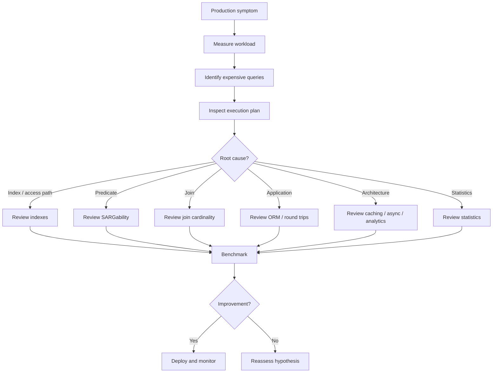

# 35- Common SQL Performance Anti-Patterns

## Overview

SQL performance anti-patterns are recurring query, schema, and application-design choices that cause unnecessary database work. They often perform acceptably at small scale and become expensive as data volume, concurrency, or request frequency increases.

The most important distinction is between **syntactically valid SQL** and **efficient database workload design**. A query can return the correct result while causing excessive CPU, I/O, memory usage, locking, network traffic, or connection pressure.

Common anti-patterns appear across:

- SQL queries.
- Database schema design.
- Indexing.
- ORM usage.
- Pagination.
- Transactions.
- Application/database interaction.
- Caching and data-access architecture.

A production-oriented approach is:

```text
Observe workload
      ↓
Identify expensive behavior
      ↓
Inspect execution plan
      ↓
Confirm root cause
      ↓
Choose the least-complex fix
      ↓
Benchmark
      ↓
Deploy and monitor
```

## Why Anti-Patterns Matter

Database inefficiencies multiply with workload.

A query that costs `20 ms` may appear harmless:

```text
20 ms × 10 requests/day
= 200 ms/day
```

The same query becomes significant when executed frequently:

```text
20 ms × 1,000,000 executions/day
= 20,000 seconds/day
```

The resulting impact can include:

- Higher database CPU.
- Increased storage I/O.
- Longer request latency.
- Connection pool exhaustion.
- Increased lock contention.
- More infrastructure capacity.
- Higher cloud costs.
- Increased timeout and retry rates.
- Reduced headroom during traffic spikes.

## Anti-Pattern Categories

| Category | Examples |
|---|---|
| Query predicates | Functions on indexed columns, implicit casts |
| Data access | `SELECT *`, excessive rows |
| Joins | Missing predicates, unnecessary joins |
| Pagination | Large `OFFSET` values |
| Aggregation | Repeated expensive aggregation |
| Subqueries | Repeated correlated work |
| Indexing | Missing, redundant, or excessive indexes |
| ORM | N+1 queries, accidental materialization |
| Transactions | Long-running transactions |
| Application architecture | Excessive database round trips |
| Caching | Missing cache for hot immutable data |
| Optimization process | Optimizing without measurement |

## Full Table Scans on Large Tables

### What It Is

A sequential scan reads a large portion or all of a table instead of using an index to narrow the candidate rows.

For example:

```sql
SELECT
    id,
    email
FROM users
WHERE email = 'user@example.com';
```

If `email` is frequently queried but has no suitable index, the database may need to inspect many rows.

### Why It Is a Problem

For a large table:

```text
10 rows       → usually insignificant
10,000 rows   → potentially acceptable
100 million   → potentially expensive
```

The database may have to perform substantial I/O and CPU work.

### Better Approach

Create an index when the workload justifies it:

```sql
CREATE INDEX idx_users_email
ON users (email);
```

Then verify the plan:

```sql
EXPLAIN (ANALYZE, BUFFERS)
SELECT
    id,
    email
FROM users
WHERE email = 'user@example.com';
```

### Important Limitation

A sequential scan is **not automatically bad**.

If a query needs a large percentage of a table, a sequential scan may be cheaper than using an index.

```text
Small result set
    → index often useful

Large result set
    → sequential scan may be optimal
```

The execution plan and workload determine whether the scan is a problem.

## Functions on Indexed Columns

### Anti-Pattern

Applying a function to an indexed column can prevent efficient use of a normal index.

```sql
SELECT *
FROM users
WHERE LOWER(email) = 'user@example.com';
```

If the available index is:

```sql
CREATE INDEX idx_users_email
ON users (email);
```

the database may not be able to use that index effectively for the transformed expression.

### Better Approaches

Use a matching expression index where supported:

```sql
CREATE INDEX idx_users_lower_email
ON users (LOWER(email));
```

Or redesign the predicate so the indexed value can be compared directly.

The general principle is:

```text
Indexed expression
      ↓
Predicate should ideally match the indexed access pattern
```

This is closely related to **SARGability**.

## Non-SARGable Predicates

A predicate is problematic when the database cannot efficiently use an available index to locate qualifying rows.

Common examples include:

```sql
WHERE DATE(created_at) = DATE '2026-09-01'
```

or:

```sql
WHERE amount + 10 > 100
```

or:

```sql
WHERE LOWER(email) = 'user@example.com'
```

A range predicate is often more index-friendly:

```sql
WHERE created_at >= TIMESTAMP '2026-09-01 00:00:00'
  AND created_at < TIMESTAMP '2026-09-02 00:00:00'
```

The exact rewrite depends on database semantics, data types, indexes, and correctness requirements.

## Leading-Wildcard Searches

### Anti-Pattern

```sql
SELECT id, name
FROM products
WHERE name LIKE '%phone%';
```

A normal B-tree index generally cannot efficiently locate arbitrary substrings beginning in the middle of the value.

### Better Options

For prefix searches:

```sql
WHERE name LIKE 'phone%'
```

a conventional index may be useful depending on database, collation, and index configuration.

For genuine substring or full-text search requirements, use a search-oriented solution appropriate to the database and workload.

For PostgreSQL, options can include:

- Full-text search.
- Trigram indexes.
- Specialized search infrastructure.

Do not force a B-tree index to solve a text-search problem it was not designed for.

## Implicit Type Conversions

### Anti-Pattern

Comparing incompatible data types can cause implicit conversion:

```sql
WHERE user_id = '123'
```

when `user_id` is numeric.

The exact behavior varies by database and data types, but implicit conversions can:

- Prevent efficient index access.
- Increase CPU work.
- Produce unexpected semantics.
- Hide application bugs.

### Better Approach

Use matching parameter types from the application.

For Python applications, ensure database parameters are bound with appropriate native types rather than manually constructing SQL strings.

Parameterized queries are also essential for SQL injection prevention.

## `SELECT *`

### Anti-Pattern

```sql
SELECT *
FROM orders
WHERE customer_id = $1;
```

### Why It Is Often Problematic

Returning unnecessary columns can increase:

- Disk reads.
- Memory usage.
- Network traffic.
- Serialization cost.
- Application memory.
- Index/table access requirements.

It can also make APIs tightly coupled to the physical schema.

### Better Approach

Select only required columns:

```sql
SELECT
    id,
    status,
    total_amount,
    created_at
FROM orders
WHERE customer_id = $1;
```

This is particularly important for:

- REST APIs.
- gRPC services.
- Large tables.
- Wide rows.
- High-frequency queries.

## Returning Too Many Rows

### Anti-Pattern

```sql
SELECT
    id,
    email
FROM users
WHERE tenant_id = $1;
```

when the tenant may have millions of users.

### Why It Is Dangerous

The database may successfully execute the query while the application suffers from:

```text
Database
   ↓
Large result set
   ↓
Network transfer
   ↓
Application memory
   ↓
Serialization
   ↓
HTTP/gRPC response
```

The bottleneck is no longer just SQL execution.

### Better Approach

Use:

- Pagination.
- Explicit limits.
- Filtering.
- Streaming where appropriate.
- Asynchronous exports for large datasets.

## Large `OFFSET` Pagination

### Anti-Pattern

```sql
SELECT
    id,
    created_at
FROM orders
ORDER BY created_at DESC
LIMIT 50 OFFSET 500000;
```

The database may need to process a large number of rows before returning the requested page.

### Better Approach

Use keyset or cursor pagination for large ordered datasets:

```sql
SELECT
    id,
    created_at
FROM orders
WHERE (created_at, id) < ($1, $2)
ORDER BY created_at DESC, id DESC
LIMIT 50;
```

A stable unique tie-breaker such as `id` is important when timestamps are not unique.

### When Offset Is Fine

Offset pagination remains useful when:

- Result sets are small.
- Users need direct page navigation.
- The maximum page depth is limited.
- Performance has been measured as acceptable.

Do not replace offset pagination automatically.

## Missing `ORDER BY` With Pagination

### Anti-Pattern

```sql
SELECT id, email
FROM users
LIMIT 50 OFFSET 100;
```

Without an explicit ordering, the database does not guarantee a deterministic result order.

Pagination can therefore produce:

- Duplicates.
- Missing rows.
- Unstable page boundaries.

### Better Approach

Define deterministic ordering:

```sql
SELECT
    id,
    email
FROM users
ORDER BY id
LIMIT 50 OFFSET 100;
```

For cursor pagination, use a stable ordering key or keyset.

## N+1 Queries

### What It Is

N+1 occurs when the application performs one query to load a collection and then one additional query for each item.

```text
1 query → fetch 100 orders
100 queries → fetch customer for each order

Total = 101 queries
```

### Typical ORM Example

Conceptually:

```python
orders = Order.objects.all()

for order in orders:
    print(order.customer.name)
```

Depending on ORM configuration, accessing `customer` may trigger an additional query for every order.

### Better Approach

In Django:

```python
orders = (
    Order.objects
    .select_related("customer")
    .filter(tenant_id=tenant_id)
)
```

For many-to-many or reverse relationships, `prefetch_related()` may be more appropriate.

### Why It Matters

Even small queries become expensive when multiplied by network round trips and connection overhead.

```text
1 database round trip
    ↓
Usually manageable

1,001 database round trips
    ↓
Potentially severe latency
```

## Excessive Database Round Trips

N+1 is one example of a broader anti-pattern: treating the database like a remote object store.

For example:

```text
Application
   ↓
Query A
   ↓
Query B
   ↓
Query C
   ↓
Query D
   ↓
Query E
```

Each round trip adds latency and database work.

Where appropriate, consolidate related operations:

```sql
SELECT ...
FROM orders
JOIN customers
  ON customers.id = orders.customer_id
WHERE orders.tenant_id = $1;
```

However, do not create enormous queries solely to reduce query count. The correct target is efficient overall workload behavior.

## Unnecessary Joins

### Anti-Pattern

Joining tables whose columns are not required:

```sql
SELECT
    o.id,
    o.total_amount
FROM orders o
JOIN customers c
  ON c.id = o.customer_id
WHERE o.status = 'pending';
```

If no customer information or customer predicate is required, the join may be unnecessary.

### Better Approach

Remove redundant joins:

```sql
SELECT
    o.id,
    o.total_amount
FROM orders o
WHERE o.status = 'pending';
```

But verify semantics before removing a join. A join may implicitly enforce existence or filtering behavior.

## Missing Join Predicates

### Anti-Pattern

Accidentally producing a Cartesian product:

```sql
SELECT
    o.id,
    c.email
FROM orders o
JOIN customers c
    ON TRUE;
```

If there are:

```text
1,000,000 orders
100,000 customers
```

the intermediate result can become enormous.

### Better Approach

Join using the correct relationship:

```sql
SELECT
    o.id,
    c.email
FROM orders o
JOIN customers c
    ON c.id = o.customer_id;
```

Always inspect join cardinality and row counts.

## Joining Before Filtering

When possible, reduce the amount of data participating in expensive operations.

For example:

```sql
SELECT ...
FROM orders o
JOIN order_items oi
  ON oi.order_id = o.id
WHERE o.created_at >= $1;
```

The optimizer may push predicates down automatically. Do not assume manually rewriting the query is always necessary.

The important engineering principle is:

> **Reduce rows as early as practical, but let the optimizer choose the physical execution strategy.**

This is closely related to predicate pushdown.

## Correlated Subqueries With Repeated Work

### Anti-Pattern

A correlated subquery may conceptually perform work for each outer row:

```sql
SELECT
    c.id,
    (
        SELECT COUNT(*)
        FROM orders o
        WHERE o.customer_id = c.id
    ) AS order_count
FROM customers c;
```

Modern optimizers can transform some such queries efficiently, so the syntax alone does not prove poor performance.

### Better Approach

If the execution plan demonstrates repeated expensive work, consider a set-based formulation:

```sql
SELECT
    c.id,
    COUNT(o.id) AS order_count
FROM customers c
LEFT JOIN orders o
    ON o.customer_id = c.id
GROUP BY c.id;
```

Benchmark both versions.

The correct rule is not:

```text
"Never use subqueries."
```

It is:

```text
"Do not assume a subquery is efficient or inefficient without examining its plan."
```

## Repeated Aggregation

### Anti-Pattern

A high-traffic dashboard repeatedly calculates expensive aggregates over a large transactional table:

```sql
SELECT
    customer_id,
    SUM(total_amount)
FROM orders
GROUP BY customer_id;
```

executed on every request.

### Why It Becomes Expensive

Repeated aggregation can consume:

- CPU.
- Memory.
- I/O.
- Temporary storage.
- Query concurrency capacity.

### Better Architectural Options

Depending on freshness requirements:

- Precomputed summary tables.
- Materialized views.
- Incremental aggregation.
- Caching.
- Data warehouse analytics.

The correct solution depends on:

```text
Freshness requirement
+
Query frequency
+
Data volume
+
Write volume
+
Operational complexity
```

## Sorting Large Result Sets

### Anti-Pattern

```sql
SELECT
    id,
    created_at
FROM orders
WHERE customer_id = $1
ORDER BY total_amount DESC;
```

If a suitable access path does not exist, the database may need to retrieve many rows and sort them.

### Better Approach

Consider whether the query workload justifies an index such as:

```sql
CREATE INDEX idx_orders_customer_amount
ON orders (customer_id, total_amount DESC);
```

The correct index depends on:

- Filter predicates.
- Ordering.
- Selectivity.
- Projection.
- Write workload.
- Database planner behavior.

Do not add an index solely because a query contains `ORDER BY`.

## Excessive Indexing

Indexes improve some reads but impose costs.

Each additional index can increase:

- Storage consumption.
- Insert cost.
- Update cost.
- Delete cost.
- Vacuum/maintenance work.
- Backup size.
- Migration complexity.

A write-heavy table with many overlapping indexes can become expensive to maintain.

### Better Approach

Review indexes periodically:

```text
Query workload
      ↓
Required access patterns
      ↓
Existing indexes
      ↓
Redundant indexes
      ↓
Write/read trade-off
```

Indexes should be workload-driven.

## Incorrect Composite Index Ordering

Suppose the workload is:

```sql
SELECT
    id,
    created_at
FROM orders
WHERE customer_id = $1
  AND status = $2
ORDER BY created_at DESC;
```

An index such as:

```sql
CREATE INDEX idx_orders_customer_status_created
ON orders (customer_id, status, created_at DESC);
```

may be useful because its column order aligns with the access pattern.

But there is no universal rule such as:

```text
"Put the most selective column first."
```

Composite index design depends on:

- Equality predicates.
- Range predicates.
- Ordering.
- Join conditions.
- Query frequency.
- Data distribution.
- Database-specific optimizer behavior.

Validate with actual workload and execution plans.

## Redundant Indexes

Examples of potentially overlapping indexes:

```text
(customer_id)
(customer_id, created_at)
```

The second index may make the first unnecessary for some workloads, but not necessarily all.

Before removing an index, verify:

- Which queries use it.
- Whether it supports uniqueness.
- Whether it supports constraints.
- Whether it is required for specific plans.
- Whether workload changes could make it valuable.

Index cleanup should be evidence-driven.

## `DISTINCT` as a Duplicate-Fix

### Anti-Pattern

Using `DISTINCT` to hide duplicate rows created by an incorrect join:

```sql
SELECT DISTINCT
    c.id,
    c.email
FROM customers c
JOIN orders o
  ON o.customer_id = c.id;
```

### Why It Can Be Problematic

`DISTINCT` may require additional sorting or hashing.

More importantly, it can hide the actual problem:

```text
Incorrect join cardinality
        ↓
Duplicate rows
        ↓
DISTINCT
        ↓
Symptoms hidden
```

### Better Approach

First determine why duplicates are produced.

If the real requirement is existence, `EXISTS` may better express the intent:

```sql
SELECT
    c.id,
    c.email
FROM customers c
WHERE EXISTS (
    SELECT 1
    FROM orders o
    WHERE o.customer_id = c.id
);
```

Benchmark the alternatives.

## `OR` Predicates Without Understanding the Plan

Queries such as:

```sql
SELECT *
FROM orders
WHERE customer_id = $1
   OR status = $2;
```

can be difficult to optimize depending on data distribution and available indexes.

Do not automatically assume `OR` is bad. Some databases can combine index access paths efficiently.

If the plan demonstrates poor performance, alternatives may include:

- Query restructuring.
- `UNION`/`UNION ALL`.
- Appropriate indexes.
- Data model changes.

Correctness and duplicate semantics must be considered when rewriting.

## Leading `NOT` Predicates

Predicates such as:

```sql
WHERE status <> 'cancelled'
```

may be less selective than positive predicates.

If most rows are not cancelled, the database may reasonably choose a sequential scan.

The problem is not the `<>` operator itself. The issue is whether the predicate provides an efficient access path for the actual data distribution.

## Large `IN` Lists

A query such as:

```sql
SELECT *
FROM users
WHERE id IN (...thousands of values...);
```

can become expensive due to:

- Large SQL payloads.
- Parsing/planning overhead.
- Network transfer.
- Parameter management.
- Large intermediate operations.

For substantial sets, consider:

- Temporary tables.
- Staging tables.
- Array parameters where appropriate.
- Joining against a values relation.
- Bulk loading identifiers.

Avoid generating SQL dynamically by string concatenation.

## Repeated Queries Inside Loops

### Anti-Pattern

```python
for user_id in user_ids:
    cursor.execute(
        """
        SELECT status
        FROM users
        WHERE id = %s
        """,
        [user_id],
    )
```

This creates one database round trip per identifier.

### Better Approach

Use a set-based query:

```sql
SELECT
    id,
    status
FROM users
WHERE id = ANY($1);
```

or an equivalent parameterized mechanism supported by the database driver.

The database is optimized for set operations; application loops often create unnecessary network and execution overhead.

## Application-Side Filtering

### Anti-Pattern

```python
users = User.objects.all()

active_users = [
    user for user in users
    if user.is_active
]
```

This can load unnecessary rows into application memory.

### Better Approach

Push filtering to the database:

```python
active_users = User.objects.filter(is_active=True)
```

The database can use indexes, statistics, and optimized execution strategies before transferring the result.

This is a common example of predicate pushdown from the application perspective.

## Application-Side Aggregation

### Anti-Pattern

```python
orders = list(Order.objects.filter(customer_id=customer_id))
total = sum(order.amount for order in orders)
```

This transfers all matching rows to the application when only an aggregate is required.

### Better Approach

Let the database perform the aggregation:

```python
from django.db.models import Sum

total = (
    Order.objects
    .filter(customer_id=customer_id)
    .aggregate(total=Sum("amount"))
)["total"]
```

The database can calculate the result without transferring every row to Python.

## ORM Accidental Materialization

Some ORM operations cause a complete result set to be loaded into application memory.

For example:

```python
users = list(User.objects.filter(is_active=True))
```

If millions of users match, memory consumption can become significant.

Prefer:

- Database-side filtering.
- Pagination.
- Streaming/queryset iteration where appropriate.
- Bulk operations.
- Narrow projections.

For Django:

```python
users = (
    User.objects
    .filter(is_active=True)
    .values_list("id", "email")
)
```

The exact evaluation behavior should still be understood before processing very large datasets.

## Long-Running Transactions

### Anti-Pattern

Keeping a transaction open while performing slow external work:

```text
BEGIN
   ↓
Database update
   ↓
HTTP API call
   ↓
Wait 10 seconds
   ↓
More database work
   ↓
COMMIT
```

### Why It Is Dangerous

Long transactions can:

- Hold locks.
- Increase contention.
- Delay cleanup.
- Increase MVCC/version retention.
- Consume connections.
- Increase deadlock exposure.

### Better Approach

Keep transaction boundaries as narrow as correctness permits.

For example:

```text
Validate input
    ↓
External operation
    ↓
Short database transaction
    ↓
Commit
```

The exact ordering depends on consistency and failure semantics.

## Excessive Transaction Scope

Even without external calls, wrapping unrelated work in one transaction can unnecessarily increase transaction duration.

Prefer transaction boundaries that correspond to an actual consistency requirement.

Do not optimize by splitting a transaction if doing so breaks atomicity.

Correctness comes first.

## Unbounded Batch Operations

### Anti-Pattern

Attempting to process millions of rows in one transaction:

```sql
UPDATE orders
SET archived = TRUE
WHERE created_at < $1;
```

For a very large dataset, this can create operational pressure.

Potential effects include:

- Long transaction duration.
- Large WAL generation.
- Lock contention.
- Replication lag.
- Vacuum pressure.
- Large rollback cost.

### Better Approach

For operational batch jobs, consider controlled batching where appropriate:

```text
Find batch
    ↓
Update batch
    ↓
Commit
    ↓
Measure
    ↓
Repeat
```

Batching is not universally better; it can increase total work or complicate correctness. Choose based on workload and recovery requirements.

## Unbounded Deletes

Large deletes can have significant operational impact.

Instead of assuming:

```sql
DELETE FROM events
WHERE created_at < $1;
```

is harmless, evaluate:

- Number of rows.
- Index maintenance.
- WAL volume.
- Replication.
- Locking.
- Vacuum behavior.
- Transaction duration.

For very large datasets, partitioning and partition-level retention can be more appropriate.

## Offset-Based Queue Processing

A common anti-pattern is repeatedly selecting work using offsets:

```sql
SELECT id
FROM jobs
WHERE status = 'pending'
ORDER BY id
LIMIT 100 OFFSET 100000;
```

This can become increasingly expensive and is also problematic for concurrent workers.

Production job queues generally require explicit concurrency control and claiming semantics.

For PostgreSQL, a common pattern is:

```sql
SELECT id
FROM jobs
WHERE status = 'pending'
ORDER BY id
FOR UPDATE SKIP LOCKED
LIMIT 100;
```

followed by updating the claimed rows within an appropriate transaction.

The exact implementation depends on queue semantics, failure recovery, and worker behavior.

## Counting Huge Result Sets Unnecessarily

### Anti-Pattern

Running an expensive exact count only to determine whether any result exists:

```sql
SELECT COUNT(*)
FROM orders
WHERE customer_id = $1;
```

when the application only needs:

```text
"Does this customer have at least one order?"
```

### Better Approach

Use:

```sql
SELECT EXISTS (
    SELECT 1
    FROM orders
    WHERE customer_id = $1
);
```

The database can stop once existence is established.

The same principle applies broadly:

```text
Need existence?
→ EXISTS

Need exact count?
→ COUNT

Need rows?
→ SELECT
```

Express the actual requirement.

## Counting for Pagination Without Considering Cost

APIs sometimes execute:

```sql
SELECT COUNT(*)
FROM orders
WHERE ...
```

and then:

```sql
SELECT ...
FROM orders
WHERE ...
LIMIT 50 OFFSET 0;
```

The count can be expensive for large datasets.

Possible alternatives include:

- Returning only `has_next`.
- Cursor pagination.
- Approximate counts where acceptable.
- Cached counts.
- Separating count endpoints from data retrieval.

Do not remove exact counts when product requirements genuinely require them.

## Repeated `COUNT(*)` on Hot Paths

Exact counts over frequently changing large tables can become a significant workload.

If a dashboard requires the same expensive count on every request, consider:

- Cached counters.
- Precomputed summaries.
- Approximate statistics.
- Materialized views.

The correct solution depends on consistency requirements.

## Excessive Use of `LIKE`

Search patterns should match the search requirement.

```sql
WHERE email LIKE '%example.com'
```

is fundamentally different from:

```sql
WHERE email LIKE 'example%'
```

Do not assume every `LIKE` predicate can use a conventional index efficiently.

For complex search requirements, use the appropriate search technology rather than repeatedly tuning an unsuitable query.

## Querying Data That Is Never Used

An endpoint may retrieve:

```text
100 columns
10,000 rows
```

while the response needs:

```text
3 columns
50 rows
```

This increases work across the entire stack.

A production query should generally minimize:

```text
Rows processed
+
Columns processed
+
Rows transferred
+
Application processing
```

## Excessive JSON or Large Payload Construction in SQL

Modern databases can generate JSON and other structured payloads efficiently, but using SQL to construct enormous application responses can become expensive.

For example:

```sql
SELECT json_agg(...)
FROM very_large_dataset;
```

may consume significant database memory and CPU.

Use database-side JSON construction when it reduces unnecessary application work, but monitor:

- Result size.
- Memory.
- CPU.
- Network transfer.
- Request concurrency.

Database-side processing is not automatically cheaper.

## Doing Analytics on the Transactional Database

A production OLTP database is often optimized for short, concurrent transactional operations.

Running large analytical queries directly against it can cause:

- CPU contention.
- I/O contention.
- Cache eviction.
- Lock-related pressure.
- Increased latency for transactional traffic.

For substantial analytics workloads, consider:

```text
OLTP database
      ↓
Replication / ETL / streaming
      ↓
Analytical system
```

AWS architectures may use services such as managed relational databases for OLTP and separate analytical storage/processing where workload scale requires it.

## Ignoring Read/Write Workload Balance

An index that makes a read query faster can make writes more expensive.

For example:

```text
INSERT
  ↓
Table update
  ↓
Index 1
  ↓
Index 2
  ↓
Index 3
  ↓
Index 4
```

The correct design depends on workload balance.

For a read-heavy service, additional indexes may be justified.

For a write-heavy event ingestion system, excessive indexing can become a major bottleneck.

## Assuming an Index Is Always Better

A database may choose a sequential scan even when an index exists.

That can be correct.

For example:

```text
Table:
1 million rows

Predicate:
matches 700,000 rows
```

Using an index may require many random table accesses, while a sequential scan may be cheaper.

The existence of an index does not imply that the optimizer should use it.

## Stale or Poor Statistics

Query planners rely on statistics to estimate:

- Row counts.
- Data distributions.
- Selectivity.
- Join cardinality.

If estimates are significantly wrong, the planner may choose a poor plan.

For PostgreSQL, routine `ANALYZE` and autovacuum behavior are important operational mechanisms.

Investigate statistics when:

```text
Estimated rows ≠ Actual rows
```

by a large margin.

Do not immediately rewrite SQL if stale statistics are the real cause.

## Parameter-Sensitive Plan Problems

The optimal execution strategy can depend on parameter values.

For example:

```text
Parameter A:
matches 5 rows

Parameter B:
matches 5 million rows
```

The same query shape may have very different optimal strategies.

Production systems should therefore test representative parameter distributions rather than benchmarking one convenient value.

The exact behavior depends on the database's planning and prepared-statement mechanisms.

## Premature Query Hints

Database-specific hints or forcing mechanisms can sometimes solve a real planner problem, but they introduce coupling to implementation details.

Avoid using them as the first response.

Preferred order:

```text
Statistics
   ↓
Schema/index design
   ↓
Query shape
   ↓
Planner configuration
   ↓
Hints / forced behavior
```

Use database-specific mechanisms only when there is strong evidence and a clear operational reason.

## Ignoring Query Plan Changes

A query that performs well today may become expensive after:

- Data growth.
- Distribution changes.
- Schema changes.
- Statistics updates.
- Index changes.
- Database upgrades.
- Configuration changes.

Production performance should therefore be monitored over time.

Critical queries should be evaluated against representative datasets during major schema or database changes.

## Optimizing Only for Average Latency

Suppose:

```text
p50 = 20 ms
p95 = 40 ms
p99 = 2,000 ms
```

The average or median can hide severe tail behavior.

For user-facing APIs, monitor:

- p50.
- p95.
- p99.
- Timeout rate.

Tail latency often matters more than average latency for perceived system reliability.

## Ignoring Query Frequency

A query with:

```text
500 ms execution
10 executions/day
```

may matter less than:

```text
5 ms execution
10 million executions/day
```

Prioritize based on workload impact rather than individual execution time alone.

Useful dimensions include:

```text
Execution time
×
Execution frequency
×
Resource consumption
×
Business criticality
```

## Blindly Rewriting Working Queries

A query may look unnecessarily complex but already have an efficient execution plan.

For example:

```sql
EXISTS (...)
```

is not automatically better than:

```sql
JOIN ...
```

and a CTE is not automatically better or worse than a subquery.

The database optimizer may transform logically equivalent SQL into similar physical plans.

Optimize based on evidence.

## ORM Generated SQL Blindness

Using Django, SQLAlchemy, or another ORM does not eliminate SQL performance concerns.

Always understand:

```text
Application code
      ↓
ORM
      ↓
Generated SQL
      ↓
Database planner
      ↓
Execution
```

Inspect generated SQL and query counts for critical paths.

ORM abstractions are valuable, but they do not replace database knowledge.

## SQL String Construction

### Anti-Pattern

```python
query = f"""
SELECT id
FROM users
WHERE email = '{email}'
"""
```

This is dangerous because it can enable SQL injection and often leads to poor parameter handling.

### Better Approach

Use parameterized queries:

```python
cursor.execute(
    """
    SELECT id
    FROM users
    WHERE email = %s
    """,
    [email],
)
```

Performance optimization should never weaken SQL injection defenses.

## Fetching Before Filtering

### Anti-Pattern

```python
records = list(Order.objects.all())

filtered = [
    record
    for record in records
    if record.status == "pending"
]
```

This moves work from the database to the application unnecessarily.

### Better Approach

```python
records = Order.objects.filter(status="pending")
```

This allows filtering before data crosses the database/application boundary.

## Excessive Use of `SELECT DISTINCT`

`DISTINCT` can be legitimate, but using it everywhere often indicates unclear query semantics.

Before adding it, ask:

- Why are duplicates occurring?
- Is the join relationship correct?
- Should the query use `EXISTS`?
- Is the data model relationship understood?

Use `DISTINCT` when deduplication is genuinely part of the required result.

## Using SQL as a General-Purpose Processing Engine

Databases are excellent at:

- Set operations.
- Filtering.
- Joins.
- Aggregations.
- Transactions.
- Constraint enforcement.

They are not necessarily the best place for every CPU-intensive transformation.

For heavy processing, consider whether work belongs in:

- Python workers.
- Celery.
- Kafka-based pipelines.
- Batch jobs.
- Data-processing infrastructure.

The decision should consider data locality, transaction requirements, operational complexity, and workload volume.

## Database Work in Request Paths That Can Be Asynchronous

Some operations do not need to block a user request.

For example:

```text
HTTP request
   ↓
Create export job
   ↓
Return 202 Accepted
   ↓
Celery worker
   ↓
Large SQL operation
   ↓
Store result
```

Moving expensive work to an asynchronous workflow can protect API latency and database capacity.

Do not use asynchronous processing merely to hide a poorly designed query; optimize or redesign the workload when appropriate.

## Anti-Pattern Detection Checklist

When reviewing SQL, check for:

- [ ] Large sequential scans on unexpectedly large datasets.
- [ ] Functions applied to indexed columns.
- [ ] Non-SARGable predicates.
- [ ] Implicit type conversions.
- [ ] Leading-wildcard searches.
- [ ] `SELECT *` on large or wide tables.
- [ ] Excessive result sets.
- [ ] Large `OFFSET` values.
- [ ] Missing deterministic ordering.
- [ ] N+1 ORM queries.
- [ ] Repeated queries inside application loops.
- [ ] Unnecessary joins.
- [ ] Incorrect join cardinality.
- [ ] Correlated repeated work.
- [ ] Repeated expensive aggregation.
- [ ] Large unnecessary sorts.
- [ ] Excessive or redundant indexes.
- [ ] Poor composite-index alignment.
- [ ] `DISTINCT` hiding incorrect joins.
- [ ] Long-running transactions.
- [ ] Unbounded batch operations.
- [ ] Unbounded deletes.
- [ ] Excessive exact counts.
- [ ] Application-side filtering.
- [ ] Application-side aggregation.
- [ ] ORM accidental materialization.
- [ ] Large analytical workloads on OLTP databases.
- [ ] Stale statistics.
- [ ] Parameter-sensitive performance differences.
- [ ] Missing query observability.
- [ ] SQL string concatenation.
- [ ] Optimization without benchmarking.

## Practical Optimization Workflow

Use a repeatable workflow instead of applying anti-pattern rules mechanically.



A practical investigation should capture:

```text
Query
Execution count
Mean latency
p95/p99 latency
Rows returned
Rows processed
Execution plan
Buffer / I/O metrics
CPU
Lock behavior
Relevant indexes
Data volume
Parameter distribution
```

## Production Observability

Query performance should be observable without requiring engineers to reproduce every problem manually.

For PostgreSQL, `pg_stat_statements` can help identify high-impact statements:

```sql
SELECT
    query,
    calls,
    total_exec_time,
    mean_exec_time,
    rows
FROM pg_stat_statements
ORDER BY total_exec_time DESC
LIMIT 20;
```

Useful production signals include:

| Signal | What it can reveal |
|---|---|
| High total execution time | Expensive aggregate workload |
| High mean latency | Slow individual executions |
| High calls | Hot query |
| High rows | Large result processing |
| High buffer reads | Significant database work |
| High CPU | Compute-heavy queries |
| Lock waits | Concurrency problems |
| Connection saturation | Query/request backlog |
| Replication lag | Read/write or transaction pressure |

## Performance Anti-Patterns vs Acceptable Techniques

Not every commonly criticized SQL construct is inherently bad.

| Technique | Anti-pattern? | Correct interpretation |
|---|---|---|
| Sequential scan | No | Can be optimal for large result sets |
| Subquery | No | Depends on plan and workload |
| CTE | No | Depends on database/version and usage |
| `DISTINCT` | No | Valid when deduplication is required |
| `OR` | No | Evaluate actual plan |
| `SELECT *` | Usually avoid | Particularly problematic for large/wide results |
| Index | No | Useful only when workload justifies maintenance cost |
| ORM | No | Generated SQL still requires review |
| Cache | No | Adds complexity and consistency concerns |
| Denormalization | No | Valid when read/write trade-offs justify it |
| Materialized view | No | Useful for appropriate read-heavy workloads |

The goal is not to memorize forbidden syntax.

The goal is to recognize **unnecessary work**.

## Senior-Level Mental Model

A useful way to reason about SQL anti-patterns is:

```text
Rows processed
+
Columns processed
+
Database operations
+
Round trips
+
Concurrency
+
Resource consumption
```

Every optimization should attempt to reduce unnecessary work at one or more of these layers.

At the application boundary:

```text
Avoid unnecessary requests
```

At the ORM layer:

```text
Avoid unnecessary queries and materialization
```

At the SQL layer:

```text
Avoid unnecessary rows and operations
```

At the planner level:

```text
Choose efficient access paths
```

At the architecture level:

```text
Avoid forcing OLTP databases to perform workloads
they are not designed to handle
```

## Key Takeaways

- **SQL performance anti-patterns are patterns that cause unnecessary database work; judge them by workload impact rather than syntax alone.**
- **The highest-value checks are excessive rows, unnecessary round trips, poor predicates, inefficient joins, inappropriate indexing, large pagination offsets, and long transactions.**
- **Never assume a sequential scan, subquery, CTE, `DISTINCT`, or `OR` predicate is inherently bad; validate the actual execution plan and workload.**
- **ORM code must be evaluated through its generated SQL, query count, result size, transaction behavior, and database execution plans.**
- **Use measurement-driven optimization: identify the workload bottleneck, fix the root cause, benchmark with realistic data, and monitor production behavior after deployment.**