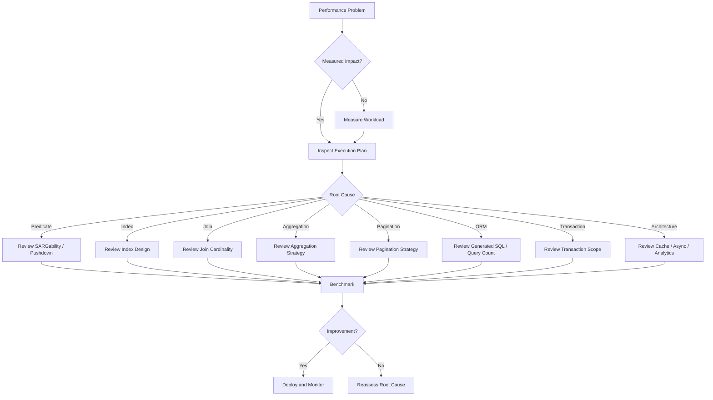

# README

## Overview

This section focuses on **SQL query execution and optimization** from an application and database-engineering perspective.

The goal is not to memorize isolated SQL tuning techniques, but to understand how SQL is executed, how the optimizer chooses an execution strategy, where unnecessary work occurs, and how to make evidence-driven performance decisions in production systems.

The topics progress from execution fundamentals to practical optimization patterns, anti-patterns, and decision-making.

## Navigation

| # | File | Description |
|---|---|---|
| 23 | [23- Predicate Pushdown](./23-%20Predicate%20Pushdown.md) | Reducing rows processed by applying filters early in the execution pipeline |
| 24 | [24- SARGability](./24-%20SARGability.md) | Writing predicates that allow efficient index and access path usage |
| 25 | [25- Avoiding Functions on Indexed Columns](./25-%20Avoiding%20Functions%20on%20Indexed%20Columns.md) | How expressions on indexed columns affect index usability |
| 26 | [26- JOIN Optimization](./26-%20JOIN%20Optimization.md) | Optimizing joins through predicates, indexes, cardinality, and execution plans |
| 27 | [27- Aggregation Optimization](./27-%20Aggregation%20Optimization.md) | Reducing the cost of GROUP BY, aggregates, sorting, and large-scale aggregation |
| 28 | [28- Subquery Optimization](./28-%20Subquery%20Optimization.md) | Evaluating correlated and uncorrelated subqueries and choosing efficient formulations |
| 29 | [29- CTE Optimization](./29-%20CTE%20Optimization.md) | CTE execution behavior, materialization, and query structure trade-offs |
| 30 | [30- Pagination Optimization](./30-%20Pagination%20Optimization.md) | Comparing offset and keyset pagination for large datasets |
| 31 | [31- Query Optimization Rules](./31-%20Query%20Optimization%20Rules.md) | Practical rules for writing and reviewing efficient SQL |
| 32 | [32- When to Optimize SQL](./32-%20When%20to%20Optimize%20SQL.md) | Identifying when query optimization is justified by workload evidence |
| 33 | [33- When Not to Optimize SQL](./33-%20When%20Not%20to%20Optimize%20SQL.md) | Recognizing premature optimization and avoiding unnecessary complexity |
| 34 | [34- Query Optimization Decision Guide](./34-%20Query%20Optimization%20Decision%20Guide.md) | A structured process for diagnosing and resolving SQL performance problems |
| 35 | [35- Common SQL Performance Anti-Patterns](./35-%20Common%20SQL%20Performance%20Anti-Patterns.md) | Query, indexing, ORM, transaction, and application-level patterns that create unnecessary work |

## Scope

This section covers:

- How SQL queries are executed.
- How databases build and optimize execution plans.
- How predicates affect index usage.
- How joins and aggregations influence query cost.
- How subqueries and CTEs behave.
- How pagination affects large datasets.
- How to recognize common SQL performance anti-patterns.
- When SQL should be optimized.
- When optimization is unnecessary or harmful.
- How to choose an optimization strategy based on workload evidence.

## Query Optimization Model

SQL optimization should be approached as a measurement-driven engineering process:

```text
Application Request
        │
        ▼
Generated SQL
        │
        ▼
Database Optimizer
        │
        ▼
Execution Plan
        │
        ▼
Rows / Pages / Indexes / Joins / Aggregation
        │
        ▼
CPU / Memory / I/O / Locks
        │
        ▼
Query Latency
        │
        ▼
Application Performance
```

A slow API endpoint is therefore not necessarily caused by a "bad SQL query." The bottleneck may exist in:

- Query formulation.
- Index design.
- Data distribution.
- Statistics.
- Join cardinality.
- Database configuration.
- Lock contention.
- Connection pool behavior.
- ORM-generated SQL.
- Excessive database round trips.
- Application-side processing.
- An architectural workload mismatch.

## Core Optimization Principles

### Reduce Unnecessary Work

The most useful general principle is:

> **Do less work, and make the required work cheaper.**

This can mean:

- Process fewer rows.
- Read fewer columns.
- Use appropriate indexes.
- Avoid unnecessary joins.
- Reduce database round trips.
- Avoid unnecessary sorting.
- Aggregate efficiently.
- Return only required data.
- Avoid repeated computation.
- Move workloads to appropriate systems when necessary.

### Measure Before Changing

Optimization should begin with evidence rather than assumptions.

Useful evidence includes:

```text
Query frequency
Execution latency
p95 / p99 latency
Rows returned
Rows processed
Execution plan
Buffer / I/O activity
CPU consumption
Lock waits
Database connections
Data volume
Parameter distribution
```

For PostgreSQL, tools such as `EXPLAIN (ANALYZE, BUFFERS)` and `pg_stat_statements` are particularly useful for investigating production workloads.

### Optimize the Workload, Not Just the Query

A query executed once per hour may not deserve optimization even if it takes several seconds.

A query taking a few milliseconds but executed millions of times per day may be a much higher priority.

A useful prioritization model is:

```text
Performance impact
≈
Execution cost
×
Execution frequency
×
Concurrency
×
Business criticality
```

## Execution-Plan Mindset

Do not infer database behavior solely from SQL syntax.

Two queries that look very different may produce similar execution plans, while two queries that look almost identical can behave very differently because of:

- Data distribution.
- Statistics.
- Index availability.
- Parameter values.
- Table size.
- Join cardinality.
- Database version.
- Configuration.

A production engineer should therefore ask:

```text
What does the optimizer intend to do?
        ↓
What actually happened?
        ↓
Where was the expensive work?
        ↓
Why did the optimizer choose that strategy?
        ↓
What change addresses the root cause?
```

## Application and ORM Considerations

SQL optimization does not stop at handwritten SQL.

In backend systems, the complete path is often:

```text
Python / Django / FastAPI
        │
        ▼
ORM / Database Driver
        │
        ▼
Generated SQL
        │
        ▼
Database Optimizer
        │
        ▼
Execution Engine
```

Performance problems can therefore originate from:

- N+1 queries.
- Accidental ORM evaluation.
- Fetching unnecessary columns.
- Loading excessive rows.
- Application-side filtering.
- Application-side aggregation.
- Repeated queries inside loops.
- Poor transaction boundaries.
- Inefficient pagination.

The generated SQL should be inspected for critical paths rather than assuming ORM abstractions are automatically efficient.

## Production Optimization Priorities

When optimizing SQL in a production backend, consider the complete system:

| Area | Questions |
|---|---|
| Latency | Is the query affecting request p95/p99? |
| Frequency | How often does it execute? |
| Concurrency | How many instances execute it simultaneously? |
| CPU | Is database CPU saturated? |
| I/O | Are queries causing excessive reads? |
| Memory | Are sorts, hashes, or aggregations memory-intensive? |
| Locks | Is contention delaying other requests? |
| Connections | Are slow queries exhausting the connection pool? |
| Replication | Is workload increasing replica lag? |
| Writes | Will an index improve reads but hurt write throughput? |
| Cost | Will the change reduce or increase infrastructure requirements? |
| Reliability | Could the current workload cause timeouts or cascading failures? |

## Common Optimization Trade-Offs

SQL optimization is rarely about maximizing one metric in isolation.

| Optimization | Potential Benefit | Potential Cost |
|---|---|---|
| Add index | Faster reads | More storage and write overhead |
| Add composite index | Efficient multi-column access | Additional maintenance and design complexity |
| Cache result | Lower database load | Staleness and invalidation complexity |
| Denormalize | Faster reads | More complex writes and consistency |
| Materialize aggregate | Faster repeated reads | Refresh/update complexity |
| Keyset pagination | Stable large-scale pagination | More complex navigation semantics |
| Batch writes | Lower transaction overhead | More complex failure handling |
| Reduce transaction scope | Lower contention | May require redesigning consistency boundaries |
| Move analytics elsewhere | Protects OLTP workload | Additional infrastructure and data pipelines |
| Rewrite SQL | Potentially better plan | May add complexity without measurable benefit |

## Practical Review Checklist

Before considering a query optimized, verify:

- [ ] The query's production impact has been measured.
- [ ] The execution plan has been inspected.
- [ ] Estimated and actual row counts are understood.
- [ ] Relevant indexes have been reviewed.
- [ ] Predicates are appropriate for available access paths.
- [ ] Join cardinality is understood.
- [ ] Unnecessary joins and columns have been removed.
- [ ] Result-set size is appropriate.
- [ ] Pagination scales with the expected dataset.
- [ ] ORM-generated SQL has been inspected where applicable.
- [ ] Query frequency and concurrency are understood.
- [ ] Transaction scope is appropriate.
- [ ] Statistics are current enough for the workload.
- [ ] Representative parameters and data volumes have been tested.
- [ ] The proposed change has been benchmarked.
- [ ] Production metrics can confirm the result after deployment.

## Common Mistakes

Avoid these optimization habits:

- Adding indexes without checking the workload.
- Assuming every sequential scan is inefficient.
- Assuming every subquery should become a join.
- Assuming CTEs are always faster or slower than alternatives.
- Using `DISTINCT` to hide an incorrect join.
- Optimizing based only on average latency.
- Ignoring query frequency.
- Ignoring write overhead from additional indexes.
- Rewriting SQL without inspecting the execution plan.
- Moving database work into Python without considering data transfer cost.
- Using caching to hide an inefficient query without understanding invalidation.
- Optimizing before establishing a measurable performance problem.
- Testing only with small development datasets.
- Ignoring production data distribution and concurrency.

## Decision Framework

A practical SQL optimization decision process is:



## Key Takeaways

- **SQL optimization is a workload-management problem, not a collection of syntax rules.**
- **Execution plans, production metrics, data distribution, and query frequency should drive optimization decisions.**
- **Efficient SQL minimizes unnecessary rows, I/O, CPU, memory, sorting, database round trips, and transaction duration.**
- **Indexes, query rewrites, caching, denormalization, and architectural changes all involve measurable trade-offs.**
- **Optimize only when there is a meaningful problem, validate the change with representative workloads, and monitor its production impact.**