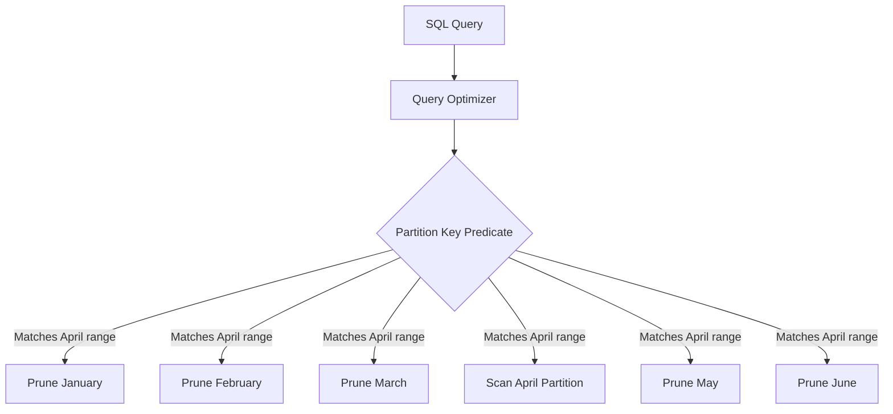
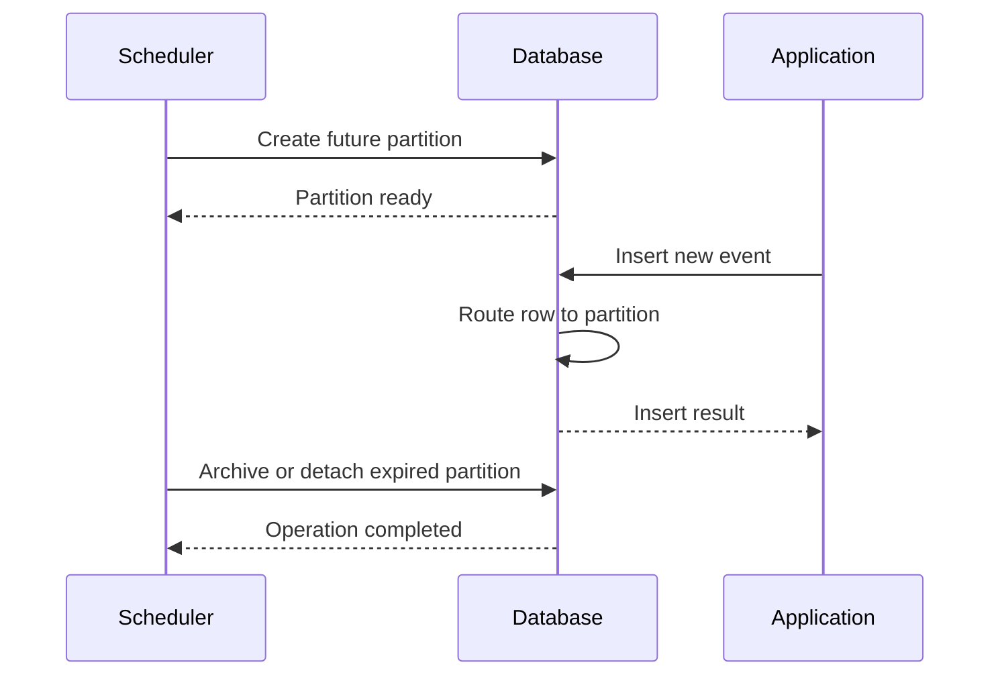

# 01- Partitioning Introduction

## Overview

Partitioning divides a large logical table into smaller physical partitions while preserving a single logical table interface for applications.

The primary purpose is to make very large tables easier and cheaper for the database to manage. Partitioning can improve query performance through **partition pruning**, reduce the operational cost of retaining or deleting large volumes of data, and provide a foundation for lifecycle management of time-series or naturally segmented workloads.

Partitioning is not a replacement for indexing. A partitioned table can still require well-designed indexes, and partitioning can make performance worse when the partition key does not align with the workload.

For backend systems, partitioning becomes relevant when table size, write volume, retention requirements, maintenance operations, or query patterns exceed what a conventional table design handles comfortably.

## Why Partitioning Exists

A conventional table may eventually contain hundreds of millions or billions of rows.

For example:

```text
orders
├── 2024 data
├── 2025 data
├── 2026 data
└── future data
```

If most application queries operate on recent data, forcing the database to consider the entire logical table is unnecessary work.

Partitioning can physically organize that data:

```text
orders
├── orders_2024
├── orders_2025
├── orders_2026
└── orders_future
```

The application can still query:

```sql
SELECT *
FROM orders
WHERE created_at >= DATE '2026-01-01'
  AND created_at < DATE '2026-02-01';
```

The database can potentially access only the relevant partition instead of scanning all partitions.

This is called **partition pruning**.

## Partitioning vs Sharding

Partitioning and sharding both divide data, but they operate at different architectural levels.

| Characteristic | Partitioning | Sharding |
|---|---|---|
| Scope | Usually within one database | Across multiple database instances |
| Application complexity | Usually low | Usually higher |
| Query routing | Database optimizer | Application/router/database layer |
| Primary goal | Manage large tables | Scale beyond one database |
| Cross-segment queries | Generally straightforward | Potentially expensive |
| Operational complexity | Moderate | High |
| Typical starting point | Large individual tables | Database capacity or workload exceeds one node |

Partitioning is therefore usually considered before sharding when a workload can still be handled effectively by a single database instance.

## Partitioning Models

The most common partitioning strategies are:

| Strategy | Partition Key | Typical Workload |
|---|---|---|
| Range | Continuous ranges | Time-series data, dates, IDs |
| List | Explicit values | Region, tenant group, status |
| Hash | Hash of a key | Even distribution of data |
| Composite | Multiple strategies | Large multi-dimensional workloads |

### Range Partitioning

Range partitioning divides data into ordered intervals.

A common production example is partitioning an events table by month:

```text
events
├── events_2026_01
├── events_2026_02
├── events_2026_03
├── events_2026_04
└── ...
```

PostgreSQL example:

```sql
CREATE TABLE events (
    id BIGINT NOT NULL,
    tenant_id BIGINT NOT NULL,
    event_type TEXT NOT NULL,
    created_at TIMESTAMPTZ NOT NULL,
    payload JSONB NOT NULL
) PARTITION BY RANGE (created_at);

CREATE TABLE events_2026_01
    PARTITION OF events
    FOR VALUES FROM ('2026-01-01') TO ('2026-02-01');

CREATE TABLE events_2026_02
    PARTITION OF events
    FOR VALUES FROM ('2026-02-01') TO ('2026-03-01');
```

The upper boundary is exclusive.

This makes time-based retention particularly efficient because an old partition can potentially be detached or dropped rather than deleting millions of individual rows.

### List Partitioning

List partitioning assigns specific values to specific partitions.

```sql
CREATE TABLE customers (
    id BIGINT NOT NULL,
    region TEXT NOT NULL,
    email TEXT NOT NULL
) PARTITION BY LIST (region);

CREATE TABLE customers_india
    PARTITION OF customers
    FOR VALUES IN ('IN');

CREATE TABLE customers_us
    PARTITION OF customers
    FOR VALUES IN ('US');

CREATE TABLE customers_eu
    PARTITION OF customers
    FOR VALUES IN ('DE', 'FR', 'ES', 'IT');
```

This can be useful when values have meaningful operational boundaries.

However, list partitioning becomes difficult to manage when the partition key has many values or values change frequently.

### Hash Partitioning

Hash partitioning distributes rows according to a hash of the partition key.

```sql
CREATE TABLE sessions (
    id BIGINT NOT NULL,
    user_id BIGINT NOT NULL,
    created_at TIMESTAMPTZ NOT NULL
) PARTITION BY HASH (user_id);

CREATE TABLE sessions_p0
    PARTITION OF sessions
    FOR VALUES WITH (MODULUS 4, REMAINDER 0);

CREATE TABLE sessions_p1
    PARTITION OF sessions
    FOR VALUES WITH (MODULUS 4, REMAINDER 1);

CREATE TABLE sessions_p2
    PARTITION OF sessions
    FOR VALUES WITH (MODULUS 4, REMAINDER 2);

CREATE TABLE sessions_p3
    PARTITION OF sessions
    FOR VALUES WITH (MODULUS 4, REMAINDER 3);
```

Hash partitioning is useful when the primary requirement is relatively even distribution rather than range-based lifecycle management.

It generally does not provide the same operational advantage as range partitioning for deleting old time-based data.

## How Partition Pruning Works

Partition pruning is one of the most important performance benefits of partitioning.

Consider:

```text
events
├── January
├── February
├── March
├── April
├── May
└── June
```

A query requesting April data:

```sql
SELECT COUNT(*)
FROM events
WHERE created_at >= DATE '2026-04-01'
  AND created_at < DATE '2026-05-01';
```

can allow the optimizer to eliminate partitions that cannot contain matching rows.



The key requirement is that the query provides information that allows the optimizer to determine which partitions can contain matching rows.

Partition pruning is therefore closely related to predicate design and query optimization.

## Partitioning Does Not Automatically Make Queries Faster

Partitioning introduces another level of data organization, but it does not guarantee lower query latency.

For example:

```sql
SELECT *
FROM events
WHERE event_type = 'LOGIN';
```

If the table is partitioned by `created_at` and the query does not restrict `created_at`, the database may need to inspect many or all partitions.

The query may therefore experience:

- Multiple partition scans.
- More planning overhead.
- More index structures to consider.
- Increased maintenance complexity.

Partitioning helps most when the **partition key matches common query predicates and operational boundaries**.

## Partition Key Selection

Choosing the partition key is one of the most important partitioning decisions.

Evaluate:

| Question | Why It Matters |
|---|---|
| Do common queries filter by this column? | Enables partition pruning |
| Is the value reasonably distributed? | Prevents oversized partitions |
| Does the value support lifecycle operations? | Simplifies retention |
| Is the value stable? | Avoids difficult row movement |
| Does it match the workload's access pattern? | Determines practical usefulness |
| Does it create too many partitions? | Controls planning and maintenance overhead |
| Does it create a hot partition? | Prevents write concentration |

For event and audit tables, `created_at` is frequently a strong partitioning candidate because queries and retention policies naturally operate on time ranges.

For multi-tenant systems, `tenant_id` may appear attractive, but partitioning every tenant separately can create excessive partition counts. A tenant-grouping or hash strategy may be more appropriate depending on scale.

## Partition Size

Partitions should generally be large enough to provide meaningful management benefits but small enough to support efficient maintenance.

Extremely small partitions can introduce:

- Excessive metadata.
- More complex planning.
- More indexes to maintain.
- More operational overhead.
- Complicated partition management.

Extremely large partitions reduce the operational advantages of partitioning.

For time-based workloads, common intervals include:

- Daily.
- Weekly.
- Monthly.
- Quarterly.

The correct interval depends on:

- Ingestion rate.
- Query patterns.
- Retention period.
- Maintenance operations.
- Index size.
- Backup and recovery requirements.

There is no universal "correct" partition size.

## Partitioning and Indexes

Partitioning and indexing solve different problems.

**Partitioning answers:**

> Which physical subset of the table needs to be considered?

**Indexes answer:**

> Within that subset, how can matching rows be located efficiently?

For example:

```text
Query
  │
  ▼
Partition pruning
  │
  ├── Ignore January
  ├── Ignore February
  └── Select March
             │
             ▼
        Index scan
             │
             ▼
        Matching rows
```

A partitioned table may therefore still require indexes.

Example:

```sql
CREATE INDEX events_2026_01_tenant_created_idx
ON events_2026_01 (tenant_id, created_at);
```

Depending on the database and partitioning implementation, indexes can be managed at the partitioned-table level or on individual partitions.

## Partitioning and Query Execution

A production query should be evaluated with an execution plan.

For PostgreSQL:

```sql
EXPLAIN (ANALYZE, BUFFERS)
SELECT COUNT(*)
FROM events
WHERE created_at >= DATE '2026-04-01'
  AND created_at < DATE '2026-05-01';
```

Look for evidence that:

- Irrelevant partitions were excluded.
- The expected partition was scanned.
- Actual rows are close to estimated rows.
- Indexes are used where appropriate.
- I/O is reasonable.
- Planning time remains acceptable.
- Execution time improved relative to the unpartitioned design.

Do not assume partition pruning occurred simply because the query contains a partition-key predicate.

## Partitioning and Data Lifecycle Management

One of the strongest production use cases is data retention.

Suppose an application retains audit events for 24 months.

With a conventional table:

```sql
DELETE FROM audit_events
WHERE created_at < now() - INTERVAL '24 months';
```

This can generate substantial work:

- Row-level deletion.
- WAL generation.
- Index maintenance.
- Vacuum work.
- Long-running transactions.
- Lock and I/O pressure.

With time-based partitions, old data can often be handled at the partition level.

A typical lifecycle can be:

```text
Hot
 │
 ▼
Current partition
 │
 ▼
Older partitions
 │
 ▼
Retention threshold
 │
 ▼
Detach / archive / drop
```

For example:

```sql
DROP TABLE audit_events_2024_01;
```

Dropping an entire partition can be dramatically cheaper than deleting the same rows individually, although operational safety, dependencies, replication, backups, and recovery procedures must be considered.

## Partitioning and Write Workloads

Partitioning can also influence write performance.

With time-based range partitioning, most current writes may target the newest partition:

```text
Application
    │
    ▼
Current timestamp
    │
    ▼
Current partition
```

This can simplify lifecycle management but can also concentrate writes into a single partition.

Hash partitioning may distribute writes more evenly:

```text
Incoming writes
      │
      ▼
   Hash(key)
   /   |   \
  ▼    ▼    ▼
 P0   P1   P2 ...
```

The appropriate strategy depends on whether the workload is primarily:

- Time-oriented.
- Tenant-oriented.
- Key-distribution-oriented.
- Read-heavy.
- Write-heavy.

## Partitioning and Constraints

Partitioning affects how uniqueness and constraints can be enforced.

For example, a globally unique identifier may be straightforward if the identifier itself is globally unique.

However, uniqueness involving the partition key can have database-specific restrictions.

A senior engineer should verify:

- Primary-key requirements.
- Unique constraint behavior.
- Foreign-key support.
- Cross-partition constraint behavior.
- Referential-integrity semantics.
- Partition attachment validation.

Do not assume that constraints behave exactly as they do on a conventional non-partitioned table.

## Partitioning in PostgreSQL

PostgreSQL provides declarative partitioning through:

```sql
PARTITION BY RANGE
PARTITION BY LIST
PARTITION BY HASH
```

A common production pattern is:

```sql
CREATE TABLE application_events (
    id BIGINT GENERATED ALWAYS AS IDENTITY,
    tenant_id BIGINT NOT NULL,
    event_type TEXT NOT NULL,
    created_at TIMESTAMPTZ NOT NULL,
    payload JSONB NOT NULL
) PARTITION BY RANGE (created_at);
```

Partitions can then be created explicitly:

```sql
CREATE TABLE application_events_2026_06
    PARTITION OF application_events
    FOR VALUES FROM ('2026-06-01') TO ('2026-07-01');
```

Applications continue querying the parent table:

```sql
SELECT id, tenant_id, event_type, created_at
FROM application_events
WHERE tenant_id = 42
  AND created_at >= DATE '2026-06-01'
  AND created_at < DATE '2026-07-01';
```

The application generally does not need to know which physical partition stores the row.

## Partition Management Automation

Production partitioning usually requires automation.

For time-based workloads, an operational workflow may be:



A scheduler may be implemented using:

- Database-native scheduling.
- Kubernetes CronJobs.
- Celery.
- AWS scheduling services.
- CI/CD operational jobs.

The exact mechanism matters less than ensuring partition creation and retention are automated and observable.

## Handling Missing Partitions

A time-partitioned system must account for future timestamps.

If no partition can accept a row, an insert can fail.

For example:

```text
Current date: July 2026
Existing partitions:
  January
  February
  March
  April
  May
  June

Incoming July event
       │
       ▼
No matching partition
       │
       ▼
Insert failure
```

Production systems should create future partitions ahead of time and monitor partition-management failures.

Some designs also use a carefully managed default partition, but default partitions require additional operational consideration because unexpected data can accumulate there and interfere with later partition attachment.

## Partitioning and ORMs

Django, SQLAlchemy, and other ORM layers may not provide complete abstraction for partition lifecycle management.

The application can continue querying a logical table, but database administration may still require explicit handling of:

- Partition creation.
- Partition indexes.
- Retention.
- Migrations.
- Constraint changes.
- Monitoring.
- Backfills.

For Django migrations, partition-specific DDL may require custom migration operations or carefully managed SQL.

Do not assume that adding a partitioned model automatically solves operational partition management.

## Migration to a Partitioned Table

Converting a large existing table requires careful planning.

A production migration may involve:

```text
Existing table
     │
     ▼
Define partition strategy
     │
     ▼
Create partitioned structure
     │
     ▼
Backfill data
     │
     ▼
Validate counts / constraints
     │
     ▼
Synchronize writes
     │
     ▼
Cut over application
     │
     ▼
Monitor
```

Important concerns include:

- Table size.
- Migration duration.
- Lock requirements.
- Concurrent writes.
- Replication lag.
- WAL volume.
- Disk requirements.
- Application downtime.
- Rollback strategy.

For large production tables, partitioning should generally be introduced as a planned migration rather than an ad hoc schema change.

## Monitoring

Partitioned systems require both logical-table and partition-level monitoring.

Track:

| Metric | Why It Matters |
|---|---|
| Query latency | Detects user-facing regressions |
| Partition count | Detects operational growth |
| Rows per partition | Detects imbalance |
| Partition size | Supports capacity planning |
| Index size | Detects storage growth |
| Partition pruning | Confirms expected query behavior |
| Database CPU | Detects increased execution cost |
| Database I/O | Detects excessive reads/writes |
| WAL generation | Important for write-heavy workloads |
| Replication lag | Detects downstream pressure |
| Failed partition creation | Prevents ingestion failures |
| Retention failures | Prevents uncontrolled data growth |

Execution-plan sampling should be used for important queries to verify that partition pruning and access paths remain effective as the dataset grows.

## Scalability Considerations

Partitioning can improve scalability within a database, but it does not make a database infinitely scalable.

It can help with:

- Large-table maintenance.
- Data retention.
- Query pruning.
- Index management.
- Bulk loading.
- Archival workflows.

It does not automatically solve:

- Database CPU saturation.
- Network saturation.
- Cross-partition joins.
- Poor query patterns.
- Excessive connection counts.
- Global contention.
- Workloads exceeding the capacity of a single database node.

At larger scales, partitioning may be combined with:

- Read replicas.
- Connection pooling.
- Caching.
- Asynchronous processing.
- Data warehouses.
- Object storage.
- Sharding.

## Reliability and High Availability

Partitioning is primarily a data-management and performance technique, not an availability mechanism.

High availability still requires appropriate database architecture such as:

- Replication.
- Automated failover.
- Backup and restore.
- Point-in-time recovery.
- Disaster-recovery procedures.

Partition operations must also be included in operational recovery procedures.

A disaster-recovery plan should account for:

- Partition definitions.
- Partition data.
- Indexes.
- Retention policies.
- Automation state.
- Schema migrations.

## Security Considerations

Partitioning is not an access-control mechanism.

Do not rely on partitions to enforce tenant isolation or authorization.

Security should remain enforced through:

- Application authorization.
- Database roles.
- Row-level security where appropriate.
- Least-privilege access.
- Proper tenant predicates.

For multi-tenant systems, partitioning may improve physical organization, but it does not replace authorization checks.

## Cost Considerations

Partitioning can reduce operational cost when it enables:

- Faster retention operations.
- Smaller maintenance units.
- Better query efficiency.
- More targeted backups or archival workflows where supported.
- Reduced I/O for pruned queries.

However, partitioning can increase cost through:

- More indexes.
- More metadata.
- More complex automation.
- Increased operational engineering effort.
- Additional storage for duplicated indexes.
- More complicated migrations.

The correct question is not whether partitioning is technically possible, but whether its operational and performance benefits justify the additional complexity.

## Common Mistakes and Pitfalls

### Partitioning Every Large Table

Not every large table needs partitioning.

If queries perform well, maintenance is manageable, and retention is simple, partitioning may add unnecessary complexity.

### Choosing a Partition Key That Queries Do Not Filter On

A table partitioned by `created_at` provides limited pruning for queries that only filter on `customer_id`.

Partitioning should align with the actual workload.

### Creating Too Many Partitions

Thousands or tens of thousands of partitions can create significant planning and operational overhead.

Choose partition intervals based on measured workload characteristics.

### Treating Partitioning as an Index Replacement

Partition pruning reduces the number of physical partitions considered. It does not necessarily provide efficient row lookup inside a selected partition.

Indexes may still be necessary.

### Forgetting Future Partitions

A missing future partition can turn a normal application insert into a production failure.

Automate future partition creation and alert on failures.

### Using a Default Partition Without Monitoring It

A default partition can hide unexpected data-placement problems.

Monitor its size and investigate why rows are landing there.

### Ignoring Write Concentration

Time-based partitioning often directs current writes into the newest partition.

For very high write rates, evaluate whether that partition becomes a bottleneck.

### Assuming Partitioning Guarantees Performance

Partitioning changes physical organization. It does not fix inefficient joins, missing indexes, poor predicates, or excessive database round trips.

Always validate with execution plans and production-like data.

## When to Use Partitioning

Partitioning is a strong candidate when one or more of these conditions apply:

- A table has become very large.
- Queries naturally target subsets such as time ranges.
- Data has clear retention boundaries.
- Large deletes are operationally expensive.
- Maintenance operations need smaller units.
- Indexes have become very large.
- Bulk loading can be organized by partition.
- The database supports partition pruning effectively for the workload.

## When Not to Use Partitioning

Avoid introducing partitioning solely because a table is "large."

It may not be justified when:

- The table is still comfortably within operational limits.
- Query performance is already sufficient.
- There is no natural partition key.
- Workloads rarely filter on the candidate key.
- Retention requirements are simple.
- Operational complexity would exceed the benefit.
- A properly designed index solves the actual bottleneck.

## Production Decision Checklist

Before partitioning a production table, verify:

- [ ] Table size and growth rate are measured.
- [ ] Query patterns are understood.
- [ ] Candidate partition keys are identified.
- [ ] Partition pruning is expected for important queries.
- [ ] Partition size and count have been estimated.
- [ ] Index strategy has been designed.
- [ ] Primary and unique constraints are understood.
- [ ] Retention and archival workflows are defined.
- [ ] Future partition creation is automated.
- [ ] Monitoring and alerting are implemented.
- [ ] Migration and backfill strategy is documented.
- [ ] Rollback strategy is defined.
- [ ] Backup and disaster-recovery procedures include partitions.
- [ ] Production-like load testing has been performed.

## Interview Perspective

A strong explanation of partitioning should distinguish **partitioning**, **indexing**, and **sharding**.

A concise senior-level answer is:

> Partitioning divides a logical table into smaller physical partitions, usually based on a range, list, or hash key. Its major benefits are partition pruning, easier lifecycle management, and smaller maintenance units. It is most effective when the partition key aligns with common query predicates or retention boundaries. Partitioning does not replace indexes or solve every database bottleneck, and excessive partition counts can introduce planning and operational overhead.

Common interview traps include:

- Saying partitioning always improves performance.
- Confusing partitioning with sharding.
- Treating partitions as a replacement for indexes.
- Ignoring partition-key selection.
- Ignoring partition count and maintenance overhead.
- Forgetting that queries without partition-key predicates may touch many partitions.
- Assuming partitioning automatically solves high write throughput.

## Key Takeaways

- **Partitioning divides a logical table into smaller physical units and is most valuable for very large, naturally segmented workloads.**
- **Partition pruning is the primary query-performance benefit, so the partition key should align with important access patterns.**
- **Time-based partitioning is particularly effective for high-volume event, audit, and transactional data with retention requirements.**
- **Partitioning complements indexes; it does not replace them or automatically make queries faster.**
- **Partitioning is an operational commitment requiring automation, monitoring, migration planning, and disciplined partition-count management.**