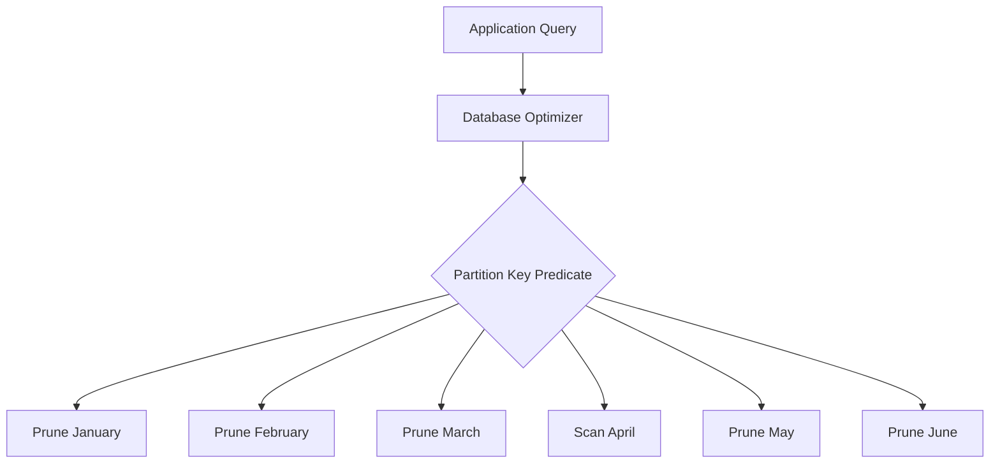
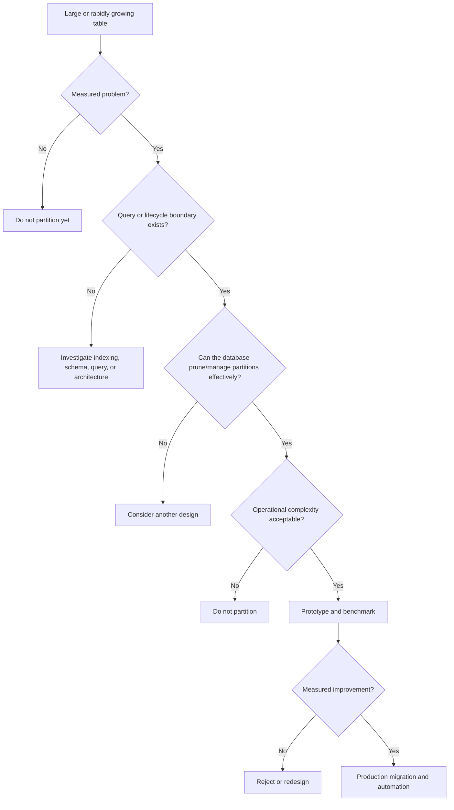

# 02- Why Partition Tables

## Overview

Partitioning is a database design technique for dividing a large logical table into smaller physical partitions while retaining a single logical interface for queries and application code.

The primary reason to partition a table is **not simply that it contains many rows**. Partitioning becomes valuable when the physical organization of data can be aligned with query patterns, data lifecycle requirements, maintenance operations, or workload distribution.

For a production backend system, partitioning can provide:

- Reduced query work through partition pruning.
- Faster retention and archival operations.
- Smaller maintenance units.
- More manageable indexes.
- Better operational control over very large tables.
- A foundation for handling high-volume time-series or event data.

Partitioning also introduces complexity. Every partition can have its own indexes, statistics, storage footprint, and lifecycle. Poor partition design can increase planning overhead, complicate migrations, and provide little or no performance benefit.

The engineering goal is therefore:

> **Partition when physical data segmentation provides a measurable operational or performance advantage that justifies the additional complexity.**

## Why Large Tables Become Difficult to Operate

A table containing a few thousand rows is usually easy to query and maintain.

At hundreds of millions or billions of rows, operations become substantially more expensive.

Consider an audit table:

```text
audit_events
────────────────────────────────────────────
2024:  180 million rows
2025:  320 million rows
2026:  250 million rows
────────────────────────────────────────────
Total: 750 million rows
```

A query such as:

```sql
SELECT *
FROM audit_events
WHERE created_at >= TIMESTAMPTZ '2026-08-01'
  AND created_at < TIMESTAMPTZ '2026-09-01';
```

is logically interested in only one month of data.

Without partitioning, the database may still need to work against a single enormous table and its associated indexes.

With appropriate range partitioning:

```text
audit_events
├── audit_events_2024_01
├── audit_events_2024_02
├── ...
├── audit_events_2026_07
├── audit_events_2026_08  ← relevant
└── audit_events_2026_09
```

the optimizer can potentially eliminate partitions that cannot contain matching rows.

This is **partition pruning**.

## The Main Reasons to Partition

The strongest reasons generally fall into four categories:

| Reason | Benefit |
|---|---|
| Query pruning | Avoid accessing irrelevant partitions |
| Data lifecycle | Drop, detach, archive, or manage old data efficiently |
| Maintenance | Operate on smaller physical units |
| Workload organization | Align physical storage with access or distribution patterns |

Performance is only one of these reasons.

In many production systems, **data lifecycle management is the strongest justification for partitioning**.

## Partition Pruning

Partition pruning allows the database optimizer to determine which partitions cannot contain rows satisfying a query predicate.

Suppose a table is partitioned by month:

```text
events
├── January
├── February
├── March
├── April
├── May
└── June
```

The application executes:

```sql
SELECT COUNT(*)
FROM events
WHERE created_at >= DATE '2026-04-01'
  AND created_at < DATE '2026-05-01';
```

The optimizer can potentially prune every partition except April.



The benefit increases as the ratio between the total dataset and the relevant subset increases.

For example:

```text
1 billion total rows
10 million rows in requested time range

Without pruning:
Potentially consider the full table

With effective pruning:
Consider only the relevant partition
```

However, partition pruning is not guaranteed merely because a table is partitioned. The query predicate must provide information that allows the optimizer to eliminate partitions.

## Data Lifecycle Management

One of the strongest reasons to partition large tables is managing data over time.

Consider an application that retains audit events for 24 months.

A conventional implementation might use:

```sql
DELETE FROM audit_events
WHERE created_at < now() - INTERVAL '24 months';
```

Deleting a large number of rows can create substantial work:

- Row-level deletion.
- Index maintenance.
- WAL generation.
- Vacuum requirements.
- Disk activity.
- Long-running transactions.
- Potential replication lag.
- Increased database contention.

With time-based partitions, expired data can be represented as an entire partition.

```text
audit_events
├── 2024-01
├── 2024-02
├── ...
├── 2026-07
├── 2026-08
└── 2026-09
```

When `2024-01` expires, the system can potentially operate on that partition as a unit.

For example:

```sql
DROP TABLE audit_events_2024_01;
```

Dropping a partition is fundamentally different from deleting millions of individual rows.

The exact operational procedure depends on the database, retention requirements, replication architecture, backup strategy, and whether the data must first be archived.

## Partitioning for Archival

Partitioning can provide a clean boundary between active and historical data.

A production lifecycle might look like:

```text
               Recent Data
                   │
                   ▼
            Active Partition
                   │
                   ▼
            Older Partition
                   │
                   ▼
              Archive Data
                   │
                   ▼
           Retention Expired
                   │
                   ▼
              Remove Data
```

For example:

```text
PostgreSQL
    │
    ├── Current partitions → frequently queried
    │
    ├── Historical partitions → infrequently queried
    │
    └── Expired partitions → archive/drop
```

This can be particularly useful for:

- Audit logs.
- Application events.
- Metrics.
- Transactions.
- Clickstream data.
- IoT events.
- Job execution history.
- Security events.

The application can continue querying the logical table while operational tooling manages the physical partitions.

## Partitioning for Maintenance

Very large tables can make routine maintenance expensive.

Examples include:

- Index creation.
- Index rebuilding.
- Statistics maintenance.
- Vacuum-related operations.
- Bulk data loading.
- Data deletion.
- Archival.
- Validation.

Partitioning creates smaller maintenance boundaries.

Instead of:

```text
One 2 TB table
       │
       ▼
Maintenance operation
       │
       ▼
Large operational impact
```

the system may have:

```text
200 GB partition
200 GB partition
200 GB partition
...
```

Maintenance can potentially be performed on individual partitions rather than the entire dataset.

This does not mean every maintenance operation automatically becomes faster. The database's specific implementation and workload must still be evaluated.

## Partitioning and Index Size

Indexes on very large tables can become substantial consumers of:

- Disk space.
- Memory.
- I/O bandwidth.
- Write capacity.
- Maintenance time.

Partitioning divides the physical data and therefore commonly results in partition-local indexes.

For example:

```text
events
├── events_2026_07
│   └── tenant_created_idx
├── events_2026_08
│   └── tenant_created_idx
└── events_2026_09
    └── tenant_created_idx
```

This can make individual index structures smaller and easier to manage.

However, partitioning does **not** eliminate the need for indexes.

A query may still require an efficient index inside the selected partition.

## Partitioning vs Indexing

Partitioning and indexing operate at different levels.

| Technique | Primary Question |
|---|---|
| Partitioning | Which physical subset should be considered? |
| Indexing | How should rows within that subset be located? |
| Both | Which subset should be considered and how should matching rows be found? |

Consider:

```sql
SELECT id, tenant_id, created_at
FROM events
WHERE tenant_id = 42
  AND created_at >= DATE '2026-08-01'
  AND created_at < DATE '2026-09-01';
```

If the table is partitioned by `created_at`, the database can first prune irrelevant partitions.

Inside the August partition, an index such as:

```sql
CREATE INDEX events_2026_08_tenant_created_idx
ON events_2026_08 (tenant_id, created_at);
```

may then efficiently locate the required rows.

The resulting execution strategy can be conceptually represented as:

```text
Query
  │
  ▼
Partition pruning
  │
  ▼
August partition
  │
  ▼
Index access
  │
  ▼
Matching rows
```

## Partitioning for Query Workloads

Partitioning is especially valuable when queries naturally target a subset of the data.

Examples:

```sql
WHERE created_at >= ...
  AND created_at < ...
```

```sql
WHERE event_date = ...
```

```sql
WHERE tenant_group = ...
```

```sql
WHERE region IN (...)
```

A strong partition key usually has a relationship with the workload.

| Workload | Potential Partition Key |
|---|---|
| Time-series events | `created_at` |
| Audit history | `created_at` |
| Transaction history | `transaction_date` |
| Regional datasets | `region` |
| Tenant workloads | `tenant_id` or tenant group |
| Even key distribution | Hash of a stable key |

The key should be selected from **actual workload characteristics**, not merely from the columns available in the schema.

## Why Time-Based Partitioning Is Common

Time is an effective partitioning dimension because many backend datasets naturally grow over time.

Examples include:

- Orders.
- Payments.
- Logs.
- Events.
- Metrics.
- Audit records.
- Notifications.
- Job history.

A table can be organized as:

```text
events
├── 2026-01
├── 2026-02
├── 2026-03
├── 2026-04
├── 2026-05
├── 2026-06
├── 2026-07
└── 2026-08
```

This provides two important properties:

1. Queries can often prune partitions using time predicates.
2. Retention can operate on complete time ranges.

This combination makes time-based partitioning particularly attractive for high-volume append-oriented workloads.

## Partitioning for Write Management

Partitioning can also influence write distribution.

With range partitioning by time:

```text
Incoming events
      │
      ▼
Current timestamp
      │
      ▼
Current partition
```

Most writes target the newest partition.

This is useful for lifecycle management but can also create a **hot partition**.

For extremely high write rates, a single current partition may become a contention point.

Hash partitioning can distribute writes:

```text
Incoming rows
      │
      ▼
Hash(partition key)
      │
 ┌────┼────┐
 ▼    ▼    ▼
 P0   P1   P2
```

The choice depends on the workload.

A senior engineer should ask:

> Is the primary problem data lifecycle, query pruning, or write distribution?

The answer strongly influences the partitioning strategy.

## Partitioning and Table Growth

Partitioning does not reduce the total amount of data stored.

If the application generates:

```text
100 million rows/month
```

partitioning does not turn that into less data.

Instead, it changes how the data is physically organized:

```text
Unpartitioned:

Large Table
└── 1.2 billion rows


Partitioned:

Table
├── 100 million
├── 100 million
├── ...
└── 100 million
```

The total row count remains approximately the same.

The benefit comes from making subsets of that data easier to access and manage.

## Partitioning and Large Deletes

Large deletes are a common trigger for partitioning.

Consider:

```sql
DELETE FROM application_events
WHERE created_at < DATE '2025-01-01';
```

If hundreds of millions of rows match, the operation can have significant side effects.

Potential consequences include:

- Large transaction size.
- Increased WAL.
- Index modifications.
- Table bloat.
- Vacuum pressure.
- Replication lag.
- Long execution time.

Partitioning can turn the retention operation into a partition-level operation.

Conceptually:

```text
DELETE millions of rows
        │
        ▼
High database work


vs.


DROP expired partition
        │
        ▼
Operate on one physical object
```

This is one of the strongest practical arguments for partitioning large retention-driven datasets.

## Partitioning and Bulk Loading

Partitioning can also make bulk ingestion easier to organize.

For example, an event ingestion system may receive data for different dates.

```text
Kafka
  │
  ▼
Consumer
  │
  ├── 2026-08-01 → partition 01
  ├── 2026-08-02 → partition 02
  └── 2026-08-03 → partition 03
```

A backend system using Kafka and Celery may process events asynchronously and insert them into the appropriate logical table.

The database then routes rows to the corresponding physical partition.

Partitioning does not automatically increase ingestion throughput, but it can provide useful physical boundaries for high-volume ingestion systems.

## Partitioning and Backend Applications

The application should generally interact with the logical table rather than hard-code partition names.

For example, a FastAPI service should query:

```sql
SELECT id, tenant_id, created_at
FROM events
WHERE tenant_id = $1
  AND created_at >= $2
  AND created_at < $3;
```

rather than:

```sql
SELECT id, tenant_id, created_at
FROM events_2026_08
WHERE tenant_id = $1;
```

The database should normally own partition routing.

This keeps the application decoupled from physical storage layout.

The same principle applies to Django and other ORM-based applications.

## Partitioning and ORMs

Partitioning is primarily a database concern, even when the application uses an ORM.

A Django application can conceptually continue working with:

```python
Event.objects.filter(
    tenant_id=tenant_id,
    created_at__gte=start,
    created_at__lt=end,
)
```

The database determines the physical partitions involved.

However, operational tasks may require explicit database-level management:

- Creating partitions.
- Creating partition indexes.
- Dropping expired partitions.
- Attaching existing tables.
- Performing migrations.
- Monitoring partition sizes.
- Handling default partitions.

ORM support varies, so production partition management should not be assumed to be completely abstracted away.

## Partitioning and PostgreSQL

PostgreSQL supports declarative partitioning using:

```sql
PARTITION BY RANGE
PARTITION BY LIST
PARTITION BY HASH
```

Example:

```sql
CREATE TABLE orders (
    id BIGINT GENERATED ALWAYS AS IDENTITY,
    customer_id BIGINT NOT NULL,
    total_amount NUMERIC(12, 2) NOT NULL,
    created_at TIMESTAMPTZ NOT NULL
) PARTITION BY RANGE (created_at);
```

A monthly partition can then be created:

```sql
CREATE TABLE orders_2026_08
    PARTITION OF orders
    FOR VALUES FROM ('2026-08-01') TO ('2026-09-01');
```

The application continues to use:

```sql
SELECT *
FROM orders
WHERE created_at >= DATE '2026-08-01'
  AND created_at < DATE '2026-09-01';
```

The database handles routing and pruning.

## Partitioning and Query Plans

Never assume partitioning improved a query without inspecting the execution plan.

For PostgreSQL:

```sql
EXPLAIN (ANALYZE, BUFFERS)
SELECT COUNT(*)
FROM orders
WHERE created_at >= DATE '2026-08-01'
  AND created_at < DATE '2026-09-01';
```

Validate:

- Which partitions were accessed.
- Whether irrelevant partitions were pruned.
- Whether the expected indexes were used.
- Actual versus estimated rows.
- Buffer reads.
- Execution time.
- Planning time.

A partitioned design should be evaluated using production-like data volumes and realistic query distributions.

## Partitioning Does Not Solve Every Performance Problem

Partitioning should not be used to compensate for poor query design.

For example:

```sql
SELECT *
FROM orders
WHERE customer_name ILIKE '%john%';
```

If the table is partitioned by `created_at` and the query does not restrict `created_at`, partitioning may provide little benefit.

Other problems may actually be caused by:

- Missing indexes.
- Non-SARGable predicates.
- Inefficient joins.
- Excessive result sets.
- N+1 queries.
- Poor cardinality estimates.
- Incorrect data types.
- Excessive ORM queries.

The optimization hierarchy should generally be:

```text
Understand workload
        │
        ▼
Measure query performance
        │
        ▼
Inspect execution plan
        │
        ▼
Fix query/schema/index problems
        │
        ▼
Evaluate partitioning
        │
        ▼
Validate with realistic workload
```

Partitioning should be an engineering response to an identified problem, not a default database configuration.

## Partition Count Matters

Partitioning creates additional database objects and metadata.

Too few partitions may provide insufficient lifecycle or pruning benefits.

Too many partitions can increase:

- Planning overhead.
- Metadata management.
- Index management.
- Backup complexity.
- Monitoring complexity.
- Migration complexity.
- Operational failure modes.

For example:

```text
1 partition
    ↓
Limited segmentation


12 monthly partitions
    ↓
Often manageable


100,000 partitions
    ↓
Potentially significant operational overhead
```

The optimal number depends on the database engine, version, workload, partition size, and operational model.

## Production Automation

Partitioned systems should automate partition lifecycle operations.

For time-based partitioning, automation should typically:

1. Create future partitions before they are needed.
2. Verify partition creation succeeded.
3. Monitor for missing partitions.
4. Archive or remove expired partitions.
5. Record operational results.
6. Alert on failures.

A Kubernetes CronJob, Celery task, database scheduler, or cloud scheduler can perform these tasks.

The important property is that partition management should not depend on a developer remembering to execute SQL manually.

## Missing Future Partitions

One of the most dangerous operational problems in time-based partitioning is failing to create a future partition.

Consider:

```text
Existing:
2026-07
2026-08

Current date:
2026-09

Incoming event:
2026-09-01
```

If there is no partition capable of accepting the row, the insert may fail.

This can turn a database maintenance oversight into an application outage.

A production system should:

- Pre-create partitions.
- Monitor partition coverage.
- Alert before the next boundary.
- Test the automation.
- Define an operational recovery procedure.

## Partitioning and High Availability

Partitioning does not provide high availability by itself.

A partitioned PostgreSQL database still requires appropriate:

- Replication.
- Failover.
- Backups.
- Point-in-time recovery.
- Monitoring.
- Disaster-recovery procedures.

Partition management operations should also be included in the operational model.

For example, a partition creation failure may not immediately affect reads but can later cause ingestion failures.

Monitoring must therefore cover both **database availability** and **partition lifecycle health**.

## Partitioning and Disaster Recovery

Partitioned tables remain part of the database's logical data model.

Disaster-recovery procedures should account for:

- Partition definitions.
- Partition data.
- Partition indexes.
- Constraints.
- Retention policies.
- Automation configuration.
- Migration history.

After restoration, validate that:

```text
Logical table
    │
    ├── Expected partitions exist
    ├── Constraints are intact
    ├── Indexes exist
    ├── Data is accessible
    └── Partition automation works
```

A restore that brings back table data but leaves partition-management automation broken can create a delayed production failure.

## Cost Considerations

Partitioning can reduce operational cost when it enables:

- Smaller maintenance operations.
- Faster retention workflows.
- Reduced I/O through partition pruning.
- More targeted operational work.
- Easier archival.

But it also introduces costs:

- Additional indexes.
- Additional database objects.
- More storage metadata.
- More automation.
- More monitoring.
- More complicated schema migrations.
- Increased engineering complexity.

Partitioning should therefore be evaluated using measurable operational and performance benefits.

## Common Mistakes and Pitfalls

### Partitioning Solely Because the Table Is Large

Large row counts alone do not prove that partitioning is required.

First measure:

- Query latency.
- Table growth.
- Index size.
- Maintenance duration.
- Retention cost.
- I/O.
- CPU utilization.

### Choosing a Key That Does Not Match Query Patterns

Partitioning by `created_at` is not particularly useful for a workload that almost never filters by `created_at`.

The partition key should reflect actual access patterns.

### Assuming Partitioning Replaces Indexes

Partition pruning narrows the physical search space.

Indexes still provide efficient access within that space.

### Creating Excessive Numbers of Partitions

Partition-per-user designs or very fine-grained time partitions can create excessive operational complexity.

Evaluate partition count before implementation.

### Forgetting Partition Automation

Manual partition creation is a production risk.

Automate creation, retention, monitoring, and alerting.

### Ignoring Historical Queries

A design optimized for current data must still handle queries that span multiple partitions.

For example:

```sql
SELECT COUNT(*)
FROM events
WHERE created_at >= DATE '2024-01-01'
  AND created_at < DATE '2026-01-01';
```

This may require accessing many partitions.

Partitioning does not make broad historical queries free.

### Treating Partitions as Security Boundaries

Partitioning does not replace:

- Authorization.
- Tenant isolation.
- Database permissions.
- Row-level security.

A partition is a storage organization mechanism, not an authorization mechanism.

## When Partitioning Is Usually Justified

Partitioning is a strong candidate when several of the following are true:

- The table is very large or growing rapidly.
- Data naturally divides into meaningful ranges.
- Queries frequently target those ranges.
- Data has clear retention requirements.
- Large deletes are expensive.
- Maintenance operations are becoming difficult.
- Indexes have become operationally expensive.
- The database can effectively prune partitions.
- Partition lifecycle can be automated.

## When Partitioning Is Usually Not Justified

Avoid partitioning when:

- The table is small enough to operate normally.
- Query performance is already acceptable.
- There is no natural partition key.
- Queries rarely filter on the candidate key.
- Retention operations are inexpensive.
- The expected benefit is theoretical rather than measured.
- Operational complexity would exceed the expected benefit.

## Production Decision Framework

Use the following decision process before partitioning:



The important principle is that partitioning should follow measurement.

## Production Checklist

Before introducing partitioning, verify:

- [ ] The actual performance or operational problem is measured.
- [ ] Query patterns are understood.
- [ ] A suitable partition key exists.
- [ ] Partition pruning is expected for important queries.
- [ ] Partition size has been estimated.
- [ ] Partition count has been estimated.
- [ ] Index strategy has been designed.
- [ ] Retention and archival requirements are defined.
- [ ] Future partition creation is automated.
- [ ] Expired partition handling is automated.
- [ ] Monitoring and alerting are implemented.
- [ ] Migration and backfill procedures are tested.
- [ ] Rollback strategy is defined.
- [ ] Backup and disaster-recovery procedures are validated.
- [ ] Production-like benchmarks have been completed.

## Interview Perspective

A strong senior-level answer to "Why partition a table?" should go beyond "to improve performance."

A better answer is:

> Partitioning divides a large logical table into smaller physical units. It is useful when data has a natural segmentation, such as time ranges, and when queries or lifecycle operations can exploit that segmentation. Partition pruning can reduce the amount of data considered by a query, while partition-level operations can make retention and maintenance significantly easier. Partitioning is not a replacement for indexing, does not automatically improve every query, and introduces additional operational complexity.

Common interview traps include:

- Saying partitioning always improves performance.
- Treating partitioning as a replacement for indexes.
- Confusing partitioning with sharding.
- Ignoring partition-key selection.
- Ignoring partition count.
- Ignoring retention and lifecycle management.
- Assuming the application should query individual partitions directly.
- Failing to mention measurement and execution plans.

## Key Takeaways

- **Partition tables when physical data segmentation solves a measured performance, maintenance, workload-distribution, or data-lifecycle problem.**
- **Partition pruning can reduce query work, but only when the partition key aligns with query predicates and the optimizer can eliminate irrelevant partitions.**
- **Time-based partitioning is particularly valuable for high-volume data with predictable retention and archival requirements.**
- **Partitioning complements indexes rather than replacing them, and broad queries can still touch many partitions.**
- **Partitioning introduces operational responsibilities such as partition creation, retention, monitoring, migrations, and disaster recovery.**