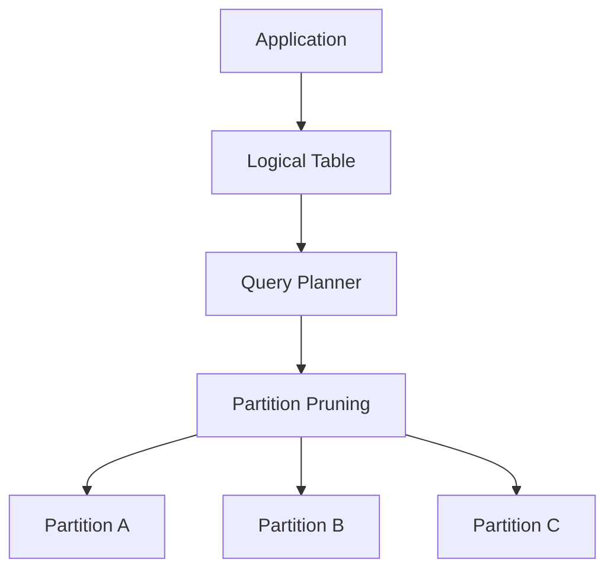
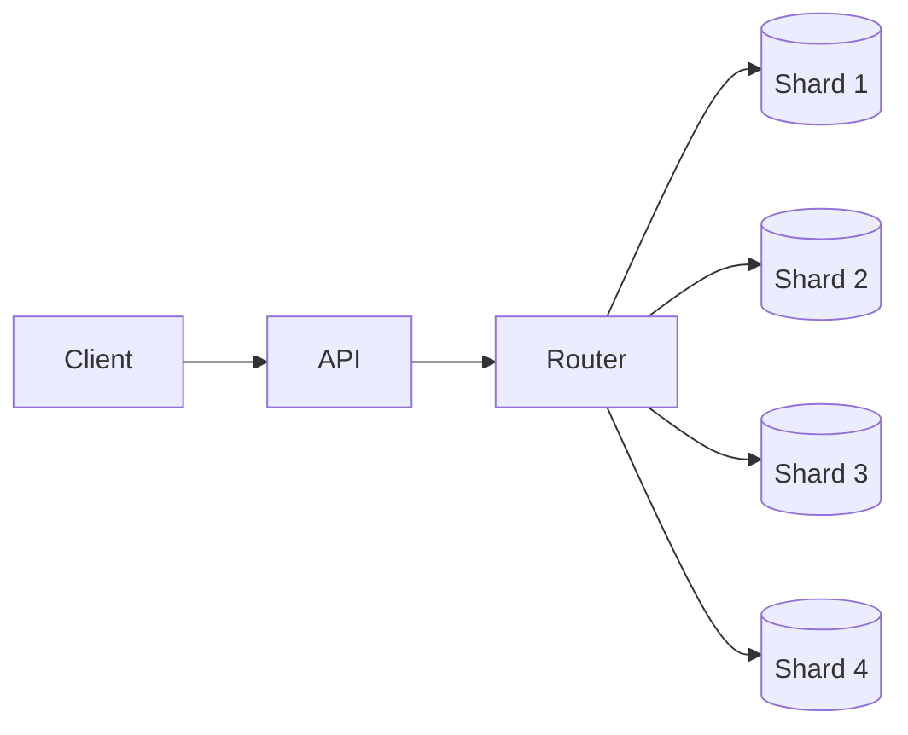
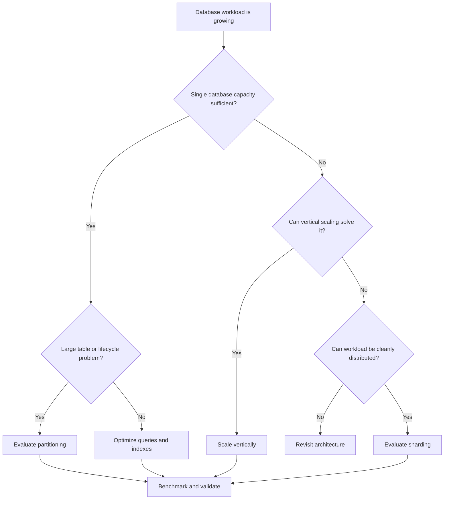

# 03- Partitioning vs Sharding

## Overview

Partitioning and sharding both divide data, but they solve different scaling problems.

**Partitioning** divides a logical table into smaller physical partitions within a database system. The database generally exposes the partitions through one logical table and remains responsible for routing queries and writes.

**Sharding** distributes data across multiple independent database instances or nodes. The application, database middleware, or distributed database layer must determine which shard contains the required data.

The distinction matters because the operational complexity is very different:

```text
Partitioning
    One database
        │
        └── One logical table
              ├── Partition A
              ├── Partition B
              └── Partition C


Sharding
    Multiple database nodes
        │
        ├── Database A
        ├── Database B
        └── Database C
```

Partitioning is usually considered when a single database can still provide the required capacity but a large table needs better physical organization, query pruning, or lifecycle management.

Sharding becomes relevant when a single database instance is itself approaching a fundamental capacity, throughput, storage, or isolation limit.

## Core Difference

| Characteristic | Partitioning | Sharding |
|---|---|---|
| Distribution | Within a database system | Across database nodes/instances |
| Logical table | Usually one logical table | Usually multiple physical databases or logical shards |
| Routing | Primarily database-managed | Application, middleware, or distributed database |
| Main goal | Manage and optimize large tables | Scale beyond one database node |
| Query pruning | Common | Shard routing can avoid unrelated nodes |
| Operational complexity | Moderate | High |
| Cross-segment queries | Usually straightforward | Potentially expensive |
| Failure domain | Generally one database | Multiple independent database failure domains |
| Scaling storage | Limited by underlying database | Can scale across nodes |
| Scaling write throughput | Limited by database architecture | Can distribute writes |
| Typical use case | Large time-series table | Massive multi-tenant workload |

The key distinction is:

> **Partitioning divides data inside a database; sharding distributes data across databases or database nodes.**

## Why Partitioning Exists

Partitioning addresses problems associated with very large tables.

Consider:

```text
orders
├── 2024
├── 2025
└── 2026
```

A database can use the partition key to determine which physical partitions may contain relevant rows.

For example:

```sql
SELECT COUNT(*)
FROM orders
WHERE created_at >= DATE '2026-08-01'
  AND created_at < DATE '2026-09-01';
```

If the table is range-partitioned by `created_at`, the database may prune partitions outside the requested range.

Partitioning is particularly useful for:

- Large append-oriented tables.
- Time-series data.
- Retention-based datasets.
- Large historical datasets.
- Partition-level maintenance.
- Partition-level archival or deletion.

## How Partitioning Works

A partitioned table presents a logical interface:

```text
Application
    │
    ▼
orders
    │
    ├── orders_2026_07
    ├── orders_2026_08
    └── orders_2026_09
```

The application can continue querying:

```sql
SELECT *
FROM orders
WHERE created_at >= DATE '2026-08-01'
  AND created_at < DATE '2026-09-01';
```

The database optimizer determines which partitions are relevant.

Conceptually:



The important property is that the database remains responsible for the physical layout.

## How Sharding Works

Sharding distributes rows across separate database nodes.

For example:

```text
Application
    │
    ▼
Shard Router
    │
    ├── Shard 0
    ├── Shard 1
    ├── Shard 2
    └── Shard 3
```

Suppose data is distributed using:

```text
hash(tenant_id) % 4
```

Then:

```text
tenant_id = 101 → Shard 1
tenant_id = 102 → Shard 2
tenant_id = 103 → Shard 0
tenant_id = 104 → Shard 3
```

The exact routing algorithm depends on the sharding architecture.

Unlike ordinary table partitioning, the application or a routing layer may need to know where data lives.

## Sharding Architecture

A typical backend architecture might look like:



The router may determine the target shard from:

- Tenant ID.
- Customer ID.
- Account ID.
- Hash of a stable identifier.
- Geographic region.
- Another carefully selected shard key.

A strong shard key should distribute workload while preserving locality for common queries.

## Partitioning vs Sharding in Practice

Consider a SaaS application with:

```text
10 million tenants
10 billion events
```

A first design might partition the event table by time:

```text
events
├── 2026-01
├── 2026-02
├── ...
└── 2026-12
```

This can help with:

- Time-based queries.
- Retention.
- Archival.
- Partition pruning.

If the database itself cannot handle the workload even after query, index, schema, and partitioning improvements, the architecture may move toward sharding:

```text
Shard 1
├── tenants ...
└── events ...

Shard 2
├── tenants ...
└── events ...

Shard 3
├── tenants ...
└── events ...
```

Partitioning and sharding can also be combined.

## Combining Partitioning and Sharding

Large systems may use both techniques.

For example:

```text
                     Application
                          │
                    Shard Router
                          │
          ┌───────────────┼───────────────┐
          ▼               ▼               ▼
       Shard A         Shard B         Shard C
          │               │               │
       events           events           events
          │               │               │
      ┌───┼───┐       ┌───┼───┐       ┌───┼───┐
      ▼   ▼   ▼       ▼   ▼   ▼       ▼   ▼   ▼
     Jan Feb Mar      Jan Feb Mar      Jan Feb Mar
```

Here:

- **Sharding** distributes data across database nodes.
- **Partitioning** organizes data within each node.

This can provide independent scaling dimensions, but it also multiplies operational complexity.

## Choosing Between Partitioning and Sharding

Start with the smallest mechanism that solves the measured problem.

A practical decision hierarchy is:

```text
Query problem
     │
     ▼
Optimize SQL
     │
     ▼
Optimize indexes/schema
     │
     ▼
Consider partitioning
     │
     ▼
Optimize database configuration
     │
     ▼
Scale vertically
     │
     ▼
Consider read replicas/caching
     │
     ▼
Consider sharding
```

This is not a rigid sequence for every architecture, but it reflects an important engineering principle:

> Do not introduce distributed database complexity before simpler scaling mechanisms have been evaluated.

## When Partitioning Is a Better Fit

Partitioning is generally preferable when:

- A single database has sufficient overall capacity.
- The problem is a very large table.
- Queries frequently filter by a natural partition key.
- Data has clear retention boundaries.
- Large deletes are expensive.
- Historical data can be separated logically.
- Partition-level maintenance is valuable.

Example:

```text
Audit events
    │
    ├── Current month
    ├── Previous months
    └── Historical months
```

A time-based partitioning strategy is often a natural fit.

## When Sharding Is a Better Fit

Sharding becomes more attractive when:

- A single database cannot provide sufficient write throughput.
- Storage requirements exceed practical single-node limits.
- CPU or I/O capacity is exhausted.
- Workloads can be distributed across independent nodes.
- Tenants or customers can be isolated naturally.
- Horizontal database scaling is required.
- Failure or workload isolation between groups is valuable.

For example:

```text
Tenant A → Shard 1
Tenant B → Shard 1
Tenant C → Shard 2
Tenant D → Shard 3
```

The shard key should be selected based on the dominant access pattern.

## Shard Key Selection

Shard-key selection is one of the most important decisions in a sharded architecture.

A good shard key should generally provide:

- High cardinality.
- Even distribution.
- Stable values.
- Predictable routing.
- Locality for common queries.
- Low risk of creating a hot shard.

For a multi-tenant system, `tenant_id` is often a candidate.

```sql
SELECT *
FROM orders
WHERE tenant_id = $1
  AND created_at >= $2
  AND created_at < $3;
```

This query can potentially be routed directly to the tenant's shard.

A poor shard key can produce severe imbalance:

```text
Shard 1 → 10% traffic
Shard 2 → 10% traffic
Shard 3 → 10% traffic
Shard 4 → 70% traffic  ← hot shard
```

Horizontal scaling is ineffective if one shard receives most of the workload.

## Partition Key vs Shard Key

The two keys can be different.

For example:

```text
Shard key:
tenant_id

Partition key:
created_at
```

This produces:

```text
tenant_id → determines database node

created_at → determines partition within that node
```

This is often a powerful combination for multi-tenant event systems.

For example:

```text
tenant_id = 42
created_at = 2026-08-20

        │
        ▼
Shard routing
        │
        ▼
Shard 3
        │
        ▼
August partition
```

The architecture provides both horizontal distribution and time-based physical organization.

## Query Routing

Partitioning generally allows applications to remain unaware of physical partitions.

```sql
SELECT *
FROM events
WHERE created_at >= $1
  AND created_at < $2;
```

The database handles partition selection.

Sharding may require explicit routing:

```python
def shard_for_tenant(tenant_id: int, shard_count: int) -> int:
    return tenant_id % shard_count
```

A production implementation is typically more sophisticated because naive modulo routing makes shard movement difficult.

A routing layer might instead use:

```text
Tenant ID
   │
   ▼
Shard map
   │
   ▼
Database endpoint
```

The shard map can support controlled reassignment of tenants or key ranges.

## Cross-Shard Queries

Cross-partition queries are often relatively straightforward inside one database.

For example:

```sql
SELECT COUNT(*)
FROM events
WHERE created_at >= DATE '2026-01-01'
  AND created_at < DATE '2026-09-01';
```

The database can access multiple partitions within the same database system.

Cross-shard queries are more complicated.

Suppose:

```text
Shard 1 ──┐
Shard 2 ──┤
Shard 3 ──┤──> Aggregate
Shard 4 ──┘
```

A query may need to execute against every shard and merge the results.

Conceptually:

```text
Application
    │
    ├── Query → Shard 1 → Result 1
    ├── Query → Shard 2 → Result 2
    ├── Query → Shard 3 → Result 3
    └── Query → Shard 4 → Result 4
                       │
                       ▼
                    Merge
```

This introduces:

- Network latency.
- Partial failure handling.
- Fan-out.
- Result merging.
- Increased resource usage.
- More complicated pagination.
- More complicated transactions.

A query that naturally targets one shard is therefore much easier to operate than a query that fans out across all shards.

## Distributed Transactions

Partitioning inside one database generally allows the database's normal transaction machinery to operate across partitions, subject to the database's partitioning capabilities and constraints.

Sharding can make transactions substantially harder.

Consider:

```text
Transaction
   │
   ├── Shard 1
   └── Shard 2
```

If both shards must commit atomically, a distributed transaction protocol or application-level coordination may be required.

This increases:

- Latency.
- Failure modes.
- Operational complexity.
- Recovery complexity.

A strong sharding architecture therefore attempts to keep transactional boundaries within a single shard whenever possible.

## Referential Integrity

Partitioning generally preserves the database's normal relational model, although exact foreign-key and constraint behavior depends on the database implementation.

Sharding can make cross-shard referential integrity difficult or impossible to enforce with ordinary database constraints.

For example:

```text
users → Shard 1

orders → Shard 2
```

A normal foreign key cannot necessarily enforce a relationship between independent database instances.

Production systems may instead use:

- Application-level validation.
- Service-owned data boundaries.
- Synchronous APIs.
- Event-driven consistency.
- Carefully designed ownership rules.

This is one reason shard boundaries should align with domain boundaries whenever possible.

## Availability and Failure Domains

Partitioning does not inherently provide database high availability.

If all partitions exist on one database instance:

```text
Database
├── Partition A
├── Partition B
└── Partition C
```

a database failure can affect all partitions.

Sharding creates independent database nodes:

```text
Shard 1
Shard 2
Shard 3
Shard 4
```

A failure in one shard can potentially affect only a subset of tenants or data.

However, this does not mean sharding automatically provides high availability. Each shard still requires its own:

- Replication.
- Failover.
- Backups.
- Monitoring.
- Disaster recovery.
- Capacity management.

A common architecture is:

```text
Shard 1
├── Primary
└── Replica

Shard 2
├── Primary
└── Replica

Shard 3
├── Primary
└── Replica
```

## Operational Complexity

The operational difference becomes significant as the system grows.

| Operational Area | Partitioning | Sharding |
|---|---|---|
| Schema changes | More complex than unpartitioned tables | Potentially much more complex |
| Backups | Usually centralized | Per-shard or distributed |
| Monitoring | Partition-aware | Shard- and node-aware |
| Failover | Database-level | Potentially per shard |
| Capacity planning | Partition growth | Per-shard balancing |
| Data migration | Partition movement | Shard rebalancing |
| Transactions | Usually local | Potentially distributed |
| Query routing | Database-managed | Application/middleware responsibility |
| Incident response | Moderate complexity | High complexity |

Sharding should therefore be treated as an architectural commitment, not merely a database configuration option.

## Rebalancing

One of the hardest problems in sharded systems is moving data between shards.

Suppose:

```text
Shard 1 → 80% capacity
Shard 2 → 40%
Shard 3 → 35%
```

A production system may need to move some tenants or key ranges from Shard 1 to other shards.

The process can involve:

1. Selecting data to move.
2. Copying the data.
3. Keeping source and destination synchronized.
4. Updating routing metadata.
5. Switching traffic.
6. Validating consistency.
7. Removing old data.

This can be significantly more complex than managing partitions.

## Hot Partitions vs Hot Shards

Both architectures can suffer from skew.

### Hot Partition

With time-based partitioning:

```text
2026-08 → 95% writes
2026-07 → 5%
Older → 0%
```

The current partition may become the hot physical object.

### Hot Shard

With tenant-based sharding:

```text
Shard 1 → 15%
Shard 2 → 20%
Shard 3 → 60%  ← hot shard
Shard 4 → 5%
```

The hot shard may exhaust CPU, I/O, connections, or storage capacity while other shards remain underutilized.

Both problems require workload analysis and capacity planning.

## Connection Management

Sharding changes backend connection management significantly.

With one PostgreSQL database:

```text
FastAPI
   │
   ▼
Connection Pool
   │
   ▼
PostgreSQL
```

With many shards:

```text
FastAPI
   │
   ├── Pool → Shard 1
   ├── Pool → Shard 2
   ├── Pool → Shard 3
   └── Pool → Shard N
```

If every application instance maintains a large connection pool to every shard, connection counts can grow rapidly.

For example:

```text
100 application instances
×
20 shards
×
10 connections/shard
=
20,000 database connections
```

The exact numbers depend on architecture, but the multiplication effect is important.

Production sharded systems should carefully design:

- Connection pool sizing.
- Routing.
- Pool creation strategy.
- Timeouts.
- Connection limits.
- Proxy usage.
- Failure handling.

## Backend Service Design

Sharding often affects application architecture more deeply than partitioning.

With partitioning:

```text
Django/FastAPI
      │
      ▼
Logical table
      │
      ▼
Database partitioning
```

With sharding:

```text
Django/FastAPI
      │
      ▼
Shard routing layer
      │
      ├── Database A
      ├── Database B
      └── Database C
```

The routing layer may become a critical infrastructure component.

It must handle:

- Correct shard selection.
- Unknown tenants.
- Shard migration.
- Connection failures.
- Timeouts.
- Retry behavior.
- Routing metadata.
- Observability.

## Caching Implications

Redis can complement either architecture.

For example:

```text
API
 │
 ├── Redis
 │
 └── Database
```

Caching can reduce database load but should not be used to hide an incorrect partitioning or sharding strategy.

In a sharded system, cache keys should also preserve tenant or ownership boundaries:

```text
tenant:42:order:123
```

This helps prevent accidental cross-tenant cache collisions.

## Kafka and Sharding

Kafka can complement a sharded database architecture.

A common pattern is:

```text
Application
    │
    ▼
Kafka
    │
    ├── Consumer → Shard 1
    ├── Consumer → Shard 2
    └── Consumer → Shard 3
```

Partitioning Kafka topics and sharding databases are separate concepts.

Do not assume:

```text
Kafka partition = database shard
```

They can be aligned intentionally, but they have different semantics and operational requirements.

## Migration Strategy

Moving from an unpartitioned table to partitioning is usually a database migration problem.

Moving from one database to multiple shards is an architectural migration.

A typical sharding migration might involve:

```text
Existing database
       │
       ▼
Define shard key
       │
       ▼
Create shard infrastructure
       │
       ▼
Backfill data
       │
       ▼
Dual-write or synchronize
       │
       ▼
Validate
       │
       ▼
Switch reads
       │
       ▼
Switch writes
       │
       ▼
Remove old path
```

Migration design must account for:

- Data consistency.
- Backfill throughput.
- Cutover strategy.
- Rollback.
- Duplicate writes.
- Idempotency.
- Referential relationships.
- Observability.

## Monitoring

Partitioned databases should monitor:

- Partition sizes.
- Partition growth.
- Query latency.
- Partition pruning effectiveness.
- Missing future partitions.
- Retention failures.
- Index sizes.
- Maintenance duration.

Sharded systems additionally need:

- Per-shard CPU.
- Per-shard memory.
- Per-shard I/O.
- Per-shard storage.
- Per-shard query latency.
- Per-shard connection usage.
- Shard imbalance.
- Routing failures.
- Cross-shard query frequency.
- Rebalancing activity.

A useful dashboard might look conceptually like:

```text
Database Fleet
├── Shard 1
│   ├── CPU
│   ├── Storage
│   ├── Connections
│   └── Latency
├── Shard 2
│   ├── CPU
│   ├── Storage
│   ├── Connections
│   └── Latency
└── Shard 3
    ├── CPU
    ├── Storage
    ├── Connections
    └── Latency
```

## Security Considerations

Partitioning and sharding do not automatically provide application-level authorization.

A multi-tenant application should enforce tenant isolation independently.

For example:

```sql
SELECT *
FROM orders
WHERE tenant_id = $1
  AND id = $2;
```

The tenant boundary should be validated at the service layer and, where appropriate, reinforced by database controls.

With sharding, incorrect routing can become a security problem:

```text
Request for Tenant A
       │
       ▼
Incorrect shard routing
       │
       ▼
Tenant B data
```

Production systems should use:

- Explicit tenant context.
- Authorization checks.
- Parameterized SQL.
- Controlled routing metadata.
- Audit logging.
- Defense-in-depth tenant isolation.

## Cost Considerations

Partitioning generally adds moderate complexity to an existing database.

Sharding can multiply infrastructure costs:

```text
1 database
    ↓
N database instances
    ↓
N monitoring targets
    ↓
N backup/recovery concerns
    ↓
N capacity-management concerns
```

Additional costs can include:

- Database instances.
- Storage.
- Replicas.
- Monitoring.
- Network traffic.
- Engineering time.
- Operational tooling.
- Data migration infrastructure.

Sharding should therefore have a clear scaling or isolation justification.

## Common Mistakes and Pitfalls

### Mistaking Partitioning for Sharding

They are related but not equivalent.

Partitioning divides data within a database system.

Sharding distributes data across independent database nodes or instances.

### Sharding Too Early

A small or medium application usually does not need sharding merely because it expects growth.

First evaluate:

- Query optimization.
- Indexing.
- Schema design.
- Vertical scaling.
- Read replicas.
- Caching.
- Partitioning.
- Archival.

### Choosing a Shard Key Based Only on Cardinality

A high-cardinality key is useful, but distribution alone is insufficient.

The key must also align with query locality.

A perfectly balanced shard key that forces every request to fan out across all shards is still a poor design.

### Using Naive Modulo Routing

A strategy such as:

```text
shard = tenant_id % 4
```

works initially but makes changing the shard count difficult because many keys change destination.

Production systems commonly use mechanisms such as:

- Consistent hashing.
- Virtual shards.
- Explicit shard maps.
- Range assignments.

### Allowing Cross-Shard Transactions Everywhere

Cross-shard transactions can severely increase complexity.

Prefer domain and data models that keep transactional operations within one shard.

### Ignoring Hot Shards

Average shard utilization can look healthy while one shard is overloaded.

Always monitor distribution per shard.

### Building Application Logic Around Physical Partitions

With database partitioning, applications should generally query the logical table rather than hard-code physical partition names.

### Assuming Sharding Solves Query Performance

Sharding can distribute workload, but a poorly indexed query remains poorly indexed on every shard.

### Ignoring Rebalancing

A sharded system must have a strategy for moving data as tenants, traffic, and storage grow.

## Decision Matrix

| Situation | Partitioning | Sharding |
|---|---:|---:|
| Large single table | Strong candidate | Usually unnecessary |
| Time-based retention | Strong candidate | Not inherently required |
| Partition pruning | Strong candidate | Possible through routing |
| Single database near storage limit | Limited | Strong candidate |
| Single database near write-throughput limit | Limited | Strong candidate |
| Multi-tenant isolation | Possible | Often useful |
| Simple transactions | Strong fit | Prefer single-shard transactions |
| Cross-dataset reporting | Easier | More difficult |
| Operational simplicity | Better | Worse |
| Horizontal database scaling | No | Yes |
| Independent failure domains | Limited | Stronger |
| Rebalancing required | Usually simpler | Significant concern |

## Practical Decision Guide

Use this sequence when evaluating a production system:



The decision should be driven by measured constraints rather than expected future scale alone.

## Production Checklist

### Before Partitioning

- [ ] Identify the actual performance or operational problem.
- [ ] Analyze query patterns.
- [ ] Select a partition key aligned with workload.
- [ ] Estimate partition count and size.
- [ ] Design indexes per partition.
- [ ] Automate partition lifecycle.
- [ ] Validate pruning with execution plans.
- [ ] Test retention and archival workflows.

### Before Sharding

- [ ] Identify the single-node bottleneck.
- [ ] Evaluate vertical scaling and read replicas.
- [ ] Evaluate partitioning and caching.
- [ ] Select a stable shard key.
- [ ] Validate workload distribution.
- [ ] Design shard routing.
- [ ] Define transaction boundaries.
- [ ] Define cross-shard query behavior.
- [ ] Design rebalancing.
- [ ] Design backup and disaster recovery per shard.
- [ ] Implement per-shard monitoring.
- [ ] Test partial-shard failures.
- [ ] Define migration and rollback procedures.

## Interview Perspective

A strong senior-level answer should emphasize that partitioning and sharding solve different scaling problems.

A concise answer is:

> **Partitioning divides a logical table into smaller physical partitions within a database system. It is useful for large tables, partition pruning, maintenance, and data lifecycle management. Sharding distributes data across independent database nodes, primarily to scale beyond the capacity of a single database or to isolate workloads. Sharding introduces substantially more complexity around routing, transactions, cross-shard queries, rebalancing, monitoring, and disaster recovery.**

Common interview follow-ups include:

- Why not shard immediately?
- How do you select a shard key?
- What happens when a shard becomes hot?
- How do cross-shard queries work?
- How do you handle distributed transactions?
- How do you rebalance shards?
- Can partitioning and sharding be combined?
- How does tenant-based sharding work?
- What happens if the shard router fails?
- How would you migrate an existing database to a sharded architecture?

The strongest answers connect the choice to the actual bottleneck rather than presenting sharding as a generic solution for large datasets.

## Key Takeaways

- **Partitioning organizes a large logical table within a database; sharding distributes data across independent database nodes.**
- **Use partitioning primarily for large-table organization, pruning, maintenance, and lifecycle management; use sharding when a single database cannot meet required capacity or workload isolation.**
- **Shard-key selection must balance even distribution with query locality; a balanced but high-fan-out design can still perform poorly.**
- **Sharding introduces distributed-system problems such as routing, cross-shard queries, transaction coordination, rebalancing, and per-shard failure handling.**
- **Partitioning and sharding can be combined, but the added complexity should be justified by measured scaling requirements.**